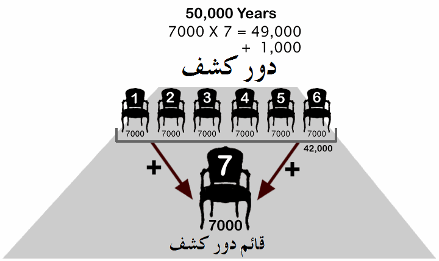

# Hierarchies and Collections

<!-- section 1 (id=662, raw_sort=1): مراتب روحانیۃ -->

## Spiritual Ranks of the Ismaili Hierarchy

The spiritual hierarchy of the Ismaili tradition comprises ten essential ranks, each designating a distinct station of authority and spiritual responsibility within the faith's administrative and esoteric structure. These ranks are arranged in ascending order of spiritual elevation and cosmological significance.

[diagram: Two side-by-side tables enumerating 10 ranks of the Ismaili spiritual hierarchy. Right table (ranks 1-5): Mustajib, Mu'min, Mukasir, Ma'dhun, Da'i Mutlaq. Left table (ranks 6-10): Da'i Balagh, Hujjat, Babiyyat, Imamat (red), Wisayat (red). Annotations on the right margin group ranks 1-4 as 'Da'i Mahsoor' (Limited Missionary) and rank 5 as 'Tayyibi Da'is'. Left margin groups 6 as 'Muhammadi Da'is', 7 as 'Qa'imi Da'is', 8 as 'Baab al-Abwaab', 9 as 'Imams', and 10 as 'Ali'.]
(see ../images/001.png)

*Arabic labels in image:* ⟪ar:مستجیب · مؤمن · مکاسر · ماذون · داعی مطلق · داعی بلاغ · حجت · بابیت · امامت · وصایت · داعی محسور · دعات طیبی · دعات محمدی · دعات قائمی · باب الأبواب · ائمہ · علی⟫

*Note:* Master enumeration of the 10 ranks of the Ismaili spiritual hierarchy with their grouping into successive levels of authority. Pairs with image 002 which gives the corresponding spiritual / cosmological aspect of each rank.

The five lower stations—the Mustajib (respondent), Mu'min (believer), Mukasir (breaker), Ma'dhun (permitted one), and Da'i Mutlaq (absolute summoner)—constitute the foundation of the daʿwa (the summons). These are collectively termed the Limited Missionaries. Above them stand the Da'i Balagh (proclaiming summoner), the Hujjat (proof or sign), and the Bab (gate), whose authority extends over all those beneath them. The uppermost ranks—Imamat and Wisayat (trusteeship)—embody the supreme spiritual authority, with the Imam himself as the ultimate repository of esoteric knowledge and divine guidance.[^cite-1]

## Cosmological Correspondences: The Ghaemi Aspects

Each of the ten ranks possesses a corresponding spiritual and cosmological aspect, which reveals the inner reality beneath the outer form of ecclesiastical office. These aspects, denoted by abstract noun forms ending in "-iyat," connect the visible hierarchy to the invisible worlds of pure intellect and divine emanation.

[diagram: Two side-by-side tables of 10 mystical/cosmological aspects corresponding to the 10 ranks of image 001. Right table (1-5): Imamat Ruhaniya, Nutq Ilahi, Hujjiyat, Hijabiyat, Khayaliyat (blue). Left table (6-10): Fathiyat (blue), Jaddiyat (blue), Inza'iyat, Qa'imiyat (red), Jaththiyat (red). Margin annotations name corresponding spiritual figures or symbols: Fatir, Maryam-figure, Abdullah, Abu Talib, Abd al-Muttalib, Great Eye, Last Eye.]
(see ../images/002.png)

*Arabic labels in image:* ⟪ar:امامت روحانیہ · نطق الٰہی · حجیت · حجابیت · خیالیت · فتحیت · جدیت · انزعیت · قائمیت · جثثیت · فاطر · میم مریمیہ · عبد اللہ · ابو طالب · عبد المطلب · عین عظیمہ · عین آخرۃ⟫

*Note:* Pairs with image 001—gives the spiritual / cosmological correspondence (-iyat abstract noun forms) for each of the 10 ranks, and the named figures/symbols associated with each block. The color highlighting (red on Imamat/Wisayat in 001 and Qa'imiyat/Jaththiyat here) indicates the highest tier.

The lowest aspect is Imamat Ruhaniya (spiritual imamate), corresponding to the Mustajib; the second is Nutq Ilahi (divine speech), embodied in the Mu'min; and the sequence rises through Hujjiyat (the aspect of proof), Hijabiyat (the aspect of veiling), Khayaliyat (the aspect of imagination), Fathiyat (the aspect of opening or unveiling), Jaddiyat (the aspect of paternal grandeur), and Inza'iyat (the aspect of descent). The two highest aspects—Qa'imiyat (the aspect of the rising one) and Jaththiyat (the aspect of corporeality or embodied reality)—correspond to the Qa'im and the ultimate resurrection.[^cite-2] These correspondences map the visible ecclesiastical order onto the intelligible cosmos, revealing that each office participates in a particular mode of divine emanation.

<!-- section 2 (id=545, raw_sort=2): جثہ ابدائیۃ اور شخص فاضل -->

## The Primordial Body and the Virtuous Person

In the first creation of humanity, there emerged alongside the first human beings and their leader-Imam a celestial assembly of twenty-eight souls, each brought forth from twenty-eight pits (ḥufar) in the sacred precinct of the Baytullah. These souls constitute the jaththa al-ibdāʾiyya (the primordial or originary body), and they embody the quintessence of the human race and the perfection of both the heavenly and earthly realms.[^cite-3] They are called the ḥurūf al-muʿjam (the letters of the alphabet), for they correspond to the twenty-eight phases of the lunar month. Just as an Imam stands at the head of his followers, each of these twenty-eight was arranged in hierarchical order, with the first among them—called the shakhṣ al-fāḍil (the virtuous person or exemplary individual)—standing at the apex of their assembly.

This virtuous person surpassed all twenty-seven others in subtlety, purity, and nobility of rank. He occupied a rank among humanity comparable to the jewel among minerals, the date among plants, and the most noble among beasts. He served as the ḥijāb Ādam al-ibdāʾiyya (the veil of the primordial Adam), mediating between the lower and higher worlds. The scholars have explained the disparity between this pre-eminent figure and his companions thus: "If the twenty-seven had their dwelling-place in the mansion of jacinth (the precious stone yāqūt), the rest of creation would dwell in stone; yet if this one figure dwelt in jacinth, those twenty-seven companions would have their abode in common stone."

The first to commence this succession was Fazil, called Kaimarūth ʿalayhi al-salām (upon him be peace), who inaugurated the cycle of these primordial luminaries.

### Unity and Unification: The Path of the Virtuous Person

The learned and virtuous person embarked upon his spiritual journey by first contemplating himself without intermediary explanation, then observing his own species, the heavens above him, the flowing waters, and the alternation of day and night. Through this inquiry he came to perceive that an originator (Mubdīʿ) existed for him, for all creation, and for the worlds—one utterly unlike and transcendent above all things. Thus he negated from his own essence, from his species, and from all existence every attribute of divinity (ṣifat al-ilāhiyya), and he affirmed to his Creator the attribute of divinity (al-ilāhiyya) itself and bore witness to divine uniqueness (al-waḥdāniyya) through glorification and sanctification (al-tasbīḥ wa-al-taqdīs).

Thereupon, the divine substances (al-mawād al-ilāhiyya) became connected to him, and he received the resplendent lights (al-anwār al-shaʿshaʿāniyya) and the angelic reinforcements (al-taʾyīdāt al-malakūtiyya). Through this union, he attained knowledge of what was and what shall be (ʿilm mā kāna wa-al-yakūn) and achieved the rank of unity (martabat al-waḥda), the first perfection (kamāl awwal). In the material world, he thus attained the station of the first emanator (al-Munbaʿith al-Awwal) and came to be called the ʾibtidāʾ (the beginning or origination), i.e., he reached the status of origination in the physical realm and of the first intellect (al-ʿAql al-Awwal) in the world of initiation.[^cite-4]

Having attained this station, he summoned the twenty-seven others to the unity of Allah (tawhīd, tanzīh, wa-tajrīd—unification, transcendence, and abstraction). These souls responded swiftly to his call and accepted the primordial covenant (al-Misāq). He then instructed them in the distinction between the lawful and the prohibited, prescribed for them the rites of worship, and commanded them to convey these teachings to others and to follow the path of matrimonial propriety.

### The Ordering of Ranks Among the Twenty-Eight

From among the twenty-eight, he selected sixteen souls to stand in positions of authority during his spiritual sovereignty, of which one became his Bab (gate), one his Hujjat (proof), one his daʿwa-bearer, and one his Da'i Mutlaq (absolute summoner). The remaining twelve he designated as the ḥujaj al-laylī (nocturnal proofs or hidden proofs) and retained in his inner presence, keeping them forever in his company. The remaining eleven souls he dispersed among the islands of the world, appointing each to a specific territory and commanding them to summon the inhabitants to divine truth. These eleven are known as the ḥujaj al-nahārī (diurnal or manifest proofs).[^cite-5]

The jaththa al-ibdāʾiyya (the primordial body) ranks as the most excellent of ranks after the virtue of the person of intellect himself. Immediately following come the ḥujaj al-laylī (the nocturnal proofs), who are accounted the best among their peers. Because of their excellence, the virtuous person preserved them from dispersion. The ḥujaj al-nahārī (the diurnal proofs) differ in their scope: the diurnal proofs extend through both the visible and hidden dimensions, while the nocturnal proofs remain entirely within the hidden realm. These twenty-eight souls are those of whom Allah Most High says:

> ⟪quran 3:18⟫
> ⟪ar:‏شَهِدَ ٱللَّهُ أَنَّهُۥ لَآ إِلَهَ إِلَّا هُوَ وَٱلْمَلَٓئِكَةُ وَأُو۟لُوا۟ ٱلْعِلْمِ قَآئِمًۢا بِٱلْقِسْطِ ۚ لَآ إِلَهَ إِلَّا هُوَ ٱلْعَزِيزُ ٱلْحَكِيمُ ‎⟫
> *Allah bears witness that La ilaha illa Huwa (none has the right to be worshipped but He), and the angels, and those having knowledge (also give this witness); (He is always) maintaining His creation in Justice. La ilah illa Huwa (none has the right to be worshipped but He), the All-Mighty, the All-Wise.*

These ⟪ar:اولوالعلم⟫ (the people possessed of knowledge) are the twenty-eight souls born without ordinary generation—the jaththa al-ibdāʾiyya (primordial body)—who have been made possessors of knowledge (ʿilm) and remain forever in righteousness because of this knowledge.

### Two Categories of Proofs

| Rank | Title | Number |
|------|-------|--------|
| 1 | A virtuous person (Imam) | 1 |
| 2 | Gate | 1 |
| 3 | Proof | 1 |
| 4 | Proclaiming Summoner | 1 |
| 5 | Absolute Summoner | 1 |
| 6 | Nocturnal Proofs (ḥujaj al-laylī) | 12 |
| 7 | Diurnal Proofs (ḥujaj al-nahārī) | 11 |
| | **Total Primordial Body** | **28** |

In the period of kashf (unveiling or manifestation), the islands and the sacred presences are not separate places; rather, as in the period of concealment (dawr al-sitr), the two are distinguished in function. In the era of kashf, the islands possess the same quality of refinement, subtlety, and knowledge as the honored presences themselves. Of the twelve nocturnal proofs, one is designated the island where the Imam himself abides in presence; the remaining eleven are designated as islands wherein the Imam's direct presence is not manifest, yet his guidance flows through them. The distinction signifies that the virtuous person retained the nocturnal proofs within his immediate presence and sent forth the diurnal proofs to distant regions of the world, removing them from his immediate circle.

### The Light of the Word in the Primordial Body

Each Imam, each Qa'im (the rising one), and each primordial body possesses invariably twenty-eight souls arranged according to the kalima lā ilāha illā Allah (the declaration "There is no god but Allah"):[^cite-6]

| Number | Composition |
|--------|-------------|
| 2 | A virtuous person and a gate |
| 3 | The virtuous person, gate, and those dwelling in honored presences, plus those dwelling in islands |
| 4 | Virtuous person + gate + nocturnal proofs + diurnal proofs |
| 7 | Virtuous person + gate + proof + proclaiming summoner + absolute summoner + nocturnal proofs + diurnal proofs |
| 12 | The twelve nocturnal proofs (the hidden proofs of the Imam) |
| 28 | The complete declaration: *There is no god but Allah* |

It is related that the 400th cycle of our second cosmic era saw the birth of the jaththa al-ibdāʾiyya (the primordial body) in Sarandīp (Sri Lanka).

<!-- section 3 (id=546, raw_sort=3): شخص فاضل کی خلافت کلی -->

## The Complete Vicegerency of the Virtuous Person

When the virtuous person of the primordial body (al-shakhṣ al-fāḍil) initiates the daʿwa (the summons), his first intention is to prepare a successor—a khalīfa (vicegerent)—who shall be his true spiritual son. The learned virtuous person occupies, in the natural world, the rank of the First Intellect; in the same manner, his son stands in the position of the First Intellect as well. Thus the primordial body established the principle that every head of a circle shall eternally occupy the place of ʾibtidāʾ (origination or emanation), while his successor shall occupy the place of the khalīfat al-nubuwwa (the vicegerency of prophethood). By way of example: the Imam occupies the place of origination, and the Bab occupies the place of the Prophet. The true son of origination is called the Munbaʿith (the Emanator).

| Principle | Corresponding Rank |
|-----------|-------------------|
| Origination (ʾibtidāʾ) | First Intellect (al-ʿAql al-Awwal) |
| Primordial Body (al-jaththa al-ibdāʾiyya) | Son as Acting Vicegerent (al-khalīfa al-ʿāmil) |
| Imam | Gate (al-Bab) |

The virtuous person, having prescribed the Imamate upon his son, departed from this world in the company of his twenty-seven companions and ascended to the station of intellect, becoming the lord of this realm. He attained the rank of the First Intellect (al-ʿAql al-Awwal). Now he shall hold this station until he produces a vicegerent equal to himself. These twenty-eight souls—including the gate who grew up alongside him—shall reach that rank together with him.[^cite-7]

### The Nature of the Complete Vicegerent

Although the virtuous person appointed his son as vicegerent in his stead, this son is not his equal in rank. He was only partially established in that position. A partial vicegerent is partial in his authority; a complete vicegerent is complete in his authority. The son shall govern until he produces a body equal to his own—a consummation that can occur only at the end of the final cosmic cycle. Though many intermediate cycles and primordial bodies shall arise, each with its own hierarchy, all of them shall be partial vicegerents in comparison to him. The true complete vicegerent of the virtuous person can only be the Qa'im al-Qiyāma (the ultimate rising one), who shall appear at the end of all cycles.

| Rank | Identity |
|------|----------|
| A (First Station) | The Virtuous Person (al-Shakhṣ al-Fāḍil) |
| Or (Final Station) | The Complete Qa'im (al-Qa'im al-Kāmil) |

**Note:** The first of these, occupying rank A, possesses the highest station by reason of precedence; yet the complete vicegerency (al-khilāfa al-kāmila) can only be fulfilled by the Final One (al-Akhir). The vicegerent is called the *son of completeness* (ibn al-tamām).

### The Progression Through the Intellects

When the Emanator (the person of the first primordial body) prepares his complete vicegerent, he and all those in his hierarchy ascend to the Ninth Intellect. The Ninth Intellect and those in its circle then pass to the Eighth Intellect, the Eighth to the Seventh, the Seventh to the Sixth, the Sixth to the Fifth, the Fifth to the Fourth, the Fourth to the Third, and finally the Third and those in its circle pass into the realm of the Second Intellect—a realm celebrated as Paradise, where "no eye has perceived, no ear has heard, and no human heart has conceived" the delights therein. This station is impossible to define by reason of its transcendence, honor, joy, and majesty, yet it may be described approximately.

The development and perfection of the Emanator (the virtuous person of the first cycle) shall be consummated only when he brings forth his complete vicegerent, the Qa'im al-Kāmil (the final rising one). All stations between him and the Final One are, by comparison, partial; both he and the Final One are, in themselves, complete. The virtuous person of the first primordial body possesses ten cosmic stations (marātib), which shall be unveiled progressively until the end of the world. Each shall appear sequentially in this realm, rise in succession to the Emanator, and take its seat beside him. When all ten have ascended, the complete vicegerent—the Qa'im al-Qiyāma (the ultimate rising one)—shall manifest, drawing the entire created order into the spiritual realm.[^cite-8]

For this reason, Allah declares in the Qur'an:

> ⟪ar:إِنَّ ٱلَّذِينَ كَذَّبُوا۟ بِـَٔايَـٰتِنَا وَٱسْتَكْبَرُوا۟ عَنْهَا لَا تُفَتَّحُ لَهُمْ أَبْوَٰبُ ٱلسَّمَآءِ وَلَا يَدْخُلُونَ ٱلْجَنَّةَ حَتَّىٰ يَلِجَ ٱلْجَمَلُ فِى سَمِّ ٱلْخِيَاطِ ۚ وَكَذَٰلِكَ نَجْزِى ٱلْمُجْرِمِينَ⟫
> Verily those who belie Our signs and are stiff-necked against them, the gates of heaven shall not be opened for them, nor shall they enter the Garden until the camel shall enter the eye of the needle. Thus do We recompense the guilty.
> — **Quran 7:40** *(from image; see _provenance.json for validation)*
(image preserved at ../images/003.png)

*Note:* Quran widget image — pasted as image rather than HTML widget. finalize validates against HQAyats via suggested_citation.

The virtuous person's influence permeates all ten great cosmic eras (al-adwār al-ʿaẓīma), and therefore he occupies the rank of the First Intellect in this natural world, mediating in the realm of unity (ʿālam al-waḥda).[^cite-9]

[diagram: A composite teaching diagram. Top-left: a circle with rays labeled 'اصحاب اموار' (Companions of Affairs) on a black background with 10 yellow circle stages emanating from a center, marked 'اول کا ابداعیہ' (Originator of First), 'آخری کا ابداعیہ' (Originator of Last), 'مکمل' (Complete), and 'قائم القیامہ' (Qa'im al-Qiyamah). The central red caption reads 'تلک عشرۃ کاملہ' (Those are ten complete — Quran 2:196). Right: a vertical column of 9 numbered circles ascending from base labels 'جنت الماوا' (Garden of Refuge) and 'سدرۃ المنتھی' (Lote-tree of the Boundary) up through stages with grey-shaded uppermost positions marked 'حاش'.]
(see ../images/004.png)

*Arabic labels in image:* ⟪ar:اصحاب اموار · اول کا ابداعیہ · آخری کا ابداعیہ · مکمل · قائم القیامہ · تلک عشرۃ کاملہ · جنت الماوا · سدرۃ المنتھی · الف · حاش · 28 دائرہ · مصحب کاصل⟫

*Note:* Major composite diagram. The 'Those are ten complete' phrase is the Quranic Tilka 'Asharatun Kamilah from Surah 2:196—completes the count of fasting days but here used metaphorically for the 10 complete ranks. Combines the original/last origination scheme with the Jannat al-Ma'wa / Sidrat al-Muntaha eschatology and a 28-circle progression.

<!-- section 4 (id=664, raw_sort=4): جثوں کی ترتیب -->

## The Arrangement and Cycles of the Primordial Bodies

Imam Jaʿfar al-Ṣādiq disclosed to Umm al-Nadā that one great cosmic cycle (dawr) has already elapsed. Since that time, cycles numbered from three to ninety-nine have passed, and we have completed seven rounds of the 400th cycle. We are now approaching the conclusion of the seventh seven-cycle. When the Resurrection (al-Qiyāma) emerges, all these ages—totaling 400,000 years—shall be gathered together.

Thus, 399 cycles have passed, and we now dwell in the 400th cycle. The body (jaththa) that shall appear subsequent to this cycle—the 401st—shall be assembled as the final and most comprehensive of the 400 cycles, and its magnificence shall be such that it shall manifest within the Kaʿba itself. Prior to this time, only the first primordial body of the initial cycle had appeared within the House of Allah.

Throughout these 400 cycles, there exist 40 supernal bodies (jathāt) that appear in every tenth cycle (at the 40th, 240th, 10th, 290th, and 400th positions). The excellence of these ten bodies exceeds that of all others; yet none can rival the first primordial body of the second cycle. Even greater than this (the first body of the second cycle) is the one that appeared at the beginning of the first cycle, whose equal shall be only his complete vicegerent, who shall manifest at the conclusion of the final cycle.

All these supernal bodies are stationed in sacred places. At the close of the second cycle, the Sultan who comes shall gather his own cycle and establish his seat upon the horizon of the first cycle. Upon arriving there, he shall receive a second throne. When the third cycle commences, the Emanator (the body of the first cycle) shall bestow upon the third cycle the last two primordial bodies, and the third shall become the vicegerent of the second part. This process shall continue until the final cycle is revealed, at which point its vicegerent shall be the complete vicegerent of the first cycle.[^cite-10]

**Note:** The second cycle is now preparing to bring forth a third cycle equal to itself.

*(Lessons from Anwar al-Ṭāʾifa, transmitted by Sayyidunā Muḥammad ibn Ṭāhir)*

<!-- section 5 (id=547, raw_sort=5): افق عاشر -->

## The Tenth Horizon and the Stations of Ascent

When the son of the virtuous person (al-shakhṣ al-fāḍil) was established in his father's place by explicit designation (naṣṣ), he called forth to this world according to his initial design and summoned all people to the unification of Allah (tawhīd), that he might rescue and liberate those souls ensnared in the river of Ḥūlī (the abyss of forgetfulness) and held captive in chains. His second design was to produce his own successor (khalīfa) from among his followers, as his father had prepared him.

Having prepared his son and completed his term of service, he shall lead his community to the horizon (ʿufq) of the Emanator—the Tenth Horizon (ʿufq al-ʿāshir). Since the Emanator is himself his father, this descendant shall depart from the world and return to his father's barrier (barzakh), where a seat awaits him. He shall not attain the station of the complete vicegerent; that station belongs only to the founder of the final cycle.

In the same way, all who pass from this world in the rank of their successors have had seats established upon the Tenth Horizon. The Tenth Horizon is the barrier (barzakh) where all these departed souls shall go and find rest. For this reason, Allah Most High says in the Qur'an:

> ⟪ar:لَعَلِّى أَعْمَلُ صَـٰلِحًۭا فِيمَا تَرَكْتُ ۚ كَلَّآ ۚ إِنَّهَا كَلِمَةٌ هُوَ قَآئِلُهَا ۖ وَمِن وَرَآئِهِم بَرْزَخٌ إِلَىٰ يَوْمِ يُبْعَثُونَ⟫
> That I may do good in that which I have left behind. By no means! It is but a word that he speaks; and before them is a barrier till the Day of Resurrection.
> — **Quran 23:100** *(from image; see _provenance.json for validation)*
(image preserved at ../images/005.png)

*Note:* Quran widget image — pasted as image. The verse mentions Barzakh (the partition between worlds), directly relevant to the chapter on ranks and assemblies.

### The Tenth Horizon as Seat of the Imams

The Tenth Horizon (ʿufq ʿāshir) is the barrier (barzakh) for all the Imams and their vicegerents (nuqabāʾ). Each Qa'im (the rising one) receives from the hands of the Qa'im who precedes him the names and designations of all the Imams. Each Sab'a (the author or inaugurator of each seven-year period) receives the forms of the six Imams who preceded him, drawn from the Barrier of the Tenth Horizon. In the same manner, the Qa'im of every thousand years (Ṣāḥib al-Alf) receives his thousand-year authority from the Tenth Horizon.

Every seven-year period has six seats. When these six seats of a seven-year cycle are completed and the seventh arrives, the seventh of the previous seven-year period becomes the seventh of the following period.

One individual becomes a resident of the seven-year period, and another becomes a resident of the following seven-year period. That is, their principal purpose is to prepare the next leader. Although there exist six Imams between the two, these six Imams are the partial vicegerents (khalāʾif juzʾiyya) of the resident of the seven-year period. Only the succeeding one is the complete vicegerent (al-khalīfa al-kāmil) of the first. The same principle applies to all ranks and stations.[^cite-11]

**Principle:** The vicegerent of the partial is partial; the vicegerent of the whole is whole.

[diagram: A weekly-cycle grid. Six rows (1st through 6th week, each labeled with an ordinal in Urdu — پہلا ہفتہ through چھٹا ہفتہ) crossed with six columns labeled A, B, C, D, E, F. Each cell holds Urdu numerals 1-6 forming a stationing pattern. Yellow column highlights mark each diagonal weekly stationer (Stationer of 2nd week (A), of 3rd week (B), …, of 7th week (F)). Top and bottom rows annotate the relation to the 49-period cycle: 'Stationer of next 49' and 'Full Vicegerent of previous 49' both for the 'Alef' and 'Ba' cycles.]
(see ../images/006.png)

*Arabic labels in image:* ⟪ar:اگلے انپاس (49) کا مقیم (ب) · پچھلے انپاس (الف) کا کلی خلیفہ · اگلے انپاس (49) کا مقیم (ت) · پچھلے انپاس (ب) کا کلی خلیفہ · پہلا ہفتہ · دوسرا ہفتہ · تیسرا ہفتہ · چوتھا ہفتہ · پانچواں ہفتہ · چھٹا ہفتہ · دوسرے ہفتہ کا مقیم (A) · تیسرے ہفتہ کا مقیم (B) · چوتھے ہفتہ کا مقیم (C) · پانچویں ہفتہ کا مقیم (D) · چھٹے ہفتہ کا مقیم (E) · ساتویں ہفتہ کا مقیم (F)⟫

*Note:* A schedule diagram of how stationers (مقیم) and full vicegerents (کلی خلیفہ) rotate through six-week cycles within a larger 49-period (انپاس) frame. Highly technical—refinement during Phase 0b should consult the chapter text for the exact cyclic mechanics.

### The Ascent of the Imams to the Tenth Horizon

It is related that when Maulānā Abū Ṭālib occupied the station of Imamate, he designated ʿAlī ibn Abī Ṭālib as his Imam. When ʿAlī attained the station of perfection and completeness, he established a distinct connection with ʿAlī from the rank of trusteeship (al-wiṣāya). When an Imam resolves to depart from this world, his body (jism) ascends to the Tenth Horizon. The Tenth Horizon contains many relationships (ʿalāqāt) connecting it to the Imam:[^cite-12]

| Relationship | Designation |
|--------------|-------------|
| Station of the Week-Master | Ṣāḥib al-Isbūʿ |
| Station of the Eight-Day Master | Ṣāḥib al-Ḥaymān |
| Station of the Tree-Master | Ṣāḥib al-Shajar |
| Station of the Revealer | Ṣāḥib al-Kashf |
| Station of Revelation and Concealment | Ṣāḥib al-Kashf wa-al-Sitr |
| Station of the Era-Master | Ṣāḥib al-ʿAṣr |
| Station of the Thousand-Year Master | Ṣāḥib al-Alf |
| Station of the Primordial-Body Master | Ṣāḥib al-Dawr (Complete Vicegerent of the Tenth Horizon) |
| Station of the Tenth | al-ʿĀshir |

Each elevated rank is the horizon (ʿufq) for the rank below it. The horizon of the Imam is Ṣāḥib al-Isbūʿ (the week-master); when the Imam departs from the world, his body—which he possessed and received from his father—ascends to the Tenth Horizon.

*(Risāla of the Thirteen Questions, transmitted by Sayyidunā ʿAlī ibn Sayyidunā Sulaymān)*

<!-- section 6 (id=548, raw_sort=6): ایک لاکھ چوبیس ہزار صورات -->

## The 124,000 Forms and Their Gathering at the Tenth Horizon

To reach the Barrier of the Tenth Horizon, it is necessary to complete the count of 124,000 forms (ṣūrat) that accumulate over a period of 7,000 years. That is: when the first 7,000 years of the period of kashf (unveiling) have been completed, 124,000 forms shall have been gathered at the Tenth Horizon (in proximity to the barrier or to the primordial body itself).[^cite-13]

[diagram: A small purple-on-white numerology display showing the digit sequence '1 2 4 0 0 0' on the top line and the equation '(1 + 2 + 4 + 0 + 0 + 0 = 7)' on the bottom line.]
(see ../images/007.png)

*Note:* Numerological / place-value teaching aid. The digits 1, 2, 4 (powers-of-two-style) plus padding zeros sum to 7—likely referencing a seven-rank structure in the chapter on ranks.

### The Perfection of the Seven-Thousand-Year Cycle

A Qa'im governing a 7,000-year period possesses six seats of authority (kurāsī). Every thousand years there appears a Qa'im who gathers his thousand-year domain and ascends to the Barrier of the Tenth Horizon. When the seventh millennial Qa'im appears, he embodies the completion of his father's summons and serves as his father's complete vicegerent. The father of this structure is the point (nuqṭa) that appeared at the outset of the 7,000 years and accumulated all the preceding 7,000-year cycles.

Only when these 7,000 years are fully revealed, and the 124,000 forms accumulated during that span are granted to the Qa'im's body (jism), shall a human form be constituted from the substance of these 124,000 shapes. In this constitution, all these forms shall occupy distinct parts of the body: 124 noble forms shall be arrayed throughout, and 1,000 forms (totaling 1,000 × 124 forms) shall be distributed accordingly. This constitutes the bodily form itself, and the soul becomes the soul of this body. Thus the soul of the soul and the form of the ruler both affect this temple. Through this integration, those forms shall now ascend to the highest station (marqā ʿāliya min ʿālam al-ʿāshir). Together, these two components—body and soul as one unified temple—become a single luminous form. When they depart from the 7,000-year period, they shall abide in sacred, abstract, divine intellection alongside their entire community, with no distinction between them and their predecessors save one of precedence. The Qa'im shall take his entire community and establish his seat.

Before his departure, the Qa'im shall designate his 7,000-year son as Imam in his place. These sons who are established as Imams possess the rank of an eternal Imam (imām dāʾim). The true son of the 7,000-year Qa'im—his complete vicegerent—shall appear at the end of the second 7,000-year period and shall accumulate the preceding 7,000 years before him.

In allusion to this principle, the Prophet (upon him be peace) declared:

*There are 124,000 Prophets belonging to Allah.*

Allah Most High says in the Qur'an:

> ⟪ar:قُلْ إِنَّ ٱلْأَوَّلِينَ وَٱلْـَٔاخِرِينَ لَمَجْمُوعُونَ إِلَىٰ مِيقَـٰتِ يَوْمٍ مَّعْلُومٍ⟫
> Say: Surely the former and the latter shall be gathered together for the appointment of a known day.
> — **Quran 56:49** *(from image; see _provenance.json for validation)*
(image preserved at ../images/008.png)

*Note:* Quran widget image. The verses speak of the first and last being gathered at a known appointment—directly relevant to the chapter on assemblies. Range 56:49-50.

### The Fifty-Thousand-Year Assembly and the Moment of Revelation

The *Day of Revelation* (Yawm al-Kashf) refers to the fifty-thousand-year span of the period of kashf (the age of unveiling). That is: all the forms spanning fifty thousand years, from the beginning to the end of the barrier, shall be brought together and assembled at the moment of the establishment of the period of kashf. Regarding this fifty-thousand-year epoch, Allah Most High declares:

> ⟪ar:تَعْرُجُ ٱلْمَلَـٰٓئِكَةُ وَٱلرُّوحُ إِلَيْهِ فِى يَوْمٍ كَانَ مِقْدَارُهُۥ خَمْسِينَ أَلْفَ سَنَةٍ⟫
> The angels and the Spirit ascend unto Him in a Day the measure of which is fifty thousand years.
> — **Quran 70:4** *(from image; see _provenance.json for validation)*
(image preserved at ../images/009.png)

*Note:* Quran widget image. Famous 'Day of fifty thousand years' verse—pairs with image 010 which decomposes the 50,000 = 7 × 7000 + 1000 numerology.

Similarly, when forty-nine thousand years (7 × 7,000) have elapsed, these six seven-thousand-year periods shall be joined together with their bodies. In this seventh established body, there shall be established the order of the Imams, the prayers, and the believers themselves. The Qa'im's plan shall encompass his entire epoch of fifty thousand years. Thereafter he shall depart and ascend to the rank of the Ninth [Intellect] in the realm of eternal permanence, and his son shall take his place in the true rank of the Tenth.

[diagram: A teaching diagram showing six black chairs numbered 1-6 in a row across the top, each labeled '7000'—together totaling 42,000. Below, two red arrows converge with plus signs onto a seventh chair labeled '7' (also 7000). The seventh chair is captioned 'قائم دور کشف' (Qa'im of the Cycle of Revelation). At the top: '50,000 Years' with the breakdown '7000 × 7 = 49,000 + 1,000', and the chapter heading 'دور کشف' (Cycle of Revelation).]
(see ../images/010.png)

*Arabic labels in image:* ⟪ar:دور کشف · قائم دور کشف⟫

*Note:* Numerological decomposition of the 50,000-year period from Quran 70:4 (image 009). Six 7000-year cycles total 42,000; a seventh 7000-cycle ridden by the Qa'im closes the count at 49,000; the remaining 1,000 completes 50,000. The chair metaphor likely signifies seven seats of authority across the cycles.

*(Lessons from Anwar al-Ṭāʾifa, transmitted by Sayyidunā Muḥammad ibn Ṭāhir)*

### The Scattering and the Gathering

Communities are separated that they might be brought together; they are assembled that they might be distinguished and scattered. For this reason, the title of the Imam is *Ṣāḥib al-Jamʿ wa-al-Shattat*—the Collector and the Scatterer.

For this reason, ʿAlī (upon him be peace) said: "Be silent so that you may journey with the angels." Those who depart first wait for those who shall come after, that they might join together.

*(Lessons from Tuḥfat al-Ṣāʾirī, which preserves the letters of al-Muʿjam al-Nawādir, transmitted by Sayyidunā Ḥusayn ibn ʿAbd al-Mālik)*

<!-- section 7 (id=549, raw_sort=7): جد فتح خیال -->

## The Three Modes of Divine Communication: Ancestor, Opening, and Imagination

Allah addresses human beings through three modes and conveys His commands by three distinct methods: through the path of revelation (waḥy), through the path of speaking from behind the veil, and through the path of sending a messenger bearing a visible or audible message.

| Mode | Method | Station |
|------|--------|---------|
| Revelation (al-Waḥy) | Direct transmission | Ancestor (al-Jad) |
| Concealed speech (al-Khiṭāb min warāʾ al-Hijāb) | Speech through veiling | Opening (al-Fatḥ) |
| Messenger (al-Risāla) | Visible or audible messenger | Imagination (al-Khayāl) |

### The Ancestor: Station of Direct Revelation

The first mode is revelation, which constitutes the station of the ancestor (al-jad). This rank exists and maintains sovereignty at all times and epochs, and it stands at the highest of the three stations. Revelation is the word of Allah that proceeds from the Holy Spirit (al-Rūḥ al-Qudus) and is communicated through the ancestor to the one commanded—without any intermediary whatsoever. It is the duty of the ancestor to convey the word of the Imam to the lower degrees of the hierarchy.[^cite-14]

### The Opening: Station of Veiled Speech

The second mode is speech from behind the veil (khiṭāb min warāʾ al-hijāb), which constitutes the station of the opening (al-fatḥ). Through this mode, the divine commandments are revealed concealed within the garment of words. Just as the meanings in the Qur'an are hidden beneath the veil of their literal expression, so too does the opening veils meaning in word. For example: explaining the inner meaning of the term "knowledge" through the outward image of "water" is an act of opening. That is, the task of the opening is to clothe the inner meaning of Allah's message in the vestment of outward words, so that the recipient understands the true content beneath the form.

### The Imagination: Station of the Sensible Messenger

The third mode is the station of the messenger (al-malik al-mursul), who appears in a form visible to the listener or whose voice is heard by the addressee.

The people at the highest three degrees of every rank are called the ancestor (al-jad), the opening (al-fatḥ), and the imagination (al-khayāl) of that rank—and these three serve as intermediaries between the Imam and his Creator. These three intelligences operate within the world of the veiled (ʿālam al-muḥtajabīn). Through these three modes, the Imam of Allah Most High (Imām Allāh taʿālā) is connected to the Imam of the Age. At each level, these three hierarchies function and communicate.[^cite-15]

| Mode | Messenger/Agent | Archangel | Correspondence |
|------|-----------------|-----------|-----------------|
| Imagination (al-Khayāl) | Messenger (Rasūl) | Gabriel (Jibrīl) | Station Rank + 1 |
| Opening (al-Fatḥ) | Speech Behind the Veil | Michael (Mikāʾīl) | Station Rank + 2 |
| Ancestor (al-Jad) | Revelation (Waḥy) | Israfil (Isrāfīl) | Station Rank + 3 |

When the Messenger of Allah (upon him be peace) occupied the rank of Prophet, his ancestor, his opening, and his imagination were distinct individuals who conveyed to him the mysteries of prophethood. When he assumed the rank of Messenger (Rasūl), his ancestor, opening, and imagination became distinct individuals who began to reveal the contents of the Message (al-Risāla) to him. When he attained the rank of Trustee (al-Wasī), his ancestor, opening, and imagination changed into corresponding figures. When he became the Imam, his ancestor, opening, and imagination were separate persons who began to reveal to him the mysteries of the spiritual Imamate (Imāmat al-Rūḥāniyya). These three ranks operate up to the level of Prophethood, not for the awliyāʾ (friends or saints) of Allah.

| Rank | Imagination (al-Khayāl) | Opening (al-Fatḥ) | Ancestor (al-Jad) |
|------|-------------------------|------------------|------------------|
| Muḥammad Muṣṭafā (Messenger) | ʿAbdullāh | Abū Ṭālib | ʿAbd al-Muṭṭalib |
| Sayyidunā ʿAlī ibn Sulaymān | Muḥammad ibn Faḥd | Sayyidnā Jaʿfar | Sayyidnā Sulaymān |

### Two Incidents of Sayyidunā ʿAlī

Sayyidunā ʿAlī (upon him be peace) related that once when he appeared before the court of the governor Awrangzīb (at that time in authority), during the hearing the governor gestured to his gatekeeper to escort ʿAlī out and execute him. As ʿAlī departed with the gatekeeper, he beheld a man on horseback appearing in the form of Sayyidunā Muḥammad ibn Faḥd, who addressed him saying, "Do not fear, nor grieve. I am with you." At that very moment, a disturbance arose in the marketplace; the gatekeeper became separated from ʿAlī, and ʿAlī escaped from that place.

When Awrangzīb had executed the grandson of Dāʾūd ibn Quṭb and left his body exposed in the marketplace to decay, the people urged Sayyidunā ʿAlī to depart from Aḥmadābād and seek refuge elsewhere. ʿAlī responded, "I shall not leave until my Lord commands me." On the first day of Rajab, as he performed his prayers, he heard a voice speaking from the unseen, commanding him to depart from Aḥmadābād. His imagination (al-khayāl) conveyed this command to him.[^cite-16]

*(Lessons from Anwar al-Ṭāʾifa, transmitted by Sayyidunā Muḥammad ibn Ṭāhir)*

<!-- section 8 (id=550, raw_sort=8): محمد و علی کے جد، فتح، خیال -->

## The Ancestor, Opening, and Imagination of Muḥammad and ʿAlī

When the Prophet (upon him be peace) ascended through the ranks to the station of the veil (hijāb), and when his predecessor Maulānā Abū Ṭālib passed away, he became the veil of the Intellect of the Emanator (of the great one) and became the place through which the rays of the Emanator fell upon all things—through his ancestor, his opening, and his imagination. These are spiritual limits; in contrast to them are the physical limits: ʿAbd al-Muṭṭalib, Abū Ṭālib, and ʿAbdullāh.

In the world of the veiled, the letter Mīm (م) became the veil of the Emanator (ʿAyn), and the support of the Emanator came to it through its ancestor, opening, and imagination. In the world of the veil, Muḥammad—who is himself the veil of Mīm (the letter representing the Essence)—received the support through three ambassadors (three transmitted agents): ʿAbd al-Muṭṭalib, Abū Ṭālib, and ʿAbdullāh. In the language of the revealed Law (Sharīʿa), these three ambassadors are Gabriel, Michael, and Israfil.[^cite-17]

**Note:** The gathering of ancestor, opening, and imagination did not occur with the Great Eye (ʿAyn al-ʿAẓīma), but rather with the Qa'im (upon him be peace).

For this reason, ʿAlī remained always silent in the presence of the Messenger of Allah, for the Messenger of Allah (upon him be peace and blessings) and ʿAlī observed silence. The light of the Emanator was connected through the Prophet, and the rays of this light came to ʿAlī through the Prophet. Muḥammad acquired the knowledge of what was and what shall be (ʿilm al-mākān wa-al-yakūn), while ʿAlī the veil possessed only partial knowledge of what has been (the past knowledge). The Messenger of Allah (upon him be peace) gradually elevated ʿAlī through the ranks of Prophethood, and on the Day of Ghadir, he ordained him and led him to the miracle (muʿjiza) of Allah, until Amīr al-Muʾminīn (upon him be peace) advanced to the point where he himself became the place of the fall of the rays of the Emanator and became the veil of the Emanator. Through Muḥammad, the Emanator began to shine and to support and aid him. At that time, ʿAlī also acquired the knowledge of what was and what shall be.[^cite-18]

| Station | Muḥammad | ʿAlī |
|---------|----------|------|
| Ancestor (al-Jad) | ʿAbd al-Muṭṭalib | ʿAbd al-Muṭṭalib |
| Opening (al-Fatḥ) | ʿAbdullāh | Abū Ṭālib |
| Imagination (al-Khayāl) | Abū Ṭālib | Muḥammad |

**Note:** Ḥaḍrat ʿAbdullāh is called Opening (al-Fatḥ) because he died before Abū Ṭālib. In terms of hierarchy, the Opening is Abū Ṭālib and the Imagination is Ḥaḍrat ʿAbdullāh.

For this reason, ʿAbd al-Muṭṭalib, ʿAbdullāh, and Abū Ṭālib did not gather in the body of ʿAlī (upon him be peace), but rather remained in his horizon, so that the three of them would serve as intermediaries for the Great Eye and ʿAlī (upon him be peace) while they were together.

**Note:** Whenever an Imam is established, after his death, his predecessor attains the rank of that Imam (Imagination), and the predecessor of his predecessor becomes an opening (Opening), and the predecessor of that becomes an ancestor (Ancestor).

**Saying regarding the Station of Ḥaḍrat ʿAbdullāh:**

*Abdullah and Allah*

If the diacritical marks (nuqaṭ) are removed from this phrase, then the two become identical, revealing that the station of ʿAbdullāh is with Allah (Abū Ṭālib).

### The Educational Path of Muḥammad (upon him be peace)

**Note:** He became a disciple of the Prophet and received support through his ancestor, opening, and imagination, until he reached the mature station of veiling (hijāb). It is obligatory for every reciters (muʾammī), every trustee (wasī), and every Imam to progress from one rank to the next. As Allah says:

> ⟪ar:وَٱللَّهُ أَخْرَجَكُم مِّنۢ بُطُونِ أُمَّهَـٰتِكُمْ لَا تَعْلَمُونَ شَيْـًٔا وَجَعَلَ لَكُمُ ٱلسَّمْعَ وَٱلْأَبْصَـٰرَ وَٱلْأَفْـِٔدَةَ ۙ لَعَلَّكُمْ تَشْكُرُونَ⟫
> And Allah brought you forth from the wombs of your mothers knowing nothing, and gave you hearing and sight and hearts, that haply you might give thanks.
> — **Quran 16:78** *(from image; see _provenance.json for validation)*
(image preserved at ../images/011.png)

*Note:* Quran widget image.

Muḥammad (upon him be peace) received his education under Maulānā Ubayy ibn Kaʿb, who was called Gabriel. When the Prophet had acquired all knowledge from Ubayy ibn Kaʿb, he was directed to Zayd ibn ʿUmar, who served as a dāʿī in the islands and was himself the embodiment of Michael. When the Messenger of Allah had obtained complete knowledge from Zayd ibn ʿUmar, he was sent to Israfīl, who was superior to him in rank.

| Archangel | Teacher |
|-----------|---------|
| Gabriel (Jibrīl) | Ubayy ibn Kaʿb |
| Michael (Mikāʾīl) | Zayd ibn ʿUmar |
| Israfil (Isrāfīl) | ʿUmar ibn Nawfal |

**The Five Teachers of Muḥammad (upon him be peace)**

**Note:** The Prophet (peace and blessings of Allah be upon him) said, regarding ʿIbn Abī Ṭālib: "I have taken from five, I have given to five, and between me and my Lord are five." These were the five individuals from whom the Messenger of Allah (upon him be peace) received knowledge.

Ubayy ibn Kaʿb possessed a gathering of all the forms that had accumulated from the time of Adam (upon him be peace). The Prophet continued to learn from him until he received from Ubayy ibn Kaʿb the complete gathering of Adam (upon him be peace). Ubayy ibn Kaʿb then entrusted the Messenger of Allah to Zayd ibn ʿUmar, who bore the gathering of Noah. The Prophet continued to learn from them until he received the gathering of Noah. In the same manner, one by one, he obtained the summaries of the logic of all the previous epochs. The final gathering was received from Maulānā Khadīja, who was the great Proof (Hujjat) of Maulānā Abū Ṭālib. She imparted to the Messenger of Allah a gathering, and thus he became Muḥammad, and that was the essence of his conversion to Islam.[^cite-19]

| Ubayy ibn Kaʿb | Zayd ibn ʿUmar | ʿUmar ibn Nāfil | Misra | Khadīja |
|-----------------|-----------------|-----------------|-------|---------|
| Adam's Gathering | Noah's Gathering | Abraham's Gathering | Moses's Gathering | Jesus's Gathering |

**The Five to Whom the Messenger of Allah (upon him be peace) Gave:**

| ʿAlī | Al-Ḥasan | Al-Ḥusayn | Muḥammad al-Bāqir | Muḥammad ibn Ismāʿīl |
|------|----------|----------|-------------------|----------------------|

**The Five That Are Between You and Your Lord:**

| Imagination | Opening | Ancestor | Breath (al-Nafas) | Intellect (al-ʿAql) | Lord |
|-------------|---------|----------|-------------------|-------------------|------|
| Ubayy ibn Kaʿb | Zayd ibn ʿAmr | ʿAmr ibn Nāfil | Misra | Khadīja | Abū Ṭālib |
| ʿAbdullāh | Abū Ṭālib | ʿAbd al-Muṭṭalib | Khalīfat Ṣāḥib al-Kawr | Ṣāḥib al-Kawr | The Tenth |

### The Educational Path of Abraham (upon him be peace)

**Note:** His grandfather, Maulānā Ibrāhīm, similarly established educational standards, for which the Qur'an testifies:

> ⟪ar:فَلَمَّا جَنَّ عَلَيْهِ ٱلَّيْلُ رَءَا كَوْكَبًۭا ۖ قَالَ هَـٰذَا رَبِّى ۖ فَلَمَّآ أَفَلَ قَالَ لَآ أُحِبُّ ٱلْـَٔافِلِينَ
فَلَمَّا رَءَا ٱلْقَمَرَ بَازِغًۭا قَالَ هَـٰذَا رَبِّى ۖ فَلَمَّآ أَفَلَ قَالَ لَئِن لَّمْ يَهْدِنِى رَبِّى لَأَكُونَنَّ مِنَ ٱلْقَوْمِ ٱلضَّآلِّينَ
فَلَمَّا رَءَا ٱلشَّمْسَ بَازِغَةًۭ قَالَ هَـٰذَا رَبِّى هَـٰذَآ أَكْبَرُ ۖ فَلَمَّآ أَفَلَتْ قَالَ يَـٰقَوْمِ إِنِّى بَرِىٓءٌۭ مِّمَّا تُشْرِكُونَ⟫
> *When night covered him, he saw a star and said: 'This is my Lord.' But when it set, he said: 'I like not those that set.' When he saw the moon rising, he said: 'This is my Lord.' But when it set, he said: 'If my Lord does not guide me, I shall surely be among the erring folk.' When he saw the sun rising, he said: 'This is my Lord. This is greater!' But when it set, he said: 'O my people! I am free from what you associate with Allah.'*
> — **Quran 6:76** *(from image; see _provenance.json for validation)*
(image preserved at ../images/012.png)

*Note:* Quran widget image spanning 6:76-78, with the author's annotation mapping the three celestial bodies in Ibrahim's reflections to the three archangels Jibril, Mikail, Israfil. Range citation; finalize will validate via HQAyats.

### The Educational Path of ʿAlī (upon him be peace)

**Note:** In the same manner, the matter of Maulānā ʿAlī's development occurred. He first studied with the Prophet (upon him be peace). After that, he studied with Khadīja, who was the great Proof (Hujjat) of the Imam of the Age, Abū Ṭālib. For this reason, Maulānā ʿAlī was called Ibn Maryam (the son of Mary), because Maryam is Khadīja—that is, Maulānā ʿAlī is the likeness of Jesus, and Khadīja is the example of Mary.

| Maryam (Mary) | ʿĪsā ibn Maryam (Jesus son of Mary) |
|---------------|-------------------------------------|
| Khadīja | ʿAlī |

For this reason, when asked what he used to do with the Prophet (upon him be peace), ʿAlī replied, "When he was silent, he would speak to me; and when I was silent, he would ask me." This refers to the knowledge that Maulānā ʿAlī received from the Messenger of Allah (upon him be peace), regarding which he declared:

*The Messenger of Allah opened for me a thousand doors of knowledge, and from each door a thousand [further] doors were opened.*

*(Lessons from Anwar al-Ṭāʾifa, transmitted by Sayyidunā Muḥammad ibn Ṭāhir)*

<!-- section 9 (id=652, raw_sort=9): خدیجۃ و علی کا اسلام -->

## The Islam of Khadīja and the Islam of ʿAlī

The meaning of Islam (al-islām) is the acceptance of submission—that is, to entrust the assembly of forms to their masters and to submit to them. Maulānā Khadīja

<!-- section 13 (id=552, raw_sort=13): قائم دور کشف -->

## Discovery Round

The body of the first corps is spread over the entire corps. After the death of a Jatha al-Abdayyah, his sons became his partial caliph as an Imam. They have a seat in the horizon. When the 7,000 years of the Kashf period are completed, 124,000 forms are gathered in the horizon of Ashir, which he—the caliph of Jatha Abda'iyya—gives to the Temple of the Seventh Thousand Years. That is, their temple is formed from the forms of the Imams of the last seven thousand years. In the same way, every 7,000 years there is the appearance of a Qa'im (قائم, a Resurrector) that adds up the previous 7,000 years, totaling 124,000. When the Qa'im Saba—the one who will appear after 49,000 years—appears, his glory is great. He not only collects the last seven thousand years, but also the last six lists (each totaling 7,000 years) from Barzakh Asher (برزخ عاشر, the Tenth Barzakh). In contrast, the previous six remain in the palace of the body, while these seventh are the last of established creation. [^cite-1]

*Arabic labels in image:* ⟪ar:دور کشف · قائم دور کشف⟫

### Beginning of the Round of Concealment

Fifty thousand years of the Kashf period are completed, and the period of Sitr (ستر, concealment) begins. When the period of kashf reaches its perfection and the book attains completeness, old age grows throughout the period until laziness increases and defects arise. The Imams and the Ilyas hide behind the veil, and the knowledge of facts is replaced by the knowledge of truth. The Imams go into taqiyya (تقیہ, dissimulation), and the power of the Imams increases as they dominate the world. [^cite-2]

### Facts

In the last 3,000 years of the Kashf period, two types of forms appear. One is the form of revelation (کشفیہ, revelatory), and the other is the form of revelation. These forms will be the future of the concepts of Sitr and will appear in Sitr. There is no place for the Mustawadeen (مستودع, the Entrusted Ones) in the Age of Kashf; only the place of the Mustaqeen (مستقیم, the Established Ones) remains.

In this period of Sitr, Adam (upon him be peace) will be the first to appear, established by the Imam of his time. Adam will call the people to monotheism by command of his Imam and establish the Shariah (شریعہ, revealed law). This period will begin with weakness (old age) and move towards strength (the period of revelation). Adam is in the palace of Salalah (سلالہ). This continues until Adam appoints his successor (Abel and Shish). In this way, over seven thousand years, seven points appear, corresponding to the degrees of birth of a child. Each Natiq (ناطق, Speaker) made his own Shariah and its laws, placing within them symbols and allusions through which the believers could attain spiritual and physical knowledge.

| | Salalah | Sperm | Alaqah | Muzaghah | Bones | Meat | Another Creation |
|---|---|---|---|---|---|---|---|
| Resident | Hind | Hood | Saleh | Ed | Khuzaimah | Abu Talib | Abu al-Qaim |
| Speaker | Adam | Noah | Ibrahim | Moses | Jesus | Muhammad (peace and blessings of Allah be upon him) | Qa'im / Muhammad bin Ismail |
| Guardian | Abel | Sam | Ishaq | Aaron | Yahya | Ali | Mahdi |

### Imams of the Age of Revelation and Sitr

#### Facts

The Imams of Sitr are more numerous than the Imams of the Kashf era. Moreover, the Imams after the Prophet (peace and blessings of Allah be upon him) and Ali are more numerous than the Imams before them. This is because the earlier Imams had divisions of ranks: the levels of prophethood and nubuwwah (نبوۃ, prophecy) were held by the prophets, and the levels of imamate and wills by the imams. But since Imam Husayn, Ali al-Zayn al-Abidin was the first to unite all four ranks, and now there is no distinction between them until the Day of Judgment. Therefore, they gained weight compared to the earlier Imams. [^cite-3]

*(Lessons of Anwar al-Tayfa, Sayyidina Muhammad bin Tahir)*

<!-- section 14 (id=553, raw_sort=14): قائم دور کشف و ستر -->

## The Qa'im of the Cycle of Revelation and Concealment

When 7,000 years have passed, those who come to the Age of Sitr collect the Seven Thousand Years of Sitr. His position as the Natiq (Speaker) is that of the end of the world. In addition, they collect 3,000-year-old forms (Fitriyyah, فتریہ—forms of the Interlude period). In this way, the sum of 10,000 years (3,000 years of distant periods plus 7,000 years of distant Sitr) is obtained from the horizon of the intellect of Ashir (Jatha Abdaya). [^cite-4]

### Vertical Assembly (10,000 Years)

| Period | Speaker |
|---|---|
| 3,000 | 7,000 |

The lower forms of the period were gathered with Imam al-Hind, and the higher forms were gathered with Maulana Hashim (upon him be peace). This temple, which was gathered with Maulana Hashim, became the daughter of Ali (upon him be peace)—that is, it became Ali, and Ali became the descendant of Isma'il. For this reason, Maulana Ali (upon him be peace) said, "Every 10,000 years, there is a perfect form, and I am in that form!" That is to say, he has collected the 7,000 years of Sitr and the 3,000 years of Fitra as part of the established part. [^cite-5]

### Seven Steps

He is the partial caliph of the Qa'im of this period of Sitr, and the complete caliph of the founders of the previous period of Sitr. The whole congregation gathers with them in the same way that the verses of the believers are connected to the Mawlid Imam through Bab al-Abwaab (باب الابواب, the Door of Doors). The whole congregation becomes the body of the founder, and they themselves become the soul for that body. Then the status of the Qa'im of this period of Sitr increases, and they add up the gathering of fifty thousand years of Kashf and become the owner of the entire gathering of fifty-seven thousand (57,000). In this way, he attains the status of a Trumpet (in the form of trumpet and trumpet). [^cite-6]

Since there are seven trumpets in one epoch (400,000 years), seven trumpets are formed in one epoch. Since we are sitting in the seventh Sitr of the first era, six great chapters have been prepared so far, and they are called Satta Surat (ستۃ صورات, Six Forms).

*(Lessons of Anwar al-Tayfa, Sayyidina Muhammad bin Tahir)*

### Importance of the Sixth (Ismail)

The sixth person of the week is in an extraordinary state, as in the case of Maulana Ismail ibn Ja'far al-Sadiq, who died during his father's time. The sixth is always Ishmael. Imam Isma'il ibn Ibrahim Khalilullah was the sixth Imam of his week. The seventh Imam of this week was his son Imam Qaisar (upon him be peace). Similarly, Isma'il ibn Mansur is the sixth Imam in the week of the Caliphs. The name of Ismail is actually the name of Ali. The sixth always goes to the seventh and becomes the heart structure. Amir al-Mu'minin Ali is the sixth for Qa'im.

*(Lessons: Tuhfat al-Sairfi—meaning the letters of al-Mu'jam al-Nawadir, Sayyiduna Husayn ibn 'Abd al-Malik)*

### Sitr Plateaus Become Established

When a Kashf and a Sitr Qa'im appear, he first becomes the caliph of his father (Abu'l-Qa'im) and receives the inheritance of the Imamate from him. After that, he becomes the caliph of the last seven and gathers them. After that, you attain the rank of the plateau and become the caliph of Sahib Alif (صاحب الف, the collector of thousand years) and obtain the whole thousand years from him. After that, your rank rises to the level of Sitr, and you add up the whole of the Sitr years. After that, your status is elevated, and the gathering of fifty thousand years of Kashf from the pre-Sitr period is also gathered, and you have a total of 57,000 years.

| Father's Caliph | Caliph of Saba | Caliph of the Alpha | Owner of the Tree | The Owner of the Discovery |
|---|---|---|---|---|
| The Temple of Imamate | Two Weeks of Comprehensiveness | A Thousand Years of Comprehensiveness | 7,000 years | 57,000 years |

After that, he establishes his invitation and takes out his son (the partial caliph) from his invitation—that is, prepares for him the structure of the Imamate, as every Imam does for his son. Then they pass on to the rank of al-ʿAql al-ʿAsir (العقل العاشر, the Tenth Intellect), and they attain their seat in the horizon of al-ʿAql al-ʿAsir. Upon reaching this seat, you partially begin the planning of your period (the next period of Kashf and Sitr) until you have prepared your Caliph Kali (the founder of the next fifty-seven thousand).

*Arabic labels in image:* ⟪ar:دور کشف · کشف · قائم · قائم کشف · 6 قوائم · برزخ عاشر⟫

It is for them that

> ⟪ar:قُلْ إِنَّ ٱلْأَوَّلِينَ وَٱلْـَٔاخِرِينَ لَمَجْمُوعُونَ إِلَىٰ مِيقَـٰتِ يَوْمٍ مَّعْلُومٍ⟫
> Say: Surely the former and the latter shall be gathered together for a known time.
> — **Quran 56:49**

The first refers to those who are distant, and the latter refers to those who are far from Sitr. That is, at this place, the entire gathering of Kashf and Sitr will be assembled, and the accounts of those who are far away will be calculated. Every Imam will be identified by his people, and every Imam will see his Imam. This is why Allah says (interpretation of the meaning):

> ⟪ar:وَمَا عَلَّمْنَـٰهُ ٱلشِّعْرَ وَمَا يَنۢبَغِى لَهُۥٓ ۚ إِنْ هُوَ إِلَّا ذِكْرٌ وَقُرْءَانٌۭ مُّبِينٌۭ⟫
> And We have not taught him poetry, nor is it for him; it is nothing but an admonition and a clear Qur'an.
> — **Quran 36:69**

All the people of Sitr will be made aware of their deeds and will be given a book of their deeds, and they will say:

> ⟪ar:وَوُضِعَ ٱلْكِتَـٰبُ فَتَرَى ٱلْمُجْرِمِينَ مُشْفِقِينَ مِمَّا فِيهِ وَيَقُولُونَ يَـٰوَيْلَتَنَا مَالِ هَـٰذَا ٱلْكِتَـٰبِ لَا يُغَادِرُ صَغِيرَةًۭ وَلَا كَبِيرَةً إِلَّآ أَحْصَىٰهَا ۚ وَوَجَدُوا۟ مَا عَمِلُوا۟ حَاضِرًۭا ۗ وَلَا يَظْلِمُ رَبُّكَ أَحَدًۭا⟫
> And the Book shall be placed, and then you shall see those who were guilty, fearful of that which is in it, and they shall say, Woe unto us! How can this Book be that it has left not a great or small thing, but it has kept count even of it? And they shall find all that they worked present, and your Lord wrongeth no one.
> — **Quran 18:49**

For this day, when we perform ablution, we pray: "O Allah, give me the Book in my right hand, do not give it in my left hand, and do not give it from behind me." The book refers to the Imam (upon him be peace). On that day, they will not spare any believer from among their congregations, whether he is of high rank or low. And it is they who will reward or punish. [^cite-7]

There will be no reckoning for those who are far away. The reckoning (reward and punishment) is only for the period of Sitr because the additions appear in this period and the retributions are also in this period. Until the Qisas (قصاص, retributions) are completed, the period will continue to appear in Sitr. Allah forgives His sins, but only His servants can forgive the sins of His servants. That is why the jurists are expelled. [^cite-8]

#### Facts

Faqaq means to liberate. The burden of retribution is on the self-centered, self-conscious, and self-interested. Instead of having to pay the Qisas from the servant, the person with whom the Qisas is paid is the same in another form (with the money of the Fiqaq), and the reckoning is completed.

*(Lessons of Anwar al-Tayfa, Sayyidina Muhammad bin Tahir)*

### The Greatness of Sitr

#### Facts

Of all the Imams in the Kashf period, the Qa'im that appears every thousand years is equivalent to one Imam of the Sitr Era. And the period of 7,000 years of the Kashf period is equivalent to the three-fold of Sitr—that is, the Qur'an in both of them. [^cite-9]

When the coming Qa'im appears, they will be the first to gather Sitr. After that, they will add the period of kashf (the seventh period)—that is, the seventh Sitr and the kashf. The following Qur'anic verses have been mentioned in the seats that will be set up in their temple at that time.

| Discovery Round | | Speaker |
|---|---|---|
| Established to appear on the millennium | Quran | Imam |
| 7,000 years old | Quran | Triple H |

### The Imams of the Seventh Period

The glory of the Imams of the seventh Sitr is very great. Therefore, the establishment of this period of Sitr (because of its revenue) is higher in rank than the establishment of Kashf. The Qa'im Kashf has a gathering of 50,000 years, and the Qa'im-e-Kashf has only a gathering of 7,000 years, but since the revenue of the Qa'im-e-Kashf is very high, they exceed the number of Imams. [^cite-10]

*(Lessons of Anwar al-Tayfa, Sayyidina Muhammad bin Tahir)*

<!-- section 15 (id=554, raw_sort=15): دور ستر کے ۶ مستودع امام -->

## Six Entrusted Imams of the Cycle of Concealment

Between Adam and Noah, there are six great Imams who have gathered the entire period of Adam. These six Imams are known as the Mustawda' (مستودع, Entrusted Imams). When these six Imams were established, Noah (upon him be peace) was established in the seventh rank. Likewise, there are six between Noah and Abraham, and the seventh is Abraham. Likewise, between Abraham and Moses there are six Imams, the seventh of whom is Moses. Likewise, there are six between Moses and Jesus, the seventh of whom is Jesus. Likewise, there are six between Jesus and Muhammad, the seventh of which is Muhammad. Likewise, there are six after Muhammad, the seventh of whom is Maulana Muhammad ibn Isma'il (upon him be peace). [^cite-11]

After Maulana Muhammad ibn Ismail, there are three Masturin (مستور, Hidden Imams), namely Maulana Abdullah ibn Muhammad, Maulana Ahmad ibn Abdullah, and Maulana Husayn ibn Ahmad. During the time of these three Imams, their chapter was commanded to declare themselves to be Imams. These three Imams and their chapters are six in total, and their seventh is Maulana Mahdi, who is in the rank of the seventh Natiq (Speaker).

![Diagram: A 7-column grid table mapping the 7 successive prophets to their respective 7 Imams. Rows top-to-bottom: Adam → 7 Imams; Noah → 7 Imams; Abraham → 7 Imams; Musa → 7 Imams; Isa → 7 Imams; Muhammad → 7 Imams (Hasan, Husayn, Ali, Muhammad, Ja'far, Isma'il, Muhammad); Final row: Mahdi with the Baab figures. The right column lists the prophet name (yellow highlight), middle columns show Imam (1) through Imam (6) labels, the leftmost column gives the next prophet (yellow highlight)—signaling that each prophet's 7th Imam transitions to the next prophet.](../images/019.png)
*Arabic labels in image:* ⟪ar:آدم · نوح · ابراہیم · موسیٰ · عیسیٰ · محمد · عبد اللہ · باب عبد اللہ · احمد · باب احمد · حسینؐ · باب حسین · محمد · اسماعیل · جعفر · محمد · علی · حسین · حسن · مہدیؐ⟫

*(Lessons of Anwar al-Tayfa, Sayyidina Muhammad bin Tahir)*

#### Facts

After completing the four stages of the Bab (Baab al-Zahir, Baab al-Batin, Baab al-Silsil, and Baab al-Anba'athi), the stage of Imamate begins.

*(Lessons of the Night of Hijrah 500, Mullah Ghulam Hussain bin Hazrat Nasrullah Sahib)*

<!-- section 16 (id=555, raw_sort=16): قائم دور - چار لاکھ برس کا قائم -->

## The Qa'im of the Cycle: The Qa'im of Four Hundred Thousand Years

When six and Sitr have passed, the seven trumpets are ready. After that, when the seventh Kashf and the seventh Sitr are completed, the glory of those who come is great. He first collects the fifty-seven thousand years (57,000) of his Kashf and Sitr, just as every man does Kashf and Sitr. After that, they attain a rank and a plateau and they also add up the last six Kashf and Sitr (Satta Surat), and thus the whole period (400,000 years) is gathered with you. [^cite-12]

*Arabic labels in image:* ⟪ar:دور · قائم دور · ستۃ صورات⟫

On the horizon of Asher stands a great gathering. He will take his congregation to the rank of Asher. There will be ten places near Jatha Abidaya. In these ten places, you will reach the place of Asher, you will attain the initial status of kamāl awwal (کمال اول, primary perfection), and you will become the partial caliph of Ashir in the chaos of the world. All who gather in the horizon are equal. There is no difference between them except for the status of precedence. [^cite-13]

The Qa'im (upon him be peace) who comes at the end of the Sitr period and gathers together the gathering of Sitr and 57,000 years of Kashf, are also the initiators of the next period of Kashf.

*(Lessons of Anwar al-Tayfa, Sayyidina Muhammad bin Tahir)*

*Arabic labels in image:* ⟪ar:ایک دور · ستۃ صورات · قائم دور · برزخ عاشر · قائم⟫

### The Location of Ein and Meem in the Temple

#### Facts

The templates do not add up by themselves. The hijab (حجاب, veil) gathers the forms for its observer. The 7th is compiled of 10,000 years (3,000 feet, and 7,000 feet). When Qa'im appears, he will gather the seven images from the horizon of Asher. In addition, they will collect the forms of ancestry, conquest, and thought from the horizon of Ashir. In addition to this, we will collect the form of the seventh revelation (which is a compilation of 50,000 years of images) that remains. You will become the heart of this whole temple and merge with the Hereafter. The form of the last seventh revelation will be the highest form after the end of the world. In this way, the whole gathering will gather near the Hereafter. At that time, the exact afterlife will be called Qayyat al-Qiyamah (قیامت, the Standing). [^cite-14]

Meem is the heart of Qa'im's Nasut (ناسوت, humanity) and the heart of Qa'im's Lahut (لاہوت, divinity) is the Temple. The heart of the first is the temple, and the heart of the last is the temple of the hereafter. When all the gatherings are held near Qa'im, only two points will remain. They are the ones who are the creators of the Hereafter, and the Meem of the Hereafter, which is the structure of their hearts. The highest of the forces of this group is the Jad (جد, grandfather), who will be given the opportunity to attain the caliphate of Qa'im. [^cite-15]

After the end of this period, when the first Kashf and Sitr of the next period is completed (that is, at that time the eighth Kashf and Sitr in terms of counting), then the caliphate of Maulana Ali ibn Abi Talib will be the caliphate of the one who will be established at the end of this period. This is called the rank of Tasnim (تسنیم, a spring in Paradise, here meaning elevation).

*(Ishaq al-Kitab al-Kawaqib al-Dariyyah, Sayyiduna Isma'il ibn Hibatullah)*

<!-- section 17 (id=667, raw_sort=17): کشف و ستر کی چکی -->

## The Wheel of Revelation and Concealment

Every peacock (سلطنت, sultanate) begins with the core, and every core begins from the distance. Every era always begins with the distant revelation. After Sahib Alif (صاحب الف, the Master of the Thousand), the period of kashf (potentially) has begun. When Qa'im Ali comes to Zikra-e-Salam (ذکر السلام, the Remembrance of Peace), he will announce the beginning of Kashf Kali. Sahib Alif is Maulana Ahmad (the 35th Imam) during whose time Syedna Sulaiman Sahib came to power. You are given an example of yes (ی, the letter Y) because yes refers to the heart. Your name also appears in (or) and (scene). [^cite-16]

| Yes A | Suleiman |
|---|---|
| S | S |
| The Heart of the Quran | The Heart of the Prayers of the Repositories |

When the period of Qa'im is over, he will appoint his son and successor Imam before his death, who will be the first Imam of the Kashf period. And after his death, he will rise with his congregation to the level of intellect Ashir, and he will become the master of the world of physics in place of the intellect of Ashir. The sons of al-Qa'im, as Imams, will rise from the invitation and will pass away at their own time and enter their father's horizon. In the same way, one after the other, the Imams will continue to establish the invitation after the father. After his death, he will continue to take a place in the horizon of Asher with the congregation of his time. A place cannot be developed until it establishes a position similar to its own. There is no caliph except him. When the seventh Imam establishes the seventh Imam (Caliph of the Whole) in his place, he will be promoted. [^cite-17]

This process will continue in this way until the first 7,000 years of the Kashf period are over. At that time, there will be the emergence of an establishment that will gather the Imams of these 7,000 years from the horizon of Ashir. After that, seven thousand years will pass, at the end of which there will be a standing appearance, and the seven thousand years will be accumulated. In this way, in the 50,000 years of Kashf, 7 such permanent forms will appear. [^cite-18]

After that, the wise man will send the bodies and virtues of the distant Sitr in the next seven thousand.

### The Emergence of the Virtues of Revelation in the Period of Revelation

First of all, the saints of the time of the Prophet (peace and blessings of Allah be upon him) who passed away—and whose virtues and souls have developed—will be revealed. After that, the souls and bodies of those who have returned to Muhammad from the punishment of the lowest (that is, from the punishment and the punishment of the sides) will be sent. This will continue for 7,000 years. This will be followed by the appearance of a congregation of seven thousand. After this, the first bodies and virtues of Jesus will be revealed in 7,000 years, followed by the appearance of his resurrection. Then Moses, then Abraham, Noah, and Adam will appear every seven thousand years. [^cite-19]

### The Beginning of the Next Era: Beginning with the Period of Revelation

- 7,000: The first 7,000 years of the Kashf period
- 7,000: The Emergence of the Virtues of the Muhammadan Era
- 7,000: The Appearance of the Virtues of the Age of Jesus
- 7,000: The Appearance of the Virtues of Moses
- 7,000: The Appearance of the Virtues of the Age of Abraham
- 7,000: The Appearance of Noah's Waste
- 7,000: The Appearance of the Virtues of Adam
- *(The Emergence of the Established Period of Revelation)*
- *(The Beginning of Sitr)*

Thus, when 50,000 years have been completed (7,000 years plus 49,000 years and 1,000 years), then the period of revelation will come to an end, and with it will be the appearance of a Qa'im who will add up the previous six partial Qa'im in addition to the sum of his seven thousand. In this period of revelation, the last 3,000 years will be 500 years, and after that the period of Sitr will begin. Even in this period of Sitr, the Imam will continue to come after the father, and the call to truth will continue, until the Sitr years are completed. Then there will be the emergence of an established whole, which will gather the period of revelation and the period of Sitr (that is, the seventh thousand years). He will be called the Lord of the Ages, because he will gather together the sums of 400,000 years (700,000 and 700). [^cite-20]

In this way, this state of day (kashf) and night (Sitr) will continue for a long time. A core is 400,000 miles away. One epoch is 400,000 years old, and in one epoch there are 700 times Kashf and Sitr, and then 1,000 years. [^cite-21]

![Diagram: A hierarchical pyramid diagram. Top: yellow column 'Cycle of Revelation' listing seven prophetic Daurs from Adam up through the Qa'im—each annotated with '50,000' on the right margin. Cascading down via orange 'Qa'im' ovals: each prophetic Daur's Qa'im connects to the next level—'Master of the Cycle'. The connection through 'Cycle of Concealment' (7000) accumulates to '57,000' per stage. Below, three further levels: 'Qa'im of Cycle' → 'Master of Cycle', 'Qa'im of Kor' → 'Master of Kor', 'Qa'im of Mor' → 'Master of Mor' (marked Sultan).](../images/022.png)
*Arabic labels in image:* ⟪ar:دور کشف · دور قائم · دور محمد · دور عیسیٰ · دور موسیٰ · دور ابراہیم · دور نوح · دور آدم · دور ستر · قائم دور · صاحب دور · صاحب کور · صاحب مور · سلطان · قائم کور · قائم مور⟫

### The Resurrections of the Core and the Peacock

When the main corps is finished, the commander who comes at that time gathers the entire corps. After that, the spiritual bonds of the heavens (spiritual bonds or gravity) loosen, and all that is on the earth (all animals, plants, and humans) perishes and returns to its former state, in which the management is entrusted to Saturn, and then there is a new birth and creation. During this period, there are all the harsh winters, and the earth is filled with ice and cold rains until the whole earth becomes an ocean. All the universe goes dark. Then creation begins anew, just as it did on the first cover. [^cite-22]

### The Virtues of Eternity

At the end of the cover, the summaries of the Kaaba ascend towards the sky. Part of this summary takes place in the Sun, and the rest in the zodiac. The old things of the sky (the constellations and constellations) fall towards the earth and merge into the soil. From these summaries, the waste of the next body is formed. The excrement of the Imam is produced from the sun, and the excrement of twenty-seven people is formed from the rest of the parts. The excrement of the chapter is formed from the moon. [^cite-23]

From there, the world begins anew, and then human beings are born from the pits. After the Imam, sons are born, and the chain of invitation continues. Thus, when 400,000 cores have passed, one peacock is complete. The Resurrection of the Peacock is the greatest doomsday in which the universes end. In this, all the scholars are eliminated. The founders of that time are the best in their greatness and nobility, and they ascend to the spiritual world with the whole crowd of peacocks. They are called Sultans in the term of invitation, and it is through them that you will get rid of this physical world. [^cite-24]

#### Facts

There is one form of 40,000 cores, and there are ten forms in the back of a peacock—that is, for every 40,000 cores there is a form of this form, and their leader is called (Rausa).

<!-- section 18 (id=668, raw_sort=18): نون -->

## Noon

After one kashf there will be Sitr, and then there will be kashf, and then there will be Sitr, and this will continue until the Day of Judgment. This is what Sayyidina Hameed al-Din Kirmani has pointed out in his writings:

| N | and | N |
|---|---|---|
| 50 | 6 | 50 |
| 50,000 years | Six Points | 50,000 years |
| Remote Discovery | Speaker | Discovery Round |

If you write the last (n) of noon, then (noon) will be born—that is, Kashf and Sitr will come after each other in the same way. [^cite-25]

| Remote Discovery | Period | Speaker | Remote Discovery |
|---|---|---|---|
| 47,000 | 3,000 | 7,000 | 50,000 |
| Strength | From Strength to Visual | From Visual to Strength | Strength |

After Kashf, after Kashf and after Sitr and Sitr Days, Kashf keeps coming until a great core (400,000 away) is completed. In which the gravity of the heavens will be loosened, the Resurrection will come to an end, and there will be a rebirth from the pits. At the resurrection of the core, the world ends, and the heavens fall. The rays of the sky also fall on the peacock. [^cite-26]

*(Lessons of Anwar al-Tayfa, Sayyidina Muhammad bin Tahir)*

<!-- section 19 (id=669, raw_sort=19): قائم المنتظر کی ھیکل -->

## The Structure of the Awaited Qa'im

When the Resurrection appears, they will gather all the souls before them. All the elders will take their place in your temple. There will be a number of structures in the Qa'im al-Muntazar (قائم المنتظر, the Awaited Resurrector), and in each structure there will be different parts of the organs. When it comes to analogies, it is important to know which structure is being discussed. [^cite-27]

### The Standing Temple, Whose Members Will Be the Imams

| Nate | Qa'im (upon him be peace) | Liver | Muhammad ibn Isma'il |
|---|---|---|---|
| Sensation | Ali | Straight from | Fa Aula |
| Namiyyah | Mohammad Arabi | Left Ear | Fa Akhtara |
| Head | Mohammed bin Ali | Straight Eye | Abu al-Qaim |
| Knock | Mahdi Akhtar Zaman | Left Eye | Um al-Qaim |
| Nostrils | Hassanein | Dell | Ali |
| Mouth | Zainul Abedin | Brain | The Prophet |
| Throat | Mohammad Baqir | Thought | Abdul Muttalib |
| Language | Jaafar Al-Sadiq | Hafiza | Abi Talib |
| Chest | Mr. Ismail | *(no content in source)* | |

### Qa'im Ali Zikra al-Islam Has Several Temples

- A temple that your father (Abu l-Qa'im) will give you while reciting the text, as every Imam does.
- A temple that your father (Abu'l-Qa'im) will give you as a savior.
- A temple that you will find in the status of Saba al-Saba.
- One is the structure that will give you the exact same.
- One is a structure that covers an entire period (400,000 years old).

*(Lessons of the Night of Hijrah 500, Mullah Ghulam Hussain bin Hazrat Nasrullah Sahib)*

<!-- section 20 (id=556, raw_sort=20): کشف و ستر کے اجتماعات -->

## The Assemblies of Revelation and Concealment

There are two divisions in the Age of Revelation. There is a pure kashf, which is 57,000 years (47,000), and the 3,000 years after that are of the period in which the believers become lazy. In these 3,000 years, both kashfiyyah (کشفیہ, revelatory forms) and fitriyyah (فتریہ, interlude forms) have appeared. Discovery forms have high concepts. People from far and away develop an interest in music and the arts and begin to decline in rank. These forms are based on the concepts of Sitr. [^cite-28]

*Arabic labels in image:* ⟪ar:دور کشف خالص · دور فترت · دور ستر · قائم دور کشف · قائم دور ستر · خالص کشفیہ صورات · خالص کشفیۃ صورات · فتریۃ صورات⟫

The gathering of the forms of the period coincides with the period of Sitr, so at the end of the period of Sitr there is a gathering of ten thousand forms. Amir al-Mu'minin said, "Ali Ras kul al-Ashrat alif Sunnah Yaqum Surah Wahida wa Anna Tilak al-Surah appears every 10,000 years, and it is in the form!" That is, you are the sum of 10,000 years of the period of Fitra and the period of Sitr, of which 6,000 years of the period of 9,000 years ago (3,000 and the period of Sitr). Muhammad (peace and blessings of Allah be upon him) and a thousand (1,000) years are up to the establishment. That is, you are the gathering of the first and later Imams. All the previous gatherings are with the later Imams, but you have the privilege of having the congregation of the previous and later Imams. [^cite-29]

> ⟪ar:قُلْ إِنَّ ٱلْأَوَّلِينَ وَٱلْـَٔاخِرِينَ لَمَجْمُوعُونَ إِلَىٰ مِيقَـٰتِ يَوْمٍ مَّعْلُومٍ⟫
> Say: Surely the former and the latter shall be gathered together for a known time.
> — **Quran 56:49**

*(Lessons of Anwar al-Tayfa, Sayyidina Muhammad bin Tahir)*

### Resurrections of Kashf and Sitr

This waiting is a collection of 400,000 years (seven periods of revelation and seven periods of concealment). The seventh period of Kashf was also collected by Ain. In fact, Ain collected the entire period, but here we are talking about closeness. The whole gathering of this period will be gathered together and merged into the very first, the very hereafter. [^cite-30]

Every 7,000 years of the Kashf era there is a Resurrection (the appearance of the Established Period of Kashf), and every 10,000 years of the Sitr Period (7,000 and 3,000 years of the Resurrection) is a Resurrection. They are referred to by the divinity—that is, each in the position of the instrument for its own sphere. He is the center, and all the stars are swirling around him in wonder about his great status. [^cite-31]

Every ruler has the status of a Natiq (Speaker), in which he will account for the congregation of his time. Every prophet (Adam, Noah, Abraham, Moses, Jesus, Muhammad) is also a prophet of his or her time. In the same way, each one of them (partially) will come after them—that is, the Baab, the Hujjat, the Da'i Zaman (الدعاء الزمان, the Summoner of the Age), the Ma'dun (المأذون, the Delegated One)—all of them will be established for their time. Thus all these partial lists form an established whole. They will gather in the congregation of the great ones, who will attack and take revenge. [^cite-32]

*Batishtam Batsht al-Jabarin (Attack the Jabbars as they attack you).*

All the points that are going to be revealed until the Day of Judgment are all gathered with the body of the first peacock. Each point has its own period and will appear in this world according to the precedent in the world of intentions. When there is the appearance of those elements who have accepted His invitation in the world of light, then this point will appear, and He will make his plan. For example, when the second body of eternity appears, there will also be the appearance of those who have accepted its invitation in the spiritual world. He will begin his plan for his time, and his plan will continue until he has prepared his whole caliph (the next Jatha Abda'iya). When the Caliph is ready, he will be flattened from his position. [^cite-33]

*(Lessons of Anwar al-Tayfa, Sayyidina Muhammad bin Tahir)*

<!-- section 21 (id=557, raw_sort=21): سورۃ الاخلاص اور صور -->

## Surah al-Ikhlas and the Forms

This verse refers partly to Ain Awla and to the Qa'im in its entirety. The subject of this 10,000-year comprehensiveness has been kept in Surah Ikhlas. This short surah has 47 letters and 10 dots. That is, in this Surah there is a description of the sessions of fifty-seven years, in which (47) and (10) are separated: [^cite-34]

| Letters | Points | Sentence |
|---|---|---|
| 47 | 10 | 57 |
| Net Discovery Round | Fitter + Setter | A Trumpet |

> ⟪quran 112:1-2⟫
> ⟪ar:‏قُلْ هُوَ ٱللَّهُ أَحَدٌ ‎ ‏ٱللَّهُ ٱلصَّمَدُ ‎⟫
> *Say (O Muhammad, peace and blessings of Allah be upon him): "He is Allah, (the) One." Allah-us-Samad (The Self-Sufficient Master, Whom all creatures need, He neither eats nor drinks).*
> Say: "He is Allah, the One; Allah is Self-sufficient."
> — **Quran 112:1-2**

In the first verse, it is said, "Say that Allah is One!" Then it was not necessary to use the word Allah again in the second verse. He could have said "(He is) Samad," but the word "Allah" has been used again to indicate that there is a difference between the two. [^cite-35]

They are taking the replacement of the very first, the very hereafter. Qa'im Ali holds the position of 'Ain ula wasi (عین اولیٰ واسیٌ, the First Eye and Deputy) for Zikra al-Islam. You have collected the forms of 57,000 years of this period. The minimum number of forms that have been collected by Ali ibn Abi Talib is 10,000 years old. There are ten tasbihs (تسبیح, praises of God) in the Bayesa that indicate this. In addition, the last tasbih (or Muhammadah) was recited three times, which indicates the three positions of the Qa'im (and today's Imam). [^cite-36]

*(Lessons: Tuhfat al-Sairfi—meaning the letters of al-Mu'jam al-Nawadir, Sayyiduna Husayn ibn 'Abd al-Malik)*

<!-- section 22 (id=558, raw_sort=22): چار مراتب کی تقسیم -->

## The Distribution of Four Ranks

Adam and Noah were the prophets of their time. When Hazrat Ibrahim (upon him be peace) came, he collected the records of the periods of both of them, and the four levels of prophethood (نبوۃ, nubuwwah), prophethood (نبوہ), imamate (امامت, imamah), and wills (وصایت, wasayah) were gathered with him. [^cite-37]

#### Facts

Abraham (upon him be peace) has a special place among the caliphates of al-Qa'im (upon him be peace). He is the prime minister of the Foundation.

Abraham divided the four ranks among his sons. He gave prophethood and prophecy to Hazrat Ishaq, and imamate and testament to Maulana Ismail. The status of Prophethood and Prophecy passed to the descendants of Ishaq, and the status of Imamate and Mustaqar (مستقر, the Firm) was passed down to the descendants of Ishmael. Ishaq's descendants became hijabs (حجاب, veils). All the Imams of Isma'il's descendants remained comfortable in the veil, and their hijab (the descendants of Ishaq) resisted their enemies and endured suffering. This continued in this way until the four ranks came and gathered before Maulana Hashim (upon him be peace). He gave all four compilations to his son Maulana Abdul Muttalib. [^cite-38]

Maulana Abdul Muttalib appointed two chapters for himself. Both chapters collected the deceased and developing images at the invitation of 'Abd al-Muttalib. One of these chapters compiled the chapters of the believers, the adults, and the limits of the scholars, which was the highest chapter, and the second chapter collected the questions of the Mustajibiyyin (مستجیبین, those who respond) who took the oath and died on the wilayah (ولایت, devoted loyalty). The upper chapter was connected to Maulana Abu Talib (upon him be peace), and the lower chapter was connected to Abdullah (upon him be peace), and therefore he was very noble in the sight of Allah. [^cite-39]

*Arabic labels in image:* ⟪ar:مولانا عبد المطلب · باب اعلیٰ · فاطمہ بنت عمر (باب الابواب) · باب ادنیٰ · عبد اللہ بن سباح (باب الابواب) · ابو طالب · عبد اللہ⟫

Maulana Abdul Muttalib made the matter of reciting the Qur'an to Hazrat Abdullah known through the slaughter—that is, he prepared him for this rank (Prophethood and Prophecy). Maulana 'Abd al-Muttalib entrusted the Imamate and Prophethood to Maulana Abu Talib (upon him be peace) and entrusted the Prophethood and Prophecy to Maulana Abdullah. In this way, both Imams became Imams, among whom Abu Talib was the Mustaqar (مستقر, the Firm), and 'Abd Allah was the Mustawada' (مستودع, the Entrusted). [^cite-40]

When Maulana Abdullah died during his father's lifetime, the ranks of prophethood and prophecy returned to 'Abd al-Muttalib (upon him be peace). This is because if there is a grandson in the grandfather's lifetime and the grandson's father dies, then the inheritance does not go to the grandson but to the father. Therefore, he returned the ranks of prophethood and prophecy to Maulana Abdul Muttalib. He then gave the status of Prophethood and Prophecy to Maulana Abu Talib as the sponsor of Muhammad (upon him be peace), who is called Kafalat Sughra (کفالت صغریٰ, Lesser Guardianship). In this way, Maulana Abu Talib had all four ranks, of which he was the heir of two and the sponsor of two. [^cite-41]

#### Facts

Maulana Abdul Muttalib had all four ranks, and Maulana Abu Talib also had all four ranks, but Maulana Abdul Muttalib had a high rank. This is because Maulana Abdul Muttalib was the owner of all four ranks, while Abu Talib was the heir to the Imamate and the sponsor of Prophethood and Prophecy. [^cite-42]

Maulana Abu Talib stayed in all four ranks until the Prophet (peace and blessings of Allah be upon him) became an adult. When Ali was born and the Prophet (peace and blessings of Allah be upon him) reached the age of forty years, he gave him the ranks of Prophethood and Prophecy, which was the right of Muhammad Mustafa (محمد مصطفیٰ, the Chosen Muhammad, peace and blessings of Allah be upon him), and made him the guardian of the ranks of Imamate and Wills (of which Ali is in fact the owner) for Ali, which is called Kafalat al-Kubra (کفالت کبریٰ, Greater Guardianship). In this way, the Messenger of Allah (peace and blessings of Allah be upon him) became a totality of four levels. In this way, he continued to rise in ranks until he reached the point of Allah and became the descendants of Isaac—that is, he gathered all the Prophets. [^cite-43]

*(Lessons of Anwar al-Tayfa, Sayyidina Muhammad bin Tahir)*

### The Effect of Sponsorship

#### Facts

This great sponsorship had such an impact on you that you surpassed all the mustawads (مستودعین, the Entrusted) you had. Not only this, but he surpassed all the mustaqirs (مستقریں, the Firm) that he received for Ali, and he became the deputy of 'Ain. This is also because when the invitation was established, the first to confess were memes (میم). When Ali ibn Abi Talib, the veil of 'Ain 'Azeemah, appeared to this world, he said, "I am one of Muhammad's slaves." This statement of yours was from the point of view of hijab, otherwise you are superior to meme in terms of the muhtatab (مخاطب, the addressed). [^cite-44]

The glory of Meem is so high that he attained the ten ranks of Prophethood and Prophecy, in addition to all the points of Imam and Wasi (وصیٌ, the Trustee), except for the rank of Ali. He attained all of them and became superior to all of them. There are only three levels left between him and Ain. [^cite-45]

### Light Unit

Imam Ali (upon him be peace) said, "I and the Prophet (peace and blessings of Allah be upon him) are of the same light." Allah commanded this light to be separated into two parts. For the first half, he commanded to be Muhammad, and for the second half, he commanded, "Be Ali." This refers to the call of the descendants of Isaac and the descendants of Ishmael (prophethood, prophecy, imamate, and wills)—that is, Allah made two entities from the two Anwars (أنوار, lights) (Mustawada and Mustaqar) who gathered them together and established them. [^cite-46]

And Amir al-Mu'minin said, "From this dimension Muhammad (peace and blessings of Allah be upon him) is Yaqut al-Safra (یاقوت الصفراء, yellow ruby), and I am Yaqut al-Hamra (یاقوت الحمراء, red ruby)." The Messenger of Allah (peace and blessings of Allah be upon him) used to say, "I am from Ali and Ali is from me, and no one will pay for me except Ali." [^cite-47]

| First Light | Noor Sani |
|---|---|
| Muhammad (peace be upon him) | Ali |
| Yaqut Al-Safra | Yaqut Alhamra |

*(Lessons of Anwar al-Tayfa, Sayyidina Muhammad bin Tahir)*

#### Facts

At the end of the reign of Jesus, the status of prophecy was gathered to the Bohaira monk (Sergius). When the Messenger of Allah appeared, the Bohaira monks joined him. When the Prophet (peace and blessings of Allah be upon him) was elevated from prophecy to prophethood, he established Ubayy ibn Ka'b as a prophet. The Bohaira monk appeared from Hazrat Isa (upon him be peace), and the Messenger of Allah (peace and blessings of Allah be upon him) from Maulana Abu Talib (who was the Imamate and the Guardian). [^cite-48]

The Prophet (peace and blessings of Allah be upon him) entrusted some of the positions of Imamate to Hasan and Husayn, and established them in the rank of Imamate, and said: "Al-Hasan wa al-Husayn is the Imam of the truth, Qa'dah and Abu Hama Khair min Humma." Ali is better—meaning that Ali is the real deserving of these four ranks. The text of the Holy Prophet (peace and blessings of Allah be upon him) is superior to these four ranks, due to which Ali was removed from the realm of Imamate. For this reason, we consider al-Husayn (upon him be peace) to be the first Imam, because 'Ali (upon him be peace) was very high in the realm of Imamate. [^cite-49]

It is mentioned somewhere that the Messenger of Allah (peace and blessings of Allah be upon him) divided the four ranks into Hasan and Husayn without appointing Ali as an intermediary. In another place, it is mentioned that the Prophet (peace and blessings of Allah be upon him) entrusted Ali with all four ranks, and later Ali divided them into Hasan and Husayn. Although these things may seem different, in reality both things are true. It was in such a way that the death of the Messenger of Allah was in fact the death of Ali, and the Ali who appeared after the Messenger was in fact the Hijab (حجاب, the Veil) of the Prophet. In this sense, both of these things are true in their own right. [^cite-50]

Imam al-Hasan (upon him be peace) had four ranks: Prophethood and Prophecy, of which he was the master, and the Imamate and Will, of which he was the trustee. At the time of his death, he gave all four ranks to Imam Husayn. Although Imam al-Hasan (upon him be peace) had his son Qasim (upon him be peace), Imam al-Husayn (upon him be peace) did not give imamate to al-Qasim because his own son (Ali Zayn al-Abidin) was also present. The principle of the Qur'an is that the closest relative is entitled to inheritance. Therefore, Imam al-Husayn (upon him be peace) entrusted all the four positions to Maulana Imam Ali Zayn al-Abidin. You will not divide these four ranks until the Day of Judgment. [^cite-51]

*(Lessons of Anwar al-Tayfa, Sayyidina Muhammad bin Tahir)*

![Diagram: A genealogical-spiritual succession diagram titled 'Ordered Distribution'. Boxes connected by numbered lines (1-8). From top: 'Hashim' → 'Abd al-Muttalib' → splits into 'Abu Talib' (left) and 'Abdullah' (right), connected by 'Lesser Guardianship'. Down to 'Ali' (yellow highlighted, marked 'Universal Assembly', with fire icon for spirit) and 'Muhammad' (red highlighted, marked 'Universal Assembly', with fire icon), connected via 'Greater Guardianship'. Two Arabic snippets between them: 'And their father is better than them' and 'Hasan and Husayn are Imams of Truth—standing or sitting'. Then → 'Hasan' and 'Husayn' → terminating at stacked 'Qa'im' cards. Each box has two colored dots (one red, one blue) representing dual attributes.](../images/026.png)
*Arabic labels in image:* ⟪ar:تقسیم مرتب · ھاشم · عبد المطلب · ابو طالب · عبد اللہ · کفالت صغریٰ · کفالت کبریٰ · مجمع کلی · علی · محمد · وَأَبُوهُمَا خَيرٌ مِّنْهُمَا · اَلْحَسَنُ وَالْحُسَيْنُ اِمَامُ حَقٍّ قَامَ أَو قَعَادَۃ · حسن · حسین · قائم⟫

<!-- section 23 (id=559, raw_sort=23): باب الابواب اور قلب ھیکل -->

## The Door of Doors and the Heart of the Temple

Maulana Hashim appointed his wife Salma as his Door (باب، the portal to spiritual knowledge). She began to have a gathering of sorrows. You became the heart of Maulana Abdul Muttalib. When the gathering of the four levels came to Maulana Abdul Muttalib, he appointed two chapters for himself. One chapter was inferior, and the other was higher. In the lower chapter, he appointed 'Abd Allah ibn Sabah, and appointed his wife, Fatima bint 'Umar, in the higher chapter. Fatima bint Umar became the heart of Maulana Abu Talib, and Abdullah ibn Sabah became the heart of Hazrat Abdullah. Maulana Abu Talib appointed his chapter to Maulana Fatima bint Asad, who became the heart of Ali ibn Abi Talib. Hazrat Abdullah appointed Maulana Amina bint Wahab as his Bab al-Abwaab (باب الابواب, Door of Doors), who became the heart of the Holy Prophet. Ali established his Bab al-Abwaab to Salman Farsi, which became the heart of Maulana Imam Husayn (upon him be peace). The Prophet (peace and blessings of Allah be upon him) made Maulana Khadija his Bab al-Abwaab (باب الابواب), which was attached to Maulana Fatima. [^cite-52]

![Diagram: An extended 3-column table continuing the structure of image 025 across multiple generations. Top: Hashim → Salma (Baab al-Abwaab) → Abd al-Muttalib. Then for Abd al-Muttalib's generation: Higher Door = Fatimah bint Umar; Lower Door = Abdullah bin Sabbah; plus Aminah bint Wahab as another Baab al-Abwaab. Then: Abu Talib (with Fatimah bint Asad as his Baab al-Abwaab) | Abdullah | Muhammad. Then: Ali (with Salman al-Farisi as his Baab al-Abwaab) | Khadijah (Baab al-Abwaab). Bottom: Husayn ibn Ali | Fatimah.](../images/027.png)
*Arabic labels in image:* ⟪ar:مولانا ھاشم · مولاتنا سلمیٰ (باب الابواب) · مولانا عبد المطلب · باب اعلیٰ · فاطمہ بنت عمر (باب الابواب) · باب ادنیٰ · عبد اللہ بن سباح (باب الابواب) · آمنہ بنت وہاب (باب الابواب) · ابو طالب · فاطمہ بنت اسد (باب الابواب) · عبد اللہ · محمد · علی · سلمان فارسی (باب الابواب) · خدیجہ (باب الابواب) · حسین ابن علی

<!-- section 24 (id=560, raw_sort=24): یوم غدیر کی ترقیات -->

## Elevations on the Day of Ghadir

On the Day of Ghadir Khumm, within the span of seven hours from dawn until sunset, numerous developments manifested themselves in the spiritual realm. At each moment, different orders of beings attained new degrees of perfection. The ḥijāb (veil) manages all these developments at the discretion of the muḥtajib (the veiled one).

### Developments of the ʿAyn ʿAẓīmah

Through the spiritual exertions of the ʿAyn ʿAẓīmah's (the Great Eye's) forefather, ʿImrān (Abū Ṭālib), the ʿAyn ʿAẓīmah attained her special station. On the Day of Ghadir, the ʿAyn ʿAẓīmah drew together a vast congregation. The sphere of nāsūt (the human realm) intermingled with that of lāhūt (the divine realm). Their purpose then was to draw out the remaining collective gatherings, yet they did not merely extract them—rather, they acquired sovereignty over them. First, she transcended the boundaries of the Circle of Unveiling (Dāʾirat al-Kashf), then the Three Messengers (grandfather, Fateh, Khiyāl), and thereafter the Seven Scrolls. Beyond this, she acquired wisdom from the celestial environment, termed the intellect of the environment. Therefore, Mawlānā ʿAlī's rank was initially low; after Ghadir, it was greatly elevated.[^cite-1]

**The Gatherings that ʿAyn ʿAẓīmah Received:**

| Rank | Designation |
|------|---|
| 1 | Private *Nāsūt* (Human Realm—Intimate) |
| 2 | Common *Nāsūt* (Human Realm—General) |
| 3 | *Lāhūt* Realm (*kamlī*—Collective) |
| 4 | Aspects of the Revelation |
| 5 | The Context of the Seven Seasons |
| 6 | Environmental Wisdom |

The intellects of the Unveiler (Qāʾim al-Kashf), the Triple Messengers, and the Seven Forms were not absorbed into the Eye of the Great, but rather came to rest along the horizon line of the circle—that is, they attained their respective limits. When the Qayyimah (the Feminine Establisher) comes, she will absorb the intellects of the Divine Revelation, the Three Messengers, and the Seven Forms from the horizon of ʿAyn al-ʿAẓīmah, and ultimately these will be absorbed into the Divine Revelation itself, thereby becoming the very senses of Divine manifestation.

**The Horizon of the Great:**

| Tier | Designation |
|------|---|
| 1 | The Unveiling Qāʾim |
| 2 | The Triple Ambassadors |
| 3 | The Seven Forms of Wisdom |

### Facts

After Sir Sarandīp, the age of unveiling (Kashf) commenced. Unveiling and concealment (Satar) alternated six times, each cycle lasting fifty-seven thousand years. Alongside this, there exists another order—the Great One—which has gathered ten thousand Imāms: three thousand from the Period of Creation (Faṭr) and seven thousand from the Concealment Period (Satar).[^cite-2]

Four hundred thousand souls will assemble at the Qāʾim al-Qiyāmah. Just as ʿAyn al-ʿAẓīmah attained the station of the Qāʾim al-Qiyāmah, the status of the Seven Forms was not similarly attained. The ʿAyn ʿAẓīmah accepted the Qāʾim and progressed; the Seven Forms accepted the first Qāʾim and took the lead. The ʿAyn ʿAẓīmah accepted the Qāʾim after the Seven Forms, yet there was a crucial distinction: the vision of ʿAyn ʿAẓīmah surpassed that of the Seven Forms, in what is called *nazar-i ashraf* (the noble gaze). That is, no such great virtue existed otherwise. After the Qāʾim al-Qiyāmah, superiority in *nazar-i ashraf* belongs to ʿAyn ʿAẓīmah. After ʿAyn al-ʿAẓīmah come Muḥammad b. ʿAlī (the present Imām) and ʿAbd al-Muṭṭalib. Mawlānā Muḥammad ibn ʿAlī and ʿAbd al-Muṭṭalib reached the station of *aḥadiyyah* (unique oneness). Therefore, in the world of *niyyah* (intention), ʿAbd al-Muṭṭalib witnessed *ashraf*, and Muḥammad ibn ʿAlī became *mīm* (the second principle). But when he entered the external world, Muḥammad ibn ʿAlī ascended to *ashraf*. Muḥammad ibn ʿAlī is the fourth greatest principle of this world, and his vision ranks after *ashraf* of ʿAyn al-ʿAẓīmah.[^cite-3]

In the Qurʾān, there are the degrees of those devoted to the Holy Qurʾān. The letter *hā* (ه) appears eight times, which alludes to Muḥammad ibn ʿAlī's gaze in the world of intentions.

The Messenger of Allāh (ṣ.a.w.a.) was saying: "Guardianship (Kafālah) is when someone shoulders both great and small burdens. So long as the Messenger of Allāh held the greater guardianship (Kafālat-i Kubrā), his rank surpassed that of Mawlānā ʿAlī. Yet as soon as he handed over the lights to Mawlānā ʿAlī, ʿAlī's rank became superior to his. Even after this transfer, ʿAlī continued to pray behind the Messenger of Allāh—a thing impossible if one of the highest rank prayed behind one of the lowest. The truth of this matter is that after the occasion of Ghadir Khumm, the veils of both changed. The ʿAyn made Muḥammad a veil, and the *mīm* made ʿAlī a veil. After this, ʿAlī became Muḥammad, and Muḥammad became ʿAlī—yet outwardly, ʿAlī remained praying behind the Messenger of Allāh.[^cite-4]

| Rank | Figure | Designation |
|------|--------|---|
| 1 | Jahit (Ṣāḥib Sarandīp) | Lord of the Isle |
| 2 | Qāʾim Qāʾim (a.s.) | 10 Degrees (*ʿAyn* the After) |
| 3 | ʿAlī | 9 Degrees (*ʿAyn* the First) |
| 4 | Muḥammad ibn ʿAlī (*Ilḥād*) + ʿAbd al-Muṭṭalib (*Jiddiyyah*) | Atheism + Severity |
| 5 | Abū al-Qāʾim + Abū Ṭālib (*Faṭḥah*) | Paternity |
| 6 | ʿAbdullāh + *Umm* al-Qāʾim (*Khiyāl*) | Fantasy |
| 7 | Mahdī + Muḥammad (*Ḥijābiyyah*) | Veilhood |
| 8 | Faʾa Awlā + Faʾa Ākhirah (*Ḥajjiyyah*) | Veilhood |
| 9 | Khadījah Awlā + Khadījah Ākhirah (*Awṣiyyah*) | Trusteeship |
| 10 | Muḥammad ibn Ismāʿīl + Ḥasan, 228 Ḥusayn | Divine Word |

*Nazar-i ashraf* is that vision achieved through attention, striving, and exertion in response to the summons (daʿwa). The measure by which one accepts the summons of *ashraf* has been fixed by that noble one. Those who behold the noble light continue to receive the light of Allāh. The gentlemen possess a noble gaze, and the islanders too possess a noble gaze.

The Peacocks accepted the summons of Adam Eternity and repented; therefore, the Peacocks possess the highest gaze. Then the gazes of the gentlemen of the corps became the most noble, and thereafter the gazes of the gentlemen of the era were established—that is, the gaze of the Hereafter, and then the gaze of the Great, is superior to the noble.

**Names of the Veils of ʿAyn ʿAẓīmah:**

| Number | Name |
|--------|------|
| 1 | ʿAlī al-ʿAlī |
| 2 | ʿAyn ʿAzīmah |
| 3 | ʿAyn ʿAẓīm |
| 4 | Sāmī |
| 5 | Amīr al-Nahl |
| 6 | Abul Ḥasan |
| 7 | Ḥaidār |
| 8 | Bațīʾ |
| 9 | Murtaẓā |
| 10 | ʿAlī |

### Facts

When the Prophet (s) completed forty years of prophethood, he received prophecy. His *muḥtajib* (veiled one) attained the station of veil. The degree to which it appears, the same level of *mīm* (the second principle) will also appear—that is, the station will be in terms of the God-intended *ʿAyn*. It is an exact era. One period is exactly seven intervals. Right now, the status of a minister is the status of a minister. Thereafter, you will attain the rank of *Tasneem*, in which you will acquire the exact station of the Qāʾim. The status of *mīm* will also change correspondingly.

### Prayer at the Sixth Hour

The prayer of the Day of Ghadir is offered at the seventh hour, because six hours signify the Six Prophetic Epochs. In each case, there is a gathering spanning fifty-seven thousand years—that is, one Unveiling and one Concealment period. When the concealment period reaches this age, the seventh hour shall be fulfilled.[^cite-5]

### Man Mullah Faḥẓā ʿAlī Mullah

Although He granted ʿAlī the highest of two summons in the middle of Shaʿbān, his greatness remained. For on the night of the twenty-seventh of Rajab, he received a special blessing, and thereafter another special blessing. Because of this, his supremacy was established over all, and all the prophets who had hitherto dwelt in their respective temples were placed beneath him. Throughout his life, ʿAlī did not receive this special *nāsūt* (human form). The Prophet (peace and blessings of Allāh be upon him) said, "Man Mullah Faḥẓā ʿAlī Mullah."[^cite-6] The *nāsūt* (the human realm) composed of the boundaries of the special gentlemen is wrapped in *Lāhūt* (the divine realm)—that is, special *Nāsūt* is so exalted that it resembles *Lāhūt*. This *Nāsūt* was granted to the Prophet for his lifetime, while ʿAlī received it on the Day of Ghadir. Therefore, the Prophet's rank surpassed ʿAlī's throughout his life.

### Change of Veil

As soon as the Prophet (peace and blessings of Allāh be upon him) recited the text to Mawlānā ʿAlī, the veils of both changed—that is, ʿAlī assumed the veil of the Prophet, and the Prophet assumed the veil of ʿAlī. The *nāṭiq* (speaker) and *awṣiyyāʾ* (trustees) die through their veils; thus, ʿAlī died during the Prophet's lifetime. The veil of the Prophet's death is, in reality, the veil of ʿAyn. That is, ʿAyn died before *mīm*.

In truth, this was why ʿAlī appeared weakened after the Prophet's death and had to remain silent for thirty years. This was because the veil of *mīm* was operative there, which was weaker than the veil. Moreover, another nuance: all the extraordinary deeds of Mawlānā ʿAlī—the uprooting of Khaybar, the incident of Pīr ʿIlm, and others—are all found in the life of the Holy Prophet. After his death, no extraordinary event is attributed to ʿAlī. For this reason, Mawlānā ʿAlī threatened to divorce ʿĀʾishah in the Battle of the Camel, because the veil of the Prophet was operative there; otherwise, there would be no sense in ʿAlī divorcing the Prophet's wife.

### Delivery of Trusts

At the moment of his death, the Prophet (s) entrusted his remnants to ʿAlī in five ways. The final episode was the breath of the Messenger of Allāh, which flowed upon ʿAlī's hand, which he wiped upon his face. It is said that the last breath of the Prophet (s) was an episode of the Islamic summons (daʿwa), which ʿAlī mingled with his face—that is, the summons to faith. Thus there was a blending of Islamic summons and faith.

The *nāṭiq* dies through his veils. That is, they employ veils for their death and burial. Since the veil changed, the Prophet died through the veil. Those who were shrouded were ʿAbdullāh ibn Rawāḥah; those who were entrusted with burial were ʿAbdullāh ibn Masʿūd; and those who remained in the grave were Ubayy ibn Kaʾb.

| Shroud | Burial | Grave |
|--------|--------|-------|
| ʿAbd Allāh ibn Rawāḥah | ʿAbd Allāh ibn Masʿūd | Ubayy ibn Kaʾb |

Since the Prophet is the Lord of Speakers, his affairs had to follow the same pattern.

---

<!-- section 25 (id=663, raw_sort=25): ناطق اور نطق الہی کے مراتب -->

## The Speaker and the Ranks of Divine Speech

Adam's summons was purely an external one. From him, the summons passed to Noah (a.s.), who remained engaged with both the external summons and its esoteric interpretation (taʾwīl). Then the summons came to Abraham (peace be upon him). He gathered the two thousand-year cycles of Adam and Noah, revealing the innermost realities along with both the manifest and interpretive dimensions. Both Adam and Noah were summoners to Abraham. All four ranks converged in Abraham. Allāh says in the Qurʾān:

> ⟪ar:وَإِبْرَٰهِيمَ ٱلَّذِى وَفَّىٰٓ⟫
> 
> *And Abraham who fulfilled [his covenant]*
> — **Qurʾan 53:37**

That is, he attained the three levels of knowledge: *tanzīl* (revelation), *taʾwīl* (esoteric exegesis), and *ḥaqīqah* (innermost truth).[^cite-7]

| Prophet | Designation |
|---------|---|
| Adam | *Tanzīl* (Revelation—Collection of Manifest Forms) |
| + Noah | *Tanzīl* + *Taʾwīl* (Revelation + Interpretation) |
| = Abraham | *Tanzīl* + *Taʾwīl* + *Ḥaqīqah* (Revelation + Interpretation + Truth) |

The emergence of the *nāṭiq* (speaker) occurs because the virtues about to manifest during his period necessitate changes in the sacred law (*Sharīʿah*). Each speaker gathers a congregation of his era, not arranged alphabetically. The alphabetical order is mentioned only in the Gate of Gates. These Prophets—Adam, Noah, Moses, Jesus—were merely men of the human realm (*nāsūt*). Those who possess the divine doctrine (Hunud, Abraham, Hāshim, Muḥammad) possess a rank higher than the Imāmate and were lords of both divine knowledge and trusteeship. There is a great difference between the divine (*Ilāhiyyah*) and the divine being (*Ilāhī*).

When an Imām is born, he is a man of inherent nature. When he discovers the temple of the believers through his father's gate, he becomes the possessor of divinity as well—that is, the union of trusteeship and divinity. At that point, his rank rises from Imāmate to that of the spiritual Imām.[^cite-8]

| Rank | Designation |
|------|---|
| 1 | Respondent |
| 2 | Believer |
| 3 | Preservationist |
| 4 | Ordainer |
| 5 | Summoner |
| 6 | Proof |
| 7 | Gate |
| 8 | Imām (Possessor of Human Form) |
| 9 | Spiritual Imāmate (Conjunction of Divine Realm with Human Form/Temple) |
| 10 | The Divine Doctrine (The Temple of the Imāms) |

The Imāms are gathered at the level of divine decree, and they are companions of the Prophets, while the Prophets are only prophets.

### Verses of Allāh in Surah al-Rūm

> ⟪ar:وَمِنْ ءَايَـٰتِهِۦٓ أَنْ خَلَقَكُم مِّن تُرَابٍۢ ثُمَّ إِذَآ أَنتُم بَشَرٌۭ تَنتَشِرُونَ
وَمِنْ ءَايَـٰتِهِۦٓ أَنْ خَلَقَ لَكُم مِّنْ أَنفُسِكُمْ أَزْوَٰجًۭا لِّتَسْكُنُوٓا۟ إِلَيْهَا وَجَعَلَ بَيْنَكُم مَّوَدَّةًۭ وَرَحْمَةً
وَمِنْ ءَايَـٰتِهِۦ خَلْقُ ٱلسَّمَـٰوَٰتِ وَٱلْأَرْضِ وَٱخْتِلَـٰفُ أَلْسِنَتِكُمْ وَأَلْوَٰنِكُمْ
وَمِنْ ءَايَـٰتِهِۦ مَنَامُكُم بِٱلَّيْلِ وَٱلنَّهَارِ وَٱبْتِغَآؤُكُم مِّن فَضْلِهِۦٓ
وَمِنْ ءَايَـٰتِهِۦ يُرِيكُمُ ٱلْبَرْقَ خَوْفًۭا وَطَمَعًۭا وَيُنَزِّلُ مِنَ ٱلسَّمَآءِ مَآءًۭ فَيُحْىِۦ بِهِ ٱلْأَرْضَ بَعْدَ مَوْتِهَآ
وَمِنْ ءَايَـٰتِهِۦٓ أَن تَقُومَ ٱلسَّمَآءُ وَٱلْأَرْضُ بِأَمْرِهِۦ
وَمِنْ ءَايَـٰتِهِۦٓ أَن يُرْسِلَ ٱلرِّيَاحَ مُبَشِّرَٰتٍۢ⟫

The six *"And among His signs"* verses from Surah al-Rūm (30:20–25) are mapped to the six prophetic cycles (dawr): Adam (20), Noah (21), Abraham (22), Moses (23), Jesus (24), and Muḥammad (25). Each verse unveils a divine sign appropriate to its prophetic age. The seventh verse (30:46) corresponds to the Qāʾim, whose coming is separated from the Muḥammadan age by a span of twenty-one verses—representing the *difference of limits* (ḥudūd) between the prophetic epochs and the awaited one.[^cite-9]

> ⟪quran 30:20⟫
> ⟪ar:‏وَمِنْ آيَتِهِۦٓ أَنْ خَلَقَكُم مِّن تُرَابٍۢ ثُمَّ إِذَآ أَنتُم بَشَرٌۭ تَنتَشِرُونَ ‎⟫

> ⟪quran 30:21⟫
> ⟪ar:‏وَمِنْ آيَتِهِۦٓ أَنْ خَلَقَ لَكُم مِّنْ أَنفُسِكُمْ أَزْوَجًۭا لِّتَسْكُنُوٓا۟ إِلَيْهَا وَجَعَلَ بَيْنَكُم مَّوَدَّةًۭ وَرَحْمَةً ۚ إِنَّ فِى ذَلِكَ لَآيَتٍۢ لِّقَوْمٍۢ يَتَفَكَّرُونَ ‎⟫

> ⟪quran 30:22⟫
> ⟪ar:‏وَمِنْ آيَتِهِۦ خَلْقُ ٱلسَّمَوَتِ وَٱلْأَرْضِ وَٱخْتِلَفُ أَلْسِنَتِكُمْ وَأَلْوَنِكُمْ ۚ إِنَّ فِى ذَلِكَ لَآيَتٍۢ لِّلْعَلِمِينَ ‎⟫

> ⟪quran 30:23⟫
> ⟪ar:‏وَمِنْ آيَتِهِۦ مَنَامُكُم بِٱلَّيْلِ وَٱلنَّهَارِ وَٱبْتِغَآؤُكُم مِّن فَضْلِهِۦٓ ۚ إِنَّ فِى ذَلِكَ لَآيَتٍۢ لِّقَوْمٍۢ يَسْمَعُونَ ‎⟫

> ⟪quran 30:24⟫
> ⟪ar:‏وَمِنْ آيَتِهِۦ يُرِيكُمُ ٱلْبَرْقَ خَوْفًۭا وَطَمَعًۭا وَيُنَزِّلُ مِنَ ٱلسَّمَآءِ مَآءًۭ فَيُحْىِۦ بِهِ ٱلْأَرْضَ بَعْدَ مَوْتِهَآ ۚ إِنَّ فِى ذَلِكَ لَآيَتٍۢ لِّقَوْمٍۢ يَعْقِلُونَ ‎⟫

> ⟪quran 30:25⟫
> ⟪ar:‏وَمِنْ آيَتِهِۦٓ أَن تَقُومَ ٱلسَّمَآءُ وَٱلْأَرْضُ بِأَمْرِهِۦ ۚ ثُمَّ إِذَا دَعَاكُمْ دَعْوَةًۭ مِّنَ ٱلْأَرْضِ إِذَآ أَنتُمْ تَخْرُجُونَ ‎⟫

> ⟪quran 30:46⟫
> ⟪ar:‏وَمِنْ آيَتِهِۦٓ أَن يُرْسِلَ ٱلرِّيَاحَ مُبَشِّرَتٍۢ وَلِيُذِيقَكُم مِّن رَّحْمَتِهِۦ وَلِتَجْرِىَ ٱلْفُلْكُ بِأَمْرِهِۦ وَلِتَبْتَغُوا۟ مِن فَضْلِهِۦ وَلَعَلَّكُمْ تَشْكُرُونَ ‎⟫

*(Source: Lessons of Rawḍat al-Jīnān, recorded by Mullā Ghulām Ḥusayn ibn Ḥaḍrat Nasrallāh Ṣāḥib)*

---

<!-- section 26 (id=646, raw_sort=26): موسی اور رسول اللہ ﷺ -->

## Moses and the Messenger of Allāh

Moses prayed, saying:

> ⟪ar:قَالَ رَبِّ ٱشْرَحْ لِى صَدْرِى⟫
> 
> *"O my Lord, open up my breast."*
> — **Qurʾan 20:25**

In the Qurʾān, Allāh addresses the Prophet (peace be upon him):

> ⟪ar:أَلَمْ نَشْرَحْ لَكَ صَدْرَكَ⟫
> 
> *"Have We not opened your breast?"*
> — **Qurʾan 94:1**

The Messenger of Allāh (ṣ.a.w.a.) answered Moses's prayer, saying: "Have We not opened your breast (through the establishment of ʿAlī)?"[^cite-10] Mūsā al-Dūr (Moses the Dual Nature) represents the personality of the Prophet (peace be upon him). For this reason, the Messenger of Allāh said, "O ʿAlī, your station with me is like that of Aaron with Moses." This is because the virtues of Aaron (a) have been repeated in ʿAlī, and the virtues of Moses have been repeated in the Prophet (s).

Therefore Allāh says:

> ⟪ar:قَالَ قَدْ أُوتِيتَ سُؤْلَكَ يَـٰمُوسَىٰ ۝ وَلَقَدْ مَنَنَّا عَلَيْكَ مَرَّةً أُخْرَىٰٓ⟫
> 
> *"[Allāh] said, 'Your request is granted, O Moses, and indeed We have bestowed a favor upon you another time.'"*
> — **Qurʾan 20:36–37**

We answered your petition and bestowed a favor upon you a second time. The first favor manifested in the form of Mūsā ibn ʿImrān (Moses son of Imran), to whom He gave a trustee like Aaron. The second favor, in the form of Spiritual Muḥammad (Mūsā al-Dūr), son of ʿImrān (Abū Ṭālib, who is your resident), graced with ʿAlī ibn Abī Ṭālib as trustee.[^cite-11]

*(Source: Lessons of the Night of Hijrah, recorded by Mullā Ghulām Ḥusayn ibn Ḥaḍrat Nasrallāh Ṣāḥib)*

> ⟪quran 20:25⟫
> ⟪ar:‏قَالَ رَبِّ ٱشْرَحْ لِى صَدْرِى ‎⟫

> ⟪quran 20:36⟫
> ⟪ar:‏قَالَ قَدْ أُوتِيتَ سُؤْلَكَ يَمُوسَىٰ ‎⟫

> ⟪quran 20:37⟫
> ⟪ar:‏وَلَقَدْ مَنَنَّا عَلَيْكَ مَرَّةً أُخْرَىٰٓ ‎⟫

> ⟪quran 94:1⟫
> ⟪ar:‏أَلَمْ نَشْرَحْ لَكَ صَدْرَكَ ‎⟫

---

<!-- section 27 (id=673, raw_sort=27): مجمع صغار -->

## The Lesser Gathering (*Majmaʿ al-Ṣaghār*)

The Prophet (s) had four children, and all four died in infancy. In reality, all four were men of the rank of prayer. These four are, in fact, four stations that have gathered a diversity of infant collectives.

| Station | Figure |
|---------|--------|
| First | Abraham |
| Second | Qāsim |
| Third | Ṭayyib |
| Fourth | Ṭāhir |

For instance: the children of prophets who died in infancy, the children of believers who died in infancy, and also adult believers who, through faults in knowledge and practice, failed to attain maturity in this knowledge and conduct. All the collections of all such forms were entrusted to these four for spiritual training. All these gatherings are called the *Majmaʿ al-Ṣaghār* (the Lesser Gathering).[^cite-12]

Because of their shortcomings, this gathering of the lesser ones is not included in the Imāmic temple. They are assigned to various stations where they are elevated and then move forward to the next location. In this manner, they continue to progress until their integration is finally established within the permanent structure.

The descendants of all prophets who died in childhood constitute a group of the lesser gathering. This gathering was first met by Ibrāhīm, the son of the Prophet (s), who died at age four. This group was then met by *Bībī* Fāṭimah, and then by Imām Muḥammad al-Bāqir (a) through Jābir b. ʿAbd Allāh al-Anṣār. Thereafter, the gathering was received by Mawlānā ʿAbdullāh al-Mahdī (a). From there, it moved to ʿAlī al-Zāhir, and then to Mawlānā Mahdī Akhtar-uz-Zamān. There they shall complete their training and eventually join the established temple.

| Custodians of the Lesser Gathering |
|------|
| Abraham (son of the Messenger of Allāh) |
| Mawlatna Fāṭimah al-Zahrāʾ |
| Imām Muḥammad al-Bāqir (a) |
| Imām ʿAbd Allāh al-Mahdī (11) |
| Imām ʿAlī al-Zāhir (36) |
| Mahdi Akhtar-uz-zamān (50) |
| Qāʾim ʿAlī Dhikr-i al-Salām |

---

<!-- section 28 (id=561, raw_sort=28): پنجتن کے مراتب -->

## The Ranks of the Five

Muḥammad Muṣṭafā (may the blessings and peace of Allāh be upon him) was martyred by the Imāmate and two martyrdoms—testimony to *Lā ilāha illā Allāh* (there is no god but Allāh) and testimony to *Muḥammad ar-Rasūl Allāh* (Muḥammad is the Messenger of Allāh). In this manner, the Holy Prophet remained only with the external summons. The people accepted Islām through him, joined him in struggle, and fulfilled the duties—the seven prayers—and the practices (*Sunnah*) he had established. All of them adhered to ʿAlī's manifest guardianship (*wilāyah*) and harbored no enmity toward him. Through these actions, the souls of these people became jewels, their faces brightened, and their spirits glowed. When they died, all transferred to the temple of Mawlānā Fāṭimah. In this way, the congregation of external worshippers and those devoted to guardianship joined with Mawlānā Fāṭimah, and for this reason she is called *Khalāṣat al-Jawharāt al-Islāmī* (the quintessence of Islamic forms).[^cite-13]

Mawlānā ʿAlī had a gathering of believers. When the temple of Mawlānā Fāṭimah was completed—she was congregated in her temple for thirteen years—her father married her to Mawlānā ʿAlī so that these Islamic and faithful forms could harmonize. In this union, the outer summons was issued, while the inner summons continued. In the same manner, the affairs of these two—ʿAlī and Fāṭimah—continued until Ḥasan (a.s.) emerged from the external summons and Ḥusayn (a.s.) from the internal summons. The summons was the episode of the external, and the inner summons the episode of inner trusteeship.

| Aspect | Fāṭimah | ʿAlī |
|--------|---------|------|
| Nature | External Summons | Internal Summons |
| Forms | Islamic Forms | Forms of Faith |
| Station | Noble Speaker | Trustee of the Guardian |
| Offspring | Ḥasan | Ḥusayn |

The highest and most exalted of all stations possessed by the Prophet (s) is the veil. Among these ranks are prophecy and prayer (*Ṣalāt*), which he possessed and entrusted to al-Ḥasan (a) through ʿAlī. He entrusted prophecy and prayerfulness to Mawlānā ʿAlī as a trustee for Ḥasan, so that when Ḥasan matured and completed his education, ʿAlī would entrust these to him.

After the Prophet's death, ʿAlī (a) remained in all four ranks. That is, the Prophet (s) did not grant everything to Ḥasan (a) at once. When he said, "Al-Ḥasan and al-Ḥusayn—the two Imāms of truth—are both good, and their father is better than them," he entrusted some things to Ḥasan and Ḥusayn. For the remainder, he entrusted ʿAlī to hand over to these two when they reached maturity.[^cite-14]

### Facts

There are ten degrees of Imāmate, the first being the status of *istijābah* (acceptance), followed by the status of faith. The ranks within the Imāmate similarly ascend in this manner.

ʿAlī (a) then entrusted prophecy and prayerfulness to al-Ḥusayn (a) before al-Ḥusayn fully matured. But he entrusted some of the stations of Imāmate and prayerfulness to al-Ḥusayn (a), which made him an Imām even before his full maturity. It has been narrated that when the summons of *ashraf* was issued, Ḥasan (a.s.) came forward before Ḥusayn (a.s.), yet Ḥusayn (a.s.) possessed a nobler vision than Ḥasan (a.s.). For this reason, the condition of permanence was not with al-Ḥasan (a) but with al-Ḥusayn (a). In this way, some of Ḥusayn's stations were established with Ḥasan (a). These ranks accumulated with him will no longer depart from him, and none shall attain them save the Qāʾimah. In the end, all these degrees will be gathered in the temple of Qāʾim al-Qiyāmah ʿAlī Dhikr-i al-Aslam, and he shall become the soul of this temple. ʿAlī's rank will be that of the heart, and the Messenger of Allāh (peace be upon him) shall take the place of the head. All others—the Triple Ambassadors, Fāṭimah, and the Imāms—shall become limbs. The Three Ambassadors (ʿAbd al-Muṭṭalib, Abū Ṭālib, and ʿAbdullāh) shall replace the faculties of the mind.[^cite-15]

**Standing Structure:**

| Component | Station |
|-----------|---------|
| Qāʾim ʿAlī Dhikr-i al-Aslam | Soul-Temple |
| ʿAlī (a.s.) | Heart-Temple |
| Muḥammad (peace be upon him) | Head-Temple |
| Imāms | Limb-Temples |

These three groups (ʿAbd al-Muṭṭalib, Abū Ṭālib, and ʿAbdullāh) shall remain in the temple of *ashraf* and shall not be gathered in the temple of Muḥammad and ʿAlī, for they are the ambassadors of Allāh to both of them. Their gathering shall occur together with the Resurrection.

*(Source: Lessons of Anwār al-Ṭāʾifah, recorded by Sayyid Muḥammad ibn Ṭāhir)*

---

<!-- section 29 (id=790, raw_sort=29): امام علی زین العابدین -->

## Imām ʿAlī Zayn al-ʿĀbidīn

When Mawlānā ʿAlī Zayn al-ʿĀbidīn was born, Mawlānā ʿAlī declared: "Indeed, ʿAlī ibn Abī Ṭālib is [reborn as] ʿAlī Zayn al-ʿĀbidīn."

Mawlānā ʿAlī Zayn al-ʿĀbidīn's mother was named Shahrābānū (or Grāmī), a non-Muslim woman. Since Imām al-Ḥusayn (a) possessed the qualities of Arabicity—that is, he embodied *thubūt* (stability)—Imām ʿAlī Zayn al-ʿĀbidīn combined within himself both Arabic and non-Arabic natures, and the two groups were reconciled in him.

| Element | Imām al-Ḥusayn | Shahrābānū | Imām ʿAlī Zayn al-ʿĀbidīn |
|---------|---|---|---|
| Nature | Arabic | Non-Arabic | Both |
| Quality | Stability | Contingency | Combined |
| Rank | Imāmate & Trusteeship | Prophecy & Missive | Union |

### Adam al-Ākhir (Adam the Last)

When Imām Ibrāhīm (a.s.) received the four stations—prophecy, prayerfulness, Imāmate, and trusteeship—he became the Veil of *ashraf*, which was called *Khalīl Allāh* (the Friend of Allāh). He divided these four stations. He granted the highest ranks to Mawlānā Ismāʿīl and the lowest to Ḥaḍrat Isḥāq. Thereafter, these ranks passed through Mawlānā Hāshim and were gathered with Mawlānā ʿAbd al-Muṭṭalib. He too divided these hierarchies. From then onward, these ranks became divided until they reached Mawlānā Imām ʿAlī Zayn al-ʿĀbidīn and became unified. Upon reaching him, the condition of these gatherings transformed such that from his time until the Day of Judgment, these ranks shall not be divided. Imām ʿAlī Zayn al-ʿĀbidīn was the first to achieve this new consolidation. This is why he is called *Adam al-Ākhir* (the Last Adam).[^cite-16] From the time of the Imāms onwards until the Day of Judgment, the condition of the Imāms changed, and due to the consolidation of the four stations, their ranks became higher than those of previous Imāms. For this reason, it is said in the prayer: "Muḥammad and ʿAlī are the best of humankind, and their progeny the best of generations."

On the basis of this principle, *Rajab al-Ḥarām* (the Sacred Month of Rajab) and the city of Allāh differ as day and night.

| Designation | Day (Lower) | Night (Higher) |
|---|---|---|
| *Rajab* (Imām) | Isḥāq's descendants | Ismāʿīl's descendants |
| *Shahar-i Allāh al-Ḥarām* (Proof-Imām) | Imām al-Ḥasan (a.s.) & Imām Hāshim ibn Naẓar (30) | Proofs of these 30 Imāms |

Although the proofs of the Imāms are inferior in rank, the glory of these witnesses is very great, and the glory of the *mansūr* (the aided one) is thereby enhanced. Just as the Prophet (peace be upon him) increased the glory of the universe: in truth, the main purpose of the *nās* (people) is to persuade the *mansūs* (those pointed to). In this sense alone, the *Hujjah* (proof—the son of the Imām) is superior to the Imām.[^cite-17]

*(Source: Lessons of Tuḥfat al-Ṣayrfī, meaning the Letters of al-Muʿjam al-Nawādir, recorded by Sayyid Ḥusayn ibn ʿAbd al-Malik)*

---

<!-- section 30 (id=562, raw_sort=30): بعثت کلی -->

## The Universal Resurrection (*Baʿath Kullī*)

We believe in the resurrection of the dead. When we recite the *Tawḥīd* (declaration of monotheism), we say: "O Allāh, I am Thy Messenger." That is, Allāh will raise those in the graves. The meaning of being raised from graves signifies that just as Allāh created us in this sphere through our parents, He will bring us into the next sphere through our parents. The mother's womb is like a grave in which the father buries his seed. The nobility of man consists in being born through Mother and Father, coming to a state of faith. However, the Messenger of Allāh (ṣ.a.w.a.) declared that one should transcend the lineage of parents and be born of Allāh—that is, to join the [divine] body. This is called *Baʿath Kullī* (Universal Resurrection), which is the honor of the Prophet. Allāh says in Surah Yāsīn:

> ⟪ar:يسٓ ۝ وَٱلْقُرْءَانِ ٱلْحَكِيمِ ۝ إِنَّكَ لَمِنَ ٱلْمُرْسَلِينَ ۝ عَلَىٰ صِرَٰطٍۢ مُّسْتَقِيمٍۢ⟫
> 
> *Yā Sīn. By the Qurʾān, full of wisdom, thou art indeed one of the messengers, upon a straight path.*
> — **Qurʾan 36:1–4**

That is, Allāh addressed the Prophet (peace and blessings of Allāh be upon him), praising his greatness, then said: "Thou art upon a straight path, which thou knowest not." This is because He first explained the great qualities of his prophecy, then affirmed a humble thing about him—that he was upon the straight path. The correct path in this verse refers to the path of *Jathā Ibdāʾiyyah* (Primordial Origination). That is, thy caliphate is established in *Jathā Ibdāʾiyyah*; as thou progressest through the month-days, thou shalt join the *Jathā*.[^cite-18] The Prophet said in the Qurʾān:

> ⟪ar:إِنِّى تَوَكَّلْتُ عَلَى ٱللَّهِ رَبِّى وَرَبِّكُم ۚ مَّا مِن دَآبَّةٍ إِلَّا هُوَ ءَاخِذٌۢ بِنَاصِيَتِهَآ ۚ إِنَّ رَبِّى عَلَىٰ صِرَٰطٍۢ مُّسْتَقِيمٍۢ⟫
> 
> *"I have put my trust in Allāh, my Lord and your Lord. There is not a creature but He holds it by the forelock. Surely my Lord is on a straight path."*
> — **Qurʾan 11:56**

His Lord is Mawlānā Abū Ṭālib (a.s.)—that is, he praised his mentor and guide, saying that Mawlānā Abū Ṭālib too stands upon that same path by which he shall enter the body of the month.[^cite-19]

### The Straight Path

When we say in Surah al-Fātiḥah, "*Ihdina al-Ṣirāṭ al-Mustaqīm*" (Guide us to the straight path), the "straight path" means that our form should not merely walk the right path but follow it steadily. That is, to progress from one limit to another and to reach its apex—the temple of the Imām. Do not become fixed at any limit; keep growing and moving forward.[^cite-20]

*(Source: Lessons of Anwār al-Ṭāʾifah, recorded by Sayyid Muḥammad ibn Ṭāhir)*

---

<!-- section 31 (id=563, raw_sort=31): قائم علیہ السلام کی خلافتیں -->

## The Caliphates of the Qāʾim, Peace Be Upon Him

⟪ar:قائم علیہ السلام · عین عظیمہ (وزیر قائم) · عبد المطلب · عبد اللہ · قران · ابو طالب · میم · فاطر · اتماء (ائمہ کا پہلا ہفتہ) · قران · ہر ہفتہ کا ساتواں امام⟫

The status of the Imām of the first week is very high. Each of them is equivalent to the seventh of the week—that is, the Qurʾān (the point of conjunction) was born in the caliphate. Even within this first week of *Atmāʾ* (the Gathering), the rank of Mawlānā Muḥammad ibn Ismāʿīl is the highest, with whom a great personality like Imām Ḥusayn converged. The status of Mawlānā Muḥammad ibn Ismāʿīl shall be revealed in the period of unveiling.

Four of the seven Imāms of each week possess a very exalted rank. They are the Imāms of Mawlānā Muḥammad ibn Ismāʿīl, Imām al-Ṭayyib, Mawlānā Aḥmad, and Abū al-Qāʾim, who are the embodiments of the four verses of Surah al-Ikhlāṣ.

| Position | Imām's Name | Rank | Gathering of Imāms |
|----------|---|---|---|
| 7 | Mawlānā Muḥammad ibn Ismāʿīl | Master of the Week | 7 |
| 21 | Mawlānā al-Ṭayyib | Master of the Two Ascents | 14 |
| 35 | Mawlānā Aḥmad | Master of the Two Ascents | 14 |
| 49 | Abū al-Qāʾim | Master of the Two Ascents | 14 |

Among these four, Mawlānā Muḥammad ibn Ismāʿīl holds a special station—the station of the author of the unveiling period, whose status shall manifest in the age of unveiling. You also possess the station of divine proximity (*wilāyah*), and then you are the seventh of the week of *Atmāʾ*.[^cite-21]

### Facts

Every Imām of the first week is equal to a complete week, and his gathering—Muḥammad ibn Ismāʿīl—is the finest. This is the condition of the final week, in which everyone is equal. The first week is called the Muḥammadan period because they complete the Muḥammadan age. The Imāms of the final week are known as the Period of Trusteeship. Yet the first week surpasses both.

In the same manner, the seventh of the remaining weeks possesses the rank of divinity.

*(Source: Lessons of Anwār al-Ṭāʾifah, recorded by Sayyid Muḥammad ibn Ṭāhir)*

---

<!-- section 32 (id=564, raw_sort=32): مولانا محمد بن اسماعیل -->

## Mawlānā Muḥammad ibn Ismāʿīl

The chain of truth continued after Imām al-Ḥusayn (a) through the week of *Atmāʾ* until the command reached Mawlānā Muḥammad b. Ismāʿīl (a), who was the founder and initiator of this period. He conveyed the commandments of the Prophet's *Sharīʿah* (sacred law) to all humanity through prayers. You are the *Mubdiʿ* (the Originator), and you are the Unveiler of the Original Unveiling (*Kashf al-Awwal*), for you revealed the inner knowledge. Those who attain the Resurrection are the revealers of the Greater Unveiling (*Kashf al-Kubrā*).

Mawlānā Muḥammad ibn Ismāʿīl possesses a very exalted rank. Upon his passing, he becomes the caliph of *ashraf*. You are the *nāṭiq* (speaker), for you gathered the previous six before you. He transcended the rank of *Nāṭiq-i Sabʿah* (the Seventh Speaker) and reached the highest rank of *Waḥdat Ilāhī* (divine unity) as the Qāʾim. You gathered a very magnificent congregation—the gathering of the first week. Each of these Imāms (from Ḥasan to Ismāʿīl) is a Qāʾim. Therefore, when Muḥammad ibn Ismāʿīl gathered them all, he united a group of Qāʾims. The virtue of Mawlānā Muḥammad ibn Ismāʿīl stems from several respects:[^cite-22]

| Number | Virtue |
|--------|--------|
| 1 | He is the son of his father, an Imām |
| 2 | He is the compiler (gatherer of the Saturday of *Atmāʾ*) |
| 3 | He became the *Muntaẓir* (the awaited one) |
| 4 | He was the author of *Kashfat al-Awlā* (the First Unveiling). That is, his status was hidden and now shall appear in the age of unveiling |
| 5 | He became *Nāṭiq al-Sharīʿah* (the Speaker of the Law). That is, he abrogated the law of Muḥammad (peace be upon him) and then issued the same law |
| 6 | He is the first of the caliphates of the Qāʾim after ʿAyn and *Mīm* |

### Seventh Speech: Mawlānā Muḥammad ibn Ismāʿīl

If the seventh speaker gathers the previous six before him, does this mean Mawlānā Muḥammad ibn Ismāʿīl surpasses Muḥammad Muṣṭafā (peace be upon him) in rank?

Muḥammad Muṣṭafā (peace be upon him) possesses the rank of *Nāṭiq Sādis* (the Sixth Speaker), which is lower than *Nāṭiq Sabʿah*. However, the rank of *Mīm* (the second principle) reached the veil of ʿAyn al-ʿAẓīmah, through which he became the veil of ʿAyn ʿAẓīmah and rose above the rank of *Nāṭiq al-Sabʿah*. He excelled over all the Imāms and their trustees until the Day of Judgment, becoming their leader. This is why you are of higher rank than Mawlānā Muḥammad ibn Ismāʿīl.[^cite-23]

In the same way, the Qāʾim (a.s.) rose from the station of *Nāṭiq Sabʿah* and appointed ʿAyn ʿAẓīmah as his minister, himself becoming the Qāʾim of the entire age. Thus the exaltation of those stationed in the horizon of intellect is the point. True monotheism is the knowledge of which point it originated and at which point it ascended.

### Facts

In this period of concealment, in a sense, the *Nāṭiq Sabʿah* is Mawlānā Muḥammad ibn Ismāʿīl (a.s.), for he is the seventh Imām of the week of *Atmāʾ* who gathered the six before him (except Imām al-Ḥusayn (a). The original *Nāṭiq al-Sabʿah* is truly the rank of the Qāʾim (a.s.) (for he is the gatherer of the six speakers), but since the rank of the Qāʾim far surpassed that of *Nāṭiq al-Sabʿah*, he bestowed the rank of *Nāṭiq al-Sabʿah* upon Mawlānā Muḥammad ibn Ismāʿīl (a.s.).

### Imāmic and Qāʾimic Structure

Mawlānā Muḥammad ibn Ismāʿīl (from his father Ismāʿīl) possessed the temple of Imāmate. Beyond this, he gathered the structure of the caliphate as the compiler of prophecy. He granted the temple of Imāmate to his son ʿAbdullāh and the temple of the hidden (al-Muḥtajib) to his eldest son Yaʿlī, who became the trustee of ʿAbdullāh. Yaʿlī's veil became ʿAbdullāh, and he also became an Imām of his time. Then ʿAbdullāh's veils were established.

⟪ar:مولانا محمد بن اسماعیل (7) · محتجب (قائمت کی ہیکل) · حجاب (امامت کی ہیکل) · یعلی بن محمد بن اسماعیل (8) · عبد اللہ بن محمد بن اسماعیل (8) · ابو طالب بن یعلی (9) · احمد بن عبد اللہ (9) · علی بن ابو طالب (10) · حسین بن احمد (10) · عبد اللہ (المہدی باللہ) بن حسین (11) · قائم الحاکم بأمر اللہ (12)⟫

Yaʿlī, Abū Ṭālib, and ʿAlī all attained the rank of Imāmate because all were granted the proper temple. Mawlānā al-Mahdī bi-llāh is in the order of the veil (*ḥijāb*), and Mawlānā al-Qāʾim is in the order of the hidden (*muḥtajib*). That is, Mawlānā al-Mahdī bi-llāh was born from the temple of the veil, and from the temple of the hidden was born Mawlānā al-Qāʾim. This situation arose because the virtues of the six companions of the cave were repeated in the virtues of these six (Yaʿlī, Abū Ṭālib, ʿAlī, ʿAbdullāh, Aḥmad, and Ḥusayn).[^cite-24] The period of these six Imāms is also known as the period of concealment and the period of unveiling. The time of three Imāms is the period of creation, and the time of the apparent Imāms is the period of revelation. Imām al-Ṭayyib (a.s.) is the concealment itself.

### The Conjunction (*Qirān*)

There is a conjunction between Mawlānā Muḥammad ibn Ismāʿīl and Ibrāhīm al-Khalīl (Abraham the Friend of Allāh). And Mawlānā Fāṭimah has taken the caliphate of Mawlānā Muḥammad ibn Ismāʿīl. The conjunction means that it cannot be said which of them is the greatest.

| Figure | Rank |
|--------|------|
| Imām Ibrāhīm | Standard |
| Mawlatna Fāṭimah al-Zahrāʾ | Midpoint |
| Mawlānā Muḥammad ibn Ismāʿīl | Standard |

*(Source: Lessons of Anwār al-Ṭāʾifah, recorded by Sayyid Muḥammad ibn Ṭāhir)*

*(Source: Lessons of the Prophet, recorded by Sayyid Ḥusayn ibn Jadīn)*

---

<!-- section 33 (id=1358, raw_sort=33): عین عظیمۃ -->

## The ʿAyn ʿAẓīmah (The Great Eye)

"I know everything."

Your statement that you are the Knower of all things is because you have been fully conjoined with *ashraf*, in whose light you have known everything that has transpired and shall transpire. And because of this, the entire physical world became like a ball lying before you on the ground, no part of which remains hidden from you. From this same dimension, you also said: "I possess a rank that has not descended upon the heart of any human, and I possess a limit that no one has reached"—that is, you have gathered such forms whose greatness no one can comprehend.[^cite-25]

### The Knowledge of the Great

Creatures know Allāh through external knowledge, while the people of truth know Allāh with true knowledge and are monotheistic with Him. Yet none has attained divine knowledge (*ʿIlm Ilāhī*) except the Messenger of Allāh and the Imāms from his descendants. You know the truths only through external knowledge. When he revealed the verses, the proofs, the miracles, and the revelations, one of the listeners (the *Nāṣirī*) spoke to him of the unseen. Some called you the *al-ʿAql al-Awwal* (the First Intellect); some called you the original intellect. These subtle secrets were hidden from them, and except for the elect, no one could know you properly. This knowledge is such that after eternity, until the appearance of the coming Q

<!-- section 35 (id=1046, raw_sort=35): آیت الکرسی سے پہلے کی تسبیح -->

## Glorification Before the Verse of the Throne

When the Prophet (upon whom be peace and blessings) was asked what believers do when they reach the temple of the Imam (upon him be peace), he replied: "They glorify Allah, and praise belongs to Allah, nor do they cease their glorification even for the duration of a blink." Glorification (tasbīḥ) conducts the soul toward the realm of sanctity. Through the continuous sanctification and exaltation of the angels, a profound effect was established in them: they became incapable of error, attaining thereby a state of absolute purity.[^cite-1] The Qur'an addresses them in these terms:

> ⟪ar:يَـٰٓأَيُّهَا ٱلَّذِينَ ءَامَنُوا۟ قُوٓا۟ أَنفُسَكُمْ وَأَهْلِيكُمْ نَارًۭا وَقُودُهَا ٱلنَّاسُ وَٱلْحِجَارَةُ عَلَيْهَا مَلَـٰٓئِكَةٌ غِلَاظٌۭ شِدَادٌۭ لَّا يَعْصُونَ ٱللَّهَ مَآ أَمَرَهُمْ وَيَفْعَلُونَ مَا يُؤْمَرُونَ⟫
> O you who believe! Save yourselves and your families from a Fire whose fuel is men and stones, over which are angels stern and severe, who do not disobey God in what He commands them and do as they are commanded.
> — **Quran 66:6**
(image preserved at ../images/040.png)
*Note:* Quranic widget image. Yellow highlights emphasise the family-protection imperative and the stern angels who guard the Fire.

Tasbīḥ (glorification) and taqdīs (sanctification) constitute the attainment of knowledge of the Imam (upon him be peace). After a believer's death, the account of deeds ceases, since action is bound to the body. Yet the yearning for knowledge persists; wherefore the believer is granted knowledge in the Temple.[^cite-2] The Qur'an attests to this:

> ⟪ar:أُو۟لَـٰٓئِكَ هُمُ ٱلْمُؤْمِنُونَ حَقًّۭا ۚ لَّهُمْ دَرَجَـٰتٌ عِندَ رَبِّهِمْ وَمَغْفِرَةٌۭ وَرِزْقٌۭ كَرِيمٌۭ⟫
> These are the true believers. For them are degrees with their Lord, and forgiveness, and a generous sustenance.
> — **Quran 8:4**
(image preserved at ../images/041.png)
*Note:* Quranic widget image. Yellow highlight on *darajāt* (ranks)—directly relevant to the chapter's title.

They remain engaged in the acquisition of the Imam's knowledge through this noble sustenance.

The believer recites the Verse of the Throne (Āyat al-Kursī) after every obligatory prayer. The core of the verse runs from "God—there is no god but He" to "the Most High, the Most Great." Yet the Prophet (upon whom be peace and blessings) prefaced these words with special phrases of profound significance. The worshipper recites:

*God is Greatest, God is Greatest, God is Greatest, God is Greatest.*

*Glory be to God, praise belongs to God. There is no god but God, and God is Greatest.*

*There is no might and no strength save in God.*

Each Imam had at least three grandchildren through whom his knowledge was transmitted. The worshipper affirms this truth by pronouncing "God is Greatest" three times:

| God is Greatest | God is Greatest | God is Greatest |
| --- | --- | --- |
| The lower form | The intermediate form | The exalted form |

**Glory be to God:** The phrase *Subḥān Allāh* (Glory be to God) embodies the declaration of divine transcendence (*tanzīh*). It acknowledges God's subsistence while purifying Him from every attribute of creation. Subḥān derives from the root meaning "to float": just as water's force keeps the swimmer aloft, so God's transcendence prevents any descent into lowliness, maintaining Him eternally in supreme station.

Each Imam is a *Lāhūt* (the divine aspect), which is a gathering of the forms (*ṣuwar*) he received through the summons (daʿwa) from his father. Yet each Imam also prepares a gathering of forms for his son. This divine gathering is supremely noble and magnificent. In praise of His dominion and holiness, the worshipper says: "Glory be to God—what is God's glory?"

| Subḥān | God |
| --- | --- |
| Lāhūt (Divine aspect) | Imām |

**Praise belongs to God:** The son of each Imam—he destined to become Imam himself—is a prophet. Praise for believers is the opposite: praise belongs to God, signifying that God is the present Imam and *ḥamd* (praise) is his successor-son.[^cite-3]

| Praise belongs to God | God |
| --- | --- |
| The Imam's Son (the lower form) | Imām |

When this son of the Imam receives the divine aspect (Lāhūt) from his father, he himself becomes the Imam (God). Thus the worshipper acknowledges that Imam al-Zamān has prepared his true successor—his most essential task—and expresses gratitude that the summons did not cease but was carried forward through the Imam's son. He bears witness that the divine aspect united with the lower form. Unless the Imam prepares and instructs his son in the leadership of the Imamate, the fulfillment of gratitude to God remains incomplete.

**There is no god but God:** This is the worshipper's acknowledgment that none of the limits (ḥudūd) of the summons could become an Imam while advancing—only the Imam's son possesses this capacity. He alone has authority extending from heaven to earth.[^cite-4]

| No limit | Except God |
| --- | --- |
| No qualification meriting it | Except the son of the Imam |

**God is Greatest:** The worshipper here acknowledges that the Imams' rank surpasses all other Imams; all are amazed and confounded by his knowledge. No Imam can comprehend the greatness of the Qaʾim al-Muntaẓar (the awaited riser).

**There is no might and no strength save in God, the Most High, the Most Great:** The word *ḥawl* denotes power, and *quwwa* denotes strength. All existence operates within these two circles; nothing stands outside them. In the terminology of the summons, *ḥawl* is the inner chamber that gathers the forms of the witnesses, and *quwwa* is the outer chamber that gathers the forms of the proof-bearers.

These words are recited because neither the inner nor the outer chamber possesses sufficient power and strength to constitute the Temple alone. This power belongs only to the Imam, who is the Caliph and Veil of the Essence of Greatness (ʿAyn al-ʿAẓīma). Without God, there is no might and no strength. Similarly, the existence of Ḥasan and Ḥusayn is impossible without ʿAlī the Great, nor can they together rival ʿAlī the Great.[^cite-5]

In the realm of the Imamate, *ḥawl* refers to the divine aspect (Lāhūt) and *quwwa* refers to the lower form (Nāsūt). The worshipper confesses: there would be no existence of the divine aspect, and there would be no existence of the lower form, were the possessor of both divine aspect and lower form not to exist.

The rank of *ḥawl* exceeds that of *quwwa*. As the day advances, strength gravitates toward power—a principle called the principle of the single verse.

| Power | Strength | God the Most High, Most Great |
| --- | --- | --- |
| Lāhūt | Nāsūt | Imām |
| Inner chamber | Outer chamber | Imām |
| Ḥusayn | Ḥasan | ʿAlī |
| Salmān al-Fārisī | Ubayy ibn Kaʿb | Lāhūt ʿAlī |
| Inner essence | Transmitted form | Essence of Greatness |
| The hidden aspect | The revealed call | The tenth (the Imām) |

Returning to the original meaning: *Lā ḥawla wa-lā quwwata illā bi-llāhi al-ʿAlī al-ʿAẓīm* (There is no might and no strength save in God, the Most High, the Most Great) signifies that the Creator of the Universe possesses alone the power to create the divine being:

| Power | Strength | God the Most High, Most Great |
| --- | --- | --- |
| It is not | Entity | The Creator of Supremacy |

When the worshipper recites these words, a particular spirituality awakens. The Prophet (upon whom be peace and blessings) said: "The Verse of the Throne is so sublime that none recites it except (1) the Messenger of God, (2) the truthful seeker, and (3) the believer whom God has tested with faith."

*(Teachings of the Prophet, from Mulla Ghulam Ḥusayn Ṣāḥib)*

---

<!-- section 36 (id=1182, raw_sort=36): آیت الکرسی -->

## The Verse of the Throne

This verse is called *Āyat al-Kursī* (the Verse of the Throne) because it contains the word *kursī* (throne), which is the defining term of the verse. The word *kursī* appears but once throughout the entire Qur'an, referring to a unique place singular and unprecedented. Many traditions relate different modes of reciting this verse; one teaches that if a person recites it according to the numerical value of the throne (290) or according to the numerical value of his own name, he shall receive great aid from God. For instance, should one's name be ʿAlī, one should recite this verse 110 times.

⟪ar:أمیر المومنین⟫ The Commander of the Faithful said: "None recites this verse except the Messenger of God, the Messenger of God, and the believer whom God has tested with faith." The Prophet (upon whom be peace) proclaimed: ⟪ar-quote:فِی کُلَّ حَرفٍ اَلفَ رَحمَۃ وَاَلفَ بَرَکَۃ⟫ "In every letter of this verse are a thousand mercies and a thousand blessings."

The scholar of the faith teaches that *Āyat al-Kursī* is in truth only ⟪ar:'اﷲُ وھو العلی العظیم'⟫ ("God—and He is the Most High, the Most Great") to its conclusion. All that comes after God is a parenthetical phrase (⟪ar:جملۃُ المُعتَرِضَۃ⟫) describing the divine attributes. After enumerating all these attributes, it is finally disclosed that the one ⟪ar:'اللہ'⟫ possessing all of them is ⟪ar:علی عظیم⟫ (the Most High, the Most Great) in essence. In other words, the attributes of ⟪ar:'عین عظیمۃ'⟫ (the Essence of Greatness) are hereby described:

> ⟪quran 2:255⟫
> ⟪ar:‏ٱللَّهُ لَآ إِلَهَ إِلَّا هُوَ ٱلْحَىُّ ٱلْقَيُّومُ ۚ لَا تَأْخُذُهُۥ سِنَةٌۭ وَلَا نَوْمٌۭ ۚ لَّهُۥ مَا فِى ٱلسَّمَوَتِ وَمَا فِى ٱلْأَرْضِ ۗ مَن ذَا ٱلَّذِى يَشْفَعُ عِندَهُۥٓ إِلَّا بِإِذْنِهِۦ ۚ يَعْلَمُ مَا بَيْنَ أَيْدِيهِمْ وَمَا خَلْفَهُمْ ۖ وَلَا يُحِيطُونَ بِشَىْءٍۢ مِّنْ عِلْمِهِۦٓ إِلَّا بِمَا شَآءَ ۚ وَسِعَ كُرْسِيُّهُ ٱلسَّمَوَتِ وَٱلْأَرْضَ ۖ وَلَا يَـُٔودُهُۥ حِفْظُهُمَا ۚ وَهُوَ ٱلْعَلِىُّ ٱلْعَظِيمُ ‎⟫
> God—there is no god but He, the Living, the Sustainer of all existence. Neither slumber seizes Him nor sleep. To Him belongs all that is in the heavens and all that is on earth. Who is it that intercedes before Him save by His permission? He knows what lies before them and what comes after them, yet they do not encompass anything of His knowledge save as He wills. His throne extends over the heavens and the earth, and their preservation tires Him not. He is the Most High, the Most Great.
> — **Quran 2:255**

### The Balance of the Verse of the Throne

God has established perfect equilibrium in this verse. It comprises nine parts, and the number nine signifies the extremity, perfection, and essence of the unit—as the month of Ramadan, being the ninth month, crowns all the other months.[^cite-6]

| (1) God—there is no god but He, the Living | (2) Neither slumber nor sleep takes Him | (3) To Him belongs all that is in the heavens and the earth |
| --- | --- | --- |
| (4) Who intercedes before Him save by His permission | **(5) He knows what lies before them and what comes after them** | (6) They encompass not His knowledge save as He wills |
| (7) His throne is vast over the heavens and the earth | (8) Its preservation tires Him not | (9) And He is the Most High, the Most Great |

When the reader reaches the center of this verse and considers both what has been read and what remains, he perceives that the two halves mirror one another. The central passage is ⟪ar:يَعْلَمُ مَا بَيْنَ أَيْدِيهِمْ وَمَا خَلْفَهُمْ⟫ ("He knows what lies before them and what comes after them"). This clause itself expounds the fore and aft portions, narrating what has passed and what shall come. This is the form of the circle: what appears at the beginning must reappear at the end. Observing the reflection of the opening and closing sections in the central part, the correspondence becomes evident:

**(1)** There is no god but He, the Living, the Sustainer. **(9)** And He is the Most High, the Most Great.  
**(2)** Neither slumber nor sleep takes Him. **(8)** Its preservation tires Him not.  
**(3)** To Him belongs all that is in the heavens and the earth. **(7)** His throne extends over the heavens and the earth.  
**(4)** Who intercedes before Him save by His permission. **(6)** They encompass not His knowledge save as He wills.  
**(5)** He knows what lies before them and what comes after them.

### God—There is No God but He, the Living, the Sustainer

God, in truth, embodies the essence of *Lā ilāha illā Huwa* (There is no god but He), whose numerical value is 110—the value corresponding to ʿAlī.[^cite-7]

| Lā ilāha illā Huwa | ʿAlī |
| --- | --- |
| There is no god but He | ʿAlī |
| 30 + 1 + 1 + 30 + 5 + 1 + 30 + 1 + 5 + 6 | 70 + 30 + 10 |
| 110 | 110 |

The Essence of the Great (ʿAyn al-ʿAẓīma) is eternal and everlasting. Never has there been a moment when the Essence did not exist, nor shall there ever be a time when the Essence ceases to be.

### Neither Slumber nor Sleep Takes Him

He will not be moved by negligence, nor will He be overtaken by sleep. Negligence in the spiritual realm manifested as sleep in this world. Sleep is precious to humanity; awakening from it to pray in the night, though grievously difficult, brings extraordinary reward. This testifies that one must break negligence and arise at the call of Imam al-Zamān (may God hasten his return), relinquishing ease to undertake disciplined spiritual effort.

Negligence comes first (in the spiritual domain) and sleep follows (in this world). Both befall every human being, yet God is exalted above them. The Essence of the Great knows neither negligence nor sleep in any past age, nor shall it ever be heedless in any future epoch.

### To Him Belongs All That Is in the Heavens and the Earth

The heavens are the attributes of the Imams, and the earth comprises the proofs (ḥujaj) through whom the call to the Imam is made. All the Imams and their proofs—the trustees and the custodians—together with all their congregations, shall gather in the Great Temple of the Essence of Greatness, and He is the true owner of all these forms of transmission and stewardship.

### Who Can Intercede Before Him Save by His Permission

Who can seek intercession without His permission? Intercession signifies rescue from the seventy spiritual ailments. In every era, the guardianship (wilāya) of the Essence has been the locus of success and intercession. It is impossible to escape the prison of this world's chaos without their guardianship and love.

### He Knows What Lies Before Them and What Comes After Them

He is aware of the affairs of all Imams and every believer in their circle, both of their preceding periods and of their future development. The Imams have attained their station through completion of their predecessors, and they possess knowledge of the affairs yet to unfold. All Imams derive their knowledge from the grace of the Great.

### His Throne Extends Over the Heavens and the Earth

The throne is spread over the heavens and the earth, and its preservation does not weary Him. In this verse, the possessive pronoun is joined with the throne—*kursīyuhu* (His throne)—which spreads across sky and earth. The throne refers to the essence of the Great One who dominates all the Imams and their proofs. When one sits upon a throne, one places one's full weight and burden upon it; thus the entire burden of the age's divine plan was placed upon the Great by the Qaʾim ʿAlī (may God preserve him). Yet as a throne never tires of bearing one's weight, so the Great never tire of the heavy responsibility of the whole age, nor do they face any difficulty in these measures.

| Heavens | Earth | Throne | Sitting Upon the Throne |
| --- | --- | --- | --- |
| Imāms | Proofs | Essence of Greatness | Qaʾim ʿAlī—Glory be upon him |

### He Is the Most High, the Most Great

Know that ʿAlī the Great, possessed of all these sublime and magnificent attributes, is indeed the Great.

*(Teachings from Epistle of the Garden Paradise [*Risālat al-Rawḍat al-Jinān*], attributed to Sāʾidinā Jaʿfar, from Mulla Ghulam Ḥusayn Ṣāḥib)*

*(Teachings from The Lights of the Community [*Anwār al-Ṭāʾifa*], by Sayyidunā Muḥammad ibn Ṭāhir)*

### The Verse of the Throne Equals Two Surahs

It has been established that the Verse of the Throne equals two surahs in merit. The highest surah of the Qur'an is Surah al-Fātḥa (The Opening). Following it are the other surahs, each receiving its succession. After Surah al-Fātḥa comes Surah al-Ikhlāṣ (The Purity of Faith), and following these comes the Verse of the Throne, which equals two surahs—two surahs being the twin figures of Mawlānā ʿAbdul-Muṭṭalib and Mawlānā Abū Ṭālib (upon him be peace).

| Surah al-Fātḥa | Qaʾim ʿAlī—Glory be upon him |
| --- | --- |
| Surah al-Ikhlāṣ | Essence of Greatness |
| Verse of the Throne | ʿAmīr al-Muʾminīn ʿImrān |
| Surah al-Kāfirūn | ʿAbdullah |
| (The Protector) | Meme |
| Surah al-Aʿlā | Fāṭir |

*(Teachings from Epistle of the Garden Paradise [*Risālat al-Rawḍat al-Jinān*], attributed to Sāʾidinā Jaʿfar, from Mulla Ghulam Ḥusayn Ṣāḥib)*

*(Teachings from The Lights of the Community [*Anwār al-Ṭāʾifa*], by Sayyidunā Muḥammad ibn Ṭāhir)*

---

<!-- section 37 (id=654, raw_sort=37): نبی کو رسالت 40 برس پر کیوں دی گئی -->

## Why Prophethood Was Conferred at Forty Years

*(no content in source)*

*Verses referenced in this topic:*

> ⟪quran 19:30⟫
> ⟪ar:‏قَالَ إِنِّى عَبْدُ ٱللَّهِ آتَىٰنِىَ ٱلْكِتَبَ وَجَعَلَنِى نَبِيًّۭا ‎⟫
> He said: "Verily I am a servant of God. He has given me the Scripture and made me a prophet."
> — **Quran 19:30**

---

<!-- section 38 (id=1205, raw_sort=38): الاسلام : تسلیم الصور -->

## Islam: The Surrender of Forms

From ⟪ar:سورۃ البقرۃ⟫ (Surah al-Baqara), ⟪ar:حضرت ابراہیم علیہ السلام⟫ Abraham the Friend of God says to his sons:

> ⟪quran 2:132⟫
> ⟪ar:‏وَوَصَّىٰ بِهَآ إِبْرَهِیمُ بَنِيهِ وَيَعْقُوبُ يَبَنِىَّ إِنَّ ٱللَّهَ ٱصْطَفَىٰ لَكُمُ ٱلدِّينَ فَلَا تَمُوتُنَّ إِلَّا وَأَنتُم مُّسْلِمُونَ ‎⟫
> Abraham enjoined this upon his sons, and likewise Jacob: "O my sons! God has chosen for you the true faith. Do not die except as those who have surrendered to God."
> — **Quran 2:132**

It may seem curious that ⟪ar:ابراھیم علیہ السلام⟫ Abraham—whose sons ⟪ar:نبوت (اسحاق)⟫ Isaac received prophethood and ⟪ar:امامت (اسماعیل)⟫ Ishmael received the Imamate—should command them to die in the state of Islam. Yet there exist two categories of Islam. The first is that which is lower than faith, the Islam into which one enters through the testimony ⟪ar:لا الہ الا اللہ⟫ ("There is no god but God"). The second is Islam that transcends faith—⟪ar:تسلیم الصور⟫ (the surrender of forms)—which is Islam in its deepest sense. That is, it consists of surrendering the gathering of souls assembled within one's circle. In ⟪ar:ابراھیم علیہ السلام⟫ this verse, Abraham says to his sons ⟪ar:اسحاق و اسماعیل⟫ (Isaac and Ishmael): "Do not depart this life until you have entrusted to the Imams and Prophets the assembly of those ⟪ar:نبوت و رسالت اور امامت و وصایت⟫ who possess prophethood, prophethood-succession, Imamate, and the testament. Likewise, the Messenger of God summoned all humanity to enter the Islam of ⟪ar:اسلامی صورات⟫ the forms—to surrender the temple (⟪ar:ھیکل⟫) itself.

We stand within the greater circle of Islam. Within this larger circumference exists another, smaller circle—the circle of faith. At the center of this circle stands what ⟪ar:' الاسلام'⟫ Abraham the Friend of God (⟪ar:ابراھیم خلیل اللہ⟫) enjoined upon his children: to entrust your affairs to the true master is Islam.

[diagram: Two concentric circles. The outer circle is labeled 'Islam'. The inner circle is labeled 'Faith'. A small red dot at the very center is labeled 'Al-Islam'.]
(see ../images/042.png)
*Arabic labels in image:* ⟪ar:اسلام · ایمان · الأسلام⟫
*Note:* Concluding diagram of the chapter: the three-tier ladder of religious commitment. Outer shell is the formal 'Islam' (submission), inner ring is 'Iman' (faith / interior conviction), innermost point is 'al-Islam'—the purest, most concentrated form of submission. Encapsulates the chapter's broader thesis: spiritual ranks resolve to increasingly inward and rarefied states.

This post-faith Islam holds rank superior to faith alone. The Prophets themselves possess an Islam wherein they ⟪ar:(مستودعین)⟫ entrust the forms to their Imam. The sole entry to this Islam is through the Imam. In other words, the development of Islam occurs within faith. In Islam, there exist no ranks; in faith, ranks abound. This mirrors precisely the state of secondary perfection (kamāl thānī), where ranks and hierarchy emerge, whereas in primary perfection (kamāl awwal), no degrees are established. Between the two Islams stands faith. The first Islam—wherein the condition is the utterance of the testimony alone—encompasses all those who profess and follow. But in the second Islam, the condition is ⟪ar:حضرت ابراھیم علیہ السلام⟫ one of dignity and lordship, for which he commanded his children not to depart life until ⟪ar:نبوت، رسالت، امامت، وصایت⟫ they had entrusted their accounts to their superiors.[^cite-8]

### Why Do We Purify the Self?

We purify ourselves because we must present ourselves to our highest self so that it may accept us. This principle manifests in all creation. The mineral's Islam is to surrender itself to become part of the plant's roots. The plant's Islam is to surrender itself to become nourishment for the animal. It is the duty of ⟪ar:الأسلام⟫ the permitted animal to surrender its body to the human and to offer its neck to the blade, so that humanity may develop it as part of its own form. And it is humanity's ⟪ar:الاسلام⟫ duty to surrender itself in the noble form (⟪ar:صورت شریف⟫) to its exalted limit through the surrender of forms (⟪ar:(تسلیم الصور)⟫), for our exalted limit is the master of our perfection. Thus the Qur'an declares: "Desire death, for it is the decree of liberation and the fulfillment of this ⟪ar:الأسلام⟫ aspect of ourselves." Through death, we present and perfect our form. Death itself is the believer's ⟪ar:الأسلام (تسلیم الصور)⟫ (surrender of forms). The Qur'an states:

> ⟪quran 2:94⟫
> ⟪ar:‏قُلْ إِن كَانَتْ لَكُمُ ٱلدَّارُ ٱلْآخِرَةُ عِندَ ٱللَّهِ خَالِصَةًۭ مِّن دُونِ ٱلنَّاسِ فَتَمَنَّوُا۟ ٱلْمَوْتَ إِن كُنتُمْ صَدِقِينَ ‎⟫
> Say: "If the abode of the Hereafter with God is truly for you alone, to the exclusion of all mankind, then long for death if you are truthful."
> — **Quran 2:94**

The Hereafter is indeed the supreme station where our form arrives and finds repose. In this verse, God declares: "Seek to surrender to the throne so that you may attain the abode of the Hereafter prepared for you." That is, your exalted limit is your own exaltation alone, not that of any other believer.

*(Teachings of the Lights [*Anwār*], from Mulla Saʿdullah)*

---

<!-- section 39 (id=1204, raw_sort=39): سلام کی مختلف توجیھات -->

## The Various Meanings of Salutation

### Greetings Among Believers

The word *Islām* is derived from *Salām*, which signifies peace. The Prophet (upon whom be peace and blessings) said: ⟪ar-quote:السلام قبل الکلام⟫ "Greet before you speak." When one believer greets another, he affirms that both stand together upon the platform of Islam. You shall not harm me when present before me, nor shall I speak ill of you when hidden from my sight.

### The Rider's Salute to the Pedestrian

The Prophet (upon whom be peace and blessings) declared: "It is incumbent upon the rider to greet the pedestrian." The rider represents the summoner (dāʿī, the preacher of the faith), and the pedestrian represents the believer. This is why the summoner is called a ⟪ar:حمار⟫ "donkey" in a certain sense—for the donkey bears the full burden of its master without complaint. Similarly, the preacher assumed the burden of instructing all believers for the sake of the Imam and voiced no grievance, gathering everyone into the congregation irrespective of their deeds.

### The Greetings of the Prophets

The transmission of the accounts of the trustees (⟪ar:مستودعین⟫) and the forms (⟪ar:صورات⟫) to others is also called *salām*. When the Prophets confer exalted ranks—⟪ar:نبوت ورسالت⟫ prophethood and prophethood-succession, along with ⟪ar:(امامت و وصایت)⟫ Imamate and the testament—upon their successors, this too is a greeting.

### The Transcription of the Hierarchy

Salutation truly signifies "the transmission" or "the distribution of forms." God attests to this in ⟪ar:سورۃ القدر⟫ (Surah al-Qadr):

> ⟪quran 97:5⟫
> ⟪ar:‏سَلَمٌ هِىَ حَتَّىٰ مَطْلَعِ ٱلْفَجْرِ ‎⟫
> Peace it is until the rising of the dawn.
> — **Quran 97:5**

⟪ar:لیلۃ القدر⟫ The Night of Power is the night of transmission. Wherever spiritual centers are established and wherever powers operate, a succession of transmissions flows forth on this night.