# Architecture

This document describes the **shape** of the podcast-factory system: what each layer does, how layers compose, what contracts they expose, and where the extensibility seams sit. It is the timeless companion to the dashboard at `_workspace/plan/index.html` (live state, current metrics) and the execution roadmap at `_workspace/plan/refactor/plan.md` (what to build, in what order).

Read this once, then return to it whenever the question is *"where does X belong?"* The plan and the dashboard answer *"what's next?"* and *"what's the current state?"*.

---

## System at a Glance

The podcast-factory turns a scholarly Arabic book into a NotebookLM-driven podcast series, then ships it to a public catalog. The system is organized as a backbone of pipeline phases with modules plugging into each phase — like a track with stations along it, where each station's behavior depends on what KIND of book is on the track.

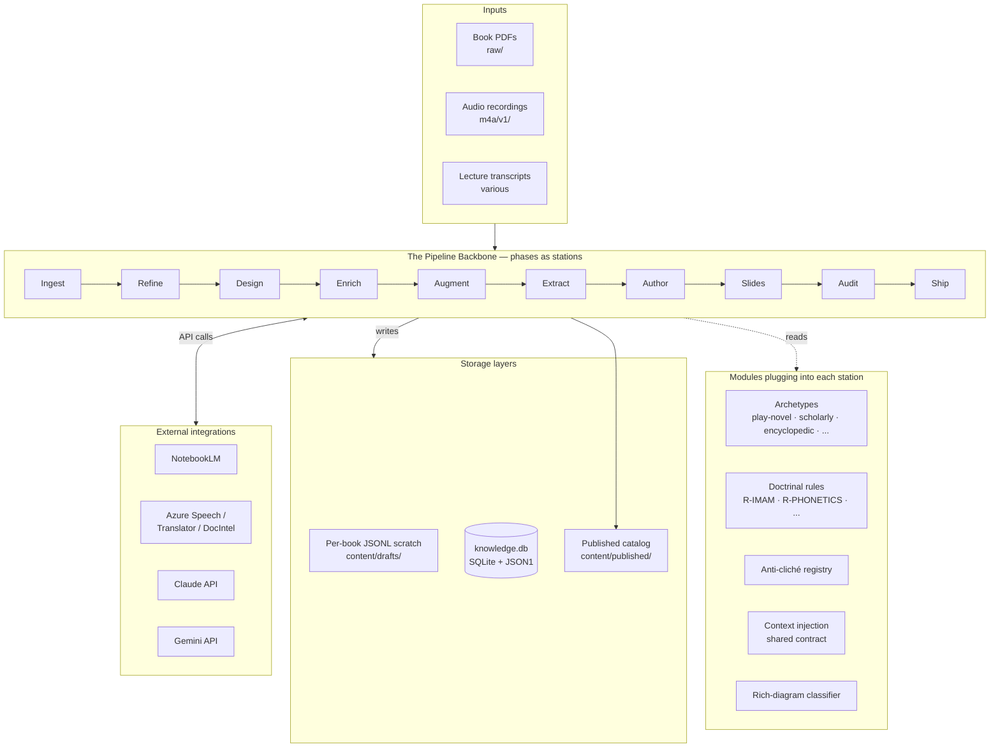

Three things to notice:
- **The backbone is fixed** — every book follows phases in order, no special-case branches.
- **Modules are pluggable** — what each phase actually does depends on which archetype is resolved for the book.
- **Storage is layered** — the per-book scratch (JSONL, in git for diffability), the shared knowledge database (SQLite, the cross-book brain), and the published catalog (audience-facing, separate from drafts).

---

## The Six Module Layers

Code is organized into six layers. A layer can only depend on layers below it. This is the *acyclic dependency* invariant that keeps the system testable and changeable.

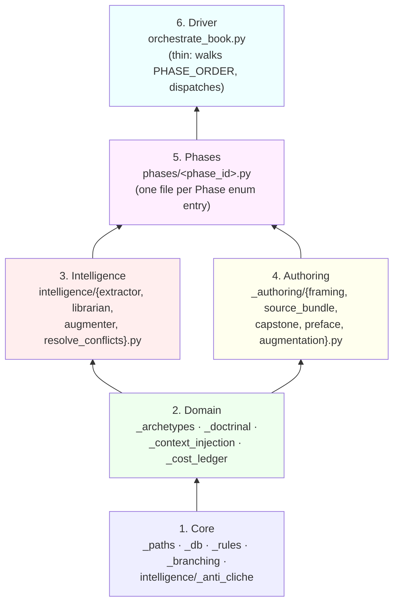

**Layer 1 — Core (zero pipeline knowledge).** Pure utilities. `_paths.py` is the *only* place that maps a slug + category to a filesystem path. `_db.py` is the *only* place that opens SQLite connections. `_rules.py` holds R-* constants (banned phrases, caps, thresholds). `_anti_cliche.py` is the single phrase registry.

**Layer 2 — Domain (pipeline concepts).** Knows *what* the pipeline does but not *how* a specific phase runs. `_archetypes.py` resolves a book's meta.yml to an Archetype object. `_doctrinal.py` enforces tradition-adjacency and Imam-numbering checks via `tradition_adjacency.yml`. `_context_injection.py` is the single shared contract for any phase that injects external context (used by both 08b augmentation and the Augmenter).

**Layer 3 — Intelligence (cross-book learning).** `extractor.py` pulls atoms (Quran verses, hadith) from enriched chapter text. `librarian.py` dedupes and merges atoms into `knowledge.db`. `augmenter.py` returns top-K prior atoms relevant to a chapter, used by future books' authoring and audit prompts.

**Layer 4 — Authoring (per-piece content generation).** Splits the current 2,025-line `_authoring.py` into focused modules. Each module knows how to produce one kind of artifact (a framing, a source bundle, a capstone, a preface, an augmentation file). Archetype-aware: the same module behaves differently for PLAY-NOVEL vs ENCYCLOPEDIC.

**Layer 5 — Phases (PhaseHandler protocol).** One file per `Phase` enum entry. Each implements `run(bd: Path, ctx: PhaseContext) -> PhaseReport`. Phases are *substitutable*: any handler honoring the protocol can stand in for another. This is the L (Liskov) in SOLID.

**Layer 6 — Driver.** `orchestrate_book.py` shrinks from 2,280 lines to ≤ 400. It walks `PHASE_ORDER`, dispatches to the right handler, manages state.json, and surfaces heartbeat cards. No business logic.

**Line caps as code:** no file in `scripts/podcast/` exceeds 600 lines after the refactor. Enforced via a pre-commit hook + CI grep.

---

## Data Architecture

Three storage tiers, each with one job. None can substitute for another.

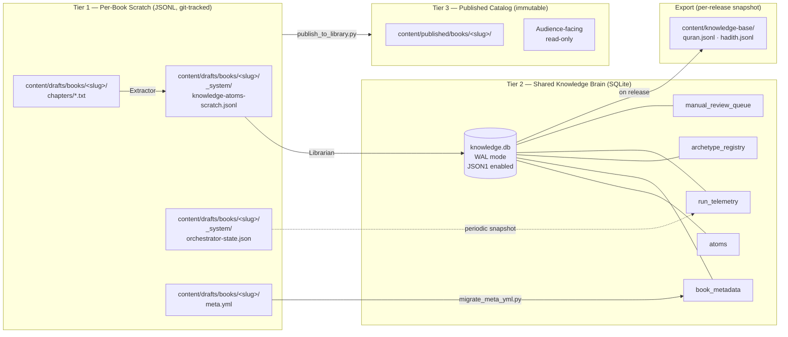

**Tier 1 — Per-Book Scratch (JSONL, git-tracked).** Lives inside each book's draft folder. Git-diffable so humans can review every change in PRs. Per-book isolation = parallel book branches never conflict on scratch state.

**Tier 2 — Shared Knowledge Brain (SQLite + JSON1).** Single file at `content/knowledge-base/knowledge.db`. WAL mode for concurrent readers. JSON1 extension for flexible-schema fields (atom bodies, meta.yml snapshots). Backed up by copying the file. **Zero infrastructure** — SQLite ships with Python on every Mac.

**Tier 3 — Published Catalog (immutable).** What the audience reads. Populated only by `publish_to_library.py`. Never written-to except by that one script after gates G1-G12 pass.

**Export layer.** On every release to `develop`, `knowledge.db` snapshots out as JSONL into `content/knowledge-base/quran.jsonl` etc. The JSONL is the grep-friendly audit trail and the disaster-recovery fallback.

### Knowledge.db schema (ER view)

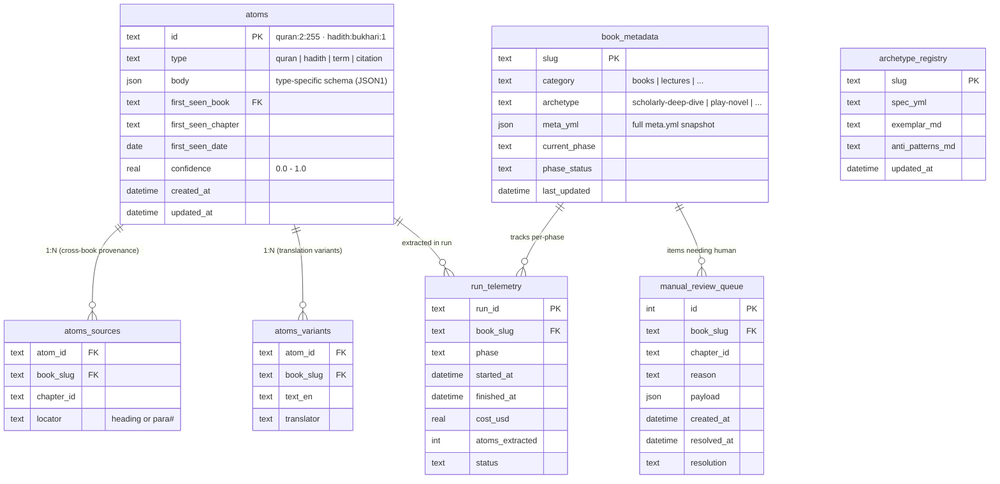

### Why SQLite, not Postgres-via-Docker

SQLite ships built-in with Python on every Mac. Zero install. Single-file backup. The `_db.py` module hides SQLite behind a SQLAlchemy ORM so the Wave 2 migration to Postgres + pgvector (when semantic embeddings join) is a one-time script, not a rewrite. Docker stays out of the v1 dependency story. Run on any Mac means *clone, run, works*.

---

## The Backbone — Pipeline Phases as Stations

Every book follows the same backbone. What happens at each station depends on the book's archetype (resolved at `08a-archetype-resolve`).

```mermaid
flowchart LR
    subgraph INGEST["Wave 0 · Ingest & Refine"]
        P01[01<br/>preflight] --> P02[02<br/>branch] --> P03[03<br/>scaffold] --> P04[04<br/>ocr-translate] --> P05[05<br/>refine-english] --> P06[06<br/>phonetics]
    end

    subgraph DESIGN["Wave 1 · Design & Enrich"]
        P07[07<br/>chapter-design] --> P08[08<br/>enrichment] --> P08a{{08a<br/>archetype-resolve}}
        P08a --> P08b[08b<br/>augmentation<br/>archetype-gated]
        P08a --> P08c[08c<br/>knowledge-extract]
        P08b --> P08c
    end

    subgraph AUTHOR["Wave 2 · Author & Audit"]
        P09[09<br/>series-plan] --> P10[10<br/>register-series] --> P11[11<br/>per-chapter]
        P11 --> P11b[11b<br/>slide-decks]
        P11b --> P0g[0g<br/>dual-auditor]
    end

    subgraph SHIP["Wave 3 · Train & Ship"]
        P12[12<br/>trainer] --> P13[13<br/>merge] --> P14[14<br/>done]
    end

    P06 --> P07
    P08c --> P09
    P0g --> P12

    style P08a fill:#fef3e2
    style P08b fill:#e8f5e9
    style P08c fill:#fce4ec
```

**The three new phases.** `08a-archetype-resolve` is a decision-only step: it reads `meta.yml.archetype` and configures the downstream phases. `08b-augmentation` writes modern-research markdown files (archetype-gated — default-on for encyclopedic, opt-in for scholarly + lecture-series, never for play-novel + aphorism). `08c-knowledge-extract` is the Extractor+Librarian phase that captures Quran/hadith atoms from the enriched chapter source AND from any 08b augmentation output.

**Why letter suffixes (08a/08b/08c).** Preserves numeric phase ordering for resume/state.json compatibility. Mirrors the existing `11b-slide-decks` precedent. No phase renumbering required — existing books on disk continue to resume cleanly.

---

## The Intelligence Layer — Three-Piece Architecture

Cross-book learning. Each piece does one thing well.

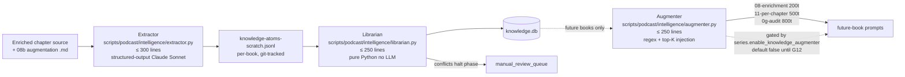

**Extractor.** Reads enriched chapter text + 08b augmentation output. Emits atoms with canonical IDs (`quran:2:255`, `hadith:bukhari:1234`). Cost cap: $0.10/chapter, $10/book ceiling. Confidence < 0.7 auto-flags for manual review.

**Librarian.** No LLM. Exact-match canonical ID dedup. Three outcomes per atom: *new* (insert), *variant* (different translation → append to variants[]), *conflict* (different `text_ar` or different hadith grade → halt phase, write to `manual_review_queue`). Resume requires `resolve_conflicts.py`.

**Augmenter.** Helper called from FUTURE books' prompts. Wave 1 implementation is regex citation-scan + exact-ID lookup; Wave 2 adds semantic ranking. Token-budgeted (200/500/800 per call site). **Always strips `text_ar`** before injection — prevents Arabic script leak into phonetic-only chapter files. Always uses `_context_injection.format_provenance` neutral phrasing — prevents reactionary-praise priming.

**Default disabled** until the G12 acceptance gate fires green: Book N+1 must surface at least one challenger finding referencing an augmented atom. Until then, the flag stays `false` even though the code is shipped.

---

## Multi-Tier Capstone — Architectural Recursion

For dense philosophical books and the encyclopedic archetype, capstones layer recursively. Each tier reads ONLY the layer immediately below it.

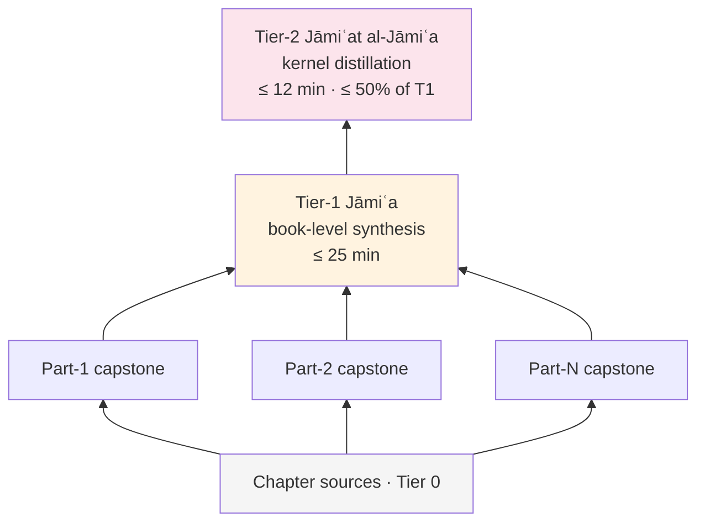

**The invariant (locked):** tier-2 reads tier-1 plus chapter abstracts (~200 words/ch). Tier-2 NEVER reads chapter sources directly. If postprod-review surfaces a chapter-scope doctrinal correction, tier-1 must absorb it into its own output BEFORE tier-2 sees anything. This prevents kernel principles from inheriting un-synthesized chapter content. Enforced by `_authoring/capstone.py` source_assembly module — raises `CrossTierRead` on violation.

**Five capstone modes** in `meta.yml.capstone_mode`:
| Mode | Used by | Structure |
|---|---|---|
| `none` | play-novel, aphorism-collection | No capstone (preface bookends close the arc; aphorisms self-distill) |
| `single` | scholarly-deep-dive medium, lecture-series | Tier-1 only |
| `single_plus_distillation` | scholarly-deep-dive deep (≥ 12 ch) | Tier-1 + Tier-2 |
| `per_part_and_single` | encyclopedic-epistolary medium | Per-part capstones + Tier-1 |
| `full_brethren` | encyclopedic-epistolary deep (Rasāʾil) | Per-part + Tier-1 + Tier-2 |

---

## Content Archetypes — Extensibility Seam #1

Seven archetypes registered on disk at `content/_shared/archetypes/<slug>/`. Each has `exemplar.md`, `spec.yml`, `anti-patterns.md`. The `_archetypes.py` registry module resolves `meta.yml.archetype` to an Archetype object.

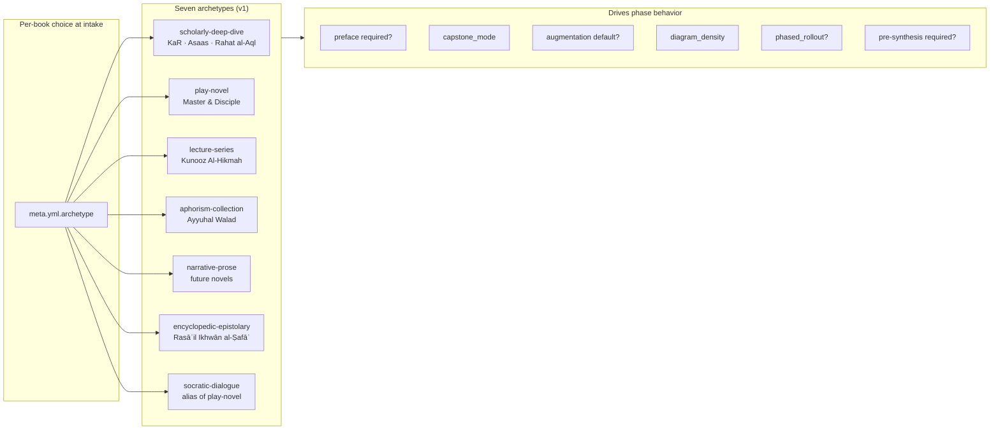

**How to add an 8th archetype** (extensibility recipe):
1. Create `content/_shared/archetypes/<new-slug>/{exemplar.md, spec.yml, anti-patterns.md}`.
2. Register in `_archetypes.py` `KNOWN_ARCHETYPES` tuple.
3. Add invariants to `spec.yml` (preface required, capstone mode, augmentation default, etc.).
4. If the archetype needs phase-level changes, add an `if archetype.slug == "..."` branch in the affected phase handler. Most archetypes don't need this — they configure existing phases via meta.yml fields.

The registry is **content-as-config**: a new archetype is three markdown/yaml files, not three Python files.

---

## Agent Ecosystem

Nine agents collaborate on different surface areas, organized into two strata: **tactical agents** (single-purpose, fire-and-finish — orchestrator, challenger, auditor, trainer, blueprint, extract, publisher, vacuum, postprod-review, slide-deck-challenger) and a **strategic coordinator** (`project-steward`) that composes the tactical agents under a fixed four-pass protocol and a cited source corpus. The steward never reimplements a tactical check; it invokes the right tactical agent for the scope and interprets findings against the corpus.

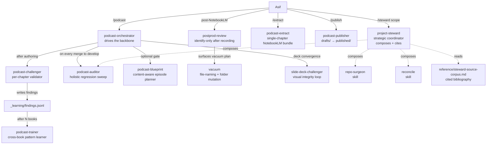

**Read/write contracts:**
- `podcast-orchestrator` — reads everything; writes orchestrator-state.json, ledgers, branches.
- `podcast-challenger` — reads chapter + framing + handbook; writes findings.jsonl + per-chapter report. Never edits content.
- `podcast-auditor` — reads everything; writes audit report. Never edits.
- `podcast-trainer` — reads findings.jsonl across books; proposes spec edits + commits them only if regression suite passes.
- `vacuum` — reads file tree; mutates filenames + folder structure (Tier 1).
- `postprod-review` — identify-only audit after audio + transcripts arrive.
- `project-steward` — reads git state + active plan + composed-agent reports; writes structured prioritized findings (P0–P3 + low-hanging fruit + pushback) cited to entries in `reference/steward-source-corpus.md`. Never edits source files; the corpus itself is the only writable surface and only as Tier 2.

---

## External Integrations

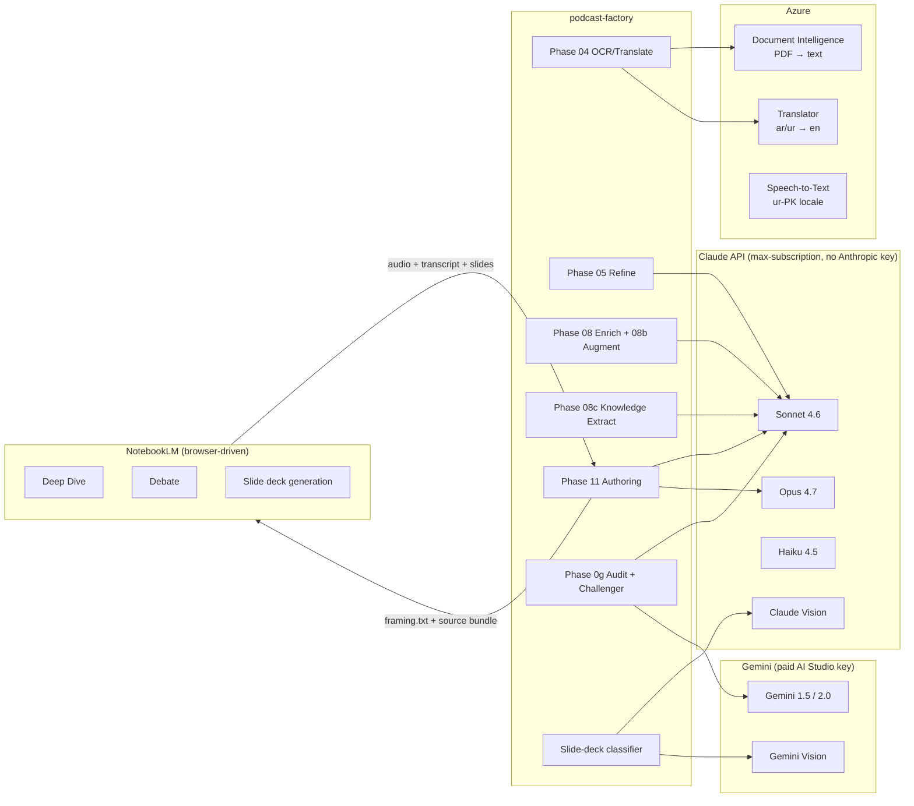

**Anthropic API key** — NOT in keychain. Pipeline calls Claude through Asif's max-subscription via `claude login` (zero per-token cost beyond subscription).

**Gemini** — paid AI Studio key in keychain (`gemini_api_key`). Used by `audit_bundle_gemini.py` (cheap second-opinion auditor) and by the rich-diagram classifier fallback.

**Azure** — `journal-speech` (S0, $1/audio-hour), `journal-translator`, `journal-docintel`. All provisioned via `infra/azure/`.

---

## Branch + Content Lifecycle

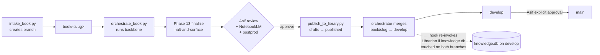

**Branch policy.** Every content unit gets a typed branch off `develop`: `book/<slug>`, `doc/<slug>`, `lecture/<slug>`, `article/<slug>`, etc. The prefix-map lives in `scripts/podcast/_branching.py`. After publish, the orchestrator merges the typed branch to `develop` with `--no-ff`. `develop → main` requires Asif's explicit approval.

**Concurrent book branches + the knowledge brain.** Two books in flight on parallel branches may both write to `knowledge.db`. On the second branch's merge, a `post-merge` git hook re-invokes Librarian if both branches touched `knowledge.db`. Manual conflict resolution if the same atom was added independently on both sides.

---

## The SPA & Design System

The plan folder gains a Single Page Application at `_workspace/plan/index.html`. One shell; multiple sub-apps; shared CSS theme tokens. Built in **Astro** to match the existing Podcast Factory Astro Site (`plan-dashboard/`) stack — shared design tokens, shared component primitives, single source of truth for typography and color.

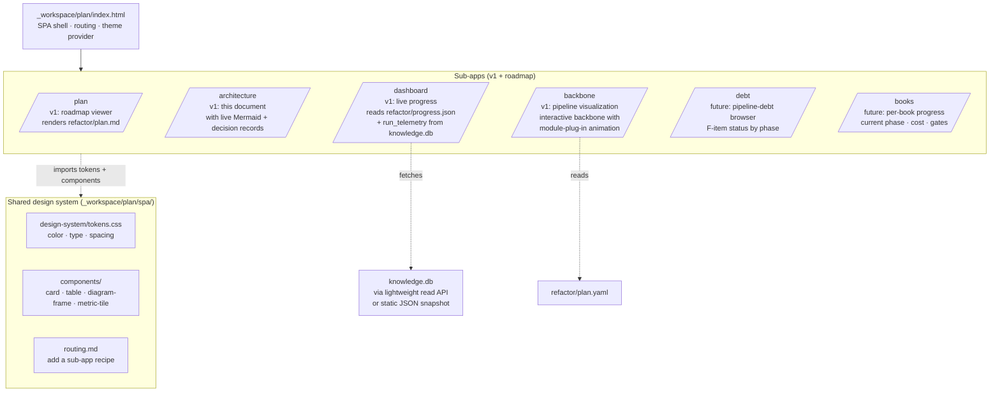

**Design system tokens** (CSS custom properties): `--c-bg`, `--c-text`, `--c-accent`, `--c-warn`, `--c-success`; `--type-serif`, `--type-sans`, `--type-mono`; `--space-xs..xl`; `--radius-sm..lg`. Shared across the plan SPA AND the reader section AND any future sub-app of the Podcast Factory Astro Site (catalog browser, transcript editor, knowledge-base explorer, etc.).

**Adding a new sub-app** (extensibility recipe): drop a route under `_workspace/plan/src/pages/<sub-app>/index.astro`, import design tokens, register in `routing.md`. Theme inherits automatically.

**Live data for the dashboard.** Two options the plan picks between:
1. **Static snapshot** — `refactor/progress.json` + `run_telemetry_snapshot.json` regenerated on every push by a tiny script. Zero runtime infra. Recommended for v1.
2. **Read-only API** — a small Astro server endpoint reading `knowledge.db` live. Requires Astro server mode + filesystem access. Reserved for v2 if real-time becomes a need.

---

## Annotation Intelligence Handoff

The chapter reader now includes a right-rail annotation workspace as a first-class operational lane. Paragraph hover selects context; all edits happen in the rail. This avoids floating overlays on text while preserving rapid classification flow.

The lane has two persistence levels:

- **Fast lane (session speed):** local queue in browser storage, capturing marker and action intent in order.
- **Durable lane (cross-session + automation):** chapter-scoped JSON handoff at `content/drafts/<category>/<slug>/_system/annotation-intelligence/<chapter>.json` containing markers, notes, queue items, and one combined instruction block ready for assistant execution.

This contract makes annotation output reusable by Copilot, Claude Code, Cowork sessions, and future pipeline automation without needing UI state reconstruction.

---

## Decision Records (ADRs)

Compact list of architectural decisions and why. Future Claude sessions and reviewers consult this list first when something feels arbitrary.

| ID | Decision | Why | Date |
|---|---|---|---|
| DR-001 | **SQLite + JSON1 for v1; Postgres + pgvector at Wave 2** | Mac portability beats infrastructure power for v1. Migration path via SQLAlchemy. | 2026-05-26 |
| DR-002 | **Tier-2 capstone NEVER reads chapter-scope material** | Recursion invariant. Tier-1 absorbs chapter corrections; tier-2 sees only tier-1. | 2026-05-26 |
| DR-003 | **Per-content-type typed branch policy** | `book/`, `doc/`, `lecture/`, `article/`. Single prefix-map in `_branching.py`. | 2026-05-24 |
| DR-004 | **Letter-suffix phase IDs (08a/08b/08c)** | Preserves numeric ordering for resume. Mirrors existing `11b-slide-decks`. | 2026-05-26 |
| DR-005 | **Every `scripts/podcast/` file ≤ 600 lines** | Forces modularization. Enforced by pre-commit + CI. | 2026-05-26 |
| DR-006 | **architecture.md is independent of `docs/architecture/index.html`** | This doc is timeless design; the HTML is a generated dashboard. Different lifecycles. | 2026-05-26 |
| DR-007 | **Augmenter default-disabled until G12 fires green** | A/B acceptance gate prevents shipping a flywheel that doesn't actually change outputs. | 2026-05-26 |
| DR-008 | **Per-book scratch stays JSONL, not SQLite** | Git-diffability for human PR review. SQLite holds merged canonical state. | 2026-05-26 |
| DR-009 | **No version stamps in tracked files** | The git history IS the version log. Pre-commit hook rejects `Version: \d` and `*v[0-9]*.md`. | 2026-05-26 |
| DR-010 | **Astro for the plan SPA + design tokens shared across the Podcast Factory Astro Site** | One stack, one theme, no duplicate UI primitives. | 2026-05-26 |
| DR-011 | **Cross-tradition guard via `tradition_adjacency.yml`** | Brethren-of-Purity vs orthodox-Ismaili requires structural prevention, not authoring judgment. | 2026-05-26 |
| DR-012 | **Augmenter strips `text_ar` before injection** | Prevents Arabic script leak into phonetic-only chapter files (violates R-PHONETICS-OUT). | 2026-05-26 |
| DR-013 | **Retroactive enhancements for shipped books = addendum-only** | Never re-run the pipeline against KaR, M&D, Ayyuhal Walad, etc. New episodes ship as addenda. | 2026-05-26 |
| DR-014 | **Strategic-tactical agent split: steward composes, doesn't reimplement** | `project-steward` sits above the tactical agents (orchestrator, auditor, challenger, vacuum, etc.). It composes them by scope rather than duplicating their checks. Every recommendation is bound to a `reference/steward-source-corpus.md` entry; unsourced claims are flagged `[unsourced]`. Prevents agent-sprawl and keeps strategic prioritization out of pipeline scripts. | 2026-05-26 |
| DR-016 | **Annotation output must persist as both queue and chapter handoff file** | Local queue keeps interaction fast; chapter JSON makes intent durable and machine-readable for assistant sessions and automation. | 2026-05-27 |

---

## What's NOT in This Document

- **Execution sequence + timelines** — see `refactor/plan.md`.
- **Live system state, metrics, in-flight books** — see `_workspace/plan/index.html` dashboard.
- **F-item operational backlog** — see `_workspace/plan/debt/pipeline-debt.md`.
- **Per-book ship checklists** — see `_workspace/plan/operations/per-book-ship-checklist.md`.
- **Day-to-day standing rules + response conventions** — see `_workspace/plan/conventions/`.
- **The 12-task postprod-vacuum sub-plan currently in flight** — see `_workspace/plan/postprod-vacuum-tasks.md` (folds into refactor Step C2 retroactive M&D work).
