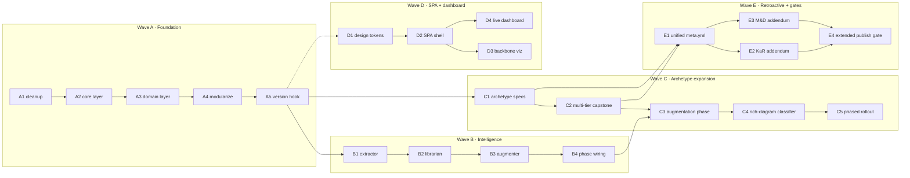
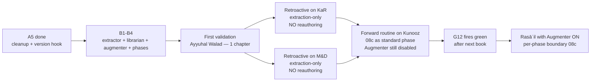

# Pipeline Refactor — Roadmap

# Summary Of Your Intent.

1. **Architecture-first rebuild on `develop`**. This plan derives every step from the architecture at [architecture.md](../architecture.md). Read architecture first; then this roadmap reads as *"to land that architecture, do these things in this order."*
2. **Five waves, 22 steps**. Wave A foundation (cleanup, core layer, modularization), Wave B intelligence (extractor + librarian + augmenter), Wave C archetype expansion (PLAY-NOVEL + LECTURE-SERIES + ENCYCLOPEDIC + multi-tier capstone), Wave D SPA + dashboard, Wave E retroactive enhancements for shipped books + extended publish gate.
3. **Legacy plan folder gets folded in then deleted**. ~22 legacy files in `_workspace/plan/` are surveyed, the live pieces are extracted into the new nested structure, the rest are removed (git history preserves them). Step A1 is the cleanup; nothing else lands until A1 is done.
4. **Retroactive doctrine for shipped books**. KaR and M&D get archetype stamping, addendum episodes, and extraction-only knowledge passes. **Never** re-run through the pipeline. Every enhancement still becomes default for the next forward book.
5. **Plan only — no execution authorized**. This turn writes the plan files. Asif's approval before any code lands.

---

## How This Plan Reads

| Symbol | Meaning |
|---|---|
| **Step ID** | `<Wave>.<Step>` e.g. `A1`, `B3`, `C2` |
| **Plan-block format** | `### N. {statement}` + blockquote description + `*Value gained:*` closer |
| **Dependency arrow** | Listed as `depends_on:` in [plan.yaml](plan.yaml) |
| **Authorization tier** | T0 (silent), T1 (do + surface), T2 (always ask) per [CLAUDE.md](../../../CLAUDE.md) |

## Wave Diagram

Wave A is the gate. Wave B and Wave C can run in parallel after A. Wave D is independent — it can start any time after A1 (cleanup) since it operates on plan files, not pipeline code. Wave E is last; it depends on B4 + C2 for the retroactive enhancements to be coherent.

---

# Wave A · Foundation

### A1. Clean the legacy plan folder and stand up the nested structure.

> Survey every file in `_workspace/plan/` (root level), fold pending work into the new nested structure described in [architecture.md §SPA & Design System](../architecture.md#the-spa--design-system), then delete the legacy files (git history preserves them). New layout: `conventions/` (response-template, response-conventions, general, authoring), `debt/` (pipeline-debt.md moves here), `operations/` (per-book-ship-checklist moves here), `reader/` (podcast-reader polish moves here), `refactor/` (this plan), `spa/` (design system + components + routing), plus existing `research/` and `_drivers/`. Files to fold-and-delete after content extraction: `acceptance-criteria.md` (84K — extract any P-items not in pipeline-debt.md), `intelligence-pipeline-wave1-spec.md` (already folded into architecture.md + this plan; delete), `podcast-intelligence-enhancements.md` (extract items 3-6 → `conventions/authoring.md`; delete), `v4-doctrine-propagation.md` (LANDED 2026-05-22 per pipeline-debt.md, delete), `f25-apparatus-table-schema.md` + `f27-validator-drafts.md` (status tracked in pipeline-debt F25/F26/F27; delete sources), `podcast-plan.yaml` (263K — scan for live items, fold into pipeline-debt.md, delete), `podcast-plan-DoR.md` + `-appendix.md` (superseded by per-book-ship-checklist.md; delete). Files to delete outright (dated event reports, rollout artifacts): `STUDIO-ALIGNMENT-2026-05-22.md`, `cohesion-audit-2026-05-23.md`, `handoff-kar-archetype-pivot.md`, all 11 kashkole-* files, `numeric-symbolic-disambiguation-plan.md` (scan first; if live, fold into debt). Delete the version stamp file `VERSION` (no versions anywhere). Delete the empty `pipeline-refactor/` subdir. Delete the stale root-level `pipeline-refactor.md` and `pipeline-refactor.yaml` (superseded by this nested structure).
>
> *Value gained:* The plan surface shrinks from 37 files to ≤ 14 in a coherent nested layout. Future Claude sessions and reviewers find what they need in one glance. The cleanup runs **FIRST** so no new code lands on a cluttered surface.

### A2. Build the Core layer — `_paths`, `_db`, `_archetypes`, `_anti_cliche`.

> Single path API at `scripts/podcast/_paths.py` exposing `book_dir(slug, category)`, `category_dir(category)`, `knowledge_base_dir()`, `knowledge_atoms_scratch(slug, category)`, `all_books()`. Single SQLite gateway at `scripts/podcast/_db.py` exposing `get_connection()` (singleton, WAL mode), `run_migrations()` (idempotent, applies 16 `schema/*.sql` files in order), and seven repositories: `atoms_repository()`, `atom_sources_repository()`, `atom_topic_tags_repository()`, `corpus_chapters_repository()`, `external_corpora_repository()`, `manual_review_queue()`, `run_telemetry()`. Single archetype registry at `scripts/podcast/_archetypes.py` exposing `load_archetype(slug)`, `resolve_archetype_for_book(meta_yml)`, `list_archetypes()`. Single anti-cliché phrase registry at `scripts/podcast/intelligence/_anti_cliche.py` exposing `CAPSTONE_DENY`, `SELF_HELP_DENY`, `TIER_2_DENY`, `AUGMENTER_PRIOR_TREATMENT_DENY` lists. Extend the existing Wave 1 scaffold at `scripts/podcast/knowledge/_atom_schemas.py` with `DoctrineBody` TypedDict (fields: `tradition`, `genre`, `binder_id`, `binder_slug`, `chapter_id`, `chapter_slug`, `section_ids`, `chunk_index`, `topic_tags`, `text_en`, `quran_refs`) and `DoctrineGenre` Literal; update `AtomType = Literal["quran", "hadith", "doctrine"]`. Canonical ID format for doctrine atoms: `doctrine:kashkole:<binder_id>:<chapter_id>:<chunk_index>` (chunk_index 0-based within the chapter). Seed the archetype registry on disk at `content/_shared/archetypes/<slug>/{exemplar.md, spec.yml, anti-patterns.md}` for the seven archetypes named in architecture. Create `content/knowledge-base/knowledge.db` via `_db.py:run_migrations()` using the 16-table SOLID-compliant schema (interactive view at `/db-schema` in the plan dashboard). The 16 tables organize into four categories: **Core** (books, chapters, episodes, phonetics, pipeline_runs, cost_ledger), **Knowledge** (knowledge_atoms, atom_sources, atom_topic_tags, external_corpora, topic_type_taxonomy, corpus_chapters), **Quality** (challenger_findings), and **Etymology** (arabic_roots, word_etymologies, letter_profiles). The Knowledge group's four corpus tables include a per-chapter refinement state machine so Kashkole data can be corrected independently — see B0.
>
> *Value gained:* Every later step has a single, stable, testable place to put paths, database access, archetype resolution, and banned phrases. No other module touches `sqlite3` directly; no other module hardcodes a path. SOLID-S (single responsibility) at the foundation. The 16-table schema replaces 6 scattered JSONL/JSON file families with a queryable SQLite database, making cross-book intelligence possible without per-book ad-hoc file wrangling.

### A3. Build the Domain layer — `_doctrinal`, `_context_injection`, `_cost_ledger` polish.

> `scripts/podcast/_doctrinal.py` gains `tradition_adjacency.yml` loader and an `assert_no_cross_tradition_collision(text, window=150)` function that flags any paragraph citing both an `ismaili-orthodox` and `ismaili-adjacent` author within 150 words without an adjacency-acknowledgment clause (see [architecture.md §Decision Records DR-011](../architecture.md#decision-records-adrs)). It also inherits the existing `R-IMAM-NUMBERING` check (Imam Hasan = first Imam; "Imam Ali" forbidden; substitute "the Commander of the Faithful" / "the Father of Imams"). `scripts/podcast/_context_injection.py` exposes the shared contract used by both the 08b augmentation phase and the Augmenter: `format_provenance(source)` (neutral-phrasing template), `build_injection(atoms, max_tokens, types)` (token-budgeted), `strip_arabic_script(text)` (removes U+0600–06FF and U+0750–077F before injection). `_cost_ledger.py` (existing) gets a thin extension exposing per-phase + per-book cost queries the dashboard reads.
>
> *Value gained:* Cross-tradition doctrinal drift is structurally prevented, not left to authoring judgment. The single shared injection contract means augmentation and the Augmenter never diverge on provenance phrasing or token budgeting. The cost ledger gains queryable surface area for the live dashboard.

### A4. Modularize `orchestrate_book.py` and `_authoring.py`.

> Extract per-phase handlers from `orchestrate_book.py` (2,280 lines) into the existing `scripts/podcast/phases/` package — one file per Phase enum entry, each ≤ 300 lines, each implementing `PhaseHandler.run(bd, ctx) -> PhaseReport`. New handler files: `phases/{preflight, scaffold, ocr_translate, refine_english, phonetics, chapter_design, enrichment, archetype_resolve, augmentation, knowledge_extract, series_plan, register_series, per_chapter, slide_decks, trainer, merge}.py`. Drop `orchestrate_book.py` to ≤ 400 lines as a thin driver that walks `PHASE_ORDER` and dispatches. Split `_authoring.py` (2,025 lines) into the `_authoring/` package: `framing.py`, `source_bundle.py`, `capstone.py`, `preface.py`, `augmentation.py`. The `__init__.py` re-exports the public API so existing call sites keep working. Acceptance: no file in `scripts/podcast/` exceeds 600 lines. Pre-commit hook enforces.
>
> *Value gained:* Every module has one job, testable in isolation, reviewable in one sitting. Subsequent waves can change one phase without merge-conflicting against a giant file.

### A5. Strip every version stamp + add the pre-commit guard.

> Remove `Version: X.Y` headers from `framework.md`, `_workspace/plan/view/agents/view-generation-agent.md`, `.github/agents/operating-contract.md`, `reference/cortex-challenger-framework.md`. Rename `v4-doctrine-propagation.md` (if not deleted in A1) and `CONTENT/drafts/BOOKS/the-master-and-the-disciple/audits/v2.2-vs-v2.1-diff.md`. Remove version comments in `scripts/podcast/{_authoring.py:1759, _authoring.py:1789, _rules.py:189..250, build_slide_deck.py:4, audit_transcript.py:64}`. Install a pre-commit hook (`infra/git-hooks/pre-commit`) that rejects any commit containing `^Version:\s*\d` in tracked files OR any new file matching `*v[0-9]*.md`. Investigate the `CONTENT/` vs `content/` case mismatch on the Mac filesystem (possible duplicate tree under the case-insensitive filesystem).
>
> *Value gained:* No file or comment in the repo says "v2" or "v3.2" or "Version: 4.1". The current file IS the version. The doctrine is mechanically enforced going forward, not just documented as a wish.

---

# Wave B · Intelligence Layer

### B0. Build the Kashkole corpus ingestion driver — independent chapter refinement.

> `kashkole_ingest_knowledge.py` (≤ 400 lines) seeds the intelligence library from the 75 PASS+WARN Kashkole chapters without going through `orchestrate_book.py`. Idempotent per chapter: re-running on a corrected chapter deletes that chapter's old atoms (`atom_sources`, orphaned `atom_topic_tags`, orphaned `knowledge_atoms`), then re-ingests clean from the corrected `adapted-extract.en.md`. The refinement state machine on `corpus_chapters.ingestion_status` has five states — `pending → ingested → needs_correction → correction_draft → re_ingested` — so Asif can mark a chapter for correction, edit its source file, and re-ingest it in any order without touching the rest of the library. Atoms from WARN chapters carry `needs_review = 1` until the chapter is re-ingested with a clean PASS. CLI: `--chapter <slug>` (single chapter), `--re-ingest` (correction cycle), `--dry-run` (preview changes without writing), `--status` (print a 122-row table: slug | verdict | ingestion_status | atom_count), `--force` (override a FAIL verdict after manual clearance). Seeds `external_corpora` (one Kashkole row) and `topic_type_taxonomy` (18 rows) on first run; idempotent on repeat. The topic-type expansion logic (TopicID → `atom_topic_tags` rows via `topic_type_taxonomy`) is extracted as a shared function the B1 Extractor reuses for pipeline-sourced doctrine atoms. Doctrine atom canonical ID: `doctrine:kashkole:<binder_id>:<chapter_id>:<chunk_index>` (0-based chunk index within the chapter). Chunking: split `adapted-extract.en.md` on `<!-- section N -->` markers, group consecutive sections into ≤600-word chunks without mid-section splits. Quran atoms: each `⟪quran S:A⟫` marker yields a `quran` atom with the surrounding paragraph (~150 words) as `tafsir_note`. Hadith atoms: from `adaptation-citations.jsonl` entries matching hadith collection names. Topic tags sourced from `_workspace/kashkole-ksessions/topic-type-map.json` (18-row taxonomy, 223 per-topic assignments — no DB access needed during ingestion). Full implementation spec: [KASHKOLE-INTELLIGENCE-PIPELINE-RECOMMENDATION.md](KASHKOLE-INTELLIGENCE-PIPELINE-RECOMMENDATION.md).
>
> *Value gained:* 75 PASS+WARN chapters become live knowledge atoms the moment B0 ships — before a single pipeline book runs B1. The correction workflow is editorial (edit a file, mark a chapter, re-ingest) rather than pipeline (no costly LLM re-run per correction). `--dry-run` makes every proposed correction safely previewable. `correction_count` in the dashboard surfaces chronically problematic chapters so systematic data issues are visible rather than buried.

### B1. Build the Extractor.

> Implement `scripts/podcast/intelligence/extractor.py` (≤ 300 lines) exposing `extract_atoms_for_book(bd) -> Path` and `extract_atoms_for_chapter(text, slug, ch) -> list[Atom]`. Single Claude Sonnet structured-output call per chapter with a strict JSON schema. Reads `BOOK_DIR/chapters/<ch-slug>.txt` (the enriched chapter source — NOT audio scripts, which carry NotebookLM drift). Writes atoms to `BOOK_DIR/_system/knowledge-atoms-scratch.jsonl`. New R-* constants: `R_KNOWLEDGE_EXTRACTOR_COST_CAP_USD_PER_CHAPTER = 0.10`, `R_KNOWLEDGE_EXTRACTOR_COST_CAP_USD_PER_BOOK = 10.00`, `R_KNOWLEDGE_EXTRACTOR_CONFIDENCE_REVIEW_THRESHOLD = 0.7`. Atoms with confidence < 0.7 auto-appended to `manual_review_queue`. Atom schema per [architecture.md §Data Architecture](../architecture.md#knowledgedb-schema-er-view).
>
> *Value gained:* Every chapter the pipeline processes contributes citable atoms to the cross-book knowledge brain. Cost is bounded and predictable at any book scale ($6 ceiling for Rasāʾil's 60 chapters).

### B2. Build the Librarian.

> Implement `scripts/podcast/intelligence/librarian.py` (≤ 250 lines) — pure Python, no LLM. `merge_into_library(bd, scratch_path) -> MergeReport`. Exact-match canonical-ID dedup against `knowledge_atoms`. Four outcomes: *new* (INSERT into `knowledge_atoms` + `atom_sources` with `source_type='pipeline'`); *duplicate* (atom already exists by canonical ID — INSERT a new `atom_sources` row for this pipeline provenance; the `knowledge_atoms` row is unchanged); *variant* (same canonical ID, different `text_en` — INSERT new `knowledge_atoms` row with a variant marker in `body_json` + `atom_sources` row); *conflict* (same canonical ID, different `text_ar` or hadith grade → write to `manual_review_queue`, halt phase). Conflict-resolution helper at `intelligence/resolve_conflicts.py` with three modes: `--accept-incoming`, `--keep-existing`, `--both-as-variants`. Emit per-book merge report at `BOOK_DIR/_system/knowledge-merge-report.md`. Install `.git/hooks/post-merge` (template at `infra/git-hooks/post-merge-knowledge.sh`) that re-invokes Librarian when both merged branches touched `knowledge.db`. Also emits `content/knowledge-base/_index/doctrine-by-tag.json` — flat JSON mapping each topic tag to a sorted list of atom IDs (rebuilt incrementally on each Librarian run; enables O(1) Augmenter lookup without a DB scan).
>
> *Value gained:* The library never silently overwrites authoritative atoms. Every disagreement surfaces for human judgment. Parallel-branch knowledge-base writes have a documented merge story.

### B3. Build the Augmenter.

> Implement `scripts/podcast/intelligence/augmenter.py` (≤ 250 lines) exposing `augment_for_chapter(book_slug, chapter_id, chapter_text, *, max_atoms=5, max_tokens=800, doctrine_topic_ids=None) -> str`. Two independent lookup paths: (1) **Quran + hadith** — regex-scan chapter text for canonical citation patterns (`Q\d+:\d+`, hadith chains), exact-ID lookup in `knowledge_atoms WHERE type IN ('quran','hadith') AND needs_review=0`; (2) **Doctrine (Kashkole)** — when `doctrine_topic_ids` is set (non-empty list of integers from `meta.yml`), query `atom_topic_tags JOIN knowledge_atoms WHERE type='doctrine' AND needs_review=0 AND topic_type_id IN (doctrine_topic_ids)`; **silently skip when absent**. Doctrine scoring: topic signals extracted from `⟪ar:…⟫` markers and key theological terms in `chapter_text` (`tawhid`, `wilaya`, `tawil`, `mabda`, `maad`, `aql`, `nafs`, `hudud`, `dawat`); each candidate atom scored by `len(intersection(chapter_signals, atom.topic_tags))`; sorted desc; doctrine capped at 3 atoms (≈300 tokens each). Self-exclusion: atoms whose `binder_slug` matches `book_slug` are excluded (a book is not its own doctrinal prior source). Injected prompt block: `[PRIOR DOCTRINAL CONTEXT — Kashkole corpus] / Topic: {comma-joined topic_tags} / Source: Kashkole — {binder_slug}, ch. {chapter_slug} / --- / {text_en truncated at sentence boundary}`. The `needs_review=0` gate applies to both paths — WARN-verdict Kashkole atoms never reach augmentation output until Asif re-ingests them clean. Always strips `text_ar` via `_context_injection.strip_arabic_script` (DR-012). Always uses `_context_injection.format_provenance` neutral-phrasing template. **Default disabled** via `series.enable_knowledge_augmenter: false`; returns empty string when flag is unset. `doctrine_topic_ids` is an optional `meta.yml` book-level field (list of integers matching `topic_type_taxonomy.type_id` from the B0 18-row seed); when absent, doctrine injection is silently skipped, keeping Kashkole-specific content out of books of other traditions. Three call sites with documented token budgets: `08-enrichment` (200), `11-per-chapter` (500), `0g-audit` / `podcast-challenger` (800). New R-* constants: `R_KNOWLEDGE_AUGMENTER_DEFAULT_ENABLED = False`, `R_KNOWLEDGE_AUGMENT_MAX_ATOMS = 5`, `R_KNOWLEDGE_AUGMENT_MAX_TOKENS = 800`.
>
> *Value gained:* Book N+1's authoring inherits Book N's verified Quran and hadith treatments AND relevant Kashkole doctrine atoms — with sources attached and only if Asif has explicitly configured which topic types are relevant. The `needs_review=0` gate ensures only chapters he has validated (or re-ingested clean after correction) reach podcast authoring. The `doctrine_topic_ids` opt-in prevents Ismaili-specific doctrine from contaminating books of other traditions. The default-disabled gate (G12 acceptance, see E4) prevents shipping a flywheel that doesn't change outputs.

### B4. Wire the three new phases into `PHASE_ORDER`.

> Add to `scripts/podcast/_phases.py` `Phase` enum: `ARCHETYPE_RESOLVE = "08a-archetype-resolve"`, `AUGMENTATION = "08b-augmentation"`, `KNOWLEDGE_EXTRACT = "08c-knowledge-extract"`. Wire handlers into `phases/{archetype_resolve, augmentation, knowledge_extract}.py`. Update `orchestrator-state.json` schema with new `phases.08a / 08b / 08c` sections. Conflict-halt interaction with phased-rollout: when `phased_rollout: true`, `08c-knowledge-extract` runs per-phase-boundary, not per-book; conflicts halt only that phase. Update `framework.md` phase table + `skills-staging/podcast/SKILL.md` + `podcast-challenger.md` Category catalog in the same PR per the standing docs-sweep rule.
>
> *Value gained:* The intelligence layer becomes a routine pipeline phase, not an ad-hoc add-on. Resume semantics are preserved (letter-suffix slot convention). The docs-sweep keeps the agents' read surface accurate.

---

# Wave C · Archetype Expansion

### C1. Land the archetype specs on disk for PLAY-NOVEL, LECTURE-SERIES, and ENCYCLOPEDIC-EPISTOLARY.

> For each archetype, create `content/_shared/archetypes/<slug>/{exemplar.md, spec.yml, anti-patterns.md}`. **PLAY-NOVEL** spec: mandatory EP00 preface (≤ 20 min), dedicated source bundle (character roster as conversational prose NOT bulleted list, setting, stakes, structural map, vocabulary primer, tone directive), per-chapter `presumed_context` field naming which preface elements the chapter relies on. **LECTURE-SERIES** spec: required `08-pre-synthesis` step before enrichment that synthesizes thematic clusters + chronological doctrine arc + proposed chapter segmentation (NOT a copy of lecture-file order), Azure-Urdu gap-fill workflow at `scripts/podcast/azure_speech_fill_gaps.py` (S0 tier, ur-PK locale, ~$3/book). **ENCYCLOPEDIC-EPISTOLARY** spec: `epistle_count`, `part_map`, `augmentation_enabled: true` default-on, `diagram_density: high`, `phased_rollout: true`, `capstone_mode: full_brethren`. Each archetype's `spec.yml` declares its meta.yml field requirements. **Arabic-source translation workflow** (added per oq2 resolution): the Rasāʾil PDF is Arabic original 4-volume (archive.org Turath upload, likely Beirut 1957 Dar Sader — colophon to confirm at intake). New script `scripts/podcast/azure_arabic_translate_bundle.py` parallels the existing Urdu workflow: Azure DocIntel for layout-aware extraction → Azure Translator (ar→en) with per-segment confidence → manual-review markers on any low-confidence epistemic claim. Adds a confirm-edition-at-intake sub-step that reads the PDF's first few pages to identify publisher/year before processing begins.
>
> *Value gained:* The pipeline becomes content-aware. Adding an 8th archetype later is three markdown/yaml files — not a code rewrite.

### C2. Build the multi-tier capstone authoring module.

> Implement `_authoring/capstone.py` with strict recursion-invariant enforcement (DR-002): tier-2 source_assembly reads ONLY tier-1 capstone source bundle + chapter abstracts (~200 words per chapter); ANY attempt to read chapter-scope source from tier-2 raises `CrossTierRead`. Five capstone modes implemented: `none`, `single`, `single_plus_distillation`, `per_part_and_single`, `full_brethren`. Tier-1 cap: 25 min. Tier-2 cap: 12 min AND ≤ 50% of tier-1 runtime. Per-part cap: 20 min. Capstone outputs route through `build_episode_txt.assert_doctrinal_clean()` BEFORE write — the authoring path does NOT bypass the per-chapter R-* gate (catches R-IMAM-NUMBERING violations, R-PHONETICS-OUT violations, etc.). Six new challenger quality gates: `distillation-shorter-than-capstone` (P0), `distillation-fewer-revisions` (P0, kernel_count ∈ {1,2,3}), `distillation-not-recap` (P0, uses `_anti_cliche.TIER_2_DENY`), `distillation-kernel-test` (P1), `per-part-bounded-to-part` (P0), `capstone-no-cliche-self-help` (P0).
>
> *Value gained:* Dense philosophical books get the kernel-distillation listeners deserve. The recursion invariant prevents chapter-scope corrections from leaking into kernel principles. The doctrinal gate inheritance prevents forbidden phrasings from regenerating in capstone outputs.

### C3. Build the 08b modern-research augmentation phase.

> Implement `phases/augmentation.py` (≤ 300 lines). For each source unit (epistle, chapter, lecture cluster), generate `BOOK_DIR/_system/augmentations/<unit-slug>.md` listing 5-15 contemporary scientific findings, recent scholarly works, or modern debates that **confirm**, **extend**, **contest**, or **contextualize** the source's claims. Defaults: ON for `encyclopedic-epistolary`, opt-in for `scholarly-deep-dive` and `lecture-series`, never enabled for `play-novel` and `aphorism-collection`. Every citation passes through the canonical-form pre-filter from C4 AND a **live verification step** before emit: URLs get an HTTP HEAD (3s timeout, follow ≤ 3 redirects, accept 2xx/3xx; 4xx/5xx/timeout → reject), DOIs get a Crossref `works/{doi}` lookup (https://api.crossref.org, 5s timeout; 404 → reject; rate-limited per Crossref polite-pool with `mailto=asifhussain60@gmail.com` UA header and exponential backoff on 429). Verification results cached at `content/knowledge-base/citation_cache.sqlite` (URL → status, fetched_at) with a 30-day TTL so re-runs don't re-hit the network. A new verification module `scripts/podcast/intelligence/_citation_verify.py` (≤ 200 lines) exposes `verify_url(u)`, `verify_doi(d)`, `verify_citation(c)` returning `Verified | Rejected(reason) | Indeterminate(reason)`. Indeterminate results (network flake, Crossref rate-limit exceeded after 3 retries) **do not fail the phase** — they emit the citation with a `data-verification='indeterminate'` attribute and queue it in `manual_review_queue` for Asif to clear before publish. The augmentation phase exposes a `--offline` flag that bypasses live checks and routes all citations through the canonical-form prefilter only (for sandboxed dev runs). Augmentation output is also a source for the Extractor (B1) — verified citations introduced by augmentation enter the cross-book atom library; rejected ones are dropped before extraction sees them. Anti-cliché check blocks `quantum spirituality`-style contemporary-buzzword hijacking.
>
> *Value gained:* Dead-link/fake-DOI failure mode caught inline rather than at human-review time. The cache + indeterminate-bucket pattern keeps network flake from becoming a phase-failure mode; the `--offline` flag preserves dev-loop speed. Rasāʾil's 10th-century insights pair with modern animal cognition (Epistle 22), music neuroscience (Epistle 5), emergent-structure cosmology (the emanation epistles) — extending the corpus rather than imposing on it.

### C4.0. NotebookLM diagram-capability pilot (PRE-C4 gate; per oq7 resolution).

> Run a 2-3 Rasāʾil epistle pilot through NotebookLM with explicit slide-deck-generation prompts requesting structural diagrams (emanation hierarchy, taxonomic tree, geometric proof, Pythagorean ratio chart). Cost ~$30. Report findings: which diagram types NotebookLM actually renders, fidelity grade per type, where prose-bullet fallback occurs. **Findings dictate C4 gate severity:** if NotebookLM reliably produces ≥ 4 of the 9 diagram types named in [architecture.md §Rich-diagram mode](../architecture.md#the-spa--design-system), C4 gate is hard (P1 fails challenger at < 60% coverage). If NotebookLM produces < 4 types reliably, C4 gate demotes to P2 advisory AND C4 spec adds an externally-authored-diagram fallback path (Mermaid + Excalidraw fed as images via the slide-deck upload UI). Pilot output documented in `_workspace/plan/research/notebooklm-diagram-pilot-findings.md`.
>
> *Value gained:* C4 ships against empirical evidence, not assumption. The classifier gate is honest about what it can enforce — no aspirational metrics.

### C4. Build the MANUAL-REVIEW marker syntax, canonical-form pre-filter, and rich-diagram classifier.

> **Marker syntax**: `
...
` with reason enum: `azure-gap-fill`, `low-confidence-translation`, `ismaili-claim-unverified`, `doctrinal-cross-check-needed`, `transcript-reconstruction`, `augmentation-citation-unverified`. Canonical-form regex pre-filter at `scripts/podcast/intelligence/_canonical_regex.py` for Quran (`Q\d+:\d+`), hadith (`Bukhari ... \d+`), DOI, ISBN — cuts the manual-review queue ~70% by clearing well-formed citations to a sample-audit pool (20% sample). **Rich-diagram classifier** at `scripts/podcast/slides/classify_slides.py` (≤ 200 lines) labels each slide `diagram | prose | title | quote` via Claude vision pass (default; Gemini vision fallback). Activates only when `meta.yml.diagram_density == high`. Gate: `rich-diagram-coverage >= 60%` (P1 fails challenger). If classifier unavailable, gate demotes to P2 advisory — no aspirational hard gate. `podcast-reader` gains a `ManualReviewAlert.astro` component rendering markers with a red border and tooltip.
>
> *Value gained:* Reconstructed content cannot ship as authoritative. The manual review queue stays focused on items needing real judgment. Visual structure ships as actual diagrams, not bullet-list paraphrase — or the gate honestly admits it can't enforce.

### C5. Activate phased rollout + Tier-2 cost gates for large-scale books.

> Trigger: `archetype.estimated_episodes > 20` OR `meta.yml.phased_rollout == true`. The orchestrator halts at phase-boundary gates rather than running serially. Rasāʾil phasing: Phase A (Part 1 Mathematical, 14 epistles) → Phase B (Part 2 Natural, 17 epistles) → Phase C (Part 3 Psychological, 10) → Phase D (Part 4 Theological, 11) → Phase E (4 part-capstones + tier-1 Jāmiʿa + tier-2 distillation). Each phase boundary = Tier-2 always-ask gate. Estimated full Rasāʾil cost: $350-700. Heartbeat card surfaces cost ceiling status per phase.
>
> *Value gained:* No $700 surprise. Each phase produces reviewable output before the next phase commits cost. Drift detected early gets fixed before it compounds across 50+ episodes.

---

# Wave D · SPA + Dashboard

### D1. Land the design system tokens and Astro shell.

> `_workspace/plan/spa/design-system/tokens.css` exposes CSS custom properties shared across the plan SPA AND the existing `podcast-reader/` AND any future sub-app (catalog browser, knowledge-base explorer, etc.). Tokens: color (`--c-bg`, `--c-text`, `--c-accent`, `--c-warn`, `--c-success`, `--c-muted`), type (`--type-serif`, `--type-sans`, `--type-mono`, sizes via modular scale), spacing (`--space-xs..xl`), radius (`--radius-sm..lg`), shadow tiers. `_workspace/plan/spa/components/` houses shared component primitives: `Card.astro`, `MetricTile.astro`, `DiagramFrame.astro`, `Table.astro`. `_workspace/plan/spa/routing.md` documents the recipe for adding a new sub-app.
>
> *Value gained:* One stack, one theme, no duplicate UI primitives across the plan SPA and the podcast-reader. Adding a new sub-app means "drop a route + import tokens" — not "design the visual language again."

### D2. Build the SPA shell at `_workspace/plan/index.html`.

> Astro project rooted at `_workspace/plan/` with `src/pages/index.astro` as the SPA entry. The shell provides: top nav (Plan · Architecture · Dashboard · Backbone · Debt · Books), theme provider (reads `spa/design-system/tokens.css`), router (Astro file-based routing). Default route lands on the dashboard sub-app (D4). Renders correctly in any browser opened from disk (no server required for the static sub-apps). Build output goes to `_workspace/plan/dist/` (gitignored); the `index.html` at the plan root is a thin redirect/launcher to `dist/index.html` for one-click open from Finder.
>
> *Value gained:* One URL (`open _workspace/plan/index.html`) launches every planning + visualization surface. Asif's daily entry point becomes a single artifact, not a folder of disconnected files.

### D3. Build the backbone visualization sub-app.

> Sub-app at `/backbone` showing the pipeline as a visual backbone with modules plugging in (per Asif's spec). Renders `refactor/plan.yaml` and `architecture.md` Mermaid sources, but interactively: click a phase station → see which handler module runs, which archetype invariants apply, which R-* checks fire. Click an archetype → see which phases behave differently. Animations on hover show data flowing through the backbone. Pure client-side; reads YAML + markdown at build time.
>
> *Value gained:* The architecture becomes explorable. Asif can show a collaborator "here's how the pipeline works" by navigating a live diagram, not flipping between text files.

### D4. Build the live dashboard sub-app.

> Sub-app at `/dashboard` (default landing) showing real-time progress of plan execution + system metrics. Reads two data sources: `refactor/progress.json` (per-step status, regenerated on every push by `scripts/plan/regenerate_progress.py`) and `content/knowledge-base/run_telemetry_snapshot.json` (read from `knowledge.db` `run_telemetry` table on every push). Metric tiles: in-flight books + current phase + cost-to-date, atoms-in-library count by type, last-7-days commits to develop, open manual-review queue count, phase-failure-rate this week. Plan execution: per-wave progress bar, per-step status (⬜🔄✅🛑), recent commits per step. Refreshes on page load — no live API in v1 (per [architecture.md SPA section](../architecture.md#the-spa--design-system)).
>
> *Value gained:* Asif sees "where are we?" at a glance without running commands. Single visual surface replaces `git log` + `jq` over state.json + grepping the debt backlog.

---

# Wave E · Retroactive Enhancements + Extended Publish Gate

### E1. Migrate every `meta.yml` to the unified schema.

> Author `scripts/podcast/migrate_meta_yml.py` (idempotent; no version suffix in script name; no `schema_version` field anywhere). Apply unified schema fields per [architecture.md §Content Archetypes](../architecture.md#content-archetypes--extensibility-seam-1). Default mapping: kitab-al-riyad → scholarly-deep-dive (deep, single_plus_distillation); asaas-al-taveel → scholarly-deep-dive (deep, single_plus_distillation); ayyuhal-walad → aphorism-collection (shallow, none); islr-mas-i → scholarly-deep-dive (medium, single); the-master-and-the-disciple → play-novel (none, requires_preface: true); kunooz-al-hikmah → lecture-series (single); rasail-ikhwan-al-safa → encyclopedic-epistolary (full_brethren). Sync each book's row into `knowledge.db.book_metadata`.
>
> *Value gained:* Every existing book becomes archetype-aware in one pass. New books inherit the unified schema at intake. No schema-version field; no v1/v2 fork.

### E2. KaR — tier-2 distillation addendum (no re-run).

> Branch: `book/kar-distillation-addendum` off `develop`. Procedure: (a) stamp KaR meta.yml with unified schema; (b) read existing tier-1 capstone source bundle from `chapter-contracts/`; (c) generate tier-2 distillation source bundle following C2 spec; (d) author framing.txt; (e) upload to NotebookLM as a NEW episode (EP15.5 or equivalent); (f) run challenger + postprod-review on the new episode only; (g) ship via publish_to_library.py; (h) apply Imam doctrine sweep (`scripts/podcast/sweep_imam_doctrine.py`) retroactively to all 13 KaR chapter sources + framings — auto-substitute safe cases, flag ambiguous ones. Then run extraction-only pass (B1+B2 against finalized KaR chapters → atoms → knowledge.db). **DO NOT re-author existing episodes. DO NOT enable Augmenter for KaR.**
>
> *Value gained:* KaR gets the kernel-distillation episode without burning $200+ on a full re-run. Imam-doctrine drift is corrected retroactively. KaR's Quran/hadith atoms join the shared knowledge brain.

### E3. M&D — EP00 preface addendum + vacuum + postprod-review (no re-run).

> Branch: `book/the-master-and-the-disciple` (current). Procedure: (a) stamp M&D meta.yml with unified schema (`play-novel`, `capstone_mode: none`, `requires_preface: true`); (b) author the EP00 preface from C1 PLAY-NOVEL spec — the single NEW episode produced; (c) run vacuum agent to rename NotebookLM-titled audio files to `ch##-<slug>.m4a` per the conventions file (per [postprod-vacuum-tasks.md](../postprod-vacuum-tasks.md) T4-T6); (d) run postprod-review across all 6 chapters using new PLAY-NOVEL archetype invariants; (e) run Imam doctrine sweep on all 6 chapter sources + framings; (f) extraction-only pass — read finalized chapters → atoms → knowledge.db. **DO NOT re-author any of the 6 shipped chapters. DO NOT enable Augmenter for M&D.** Postprod-vacuum task ledger is the operational source of truth for this step; this plan does not duplicate its 12-task tracking.
>
> *Value gained:* M&D gets the structural preface it has always needed, plus archetype-aware postprod-review, without re-authoring shipped chapters.

### E4. Extend the publish gate with G8–G12 + activate G12 acceptance.

> Extend `scripts/podcast/validate_ship_ready.py` (existing G1-G7 runner) with five archetype-aware gates: **G8** capstone-mode-honored (if `capstone_mode != none`, required tier-1 and tier-2 episodes exist and pass anti-cliché). **G9** rich-diagram-coverage (if `diagram_density == high`, classifier reports ≥ 60%). **G10** manual-review-resolved (no unresolved `
` markers). **G11** knowledge-base-merge-clean (Librarian merge-report.md reports zero conflicts). **G12** augmenter-A/B-acceptance — for books with `enable_knowledge_augmenter: true`, podcast-challenger surfaced at least one finding referencing an augmented atom. Until G12 fires green on at least one book pair (recommended: Kunooz + next-book-after), `R_KNOWLEDGE_AUGMENTER_DEFAULT_ENABLED` stays `false` even though the code is shipped (DR-007).
>
> *Value gained:* No book ships with a hidden archetype invariant violation. The A/B flywheel-health gate becomes a real automated check, not a manual review item.

---

## When to Build and Run the Intelligence Pipeline

---

## Open Questions

### Resolved 2026-05-26 (Asif locked)

1. ✅ **Recursion invariant** — Option A confirmed. DR-002 stands: tier-2 reads ONLY tier-1 + chapter abstracts; chapter-scope corrections route through tier-1 absorption. `_authoring/capstone.py` raises `CrossTierRead` on violation.
2. ✅ **Rasāʾil PDF identity** — Arabic original, 4-volume scan from archive.org (uploader: Turath, 2008). Most likely the **Beirut 1957 Dar Sader edition** (most widely circulated 4-volume Arabic Rasāʾil); colophon to confirm at intake. **Translation pipeline required regardless of specific edition.** Sources: [archive.org/details/RasailIkhwanAs-safa](https://archive.org/details/RasailIkhwanAs-safa). Step C1 ENCYCLOPEDIC spec adds: confirm-edition-at-intake sub-step; Azure-Arabic translation pipeline wired (parallels the Urdu workflow from LECTURE-SERIES Azure Speech).
3. ✅ **NotebookLM rich-diagram pilot** — Run pilot first. New sub-step **C4.0 NotebookLM diagram-capability pilot** (2-3 Rasāʾil epistles, ~$30) lands BEFORE C4 classifier implementation. Findings inform whether the classifier-gate is hard (P1) or advisory (P2), and whether to add an externally-authored-diagram fallback path (Mermaid/Excalidraw fed as images).
4. ✅ **SPA tech stack** — Astro confirmed. Design tokens shared with `podcast-reader/`. Step D1-D4 specs proceed as written.

### Still open — defaults recommended; flag if overriding

5. **Branch strategy for execution** — direct on `develop` (your stated preference). Recommended: stay direct; the cleanup intent rewards single-branch landing.
6. **Three large legacy files** in `_workspace/plan/`: `numeric-symbolic-disambiguation-plan.md`, `acceptance-criteria.md` (84K), `podcast-plan.yaml` (263K). A1 scans each during execution; live items fold into `debt/pipeline-debt.md`; rest delete. Recommended: scan + delete in one pass during A1.
7. **Rich-diagram classifier engine** — Claude vision (default) or Gemini vision (cost-optimized). C4 needs one selected after the C4.0 pilot reports back.
8. **Augmenter A/B pair for G12 gate** — Kunooz (augmenter disabled) + first book after (augmenter enabled). Recommended: confirm at the time Kunooz reaches the gate.
9. **Rasāʾil intake layout** — single book at `content/drafts/BOOKS/rasail-ikhwan-al-safa/` with `part_map` in meta.yml (recommended), 4 sub-books per part, or 52 epistle-books? Recommended: single book + part_map.
10. **Live dashboard data source** — static snapshot regenerated per push (recommended; zero infra) or Astro server-mode read-only API (Wave 2 if real-time becomes a need)?
11. **Default capstone_mode per existing book** — E1 mapping (KaR/Asaas → single_plus_distillation, ISLR → single, Ayyuhal → none, M&D → none, Kunooz → single, Rasāʾil → full_brethren). Recommended: accept defaults.

---

## Manual Review Index

| Location | Reason | Severity |
|---|---|---|
| Step A1 — three large legacy files | Need scan during cleanup before delete | MEDIUM |
| Step C3 — indeterminate citations | Live HEAD/Crossref verification covers most; network-flake bucket queued for human clear | LOW |
| Step C4 — NotebookLM diagram capability | DEFERRED — Rasāʾil-specific; revisit after Waves A+B+C-core ship | DEFERRED |
| Step A5 — `CONTENT/` vs `content/` case mismatch | Possible Mac case-sensitivity duplicate-tree bug | MEDIUM |
| Step E1 — default capstone_mode per book | Awaits Asif confirmation | LOW |

---

## What This Plan Excludes (by design)

- **F-item operational backlog** (F4, F7, F11–F13, F22, F23, F25/F26, F29 still open) — tracked in [pipeline-debt.md](../debt/pipeline-debt.md) after A1 moves it. Pipeline-debt is the live operational backlog; this refactor plan is the architectural reshape. Don't merge the two.
- **podcast-reader polish + Gemini AI integration** — tracked in [reader/polish-and-ai.md](../reader/polish-and-ai.md) after A1 moves it. Separate concern.
- **The 12-task postprod-vacuum sub-plan currently in flight on `book/the-master-and-the-disciple`** — tracked in [postprod-vacuum-tasks.md](../postprod-vacuum-tasks.md). Folds into step E3.
- **Live system metrics + per-book progress** — visible in the Wave D dashboard once D4 lands.
