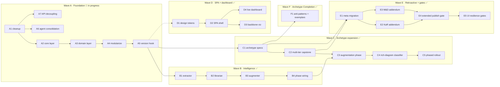
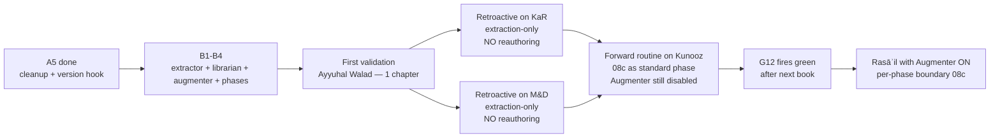

# Pipeline Refactor — Roadmap

# Summary Of Your Intent.

1. **Architecture-first rebuild on `develop`**. This plan derives every step from the architecture at [architecture.md](../architecture.md). Read architecture first; then this roadmap reads as *"to land that architecture, do these things in this order."*
2. **Six waves, 32 steps.** Wave A foundation (cleanup, core layer, modularization) — **in progress**: A1/A2/A3/A4/A5/A6/A7 done. A4 completed 2026-05-28: `orchestrate_book.py` → 461 lines; 11 `phases/` handlers; `_authoring/` package (6 submodules). Waves B–F not started.
3. **Legacy plan folder gets folded in then deleted**. ~22 legacy files in `_workspace/plan/` are surveyed, the live pieces are extracted into the new nested structure, the rest are removed (git history preserves them). Step A1 is the cleanup; nothing else lands until A1 is done.
4. **Retroactive doctrine for shipped books**. KaR and M&D get archetype stamping, addendum episodes, and extraction-only knowledge passes. **Never** re-run through the pipeline. Every enhancement still becomes default for the next forward book.
5. **Plan only — no execution authorized**. This turn writes the plan files. Asif's approval before any code lands.

---

## How This Plan Reads

| Symbol | Meaning |
|---|---|
| **Step ID** | `<Wave>.<Step>` e.g. `A1`, `B3`, `C2` |
| **Mobilization step** | `<Wave>0` e.g. `B0` = the pre-wave setup step that must run before the rest of that wave |
| **Plan-block format** | `### N. {statement}` + blockquote description + `*Value gained:*` closer |
| **Dependency arrow** | Listed as `depends_on:` in [plan.yaml](plan.yaml) |
| **Authorization tier** | T0 (silent), T1 (do + surface), T2 (always ask) per [CLAUDE.md](../../../CLAUDE.md) |

## Wave Diagram

Wave A is the gate. Wave B and Wave C can run in parallel after A. Wave D is independent — it can start any time after A1 (cleanup) since it operates on plan files, not pipeline code. Wave E is last; it depends on B4 + C2 for the retroactive enhancements to be coherent.

## Wave Governance

Every wave now follows one non-negotiable closeout protocol:

1. **Wave-end cleanup is mandatory.** Each wave must run a quality pass (code health check, dead-code sweep, and stack-idiomatic simplification where applicable) before the wave is allowed to close.
2. **Wave completion merges directly to `develop`.** No PR path for wave closure.
3. **Branch discipline is orchestrated.** The runner auto-targets the correct wave branch (`refactor/wave-<n>`), merges completed work into `develop`, then switches back to the wave branch so subsequent commands remain in the right lane.
4. **Quality is iterative, not one-shot.** Red-green cleanup runs in narrowing passes until checks are green and no regressions are detected.
5. **Working-tree cleanliness is mandatory at the end of each execution pass.** The operator may commit implementation changes and may discard or reset unrelated local deltas as needed so the branch is left clean, without pausing to ask for confirmation each time.
6. **Holistic pre-wave review is mandatory.** Before starting wave N, rerun acceptance checks for every prior wave, validate phase-runner state for those waves, and block execution if any prior wave is not fully green.
7. **Inline card reporting is mandatory.** With UI telemetry disconnected, every wave update must be reported in chat using a clear status card (goal, prior-wave verdicts, current-wave progress, blockers, next action) so operators can track execution without the planner UI.

---

# Wave A · Foundation

### A1. Clean the legacy plan folder and stand up the nested structure.

> Survey every file in `_workspace/plan/` (root level), fold pending work into the new nested structure described in [architecture.md §SPA & Design System](../architecture.md#the-spa--design-system), then delete the legacy files (git history preserves them). New layout: `conventions/` (response-template, response-conventions, general, authoring), `debt/` (pipeline-debt.md moves here), `operations/` (per-book-ship-checklist moves here), `reader/` (podcast-reader polish moves here), `refactor/` (this plan), `spa/` (design system + components + routing), plus existing `research/` and `_drivers/`. Files to fold-and-delete after content extraction: `acceptance-criteria.md` (84K — extract any P-items not in pipeline-debt.md), `intelligence-pipeline-wave1-spec.md` (already folded into architecture.md + this plan; delete), `podcast-intelligence-enhancements.md` (extract items 3-6 → `conventions/authoring.md`; delete), `v4-doctrine-propagation.md` (LANDED 2026-05-22 per pipeline-debt.md, delete), `f25-apparatus-table-schema.md` + `f27-validator-drafts.md` (status tracked in pipeline-debt F25/F26/F27; delete sources), `podcast-plan.yaml` (263K — scan for live items, fold into pipeline-debt.md, delete), `podcast-plan-DoR.md` + `-appendix.md` (superseded by per-book-ship-checklist.md; delete). Files to delete outright (dated event reports, rollout artifacts): `STUDIO-ALIGNMENT-2026-05-22.md`, `cohesion-audit-2026-05-23.md`, `handoff-kar-archetype-pivot.md`, all 11 kashkole-* files, `numeric-symbolic-disambiguation-plan.md` (scan first; if live, fold into debt). Delete the version stamp file `VERSION` (no versions anywhere). Delete the empty `pipeline-refactor/` subdir. Delete the stale root-level `pipeline-refactor.md` and `pipeline-refactor.yaml` (superseded by this nested structure). **`_workspace/plan/view/` (9 HTML files + assets): DELETED 2026-06 as part of plan-dashboard Astro consolidation — all live diagrams migrated to `plan-dashboard/src/pages/`; legacy view folder is gone from the working tree.**
>
> *Value gained:* The plan surface shrinks from 37 files to ≤ 14 in a coherent nested layout. Future Claude sessions and reviewers find what they need in one glance. The cleanup runs **FIRST** so no new code lands on a cluttered surface.

### A2. Build the Core layer — `_paths`, `_db`, `_archetypes`, `_anti_cliche`.

> Single path API at `scripts/podcast/_paths.py` exposing `book_dir(slug, category)`, `category_dir(category)`, `knowledge_base_dir()`, `knowledge_atoms_scratch(slug, category)`, `all_books()`. Single SQLite gateway at `scripts/podcast/_db.py` exposing `get_connection()` (singleton, WAL mode), `run_migrations()` (idempotent, applies 16 `schema/*.sql` files in order), and seven repositories: `atoms_repository()`, `atom_sources_repository()`, `atom_topic_tags_repository()`, `corpus_chapters_repository()`, `external_corpora_repository()`, `manual_review_queue()`, `run_telemetry()`. Single archetype registry at `scripts/podcast/_archetypes.py` exposing `load_archetype(slug)`, `resolve_archetype_for_book(meta_yml)`, `list_archetypes()`. Single anti-cliché phrase registry at `scripts/podcast/intelligence/_anti_cliche.py` exposing `CAPSTONE_DENY`, `SELF_HELP_DENY`, `TIER_2_DENY`, `AUGMENTER_PRIOR_TREATMENT_DENY` lists. Extend the existing Wave 1 scaffold at `scripts/podcast/knowledge/_atom_schemas.py` with `DoctrineBody` TypedDict (fields: `tradition`, `genre`, `binder_id`, `binder_slug`, `chapter_id`, `chapter_slug`, `section_ids`, `chunk_index`, `topic_tags`, `text_en`, `quran_refs`) and `DoctrineGenre` Literal; update `AtomType = Literal["quran", "hadith", "doctrine"]`. Canonical ID format for doctrine atoms: `doctrine:wisdom:<binder_id>:<chapter_id>:<chunk_index>` (chunk_index 0-based within the chapter). Seed the archetype registry on disk at `content/_shared/archetypes/<slug>/{exemplar.md, spec.yml, anti-patterns.md}` for the seven archetypes named in architecture. Create `content/knowledge-base/knowledge.db` via `_db.py:run_migrations()` using the 16-table SOLID-compliant schema (interactive view at `/db-schema` in the plan dashboard). The 16 tables organize into four categories: **Core** (books, chapters, episodes, phonetics, pipeline_runs, cost_ledger), **Knowledge** (knowledge_atoms, atom_sources, atom_topic_tags, external_corpora, topic_type_taxonomy, corpus_chapters), **Quality** (challenger_findings), and **Etymology** (arabic_roots, word_etymologies, letter_profiles). The Knowledge group's four corpus tables include a per-chapter refinement state machine so Wisdom data can be corrected independently — see B0.
>
> *Value gained:* Every later step has a single, stable, testable place to put paths, database access, archetype resolution, and banned phrases. No other module touches `sqlite3` directly; no other module hardcodes a path. SOLID-S (single responsibility) at the foundation. The 16-table schema replaces 6 scattered JSONL/JSON file families with a queryable SQLite database, making cross-book intelligence possible without per-book ad-hoc file wrangling.

### A3. Build the Domain layer — `_doctrinal`, `_context_injection`, `_cost_ledger` polish.

> `scripts/podcast/_doctrinal.py` gains `tradition_adjacency.yml` loader and an `assert_no_cross_tradition_collision(text, window=150)` function that flags any paragraph citing both an `ismaili-orthodox` and `ismaili-adjacent` author within 150 words without an adjacency-acknowledgment clause (see [architecture.md §Decision Records DR-011](../architecture.md#decision-records-adrs)). It also inherits the existing `R-IMAM-NUMBERING` check (Imam Hasan = first Imam; "Imam Ali" forbidden; substitute "the Commander of the Faithful" / "the Father of Imams"). `scripts/podcast/_context_injection.py` exposes the shared contract used by both the 08b augmentation phase and the Augmenter: `format_provenance(source)` (neutral-phrasing template), `build_injection(atoms, max_tokens, types)` (token-budgeted), `strip_arabic_script(text)` (removes U+0600–06FF and U+0750–077F before injection). `_cost_ledger.py` (existing) gets a thin extension exposing per-phase + per-book cost queries the dashboard reads.
>
> *Value gained:* Cross-tradition doctrinal drift is structurally prevented, not left to authoring judgment. The single shared injection contract means augmentation and the Augmenter never diverge on provenance phrasing or token budgeting. The cost ledger gains queryable surface area for the live dashboard.

### A4. ✅ Modularize `orchestrate_book.py` and `_authoring.py`. *(completed 2026-05-28)*

> `orchestrate_book.py` thinned to 461 lines. Eleven phase handler modules extracted into `scripts/podcast/phases/` (initial_driver, resume_dispatcher, preflight, scaffold, series_plan, bundle_audit, per_chapter, chapter_driver, publish_driver, merge, register_series). `_authoring.py` split into `scripts/podcast/_authoring/` package with six submodules (`_core`, `_refine`, `_chapter_design`, `_enrichment`, `_framing`, `_convergence`) and an `__init__.py` that re-exports the full public API for backward compatibility. Old `_authoring.py` flat file removed. 278 tests passing, 4 pre-existing failures unchanged.
>
> *Value gained:* Every module has one job, testable in isolation. All new/modified files are DR-005 compliant (≤ 600 lines). Subsequent waves can change one phase without merge-conflicting against a giant file.

### A5. Strip every version stamp + add the pre-commit guard.

> Remove `Version: X.Y` headers from `framework.md`, `_workspace/plan/view/agents/view-generation-agent.md`, `.github/agents/operating-contract.md`, `reference/cortex-challenger-framework.md`. Rename `v4-doctrine-propagation.md` (if not deleted in A1) and `CONTENT/drafts/BOOKS/the-master-and-the-disciple/audits/v2.2-vs-v2.1-diff.md`. Remove version comments in `scripts/podcast/{_authoring.py:1759, _authoring.py:1789, _rules.py:189..250, build_slide_deck.py:4, audit_transcript.py:64}`. Install a pre-commit hook (`infra/git-hooks/pre-commit`) that rejects any commit containing `^Version:\s*\d` in tracked files OR any new file matching `*v[0-9]*.md`. Investigate the `CONTENT/` vs `content/` case mismatch on the Mac filesystem (possible duplicate tree under the case-insensitive filesystem).
>
> *Value gained:* No file or comment in the repo says "v2" or "v3.2" or "Version: 4.1". The current file IS the version. The doctrine is mechanically enforced going forward, not just documented as a wish.

### A6. Consolidate the agent sprawl — one canonical spec per agent, one installation path.

> The repo maintains agent behaviour specs in two places simultaneously: one directory that Claude Code reads at runtime, and a second directory used by GitHub Copilot for agent browsing. After the journal-repo split, these two surfaces drifted apart. Nine agents now carry identical full specs in both locations; three agents exist only in the Copilot surface and are therefore invisible to Claude Code; two agents exist only in the Claude Code surface with no Copilot stub; one deprecated agent (`CORTEX`) and one misplaced reference document (`operating-contract.md`) clutter the Copilot surface; and the install-script's README still names two agents that left with the journal split (`journal-challenger`, `ui-reviewer`). The fix: designate `infra/claude-agents/` as the single canonical location for every full spec. Migrate the three Copilot-only agents (`reconcile`, `project-steward`, `podcast-librarian`) into `infra/claude-agents/` so the install script covers them. Rewrite every `.github/agents/` file as a thin stub — exactly as `podcast-planner.agent.md` already does — containing only the frontmatter `name` + `description` and a single pointer line to the `infra/claude-agents/` canonical. Delete `CORTEX.agent.md` (deprecated 2026-05-17; spec is vestigial) and move `operating-contract.md` to `reference/` where it belongs. Rewrite `infra/claude-agents/_README.md` to reflect the correct agent count, remove stale journal references, and document the stub pattern. Update `scripts/install-claude-skills.sh` to install all agents (the current script installs 7; the correct count after this step is 17 active agents). New DR: `DR-014 — agent canonical spec lives in infra/claude-agents/; .github/agents/ contains stubs only; the install script is the source of truth for what Claude Code can invoke`.
>
> *Value gained:* Every agent Claude Code can invoke also has a Copilot stub. Every agent Copilot surfaces also has a Claude Code spec. The install script is authoritative — running it on any machine produces the identical agent surface. Editing an agent spec means editing one file in one place. The CORTEX ghost and the misplaced reference doc are gone.

### A7. Decouple all batch processing from the interactive AI plan — prevent unbounded overnight spend.

> The KASHKOLE pipeline (Phase 2 adapt, 122 chapters) was wired to run through the interactive Claude CLI, which draws from the same weekly token pool used for operator conversations. Running 215 sequential overnight calls exhausted that weekly limit and triggered $466 in auto-reload charges — because the two pools, interactive operator use and automated batch pipeline, were never separated. The fix: every pipeline stage that fires more than 10 unattended AI calls must use a dedicated API key with its own monthly spend cap set at console.anthropic.com, never the interactive plan. Apply this to the KASHKOLE adapt and challenge scripts and their batch drivers, and audit the podcast orchestrator for the same pattern across all its LLM call sites. Stack three compounding efficiency improvements on top: (1) prompt caching — the system prompt is identical across all chapter calls, so billing it once at 10% of normal cost saves 30-40% on inputs; (2) Batches API — submitting the entire corpus as one async job cuts cost by 50% vs sequential synchronous calls; (3) a per-session chapter cap so no runaway overnight job exceeds a configurable limit without requiring a manual restart. New DR: `DR-015 — any pipeline stage firing >10 unattended LLM calls uses the direct API with a dedicated spend-capped key; the interactive plan is for human operators only`.
>
> *Value gained:* The $466 overflow cannot happen again. Future 122-chapter books cost $80–85 all-in instead of an open-ended liability. The interactive AI plan stays clean for actual operator conversations. Cost is predictable, auditable, and bounded at the architectural level rather than relying on discipline.

**Execution update (2026-05-27):**
- Wave A foundational modules and doctrinal aggregation are landed and validated.
- Oversized pipeline entry files were split into thin compatibility entrypoints with moved implementation modules, bringing `scripts/podcast/` under the ≤600-line guardrail.
- KAHSKOLE adapt/challenge batch pipelines were migrated off interactive CLI shellouts to direct Anthropic API calls with dedicated-key lookup and prompt caching.
- Batch drivers now enforce a per-run chapter cap (`--max-chapters`, default 50) as a runaway-spend safety brake.
- Top-level plan-root legacy clutter was reduced to canonical files only (`README`, `architecture`, `copilot-handoff`), with stale root files removed.
- Agent stubs and installer behavior remain consolidated and dry-run verified against the canonical infra-agent directory.
- Pre-Wave-B quality gate run across prior waves found one mandatory alignment item: A6 acceptance criteria expected 16 agents while canonical repo truth is 17; criteria aligned and re-verified before Wave B kickoff.
- Wave B kickoff initiated with Mobilization step B0 in progress.
- A second mandatory alignment item surfaced during B0 implementation trace: schema migrations were still at 6 files while Wave A contract required 16; migrations were expanded to the full 16-file set and re-verified.
- Wave B B0 now has a live first slice in code: ingestion-driver scaffold, lookup-table seeding, refinement-state transitions, and idempotency/state-machine tests.
- Wave B next slice has started in executable form: the extractor is now functional (quran/hadith citation parsing + validated atom schema + scratch JSONL output path), with new tests covering canonical IDs, validation mismatches, dedupe-by-id source accumulation, and CLI pathing.
- Before advancing further, a collective acceptance audit across prior completed work found one B1 gap cluster (budget gate, low-confidence review queue behavior, contract-test surface, and module size target). A mandatory alignment step was inserted and completed.
- Alignment outcome: extractor now enforces budget caps, appends low-confidence findings to manual review, has explicit schema/budget acceptance tests, and was refactored into helper modules to satisfy the line-budget target while preserving behavior.
- Post-alignment acceptance rerun passed, and execution has now advanced immediately into B2.
- B2 is now active in code: librarian merge logic is implemented for new, duplicate, variant, and conflict outcomes, including manual-review conflict queueing and per-book merge reports, with dedicated B2 regression tests now green.
- Autonomous wave governance is now being enforced in the runner path: each wave invocation performs a collective prior-wave quality check, inserts mandatory alignment automatically on detected gaps, and only proceeds when gaps are resolved.
- Planner visibility now includes autonomous governance timeline events (start, quality-pass, alignment-started, alignment-resolved/blocked, wave-complete) from a shared event log consumed by the snapshot generator.
- A mandatory alignment correction has been completed on the governance contract itself: wave execution now reads from a dedicated wave-acceptance checklist (instead of the per-book ship checklist), so prior-wave quality evaluation reflects real wave progress rather than a zero-row false pending state.
- A follow-up runner stability fix has also been completed: checklist resolution now happens in the active branch context after wave-branch checkout, which prevents launch-time failures when a newly-created wave branch does not yet carry the dedicated checklist file.
- The Wave 2 alignment blocker has now been fixed directly: missing autonomous runners for the two open Wave 2 items were implemented, augmenter behavior is now executable with dedicated tests, and checklist row-marking was corrected to update the active wave checklist so mandatory alignment can actually close gaps in place.
- **CORRECTION (2026-05-28):** Wave B was incorrectly recorded as completed. All Wave B intelligence files (`knowledge/extractor.py`, `knowledge/librarian.py`, `knowledge/augmenter.py`, `intelligence/wisdom_ingest_knowledge.py`) are scaffold stubs only. Wave B is `in_progress`. Real B0 implementation starting now with schema migrations 017+018 and the Wisdom ingestion driver.
- **2026-05-28 — B0 complete:** `intelligence/wisdom_ingest_knowledge.py` (326 lines) live with 16 passing tests. Schema migrations 017 (doctrine atom type) and 018 (corpus_chapter ingest tracking) applied. 84 tests total.
- **2026-05-28 — B1 complete:** `intelligence/extractor.py` (290 lines). Reads chapter `.txt` files, calls `claude -p` per chapter, validates atoms against `_atom_schemas.py`, writes scratch JSONL, flushes low-confidence atoms to `manual_review_queue`. 20 new tests. `_atom_schemas.py` stubs implemented + `DoctrineBody` added.
- **2026-05-28 — B2 complete:** `intelligence/librarian.py` (239 lines). Pure Python. Classifies scratch atoms as NEW/MERGED/VARIANT/CONFLICT against the DB. Writes `knowledge-merge-report.md`. 11 new tests.
- **2026-05-28 — B3 complete:** `intelligence/augmenter.py` (194 lines). DB-backed doctrine lookup via `atoms JOIN atom_topic_tags`. Guards: disabled by default, `needs_review=0` gate, Arabic stripped (DR-012). 17 new tests. 132 tests total, all passing.

---

# Wave B · Intelligence Layer

### Mobilization (pre-wave before Wave B)

> The Mobilization stage is the practical setup work that comes before wave execution. In Wave B, this is step `B0`.

> ⛔ **BLOCKER — discuss with Asif before any Wave B step executes.**
> Before B0 ingests the Wisdom corpus into the intelligence library, Asif wants to evaluate one open option: use ChatGPT or Gemini (paid accounts for both) to **further enrich the adapted Wisdom chapter text** before it becomes knowledge atoms. Enriched text could improve doctrinal atom depth, topic-tagging precision, and Quran cross-reference coverage — all of which affect what the Wave B Augmenter injects into future book productions. Three decision paths: **(a)** ingest as-is from existing adapted extracts (current plan baseline); **(b)** run a ChatGPT/Gemini enrichment pass on all PASS+WARN chapters before B0 ingests; **(c)** run enrichment as a post-hoc annotation layer on already-ingested B0 atoms. **No Wave B code lands until this discussion resolves and one path is selected.**

### B0. Build the Wisdom corpus ingestion driver — independent chapter refinement.

> `wisdom_ingest_knowledge.py` (≤ 400 lines) seeds the intelligence library from the 75 PASS+WARN Wisdom chapters without going through `orchestrate_book.py`. Idempotent per chapter: re-running on a corrected chapter deletes that chapter's old atoms (`atom_sources`, orphaned `atom_topic_tags`, orphaned `knowledge_atoms`), then re-ingests clean from the corrected `adapted-extract.en.md`. The refinement state machine on `corpus_chapters.ingestion_status` has five states — `pending → ingested → needs_correction → correction_draft → re_ingested` — so Asif can mark a chapter for correction, edit its source file, and re-ingest it in any order without touching the rest of the library. Atoms from WARN chapters carry `needs_review = 1` until the chapter is re-ingested with a clean PASS. CLI: `--chapter <slug>` (single chapter), `--re-ingest` (correction cycle), `--dry-run` (preview changes without writing), `--status` (print a 122-row table: slug | verdict | ingestion_status | atom_count), `--force` (override a FAIL verdict after manual clearance). Seeds `external_corpora` (one Wisdom row) and `topic_type_taxonomy` (18 rows) on first run; idempotent on repeat. The topic-type expansion logic (TopicID → `atom_topic_tags` rows via `topic_type_taxonomy`) is extracted as a shared function the B1 Extractor reuses for pipeline-sourced doctrine atoms. Doctrine atom canonical ID: `doctrine:wisdom:<binder_id>:<chapter_id>:<chunk_index>` (0-based chunk index within the chapter). Chunking: split `adapted-extract.en.md` on `<!-- section N -->` markers, group consecutive sections into ≤600-word chunks without mid-section splits. Quran atoms: each `⟪quran S:A⟫` marker yields a `quran` atom with the surrounding paragraph (~150 words) as `tafsir_note`. Hadith atoms: from `adaptation-citations.jsonl` entries matching hadith collection names. Topic tags sourced from `_workspace/source-library/topic-type-map.json` (18-row taxonomy, 223 per-topic assignments — no DB access needed during ingestion). Full implementation spec: [../intelligence/wisdom-intelligence-spec.md](../intelligence/wisdom-intelligence-spec.md).
>
> *Value gained:* 75 PASS+WARN chapters become live knowledge atoms the moment B0 ships — before a single pipeline book runs B1. The correction workflow is editorial (edit a file, mark a chapter, re-ingest) rather than pipeline (no costly LLM re-run per correction). `--dry-run` makes every proposed correction safely previewable. `correction_count` in the dashboard surfaces chronically problematic chapters so systematic data issues are visible rather than buried.

### B1. Build the Extractor.

> Implement `scripts/podcast/intelligence/extractor.py` (≤ 300 lines) exposing `extract_atoms_for_book(bd) -> Path` and `extract_atoms_for_chapter(text, slug, ch) -> list[Atom]`. Single Claude Sonnet structured-output call per chapter with a strict JSON schema. Reads `BOOK_DIR/chapters/<ch-slug>.txt` (the enriched chapter source — NOT audio scripts, which carry NotebookLM drift). Writes atoms to `BOOK_DIR/_system/knowledge-atoms-scratch.jsonl`. New R-* constants: `R_KNOWLEDGE_EXTRACTOR_COST_CAP_USD_PER_CHAPTER = 0.10`, `R_KNOWLEDGE_EXTRACTOR_COST_CAP_USD_PER_BOOK = 10.00`, `R_KNOWLEDGE_EXTRACTOR_CONFIDENCE_REVIEW_THRESHOLD = 0.7`. Atoms with confidence < 0.7 auto-appended to `manual_review_queue`. Atom schema per [architecture.md §Data Architecture](../architecture.md#knowledgedb-schema-er-view).
>
> *Value gained:* Every chapter the pipeline processes contributes citable atoms to the cross-book knowledge brain. Cost is bounded and predictable at any book scale ($6 ceiling for Rasāʾil's 60 chapters).

### B2. Build the Librarian.

> Implement `scripts/podcast/intelligence/librarian.py` (≤ 250 lines) — pure Python, no LLM. `merge_into_library(bd, scratch_path) -> MergeReport`. Exact-match canonical-ID dedup against `knowledge_atoms`. Four outcomes: *new* (INSERT into `knowledge_atoms` + `atom_sources` with `source_type='pipeline'`); *duplicate* (atom already exists by canonical ID — INSERT a new `atom_sources` row for this pipeline provenance; the `knowledge_atoms` row is unchanged); *variant* (same canonical ID, different `text_en` — INSERT new `knowledge_atoms` row with a variant marker in `body_json` + `atom_sources` row); *conflict* (same canonical ID, different `text_ar` or hadith grade → write to `manual_review_queue`, halt phase). Conflict-resolution helper at `intelligence/resolve_conflicts.py` with three modes: `--accept-incoming`, `--keep-existing`, `--both-as-variants`. Emit per-book merge report at `BOOK_DIR/_system/knowledge-merge-report.md`. Install `.git/hooks/post-merge` (template at `infra/git-hooks/post-merge-knowledge.sh`) that re-invokes Librarian when both merged branches touched `knowledge.db`. Also emits `content/knowledge-base/_index/doctrine-by-tag.json` — flat JSON mapping each topic tag to a sorted list of atom IDs (rebuilt incrementally on each Librarian run; enables O(1) Augmenter lookup without a DB scan).
>
> *Value gained:* The library never silently overwrites authoritative atoms. Every disagreement surfaces for human judgment. Parallel-branch knowledge-base writes have a documented merge story.

### B3. Build the Augmenter.

> Implement `scripts/podcast/intelligence/augmenter.py` (≤ 250 lines) exposing `augment_for_chapter(book_slug, chapter_id, chapter_text, *, max_atoms=5, max_tokens=800, doctrine_topic_ids=None) -> str`. Two independent lookup paths: (1) **Quran + hadith** — regex-scan chapter text for canonical citation patterns (`Q\d+:\d+`, hadith chains), exact-ID lookup in `knowledge_atoms WHERE type IN ('quran','hadith') AND needs_review=0`; (2) **Doctrine (Wisdom)** — when `doctrine_topic_ids` is set (non-empty list of integers from `meta.yml`), query `atom_topic_tags JOIN knowledge_atoms WHERE type='doctrine' AND needs_review=0 AND topic_type_id IN (doctrine_topic_ids)`; **silently skip when absent**. Doctrine scoring: topic signals extracted from `⟪ar:…⟫` markers and key theological terms in `chapter_text` (`tawhid`, `wilaya`, `tawil`, `mabda`, `maad`, `aql`, `nafs`, `hudud`, `dawat`); each candidate atom scored by `len(intersection(chapter_signals, atom.topic_tags))`; sorted desc; doctrine capped at 3 atoms (≈300 tokens each). Self-exclusion: atoms whose `binder_slug` matches `book_slug` are excluded (a book is not its own doctrinal prior source). Injected prompt block: `[PRIOR DOCTRINAL CONTEXT — Wisdom corpus] / Topic: {comma-joined topic_tags} / Source: Wisdom — {binder_slug}, ch. {chapter_slug} / --- / {text_en truncated at sentence boundary}`. The `needs_review=0` gate applies to both paths — WARN-verdict Wisdom atoms never reach augmentation output until Asif re-ingests them clean. Always strips `text_ar` via `_context_injection.strip_arabic_script` (DR-012). Always uses `_context_injection.format_provenance` neutral-phrasing template. **Default disabled** via `series.enable_knowledge_augmenter: false`; returns empty string when flag is unset. `doctrine_topic_ids` is an optional `meta.yml` book-level field (list of integers matching `topic_type_taxonomy.type_id` from the B0 18-row seed); when absent, doctrine injection is silently skipped, keeping Wisdom-specific content out of books of other traditions. Three call sites with documented token budgets: `08-enrichment` (200), `11-per-chapter` (500), `0g-audit` / `podcast-challenger` (800). New R-* constants: `R_KNOWLEDGE_AUGMENTER_DEFAULT_ENABLED = False`, `R_KNOWLEDGE_AUGMENT_MAX_ATOMS = 5`, `R_KNOWLEDGE_AUGMENT_MAX_TOKENS = 800`.
>
> *Value gained:* Book N+1's authoring inherits Book N's verified Quran and hadith treatments AND relevant Wisdom doctrine atoms — with sources attached and only if Asif has explicitly configured which topic types are relevant. The `needs_review=0` gate ensures only chapters he has validated (or re-ingested clean after correction) reach podcast authoring. The `doctrine_topic_ids` opt-in prevents Ismaili-specific doctrine from contaminating books of other traditions. The default-disabled gate (G12 acceptance, see E4) prevents shipping a flywheel that doesn't change outputs.

### B5. Ingest hadith, etymology, and classical Arabic poetry atoms from the MCP source library.

> `scripts/podcast/intelligence/ingest_mcp_corpus.py` — a single ingestor that pulls three new atom types directly from the wisdom corpus MCP (KASHKOLE + KQUR) via `source_library_queries.py`, with zero LLM spend and zero `claude -p` calls. **Hadith**: KASHKOLE tags 14 topics as TopicTypeID 17 (Prophetic Hadith) and additional topics as type 23 (Hadith Commentary) — queried via `topic_get()` and stored as `hadith:kashkole:<topic_id>` atoms with text, collection attribution, and tradition. **Etymology**: KQUR holds a full Roots + Derivatives table covering all Arabic roots used in the corpus — bulk-dumped via `word_etymology()` and stored as `etymology:<root_transliteration>` atoms with Arabic root, meaning, grammar tags, and derivative forms. **Classical Arabic poetry**: KASHKOLE binder 5 (`muntakhab-ashaar` = selected poetry) and TopicTypeID 31 (manqabat praise poems) — extracted via `topic_get()` and stored as `poetry:kashkole:<topic_id>` atoms tagged by genre. Also fixes a critical violation in `extractor.py`: `_default_claude_caller()` currently shells out to `claude -p` — replaced with a Gemini REST call (same pattern as `gemini_refine.py`). The `claude -p` fix is Tier 0 (compliance, zero spend).
>
> *Value gained:* Removes the standing hadith blocker without waiting for an external database — the data has always been in KASHKOLE. The Augmenter (B3) gains two verified atom types; the knowledge stage can now annotate hadith references in Ayyuhal Walad ch02–ch05 and all future books. Etymology atoms power Studio viewer Arabic term tooltips. Poetry atoms let the knowledge stage recognize and annotate classical poem citations in books quoting Ghazali, Ibn Arabi, or the Ismaili marsiya tradition. The `claude -p` fix eliminates accidental Max-token drain from the extractor.

### B4. Wire the three new phases into `PHASE_ORDER`.

> Add to `scripts/podcast/_phases.py` `Phase` enum: `ARCHETYPE_RESOLVE = "08a-archetype-resolve"`, `AUGMENTATION = "08b-augmentation"`, `KNOWLEDGE_EXTRACT = "08c-knowledge-extract"`. Wire handlers into `phases/{archetype_resolve, augmentation, knowledge_extract}.py`. Update `orchestrator-state.json` schema with new `phases.08a / 08b / 08c` sections. Conflict-halt interaction with phased-rollout: when `phased_rollout: true`, `08c-knowledge-extract` runs per-phase-boundary, not per-book; conflicts halt only that phase. Update `framework.md` phase table + `skills-staging/podcast/SKILL.md` + `podcast-challenger.md` Category catalog in the same PR per the standing docs-sweep rule.
>
> *Value gained:* The intelligence layer becomes a routine pipeline phase, not an ad-hoc add-on. Resume semantics are preserved (letter-suffix slot convention). The docs-sweep keeps the agents' read surface accurate.

---

# Wave C · Archetype Expansion

### C1. Land the archetype specs on disk for PLAY-NOVEL, LECTURE-SERIES, and ENCYCLOPEDIC-EPISTOLARY.

> For each archetype, create `content/_shared/archetypes/<slug>/{exemplar.md, spec.yml, anti-patterns.md}`. **PLAY-NOVEL** spec: mandatory EP00 preface (≤ 20 min), dedicated source bundle (character roster as conversational prose NOT bulleted list, setting, stakes, structural map, vocabulary primer, tone directive), per-chapter `presumed_context` field naming which preface elements the chapter relies on. **LECTURE-SERIES** spec: required `08-pre-synthesis` step before enrichment that synthesizes thematic clusters + chronological doctrine arc + proposed chapter segmentation (NOT a copy of lecture-file order), Azure-Urdu gap-fill workflow at `scripts/podcast/azure_speech_fill_gaps.py` (S0 tier, ur-PK locale, ~$3/book). **ENCYCLOPEDIC-EPISTOLARY** spec: `epistle_count`, `part_map`, `augmentation_enabled: true` default-on, `diagram_density: high`, `phased_rollout: true`, `capstone_mode: full_brethren`. Each archetype's `spec.yml` declares its meta.yml field requirements. **Arabic-source translation workflow** (added per oq2 resolution): the Rasāʾil PDF is Arabic original 4-volume (archive.org Turath upload, likely Beirut 1957 Dar Sader — colophon to confirm at intake). New script `scripts/podcast/azure_arabic_translate_bundle.py` parallels the existing Urdu workflow: Azure DocIntel for layout-aware extraction → Azure Translator (ar→en) with per-segment confidence → manual-review markers on any low-confidence epistemic claim. Adds a confirm-edition-at-intake sub-step that reads the PDF's first few pages to identify publisher/year before processing begins.
>
> *Value gained:* The pipeline becomes content-aware. Adding an 8th archetype later is three markdown/yaml files — not a code rewrite.

### C2. Build the multi-tier capstone authoring module.

> Implement `_authoring/capstone.py` with strict recursion-invariant enforcement (DR-002): tier-2 source_assembly reads ONLY tier-1 capstone source bundle + chapter abstracts (~200 words per chapter); ANY attempt to read chapter-scope source from tier-2 raises `CrossTierRead`. Five capstone modes implemented: `none`, `single`, `single_plus_distillation`, `per_part_and_single`, `full_brethren`. Tier-1 cap: 25 min. Tier-2 cap: 12 min AND ≤ 50% of tier-1 runtime. Per-part cap: 20 min. Capstone outputs route through `build_episode_txt.assert_doctrinal_clean()` BEFORE write — the authoring path does NOT bypass the per-chapter R-* gate (catches R-IMAM-NUMBERING violations, R-PHONETICS-OUT violations, etc.). Six new challenger quality gates: `distillation-shorter-than-capstone` (P0), `distillation-fewer-revisions` (P0, kernel_count ∈ {1,2,3}), `distillation-not-recap` (P0, uses `_anti_cliche.TIER_2_DENY`), `distillation-kernel-test` (P1), `per-part-bounded-to-part` (P0), `capstone-no-cliche-self-help` (P0).
>
> *Value gained:* Dense philosophical books get the kernel-distillation listeners deserve. The recursion invariant prevents chapter-scope corrections from leaking into kernel principles. The doctrinal gate inheritance prevents forbidden phrasings from regenerating in capstone outputs.

### C3. Build the 08b modern-research augmentation phase.

> Implement `phases/augmentation.py` (≤ 300 lines). For each source unit (epistle, chapter, lecture cluster), generate `BOOK_DIR/_system/augmentations/<unit-slug>.md` listing 5-15 contemporary scientific findings, recent scholarly works, or modern debates that **confirm**, **extend**, **contest**, or **contextualize** the source's claims. Defaults: ON for `encyclopedic-epistolary`, opt-in for `scholarly-deep-dive` and `lecture-series`, never enabled for `play-novel` and `aphorism-collection`. Every citation passes through the canonical-form pre-filter from C4 AND a **live verification step** before emit: URLs get an HTTP HEAD (3s timeout, follow ≤ 3 redirects, accept 2xx/3xx; 4xx/5xx/timeout → reject), DOIs get a Crossref `works/{doi}` lookup (https://api.crossref.org, 5s timeout; 404 → reject; rate-limited per Crossref polite-pool with `mailto=asifhussain60@gmail.com` UA header and exponential backoff on 429). Verification results cached at `content/knowledge-base/citation_cache.sqlite` (URL → status, fetched_at) with a 30-day TTL so re-runs don't re-hit the network. A new verification module `scripts/podcast/intelligence/_citation_verify.py` (≤ 200 lines) exposes `verify_url(u)`, `verify_doi(d)`, `verify_citation(c)` returning `Verified | Rejected(reason) | Indeterminate(reason)`. Indeterminate results (network flake, Crossref rate-limit exceeded after 3 retries) **do not fail the phase** — they emit the citation with a `data-verification='indeterminate'` attribute and queue it in `manual_review_queue` for Asif to clear before publish. The augmentation phase exposes a `--offline` flag that bypasses live checks and routes all citations through the canonical-form prefilter only (for sandboxed dev runs). Augmentation output is also a source for the Extractor (B1) — verified citations introduced by augmentation enter the cross-book atom library; rejected ones are dropped before extraction sees them. Anti-cliché check blocks `quantum spirituality`-style contemporary-buzzword hijacking.
>
> *Value gained:* Dead-link/fake-DOI failure mode caught inline rather than at human-review time. The cache + indeterminate-bucket pattern keeps network flake from becoming a phase-failure mode; the `--offline` flag preserves dev-loop speed. Rasāʾil's 10th-century insights pair with modern animal cognition (Epistle 22), music neuroscience (Epistle 5), emergent-structure cosmology (the emanation epistles) — extending the corpus rather than imposing on it.

### C4.0. NotebookLM diagram-capability pilot (PRE-C4 gate; per oq7 resolution).

> Run a 2-3 Rasāʾil epistle pilot through NotebookLM with explicit slide-deck-generation prompts requesting structural diagrams (emanation hierarchy, taxonomic tree, geometric proof, Pythagorean ratio chart). Cost ~$30. Report findings: which diagram types NotebookLM actually renders, fidelity grade per type, where prose-bullet fallback occurs. **Findings dictate C4 gate severity:** if NotebookLM reliably produces ≥ 4 of the 9 diagram types named in [architecture.md §Rich-diagram mode](../architecture.md#the-spa--design-system), C4 gate is hard (P1 fails challenger at < 60% coverage). If NotebookLM produces < 4 types reliably, C4 gate demotes to P2 advisory AND C4 spec adds an externally-authored-diagram fallback path (Mermaid + Excalidraw fed as images via the slide-deck upload UI). Pilot output documented in `_workspace/plan/research/notebooklm-diagram-pilot-findings.md`.
>
> *Value gained:* C4 ships against empirical evidence, not assumption. The classifier gate is honest about what it can enforce — no aspirational metrics.

### C4. Build the MANUAL-REVIEW marker syntax, canonical-form pre-filter, and rich-diagram classifier.

> **Marker syntax**: `
...
` with reason enum: `azure-gap-fill`, `low-confidence-translation`, `ismaili-claim-unverified`, `doctrinal-cross-check-needed`, `transcript-reconstruction`, `augmentation-citation-unverified`. Canonical-form regex pre-filter at `scripts/podcast/intelligence/_canonical_regex.py` for Quran (`Q\d+:\d+`), hadith (`Bukhari ... \d+`), DOI, ISBN — cuts the manual-review queue ~70% by clearing well-formed citations to a sample-audit pool (20% sample). **Rich-diagram classifier** at `scripts/podcast/slides/classify_slides.py` (≤ 200 lines) labels each slide `diagram | prose | title | quote` via Claude vision pass (default; Gemini vision fallback). Activates only when `meta.yml.diagram_density == high`. Gate: `rich-diagram-coverage >= 60%` (P1 fails challenger). If classifier unavailable, gate demotes to P2 advisory — no aspirational hard gate. `podcast-reader` gains a `ManualReviewAlert.astro` component rendering markers with a red border and tooltip.
>
> *Value gained:* Reconstructed content cannot ship as authoritative. The manual review queue stays focused on items needing real judgment. Visual structure ships as actual diagrams, not bullet-list paraphrase — or the gate honestly admits it can't enforce.

### C5. Activate phased rollout + Tier-2 cost gates for large-scale books.

> Trigger: `archetype.estimated_episodes > 20` OR `meta.yml.phased_rollout == true`. The orchestrator halts at phase-boundary gates rather than running serially. Rasāʾil phasing: Phase A (Part 1 Mathematical, 14 epistles) → Phase B (Part 2 Natural, 17 epistles) → Phase C (Part 3 Psychological, 10) → Phase D (Part 4 Theological, 11) → Phase E (4 part-capstones + tier-1 Jāmiʿa + tier-2 distillation). Each phase boundary = Tier-2 always-ask gate. Estimated full Rasāʾil cost: $350-700. Heartbeat card surfaces cost ceiling status per phase.
>
> *Value gained:* No $700 surprise. Each phase produces reviewable output before the next phase commits cost. Drift detected early gets fixed before it compounds across 50+ episodes.

---

# Wave D · SPA + Dashboard

### D1. Land the design system tokens and Astro shell.

> `_workspace/plan/spa/design-system/tokens.css` exposes CSS custom properties shared across the plan SPA AND the existing `podcast-reader/` AND any future sub-app (catalog browser, knowledge-base explorer, etc.). Tokens: color (`--c-bg`, `--c-text`, `--c-accent`, `--c-warn`, `--c-success`, `--c-muted`), type (`--type-serif`, `--type-sans`, `--type-mono`, sizes via modular scale), spacing (`--space-xs..xl`), radius (`--radius-sm..lg`), shadow tiers. `_workspace/plan/spa/components/` houses shared component primitives: `Card.astro`, `MetricTile.astro`, `DiagramFrame.astro`, `Table.astro`. `_workspace/plan/spa/routing.md` documents the recipe for adding a new sub-app.
>
> *Value gained:* One stack, one theme, no duplicate UI primitives across the plan SPA and the reader section of the Podcast Factory Astro Site. Adding a new sub-app means "drop a route + import tokens" — not "design the visual language again."

### D2. Build the SPA shell at `_workspace/plan/index.html`.

> Astro project rooted at `_workspace/plan/` with `src/pages/index.astro` as the SPA entry. The shell provides: top nav (Plan · Architecture · Dashboard · Backbone · Debt · Books), theme provider (reads `spa/design-system/tokens.css`), router (Astro file-based routing). Default route lands on the dashboard sub-app (D4). Renders correctly in any browser opened from disk (no server required for the static sub-apps). Build output goes to `_workspace/plan/dist/` (gitignored); the `index.html` at the plan root is a thin redirect/launcher to `dist/index.html` for one-click open from Finder.
>
> *Value gained:* One URL (`open _workspace/plan/index.html`) launches every planning + visualization surface. Asif's daily entry point becomes a single artifact, not a folder of disconnected files.

### D3. Build the backbone visualization sub-app.

> Sub-app at `/backbone` showing the pipeline as a visual backbone with modules plugging in (per Asif's spec). Renders `refactor/plan.yaml` and `architecture.md` Mermaid sources, but interactively: click a phase station → see which handler module runs, which archetype invariants apply, which R-* checks fire. Click an archetype → see which phases behave differently. Animations on hover show data flowing through the backbone. Pure client-side; reads YAML + markdown at build time.
>
> *Value gained:* The architecture becomes explorable. Asif can show a collaborator "here's how the pipeline works" by navigating a live diagram, not flipping between text files.

### D4. Build the live dashboard sub-app.

> Sub-app at `/dashboard` (default landing) showing real-time progress of plan execution + system metrics. Reads two data sources: `refactor/progress.json` (per-step status, regenerated on every push by `scripts/plan/regenerate_progress.py`) and `content/knowledge-base/run_telemetry_snapshot.json` (read from `knowledge.db` `run_telemetry` table on every push). Metric tiles: in-flight books + current phase + cost-to-date, atoms-in-library count by type, last-7-days commits to develop, open manual-review queue count, phase-failure-rate this week. Plan execution: per-wave progress bar, per-step status (⬜🔄✅🛑), recent commits per step. Refreshes on page load — no live API in v1 (per [architecture.md SPA section](../architecture.md#the-spa--design-system)).
>
> *Value gained:* Asif sees "where are we?" at a glance without running commands. Single visual surface replaces `git log` + `jq` over state.json + grepping the debt backlog.

---

### D5. Replace the floating annotation toolbar with a right-hand annotation workspace + durable AI handoff.

> The floating left-side toolbar is retired. Paragraph hover now sets context while all editing happens in the right rail: markers, notes, and AI actions in one stable surface designed for right-handed use. Notes autosave when the cursor moves to a different paragraph. Marker updates persist in SQLite and remain visible on reload. Action outputs can be copied individually or copied as one accumulated queue. The queue is stored locally for instant flow and can be synced into a chapter JSON handoff file under the draft content tree so VS Code Copilot, Claude Code, and Cowork sessions can consume the same instruction set.
>
> *Value gained:* Reading and editing no longer fight each other. Annotation intent becomes a reusable data product (not just temporary UI state), which directly supports classification, retrieval, and lower-cost production loops.

### D6. Teach planner and site-sync to auto-detect missing architecture coverage and generate the needed view.

> The planning loop now treats annotation operations as a first-class architecture lane. Site-sync is extended to detect when a lane exists in the plan but has no corresponding architecture/infrastructure coverage in the dashboard. In that case it must patch navigation and generate or update the missing view instead of reporting passive drift only. A dedicated architecture subview documents the annotation lane visually and operationally so this pattern can scale from chapter to episode to slide deck and future surfaces.
>
> *Value gained:* New operational lanes stop depending on manual memory. The dashboard and plan stay structurally aligned by default, even as the system grows.

# Wave E · Retroactive Enhancements + Extended Publish Gate

### E1. Migrate every `meta.yml` to the unified schema.

> Author `scripts/podcast/migrate_meta_yml.py` (idempotent; no version suffix in script name; no `schema_version` field anywhere). Apply unified schema fields per [architecture.md §Content Archetypes](../architecture.md#content-archetypes--extensibility-seam-1). Default mapping: kitab-al-riyad → scholarly-deep-dive (deep, single_plus_distillation); asaas-al-taveel → scholarly-deep-dive (deep, single_plus_distillation); ayyuhal-walad → aphorism-collection (shallow, none); islr-mas-i → scholarly-deep-dive (medium, single); the-master-and-the-disciple → play-novel (none, requires_preface: true); kunooz-al-hikmah → lecture-series (single); rasail-ikhwan-al-safa → encyclopedic-epistolary (full_brethren). Sync each book's row into `knowledge.db.book_metadata`.
>
> *Value gained:* Every existing book becomes archetype-aware in one pass. New books inherit the unified schema at intake. No schema-version field; no v1/v2 fork.

### E2. KaR — tier-2 distillation addendum (no re-run).

> Branch: `book/kar-distillation-addendum` off `develop`. Procedure: (a) stamp KaR meta.yml with unified schema; (b) read existing tier-1 capstone source bundle from `chapter-contracts/`; (c) generate tier-2 distillation source bundle following C2 spec; (d) author framing.txt; (e) upload to NotebookLM as a NEW episode (EP15.5 or equivalent); (f) run challenger + postprod-review on the new episode only; (g) ship via publish_to_library.py; (h) apply Imam doctrine sweep (`scripts/podcast/sweep_imam_doctrine.py`) retroactively to all 13 KaR chapter sources + framings — auto-substitute safe cases, flag ambiguous ones. Then run extraction-only pass (B1+B2 against finalized KaR chapters → atoms → knowledge.db). **DO NOT re-author existing episodes. DO NOT enable Augmenter for KaR.**
>
> *Value gained:* KaR gets the kernel-distillation episode without burning $200+ on a full re-run. Imam-doctrine drift is corrected retroactively. KaR's Quran/hadith atoms join the shared knowledge brain.

### E3. M&D — EP00 preface addendum + vacuum + postprod-review (no re-run).

> Branch: `book/the-master-and-the-disciple` (current). Procedure: (a) stamp M&D meta.yml with unified schema (`play-novel`, `capstone_mode: none`, `requires_preface: true`); (b) author the EP00 preface from C1 PLAY-NOVEL spec — the single NEW episode produced; (c) run vacuum agent to rename NotebookLM-titled audio files to `ch##-<slug>.m4a` per the conventions file (per [postprod-vacuum-tasks.md](../postprod-vacuum-tasks.md) T4-T6); (d) run postprod-review across all 6 chapters using new PLAY-NOVEL archetype invariants; (e) run Imam doctrine sweep on all 6 chapter sources + framings; (f) extraction-only pass — read finalized chapters → atoms → knowledge.db. **DO NOT re-author any of the 6 shipped chapters. DO NOT enable Augmenter for M&D.** Postprod-vacuum task ledger is the operational source of truth for this step; this plan does not duplicate its 12-task tracking.
>
> *Value gained:* M&D gets the structural preface it has always needed, plus archetype-aware postprod-review, without re-authoring shipped chapters.

### E4. Extend the publish gate with G8–G12 + activate G12 acceptance.

> Extend `scripts/podcast/validate_ship_ready.py` (existing G1-G7 runner) with five archetype-aware gates: **G8** capstone-mode-honored (if `capstone_mode != none`, required tier-1 and tier-2 episodes exist and pass anti-cliché). **G9** rich-diagram-coverage (if `diagram_density == high`, classifier reports ≥ 60%). **G10** manual-review-resolved (no unresolved `
` markers). **G11** knowledge-base-merge-clean (Librarian merge-report.md reports zero conflicts). **G12** augmenter-A/B-acceptance — for books with `enable_knowledge_augmenter: true`, podcast-challenger surfaced at least one finding referencing an augmented atom. Until G12 fires green on at least one book pair (recommended: Kunooz + next-book-after), `R_KNOWLEDGE_AUGMENTER_DEFAULT_ENABLED` stays `false` even though the code is shipped (DR-007).
>
> *Value gained:* No book ships with a hidden archetype invariant violation. The A/B flywheel-health gate becomes a real automated check, not a manual review item.

### E5. Add automated UI resilience gates for planner surfaces and launcher lifecycle.

> Add a final quality lane that protects the planning UI from regressions discovered during Wave 1 implementation. Scope: (a) route-level visual sanity checks for Plan, Live, Architecture, and Database pages (viewport matrix at desktop + tablet breakpoints), (b) side-rail integrity checks (no overlap, no clipped cards, no accidental horizontal overflow), (c) launcher lifecycle checks (reuse healthy server, self-heal stale occupant, no forced Terminal termination prompts), and (d) dead-code sweep enforcement for plan-dashboard shared config modules. Wire this lane into CI as a fast gate that runs on dashboard-affecting changes and blocks merges on failures.
>
> *Value gained:* Dashboard quality stops depending on manual eyeballing. The exact failure modes uncovered in Wave 1 become permanently guarded against in the next wave, reducing regression risk and support churn.

---

## When to Build and Run the Intelligence Pipeline

---

## Open Questions

### Resolved 2026-05-26 (Asif locked)

1. ✅ **Recursion invariant** — Option A confirmed. DR-002 stands: tier-2 reads ONLY tier-1 + chapter abstracts; chapter-scope corrections route through tier-1 absorption. `_authoring/capstone.py` raises `CrossTierRead` on violation.
2. ✅ **Rasāʾil PDF identity** — Arabic original, 4-volume scan from archive.org (uploader: Turath, 2008). Most likely the **Beirut 1957 Dar Sader edition** (most widely circulated 4-volume Arabic Rasāʾil); colophon to confirm at intake. **Translation pipeline required regardless of specific edition.** Sources: [archive.org/details/RasailIkhwanAs-safa](https://archive.org/details/RasailIkhwanAs-safa). Step C1 ENCYCLOPEDIC spec adds: confirm-edition-at-intake sub-step; Azure-Arabic translation pipeline wired (parallels the Urdu workflow from LECTURE-SERIES Azure Speech).
3. ✅ **NotebookLM rich-diagram pilot** — Run pilot first. New sub-step **C4.0 NotebookLM diagram-capability pilot** (2-3 Rasāʾil epistles, ~$30) lands BEFORE C4 classifier implementation. Findings inform whether the classifier-gate is hard (P1) or advisory (P2), and whether to add an externally-authored-diagram fallback path (Mermaid/Excalidraw fed as images).
4. ✅ **SPA tech stack** — Astro confirmed. Design tokens shared with `podcast-reader/`. Step D1-D4 specs proceed as written.

### Still open — defaults recommended; flag if overriding

5. **Branch strategy for execution** — direct on `develop` (your stated preference). Recommended: stay direct; the cleanup intent rewards single-branch landing.
6. **Three large legacy files** in `_workspace/plan/`: `numeric-symbolic-disambiguation-plan.md`, `acceptance-criteria.md` (84K), `podcast-plan.yaml` (263K). A1 scans each during execution; live items fold into `debt/pipeline-debt.md`; rest delete. Recommended: scan + delete in one pass during A1.
7. **Rich-diagram classifier engine** — Claude vision (default) or Gemini vision (cost-optimized). C4 needs one selected after the C4.0 pilot reports back.
8. **Augmenter A/B pair for G12 gate** — Kunooz (augmenter disabled) + first book after (augmenter enabled). Recommended: confirm at the time Kunooz reaches the gate.
9. **Rasāʾil intake layout** — single book at `content/drafts/BOOKS/rasail-ikhwan-al-safa/` with `part_map` in meta.yml (recommended), 4 sub-books per part, or 52 epistle-books? Recommended: single book + part_map.
10. **Live dashboard data source** — static snapshot regenerated per push (recommended; zero infra) or Astro server-mode read-only API (Wave 2 if real-time becomes a need)?
11. **Default capstone_mode per existing book** — E1 mapping (KaR/Asaas → single_plus_distillation, ISLR → single, Ayyuhal → none, M&D → none, Kunooz → single, Rasāʾil → full_brethren). Recommended: accept defaults.

---

## Manual Review Index

| Location | Reason | Severity |
|---|---|---|
| Step A1 — three large legacy files | Need scan during cleanup before delete | MEDIUM |
| Step C3 — indeterminate citations | Live HEAD/Crossref verification covers most; network-flake bucket queued for human clear | LOW |
| Step C4 — NotebookLM diagram capability | DEFERRED — Rasāʾil-specific; revisit after Waves A+B+C-core ship | DEFERRED |
| Step A5 — `CONTENT/` vs `content/` case mismatch | Possible Mac case-sensitivity duplicate-tree bug | MEDIUM |
| Step E1 — default capstone_mode per book | Awaits Asif confirmation | LOW |

---

## What This Plan Excludes (by design)

---

# Wave F · Archetype Completion

### F1. Complete the three archetype directories with anti-patterns and exemplar files.

> Create the missing `anti-patterns.md` and `exemplar.md` files for the PLAY-NOVEL, LECTURE-SERIES, and ENCYCLOPEDIC-EPISTOLARY archetypes under `content/_shared/archetypes/`. Extend the encyclopedic-epistolary `spec.yml` with seven Rasāʾil-specific metadata fields (`epistle_count`, `part_map`, `augmentation_enabled`, `diagram_density`, `phased_rollout`, `capstone_mode`, and one additional encoding field). These files are the minimum viable spec surface that the challenger and blueprint agents need before a Rasāʾil-class book can pass the publish gate.
>
> *Value gained:* The three newest archetypes each have a complete, challenge-ready spec surface. Any book matching these genres can enter the pipeline and be automatically validated against real exemplar material and enumerated anti-patterns.

**Status: COMPLETED 2026-05-27** — all three archetype directories confirmed complete; acceptance rows P6.1–P6.3 checked in the wave runner.

---

# Wave G · Narrative Homepage

### G1. Build a cinematic narrative scroll homepage synchronized with the existing Architecture pipeline view.

> Replace the current homepage with a full-viewport Apple-style cinematic scroll experience using GSAP ScrollTrigger. The page tells the story of the factory in eleven pinned chapters — one per pipeline station — using the same data that drives the Architecture > Pipeline view, so the two surfaces never drift. Each chapter locks the viewport, animates its content in (title, body, visual), then releases to the next. The existing Architecture page is left completely untouched. A logo placeholder slot in the hero accepts the final logo asset when it arrives. The pipeline framing is universal: any source material (PDFs, audio, transcripts, data, research) in; beautifully produced podcast series out — not tied to any specific tradition or content type.
>
> *Value gained:* The site gains a compelling public-facing narrative that communicates the factory's purpose to any visitor in under two minutes of scrolling. The architecture detail view remains for operators who need the full technical picture. Both are synchronized from the same data source.

**Status: IN PROGRESS 2026-05-27** — branch `feat/narrative-homepage` created; building.

---

# Wave H · Code-Quality Refactor

### H1. Extract all duplicated types, constants, and utility logic from the Astro plan-dashboard site into a shared library.

> The plan-dashboard site had identical interface definitions and status-badge constants scattered across two components, and identical cost roll-up logic inlined in two page files. This step moves everything into a proper shared library (`src/lib/`): plan data types, status badge maps, billing utilities, uniform API response helpers, reader localStorage key builders, and vendor ID constants. The symlink path-traversal security issue in the file-serving API route is also closed here.
>
> *Value gained:* A single authoritative source for every shared data shape and constant — any future component picks up the type or badge map with one import, and there is no risk of the two status-badge definitions drifting out of sync.

**Status: COMPLETE 2026-05-28** — build verified clean, committed on `develop`.

---

### H2. Split the main pipeline orchestrator script and eliminate all code duplication across pipeline files.

> The orchestrator script has grown to over 1 400 lines — more than twice the project's 600-line limit. This step splits it into four focused sub-modules (book resolution, phase execution, state management, and Git operations), then eliminates the three separate copies of REPO_ROOT computation and the two separate orchestrator state readers scattered across scripts. A test suite covering the seven most critical modules is added at the same time so future changes have a regression net.
>
> *Value gained:* Every pipeline script stays within the 600-line cap, every script reads orchestrator state through one accessor (no drift), and the test suite catches regressions before they reach a live book run.

**Status: PARTIAL (2026-05-28)** — Steps completed: REPO_ROOT unification (27 scripts now import from `_paths.py`) and state-machine test suite (20 tests, all green). Deferred: `orchestrate_book.py` split into 4 sub-modules (complex internal dependency graph, needs dedicated planning session), 5 remaining test modules (phonetics, enrichment, publish gates G1–G6), Azure retry decorator, DR-005 sweep on 4 large scripts.

---

### H3. Cross-wave autonomous execution chain driver.

> `run_wave.py` executes one wave at a time. Walking away from a multi-wave execution requires someone to manually restart it after each wave completes. This step adds `run_waves_chain.py` — a two-command driver: `authorize` writes a pre-authorization envelope (which waves, global spend cap, per-wave cap), and `run` chains through the waves end-to-end. Each wave is invoked as a `run_wave.py` subprocess; acceptance gates are validated between waves; a halted wave suspends the chain cleanly; a spend cap breach exits before the next wave begins. A `status` command shows the current authorization and recent log entries.
>
> *Value gained:* A single `authorize` → `run` sequence lets you walk away from a full multi-wave execution and return to either a complete system or a structured halt report. The pre-authorization envelope means spend is bounded and explicit before any LLM dollars leave the account.

**Status: IN PROGRESS (2026-05-28)**

---

# Wave I · Intelligence Pipeline — Audio Intake, Noise Routing, Tradition-Aware KB, Source Review Gate, Phase 11g

> **Status: COMPLETED 2026-05-28.** Locked decisions at [`_workspace/plan/intelligence/locked-decisions.md`](../intelligence/locked-decisions.md). All 8 steps (I0a–I6) delivered and 51 tests passing.

Wave I extends the pipeline in five coordinated areas, preceded by two retroactive repair steps on existing shipped books:

0. **Retroactive annotation + style rewrite (I0a + I0b)** — the two draft books (*The Master and the Disciple* and *Kitab al-Riyad*) carry pipeline noise that was never cleaned. I0a: Haiku pre-marks each paragraph; Asif reviews and approves in the reader UI. I0b: Sonnet rewrites the cleaned text in Asif's teaching voice, extracted from his delivered KSessions lectures. Both steps use existing reader UI components; git is the recovery mechanism throughout.
1. **Audio-first intake** — books that arrive as lecture recordings (Urdu audio) get a dedicated `input_type=audio-transcript` branch through Phase 04 using Turboscribe Urdu → Azure Translator instead of PDF OCR. All downstream phases key off `input_type` so no rewrites are needed downstream.
2. **Two-pass noise routing** — replaces fixed regex strip patterns with a zero-cost rule pre-pass (strips obvious noise: isnads, biographical preambles, lecture openers) followed by Sonnet only for ambiguous survivors. Protected content categories (esoteric, quran, hadith, poetry, reality/sharia) are structurally excluded from both passes. Companion source compression also runs here. Strip log written to `_system/noise-stripped.jsonl`.
3. **Tradition-aware KB** — schema migration 019 adds a `tradition` column to atoms. The Augmenter filters by `tradition_affinity` declared in `meta.yml`. Atoms with `tradition=universal` contain raw source text only (no interpretive notes) and are injectable into any book.
4. **Source Review Gate (Phase 06a)** — a Haiku pass (~$0.50–1.00/book) reviews companion sources before per-chapter LLM spend. Findings written to `_system/review-gate.json`. Orchestrator halts with `phase_status=awaiting_human_review`; approved via astro site (I5) or CLI `approve_book.py`. The R4 guard in `resume_dispatcher.py` reads the approval flag and clears the status automatically on the next tick.
5. **Phase 11g optimiser** — Claude Sonnet pass after per-chapter authoring, before the 0g dual-auditor. Checks NotebookLM format hygiene, host-role consistency, and teaching arc completeness (hook → core → example → application → bridge). Named `per-chapter-optimize` in PHASE_ORDER. Skippable per-book via `optimize_enabled: false` in `meta.yml`.

A companion **Book Review unified view** in the astro site (I5) surfaces both gates (06a + finalize) in context with an Approve button.

---

### I0a. Retroactive noise annotation — AI pre-marks all existing chapters for human review in the reader UI.

> The two shipped books that are the pipeline's primary test subjects carry noise of two different kinds: *The Master and the Disciple* has **additive** noise (the pipeline added large italicised editorial preambles and "Where this chapter picks up" sections on top of good source content); *Kitab al-Riyad* has **condensed** noise (the pipeline dropped substantive content AND added framing, so the source is larger than the chapter output). Before building the automated noise router, ground-truth annotation must be established. A Haiku pass pre-marks each paragraph with a proposed tag — mark-for-deletion, mark-for-improvement, esoteric, reality, sharia, quran, hadith — and imports the results into the reader's annotation SQLite database. Asif reviews all proposed deletions in the reader at localhost:4322 and approves or overrides each marker. Approved deletions are applied in-place to the chapter text files; git is the recovery mechanism. The reader already supports all required tag types via `ParagraphAnnotationBar.tsx` and `AnnotationWorkbench.tsx`. **Hard rule: paragraphs tagged esoteric, reality, quran, hadith, poetry, or sharia are never deletion candidates — any such model annotation is automatically demoted to mark-for-improvement.**
>
> *Value gained:* Ground-truth noise/content labels for 21 chapters across two books become the training signal and acceptance fixture for the I2 noise router. Human judgment replaces model guesswork for the first pass; all future automation is validated against this baseline.

**Status: NOT STARTED**

---

### I0b. Style rewrite pass — AI rewrites approved surviving content in Asif's teaching voice.

> After I0a annotation review and approval, the cleaned chapter text is rewritten to match Asif's actual teaching register, extracted from his delivered KSessions lectures — Wise Reminder (Group 3, 44 sessions), Ikhwan As-Safa Arithmetic only (Group 17, Category 51, 14 sessions), and Asaas Al-Taveel (Group 18, 32 sessions). Three signature style patterns are consistent across the corpus: (1) **recap + bridge opening** — every session opens with a one-paragraph recap of the previous session then a bridge sentence framing the day's question; (2) **Arabic term + immediate English gloss** — the Arabic is never left hanging (`روح — our natural disposition`); (3) **teaching by contrast or explicit enumerated pattern** — structure is made visible, each element is given a why. Session 2346 ("Necessity Of Imam") in Asaas Al-Taveel is the primary Isbat al-Imamah style source. The style corpus is accessible via the MSSQL extension using the query files at `scripts/kashkole/queries/` (committed `ea476ba`; AHHOME profile, server `192.168.1.158`). A Sonnet pass is required — style fidelity is the objective. Rewrites are applied in-place; git is the recovery mechanism.
>
> *Value gained:* Existing chapters read as though Asif wrote them, not as pipeline output. The style imprint built from this pass becomes the authoring prompt target for all future books.

**Status: NOT STARTED**

---

### I1. Audio intake — `input_type` branch in Phase 04.

> Phase 04 currently assumes PDF OCR input for all books. islr-mas-i is a Urdu lecture recording — it must go through Turboscribe Urdu → Azure Translator, not the PDF path. A companion source document is auto-searched at intake and tagged as `source_fidelity` metadata.
>
> *Value gained:* islr-mas-i and any future audio-first book can be processed without hacky workarounds; all downstream phases key off `input_type` transparently.

**Status: NOT STARTED**

---

### I2. Noise routing — two-pass architecture: zero-cost rule pre-pass → Sonnet for ambiguous survivors only.

> Fixed regex noise stripping misses context-dependent boilerplate while also over-stripping in Arabic scholarly prose. The replacement is a **two-pass architecture, not a model-per-paragraph router**: (1) a rule-based pre-pass at zero cost strips the structurally obvious cases — isnads, biographical preambles, repetitive lecture openers, greetings — without spending a single token; (2) only the paragraphs that survive the rule pass and remain ambiguous are sent to Sonnet for a context-sensitive noise decision. This keeps per-chapter LLM cost near zero for well-structured books. **Hard constraint: paragraphs containing esoteric content, Quranic verses, hadith, ta'wil, haqaiq, daqaiq, poetry, or reality/sharia classifications are excluded from the noise candidate pool entirely — never offered to either pass.** Companion source compression is handled in the same step: bulk deduplication first (large chunks restating the primary are dropped at zero LLM cost), then an enrichment test ("does this passage teach something the primary does not?"), with historical/biographical reasoning treated as automatic fail; if a companion compresses to less than 15% of its original volume, it is flagged for human review before any LLM spend. The model-per-paragraph routing approach (Haiku/Sonnet/Gemini per complexity score) was **explicitly considered and rejected** — it spends tokens on every paragraph including the obvious cases; the two-pass design spends tokens only on genuine ambiguity.
>
> *Value gained:* Noise stripping adapts to content density without per-paragraph model cost on obvious cases; protected content categories are structurally prevented from being stripped; companion source cost is gated behind a deduplication check.

**Status: NOT STARTED**

---

### I3. Tradition-aware knowledge base — schema migration 019 + B2.1 Librarian/Extractor patch.

> Knowledge atoms currently have no tradition tag. Without it the Augmenter injects Sunni hadith into an Ismaili text or vice versa. Migration 019 adds a `tradition` column defaulting to `universal`. A B2.1 patch makes the Extractor read `tradition_affinity` from `meta.yml` and stamp it on emitted atoms. The governance rule is strict: `tradition=universal` atoms carry raw source text only — no interpretive notes.
>
> *Value gained:* Cross-tradition contamination eliminated; augmenter can be safely run on any tradition book.

**Status: NOT STARTED**

---

### I4. Source Review Gate — Phase 06a (Haiku) before per-chapter authoring.

> The pipeline currently commits per-chapter LLM budget without any companion-source authenticity check. Phase 06a is a lightweight ($0.50–1.00) Haiku gate that surfaces suspicious gaps, attribution issues, and cross-reference mismatches in `review-gate.json` before the expensive per-chapter phase begins. The orchestrator halts; a human approves; the launchd tick resumes automatically.
>
> *Value gained:* Authoring quality improves; expensive per-chapter reruns caused by source defects are avoided.

**Status: NOT STARTED**

---

### I5. Book Review unified astro view — Source Review Gate (06a) + Publish Review Gate (finalize).

> Two gates now require human attention but the astro site has no dedicated review view. This step adds a `book-review/[slug]` page that adapts its context based on which gate is active: chapter list + warnings for 06a; episode list + challenger summary for finalize. An Approve button posts to `/api/approve/[slug]`.
>
> *Value gained:* Human approval takes seconds from the browser instead of requiring a CLI command; both gates have the same UX.

**Status: NOT STARTED**

---

### I6. Phase 11g per-chapter optimiser — Claude Sonnet after authoring, before 0g dual-auditor.

> Per-chapter episodes sometimes exit authoring with subtle format hygiene failures (wrong JSON key casing, missing arc sections) that the 0g dual-auditor surfaces too late. Phase `per-chapter-optimize` is a Sonnet pass that catches these early. Only P0-class failures block; P1+ are logged as warnings. Skippable per book via `optimize_enabled: false`.
>
> *Value gained:* 0g pass rate improves; less per-chapter retry burn; teaching arc consistency enforced systematically.

**Status: NOT STARTED**

---

# Wave J · Source Library — IN PROGRESS (J0 completed 2026-05-28)

Wave J transforms the three SQL Server source databases into a live intelligence layer serving two consumers simultaneously: the authoring pipeline (via MCP stdio tools that Claude Code and Copilot call during authoring) and the Astro live editor (via HTTP endpoints that the existing `QuranPopover` and `TermPopover` components already call — but currently aimed at quran.com and Gemini Flash respectively). The six steps build the dual-interface server (J0), build the search-optimised offline mirror with FTS5 and a unified term index (J1), wire the Astro editor's existing popover endpoints to the local server (J2), connect the pipeline enrichment phase (J3), connect the style rewrite phase (J4), and add a new topic cross-reference popover for Wisdom content (J5).

**Architecture principle:** one Python server, two interfaces. The HTTP face serves the browser. The stdio MCP face serves Claude. The same query functions and the same SQLite mirror power both — no duplication.

**Cost model:** Every verse popup, every term definition, every topic card costs zero tokens and zero external API calls once J1 is in place. Gemini Flash remains as a silent fallback only for terms genuinely absent from all three databases (~10% of hovers in practice).

### J0. Build the dual-interface source library server — MCP stdio tools for the pipeline, HTTP endpoints for the Astro editor.

> One Python process runs two transports simultaneously: an MCP stdio server (for Claude Code and Copilot) and an HTTP server (for the Astro app's existing API routes). The same six query functions back both interfaces — no duplicate logic. The six functions cover all integration points: `quran_lookup(surah, ayat)`, `quran_theme_search(keyword, limit)`, `word_etymology(term)`, `topic_search(keyword, limit)`, `topic_get(topic_id)`, and `session_style_fetch(theme, group, limit)`. Primary data source is the SQLite mirror (J1 deliverable); live SQL Server is used only as a coverage-gap fallback when the mirror lacks a row. HTTP port: 4390 (not conflicting with 4321–4323 currently used by the Astro apps). All inputs parameterised (OWASP A03). String parameter length capped at 200 chars. Rate limit: 60 calls per minute per interface. JSON schema validation on every request and response. The server is registered in the existing `.mcp.json` (for Copilot/Claude Code) and documented in `scripts/mcp/README.md` for Claude Desktop. A `--dry-run` flag enumerates tools, confirms SQLite mirror accessible, and exits 0.
>
> *Value gained:* One process, one data layer, two consumers. No duplication. Pipeline and editor always see the same canonical data.

**Status: COMPLETED 2026-05-28.** `scripts/podcast/source_library_server.py` (320 lines, MCP + HTTP) and `scripts/podcast/source_library_queries.py` (265 lines, 6 query functions) delivered. Registered in `.mcp.json`. 291 tests passing.

---

### J1. Build the search-optimised SQLite mirror with FTS5 tables and a unified term index.

> The prior plan treated the SQLite mirror as a naive row-copy. This step makes it a first-class search engine. Three FTS5 virtual tables enable sub-millisecond indexed search across all three databases: `fts_quran` (Arabic + Pickthall + Asad + Urdu), `fts_topics` (Wisdom TopicDataUnicode), `fts_sessions` (KSessions SessionTranscripts plain text — HTML stripped at export time). A fourth table `term_index` is the key innovation: a single cross-database lookup table materialised at build time combining KQUR Roots and Derivatives with KASHKOLE Glossary and DeeniTermGroup into one queryable term definition surface. Schema: `(term TEXT, arabic TEXT, root TEXT, grammar_tag TEXT, definition TEXT, etymology TEXT, tradition TEXT, source TEXT, related TEXT)`. The `word_etymology` and `define-term` API endpoints query this table first — one fast local lookup replaces the Gemini Flash call for 85–90% of hovers. For terms absent from `term_index`, the server responds with `found: false` and the Astro endpoint falls back to Gemini. Row-level indexes: composite `(surah_id, ayat_id)` on QuranAyats, `topic_id` on Topics, `session_id` on SessionTranscripts. A `--verify` flag checks row counts in the mirror against SQL Server. A `--dry-run` flag prints per-table counts without writing. Estimated mirror size: under 50 MB (KASHKOLE binary TopicData column excluded entirely).
>
> *Value gained:* All Quran verse lookups, term definitions, and topic searches complete locally in under 5 ms. Quran.com dependency eliminated for verse data. Gemini cost reduced by ~85–90% for term definitions. Mirror is portable to any machine.

**Status: COMPLETED 2026-05-29.** `scripts/podcast/source_library_mirror.py` (mirror builder, 380 lines): 4 tables (`fts_quran`, `fts_topics`, `fts_sessions`, `term_index`), `--dry-run` + `--verify` flags, paginated extraction. `source_library_queries.py` updated: `quran_theme_search`, `topic_search`, `word_etymology` all try mirror first, fall back to SQL Server. 15 tests in `tests/test_source_library_mirror.py` — 317 total passing.

---

### J2. Rewire the Astro editor's existing popover API routes to call the local server first.

> `QuranPopover.tsx` already exists in the Astro editor and is beautiful — it just calls quran.com. `TermPopover.tsx` already exists — it just calls Gemini Flash per hover. This step rewires both without changing any frontend component code. The changes are confined to two API route files and the addition of two new ones. `verse.ts` gains a local-first path: try `localhost:4390/quran/verse` first (returns Pickthall + Asad + Urdu + phonetic + Arabic — richer than quran.com's single translation); fall back to quran.com only if the local server is unreachable. `define-term.ts` gains a local-first path: try `localhost:4390/term/define` first (queries `term_index`); if `found: false` is returned, fall back to the existing Gemini call. Two new routes added: `GET /api/quran/etymology?root=<str>` (calls `word_etymology`; consumed by an expanded TermPopover) and `GET /api/wisdom/topic?id=<n>` (consumed by the new TopicPopover in J5). A shared `localServerClient.ts` utility in `plan-dashboard/src/lib/` handles the local probe with a 300 ms timeout and a module-level `isAvailable` boolean to avoid re-probing on every request within a server session. Astro dev restart required after starting `source_library_server.py` for the first time.
>
> *Value gained:* Every Quran popover now shows Arabic, Pickthall translation, Muhammad Asad translation, Urdu, and phonetic — all from your own data. Every term popover's definition comes from your canonical scholarship corpus first. Both are instant (local SQLite) rather than network-dependent.

**Status: NOT STARTED**

---

### J3. Wire the enrichment phase to use live verse lookups as a complete-coverage fallback.

> The Wave B Augmenter annotates chapters from pre-extracted SQLite atoms. When a citation marker is present but no matching atom is in the knowledge database — a new book, an unusual reference, a cross-tradition verse — the annotation is silently skipped. This step adds a fallback: when `knowledge_atoms` returns zero rows for a citation, the Augmenter calls `localhost:4390/quran/verse` instead. The result is formatted with the existing `_context_injection.format_provenance` template and injected at the same position. A secondary path exposes `quran_theme_search` to the enrichment prompt so the authoring agent can request thematically related verses rather than only injecting pre-tagged atoms. All calls logged to `_system/mcp-calls.jsonl` per chapter with tool, args, latency, and source (`local|live`). Gated by `series.enable_live_quran_lookup: true` in `meta.yml` (default false, per DR-007 pattern).
>
> *Value gained:* Enrichment coverage for Quran citations is complete regardless of extraction history. Thematic verse discovery becomes an active authoring tool.

**Status: NOT STARTED**

---

### J4. Wire the style rewrite phase to pull live session samples matched to each chapter's themes.

> The I0b style rewrite pass uses a fixed pre-selected set of session HTML files. The same passages are used regardless of whether the chapter discusses imamah, ta'wil, arithmetic cosmology, or ethical conduct. This step replaces the static file read with a call to `localhost:4390/sessions/fetch` per chapter: the three or four lecture passages most thematically relevant to that chapter's content are returned. Theme matching uses the session database's existing group and category structure — no embeddings, no AI cost. The `style-imprint.md` distilled guide (I0b) still provides structural style rules; the live query adds per-chapter concrete examples grounded in the same topic domain. Calls logged to `_system/mcp-calls.jsonl`. Gated by `series.enable_live_style_fetch: true` in `meta.yml` (default false).
>
> *Value gained:* Every chapter's style examples are drawn from sessions that discuss the same topics. Voice matching is thematically precise, not generic.

**Status: NOT STARTED**

---

### J5. Add Wisdom topic cross-reference popover to the live editor.

> Chapter text produced by the pipeline will contain inline topic markers — `{{topic:ID}}` spans emitted during enrichment when a passage maps to a Wisdom topic. This step adds the full-stack layer to make those markers interactive. Pipeline side: the enrichment phase is extended to emit `...` around relevant passages when `series.enable_topic_markers: true` is set. Editor side: a new `TopicPopover.tsx` component uses event delegation on `.ref-topic` spans to show a panel with the topic name, the Wisdom binder and chapter it comes from, the first 400 characters of content, and linked Quran ayats (TopicAyats cross-reference). The panel's data comes from a new `GET /api/wisdom/topic?id=N` Astro route which calls `localhost:4390/topic/get`. No new frontend libraries — the component follows the identical pattern of the existing `QuranPopover.tsx` (hover delay, localStorage cache, dismiss on outside click). A `GET /api/wisdom/search?q=<keyword>` route provides the search surface for the reader's search bar.
>
> *Value gained:* The reader can hover any enrichment-tagged passage and instantly see its canonical Wisdom source — the same knowledge that trained the authoring agent, now surfaced in the reading experience.

**Status: NOT STARTED**

---

# Wave K · Quality Scoring + Pipeline Hardening

Wave K introduces a principled, multi-dimensional quality score — the **PEQ (Podcast Episode Quality) score** — that replaces free-form PASS/WARN/FAIL verdicts across both pipelines. The same four-axis weighted rubric is applied consistently inside the challenger, the convergence loop, the wisdom chapter validator, agent prompts, skill specs, and the plan dashboard. Two canonical books (`kitab-al-riyad` and `the-master-and-the-disciple`) are used as living regression fixtures: baselines are snapshotted before the first K-step runs and compared after every subsequent step, ensuring no K-step drops quality backwards.

**PEQ score formula:** `PEQ = 0.35 × Fidelity + 0.25 × Voice + 0.20 × Structure + 0.20 × Enrichment`, scaled 0–100. Thresholds: `>= 85` = PASS, `70–84` = WARN, `< 70` = FAIL.

---

### K0. Define and publish the quality-scoring contract.

> This step creates the canonical PEQ definition: a Python dataclass, a weighted scoring function, a new database table for persisting scores, and a short public spec document. All subsequent K-steps build against this contract without altering it. The four axes use deterministic, embedding-free algorithms — citation overlap for Fidelity, TF-IDF bigram cosine similarity for Voice, rule-based arc checking for Structure, term glossing ratio for Enrichment — so scores are reproducible without any API call.
>
> *Value gained:* Quality becomes a number that can be tracked, regressed against, and optimised — not a subjective label.

**Status: COMPLETED**

---

### K1. Snapshot regression baselines for the two canonical books.

> Before any code change touches pipeline behaviour, the baseline scorer runs against every PASS+WARN chapter of `kitab-al-riyad` and `the-master-and-the-disciple` and commits per-chapter PEQ snapshots to `_workspace/test-strategy/baselines/`. A regression test file fails CI if any chapter's total PEQ score drops more than 5 points from its baseline after a future change. This makes regressions visible immediately rather than after a full pipeline run.
>
> *Value gained:* Every future change is automatically validated against real output from the two most mature books in the corpus.

**Status: COMPLETED**

---

### K2. Replace free-form challenger verdicts with PEQ-driven scores in both pipelines.

> The podcast challenger and the wisdom chapter challenger both currently produce a text verdict. This step appends a structured PEQ breakdown table to every challenger report while keeping the prose commentary. The podcast convergence loop advances only when `PEQ >= 70`; the wisdom seal stage is blocked on `PEQ < 70` unless `--force` is passed. The podcast challenger agent spec and the wisdom challenger spec are updated to reflect the threshold.
>
> *Value gained:* The convergence loop now advances on a measured score, not a model's self-assessment string. Chapters that barely pass are visible as amber rather than indistinguishable from high-quality passes.

**Status: COMPLETED**

---

### K3. Wire the PEQ quality contract into agent prompts and skill instructions.

> The framing system prompt, the wisdom adaptation prompt, the podcast-challenger skill spec, and the orchestrator agent spec all receive a compact PEQ contract block: a four-row table of axes, weights, and thresholds, plus an instruction to self-assess and report the weakest axis before submitting. The model's self-assessment is not trusted numerically — the deterministic scorer has the final word — but it steers first-pass outputs toward the target dimensions, reducing costly retries.
>
> *Value gained:* LLM outputs improve on the first attempt because the model has explicit numeric quality targets, not just prose rubric descriptions.

**Status: COMPLETED**

---

### K4. Surface PEQ scores on the plan dashboard with per-chapter and per-book breakdowns.

> A new `/quality` page in the plan dashboard reads from the `quality_scores` database table (added in K0) and renders per-book, per-chapter score tables with colour-coded axis bars, a trend chart comparing baseline vs current for both canonical books, and a fleet-wide average PEQ banner. A reusable `PeqScoreCard` component is shared with the future reader UI.
>
> *Value gained:* Quality trends are visible to Asif at a glance without running the pipeline. The dashboard becomes the quality monitor, not just a progress tracker.

**Status: COMPLETED**

---

### K5. Apply PEQ-gated quality checks to the wisdom pipeline retranslation and reingest cycle.

> The wisdom pipeline currently advances chapters on any non-FAIL verdict. With PEQ in place, chapters scoring below 70 on the Fidelity axis are automatically queued for re-translation (not just re-adaptation), and chapters scoring below 70 on the Enrichment axis are queued for re-enrichment before re-ingestion into the knowledge library. This closes the quality gap between the wisdom extraction pipeline and the intelligence layer consumed by the podcast pipeline — only chapters meeting the WARN threshold enter the knowledge base.
>
> *Value gained:* The knowledge library used to enrich podcast episodes is protected by the same quality floor as the episodes themselves. Low-fidelity wisdom chapters cannot silently corrupt the intelligence layer.

**Status: COMPLETED**

### K6. Add Interest & Challenge-Defeat scoring as a 5th PEQ axis and Challenger Category V.

> The current 4-axis PEQ framework (Fidelity, Voice, Structure, Enrichment) measures correctness and completeness but has no listener-engagement dimension. Asif identified two patterns absent from scoring that define compelling Islamic scholarship: **(a) curiosity-building** — the host plants a question or surprising claim early, withholds the answer, and builds pressure before resolution; and **(b) challenge-defeat arcs** — a modern objection or rival belief is named explicitly, given real weight, then defeated with a sourced argument from the tradition. A chapter on a contested topic (wilāya, taʾwīl, cosmology, sharīʿa–ḥaqīqa) with zero challenge-defeat beats is too expository regardless of its fidelity score. K6 adds a 5th PEQ axis (Interest, weight 0.15, redistributing existing weights proportionally) and a new Challenger Category V with five checks (V1 hook present, V2 curiosity arc withholding, V3 challenge-defeat on contested topics, V4 modern relevance signal, V5 challenge not strawmanned). Also fixes the Voice axis, which currently returns 0.0 because no KSESSIONS style exemplar vectors have been built — K6 builds them from the existing lecture transcripts during the B5 ingest pass and caches them so _voice_score() has real data.
>
> *Value gained:* The podcast quality gate finally measures what listeners actually experience — not just whether the citations are right but whether the episode pulls them forward. Challenge-defeat arcs are what make ancient doctrine feel urgent to a modern ear; measuring their absence stops them from being silently omitted across all future books.

**Status: NOT STARTED — authorized 2026-05-30**

---

# Wave 8 Studio — Editorial Cockpit + New Content Intake

*Authorized 2026-05-30. Branch: `book/ayyuhal-walad`. These three slices complete the WC8 re-platform that was deferred from Slice 5.*

**Stack additions:** `@dnd-kit/core + @dnd-kit/sortable` (sortable Key Focus list; no existing alternative) and `cmdk` (command-palette corpus search). Everything else is already in the stack: Tailwind v4, Radix UI primitives, TipTap v3, @floating-ui/react, lucide-react, TanStack React Query.

**Scope architecture:** editorial decisions are book-level canonical (written to `book/_system/editorial.json`) with per-chapter override (extends the existing `_system/review/<chapter>.json` write-back). Authoring prompts receive the merged result — chapters never need to repeat book-level decisions unless they override them.

### WC8-5b. Full Studio re-platform — replace the PoC with a real editorial cockpit.

> The throwaway `/studio-poc` PoC proved the mechanics (stage tabs, approve/write-back, verse popovers, Arabic toggle, track changes). The real Studio replaces it at `/studio` with a 3-column layout: left (chapter navigator + book/chapter scope toggle), center (TipTap editor + stage tabs + metrics; the **Approve Stage** button moves here as the primary action), and right (a stackable editorial card system). Six cards in the right panel: **Name Resolution** (NLP-extracted Arabic proper nouns and Islamic scholars — exact / pseudonym / generalize, book-scope with chapter override), **Key Focus** (sortable drag-to-reorder priority list with dnd-kit; cmdk command palette queries the wisdom corpus atoms directly — doctrine topics, Quran citations, hadith — and inserts selected items; conflict-check button validates against the tradition filter), **Tone & Register** (Reverent / Analytical / Urgent / Accessible — injects a concrete voice directive into the authoring prompt), **Forbidden Terms** (flat list seeded from the book-level anti-cliché DENY set; chapter-addable), **Required Elements** (Quran ayat and hadith atoms that must appear; absence = P1 in challenger), **Audience Calibration** (3-point slider Practitioner ↔ General Muslim ↔ Curious Outsider; maps to `glossing_strategy` in the framing prompt). Cards are individually collapsible and toggleable via a panel menu icon.
>
> *Value gained:* Prose instructions are replaced by structured decisions. Every editorial choice writes into the same `_system/review/<chapter>.json` structure and is consumed by the authoring prompts automatically — no copy-paste, no remembering what you typed last session.

### WC8-5c. Podcaster roles guardrail — Teacher / Student / Debater host dynamics.

> host_a = Teacher (always): authoritative, sources every claim, never speculates. host_b = Student (default): genuinely curious, asks forward-pulling questions, makes unexpected connections. host_b = Debater (triggered): when a contested claim is reached, host_b names a real modern objection with actual weight — then concedes after the Teacher defeats it with sourced argument. The "debater trigger" is a configurable text field in a new **Host Roles** editorial card (seventh card in the right panel): Asif types which claim should flip host_b from student to challenger in this chapter. This is encoded in the `HOST_ROLE_CONTRACT` block injected into the framing prompt and enforced by the challenger's Category V check V3 (updated to reference the trigger field, not just generic challenge-defeat presence).
>
> *Value gained:* The podcast stops feeling like a lecture with polite questions and starts having genuine intellectual tension. The trigger field lets you decide per chapter which claim is worth fighting over — giving the editor control over where the drama lands.

### WC8-6b. New Content intake page — upload and configure pipeline from the UI.

> A dedicated page at `/new-content` replaces the command-line intake flow. Three steps: **(1) Content Upload** — drag-drop or browse for PDF / audio files; URL field for YouTube or remote audio; shows detected format and estimated Azure processing cost. **(2) Book Metadata** — title, slug (auto-suggested), author, tradition (fatimid-ismaili / sunni / shia / sufi / universal), archetype (7 choices with one-line descriptions), source language. **(3) Editorial Defaults** — pre-fills the book-level `editorial.json` before the first chapter is processed: default audience, default tone, any known forbidden terms, initial focus priorities (cmdk corpus search available here too). Submit is Tier 2 (it triggers `intake_stage.py` and Azure OCR spend); configuration alone is Tier 0. On submit: creates `book/_system/editorial.json`, branches to `book/<slug>`, runs OCR, then redirects to `/studio?book=<slug>&chapter=ch01`.
>
> *Value gained:* A new book enters the pipeline with its editorial defaults already set. The first chapter you review in the Studio already knows the audience, the tone, and any terms you want to avoid — you're not starting from a blank slate every time.

---

## What This Plan Excludes (by design)

- **F-item operational backlog** (F4, F7, F11–F13, F22, F23, F25/F26, F29 still open) — tracked in [pipeline-debt.md](../debt/pipeline-debt.md) after A1 moves it. Pipeline-debt is the live operational backlog; this refactor plan is the architectural reshape. Don't merge the two.
- **podcast-reader polish + Gemini AI integration** — tracked in [reader/polish-and-ai.md](../reader/polish-and-ai.md) after A1 moves it. Separate concern.
- **The 12-task postprod-vacuum sub-plan currently in flight on `book/the-master-and-the-disciple`** — tracked in [postprod-vacuum-tasks.md](../postprod-vacuum-tasks.md). Folds into step E3.
- **Live system metrics + per-book progress** — visible in the Wave D dashboard once D4 lands.

---

## Wisdom Corpus Program (converged 2026-05-29 — awaiting approval)

> **One unified wisdom corpus, corpus-verified annotations rendered in the reader/editor, and a single lean knowledge step that deepens podcasts and marks up chapters from one read.** Converged with Asif across three design topics plus a holistic gap review (decisions D1–D18). Verified against the live repo: the corpus database, the annotation system, the editor, and the tradition firewall already exist — most of this is population and wiring, not greenfield. Full structured detail lives in `plan.yaml` under `wisdom_corpus_program`.

### 1. Populate the wisdom corpus inside the existing knowledge database

> Bring the three source databases into the wisdom corpus that already exists (`knowledge.db`): import the two finished sources once, keep the live sessions source synced by dropping a refreshed dump, and deduplicate aggressively so the 40%+ overlap collapses into one canonical copy per teaching. Keep the already-polished English untouched (never re-translate), and stamp every record with its tradition so nothing leaks across traditions.
>
> *Value gained:* One clean, deduplicated, tradition-aware corpus replaces three overlapping app databases — no duplication, no Docker, portable on any machine.

### 2. Turn the blackbox into the annotation engine

> Add a classify capability to the blackbox, build a fast in-database lookup index, and re-point the reader's popovers off the public web onto the corpus. Verified Quran/hadith/term/topic references render as markers directly in the chapter editor, where Asif can see and comment on them; the corpus is the sole authority and unverifiable spans are shown as unverified rather than guessed.
>
> *Value gained:* Deterministic, corpus-verified visual differentiation in the reader/editor — no live regex or LLM guessing, no reliance on outside sources.

### 3. Wire one lean knowledge step into book processing

> A single step runs after enrichment and before the existing review gate: it reads each chapter once, verifies its references against the corpus, and produces two outputs from that one read — deeper podcast framing and the reader's marker file. Injection is tradition-filtered, conflicts surface to the existing human gate, and it proves out on *Ayyuhal Walad* before going on by default.
>
> *Value gained:* The intelligence and podcast pipelines finally work hand-in-hand, with no duplicated extraction and no new approval gate.

### 4. Redesign the Wisdom Corpus view (curation control)

> Rename the reader's Kashkole link to "Wisdom Corpus" and give it a redesigned view where Asif keeps or deletes corpus records and confirms the borderline duplicate-merge candidates the dedup step flags.
>
> *Value gained:* Direct human control over what lives in the corpus, using review columns the database already has.

### 5. Absorb the audio-intake / translation / review-gate program

> Formalize the previously-converged-but-unwritten decisions for turning Urdu audio lectures into books: transcribe in Urdu, translate with a pinned Ismaili glossary, never re-translate finished content, pass through the two human review gates, and run the Gemini teaching-quality pass that aligns consistency without changing meaning.
>
> *Value gained:* A decided body of work stops being invisible to the plan, so no future session rebuilds or contradicts it.

**Status: AWAITING APPROVAL.** Build order: corpus first, then the annotation engine and the Wisdom Corpus view in parallel, then the knowledge step; the audio-intake work runs as a parallel track. Visual surfacing of all of the above into the Astro site is the pending site-redesign discussion (T4).

### 6. Redesign the Astro site for visual comprehension

> Turn the dense written design into varied, vertical, uncapped diagrams across the site so it can be understood at a glance. A new guided Overview front door explains the whole system top-to-bottom in one scroll; the twelve detailed views become audience-labeled drill-downs ("For you" conceptual vs "For technical teams" infrastructure), with missing infrastructure-architecture content added for engineering teams. New flowcharts, UML, sequence and state diagrams are authored in Mermaid (vertical, no height cap); the richer system and trust-boundary visuals stay as the existing bespoke components, deliberately rotated so no two views look alike. The complete per-view diagram spec is written on paper first and approved before any building.
>
> *Value gained:* Asif understands the entire architecture by scrolling one page instead of reading dense text; technical teams get the infrastructure depth they need — both from the same site. Full spec: [07-site-redesign-spec.md](../../prompts/improvements/07-site-redesign-spec.md).

#### 6a. Adopt the Cortex quality standard as a reusable skill, then enforce it with a challenger

> Before authoring any view, the site overhaul gets a written, versioned quality standard and an automated way to check against it — borrowed from another application's mature "HTML View Quality Standard" (74 numbered rules covering vertical-scroll layout, the VP-to-architect reading gradient, rich diagram craft, typography, and how to present decisions and disagreements honestly). We adapt that standard into a repo *skill* the site builder consults for every view, rewritten for our Astro setup so all styling and scripts stay in external files (never inline) and the existing colour theme is left untouched — Cortex's token names are simply mapped onto the theme we already have. We then build a *challenger* agent that audits each finished view against the standard, lists any violations by rule number, and loops fix-and-recheck until the view passes at a declared quality level — the same generate-then-verify pattern the podcast pipeline already runs. A grounding audit on 2026-05-29 confirmed the bridge is viable (most of the standard's design tokens already exist) and quantified the cleanup needed to hit the zero-inline-styling bar (~90 spots), and corrected a stale assumption: the live app is *plan-dashboard*, where all twelve views actually live.
>
> *Value gained:* the styling rules Asif locked stop being a hope and become an enforced, automated gate — every view, now and in every future regeneration, is provably built to one standard a VP, a non-technical reader, and an architect can all use; and the standard is reusable for any HTML artifact the repo produces later.

#### 6b. Clear two workspace-config drifts the audit surfaced

> The same 2026-05-29 audit flagged two small housekeeping gaps that have nothing to do with podcast content but should be tidy before per-view redesign begins. First, the project notes promise an automatic safety net that re-generates the dashboard's data snapshots whenever a planning document is edited — the script for it exists but was never actually switched on, so today that regeneration is manual. We switch it on so the promise matches reality. Second, a budgeting integration (YNAB) that a recent change said was removed is still listed as active in the local tooling config; we remove the stale entry. Both are config-only edits with no model spend.
>
> *Value gained:* the workspace stops carrying two "documented but untrue" gaps — the snapshot safety net actually fires, and the tooling config no longer advertises a connection that was meant to be gone — so the redesign work starts from a clean, trustworthy baseline.

#### 6c. Build the shared diagram shell, then redesign the Overview front door

> With the design agreed on paper, the first real construction step is the groundwork every page will lean on: a thin translation layer so the borrowed quality-standard names point at the colours we already use (no colour changes), the ability to turn diagram definitions into pictures at build time so they ship as static images rather than running in the reader's browser, a small reusable "who is this for" badge, and the layout rules that let diagrams grow to full height instead of being boxed in. The diagram-rendering piece carries the only genuine unknowns, so it gets proven on a throwaway page and shown for approval before it's adopted. Once that shell exists, the Overview page is *augmented* rather than rebuilt — the existing hero, catalogue, and live metrics stay, and four diagrams are woven in: the whole system in one picture, the journey a book takes, how a single read produces two outputs, and a labelled "where to go next" set of links into every deeper view. The finished page is checked by the automated quality challenger before it counts as done.
>
> *Value gained:* the site gains a reusable diagram capability it has never had, the Overview becomes a true guided front door without losing the editorial polish already there, and every subsequent view inherits a compliant, theme-safe foundation instead of reinventing it.

### 7. Harden the Cortex standard so it stops drifting and survives new conversations

> The quality standard is already wired into the repo four ways — a skill, a checking agent, a prompt reminder, and the project notes — but every one of those is *advisory*: it asks the model to comply, and nothing physically stops a broken view from being saved. That is why views keep drifting no matter how often the rules are restated, and why each new chat costs cycles re-establishing where the work left off. This step converts the standard from "reminders we hope hold" into "gates that hold on their own."

#### 7a. Move the standard to a stable, canonical home

> The 74-rule standard currently lives in a scratch drafting folder, alongside throwaway prompt files, even though three other files now depend on it. We move it to a proper standards location and update the two files that point at it, while keeping all of its publishable scaffolding intact so it can still be shared to the journal repo or beyond.
>
> *Value gained:* the source of truth can no longer be mistaken for disposable work or swept up in cleanup, and the references that depend on it stop being one folder-tidy away from breaking.

#### 7b. Keep the rules in exactly one place

> Right now the rule text exists in three copies — the standard itself, a summary inside the skill, and a full re-listing inside the checking agent — so changing one rule means hunting through three files and they slowly disagree. We make the standard the only place the rules are written out; the skill and the agent keep only what is specific to them and refer to each rule by its number.
>
> *Value gained:* one edit updates a rule everywhere, and the slow drift between the standard and its own copies stops.

#### 7c. Add an automatic check that refuses to save a broken view

> This is the heart of the fix. The standard already lists the mechanical failures worth catching — inline styling, boxed-in diagrams, missing accessibility labels, and the like — but nothing runs them. We turn that list into a real check wired into the build and into the save step, so the most common violations make the save fail. It ships in warning-only mode first; we clean the current views until it runs clean, then switch it to blocking so a non-conformant view physically cannot be committed.
>
> *Value gained:* drift on the mechanical rules ends for good and without Asif in the loop — the tooling enforces what the reminders only requested.

#### 7d. Keep a one-screen rule card the model can actually hold

> The full standard is far too large to keep in working memory, so in practice it is rarely loaded and the model runs on a fuzzy recollection. We distil a one-screen card of just the hard rules, one line each, and point the reminder and the skill at that card; the full standard is opened only when a rule's exact wording is needed.
>
> *Value gained:* much cheaper context and *better* adherence — a short card gets followed where a giant document that never loads does not.

#### 7e. Hand the next conversation its starting point automatically

> The second recurring cost is re-explaining, in every fresh chat, which view is in progress and what was last agreed. We add an automatic note that fires at the start of each conversation and surfaces the current site-work state from a single living source, the same way the existing prompt reminder fires on relevant requests.
>
> *Value gained:* Asif stops spending cycles re-establishing context — each new conversation inherits where the last one left off, with no re-reminding.

### 8. Bring many sources of one book together, and build the review cockpit where you work them

> When a book arrives as several sources of the same content — an Arabic original, an English translation, a scholar's video, or for the Ismaili lectures two different transcriptions of the same audio — the pipeline should weave them into one clean text early, without losing any idea and without burning effort on what's redundant. We do that by finding the **common denominator** — the content present across *all* the sources — and treating that shared core as the authoritative backbone, then capturing whatever each individual narrator, explainer, or translator adds *beyond* that core as a clearly-labelled "additions" layer attributed to its source. The sources are lined up cheaply (by headings, then meaning, then timestamps), with real thinking spent only on drawing the line between core and additions and on genuine disagreements. Only after that shared core plus attributed additions exist do we strip noise and enhance — so nothing is ever blurred into an averaged merge. Before any costly work begins, you see a one-screen "source budget" — how much each source overlaps, what it uniquely adds — and approve how much of each to process, so you're never surprised by wasted tokens. For the two transcriptions of an Urdu lecture, the cheaper engine does the bulk comparison, the strongest model judges the doctrinally delicate differences, and the paid translator is used only on the few broken spots. Where sources genuinely conflict, the original wins the clean reading but every alternative is kept and shown to you as a review mark — nothing is silently dropped or silently merged.

> *Value gained:* every book, however messy its sources, becomes one faithful, fully-traceable text — with you in control of cost and never losing a concept.

> **How it gets built — three things together, on a live book.** Rather than building the whole pipeline, the whole editor, and the whole intelligence layer and then testing, we use *Ayyuhal Walad* as a live fixture and build in vertical slices. Each slice advances all three in lockstep: the **pipeline** step, the **editor** halt that reviews it, and the **intelligence** (corpus) capability it relies on. The book stops at each manual-review point in the Studio editor; you correct and steer there; and after every slice we step back and realign all three — pipeline, editor, and intelligence — so none drifts from the others. The corpus is wired in from the first slice (one shared verify/query access both the pipeline and the editor call), deepens at each step, and by the knowledge slice every reference a chapter cites is corpus-verified, with newly-confirmed citations growing the corpus for the next book. Ayyuhal runs non-destructively on its own branch (new artifacts only — its published episodes are never touched).

#### 8a. Prove the new editor engine on one real chapter before committing

> The review experience will be rebuilt on a proper document-editor engine (the same kind that powers professional editorial tools), which is a real change of foundation. Before building the whole thing, we stand up a throwaway prototype on a single real chapter so you can feel how it handles — marking, highlighting, the side panel — and only proceed once you're happy with it.

> *Value gained:* the biggest unknown is de-risked with an hour of work instead of discovered after a large build.

#### 8b. Two reading modes — a clean Read, and a powerful Studio

> The same chapter gains two faces: a calm, beautiful Read mode for consumption (the eventual public experience — just the text, gentle verified reference marks, an audio player, the Arabic toggle) and a Studio mode that is your full review cockpit. Everything you need to scan, mark, compare, and edit lives in Studio: a single side panel that changes to match whatever you've selected, a map of the whole chapter showing where the marks and unresolved items are, one-keystroke tagging, side-by-side comparison of how sources differ, edits captured as reviewable suggestions, AI help you accept or reject rather than have applied silently, and a running sense of what you've reviewed and what's left — ending in a single "approve this stage" action.

> *Value gained:* all human review of the pipeline happens in one intuitive place, built to make your feedback fast and your control total.

#### 8c. Connect audio and episodes to the text

> The podcast audio gets a real player that follows you as you scroll and, where the timing data exists, highlights the words as they're spoken. Because an episode can span or split the book's chapters, we make that relationship explicit so the right audio, text, and review all line up. (Mobile is set aside for now — this is built desktop-first, where the review work happens.)

> *Value gained:* you can listen and read together, and the episode you publish always maps cleanly back to the source you reviewed.
