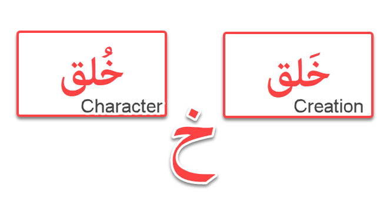
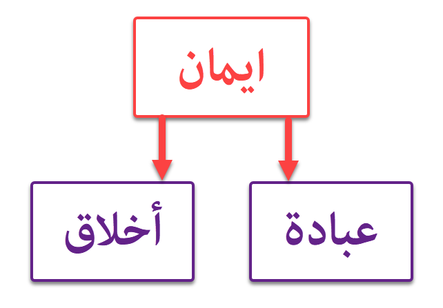

# Love Of The Prophet

## Personal Intro

AsSalaamAlaykum everyone,

Thank you for taking the time to join these sessions. For those of you who don't know me, I'd like to take a moment to introduce myself. My name is Asif Hussain. I live in New Jersey, in the United States of America. I'm a software engineer by profession. As for my religious Education, I've been studying religion - Religions actually - plural- since 2001 - So it's been about 19 years. I've studied several religions in quite some depth - Christianity, Judaism, Hinduism, Buddhism, and of course Islam.

When it comes to the Quran, I'm a student of Quranic linguistics. I have a deep interest in Arabic etymology and Morphology. You'll often hear me trace Arabic words back to their roots to explain their meaning. It is something I find really fascinating in terms of how they convey the true meaning of a word. And what got me into this really, was جاھلی poetry of the ancient Arabs. The intensity and imagination of those poets really captured my interest.

As for these sessions, I've been conducting these for over five years now. I started these, to share my learnings with young adults within my family and my community. Today we live in times, where Islam gets a very bad rap based on everything that's going on around us. I found kids reluctant - almost ashamed to call themselves Muslims. They saw it as a harsh and cruel religion that produces terrorists and fanatics. So I wanted to do my part in sharing the beauty of Islam, in the way I have come to appreciate it; and I hope and pray that I have accomplished that to some degree over the years - InshaAllah.

We have some elders in this group - and I'm truly honored and humbled by their presence. In fact, one of my teachers Javeed Ziaee just joined the group - which frankly makes me nervous and a bit scared. But in a way I also draw courage from his presence, and I pray to Allah that I make him proud. I wouldn't be where I am today without his kind and loving guidance and his immense patience with me during my early **very **confused years. Anything good you hear in these sessions, is from the blessings of my teachers. And if there's anything you find wrong, then that's my own shortcoming and weakness.

One thing I want to emphasize before we start, is that my real audience are the young adults in this group. They've always been my focus when delivering these sessions. So all you young adults - I'll be talking directly to you guys in these sessions. In fact, before structuring the topics for these sessions, I reached out to some of you guys to find out what you would like me to speak about. Quite surprisingly, I pretty much received the same, or at least similar responses from everyone. Which was, why do I need to learn about the prophet? How does knowing about a man who lived 1400 years ago, among the Bedouin Arabs help, me in this time and age. How is he relevant in my life? We live in different times; we face different problems and challenges. So how does knowing about the prophet help me? I thought that was a very honest and very good question. So I structured my sessions around this topic; and I broke it into five parts.

In today's session, I'd like us to take a step back and understand the purpose of religion itself. What is the foundation of religion? What is the underlying emotion that gives birth to this structured religion? Why did Allah create us? So understanding this will hopefully contextualize this conversation about our messenger. Then why do we need messengers in the first place? What's the point of sending messengers? And then I want to talk about the **experience **of Islam itself. We always talk about the practices of Islam - the prayers, the fasting, the زکوۃ the حج; but we never really talk about Islam as an experience. So I want to switch the narrative a bit there. And once we understand all of this, and develop this context - then we'll look at the character of our prophet and see if he's relevant in our times or not. And then, I want to end the sessions with a model for success from the Islamic perspective.

I hope and pray that by the end of the sessions, you'll see the relevance of Islam and the prophet in your lives. I hope they will provide source of spiritual strength in your day to day lives.

So let's get started:

جاوید بھائی، اجازت ہے؟

## Love Based Religion

## eed For Messengers

### The Purpose of Messengers: A Call to Awaken from Heedlessness

The purpose and need for sending messengers, the رسول, are intertwined. The purpose emanates from Allah's perspective, while the need is entirely from our own. The word رسول is derived from the root رَسَلَ, meaning to transmit, correspond, or delegate. Thus, the divine message, the Book itself, comes from Allah, but it is delivered to us through these intermediaries, the messengers—مرسلین. After believing in Allah, His Book, and His angels, the next article of faith is belief in His messengers. When they deliver Allah's message to humanity, there are two possible responses: either acceptance (ایمان) or rejection (کفر).

The word کفر is often translated as "disbelief," and کافر as "disbeliever," but this translation is imprecise. The root of کَفَرَ means to conceal or cover. The active participle, کافر, is also used to describe a farmer because he covers a seed with soil, placing it into darkness. In this sense, کفر is a state of truth concealment. The Islamic worldview posits that, in reality, everyone recognizes the truth at a fundamental level. Therefore, you cannot truly be a disbeliever; you can only choose to accept the truth (ایمان) or to conceal it (کفر). This is why the greatest truth concealer is ابلیس. He was among the closest beings to Allah and knew the truth, recognizing Adam's superiority, but he concealed it with the rationalization that fire was better than clay.

A common misconception among modern Muslims is that anyone who is not Muslim is a کافر. However, the Quranic verses about کفار do not refer to all non-Muslims. They speak of those who are arrogant, proud, and puffed up. Read the Quran's descriptions of the کفار: they are متکبر, مختالٌ فخور, and ظالمون. These are the specific attributes Allah assigns to them. Most people are simply الناس (mankind). Many have simply not heard the message, have not properly understood it, or are in a state of heedlessness (غفلۃ). This is why Allah first addresses people as یا ایھا الناس before ever calling them یا ایھا الکافرون or یا ایھا الذین کفرو. Initially, Allah did not call the Arabs یا ایھا الکافرون because they were not truth concealers in essence. But after they witnessed miracle after miracle and treated Rasul Allah (SWS) with such contempt, for no reason other than his call to their own salvation, Allah declared حقَّ القول, that their actions had gone too far and could not be overlooked.

### Truth Concealment as Ingratitude

There are many ways to conceal the truth, and sadly, many Muslims are in fact truth concealers. One can perform all the outward obligations of Islam and yet be concealing the truth from themselves. The very essence of truth concealment is ingratitude. A کافر is also known as an ingrate. Allah says:

> ‏ ‏وَآتَىٰكُم مّن كُلّ مَا سَأَلْتُمُوهُ وَإن تَعُدُّوا۟ نعْمَتَ ٱللَّه لَا تُحْصُوهَا إنَّ ٱلْإنسَنَ لَظَلُومٌۭ كَفَّارٌۭ ‎ ‎
>
> And he gave you from all you asked of him. And if you should count the favor of Allah, you could not enumerate them. Indeed, mankind is [generally] most unjust and ungrateful.

Indeed man is extremely unjust and an ingrate. The word كَفَّار in this verse is not used in the meaning of "disbeliever," but as "ingrate." The sending of messengers is rooted in Allah’s profound good intention toward His creation. If Allah had simply created humanity and withheld the manual for life, we would all be left to wander in a state of turmoil and darkness, clueless about our purpose.

This state of aimless wandering is reminiscent of the stories of Mulla Nasruddin. In one tale, Mulla Nasruddin is wandering the streets in the early morning hours. When a policeman asks him what he is doing, he replies, "If I knew the answer to that, I'd be at home in bed." This reflects the reality of many people who wander through life in a stupor, constantly seeking distractions and entertainment to avoid the pain of existence. The great scholar Rumi speaks of the many "wines" Allah has put on Earth to numb people's misery. He notes that Jesus (AS) was "drunk in the love of Allah, while his donkey was high on barley."

This attitude of "whatever gets you through the night," as John Lennon said, is a form of ingratitude from the Islamic perspective. The messengers have already brought the news and guidance, yet people refuse to accept it. It is like being thirsty and given directions to a river, but choosing instead to watch a show or play a video game to forget the thirst. This is ingratitude.

Another story of Mulla Nasruddin illustrates a similar point: he was searching for his keys under a streetlight, and when someone asked him where he lost them, he pointed to a dark area away from the light. When asked why he was looking where he was, he replied, "The light is better over here, right?" This highlights another type of truth concealment: going where it is easy instead of where it is hard. This is where we begin to dilute religion to make our lives comfortable. Messengers, as human beings, set an incredible precedent by following Allah's Book to the letter, proving that what is decreed is humanly possible to achieve.

### Heedlessness and the Allegory of Plato's Cave

The human condition is defined by heedlessness or forgetfulness, a state the Quran refers to as غفلۃ. We are distracted by the fleeting "shine and glimmer" of this world, lost in what can be likened to a "vanity fair." A servant sent by the king to the marketplace gets sidetracked by a fair on the way. He gets lost in the fun, forgets his purpose, and by the time he realizes the sun has set, the marketplace is closed. This metaphor illustrates our immersion in heedlessness, where we become preoccupied with this world's powerful distractions.

So, how do we remind ourselves daily that this world is temporal and a greater journey awaits? From the Muslim perspective, the answer is remembrance, الذکر. This is why the Quran is also called الذکر—because it constantly reminds us of our true purpose. In contrast to our forgetful natures, messengers are awakened beings. All prophets share four common qualities:

- Truthfulness: they never lie.

- Trustworthiness: their word is their bond.

- Conveyance: they have the ability to articulate and convey the message.

- Wakefulness: فَطانا.

Messengers are individuals who have woken up to the truth, much like the freed prisoner in Plato's allegory of the cave. In Plato’s story, prisoners chained since birth see only the shadows cast on a wall, mistaking these illusions for reality. When one prisoner is freed and dragged into the sunlight, he is initially disoriented and finds the truth hard to believe. But gradually, his eyes adjust until he can finally look at the sun itself—the ultimate source of light. He returns to the cave to share his discovery, but the other prisoners, comfortable in their ignorance, see his newfound "blindness" in the darkness as a sign of madness and violently resist his attempts to free them.

Plato presents this as an analogy for the challenges messengers face. The cave represents this دنیا, and the world outside the cave is the آخرۃ. Everything we see in this world is a mere reflection of the Hereafter. But people are often so comfortable in their ignorance that they become hostile to anyone who points out the truth. Worse, they aren't even interested in examining the proposition itself. This spiritual laziness is what is known as "acedia." While often translated as sloth, in Christian theology, acedia was spiritual sloth—an unwillingness to seek the truth due to sheer arrogance.

Allah describes such individuals as مُّقْمَحُونَ. The term مُقمَح comes from camels: قَمَحَ الجَمَل فَھُوَ قَامِحُون. When a camel is brought to water, it may raise its head, refusing to drink. That is the essence of a مقمح. The messenger brings them to the river of knowledge to quench their thirst, but they are too arrogant to bow their heads and drink. They ask, "The Quran? Why should I read that book?" But one in every four people believes it is from Allah, which in itself is a good reason to be interested. It is because of this heedlessness that the Quran always juxtaposes غفلۃ (heedlessness) with ذکر (remembrance). As Allah says:

> ‏ ‏يَعْلَمُونَ ظَهرًۭا مّنَ ٱلْحَيَوٰة ٱلدُّنْيَا وَهُمْ عَن ٱلْآخرَة هُمْ غَفلُونَ ‎ ‎
>
> They know what is apparent of the worldly life, but they, of the Hereafter, are unaware.

The universal message of all prophets is لا الہ الا اللہ. The second part of the declaration of faith changes with each era, from موسی رسول اللہ to عیسی رسول اللہ, and finally, for us, محمد الرسول اللہ. All messengers were sent to remind humanity about Allah and pull them out of their state of heedlessness.

### The Debt of Submission: A Call from a Merciful Lord

Our religion is called دین الاسلام. The word اسلام comes from the root سلم, meaning to submit, specifically, to willingly submit out of love for Allah. The word دین comes from دَیْن, which means debt. Therefore, our religion, دینُ الاسلام, literally translates to "the debt of willing submission." The idea is that we have been endowed with innumerable blessings by our Lord, and for these blessings, we owe Him a debt of gratitude through our willing submission.

> ‏ ‏أَفَغَيْرَ دين ٱللَّه يَبْغُونَ وَلَهُ أَسْلَمَ مَن فى ٱلسَّمَوَت وَٱلْأَرْض طَوْعًۭا وَكَرْهًۭا وَإلَيْه يُرْجَعُونَ ‎ ‎
>
> So is it other than the religion of Allah they desire, while to him have submitted [all] those within the heavens and earth, willingly or by compulsion, and to him they will be returned?

Allah questions whether we seek to avoid repaying this debt, when everything in existence is already doing so, willingly or unwillingly. The sun, a celestial body immense in size, rises and sets according to its decree, fulfilling its purpose. It is in a state of submission, yet the human being, insignificant in comparison, is not. The same applies to galaxies, mountains, rivers, and the animal kingdom; they all exist in a state of submission to their Creator. Even human beings must submit to their own nature—eating, drinking, sleeping—and to the limitations of their physical bodies. Everything in existence is paying back its debt of submission to its Creator, willingly or unwillingly—except the human being.

The crucial difference is that humanity is asked for willing submission (طَوْعًۭا), out of love, not by force (كَرْهًۭا). We will be held accountable for this debt on the Day of Judgment, یوم الدین, the day when this debt of willing submission falls due. It is also called یوم الحساب, the Day of Accountability. Rasul Allah (SWS) said in a Hadith:

> **Muhammad Ibn Abdullah (SWS)- Accountability, Deeds
>
> حَاسِبُوا أَنْفُسَكُمْ قَبْلَ أَنْ تُحَاسَبُوا، وَزِنُوا أَعْمَالَكُمْ قَبْلَ أَنْ تُوزَنُوا
>
> Hold yourselves accountable before you are held accountable, and weigh your deeds before they are weighed**

Interestingly, while we owe a debt to Allah, Allah also has a "debt" to us. When a master gives a command to a slave, the fulfillment of that command incurs a debt on the slave. If the slave obeys, the master owes him a reward. If he disobeys, he owes him a punishment. This is the essence of یوم الدین, the day when the debt falls due for both. This is why Allah says in the Quran:

Allah is asking for a loan, so that He can multiply its rewards and pay it back to His slave many times over. The ultimate reward for this beautiful loan is described as:

> ‏ ‏مَّن ذَا ٱلَّذى يُقْرضُ ٱللَّهَ قَرْضًا حَسَنًۭا فَيُضَعفَهُ لَهُ وَلَهُ أَجْرٌۭ كَريمٌۭ ‎ ‎
>
> Who is it that would loan Allah a goodly loan so he will multiply it for him and he will have a noble reward?

This wake-up call is the very purpose of the messengers: to rouse humanity from its state of غفلۃ. The word غفلۃ is particularly interesting. In Arabic linguistics, words beginning with the letter غین often imply a covering, hiding, or veiling, such as غاب (to be absent) or غفر (to forgive). Our intellects, in a state of غفلۃ, become veiled by the temptations of this دنیا. A simpleton is called a مُغَفَّل because they are easily deceived. The term غفلۃ also means lactose intolerance, an inability to digest the most beneficial thing for mankind, which serves as powerful imagery for a person's refusal to accept divine benefit. Scholars have said that all sin and wrongdoing are rooted in غفلۃ, for if Allah was truly present in your heart, it would be impossible to sin. Allah asks in the Quran:

> ‏ ‏يَأَيُّهَا ٱلْإنسَنُ مَا غَرَّكَ برَبّكَ ٱلْكَريم ‎ ‎
>
> O mankind, what has deceived you concerning your lord, the generous.

As one scholar noted, Allah has put the answer to the question within the question itself. It is Allah’s immense generosity, کرم, that has made us delusional. We are heedless about our sins because He does not react with immediate punishment. The people who are most loving and generous with us are often the ones we take for granted the most. Allah's immense mercy makes us bold in our transgressions because we forget that He is our Master, and that is غفلۃ.

An incredible Hadith describes a conversation between Allah and His angels, the oceans, and the earth. They say:

Not a single day passes that the oceans do not ask their Lord for permission to drown the children of Adam; and the earth asks its Lord for permission to swallow them; and the angels ask His permission to hasten their destruction and annihilate them. The earth says, "O Allah, grant me permission to swallow them all. They walk on Your earth, eat from it, and do not prostrate to You!" The angels exclaim, "O Allah, grant us permission! In an instant we will annihilate this lot for their arrogance." The earth, oceans, and angels are Allah's creation, and they are filled with anger at seeing their beloved Creator disobeyed. But our Creator, the One we constantly ignore, says:

والرب تعالى يقول: دَعَوا عَبدي، فأنا أعلمُ به، إذ أنشأتَهُ مِن الأرض

Leave my slave alone. I know everything about him since the moment I created him from the earth. Then He adds to the oceans, earth, and angels:

إن كان عبدُكم فَشَأنكم بِه، وإن كان عبدي فمني وإلي عَبدي

If he is your slave, then do with him as you please; but if he is My slave, then hand him over to me and walk away. Then He promises:

وعزتي وجلالي إن أتاني لَيلاً قَبِلتُه، وإن أتاني نهاراً قَبِلته،

I swear by My Power and My Majesty, if he comes to Me in the night, I will accept him; if he comes to Me in the day, I will accept him.

وإن تقرَّبَ مني شِبرا تقرَّبتُ مِنهُ ذِرَاعاً، وإن تقرَّبَ مني ذِرَاعاً تقرَّبتُ مِنهُ باعاً، وإن مشى إلي هَرْوَلْتُ إليه

If he takes a step towards me, I will move an arm's length towards him. If he moves an arm's length towards me, I will move a yard towards him. If he walks towards me, I will run towards him.

وإن استغفرني غَفَرْتُ له، وإن تَاب إلي تُبتُ عَليه

And when he seeks My forgiveness, I will forgive him; and when he repents on his sins, I will accept his repentance.

مَن تَقَرَّبَ أِلَیَّ تَلَقَّیتُہُ مِن بَعِید وَ مَن أَعرَضَ عَنِّی ناَدَیتُہُ عَن قَرِیب

When he approaches Me, I rush from afar to welcome him; and whoever turns away from Me, I approach him and say:

أَوَلَکَ رَبٌّ غَیرِی؟

Do you have a Lord better than me?

> ‏ ‏مَن جَاءَ بٱلْحَسَنَة فَلَهُ عَشْرُ أَمْثَالهَا ۖ وَمَن جَاءَ بٱلسَّيّئَة فَلَا يُجْزَىٰ إلَّا مثْلَهَا وَهُمْ لَا يُظْلَمُونَ ‎ ‎
>
> Whoever comes [on the Day of Judgement] with a good deed will have ten times the like thereof [to his credit], and whoever comes with an evil deed will not be recompensed except the like thereof; and they will not be wronged.

Do you not see that when you come to Me with one good deed, I reward you ten times over; and when you come to Me with one sin, I respond with only what is due to remove it, and even then, I often choose to forgive it? اللہ اکبر.

This is our Lord, our loving, merciful Creator. Who told us that He is a cruel being just waiting to burn us in hell? He created us with His own hands and honored us by having the angels prostrate to us. Do we truly believe He enjoys causing us pain? We would never wish harm on our own children, whom we didn't even create in their mother's womb—that was Allah. So who has painted this incredibly loving Creator as a monster for us?

> ‏ ‏يَأَيُّهَا ٱلْإنسَنُ مَا غَرَّكَ برَبّكَ ٱلْكَريم ‎ ‎
>
> O my human being! What has put you in this state of delusion about your generous Lord?

## Islam as an experience

### The Foundations of Faith: The Prophet's Inner and Outer Journey

There is a well-known Hadith in which جبرئیل (AS) appears before Rasul Allah (SWS) in the form of a man and poses four questions: What is السلام (peace); what is ایمان (faith); what is احسان (excellence); and lastly, he asks about the signs of the end of time. When asked about Islam, Rasul Allah (SWS) replied with a beautiful articulation of its core pillars:

الإِسْلاَمُ أَنْ تَشْهَدَ أَنْ لاَ إِلَهَ إِلاَّ اللَّهُ وَأَنَّ مُحَمَّدًا رَسُولُ اللَّهِ، وَتُقِيمَ الصَّلاَةَ، وَتُؤْتِيَ الزَّكَاةَ، وَتَصُومَ رَمَضَانَ، وَتَحُجَّ الْبَيْتَ إِنِ اسْتَطَعْتَ إِلَيْهِ سَبِيلاً

Islam is to bear witness that there is no god but Allah, and that Muhammad is the messenger of Allah, and to establish the prayer, and to give the charity, and to fast the month of Ramadan, and to perform pilgrimage to the House if you are able to find a way to it.

What is so remarkable about this Hadith is that rather than providing a philosophical definition of Islam, Rasul Allah (SWS) described it as a set of practices. We must remember, however, that this is not how Islam began for him. Islam, as a profound human and spiritual phenomenon, began for Rasul Allah (SWS) with an incredible experience and then culminated in these practices. His journey began with a direct encounter with the noumenal realm. We can understand this as the world of the unseen, or عالم الغیب, which contains metaphysical realities such as Allah, angels, heaven, and hell. This stands in contrast to the phenomenal realm, or عالم الشھادۃ, which is the physical, "seen" world of appearances.

The Prophet's life was a testament to his connection to both realms: he had his phenomenal experience in the Cave of حرا, and his noumenal experience during his ascension, the معراج. Today, we seek to connect with both of these experiences, to step into his shoes and imagine what it must have felt like. His journey sets a precedent for us, revealing what Islam is meant to feel like, a feeling that ultimately makes the practices easy and meaningful.

### The First Experience of Revelation

The year is 620 AD. Rasul Allah (SWS) is 40 years old. He is deeply troubled by the social and cultural norms of his time, particularly the behavior of the جاھلی Arabs and their idol worship. With a natural disinclination towards superstition and animism, he seeks solitude and escape. For this, he would regularly retreat to a cave on a mountain called جبل النور, the "Mountain of Light." The cave itself is known as حرا, a word that means "darkness," an interesting juxtaposition: a cave of darkness within a mountain of light. Here, he engaged in a practice of contemplation and reflection, a state we might today call meditation or تَحَنُّث, the emptying of the mind.

The word تَحَنُّث is derived from حنث, which in Arabic means شرک (attributing partners to Allah). In سورۃ الواقعۃ, Allah (Subhanahu wa Ta'ala) says:

> ‏ ‏وَكَانُوا۟ يُصرُّونَ عَلَى ٱلْحنث ٱلْعَظيم ‎ ‎
>
> And they used to persist in the great violation.

They insist on committing great شرک.

In Arabic morphology, adding a ت to a word in the باب التَّفَاعَل pattern changes its meaning to "the avoidance of." Thus, حنث (idolatry) becomes تَحَنُّث (the avoidance of idolatry).

- جنب means "side or nearness," while تَجَنُّب means "to avoid nearness to someone."

- حجود means "to sleep," so تَحَجُّد means "to avoid sleep."

So, as this 40-year-old man meditated in the cave, he was attempting to empty his heart of all forms and attachments of this world. What is the greatest شرک of all? The worship of the self. Idolatry pales in comparison to self-worship or egocentricity, which is the most destructive force for the soul. Allah speaks of those who worship their own desires:

> ‏ ‏أَرَءَيْتَ مَن ٱتَّخَذَ إلَهَهُ هَوَىٰهُ أَفَأَنتَ تَكُونُ عَلَيْه وَكيلًا ‎ ‎
>
> Have you seen the one who takes as his Allah his own desire? Then would you be responsible for him?

Rasul Allah (SWS) was in this state of deep reflection, working to empty his heart so that it could be filled with something new. The soul must be stripped of all its attachments before it can truly gain knowledge of the One who has no form. It was at this moment, as he was engaged in this emptying, that he suddenly saw the horizons filled with the presence of an angelic being. The being said, "Muhammad, I am جبرئیل (AS), and you are the messenger of Allah!"

Consider this for a moment. If we were to step outside and see an angelic presence filling the sky from one horizon to the other, how would we react? Would we be terrified? Shocked? This highlights an important distinction: experience is not a logical proposition. It cannot be proven or disproven, only discussed and interpreted. The challenge is to determine whether an experience is objectively or subjectively real—whether it is a true divine encounter or a form of psychosis.

Rasul Allah (SWS) was, naturally, filled with the very human emotions of fear and shock. He turned his face away, but no matter where he looked, he saw the angel in the exact same form. جبرئیل (AS) then commanded, "Recite" (أقرأ), to which Rasul Allah (SWS) replied, "ما أنا بقاری؟" (What should I recite? I do not know how to recite).

At this, جبرئیل (AS) embraced him and squeezed him three times. According to Rasul Allah (SWS), the squeeze was so intense that he felt as though he would die. Scholars explain that this was a physical manifestation of a spiritual reality: the removal of any and all remnants of this world from his soul. This was the process of تخلیۃ, a complete emptying out before the filling could take place. As the Arabs say:

التَّخلِیَّۃُ تَسبِق التَّحلِیَّۃ

The emptying out must precede the ornaments.

This means one must be stripped of what is ugly before being adorned with the beautiful. After the squeezing, جبرئیل (AS) once again commanded him:

> ‏ ‏ٱقْرَأْ بٱسْم رَبّكَ ٱلَّذى خَلَقَ ‎ ‏خَلَقَ ٱلْإنسَنَ منْ عَلَقٍ ‎ ‏ٱقْرَأْ وَرَبُّكَ ٱلْأَكْرَمُ ‎ ‏ٱلَّذى عَلَّمَ بٱلْقَلَم ‎ ‏عَلَّمَ ٱلْإنسَنَ مَا لَمْ يَعْلَمْ ‎ ‎
>
> Recite in the name of your lord who created-(1) Created man from a clinging substance. (2) Recite, and your lord is the most generous-(3) Who taught by the pen-(4) Taught man that which he knew not. (5).

He was now in a new, perhaps troublesome, realm of existence. For every intellectual human being, a fundamental crisis of faith is this: Is my object of devotion a transcendent reality, or a distortion of my own consciousness?

### Distinguishing Divine from Demonic Experiences

Scholars offer a way to differentiate between a true divine experience and a demonic one. A demonic experience always begins with an expansion of the self—a rush, excitement, or euphoria—but inevitably results in pain, constriction, and despair. Think of anything forbidden in Islam: drugs, alcohol, or other forms of overindulgence. They start with a high but end in suffering, addiction, and ruin. They expand in the beginning and constrict in the end.

In contrast, a true spiritual experience is exactly the opposite. The initial phase is one of incredible constriction, fear, and hard work, but it always ends in a sense of joy and expansion. We see this in the lives of all great individuals—their initial struggles and suffering led to incredible expansion, fame, and glory.

This pattern is consistent in the experiences of all the prophets. The Quran tells us that the first divine words to Musa (AS) were "do not be afraid," indicating that his initial encounter was filled with fear. Ibrahim (AS) had a similar experience, as did Maryam (AS), the mother of Isa (AS), who was terrified by the angel's presence.

> ‏ ‏قَالَتْ إنّى أَعُوذُ بٱلرَّحْمَن منكَ إن كُنتَ تَقيًّۭا ‎ ‎
>
> She said, "indeed, I seek refuge in the Most Merciful from you, [so leave me], if you should be fearing of Allah.".

These experiences were overwhelming, so much so that they incapacitated the self. For Rasul Allah (SWS), the reception of the first revelation was a painful process. The words were not fed to him through rote memorization; rather, their meanings were breathed directly into him. The Arabic words for "breath" and "spirit" share the same root: روح. The immense pressure of this divine breath made him feel as if he was suffocating under an enormous weight, even as it gave him life. He later described the process as "the message being engraved in my heart," a feeling of a sharp blade carving deep inside. Initially, he would convulse upon receiving revelation, a fact that the disbelievers used to accuse him of being possessed by a jinn. But over time, the process became much easier, to the point that his companions would not even notice when revelation came upon him.

Following this first encounter, Rasul Allah (SWS) was in a state of extreme shock. Leslie Hazleton, in her book "The First Muslim," describes how he fled the mountain trembling with a stark primordial fear, not with joy or elation. He was overwhelmed not by conviction, but by doubt, thinking he had been hallucinating or had been possessed. This deeply human response, without any signs of psychosis or manic euphoria, is, as scholars note, one of the strongest arguments for the historical reality of the event.

In this state of shock, he returned to his wife, Khadijah (AS), and said, "زملونی زملونی," meaning, "Wrap me up, wrap me up." This is a human instinct when the self feels shattered, a loss of psychic integrity where the inner and outer crash. His perfect consciousness in that moment—the ability to articulate his need for containment—is another testament to the divine, spiritual nature of the experience.

### The Second Experience: Ascension (Mi'raj)

The second divine experience of Rasul Allah (SWS) was the night journey (اسری) and the ascension (معراج). The first experience established his connection with the noumenal realm, while the second was a journey from the phenomenal to the noumenal. Allah says in the Quran:

> ‏ ‏سُبْحَنَ ٱلَّذى أَسْرَىٰ بعَبْده لَيْلًۭا مّنَ ٱلْمَسْجد ٱلْحَرَام إلَى ٱلْمَسْجد ٱلْأَقْصَا ٱلَّذى بَرَكْنَا حَوْلَهُ لنُريَهُ منْ آيَتنَا إنَّهُ هُوَ ٱلسَّميعُ ٱلْبَصيرُ ‎ ‎
>
> Exalted is He who took His Servant by night from al-Masjid al-Haram to al-Masjid al-Aqsa, whose surroundings We have blessed, to show him of Our signs. Indeed, He is the Hearing, the Seeing.

The word أَسری (to take someone by night) highlights that this journey, which would have taken 40 nights for the Arabs, took place in a single night. This journey had two parts: a physical journey from Mecca to Jerusalem on a steed named بُراق, a creature smaller than a horse but bigger than a mule. The name بُراق comes from برق (lightning) and بَرَاقۃ (luminous). This steed moved at the speed of light, traveling from one horizon to the next in a single step, making the physical journey virtually instantaneous.

Upon reaching the mosque of اقصی, the second phase, the معراج, took place. This was a metaphysical journey, beyond the confines of time and space, and faster than the speed of light. The word معراج means "an instrument of ascension" or "a ladder," from the root عرج. During this journey, Rasul Allah (SWS) had a direct witnessing of Allah (Subhanahu wa Ta'ala). The Quran describes this proximity:

> ‏ ‏ثُمَّ دَنَا فَتَدَلَّىٰ ‎ ‏فَكَانَ قَابَ قَوْسَيْن أَوْ أَدْنَىٰ ‎ ‎
>
> Then he approached and descended (8) And was at a distance of two bow lengths or nearer. (9).

Scholars state that this description of two bows is an honorific expression of the Prophet's proximity, a closeness of station (مقام لا مکان) rather than a physical closeness, as Allah is beyond physicality.

The Quran's description of this experience is profoundly telling:

> ‏ ‏ثُمَّ دَنَا فَتَدَلَّىٰ ‎ ‏فَكَانَ قَابَ قَوْسَيْن أَوْ أَدْنَىٰ ‎ ‎
>
> Then he approached and descended (8) And was at a distance of two bow lengths or nearer. (9).

Why would his vision not deviate? He was traveling through the seven heavens, witnessing the unveiling of the unseen world (عالم الغیب). For a normal person, this unveiling would be unbearable and would likely lead to insanity. We know from modern science that we perceive less than a billionth of the material stimuli around us, and that 95% of the physical universe is dark matter, unseen by us. The Quran, 1400 years ago, pointed to this reality:

> ‏ ‏وَٱلسَّمَاء وَٱلطَّارق ‎ ‏وَمَا أَدْرَىٰكَ مَا ٱلطَّارقُ ‎ ‏ٱلنَّجْمُ ٱلثَّاقبُ ‎ ‎
>
> By the sky and the night comer-(1) And what can make you know what is the night comer? (2) It is the piercing star-(3).

The Quran says that the light of the stars literally makes a journey to get here, like a guest visiting us in the night. The word ثُقُب means to put a hole through a pearl, signifying that the light pierces a hole in the celestial sphere to reach us.

Despite all these incredible sights, the vision of Rasul Allah (SWS) did not deviate because his heart's sole concern was to meet his Lord. He was on the journey of a lover to meet his beloved. As the saying goes:

> **Anonymous
>
> کلُّ ما تَھوَاہُ مَوجُودٌ فِی ذَاتِ المحبوب**

Everything that you can ever desire exists in your beloved.

Upon his return, Rasul Allah (SWS) was completely transformed. The world was no longer a distraction; he now saw reality as it truly is. Our tradition calls this "right understanding," and our lack of it is the cause of our pain. The word for "desire" and "oppression" in Arabic, بغی, is the same. This is because desires oppress us. Islam does not demand the elimination of desire, which is impossible, but rather the management of it—to make our desire the right desire, which is to desire Allah (Subhanahu wa Ta'ala) above all else.

### Islam is a Journey and a Choice

These two incredible experiences—the revelation through جبرئیل (AS) and the direct witnessing of his Lord—represent the pinnacle of Rasul Allah's (SWS) Islam. Yet, his journey did not begin with a direct experience. It started with an intermediary, with extreme constriction of the heart, with fear, doubt, and physical pain. This was followed by 13 years of persecution, trials, and hardships, and only then did the unveiling of the unseen realm occur.

The Prophet's experience sets an archetype for all of us as Muslims. Our path is a journey toward our Master. Just as his journey began with تخلیۃ (emptying out) and تحنث (detachment from worldly distractions), so too must we embark on the same exercise. We must work on managing our desires, not eliminating them, and make our ultimate desire Allah (Subhanahu wa Ta'ala).

It all begins with a choice. Do you even want to make this journey? If not, then Islam is not for you. Enjoy the fleeting pleasures of this world, knowing they will not last and will ultimately lead to misery. Before embarking on any worldly journey, you research it to see if it is worth the effort. Do the same for Islam. Study it, learn what it offers in the end, and decide if you want it. As Allah says:

> ‏ ‏وَقُل ٱلْحَقُّ من رَّبّكُمْ ۖ فَمَن شَاءَ فَلْيُؤْمن وَمَن شَاءَ فَلْيَكْفُرْ إنَّا أَعْتَدْنَا للظَّلمينَ نَارًا أَحَاطَ بهمْ سُرَادقُهَا وَإن يَسْتَغيثُوا۟ يُغَاثُوا۟ بمَاءٍۢ كَٱلْمُهْل يَشْوى ٱلْوُجُوهَ بئْسَ ٱلشَّرَابُ وَسَاءَتْ مُرْتَفَقًا ‎ ‎
>
> And say, "the truth is from your lord, so whoever wills-let him believe; and whoever wills-let him disbelieve." indeed, we have prepared for the wrongdoers a fire whose walls will surround them. And if they call for relief, they will be relieved with water like murky oil, which scalds [their] faces. Wretched is the drink, and evil is the resting place.

Islam is not for everyone. It is an enormous gift that must be earned, a privilege that requires hard work. If you doubt this, study the life of Rasul Allah (SWS). Did Allah abase him for his hard work or elevate him? As Maulana Ali (AS) says, "If you are looking for glory and greatness, look at the life of the Prophet for his name and his efforts will shine on the sky of Islam till the end of time."

This is your choice. The red pill or the blue pill, as in the Matrix. Take the blue pill and remain in the comfortable shadows of delusion, or take the red pill and awaken. If you choose the red pill and decide to take this journey, prepare for the hard work. Athletes and bodybuilders achieve greatness through countless hours of training and dedication. They will tell you the effort was absolutely worth it. So, too, is the path of spiritual ascension. Focus, stay vigilant, and be consistent.

> ‏ ‏مَا زَاغَ ٱلْبَصَرُ وَمَا طَغَىٰ ‎ ‎
>
> The sight [of the Prophet] did not swerve, nor did it transgress [its limit].

His vision did not deviate, nor did it rebel against him.

Do not let this world or its temptations distract you. You will make mistakes, for perfection is not demanded of us. The Quran, with over 6000 verses, demands only sincere effort. The goal is not to be perfect, but to meet Allah and Rasul Allah (SWS) as a better version of who we were. We are human, and we will err. But like a bodybuilder who misses a day or an athlete who makes a mistake, we do not simply give up. We continue the training, we stay in the game.

My own journey with Islam began with difficulty, but the more I learned and practiced, the easier it became. I love my Islam because I have experienced the contentment and freedom it brings. I know what I want and what I must do to achieve it, and I am at peace with the sacrifices required. May Allah help us all follow in the footsteps of our Prophet (SWS), and enable us to truly experience the beauty of Islam.

## Character of the prophet

Today, I have the profound honor of speaking about the one beloved by Allah, our Prophet Rasul Allah (SWS). His very name, محمد, comes from the root حمد, which signifies **"the one who is constantly praised"** and **"worthy of eternal gratitude."** Just as Allah is رب العالمین (the Cherisher and Sustainer of all existence), His Messenger is رحمةٌ للعالمین (a boundless mercy to all of existence). Allah made love for him a prerequisite for His own love, as if to say, "You cannot truly claim to love Me without first loving My beloved Messenger."

> ‏ ‏قُلْ إن كُنتُمْ تُحبُّونَ ٱللَّهَ فَٱتَّبعُونى يُحْببْكُمُ ٱللَّهُ وَيَغْفرْ لَكُمْ ذُنُوبَكُمْ وَٱللَّهُ غَفُورٌۭ رَّحيمٌۭ ‎ ‎
>
> Say, [O Muhammad], "If you should love Allah, then follow me, [so] Allah will love you and forgive you your sins. And Allah is Forgiving and Merciful.".

In the vast ocean of human emotion, our scholars have identified three sources of love, all of which are perfectly embodied in the Messenger of Allah (SWS):

1. The first is **physical love**, sparked by the immediate, sensory appreciation of outward beauty. A beautiful sight or a handsome face can draw the heart in an instant. The narrations of our tradition are filled with detailed and loving descriptions of the Prophet's physical form, a testament to his outward perfection. He was of medium stature, neither overly tall nor short. His build was **broad-shouldered** and robust. His hair is described as **wavy**, neither straight nor too curly, and would often reach his earlobes or shoulders. His complexion was **fair**, with a slight rosy hue. His face was frequently compared to the **moon**, full of light and radiance. He had a **broad forehead**, a prominent nose, and a thick beard. His eyes are described as being very **dark and wide**, with long eyelashes. He had a natural beauty and a distinct presence that commanded both respect and love.

1. The second source is **inward love**, born from knowing a person’s inner beauty and their noble character (اخلاق). This is the love that deepens as we learn not just what a person looks like, but what they are like, what they believe, and how they live and interact with others.

1. The third, and perhaps most transformative, love is that which arises from **gratitude**—the recognition of a great kindness or sacrifice made on our behalf. For a person of integrity, such a sacrifice naturally inspires an ever-growing love and loyalty.

In his life, we find the perfection of all three: a physical form that was beautiful to behold, an inner character that was sublime, and a selfless sacrifice that inspires unending gratitude. His heart was so immense that his concern extended to all of humanity and even to the animals. He was a savior of the oppressed and a guide for all beings, demonstrating a universal compassion in every aspect of his life. Learning about his life, his sirah (سیرۃ), is one of the most beautiful and rewarding endeavors we can undertake, both as believers and as human beings in general.

### The Miracle of Character

Today, I want to talk about and highlight his lofty character. The word اخلاق is the plural of خُلق, a profound term in the Arabic language. It is derived from the same root, خَلَقَ, which is the word for creation. Allah is (الخالق), the Creator, and we are His creation (مخلوق). Our physical form is our خَلق, and our spiritual form is our خُلق. The physical world nourishes the physical form, but our spiritual form is nourished by our character (اخلاق).

The science of Arabic phonetics reveals a remarkable subtlety here. Both words, خَلق and خُلق, begin with the letter **kha** (خ), which creates a sound of friction and effort. Take any word in Arabic that begins with the letter خ—you'll find it is either harsh in its nature or requires effort. خدمۃ (service) involves effort. خُلَّۃ (friendship) requires effort; خوف (fear) is a harsh emotion; خیال (imagination) requires effort to build. This is a subtle linguistic cue that our very existence, both physical and spiritual, is a product of effort. Character takes a great deal of effort to develop. When we die, our physical body returns to the earth, but our soul, with the character we have created, returns to our Creator. An impoverished soul is one that returns to its Master without a developed character. Just as a weak body cannot benefit from the delights of this world, a weak soul cannot enjoy the pleasures of the afterlife.

This is why our faith, Islam, is composed of two essential parts: worship (عبادۃ) and the development of character (اخلاق). And this is precisely why our Prophet (SWS) was sent. He himself said:

> **Muhammad Ibn Abdullah (SWS)- Character
>
> إِنَّمَا بُعِثْتُ لِأُتَمِّمَ مَكَارِمَ الْأَخْلَاقِ
>
> I was only sent to perfect a noble character.**

His mission was to perfect the very essence of what it means to be human. If you ask any Muslim what the Prophet's miracle was, the unanimous answer is always the **Quran**. The gift and miracle to the Arabs, particularly, was indeed the Quran, as the non-Arabs could not understand it. The Arabic word for a non-Arab is, عجم, which means "dumb" or "mute." In the same way that the Greeks would refer to non-Greeks as بَربَر—the source of the word "barbarian"—because they couldn't speak their language, the Arabs' use of the term was not meant as an insult. They had a reason for it. When they would interact with other cultures, they would ask, for example, the Persians, "How many words do you have for a lion?" The Persians would reply, "One word." The Arabs would say, "One word for a lion? We have over 300 words for it."

For example, the Arabs have:

- عَوف: a lion that hunts at night.

- حَیدَر: a small lion.

- قَسْوَرَة: a lion from which animals flee.

- لَیْث: a lion when it circles its prey.

- عُثَامَة: a lion when it leaps to attack.

- حَمْزَة: a roaring lion.

- شِبْل: a young lion or cub.

- وَرْد: an attacker.

- عَبَّاس: the leader of the pack.

- ضِرْغَام: a bone-crusher.

- رِبَال: a chubby, plump, or stocky lion.

- مَیَّاس: referring to the walk of a lion.

- غَضَنْفَر: a thick-maned or majestic lion.

These are names that the Arabs use just for a lion. This richness of language is why they would assume that other people were عجم. Undoubtedly, the Miracle of the Quran lies in the linguistic perfection of its Arabic. But what about us, as non-Arabs? How does the non-Arab come to know that Islam is indeed a revelation from Allah? When we read the Quran in English or Urdu, we struggle with it because the Quran is not a linear book like other books of revelation. The Bible begins with a clear statement in the book of Genesis: "In the beginning, Allah created the heavens and the earth." In contrast, the Quran, after الفاتحۃ, begins with the verse:

> ‏ ‏الم ‏‏ذَٰلِكَ ٱلْكِتَٰبُ لَا رَيْبَ فِيهِ هُدًۭى لِّلْمُتَّقِينَ ‏‏
>
> Alif, Lam, Meem. (1) This is the Book about which there is no doubt, a guidance for those conscious of Allah-(2).

What does الم mean? We don't even know. Then it says ذَلكَ ٱلْكتَبُ لَا رَيْبَ فيه—"That is the book in which there is no doubt." Not "this" is a book without doubt. These concepts can only be understood appropriately through Arabic linguistics, which can be confusing for non-Arab speakers. So, how does the non-Arab know that this religion, this message, is the truth?

### A Character Praised by Allah

The answer lies in how these non-Arabs became Muslim. Wherever the Arabs went, the deciding factor that led non-Arabs to convert was not the linguistic miracle of the Quran (اعجاز القرآن) because they couldn't understand it. It was the miracle of the Prophet's character (اعجاز الخُلُق). This is what struck the non-Arab's heart, and this is why the gift that Allah gave to the non-Arabs is His Messenger (SWS). Allah Almighty Himself declares in the Quran:

> ‏ ‏وَإِنَّكَ لَعَلَىٰ خُلُقٍ عَظِيمٍۢ ‏‏
>
> And indeed, you are of a great moral character.

This profound verse was revealed very early in Rasul Allah's (SWS) mission, referring not to his character as a prophet but to his character as a person—a member of that society for forty years. A message is empty if it's not backed by credibility, and one of the strongest forms of credibility is character. In a deeply corrupt society like pre-Islamic Mecca, where the "law of the jungle" prevailed, he earned the title الصادق و الأمین ("The Truthful and the Trustworthy"). This was the highest testimony to his credibility, a character so immense that even his enemies, who would not accept his message, could not deny the greatness of his person.

Allah also described him as a رحمة (mercy), a manifestation of mercy itself, not just a person who showed mercy.

> ‏ ‏وَمَا أَرْسَلْنَٰكَ إِلَّا رَحْمَةًۭ لِّلْعَٰلَمِينَ ‏‏
>
> And we have not sent you, [o Muhammad], except as a mercy to the worlds.

Maulana Ali (AS) described him as the kindest of people by nature. His mission was to make life easier (تیسیر), not harder, by lifting the burdens and shackles imposed by earlier systems and people's own lower selves. The character of our Prophet (SWS) was an ocean of mercy. Allah Himself unveils this reality in an incredible verse, not just describing His Messenger, but revealing the very nature of Divine love as it manifests in a human soul.

> ‏ ‏فَبِمَا رَحْمَةٍۢ مِّنَ ٱللَّهِ لِنتَ لَهُمْ ۖ وَلَوْ كُنتَ فَظًّا غَلِيظَ ٱلْقَلْبِ لَٱنفَضُّوا۟ مِنْ حَوْلِكَ ۖ فَٱعْفُ عَنْهُمْ وَٱسْتَغْفِرْ لَهُمْ وَشَاوِرْهُمْ فِى ٱلْأَمْرِ ۖ فَإِذَا عَزَمْتَ فَتَوَكَّلْ عَلَى ٱللَّهِ إِنَّ ٱللَّهَ يُحِبُّ ٱلْمُتَوَكِّلِينَ ‏‏
>
> So by mercy from Allah, [o Muhammad], you were lenient with them. And if you had been rude [in speech] and harsh in heart, they would have disbanded from about you. So pardon them, ask forgiveness for them, and consult them in the matter. And when you have decided, then rely upon Allah. Indeed, Allah loves those who rely [upon him].

Let's first grasp the context behind this verse's revelation. After the Muslim army faced a severe defeat at the Battle of Uhud—mainly because some archers disobeyed the Prophet's (SWS) clear instructions and abandoned their positions—the entire force was left devastated and disheartened. This verse was revealed during this critical moment, not to criticize the companions for their error, but to offer guidance for healing and renewal. With this context, let's delve into this verse to experience the love it embodies.

The verse begins by establishing that the Prophet’s gentleness was not simply a personality trait; it was a direct gift, a manifestation of Allah’s own mercy (رحمة). This is a mercy that emanates from the same root as the word for the womb, رحم—a nurturing, all-encompassing, life-giving compassion. Allah’s mercy enveloped the Prophet’s heart, and from that vessel, it flowed out to all of creation. The word used to describe this quality is لِنتَ, from a root signifying softness, pliability, and gentleness.

وَلَوْ كُنتَ فَظًّا غَليظَ ٱلْقَلْب لَٱنفَضُّوا۟ منْ حَوْلكَ

The opposite of this Divine softness is described with two powerful words. The first is فظ, which implies a **coarseness in speech and a harshness in interaction**. The second, غَلِيظَ ٱلْقَلْبِ, is even more profound. It is derived from the root غ ل ظ, which refers to thickness, density, and heaviness. It describes a heart that has become impenetrable, unable to receive or transmit tenderness. The Prophet’s heart, made soft by Allah’s mercy, was the opposite of this. It was a heart that was open, present, and extremely sensitive to the states of others. The companions testified that in his gatherings, he gave every person their due right, turning his entire being toward them when they spoke, making each individual feel as though they were the most beloved person in his presence.

The Prophet’s profound altruism (ایثار) meant he always preferred the comfort of others over his own, a trait seen even in the smallest of acts. In one famous example, when presented with two سواک (toothpicks), one straight and one crooked, he gave the straight one to a Bedouin and kept the crooked one for himself. A scholar said that if this was his ایثار for a simple Bedouin who was a stranger, one can only imagine the ocean of mercy he reserved for the people closest to him.

فَٱعْفُ عَنْهُمْ وَٱسْتَغْفرْ لَهُمْ وَشَاورْهُمْ فى ٱلْأَمْر

Look at what Allah states now, considering the context. The Muslims have just faced defeat because some companions disobeyed the Prophet (SWS). In this moment of pain and disappointment, Allah guides His beloved:

- فَاعْفُ عَنْهُمْ (So pardon them): The word used is عفو, which is more than simple forgiveness. It means to efface, to completely wipe away the trace of a wrongdoing so that no resentment remains. Allah was commanding His Prophet (SWS) to purify his own heart of any lingering hurt.

- وَاسْتَغْفِرْ لَهُمْ (and ask forgiveness for them): This elevates the Prophet’s role from a personal pardoner to a Divine intercessor. Allah tells him, "Your pardon cleanses their slate with you, but now, turn to Me and seek My forgiveness for them so that they may be cleansed in My eyes as well." He is made the very means of their redemption, a conduit for Allah’s forgiveness (غفران).

- وَشَاوِرْهُمْ فِى ٱلْأَمْرِ (and consult them in the matter): This is the most astonishing command. After their error, logic would suggest they should not be consulted again. Yet, Allah commands the opposite. This is the divine methodology for restoring dignity. By instructing the Prophet (SWS) to continue seeking their counsel, Allah rebuilt their confidence and re-wove their hearts into the fabric of the community, proving that their worth was not diminished by their mistake.

فَإذَا عَزَمْتَ فَتَوَكَّلْ عَلَى ٱللَّه إنَّ ٱللَّهَ يُحبُّ ٱلْمُتَوَكّلينَ

Finally, after these acts of mercy, the verse concludes: فَإِذَا عَزَمْتَ فَتَوَكَّلْ عَلَى ٱللَّهِ (And when you have decided, then rely upon Allah). After consultation, the decision is his, but the ultimate reliance, the توکل, is on Allah alone. This single verse, therefore, is not just a description of a man; it is a roadmap for the purification of the soul, showing that authentic leadership and spiritual authority are rooted in a mercy that originates from Allah, manifests as gentleness, and is perfected through pardon, intercession, and the restoration of human dignity.

### A Mercy for a Sinner

The Prophet (SWS) was incredibly merciful and forgiving. A man came to him in a state of deep distress, crying out, "يا رسول الله، هَلَكْتُ، هَلَكْتُ!" (O Messenger of Allah, I have been destroyed!). "What has destroyed you?" the Prophet (SWS) asked gently. The man confessed, “وَقَعْتُ عَلَى زَوْجَتِي فِي رَمَضَانَ” (I had relations with my wife during the daytime in Ramadan). "And what made you do that?" the Prophet (SWS) inquired. The man, in a moment of candid humanity, replied,
“يا رسول الله، رَأَيْتُ بَيَاضَ حِجْلَيْهَا فِي القَمَرِ فَوَقَعْتُ عَلَيْهَا” (O Messenger of Allah, I saw the whiteness of her ankles in the moonlight and I could not help myself). Hearing this, the Prophet (SWS) laughed. He didn't condemn the man's sin but acknowledged his human struggle. He simply instructed him to perform the expiation (كَفِّر). "Free a slave," the Prophet (SWS) said. The man replied that he had no means to do so. "Then fast for two consecutive months," the Prophet (SWS) continued. The man confessed, "O Messenger of Allah, I can't even fast for one month in Ramadan!" At this, the Prophet (SWS) changed his approach. "Then feed sixty poor people." The man once again expressed his poverty, saying, "O Messenger of Allah, I have nothing to give!" The Prophet (SWS) then called for a basket of dates and gave it to the man as a gift. "Take this," he said, "and give it in charity to the people." The man, astonished, asked, "O Messenger of Allah, is there anyone poorer than my family and me?" Hearing this, the Prophet (SWS) laughed and said, "Go and feed your family with it."

This entire incident is a powerful example of تيسير (making things easy). The Prophet's nature was to constantly simplify and make things accessible for people. When a sinner came to him, he didn't compound the man’s guilt. Instead, he made him feel that he was human, that he had made a mistake, and that the door to Allah’s mercy was wide open. The Prophet's approach was to bring people closer to Allah, not to drive them to despair. This is why those who make people feel hopeless about Allah's mercy are evil people, no matter how much they worship. We have no right to judge others or to assume we know their fate. As Allah says in a Hadith Qudsi,

> **Allah
>
> مَنْ ذَا الَّذِي يَتَأَلَّى عَلَيَّ أَنْ لَا أَغْفِرَ لِفُلَانٍ؟ قَدْ غَفَرْتُ لِفُلَانٍ وَأَحْبَطْتُ عَمَلَكَ
>
> Who swore by Me that I would not forgive so-and-so? I have forgiven so-and-so, and I have invalidated your deeds.**

### A Master Teacher

Our Prophet (SWS) was an exemplary teacher who never shamed or scolded. A companion, who was new to Islam, narrated that one day while they were in prayer, another man sneezed. Out of habit, this companion instinctively said, "یرحمکم اللہ" (May Allah have mercy on you), a common phrase of kindness. The congregation was shocked and began to strike their thighs in frustration, trying to silence him. Realizing his mistake, he immediately fell silent. After the prayer concluded, he was terrified, sure the Prophet (SWS) would be angry with him. But when he went to him, the Prophet (SWS) said: "ما كَهَرَني ولا ضَرَبَني ولا شَتَمَني" (He neither scowled at me, nor hit me, nor cursed at me). He didn't make him feel small. Instead, he gently explained:

> **Muhammad Ibn Abdullah (SWS)- Prayer
>
> إِنَّ هذه الصلاة لا يَصلُحُ فيها شيءٌ من كلامِ الناس، إنما هي التَّسبيحُ والتَّحميدُ والتَّكبيرُ
>
> Indeed, this prayer is not suitable for any of the speech of people. It is only for glorifying Allah, praising Him, and exalting Him**

The man, deeply moved by the Prophet’s tenderness, concluded by saying: “واللہ ما رأيتُ مُعلِّمًا قبلَهُ ولا بعدَهُ أحسنَ منه..” (By Allah, I have never seen a teacher better than him, before him or after him). This is a powerful reflection on his character. He taught with love and compassion, not with harshness or rebuke, transforming a moment of confusion into a profound, life-changing lesson. This example reminds us that proper education is rooted in mercy, patience, and dignity. His beautiful character was not a theory; it was a living, breathing reality that transformed lives.

Consider the story of the man who came to him with a deeply personal struggle. He said, "O Messenger of Allah, everything in Islam makes sense to me except for one thing: I love زنا (fornication)." Remarkably, this man felt safe enough to admit this private struggle. The Prophet (SWS) didn't scold or condemn him. Instead, he approached the man's heart with profound gentleness and wisdom. He asked, "Would you like it for your own mother?" The man immediately replied, "No, by Allah!" He continued, "And what about your daughter? your sister? your aunt?" to which he received the same firm and emotional response. He then said, "The women you desire are someone's mother, someone's daughter, someone's sister, or someone's aunt." By asking the man to place the woman he loved in the position of the victims, the Prophet (SWS) was appealing to his innate sense of honor and empathy. He didn't just tell the man that what he was doing was wrong; he allowed the man to **discover the moral truth for himself**, making the abstract concept of **respect** tangible and personal. This man, who had come in a state of spiritual disarray, was entirely transformed by this simple, yet powerful, conversation. He said, “واللہ, I entered his presence with زنا being the most beloved thing to me. When I left, it was the most **hateful** thing to me.” The Prophet (SWS) then placed his hand on the man's chest and made a prayer for him.

This story beautifully illustrates his transformative approach. He didn't just command or forbid; he connected with the human heart, appealing to its innate sense of honor and empathy. He taught the man to see the humanity in others by reflecting on his love for his own family, thereby turning an abstract religious prohibition into a profoundly personal, moral truth. This was his way of changing people—not by force or condemnation, but by fostering love and self-awareness. Our Prophet's concern was always to elevate human beings, to remind them of their inherent worth. As Maulana Ali (AS) said:

> **Ali Ibn Abu Talib- Human Potential, Universe, Macrocosm
>
> وَ تَحْسَبُ أَنَّكَ‏ جِرْمٌ‏ صَغِيرٌ وَ فِيكَ انْطَوَى الْعَالَمُ الْأَكْبَرُ
>
> You may see yourself as insignificant, but inside you lies the most incredible universe.**

### Humility and Temperance

The Prophet (SWS) was extremely calm, not easily moved to anger. This is powerfully demonstrated in the story of a Jewish Bedouin who, consumed by hatred for the Prophet (SWS) and Islam, deliberately urinated in the sacred space of **Masjid an-Nabawi**. The companions were furious and drew their swords, but the Prophet (SWS), in his infinite wisdom and mercy, stopped them. He said, **"دَعُوهُ حَتَّىٰ يَقْضِيَ حَاجَتَهُ"** ("Leave him until he finishes his need"). He prioritized the man's physical need over the sanctity of the place because it is very difficult for a man to stop urinating once he's started. Once the man was done, the Prophet (SWS) told his companions:

> **Anonymous
>
> أَرِيقُوا عَلَى بَوْلِهِ دَلْوًا مِنْ مَاءٍ
>
> Pour a bucket of water over his urine.**

Then, with a heart full of compassion, the Prophet (SWS) approached the man. He didn't scold or condemn him. Instead, he spoke to him with gentleness, saying, "This place is not meant for urination or for filth. It is only for the remembrance of Allah and for prayer." The man, who had expected to be killed, was so overwhelmed by this act of mercy that he immediately embraced Islam. He declared his faith right then and there by saying, **"أَشْهَدُ أَنْ لَا إِلٰهَ إِلَّا ٱللَّٰهُ وَأَشْهَدُ أَنَّكَ مُحَمَّدٌ رَسُولُ ٱللَّٰهِ"**. Overcome with emotion, he then said, **"فِدَاكَ أَبِي وَأُمِّي يَا رَسُولَ اللَّهِ"** ("May my father and mother be a ransom for you, O Messenger of Allah"). He then promised the Prophet (SWS) that he would not return until he had converted his entire tribe to Islam. This story shows us the power of mercy over anger and how one moment of genuine compassion can transform a life. It is the very essence of the Prophet's character and the mission he was sent to deliver.

### Additional Virtues and Conduct

Our Prophet (SWS) taught that every human being is important, and that an act of injustice against a single believer is more grievous than destroying the Ka'bah itself. He honored every person, regardless of their color, race, or creed. Allah says in the Quran:

> ‏ ‏أَيَحْسَبُ ٱلْإِنسَٰنُ أَن يُتْرَكَ سُدًى ‏‏
>
> Does man think that he will be left neglected?

All humans are essential to Allah. A human being in submission is even more precious. This is why Rasul Allah (SWS) said killing a believer unjustly is more atrocious with Allah than destroying the entire Ka'bah brick by brick. We as human beings are not insignificant. And this is what he let people know. A scholar said that if the Prophet (SWS) had no other miracle than the men and women he produced, that would be enough. He took simple, uneducated people and transformed them into intellectual giants, turning a shepherd like عبد اللہ ابن مسعود into a teacher for an entire generation and an Abyssinian slave like Bilal into a pillar of faith, a giant among men.

The Prophet's presence was so awe-inspiring that those who met him were left speechless, but those who spent time with him fell deeply in love. His spiritual alchemy transformed marginalized and simple people, revealing their true potential. He helped them realize that their worth wasn't in their wealth or status, but in their character and their love for Allah.

Consider the story of Bilal. A young man, sick and exhausted, is forced to grind a sack of wheat as punishment. As he suffers, a man approaches him, not with empty words, but with warm milk and medicine. This man then tells Bilal to rest, and with his own hands, he grinds the entire sack of wheat for three nights in a row, until Bilal is healthy again. That man was our beloved Prophet (SWS). He took on the burden of a servant to show him the true meaning of unconditional love. This is why Bilal’s love for the Prophet (SWS) was so immense; he was transformed from an ordinary person into a giant of faith. This same transformative power is seen in the story of **Abu Dharr al-Ghifari**. His tribe was known for being ruthless highway robbers, but the Prophet's guidance purified him and made him one of the most outstanding scholars of his time. He was taught to live by a new law, one of justice and piety, not vengeance.

The Prophet (SWS) was also known for his playful and gentle sense of humor. His wives said, "He was always joking with us in the house." The Prophet (SWS) said:
أَمْزَحُ وَلَا أَقُولُ إِلَّا حَقًّا ("I joke, but I speak nothing but the truth"). This balance between lightheartedness and integrity was a hallmark of his character. The story of the man asking for a camel perfectly illustrates this. When the man said, "Let me borrow a camel," the Prophet (SWS) humorously responded, أُعْطِيكَ وَلَدَ نَاقَةٍ ("I will give you the baby of a she-camel"). When the man was confused, the Prophet smiled and clarified: "Isn't every camel a baby of a she-camel?" This simple joke demonstrated his wit and gentle playfulness without any falsehood. Another story involves an old woman who asked him, أَأَدْخُلُ الْجَنَّةَ يَا رَسُولَ اللَّهِ ("O Messenger of Allah, will I enter Paradise?"). The Prophet (SWS) responded, لَا تَدْخُلُ الْجَنَّةَ عَجُوزٌ ("No old woman will enter Paradise."). When he noticed this saddened her, he laughed and said: إِنَّهَا سَتَدْخُلُهَا شَابَّةً ("You will enter it as a young woman."). This was his way of delivering a deeper truth gently, turning her momentary sadness into happiness and hope.

### Love for Children

The Prophet (SWS) was kind and loving to children. He once visited the house of انس ابن مالک, who had a little brother named ابو عمیر. His father had gotten him a small bird, a نُغَر, that he used to play with. When the Prophet (SWS) saw the boy was sad, he asked his parents, "What's troubling him?" They said, "مات نُغَرَہُ" ("His little bird died"). The Prophet (SWS) then went up to the boy and said: یا أبو عمیر ما فعل النُّغیر ("O ابو عمیر, what happened to your bird?"). Think about that. He is the Messenger of Allah, tasked with guiding humanity, yet he took the time to console a little child over the death of his bird. This profound moment of empathy was a core part of his character.

He was also known for his immense love and honor for children. He once carried his grandson, Imam Husayn, on his shoulders. A man, seeing this beautiful scene, exclaimed to the young boy, “نِعْمَ الْمَرْكَبُ مَرْكَبُكَ!” ("What an excellent riding vehicle you have!"). The Prophet (SWS), hearing this, smiled and responded: “وَنِعْمَ الرَّاكِبُ هُوَ” ("And what an excellent rider he is!"). This brief exchange is a profound lesson in تشریف (the act of honoring someone). By praising the child as a "good rider," the Prophet (SWS) didn't just accept the man's compliment; he elevated Imam Husayn's (AS) status and gave him a sense of importance and dignity. He was nurturing souls, teaching us that every person, regardless of age, deserves to be treated with respect and to be made to feel significant.

### A Prophet Foretold

I could continue recounting stories that showcase our Prophet’s character, but I'll conclude with a final point. The coming of the Prophet (SWS) was noted in all previous scriptures, but I want to highlight what Allah described as his most defining trait. He states:

يُرِيدُ أَنْ يَبْعَثَ الْأُمِّيَّ مِنَ الْأُمِّيِّينَ، وَيَجْعَلَ السَّكِينَةَ لِبَاسَهُ، وَالْبِرَّ شِعَارَهُ، وَالتَّقْوَى ضَمِيرَهُ، وَالْحِكْمَةَ مَنْطِقَهُ، وَالصِّدْقَ وَالْوَفَاءَ طَبِيعَتَهُ، وَالْعَفْوَ وَالْمَعْرُوفَ خُلُقَهُ، وَالْحَقَّ شَرِيعَتَهُ، وَالْعَدْلَ سِيرَتَهُ، وَالْهُدَى إِمَامَهُ، وَالْإِسْلَامَ مِلَّتَهُ، وَأَحْمَدَ اسْمَهُ. أَهْدِي بِهِ بَعْدَ الضَّلَالَةِ، وَأُعَلِّمُ بِهِ مِنَ الْجَهَالَةِ، وَأَرْفَعُ بِهِ بَعْدَ الْخَمَالَةِ، وَأُعَرِّفُ بِهِ بَعْدَ النَّكِرَةِ، وَأُكَثِّرُ بِهِ بَعْدَ الْقِلَّةِ، وَأُغْنِي بِهِ بَعْدَ الْعَيْلَةِ، وَأُجَمِّعُ بِهِ بَعْدَ الْفُرْقَةِ. وَأُؤَلِّفُ بِهِ بَيْنَ أُمَمٍ مُتَفَرِّقَةٍ، وَقُلُوبٍ مُخْتَلِفَةٍ، وَأَهْوَاءٍ مُتَشَتِّتَةٍ.

He desires to send forth an unlettered Prophet from the midst of the unlettered people. He will make **serenity** his garment, **righteousness** his emblem, and **piety** his very conscience. **Wisdom** will be his speech, and his nature will be defined by **truthfulness** and **faithfulness**. **Forgiveness** and **benevolence** will be his character. **Truth** will be his law, **justice** his conduct, **guidance** his leader, and **Islam** his faith. His name will be **Ahmad**. Through him, I will give **guidance** after **misguidance**; I will impart **knowledge** after **ignorance**; and I will grant **exaltation** after **insignificance**. I will make them **known** after their **obscurity**. I will bring them **abundance** after **scarcity**, and I will grant them **richness** after **poverty**. I will bring them **unity** after **separation**. And through him, I will reconcile scattered peoples, divergent hearts, and fractured ambitions.

After stating all these beautiful qualities, Allah states the most prominent character of this man:

لَوْ يَمْشِي عَلَى الْقَصَبِ الْيَابِسِ لَمْ يُسْمَعْ تَحْتَ قَدَمَيْهِ مِن سَكِينَتِهِ

You will see him walk with **such** humility that if he walked on dry leaves, you would not hear the sound of them cracking under his feet. This is the essence of his character. May Allah strengthen us and our children with the character of our incredible Prophet Rasul Allah (SWS).

### Concluding Remarks:

We’ve walked through the garden of the Prophet’s life today, seeing his physical beauty, the noble character that elevated him, and the immense mercy that flowed from his heart. We've learned that he was a living miracle, a man who, with a single word or a gentle touch, could transform lives. He taught us that true strength isn't in power, but in patience; that the greatest act of courage isn't found on the battlefield, but in forgiving those who hurt you. His life was a living testament to the Quranic verses he delivered. He didn't just teach us to be kind; he embodied kindness. He didn't just tell us to be merciful; he showed us how to be mercy itself.

So, let us not just hear these stories and move on. Let's ask ourselves: are we striving to embody even a fraction of his character? Can we be a source of mercy in a world that needs it so desperately? Can we respond to anger with gentleness, to ignorance with compassion, and to hardship with ease?

The path to Allah's love is not abstract. It is the radiant path illuminated by the one He loved most. By following his example, we transform our own hearts and become a source of light for others. May Allah allow us to walk in his footsteps and bless us with a character that is pleasing to Him.

## A Model For Success

We've gathered today for this final session on the life and character of our beloved Prophet. Yesterday we explored the depths of his being—his kindness, his patience, his unwavering faith. We learned that he was not just a historical figure, but a living embodiment of the truths of our faith. His life was the perfect example of success, a success that transcends the fleeting definitions of this world.

### Redefining Success and Failure

Today, I want to talk specifically to the young adults in this group. You are the future of our faith. It is the cycle of nature that the old has to make way for the new. As parents, we want you to succeed, not just in this world but also in the afterlife. But for that to happen, we must understand what **success** is through the lens of Islam. We must first challenge our worldly definitions of **success**. Imagine we are on a bus, and we drive by a beautiful mansion with a magnificent car and an Olympic-sized swimming pool. If asked whether the owner is successful, the overwhelming answer would be yes. A little further, we see a poor man living in a cottage made of straw, wearing old clothes. Is he successful by worldly standards? Most would say no.

And that is the problem—the way we think about success and failure. When we turn to the Quran, we find that one of the most magnificent palaces ever built belonged to فرعون (Pharaoh). Yet, was he successful in the eyes of Allah? No. According to the Quran, he was among the greatest losers. Conversely, was Ibrahim (AS) not kicked out of his house by his father, Azar? Did Musa (AS) not have to flee his city and live a poor life in a foreign land? Were they failures? No. According to the Quran, they were profoundly successful. The Quran teaches us that a homeless man can be successful, and an incredibly wealthy man can be a complete failure. Success in the eyes of Allah has nothing to do with fame, power, or wealth. And failure has nothing to do with poverty or destitution. I'm not saying you have to live in a cardboard box to be successful from an Islamic perspective. What I am saying is that material success is not real success in the eyes of Allah.

### Success:

So, then what is success? The Quran uses several words. One is توفيق, as in وما توفيق إلا باللّٰہ, "And my success/divine help is only with Allah " توفيق come from the root word وفق which means to agree, to be in harmony, or to be in conformity. To have our actions in perfect harmony with the will and providence of Allah. Another word is فوز, which means victory in which often a reward is involved. Allah describes the reward for obedience as ٱلْفَوْزُ ٱلْعَظِيمُ (the greatest victory).

> ‏ ‏تلْكَ حُدُودُ ٱللَّه وَمَن يُطع ٱللَّهَ وَرَسُولَهُ يُدْخلْهُ جَنَّتٍۢ تَجْرى من تَحْتهَا ٱلْأَنْهَرُ خَلدينَ فيهَا وَذَلكَ ٱلْفَوْزُ ٱلْعَظيمُ ‎ ‎
>
> These are the limits [set by] Allah, and whoever obeys Allah and his Messenger will be admitted by him to gardens [in Paradise] under which rivers flow, abiding eternally therein; and that is the great attainment.

But a more powerful word is فلاح. This is an agricultural term, meaning to till the ground, to plow the land, to cultivate it. Why does a farmer till his land? Because when he does so, he unfolds and reveals its intrinsic properties of growth. He activates the power of productivity. A farmer works for months—tilling, seeding, watering, protecting—and eventually reaps a harvest exponentially greater than his original investment. That is فلاح. That is success: to receive a return on your investment that is beyond measure.

And this is precisely why, five times a day, we hear the most beautiful call حی علی الفلاح. It is not "Come to prayer" alone, but "Come to **falah**!" Allah is calling us to cultivate our souls, to till the soil of our hearts, to water it with His remembrance, and to prepare it for a harvest that will be reaped in the Hereafter. The prayer is our act of tending to our spiritual garden, and in return, we are promised a success that is beyond anything this world can offer.

And what of failure? The Quran calls losers the خاسرون. The greatest losers are described in Surah Al-Kahf:

> ‏ ‏ٱلَّذينَ ضَلَّ سَعْيُهُمْ فى ٱلْحَيَوٰة ٱلدُّنْيَا وَهُمْ يَحْسَبُونَ أَنَّهُمْ يُحْسنُونَ صُنْعًا ‎ ‏أُو۟لَئكَ ٱلَّذينَ كَفَرُوا۟ بـَٔايَت رَبّهمْ وَلِقَائِهِ فَحَبِطَتْ أَعْمَلُهُمْ فَلَا نُقيمُ لَهُمْ يَوْمَ ٱلْقيَمَة وَزْنًۭا ‎ ‎
>
> [They are] those whose effort is lost in worldly life, while they think that they are doing well in work. " (104) Those are the ones who disbelieve in the verses of their Lord and in [their] meeting Him, so their deeds have become worthless; and We will not assign no weight to their actions on the Day of Resurrection (105).

### The Foundation of True Success

The essence of success, this فلاح, is tied to the purification of the soul. Allah emphasizes this in the Quran with a series of powerful oaths to grab our attention. An oath is taken by something sacred to underscore the importance of what follows. What if Allah Himself takes the oath, not once, but multiple times?

In سورۃ الشمس (Surah Ash-Shams), He swears:

> ‏ ‏وَٱلشَّمْس وَضُحَىٰهَا ‎ ‏وَٱلْقَمَر إذَا تَلَىٰهَا ‎ ‏وَٱلنَّهَار إذَا جَلَّىٰهَا ‎ ‏وَٱلَّيْل إذَا يَغْشَىٰهَا ‎ ‏وَٱلسَّمَاء وَمَا بَنَىٰهَا ‎ ‏وَٱلْأَرْض وَمَا طَحَىٰهَا ‎ ‏وَنَفْسٍۢ وَمَا سَوَّىٰهَا ‎ ‎
>
> By the sun and its brightness (1) And [by] the moon when it follows it (2) And [by] the day when it displays it (3) And [by] the night when it covers it (4) And [by] the sky and he who constructed it (5) And [by] the earth and he who spread it (6) And [by] the soul and he who proportioned it (7).

After seven oaths over fourteen objects, Allah makes His point. How vital must this point be? He continues,

> ‏ ‏فَأَلْهَمَهَا فُجُورَهَا وَتَقْوَىٰهَا ‎ ‏قَدْ أَفْلَحَ مَن زَكَّىٰهَا ‎ ‏وَقَدْ خَابَ مَن دَسَّىٰهَا ‎ ‎
>
> And inspired it [with discernment of] its wickedness and its righteousness, (8) He has succeeded who purifies himself, (9) And he has failed who instills it [with corruption]. (10).

The one who purifies himself is successful, and the one who corrupts his soul is the ultimate failure.

### Qualities of the Successful Soul

This path of purification and success is not abstract. Distinct qualities mark it. A neuro-psychologist who studied successful people identified ten common characteristics. If these principles are good for worldly life, the دنیا, they must also hold true for our spiritual success. Universal truths apply universally.

### 1. Purpose:

**First**, a successful person has a strong sense of purpose. What greater purpose could there be than to know our ultimate destination?

> ‏ ‏وَأَنَّ إلَىٰ رَبّكَ ٱلْمُنتَهَىٰ ‎ ‎
>
> And towards your your Master is your final destiny .

Our Lord is our ultimate purpose. Our purpose is the recognition and willing submission to our Creator.

> ‏ ‏وَمَا خَلَقْتُ ٱلْجنَّ وَٱلْإنسَ إلَّا ليَعْبُدُون ‎ ‎

"We have not created Jinn and man except to recognize Allah as the only one worthy of our devotion." What greater purpose than to emulate the beautiful character of Rasul Allah (SWS), the essence of which was humility before the Creator and with His creation.

### 2. Role Models

**Second**, successful people seek out role models or mentors who instill in them a sense of possibility. This is why Allah gave Rasul Allah (SWS) the stories of the prophets before him—to give him تثبيت (firmness), so his heart would be certain of success despite all tribulations. Yet look at the role models followed today: Hollywood and Bollywood stars, singers, and actors. These are false idols set up for imitation, not people of character. Historically, actors and musicians were considered among the lowest levels of society, yet today these alcoholics, drug abusers, and fornicators are celebrated and exalted.

Not long back, there was a Turkish show named "Erturul". It was a super hit show that featured actors portraying immensely pious characters, yet in their real lives, they're often seen in pictures half-naked on a beach. They are just pretenders!

But the real question is: why are we so drawn to the character they portray on the show? Consider this—our attraction isn't to the actor themselves, but to the noble qualities they reflect from our beloved prophet (SWS). It's these inspiring prophetic virtues—love, courage, generosity—that captivate us through their screen portrayal. So, why not seek the genuine source instead? Instead of being entertained by actors playing roles for a fee, why not find inspiration from the real deal? Our Prophet (SWS) was not performing or pretending; he was the living embodiment of truth.

> ‏ ‏لَّقَدْ كَانَ لَكُمْ فى رَسُول ٱللَّه أُسْوَةٌ حَسَنَةٌۭ لّمَن كَانَ يَرْجُوا۟ ٱللَّهَ وَٱلْيَوْمَ ٱلْآخرَ وَذَكَرَ ٱللَّهَ كَثيرًۭا ‎ ‎
>
> There has certainly been for you in the Messenger of Allah an excellent pattern for anyone whose hope is in Allah and the last day and [who] remembers Allah often.

We have the best example and role model in the character of our beloved Prophet (SWS). So follow his Seerah instead of chasing these pretenders.

### 3. Visualization

**Third** is the strength of visualizing goals. No one had a clearer understanding of his goal than Rasul Allah (SWS). He literally described to Suraqa ibn Malik the day he would put on the bracelets of Kisra, and it came to pass. On the Day of the Trench, when the hypocrites saw only delusion, Rasul Allah (SWS) was instilling in his companions a vision of entering the palaces of Kisra and the security that Islam would bring.

Let us visualize ourselves in the presence of Allah, of Rasul Allah (SWS), of Maulana Ali (AS), being greeted with happiness and pride, not disappointment. In the film *The Lord of the Rings*, a dying king tells his daughter, "I go to my fathers, in whose mighty company I shall now **not **feel ashamed." What a powerful vision. When we leave this world, we should aspire to feel no shame in the company of our righteous predecessors. Cause death is inevitable! The question is not whether we are going to die or not. The question is, are we ready for it? If tonight is the night we have to spend in our graves or stand before the Prophet, are we prepared for it?

### 4. Positive Orientation

**Fourth** is a positive sensory orientation, dwelling on past successes, not failures. We must never give up hope or stop striving. This is why Allah reminds us:

> ‏ ‏وَلَقَدْ نَصَرَكُمُ ٱللَّهُ ببَدْرٍۢ وَأَنتُمْ أَذلَّةٌۭ ۖ فَٱتَّقُوا۟ ٱللَّهَ لَعَلَّكُمْ تَشْكُرُونَ ‎ ‎
>
> And already had Allah given you victory at [the battle of] Badr while you were few in number. Then fear Allah; perhaps you will be grateful.

Remember your victory on the day of Badr when you were weak. We must remember that Allah will grant us victory if we keep trying. On this note, it is wise to think small. Do not try to bench press 300 lbs on your first day at the gym. If you do not pray at all, start with one prayer. Take on one quality of Rasul Allah (SWS) and work on it. Then celebrate that success instead of beating yourself up for what you haven't done. Once, Rasul Allah (SWS) asked his companions to gather whatever twigs and branches they could find. Soon, a huge pile was formed. He said, "This is how good deeds accumulate, and this is also how bad deeds accumulate." Let's all begin collecting these tiny twigs of good deeds, prayers, and character, and soon we will have a mountain.

### 5. Self-assurance:

**Fifth** is self-assurance, to know that you can succeed.

> ‏ ‏وَلَا تَهنُوا۟ وَلَا تَحْزَنُوا۟ وَأَنتُمُ ٱلْأَعْلَوْنَ إن كُنتُم مُّؤْمنينَ ‎ ‎

"Do not feel weak, and do not grieve, for you are the superior ones if you are true believers." We have an everlasting life of joy ahead of us, إِن كُنتُم مُّؤْمِنِينَ, "if you are believers." Study your religion. Knowledge builds certainty, confidence, and self-assurance.

### 6. plan and 7. organize

**Sixth and Seventh** is that successful people plan and organize. They know how to prioritize. Let's all begin our day with a spiritual plan. Will we follow Rasul Allah (SWS) today, or Netflix? Will we prioritize our صلوۃ (prayer) or will we prioritize entertainment? Let's establish our priorities and work everything else around them. Let's not get caught up in trivial matters, like arguing over the "halalness" of toothpaste ingredients, while neglecting their daily prayers. Let's get the essentials in - the big rocks - before we worry about the trivial matters! This is the disease of a Talmudic, rabbinical mind that asks, "What kind of cow? What color?" The devil is in the details, they say. Rasul Allah (SWS) was a universal man who raised us above triviality. He focused us on the most important matter:

> ‏ ‏يَوْمَ لَا يَنفَعُ مَالٌۭ وَلَا بَنُونَ ‎ ‏إلَّا مَنْ أَتَى ٱللَّهَ بقَلْبٍۢ سَليمٍۢ ‎ ‎
>
> The day when there will not benefit [anyone] wealth or children (88) But only one who comes to Allah with a sound heart. " (89).

On the Day when neither wealth nor children will be of any benefit, "except for one who comes to Allah with a sound heart." So worry about where your heart is in prayer, not where your feet are. Is your heart with Allah, or is it with your Amazon shopping cart?

### 8. Acquire the necessary skills

**The eighth **is the ability to acquire the necessary skills. One of our greatest weaknesses is that we recite the Quran but do not understand it. We have a romantic, flimsy attachment to a book we have never truly read in a language we comprehend. This leads to blind passion, which is incompatible with the intellect. A story is told of a male sparrow trying to impress a female on the dome of Prophet Sulaiman's (AS) place of worship. He boasted, "If I wanted, I could turn this dome over on Sulaiman's head for you!" Sulaiman (AS), who understood the speech of birds, called him down. The terrified sparrow, his little heart beating fast, said, "O Prophet of Allah, do you not know that lovers are never taken to account for what they say in the presence of their beloved?" In other words, he was in a state of passion. We see these passionate displays for things we lack proper knowledge of. We must build our skillset by studying the Quran and the supplications we make. Start slowly, but be consistent.

### 9. Patience

Ninth, they are patient people. They have صبر.

> ‏ ‏وَٱصْبرْ وَمَا صَبْرُكَ إلَّا بٱللَّه وَلَا تَحْزَنْ عَلَيْهمْ وَلَا تَكُ فى ضَيْقٍۢ مّمَّا يَمْكُرُونَ ‎ ‎
>
> And be patient, [o Muhammad], and your patience is not but through Allah. And do not grieve over them, nor be in distress over what they conspire.

Be patient, and encourage others to be patient. All our tribulations seem to stem from two things: کبر (arrogance) and a lack of patience. Until we remove this superiority complex from our hearts and recognize that it is humility that elevates us, we will never succeed. And we must learn to be patient. This disease of instant gratification is destroying our spirituality. Islam is the religion of delayed gratification. Our ultimate reward is in the آخرہ (Hereafter), not this دنیا (world). We must persevere.

> ‏ ‏وَأَن لَّيْسَ للْإنسَن إلَّا مَا سَعَىٰ ‎ ‎
>
> No one has anything except what they endeavor for.

Indeed, you will see your endeavor. And on that Day, it will be said:

> ‏ ‏إنَّ هَذَا كَانَ لَكُمْ جَزَاءًۭ وَكَانَ سَعْيُكُم مَّشْكُورًا ‎ ‎
>
> [and it will be said], "indeed, this is for you a reward, and your effort has been appreciated.".

### 1o. Love what you do

Finally, and this connects all the others, successful people love what they are doing. We have to love what we are doing.

> رَّضىَ ٱللَّهُ عَنْهُمْ وَرَضُوا۟ عَنْهُ ذَلكَ لمَنْ خَشىَ رَبَّهُ ‎ ‎
>
> Allah is pleased with them, and they are pleased with Allah. That is for whoever has feared his lord.

None of us truly believes until he loves Allah and His Messenger more than his own self. This is not a forced religion. لا اکراہ فی الدین, "There is no compulsion in religion." Ours is a religion of love and of willing submission. If you have made a conscious choice to accept Islam, then enjoy it. If you practice it with resentment or fear, there is something deeply wrong in your understanding. I love my Islam, and I live and enjoy life, but I try to prioritize the essentials. I fail more often than I succeed, but I celebrate my successes and try to work on my failures the next day.

As Marianne Williamson wrote: "Our deepest fear is not that we are inadequate. Our deepest fear is that we are powerful beyond measure. It is our light, not our darkness, that most frightens us. Your playing small does not serve the world. We were born to make manifest the glory of God that is within us. It's not just in some of us; it's in everyone. And as we let our own light shine, we unconsciously give other people permission to do the same." SubhanAllah, what a beautiful description of our purpose.

Our Prophet Muhammad (peace be upon him) was the ultimate example of this truth. He wasn't afraid to let his light shine. He lived with such grace, such integrity, and such purpose that it wasn't just a lesson for his companions—it was an invitation.

Think of it: when they saw his humility, his unwavering truthfulness, his boundless generosity, it awakened something in their own hearts. They realized that this was not just a quality for him, but a potential within each of them. When they saw him stand for justice, they found the courage to stand with him. When they saw him forgive, their own hearts were softened, and they learned to forgive others.

His light didn't blind them; it illuminated the path for them. He showed them that a human being could be an ocean of mercy, that a person could be a source of constant praise, and that a soul could be a vessel for divine love. And by doing so, he gave them, and us, permission to strive for that same level of character.

We are all born with a potential for immense good, a spark of the divine light within us. Our job is not to play small, to hide our compassion, our honesty, our love. Our job is to nurture that spark, to let it grow, and to let it shine brightly. Because when you live your life with the character of the Prophet, you are not just a good person; you are a beacon. You are a living example that reminds others of their own potential, a silent sermon that says: "You, too, can be merciful. You, too, can be truthful. You, too, can be a servant of Allah in the most beautiful way."

To the young adults in this group: know this: your light is the brightest of all. It is pure, untainted, and full of immense potential. Our community, our families, this world needs your light to dispel the darkness. So don't ever be afraid to be kind, to be truthful, and to be courageous. Be the best version of yourselves, for in doing so, you will not only be walking in the footsteps of the Prophet, but you will also be a beacon of hope for generations to come. Shine brightly.

### The Veil of Heedlessness and the Call to Life

The path to emulating these models of success begins with waking up from our state of spiritual laziness, our غفلة (heedlessness). Allah says in the Quran.

> ‏ ‏وَلَقَدْ ذَرَأْنَا لجَهَنَّمَ كَثيرًۭا مّنَ ٱلْجنّ وَٱلْإنس ۖ لَهُمْ قُلُوبٌۭ لَّا يَفْقَهُونَ بهَا وَلَهُمْ أَعْيُنٌۭ لَّا يُبْصرُونَ بهَا وَلَهُمْ آذَانٌۭ لَّا يَسْمَعُونَ بهَا أُو۟لَئكَ كَٱلْأَنْعَم بَلْ هُمْ أَضَلُّ أُو۟لَئكَ هُمُ ٱلْغَفلُونَ ‎ ‎
>
> And we have certainly created for Hell many of the jinn and mankind. hey have hearts with which they do not understand, they have eyes with which they do not see, and they have ears with which they do not hear. Those are like livestock; rather, they are more astray. It is they who are the heedless.

He says: ‏وَلَقَدْ ذَرَأْنَا لجَهَنَّمَ كَثيرًۭا مّنَ ٱلْجنّ وَٱلْإنس. He has prepared for Hellfire multitudes of jinn and humans. What makes them eligible? لَهُمْ قُلُوبٌۭ لَّا يَفْقَهُونَ بِهَا, "They have hearts with which they do not understand." وَلَهُمْ أَعْيُنٌۭ لَّا يُبْصِرُونَ بِهَا, "They have eyes with which they do not see." وَلَهُمْ آذَانٌۭ لَّا يَسْمَعُونَ بِهَآ, "They have ears with which they do not hear." He says, أُو۟لَٓئِكَ كَٱلْأَنْعَمِ, "Those are like cattle." But then He clarifies, بَلْ هُمْ أَضَلُّ, "No, they are even more astray." Why? أُو۟لَٓئِكَ هُمُ ٱلْغَفِلُونَ, "Those are the heedless ones."

Animals are not in a state of heedlessness. A rabbit is constantly moving its ears, aware of external threats. A mouse does not just saunter out of its hole; it checks its surroundings. That is a lesson in تقوى (God-consciousness). Animals are constantly aware because their existence is threatened. They realize that heedlessness endangers them. But we human beings are in a constant state of heedlessness about our spiritual survival. Animals flee from fire; we run towards it, taking selfies. We are drowned in entertainment, not realizing that we are dying spiritually. When are we going to wake up and respond to the call of Allah and His Messenger?

> ‏ ‏يَأَيُّهَا ٱلَّذينَ آمَنُوا۟ ٱسْتَجيبُوا۟ للَّه وَللرَّسُول إذَا دَعَاكُمْ لمَا يُحْييكُمْ ۖ وَٱعْلَمُوا۟ أَنَّ ٱللَّهَ يَحُولُ بَيْنَ ٱلْمَرْء وَقَلْبه وَأَنَّهُ إلَيْه تُحْشَرُونَ ‎ ‎
>
> O you who have believed, respond to Allah and to the Messenger when he calls you to that which gives you life. And know that Allah intervenes between a man and his heart and that to him you will be gathered.

O you who believe, answer Allah and the Messenger when they call you to that which gives you life! The implication is that as long as we do not respond, we are dead. Our hearts are dead. Our society is a society of death, celebrating the death of the spirit by giving life to the lowest pursuits. People jump off bridges with rubber strings attached to feel alive for an instant, because they are dead inside. But that is not true life. The only thing that will make you feel alive is to become a slave of الحي (the Ever-Living).

### The Virtue of Being a Stranger

We have explored the beautiful character of our Prophet, his immense mercy, and the way he transformed lives through his sheer authenticity. But as we conclude, I want to leave you with a profound and perhaps challenging idea from his own words. He said:

> **Muhammad Ibn Abdullah (SWS)- Islam, Stranger, Blessed
>
> بَدَأَ الْإِسْلَامُ غَرِيبًا وَسَيَعُودُ غَرِيبًا كَمَا بَدَأَ، فَطُوبَى لِلْغُرَبَاءِ
>
> Islam began as a stranger, and it will return as a stranger just as it began. So, blessed are the strangers.**

Think about that word, "stranger." It doesn't mean being weird or an outcast. It means a person whose way of life, beliefs, and values differ from those of the world around them. When Islam first began, it was strange. In a society that worshiped idols and their own desires, a small group of believers worshipped one God. In a world where might was right, they were humble. In a world of cruelty, they were compassionate. Their way of life was foreign, and the world saw them as strangers. And our Prophet is telling us that we are coming full circle.

The world today, for all its sophistication, looks a lot like that old world. It worships the gods of wealth, fame, and power. It celebrates arrogance and self-indulgence. It finds comfort in things that are ultimately empty. But to us, the Prophet gives a promise: "So, blessed are the strangers." فَطُوبَى لِلْغُرَبَاءِ He is giving us a blessing, good tidings. He is telling us that it is a blessed and noble path to be a stranger in this world.

You see, when you choose to wake up in the quiet of the night to worship Allah while the rest of the world sleeps, you are a stranger. When you are charitable with your wealth in a world that hoards it, you are a stranger. When you speak with respect and honor, when you are humble in a world that celebrates arrogance, when you choose to dress modestly in a world that glorifies immodesty, you are a stranger.

This is not a message of despair. It is a message of profound hope and dignity. It is a reminder that the true measure of success isn't popularity or acceptance by the world. It is about a deeper, more meaningful connection. Because it is far better to be a stranger in this temporary world than to be a stranger to Allah and His Messenger in the next. We have a choice. We can live a life of conformity, blending in with the crowds who are rushing towards a destination that will ultimately leave them empty. Or, we can be among the blessed strangers, those who walk a different path, guided by the light of the Prophet's character. We do not want to be among those who cry out on the Day of Judgment, "Woe to us! This is the Day of Judgment!" We do not want to plead, "My Lord, if only You would delay me for a brief term so I would give charity and be among the righteous." No. We aspire to be the ones welcomed with the most beautiful words of all. We want to be the ones who hear:

> ‏ ‏يَأَيَّتُهَا ٱلنَّفْسُ ٱلْمُطْمَئنَّةُ ‎ ‏ٱرْجعى إلَىٰ رَبّك رَاضيَةًۭ مَّرْضيَّةًۭ ‎ ‏فَٱدْخُلى فى عبَدى ‎ ‏وَٱدْخُلى جَنَّتى ‎ ‎
>
> [To the righteous it will be said], "O reassured soul, (27) Return to your lord, well-pleased and pleasing [to him], (28) And enter among my [righteous] servants (29) And enter my Paradise." (30).

This is the promise for the strangers. This is the promise for those who choose to walk a different path, a path illuminated by the Prophet's character. May Allah make us among them.
