# Surah Al-Fateha

## Introduction to the Book

This book is a series of spoken sessions, delivered aloud to an audience and afterward set down as prose. It takes the opening chapter of the Quran, Surah Al-Fateha, and reads it slowly, almost phrase by phrase, drawing out of each word far more than a first hearing would suggest is there.

The series belongs to a larger conversation about knowing one's master. It begins where the speaker says understanding must begin: not with theology but with friendship, and from friendship with love, because the name Allah reaches back to a root the sessions approach through the Quranic idea of love. From there the talks move outward — the linguistic meaning of Allah, of Rabb, of REHMA, and the striking image of the womb as the source of mercy. They ask what worship truly is, what it means that Allah is the Lord of all the worlds, and how being differs from attribute. They turn to the Day of Judgment, to the motives that move a person toward piety, and at last to the two petitions the surah teaches us to make: guidance to the straight path, and the steadfastness to remain upon it.

The speaker is the author of these sessions; he gave them, and they carry his voice throughout. What the reader receives is a patient, close reading meant to make a familiar prayer new again.

## Quranic Friendship

In the flow of our conversation, we've discussed the self in detail. We've discussed the theme of Quran. Today InshaAllah we're starting a new group of topics that I'm going to categorize as "Know Thy Master". In these topics, we will take a closer look at Allah and his various attributes; as well as his relationship and expectations from us. We'll cover some very interesting topics such as his proof of existence, his mercy, fate and destiny etc.

The discussion of Allah usually begins with the understanding of the word الہ. Because the name Allah comes from the root word الہ. But in order to properly understand the depth of this word, we first need to understand the Quranic concept of love, which is وِلع. The Islamic concept of love is very different from the Bollywood and Hollywood concepts of love. So in order to understand الہ, we first need to have a clear understanding of love; and in order to understand love, we need to first understand friendship. Because love always begins with friendship. You cannot fall in love with someone unless and until you develop a friendship with that person first. Real friendships develop into pure love.

See, you don't need friendship for lust. This is why today we see all these one-night stands and casual, meaningless sex all around us in society; because it is based on lust. It stems from the base "animal" instinct of قُوَّۃُ الشَّھْوَانِیَّۃِ that we studied earlier. Animals don't need to first become friends in order to mate, right? You see the difference? But love always begins with the sentiments of friendship. The Arabs say that whenever the plant of love will grow, it always grows in the soil of friendship. So before we look at the term الہ, we must first look at the various shades of love; and before we can do that, we must first understand the different types of friendships that the Quran talks about.

In today's day and age, it has become extremely difficult to create genuine and real friendships; especially for you kids! Today the world has moved towards virtual friendships like the ones we see on Facebook, Twitter, Instagram, right? Today friendships require, and are sustained by phones or some sort of an electronic device. We have become so enslaved to our phones and our devices that for us to have a 15 minute conversation with another human being without checking our phones or texts has become almost impossible. So the more connected we have become to our devices, the less connected we have become with each other. We are no longer able to have genuine, "real" connections and conversations with one another. So instead of us owning these devices, they have started to own us. Our devices are now our masters and we are its obedient slaves. The second it goes "ding", we have to drop anything and everything we're doing in order to turn to our devices in abject obedience - سمعنا و اطعنا - I hear and I obey!

You know how people who have asthma they have to take an inhaler every few minutes, because they have a problem in breathing. It has become pretty much the same things with our phones today! I need Wi-Fi! I need Wi-Fi. Is there Wi-Fi in here? How can there not be Wi-Fi in here? Today we gasp for Wi-Fi just as an asthma patient gasps for breath, right? The other day I was telling my daughter about the کعبۃ and about going for عمرۃ. So I asked her what she would like to know about Mecca? You know the first thing she asked me? Do they have Wi-Fi there? So as sad as it is, this is what our lives have been reduced to.

So today I want to throw some light on the Quranic concept of friendship. Now we can go into this conversation with two mindsets. We can approach this topic in two ways. The first is that what kind of friends we should look for - that's the first kind of mindset that we can have when having this conversation. But that's a selfish way of looking at things according to the Quran. The correct and proper way of looking at this conversation is, what kind of friend should you and I be to others! Not what kind of friends we should **have**, but rather what kind of friend we should **be** to others. Because when you become the right kind of friend to others; Allah will put the right kind people in your path.

There are at least 10 words used in the Quran for the different kinds and shades of friends. Each term presents its own nuances in terms of how Allah brings it up in different verses. So let's go through some of these terms, and try to understand how Allah uses these terms in the Quran; and what he is trying to teach us about these various kinds of friends.

### Protective Friend ولی

WALEE

The first of those friends is ولی. This word in the Arabic language comes from مُوَالات which is a kind of protection. A ولی is someone who takes care of your matters; who always has your back. A ولی is a friend that in some sense, when trouble hits you, no matter what kind of trouble it is, he is always there to guard and protect you . He handles your situation. So a ولی is used for friend, but not just any kind of friend. It is used for a strong friend that you can always count on to not only get your out of any mess, but also protect you from getting into trouble in the first place. One of the names of Allah is الولی.

2:257

> ‏ٱللَّهُ وَلِىُّ ٱلَّذِينَ آمَنُوا۟ يُخْرِجُهُم مِّنَ ٱلظُّلُمَتِ إِلَى ٱلنُّورِ ۖ وَٱلَّذِينَ كَفَرُوٓا۟ أَوْلِيَآؤُهُمُ ٱلطَّغُوتُ يُخْرِجُونَهُم مِّنَ ٱلنُّورِ إِلَى ٱلظُّلُمَتِ ۗ أُو۟لَٓئِكَ أَصْحَبُ ٱلنَّارِ ۖ هُمْ فِيهَا خَلِدُونَ ‎۲۵۷
>
> Allah is the *Walî * of those who believe. He brings them out from darkness into light. But as for those who disbelieve, their *Auliya * are *Taghut *, they bring them out from light into darkness. Those are the dwellers of the Fire, and they will abide therein forever.

> أللَّهُ وَلِىُّ ٱلَّذِينَ آمَنُوا۟
>
> Allah is the ولی of those who believe. He is a protective friend to those who believe

Another variation of this same root is the word مولا. This is used for that same caring and concerned friend who has the ability to protect you, when he takes on an authoritative role. In other words, when we are 100% convinced that someone truly cares for us; that someone truly has our best interests at heart; and if we simply submit to this person's authority over us; if we just listen to him; he will protect us from getting into trouble, or he will help us get out of trouble when we're in it. That's when that person, in that position of authority over our affairs is called مولا. You understand? This is why we say مَوْلَانَا عَلِیٌّ. We use that word مولا not only to attest to his authority over our affairs, but more so to substantiate the fact that we believe him to be our caring and concerned friend, who is there to protect us; who's teachings are there to protect us and keep us out of trouble. He is someone who always has our back; he is someone who's teachings always have our best interests at heart. You understand? So by adding the word مولا before his name, we testify for his ولایۃ, his genuine and sincere love, care and concern for us, in order to protect us.

Now there is an interesting adjective that the Quran uses for this word ولی in a verse. That word is حمیم. Allah says:

41:34

> ‏وَلَا تَسْتَوِى ٱلْحَسَنَةُ وَلَا ٱلسَّيِّئَةُ ۚ ٱدْفَعْ بِٱلَّتِى هِىَ أَحْسَنُ فَإِذَا ٱلَّذِى بَيْنَكَ وَبَيْنَهُۥ عَدَوَةٌۭ كَأَنَّهُۥ وَلِىٌّ حَمِيمٌۭ ‎۳۴
>
> The good deed and the evil deed cannot be equal. Repel with one which is better, then verily! he, between whom and you there was enmity, as though he was a close friend.

Even if there is animosity between you and someone else - so imagine you're talking to this guy and he's responding back to you with the most aggressive language! You're being kind and respectful and this guy is being a complete ass in response... Allah says act with him as a protective friend. Continue behaving with him as if you are looking out for him. In other words, respond in the most gentle way possible; like a protective friend. But then he adds the adjective حمیم.

The word حمیم comes from حُمَّۃ which means fever. It is a word used for intense heat in the Arabic language. In this verse, this word is used to describe the intimacy of friendship. حمیم is when you are that close with someone that there is a heat in your friendship; there is a closeness and an intimacy in that friendship. I'm not talking about heat in the romantic sense. I'm talking about it in the sense that you feel so strongly towards someone, that it heats you up on the inside. A حمیم is a friend that when you are in their company, you feel all warm and fuzzy inside. And the Quran is saying that you have to be like that towards who? Towards someone who is being aggressive towards you. Someone who is acting like a jackass with you! So then imagine how you are to be with a believer? SubhanAllah! Just look at the beautiful standards Quran sets for us as believers. It's really incredible! And they call Islam a violent religion, huh!?

So this is the first kind of friend we're supposed to be with each other - ولی حمیم.

### Sincere Friend صدیق

SADEEQ

The second kind of friend is a صدیق. The word صدیق comes from صدق, which means two things! It means sincerity and it means truthfulness. So a صدیق is actually an extremely sincere and truthful friend. So when you are a صدیق to someone, what that means is, that you are friends with that person for no reason other than a genuine intention of just wanting to be with that person. You are not friends with them because being friends with them will make you feel more popular at school or work; or being friends with them will make other people think more highly of you; Or because they are really rich and you want to get some advantage out of that. Or they are very knowledgeable, so hanging out with them will make you look like a scholar. In other words, when you're a صدیق you have no hidden agenda. Your friendship has no strings attached. It's the most genuine and sincere kind of friendship. You are friends with them for who they are - not because for the things they own, or the status they have, not for the artificial and superficial stuff. But if you have a genuine friendship without all of these things, then that is truly صدقۃ. You are going to be there for this person no matter what.

So you can see that being a صدیق, is not easy. Having a صدیق. is even more difficult. It is easy to have people that you casually chat with, or gossip with - that's easy. But having a صدیق is really difficult. Because these are the kinds of friends that never give up on you no matter how many times you fail. So that's the first nuance - sincerity. The second is truthfulness. The Arabs have a saying:

الصَّدِیقُکَ مَن صَدَقَت

Your friend is someone who is true to you; who is honest with you; and not just someone who is **friendly **with you. They are completely honest with you. When you are falling off, they will say: Listen! I care about you! I don't want you to do this because I believe this is going to hurt you! You need to stop this! A صدیق is not there just to look good and give you that warm and fuzzy feeling that you crave. He'll tell you the harsh truth - the truth that you **don't **want to hear. That's why the word comes from the root صدق - truthfulness.

So now, if you are a صدیق to someone else, then whatever it takes, no matter the consequences, you are going to be genuinely honest with your friend. As a صدیق, you will not simply agree with your friend, knowing well that the path they've chosen is going to lead them to their destruction. You're not afraid that if you say something to them, or they say something to you, the friendship will come to an end. *I don't want to say anything because he might get really upset*. That's not a صدیق. That is why we usually lose our friends, isn't it? We are honest to our friends and they don't want to hear that. But you don't do that! Be the صدیق who never give up on his friends no matter how painful it gets.

Now interestingly, if we look at this word in the Quranic context, Allah says that on the day of judgment there are some people who will find themselves on the wrong side of the fence. These are people that are heading towards hell fire. Allah says about them in the Quran

26:99-101

وَمَآ أَضَلَّنَآ إِلَّا ٱلْمُجْرِمُونَ

So they're saying it is not our fault that we are going to hell. It is not our fault that we are in trouble on this day of judgment. We're here because these other criminals misled us. It is their fault! These evil people people misled us. And Allah describes what they say:

فَمَا لَنَا مِن شَفِعِينَ

We have nobody on our side to make a case for us. شافعی is someone who likes you and when you are getting in trouble, they stand in the way and say no no no no no... He's good. He's okay. He's with me! Like imagine you're in trouble with the principal, and your teacher comes in and says... No he's a good student! Don't worry about him, it I'll take care of him. That's شفاعۃ. These people are saying, today nobody is coming to back us up. Nobody has our back today. And then they say:

وَلَا صَدِيقٍ حَمِيمٍۢ

This is the only time the word صدیق is used like this directly in the Quran. They say today we have no true sincere honest friends, that are close to us. We have no loving close friends today. SubhanAllah! And by saying this, Allah is reminding us that the converse is also true. If people on the wrong side are complaining that they have no close friends on this day, that means that the people on the right side of Judgment Day; people of heaven; will actually have a close friend to back them up. Who is that ultimate صَدِيقٍ حَمِيمٍۢ that believers will have access to? The شفاعۃ of Rasul Allah ﷺ InshaAllah. May Allah qualify all of us for that.

But what are these disbelievers or people of hell fire complaining about? That on this day they don't have what? A صَدِيقٍ! Because in the world when someone would give them a sincere and honest advise, they would turn them down. They would mock them! They would make fun of them! Ridicule them! Break their friendships with them! But today, they are wishing that they had those صَدِيقٍ, you see? So don't be among these people! If you have a صَدِيقٍ in your life, hold on to them; no matter how harsh and painful their truth feels. Because they will turn out to be your best friends in the آخرۃ.

### Companion صاحب

SAHIB

This is a very comprehensive word in the ْQuran for friend. صاحب could be used in the most casual sense, for people that you are sitting next to in a train or a bus; or on a journey. So if you're on a train traveling to a certain destination and there is this guy sitting next to you for the next four hours, technically he can be called your صاحب. So this word can be used for some very casual acquaintance.

But then, if you spend a lifetime with someone, that person is also your صاحب. But in its usage, there is one thing that is generally common for someone to qualify as a صاحب. A صاحب is someone who always means well for you. They will always want something good for you. So if there is a problem, they will always try to help you in whatever capacity they can. And the more they know you; the more they possess the ability to help you; the more genuinely concerned they are going to be for you. This is why one of the names of Rasul Allah ﷺ in the Quran is صاحب:

81:22

> ‏وَمَا صَاحِبُكُم بِمَجْنُونٍۢ ‎۲۲
>
> And your companion is not a madman;

Your companion is not insane. Check this out! People of Mecca are calling him insane! And what is Allah saying? This companion of yours. This man who is actually, genuinely concerned about them and their well-being; who cares for them; is not insane. He didn't say, my messenger is not insane! My prophet is not insane! The one I love the most is not insane! This greatest man ever to walk the face of this earth is not insane! No! He says: YOUR companion; the one who genuinely cares for you, is not insane. You see the بلاغۃ of Quran? We don't really pick these things up when we're reciting the Quran, but the ancient Arabs did! And it there are statements like this that completely transformed their way of thinking.

So the take away for us is that we need to learn to interact as أصحاب with one another. This صحبۃ is again something that is gradually disappearing at a societal level. The concept of صحبۃ works at an individual level; but it also works at a societal level. The companions during the time of the prophet ﷺ celebrated normality. They did not create fake standards of living. Today, we don't care about this kind of companionship. If I buy an expensive phone, I will make sure I flash it in your face every 5 seconds, and then go, "Oh you still have an iPhone 6? Poor guy! It's OK, don't worry! I'll still hang out with you - only when we're alone" That goes against the whole concept of being a صاحب. Because as a صاحب you will always be concerned about your companions feelings. You're not going to go out of your way to show off just to make your companion feel inferior - you know what I mean?

Oh it’s a cheap bag. This old thing? It's GUCCI. It was on sale for 800 - thousand. That shows you're not concerned about your companions feelings, especially if you know he or she could never afford it. You understand? It's a very delicate term in that respect.

### Trustworthy Friend ولیجۃ

WALEEJA

The next word used for a friend in the Quran is ولیجۃ. This term occurs once in the Quran. ولیجۃ which comes from the verb وَلَجَ، یَلِجُو in Arabic means to penetrate deeply. Allah says

يَعْلَمُ مَا يَلِجُ فِى ٱلْأَرْضِ وَمَا يَخْرُجُ مِنْهَا

Allah knows what's goes into the earth and what comes out of it.

So ولیجۃis a friend who is all up in your business. They know all about what is going on in your life, and they are deeply involved in your affairs. You trust them so much that you can share anything and everything with them. You don't just share with them, they are actually involved in your life on a day-to-day basis. Now this is a very special kind of friendship. It is not your typical friendship. It is not someone you are nice to, or you sometimes hang out with, or you text back and forth. This is a very close kind of friendship and it's very rare to find such a friend in this day and age. This is someone that you can trust with your bank account. This is someone you can trust with your children. This is someone you can trust with all your gold and jewelry without a second thought. You can trust them in any affair of your life. These are people you give signed blank checks to because you're traveling for a month. *I'm traveling for a couple of months please write out these checks for my bills or whatever*. and you don't have to think twice about it. You would not worry about it at all. This kind of friendship is extremely rare today.

Now it's really interesting how Allah uses this word in the Quran. In fact he made it a condition, that you can only have this level of friendship with 3 specific entities. Allah says

> ‏أَمْ حَسِبْتُمْ أَن تُتْرَكُوا۟ وَلَمَّا يَعْلَمِ ٱللَّهُ ٱلَّذِينَ جَهَدُوا۟ مِنكُمْ وَلَمْ يَتَّخِذُوا۟ مِن دُونِ ٱللَّهِ وَلَا رَسُولِهِۦ وَلَا ٱلْمُؤْمِنِينَ وَلِيجَةًۭ ۚ وَٱللَّهُ خَبِيرٌۢ بِمَا تَعْمَلُونَ ‎۱۶
>
> Do you think that you shall be left alone while Allah has not yet tested those among you who have striven hard and fought and have not taken *Walîjah * besides Allah and His Messenger, and the believers. Allah is Well-Acquainted with what you do.

أَمْ حَسِبْتُمْ أَن تُتْرَكُوا۟

Do you think that you shall be left alone

وَلَمَّا يَعْلَمِ ٱللَّهُ ٱلَّذِينَ جَهَدُوا۟ مِنكُمْ

while Allah has not yet tested those among you who have striven hard and fought

وَلَمْ يَتَّخِذُوا۟ مِن دُونِ ٱللَّهِ وَلَا رَسُولِهِۦ وَلَا ٱلْمُؤْمِنِينَ وَلِيجَةًۭ ۚ

and have not taken ولیجۃ besides Allah and His Messenger, and the believers

What does that mean? Allah is calling himself a ولیج to us. Why is that? You and I will go through trials in our lives, and Allah will test to see how deeply Allah's love and his commands have penetrated your most important personal matters. What is his role in your family decisions? What is his role in the kind of financial decisions you make? The kind of business decisions you make? The kind of career and education decisions you make? What is his role in your life? Is he a ولیج to you ? Do you have that kind of friendship with Allah are not?

Then he added the messenger ﷺ . How much do you consult the legacy of your prophet in the most personal matters of our lives? When you and I are having trouble in life, how much do we consult the life and سیرۃ of the Prophet and his example? When you and I are having trouble with people, with Islam, how much do we consult the advice of Rasul Allah ﷺ ? How deeply involved is he in our most intimate matters?

See today when we talk about the سنۃ of the messenger, we celebrate and we emphasize the most outwardly aspects of his سنۃ. The سنۃ of prayer; the سنۃ of keeping a beard; سنۃ of being the first to say سلام. The سنۃ of these mannerisms and these etiquette that we learned from our beloved messenger ﷺ. But in many aspects these are still public and outward forms. But the most intimate matters of our lives; when it comes to the most internal matters - like should I get into this financial transaction? Should I buy these types of clothes? Should I go with my friends and do this thing that they're all doing? Should I just go with them at all? The question becomes, have I involved the messenger in those decisions that have to do with my most private affairs? Where is the سنۃ in those matter? Even in the ways we talk; in our أخلاق ; in the ways we carry ourselves, do we follow the prophet?

Look at the way we talk to each other today! It is so messed up today. There is no سنۃ in it. Today there is no respect for the elder. There is no humility in mutual conversations with each other, or when interacting with each other. Allah is telling us in the Quran that we are supposed to talk respectfully, kindly, as a protective warm friend (ولی حمیم) even to our enemies! But we do not even behave that way with each other. The second we disagree about anything, we start beating each other up over the head with evidence just to bring them down; we start cursing them up; we mock them. Even in something as simple as a conversation, there is a major deviation from the سنۃ of Rasul Allah ﷺ, right?

And then finally he includes other believers (ٱلْمُؤْمِنِينَ) in this term of ولیجۃ. In other words, if you find Allah intimately connected in your life; and you find the teachings of the Prophet intimately connected in your personal life; then Allah will give you the best kind of believers in your life. He will give you the gift of those kinds of special friends that you can trust to the depths of your personal lives. And what a gift that is to have. Because trust is something that has completely disappeared in our times. We cannot trust anyone today. We cannot trust the people that we work with; We cannot trust our closest friends. This kind of trust is gone from our lives. And Allah(Azza Wa Jal) is giving us the secret to finding those kinds of friends, if you let Allah in; if you let his messenger in ﷺ ; then the next step will be that God will give us the gift of true believers that we will be able to trust like that. SubhanAllah!

### Confidant بِطانۃ

BITANA

Another kind of friendship is بِطانۃ - which comes from بطن... What does بطن mean? It means stomach. بِطانۃ is actually a friend who keeps your secrets. So the other one (a ولیجۃ) was involved in all your personal matters, this one keeps and protects your secrets. When you tell them about something personal that happened today in your life, you can trust them to take that secret to their graves.

What happens when you tell your friends a secret today? And you ask them not to tell anyone else, what do they do? They put you on speaker, and they begin texting it to their friends. Hey listen up! Don't tell anyone but you know what?! That is not a بِطانۃ. We all have friends who have a very light stomach, they just cannot keep a secret.

The verse in which this word is used in the Quran is:

> ‏يَٓأَيُّهَا ٱلَّذِينَ آمَنُوا۟ لَا تَتَّخِذُوا۟ بِطَانَةًۭ مِّن دُونِكُمْ لَا يَأْلُونَكُمْ خَبَالًۭا وَدُّوا۟ مَا عَنِتُّمْ قَدْ بَدَتِ ٱلْبَغْضَآءُ مِنْ أَفْوَهِهِمْ وَمَا تُخْفِى صُدُورُهُمْ أَكْبَرُ ۚ قَدْ بَيَّنَّا لَكُمُ ٱلْآيَتِ ۖ إِن كُنتُمْ تَعْقِلُونَ ‎۱۱۸
>
> O you who believe! Take not as *Bitanah * those outside your religion since they will not fail to do their best to corrupt you. They desire to harm you severely. Hatred has already appeared from their mouths, but what their breasts conceal is far worse. Indeed We have made plain to you the signs if you understand.

This verse is actually in the context of the battle of UHAD from سُورَۃُ آلِ عِمْرَانَ. For those of you who have studied the سیرۃ, you know that the Battle of UHAD is a difficult military situation for the Muslims. There are different communities that live in MEDINA such as Christians and Jews. Some of them, they knew are cooperating with the disbelievers. So in that context Allah said Look! Don't tell your secrets to your Jewish and Christian friends, because you don't know who's going to spy on you in this state of war. Be careful! because a lot of them are not going to leave any stone unturned; and they will want to harm you. So Allah is not talking about everyone, he's talking about those who have that propensity; who have the potential to harm you like that. So just be on the careful side in that context.

So the context for this verse is a state of war; a tense situation where leaking intelligence could cause lives. So one might casually talk and say, that yeah I met the prophet today, and he's going to be at this place under that tree at this time. For you it might not be a big deal. But for someone who is trying to assassinate the messenger this information is gold. And maybe the person that you shared the secret would does not directly intend harm; but then maybe the one he speaks with, does intend harm. So it can perpetuate like that. So keep your close secrets to the closest among you. So that's the context of this word.

But nevertheless the verse is describing another shade of friendship which is that of بطانۃ - a friend who knows your deepest and darkest secrets!

### Deep Seated Friendship خلیل

KHALEEL

This next beautiful word used for a friend in the Quran is the word خلیل. The word خلیل comes from the root word خلۃ. Another word that comes from the same root is خلال which means flossing. It is used when something goes into or in between something. Like when you floss, you put that floss in between your teeth, that is خلال in Arabic. So خلیل is someone whose friendship penetrates deep within your heart. You have such a deep-seated love for that person, that you constantly think about them; you constantly miss them when you're not with them. That's a خلیل. You are always thinking about them; and you wish that you were with them right at this moment. That kind of a friend is a خلیل. And this is again a very rare kind of friendship. And this is the kind of friendship that Allah سُبْحَانَهُ وَتَعَالَى had with IBRAHEEM AS

وَٱتَّخَذَ ٱللَّهُ إِبْرَهِيمَ خَلِيلًۭا

Allah took اِبْرَاھِیْمُ عَلَیْہِ السَّلَامُ as a خلیل.

Allah سُبْحَانَهُ وَتَعَالَى uses the word خلیل in interesting ways in the Quran

> ‏يَٓأَيُّهَا ٱلَّذِينَ آمَنُوٓا۟ أَنفِقُوا۟ مِمَّا رَزَقْنَكُم مِّن قَبْلِ أَن يَأْتِىَ يَوْمٌۭ لَّا بَيْعٌۭ فِيهِ وَلَا خُلَّةٌۭ وَلَا شَفَعَةٌۭ ۗ وَٱلْكَفِرُونَ هُمُ ٱلظَّلِمُونَ ‎۲۵۴
>
> O Believers! Spend from that which we have provided for you, before a Day comes when there will be no bargaining, nor friendship, nor intercession. And it is the disbelievers who are the *Zalimun *.

He also says :

> ‏ٱلْأَخِلَّآءُ يَوْمَئِذٍۭ بَعْضُهُمْ لِبَعْضٍ عَدُوٌّ إِلَّا ٱلْمُتَّقِينَ ‎۶۷

That really close friends, who had so much love for each other; أخلاء is the plural of خلیل. Allah say that really really close and intimate friends, who were extremely close to each other in this world; when Judgment Day comes, they turn into each others enemies. The only exception there is المتقین, the pious ones. And this is grammatically a very strong form of exception - which means that the only possible exception to that is people who protected themselves from making the wrong kinds of friends. Everyone else that you think you are best friends with; as we in America say, That's my DAWG! Those kinds of friend, when Judgment Day comes along, they are no longer your friends. In other words make your friends based on how conscious they are of Allah سُبْحَانَهُ وَتَعَالَى. Based on how responsible they are with their religion. Don't let the wrong kind of person be your خلیل. You understand?

Because when the day of judgment comes around, the wrongdoer says:

> ‏وَيَوْمَ يَعَضُّ ٱلظَّالِمُ عَلَىٰ يَدَيْهِ يَقُولُ يَلَيْتَنِى ٱتَّخَذْتُ مَعَ ٱلرَّسُولِ سَبِيلًۭا ‎۲۷‏يَوَيْلَتَىٰ لَيْتَنِى لَمْ أَتَّخِذْ فُلَانًا خَلِيلًۭا ‎۲۸
>
> And the Day when the ظالم will chew up his own hands,
> He will say: "if only I took on a path alongside the messenger ﷺ""Ah! Woe to me! Would that I had never taken so-and-so as a friend!

The word سبیل means a path, which is a very beautiful linguistic illustration of a lifestyle. If I only had chosen the lifestyle of the messenger, I would not be in this mess today. This is a really powerful verse in the Quran because the next verse says:

> ‏يَوَيْلَتَىٰ لَيْتَنِى لَمْ أَتَّخِذْ فُلَانًا خَلِيلًۭا ‎۲۸
>
> "Ah! Woe to me! Would that I had never taken so-and-so as a friend!

I don't know if there's any other verse in the Quran that has more despair in it than this one. Because it combines two words of regret together

يَوَيْلَتَىٰ لَيْتَنِى

This is exaggerated حسرۃ. But then on top of that لیتنی is used which is even more حسرۃ. The word حسرۃ means deep regret. This verse is one of the آیات that is filled with the most regret. And what is it about? I wish I did not take this guy is a friend.

لَمْ أَتَّخِذْ فُلَانًا خَلِيلًۭا

And what's so interesting is that the verse is actually saying, I wish I did not take so and so is my friend. خلیل is someone that you have a lot of love for, yes? And if you have so much love for them you would at the very least know their name right? But judgment day comes and you have so much regret; and the hate fills your heart so much that you cannot even remember their name. So the verse says فُلَانًا خَلِيلًۭا. This is the level of regret this person has on the day of judgment.

### Comforting Friend رفیق

RAFEEQ

Then you have the word رفیق in Arabic, which comes from رفقۃ or رفق and it means comfort. مِرفِقَۃ is the pillow that you place behind your back when it's hurting. Also those small cushions on the couch, they're also called مِرفَاق; because you lean on them and they take the pressure off your back and help you relax.

So a رفیق is a friend, that when you are stressed out, when you are in serious trouble; when you are going through a difficult time - you turn to them for comfort. They're like a pillow that you can lean on at any time. And by the way when people are reclining on a pillow are they sitting formally or informally ? Always informally, right? They are relaxed. This is a friend you don't have to act with in a certain way, or behave a certain way with. You don't have to be super formal with them; you don't have to constantly watch what you are saying around them. These are the people that you can chill with - you can completely be yourself - that's a رفیق

Now Allah says:

> ‏وَمَن يُطِعِ ٱللَّهَ وَٱلرَّسُولَ فَأُو۟لَٓئِكَ مَعَ ٱلَّذِينَ أَنْعَمَ ٱللَّهُ عَلَيْهِم مِّنَ ٱلنَّبِيِّۦنَ وَٱلصِّدِّيقِينَ وَٱلشُّهَدَآءِ وَٱلصَّلِحِينَ ۚ وَحَسُنَ أُو۟لَٓئِكَ رَفِيقًۭا ‎۶۹

Those who obey God and obey the prophet, they will receive special favors from Allah. They will be counted among the elite categories; and they will find comfort in the company of prophets, and those who did righteous deeds; and those who gave up their lives for the sake of Allah. And he ends the verse by saying:

وَحَسُنَ أُو۟لَٓئِكَ رَفِيقًۭا

What an awesome group of comforting friends these people are! Can you imagine being in the company of Rasul Allah ﷺ? And not feel nervous? Can you imagine being comfortable around Maulana Ali (AS)? around the IMAMS? SubhanAllah!

So رفیق is another kind of friend we should all strive to be for others. A comforting friend!

### Compatible Friend قرین

QAREEN

The next kind of friend is a قرین, which is a very cool type of friend. قرن is actually used in Arabic for a rope that is used to hold two camels together. When two camels are standing side-by-side and you tie them with one single rope, that rope is called قرن. So قرین is someone who is always side-by-side with you; he is joined-to-the-hop as they say. If one moves, the other one is forced to move. They're always moving together.

So your قرین is the friend that you are always hanging out with; you're always on the phone with them; you're always on whats-app with; you're constantly putting likes on their Facebook! You're constantly with this person. When you are happy, he or she becomes happy; When he or she becomes sad, you become sad; that is قرین.

And قرین is also someone that you have a lot in common with. Because you cannot tie two camels together where one is very tall and the other is very short. You have to have some equivalence between them. You cannot tie two camels together in which one is really fast and the other is really slow. You understand? So a قرین is someone that you pretty much share a brain and a heart with. You think like them and they think like you. You feel like them, and they feel like you. That relationship is a قرین.

قرین can also mean people of the same community. Like we're all a قرین in the sense that we're all tied together by the same rope of عہد شریف. You see? We all belong to the same creed. That makes us all a قرین as well. And Quran presents this word in a very scary way in the Quran. In سُورَۃُ صِفَاتِ he talks about some of us who make it to جنۃ and we inquire about the other people in our families and community.

> ‏فَأَقْبَلَ بَعْضُهُمْ عَلَىٰ بَعْضٍۢ يَتَسَآءَلُونَ ‎۵۰‏قَالَ قَآئِلٌۭ مِّنْهُمْ إِنِّى كَانَ لِى قَرِينٌۭ ‎۵۱‏يَقُولُ أَءِنَّكَ لَمِنَ ٱلْمُصَدِّقِينَ ‎۵۲‏أَءِذَا مِتْنَا وَكُنَّا تُرَابًۭا وَعِظَمًا أَءِنَّا لَمَدِينُونَ ‎۵۳‏قَالَ هَلْ أَنتُم مُّطَّلِعُونَ ‎۵۴‏فَٱطَّلَعَ فَرَآهُ فِى سَوَآءِ ٱلْجَحِيمِ ‎۵۵
>
> Then they will turn to one another, and question each otherA speaker of them will say: "Indeed, I had a companion, Who used to mock me! Who used to make fun of me and say: "Are you among those who believe?" Are you among those idiots who call themselves Muslims?Are you among those fools who say that when we die and become dust and bones, we shall indeed to receive reward or punishment?!In response he will answered: "Look down?"So he will look down and see that person in the midst of hell Fire.

May Allah protect us from being one of them. So be very careful who you choose as your قرین. Your قرین can make you a shining star and get you to the doorsteps of heaven; or he can ensure hell fire for you. So be very careful who you hang out with.

> ‏وَمَن يَعْشُ عَن ذِكْرِ ٱلرَّحْمَنِ نُقَيِّضْ لَهُۥ شَيْطَنًۭا فَهُوَ لَهُۥ قَرِينٌۭ ‎۳۶
>
> And whosoever turns away from the remembrance of the intensely merciful, We shall appoint for him a شیطان to be a قرین to him.

This is Allah telling us in سُورَۃُ الزُّخْرُفِ. These are not idle threats! Can you imagine having شیطان as a قرین? May Allah protect us all from that

### Deceptive Friend خذول

KHAZOOL

So far we looked at the good friends that the Quran describes. But Quran also talks about bad friends; and the word used to describe this evil friend is خزول. The word خزل in Arabic is close to the meaning of خضع which means deception. خزولis a friend who only **acts **like your friend, until the moment of truth arrives; and then you see their true colors. So they were with you and they were just like you; and they were right by your side when times were convenient. They always hung out with you! They were you قرین. But then when times became tough, all of a sudden they disappear on you. And you were relying on them to be there for you, but then there are nowhere to be found. This kind of friend is called خزول. And this is what's called صِیغَۃُ مُبَالَغَہِ. So this is not just any ordinary deception, this is the extreme kind of deception. an extremely disappointing friend who leaves you hanging at the worst possible time. This is the one who gains your trust to the point that you write him a blank check. The next morning he's gone with all your money. This kind of deception is خزول. It takes years of consistent effort to خزول-ofy someone.

And this actually is the description of شیطان in the Quran. What is his ultimate deception? To prevent us from Allah's remembrance! That's his game! To distract us and divert our attention towards دنیا.

> ‏لَّقَدْ أَضَلَّنِى عَنِ ٱلذِّكْرِ بَعْدَ إِذْ جَآءَنِى ۗ وَكَانَ ٱلشَّيْطَنُ لِلْإِنسَنِ خَذُولًۭا ‎۲۹

وَكَانَ ٱلشَّيْطَنُ لِلْإِنسَنِ خَذُولًۭا

شیطان is a خزول to human being. Why is Allah saying that? Because man he is going to act like your friend in this life. He's going to make you get into things and he will convince you that those things are for your own good; and they're for your own entertainment. He will make you watch movies and enjoy filth. He will make you buy stuff; he will make you go places; he will make you say things; he will make you build the wrong kinds of friendships; all of it, and you will think that life is good! I am living it up. This is all خزل. Because when you get to Judgment Day he is nowhere to be found. When Judgment Day comes around he says, Look! Hey hey hey! I'm not an authority over you, and you are not an authority over me.

وَمَا كَانَ لِىَ عَلَيْكُم مِّن سُلْطَنٍ

إِلَّآ أَن دَعَوْتُكُمْ فَٱسْتَجَبْتُمْ لِى

I simply suggested that you do these things! I didn't hold a gun to your head! You were the one who actually chose to do all these things!

فَلَا تَلُومُونِى وَلُومُوٓا۟ أَنفُسَكُم

So now don't blame me! Blame your self for the situation you're in; and let's just enjoy the barbecue together. This is خذول - That's what is going to happen on Judgment Day.

This is خزول! Now we have to ask ourselves, are we this kind of people? Are we the kind of friends who desert and abandon our friends in their time of need? Oh you called, I didn't even know. Just saw my phone! My phone was dead!

Yeah! you knew! But you were just KHAZOOLING it.

Don't be that kind of friend. If you're going to be a friend with someone, be a reliable person. Reliability is an extremely important quality in friendship. And not being reliable is one of the easiest ways to lose friends. You have some really good friends in your life, and you do not want to mess that up simply by being irresponsible; just because you weren't doing your part and that friendship. Because that is the MO of شیطان SubhanAllah!

## The Stages Of Love

The Arabs have what they call مَرَاتِبُ الْحُبِّ, the stages of love. As opposed to what we learnt about friendship, that in order to be the perfect friend you have to possess all of those qualities, when it comes to love, they have 10 stages, or 10 levels of love. Generally people look at these stages in the worldly sense; which is perfectly acceptable, but the true goal of understanding these stages is to love Allah.

### 1 - ILAQAH

The first level is what they call علاقۃ and that is

تَعَلُّقِ القَلب بِی المحبُوب

The connection of the heart with the beloved. This is where the heart becomes connected or attached to the beloved. So this is what we call attachment or "crush" in our terms. This is why we say I've got a crush on that person, or "I am attached to this person or that person. That is علاقۃ. And this type of attachment could mean something or it could be very temporary. Its just a connection or an attraction without anything else.

### 2 - IRADAH

The second level is called ارادۃ, which is willful love. This is where you actually begin looking for the beloved- تُرِیدُہُ. You make an effort to seek out the beloved. At this stage the lover is called مُرید because he sets out with a goal or purpose to find the beloved. The first level was a simple connection of the heart. At this stage, there is a pursuit of what the heart desires. It’s considered the beginning of the path. So ارادۃ is the stage where you begin to desire the company of the beloved.

### 3 - SABABAH

The third level is سبابۃ. This سبابۃ is from the Arabic expression - سَبَّ الماءُ. The Arabs use this term to describe a waterfall. So we can think of this stage in English as "Falling in love". It's where you begin to lose control. That's the اِنسِباب. So سبابۃ is where you begin to lose control and you know that you're falling in love with this person.

### 4 - GHARAAM

Then they have غَرام which is a مُلازمۃ ; the punishment in the hell fire is

‏وَٱلَّذِينَ يَقُولُونَ رَبَّنَا ٱصْرِفْ عَنَّا عَذَابَ جَهَنَّمَ ۖ إِنَّ عَذَابَهَا كَانَ غَرَامًا ‎

Indeed the punishment in hell fire is a never ending one. The punishment doesn’t stop. So the idea here is لا یَنْفَکّ- never ending. This غَرام is the state what the Arabs refer to as مُغْرَم بہ - which means that they just want to be with the beloved. It's a very strong desire to be with the beloved all the time; and distance becomes painful at this stage. A sign of people at this stage is when you'll find them constantly staring at their beloved's pictures, or they keep going back and reading their letters, emails or text messages over and over. Because it gives them a sense of being close to their beloved and it reduces the pain of distance for them.

### 5 - WUD

The fifth one is وُد and the lover is called الوِداد at this stage. The word وُد means pure love. It is صَفوَۃُ المَحَبَّۃ - the purity of love. It is a love that is pure from the inclinations of the self. In these previous states there was still some نفس involved. There was still some selfish reasons for loving the beloved; for wanting to see them, for desiring them, for thinking about them. At these previous stages it is really more about **you** than it is about the beloved. But when you move into the stage of وُد it starts becoming pure - it starts becoming selfless. This is why the Messenger of Allah ﷺ said:

تَزَوِّج الوَلُود الوَدُود

Marry a fertile woman who is ودود. Marry a woman who has this type of pure love. A woman who's love is not selfish; and obviously in Arabic there is always مفحوم المُخالَفۃ; which means the opposite is also true - that a woman should look for a husband with that quality also. So الوُد is the pure kind of love.

Now interestingly, this is also one of the names of Allah. He is الودود -

‏وَٱسْتَغْفِرُوا۟ رَبَّكُمْ ثُمَّ تُوبُوٓا۟ إِلَيْهِ ۚ إِنَّ رَبِّى رَحِيمٌۭ وَدُودٌۭ ‎

Ask forgiveness of your master and turn to Him in repentance. Indeed my master is Most Merciful, Most Loving. Because he is selfless in his love. So الودود has 2 meanings:

الوَادُّ فی عِبادِہِ والمَودُود

Allah is the one who loves his servants and he is the one who his servants love. So its a relationship of pure love both ways. Allah has a pure, selfless love for his creation and the creation has a pure selfless love for their master. That's الوُد. And this is also how Allah describe the true purpose of a man and a woman coming together.

> ‏وَمِنْ آيَتِهِۦٓ أَنْ خَلَقَ لَكُم مِّنْ أَنفُسِكُمْ أَزْوَجًۭا لِّتَسْكُنُوٓا۟ إِلَيْهَا وَجَعَلَ بَيْنَكُم مَّوَدَّةًۭ وَرَحْمَةً ۚ‎۲۱
>
> And among His Signs is that He created for you wives from among yourselves, that you may find سکون repose in them, and He has put between you pure love and mercy. Verily, in that are indeed signs for a people who reflect.

So Allah says he put مودۃ between a man and woman - which is pure love. This is the type of love where the husband won't divorce his wife when she gets sick; when she's no longer beautiful; when she becomes fat. If you have مودۃ for your wife, even after she gets fat, you'll still love her. Seriously! If she gets sick you'll still love her; because she'll still love you even though you're fat; you're ugly. She'll still love you! A woman's love is quite amazing - it doesn't change the way a man's love changes.

Shakespeare said:

Love is not love which alters when it alteration finds; or bends with the remover to remove

O no! it is an ever-fixed mark that looks on tempests and is never shaken

That’s real love - that's الوُد. What he meant by that is that love is not love, that when things change; or when the situation changes your love changes. Your wife is beautiful today so you love her; but if she's no longer beautiful one day, it doesn't change your love. If it does then that's not love, that's lust!

I know this woman who got into an accident where her face got burnt on one side; and the husband just divorced her! Just because she didn't look beautiful anymore. So he just divorced her and sent her back to her parents. That's not love! That's just sick! But that's the state of some people. That’s not real love. This is why if you look, women have a much deeper capacity for love than most men do. If that same accident happened to him where his face got burnt, she would have spent the rest of her life with him; taking care of him, loving him the same way. Because that's real love; and women have a much greater capacity to love in this way:

This why Rasul Allah ﷺ said:

حُبِّبَ الییَّ النِّساء

I was made to love women - That statement there has nothing to do with lust.

وَالتِّیْب وَالمِسوَاک

And I was made to love perfume and to love flossing.

What's the connection between women and perfume and a floss? Perfume just gives! Perfume dissipates its own existence for others; for us! When you put on perfume, it diffuses and it gives up its own existence to make you smell nice. A floss goes into a filthy mouth and cleans it at the expense of ruining its own existence. It sacrifices itself to clean our mouths. What does the floss get out of that experience? Nothing. What does the perfume gets out of its application? Nothing. That's the quality of women that the prophet loved. It was that sacrifice that comes so natural to a woman and men find it so difficult. And that's why love is what we learn from our mothers. That's why Rasul Allah ﷺ said:

الَجنَّۃُ تَحتَ الاَقدَامِ الاُمَّھَات

Paradise is UNDER the feet of mothers. UNDER the feet of mothers. Cause that's where we learn it best. That’s where we see it most embodied. That’s why in a HADEES, Rasul Allah ﷺ said:

ُشَقَقْتُ الرَّحَم مِن أِسمِیَ الرَّحمٰن ۔ فمََنْ قَطَعَہُ فَقَد قَطَعْتُہ

I have derived the womb - شققت literally means to split. He says I have split the womb from my name of الرحمن the merciful. That's unique to women. Men don't have wombs. Allah gave that only to women. It's that space in the center of a woman that is the source of all mercy in the world. It was our first abode - all of us - we were all there in that abode of رحمہ. And its incredible mercy that the womb grows to facilitate what is in it. That's what mercy is. It is that emotion that grows with the need of the slave. It expands to satisfy the needs of others. That’s what mercy is. That’s what love is. That is why our prophet is رَحْمَۃً لِی الْعَالَمِینَ.

‏وَمَآ أَرْسَلْنَكَ إِلَّا رَحْمَةًۭ لِّلْعَلَمِينَ

We have not sent you but as a mercy to all of humanity - because he expanded for the needs of others. That's وُد - pure love. It is not a utilitarian kind of love! a love tainted by one's own selfish needs. It's not a type of love where - I'm going get something out of this. What's in it for me? It’s a love that transcends that. It's the kind of love that when there is beauty there, the love is there; but when the beauty goes the love is still there. If the service is no longer there because of a stroke or because of some incapacity, the love is still there. That's real love! Its not love when there is just usefulness for me. That's not love. That’s something else.

And we have become a society that is void of this kind of love. Everything in our lives is about us. What's in it for me? Why should I help you?

After the battle of سفین was over, a water man narrates that he was on the battlefield searching for dying soldiers. In those days they used to have a man who's duty was to carry around a مشکیزۃ ; a water container to quench the thirst of dying soldiers. Because they say that at the moment of death one becomes extremely thirsty, and so water helps with the transition. Anyway, so this man narrates that he was carrying water on the battle ground of سفین searching for thirsty soldiers, when he came upon one whose lower part of his body had been severed from his body. Just his torso was sitting on the scorching ground and he was sighing for water. The man says he walked up to him and as he brought the cup of water close to his lips they heard another cry asking for water. He says this dying man closed his lips and refused to drink to water so that I could quench the thirst of his brother first. He says I rushed towards the other man and as I brought the cup close to his lips they heard another man sigh for water. So this man closes his lips and refuse to drink water. He says, I rushed to the third person to give him water but by the time I reached him he had died. So then I returned to the second person, but he had died by then also. He says I returned to the first and he too had died of thirst by that time. That was love! That was وُد that these people had for each other. Where's our love? How do we compare?

### 6 - SHAGHAF

The next stage is called شغف. This is what they call شَغَافُ الْقَلْبِ is the pericardium. Its the stage when the heart is surrounded by this love. It encompasses the heart. This is the state of obsession! Where you are, whatever you see, it reminds you of the beloved.

جِدَھرْ دِیکھْتَا ہُوں تُو ہِی تُو ہَےْ

You see the beloved everywhere! In the sunrise, the sunset, the rose, the birds, the music. It all reminds you of the beloved.

### 7 - ISHQ

Then comes the stage of العشق, which is a very dangerous state of love. People who go into this state of love for someone or for God, end up going insane. It is actually a very dangerous phase. Its where they can literally go crazy. This is the stage in which the lover enjoys pain and suffering for the sake of the beloved. It is a state of insane love.

The word عشق actually comes from a vine name عَشَقَ. This vine when it surrounds a tree, it sucks out the life of that tree and eventually kills it. The image is that the tree destroys itself to nourish and feed this vine. It kills itself so that its beloved can love. So عشق is that type of love where there is total constriction; and the lover begins to suffer in the love of the beloved and actually enjoys that suffering. Arabs say:

دَعَا الْعِشْقُ الْاِتِّصَالَ

The only cure for this intense level is finally meeting the beloved.

During the time of فرعون there was a woman who had turned Muslim but she did not disclose her Islam to anyone. فرعون eventually found out and summoned this woman to his court. She was arrested and brought to the court of along with her 2 daughters. The older one was 10 years old and the younger one was a few months old. فرعون said to this woman, "I have heard that you now believe in the god of Moses! I give you 2 choices. The first choice is that you reject the God of موسی and accept me as your god. If you do that I will grant you a palace in which you and your daughters will reside as royalty. You will have all the comforts you can imagine for the rest of your lives. The second choice is that you reject my offer, in which case I will burn both your daughters alive in front of you and then burn you alive as well.

She rejected his offer. So فرعون ordered his men to fill a large cauldron with oil, and it was heated till it started boiling. فرعون asked her again, do you accept my offer? She said I am already in love with Moosa's God. How can I deceive him for you? This is عشق. So by فرعون command his soldiers dragged her 10 years old daughter and threw her in the boiling oil. There are mothers in the group - Only a mother can understand what befalls on a mother heart when she sees her child burn to death in front of her. فرعون asked her again... do you accept my offer? She again refused. So they took her few months old daughter and threw her in the boiling oil as well. She still did not say a word. Right then it is said that the veils of the sky were removed before her eyes and she saw her two daughters in paradise saying to her... Mother, just be patient a little while longer - we are soon going to be united in heaven. Then came the woman's turn. She said to فرعون I have one last request. That after you kill be, bury my bones and the bones of my daughter together. فرعون said your wish will be granted. And they finally threw this woman in the burning oil as well and she was united with her children. Her last wish was fulfilled and their bones were buried together.

2000 years later Rasul Allah ﷺ is being taken to معراج . When براق flew over بَیْتُ الْمُقَدَّسِ , the prophet smelled the fragrance of paradise. He asked جبرئیل where is this fragrance coming from? جبرئیل narrated this entire incident to the prophet and said, since the day the bones of that woman and her daughters were buried this fragrance has been rising from their graves; and only the angels enjoy this fragrance. We don't possess the sense to smell that kind of fragrance. But this was our prophet ﷺ who sensed that fragrance and asked the question. This is عشق . This is the story of عشق of how this woman loved Allah and how Allah loved her back. That 2000 years later the messenger ﷺ is sensing the fragrance of paradise rising from their graves. SubhanAllah!

The story of کربلا is the story of عشق. Every محرم we listen to that tale of عشق. Karbala is the tale of this insane love. You must have heard of that woman in Imam Hussain's camp whose son goes to battle and returns back to her completely covered in blood and wounds. He returns to the camp and calls out to his mother and asks her... "Are you pleased with me mother?" What mother could bear watching her son covered in wounds and bleeding from head to toe?! Yet this mother tells her, "Not yet my son! I will not be pleased with you until you sacrifice yourself for Imam Hussain". This is عشق. He goes back into battle and fights till his martyred. They cut off his head and toss it towards the camp. His mother comes out takes his head, puts it in her lap and begins kissing his forehead; and then screams and dies. This is عشق.

### 8 - TAIM

The next phase is called تَتَیَُم. The تیم is a word used for a slave, but its not at the level of an عبد. It is a high degree of love where there is a type of servitude that goes with it. This is where you are now in the service of the beloved. This is where the love reaches the stage of, "What can I do for you?, How can I serve you?" At this stage pleasure comes from serving the beloved.

### 9 - TA'ABBUD

The next stage is تعبد where the lover becomes a complete slave to the beloved. At this stage there is complete obedience in addition to servitude. This is where when the beloved says "jump", the lover asks, "how high?" There is unquestioned obedience of the beloved at this stage. This is why the poet says:

تُعصِی اِلٰہَ وَ تُظْھِرُ حُبُّہُ

ھَذا الامْرُکَ فِی قِیَاسِ بَدِیعُ

You claim to love of your God and yet you disobey him? This kind of love does not make sense to my imagination

So عبد is the stage of complete obedience in love. And this is an honorific title of the Messenger of Allah ﷺ.

سُبْحَنَ ٱلَّذِىٓ أَسْرَىٰ بِعَبْدِهِ لَيْلًۭا

Glorious is the one who took his slave for a journey in the night. Not messenger, not prophet! But عبد - his slave. This is the title of the prophet that is greater than the prophet of رسول. This is عبودیۃ.

تعبد is adoration. That's why the عابد is the one who adores. It is adoration - adore' ; it’s a Latin word for love. So عبودیۃis where you move into the realm of adoration where there is complete stillness and unconditional obedience of the beloved.

### 10 - KHULLAH

The next stage of love is called خُلۃ and it is the level of the خلیل. The prophet said

ان اللہ أِتَّخَذَنِی خَلِیلاً کَمَا التَّخَذَ ابراھیمَ خلیلا

Allah took me as a خلیلjust as he took Ibrahim as a خلیل. This is the highest level of the love where the love:

تَتَخَلَّلُو خَلَایَ الجَسَد

Where the love completely permeates every cell of the body. تخلیل is where you penetrate deeply. Like when you do تخلیل الشَّعَر in the احکام of غُسُل. You have to get to every hair follicle. That's خُلَّۃ. That's a very high degree of love, where the love has permeated the entire soul.

### MUHABBAH - Combination of all

The final stage of love is called محبۃ and there really is no word in the English language that can encompass the depth of this love. The word محبۃ comes from the root word حُب which means seed. It is a never ending, eternal kind of love. What happens when you sow a seed? You get a harvest. You get an exponential amount of return. And what happens after you harvest? It grows back again. You harvest again and it grows back again. That's حُب. That's an internal love. And this is the مقام of the prophet. He is حَبِیبُ اللَّہِ. He is the one that Allah loves. Adam is سَفِیرُ اللَّہِ, the one Allah sent; نوح is نجی اللہ , the one Allah saved. ابراھیم is خَلِیلُ اللَّہِ, the one Allah befriended. ‏موسی is کَلِیمُ اللّٰہِ the one Allah conversed with. عیسی is روح اللہ, the one Allah breath his spirit into, but Rasul Allah ﷺ is حَبِیبُ اللَّہِ. He is the one Allah loved! And this is an extremely astonishing thing if you think about it. The creator is in love with his created thing! What does that say about the character of our prophet ﷺ, where the creator falls in love with him. The entire creation is worried about pleasing Allah, and Allah is worried about pleasing Rasul Allah ﷺ

‏وَلَسَوْفَ يُعْطِيكَ رَبُّكَ فَتَرْضَىٰٓ ‎

And indeed your master will give you so much that "you" will be well pleased. Allah is promising his messenger that he will give him and keep giving him until HE is well pleased. That's the kind of love Allah has for the messenger; and that's the kind of love the messenger has for Allah. This is why to love the Messenger of Allah is to love Allah and to love Allah is to love the Messenger of Allah.

‏قُلْ إِن كُنتُمْ تُحِبُّونَ ٱللَّهَ فَٱتَّبِعُونِى يُحْبِبْكُمُ ٱللَّهُ

Say :"If you love Allah then follow me, Allah will love you". May Allah give us the مقام of محبۃ and may he increase us in محبۃ and make us people of محبۃ. The prophet said:

وللہ لا تَدْخُلَ الجَنَّۃ حتی تؤمنُ۔ ولا تُؤمن حتی تَحابُّ

You will not enter paradise until you believe and you will not believe until you love one another; until you spend on one another; take care of one another.

لَن تَنَالُوا۟ ٱلْبِرَّ حَتَّىٰ تُنفِقُوا۟ مِمَّا تُحِبُّونَ

you will not achieve any good until you spend from that which you love. How much do we spend in the way of Allah? Because those who love believe love Allah more than they love their دنیا.

والذین امنو أشدو حب لی اللہ

Those who believe love Allah more than they love their دنیا. And we should think about what people are out there doing for their دنیا. Cause its amazing! We really have to ask yourself if we're doing 1/10th for our آخرۃ what they're doing out there for their دنیا. Just 1/10th! They're working 12 hours a day, 7 days a week; amassing all these goods. People learn about the most bizarre things because they're interested in them. They'll learn all about . We don't learn Arabic to understand our creators book.

You know they have this advertisement for learning Italian. It shows a farm boy and he's in love with an Italian celebrity. She's going to be in his town for one evening, so he has this one shot; one chance when he meets her, right? This is a TV advertisement. Because they know they are talking to people who understand that when you are in love you will do anything for the beloved. You'll do anything, right? So this kid gets this Italian software to learn Italian in one night just so that he can speak with that celebrity. This is what love will do. This is what lovers will do for the Beloved. We are loveless people. We just want to talk about love, we don't want to **do **anything; we don't want to make any effort in the name of love, right? We don't learn Arabic. We don't take the time to understand the language of our beloved. We don't want to make the effort to understand the language in which he speaks to his creation. We are lazy people! We claim love, but none of it is true! We are fake lovers

But there are lovers... there are true lovers. So if we are not in love, if we cannot be true lovers, we should at the very least be in awe of these lovers like Rasul Allah ﷺ and Maulana Ali. At least we should wish to be in love with them, right?

The Arabs say that sometimes the ear falls in love before the eyes do. Sometimes you hear about someone and you fall in love with them. At some point I hope we all experience true love. Because Allah made this عشق, this love in the world a sign to show us what divine love is. It is a حجۃ against us. Romeo Juliet is a حجۃ against us! LAILA and MAJNOON is a حجۃ against us. Because if this is the love of a created thing for another created thing, then what kind of love should a creature have for his creator? If these are the depths that you will go to in love for another human being, right? What should be the depth of your efforts for your creator?

This pure love is a beautiful thing. You know people long to be in love. There are people who want it so bad, they keep falling in love over and over again; just for that experience of love. These are foolish people - عُشَّاق , because as I said, عشق is a disease. But the cure of love is meeting the beloved. So you will want to meet somebody so badly that you will go to the ends of the earth to meet that person.

سَلْمَانُ الْفَارِسِیُّ- look at his love! Look at his love! Look what he did! He was someone who was sold into slavery unjustly. He was a slave. He traveled all over just to find the messenger. If he heard of any righteous man, he would go up to him and ask him about the prophet. His journey is an amazing journey to the prophet ﷺ! And because if his sincerity, Allah gave him the signs. He knew what to look for. The first time he met the prophet he brought him dates and said this is صدقۃ ; and then he watched the prophet not eat from it; because he knew; he was told that the prophet will not eat from charity. The next time he came he brought him some dates, and said this is ھدیۃ; it is a gift! And then the prophet ate from it. and Salman knew! Ahh! Just like I was told, right? and then Salman became Muslim.

سَلْمَانُ مِنَّا اَھْلَ الْبَیْتِ

Look where love gets you! Salman is from my family. He is part of our family! He was an amazing man of love!

اَبُو اَیُّوبَ الْاَنْصَارِیُّ - When the prophet came to Medina and he let the reins of the camel go - Because everyone wanted the prophet to stay with them. The prophet was an extremely diplomatic person. He didn't want to upset or offend anyone. So he said I'll leave the reins of my camel and wherever she stops, I will live with that person. The camel stopped in front of the house of Hz Abu Ayyub Al-Ansari. He rushed forward and took his bags. The prophet said, a man is with his luggage.

So he took the prophet in the house and put him on the bottom floor because he wanted to honor him. It is easier to be on the bottom floor than on the top floor. You don't have to walk up the stairs; you can easily go outside. He wanted to give the prophet utmost ease, so he housed him on the bottom floor and he and his wife took the floor above. But then he became so constricted. He couldn't walk on the floor - because I don't want to put my foot where the prophet might have rested his head! This is ادب. We don’t have any ادب anymore. So he went and begged the prophet - please یَا رَسُولَ اللّٰہِ ! We can't stay above you. And so the prophet changed places with him.

His wife would take food upstairs for the prophet and after he ate when his wife brought the food back he would ask her - show me where the messengers fingers ate from - and then he would eat from that place. This is تَـتَـبُّـعُ الْآثَارِ following the traces. This was from love. These people had so much love for him.

Look at میمونۃ, the prophets wife. 30 years after she married the prophet; as she was nearing death, you know where she wanted to go? To the place where she spent the first night with the prophet ﷺ. That is where she is buried. Look at the love! Look at that love! This is what these people had.

Today we just want to take love out of Islam and make it something else. This religion is nothing if its not about love

لَا یُؤْمِنُ اَحَدُکُمْ حَتَّی یُحِبَّ اَخِی

No one is a believer until he love his brother. He did not use any other word there - until you love!

قل ان کنتم تحبون اللہ فتبعونی

Say if you love Allah, then follow me and God will love you. Because

عَلَامَۃُ الْحُبِّ اتِّبَاعُ الْحَبِیبِ

The sign of Love is that you follow the Beloved. You will do what the Beloved says.

Look at the love of عویس القرنی. Look at that man's love! When he heard that the prophets tooth broke in the battle of احد , he got so constricted. What did my messenger feel? How much pain did my messenger feel when they struck him! To experience that love he pulled out his own tooth. Just to experience what his beloved experienced. But that was not enough! What if it was not this tooth but another tooth? So he pulled out another tooth. What if it was this one? He pulled out another tooth. What if this one? He kept doing that till he pulled out all his teeth. That is love! These were insane people! They had عشق - how are we ever going to compare to their love.

And this is why I say that if we cannot love Allah, we should try to love the ones who loved Allah. And if we cannot love them, we should love the ones who loved those that loved Allah. And love is struggle. When you love you struggle, you sacrifice; that's the nature of love - you sacrifice for the one you love. If you're not sacrificing there is no love. That is not real love, when it's only me me me. People have gone to the extremes of loving....

أَمُرُّ بِدِّیارِ دِیَارِ لَیلَۃ أُقَبْلُ لم جِدَارُ وَلا الجِدَارَۃ

مَا حُبُّ الدِّیَارِ شَغَفْنَا قَلبِی؛ وَلاکِنْ حُبُّ مَنْ سَکَنَ الدِّیَارَۃ

the poet says, didn't you ask about that place? About that neighborhood that is not there anymore, Didn't you ask about that place where لیلۃ used to live; and he said indeed I asked. But how do dead stones give me answers? Where did everybody go?

Then he says I go by the stones - the dwelling places of my beloved; and I kiss this wall and I kiss that wall; and then he says...

مَا حُبُّ الدِّیَارِ شَغَفْنَا قَلبِی

It is not the love of the walls that has enraptured my heart; but the love of the one who used to live in these walls. This is why we go and visit these places. It's not the places! It's the beloved! He was there! That is why we go there! Because he walked there.

Our religion is a religion of love. And everything we do in our religion has to be out of love. Not because of fear. Allah is worthy of fear; but even the fear of Allah should be rooted in love. Its like the fear - that a child has in upsetting or disappointing the parent. Its really rooted in pure love. They love the parents so much that they are afraid of upsetting them. That should be the fear of Allah. It should be rooted in love. Allah is- اللَّہُ اَکْبَرُ - He is greater than anything that can be said in his praise

لا نُحْصِی الثَّنَاء عَلیکَ۔ اَنتَ کَمَا اَثْنَیتُ عَلی نَفسِکَ

We cant praise you as you've praised yourself. You are as you praised yourself. Anything I say about Allah will be deficient. So we all need to think about lives. This is our time. And what we do with this time is going to determine what happens when we leave this time. Cause were all going to depart from this world. So it is really important that we all ask ourselves - How are we spending our time? What are we doing with our time? Are we doing useful worthwhile things? Beneficial things? Are we getting close to Allah? Are we coming to know our prophet better? Because he is worth knowing; He is worth studying. The stories about him are worth knowing. His HADDES, his family, is etiquette, his character is worth knowing. It is worth knowing about his family members. who they are and what they went through.

May Allah guide us all! May he open our hearts and put us all on the path of love!

## Linguistic Meaning Of Allah

Now let's begin with the Surah. The first آیۃ of سُورَۃُ الْفَاتِحَۃِ is بِسْمِ اللَّہِ الرَّحْمَنِ الرَّحِیمِ

### ILAH

Let's begin with the word اللہ. The word Allah comes from the root word الہ. Generally we use this term to mean God. But in reality الہ is a very generic term - like a "book" or a "car". You can have many types of books; and you can have many types of car. It's not specific. Similarly, there can be many types of الہ. In the English language we have 2 types of articles - we have the indefinite article which is "a", like "a book", "a car"; and then there is the definite article "the" - "the book", "the car".

A vs THE

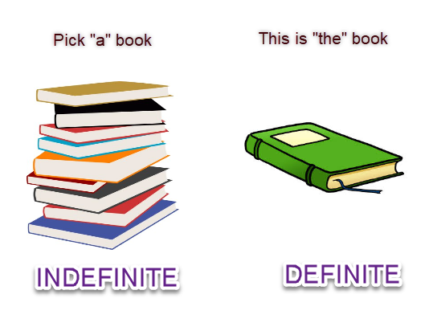

What's the difference between "a" book and "the" book? "A book" is a generic term, it could mean any book. But when I say "the" book, I'm no longer talking about just any book, I'm now referring to a very specific book. You understand? It's the same with this word الہ.

ILAH vs AL-ILAH

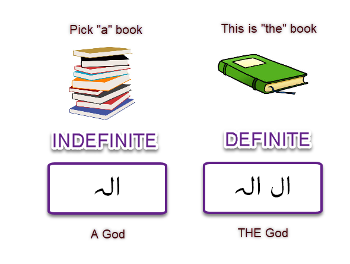

The word الہ is a generic, indefinite term that can be used for many things. There can be many types of الہ, just as there can be many types of books. But when I apply the definite article "the" to it, which is ال in Arabic; when I say ال + الہ , that combination generates the word اللہ. In other words, "اللہ" is the specific form of the generic word الہ. Allah is actually ال + الہ. And so based on the rules of Arabic grammar the الف of اللہ is dropped, and the ال merges with the ل ad the ہ to become Allah. Therefore in order to understand the linguistic meaning of the word Allah, we must first understand the meaning of the word الہ.

### Composite Words

Now the word الہ is a composite word. It has a slew of meanings. Let's first understand what I mean by a composite word. It's important to understand the meaning of Arabic composite words before we proceed because we'll be dealing with many such words.

Composite Word

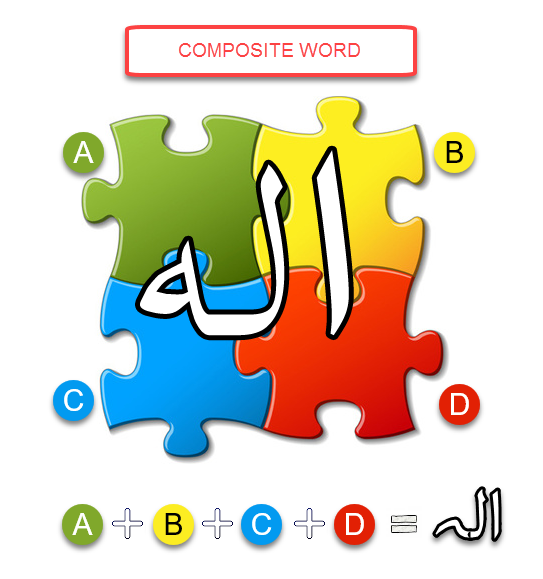

Think of a composite word like a jigsaw puzzle. Every piece of the puzzle has a separate independent meaning. And then all those meanings come together to create a complete image of what the word means. So let's say, if the word الہ has 4 different meanings (A, B, C and D), then the sum of those meanings will give us the complete understanding of the word الہ, you understand? The meaning of الہ is not "A" or "B" or "C" or "D". It is the sum of all those meanings. It is A + B + C + D. You understand?

### Meanings Of Word ILAH

YALAA

Now let's understand all the different meanings of the word الہ. Primarily the word الہ comes from اَلَہَ یَعلُہُ, and the verb اَلَہَ literally means to worship. So the first meaning of اَلَہَ is the entity that is the focus of our worship and obedience. What is worship? It is an extreme form of gratitude. It is that highest form of a sense of gratitude, where the benefactor becomes so desirable, and so important in your life, that you are forced down on your knees in humility. When you completely succumb and surrender your will to the will of the beloved. When that happens, that beloved becomes your الہ. That is the first meaning of the word اَلَہَ.

So for instance if you are so obsessed about your job; if you are obsessed your career to the degree that you put it above and beyond everything and everyone else in your life; then you've made your career your الہ, you understand? If your video games, your sports, your TV shows, your children, your wealth is what commands and rules your heart; if those are the things that make you bow down before them, then by definition these things are your الہ. If you're madly love with someone to the point where that person controls and dominates your every thought, every action, every decision, then that beloved is now your الہ. Because الہ is the one you worship; the one you submit and obey to without question.

ALAHA

This word أَلَہَ is used for a child that is thirsty for the milk of its mother, and is desperately crying for it - that's also اَلِہَ. Parents know what I'm talking about. Have you seen a baby crying for milk? Do you remember the desperation on the baby's face? And at that point how does the baby take the breast of its mother? With this hungry passion, right? That's أَلَہَ. It is the entity that you desperately and inevitably turn to with a passion, with a desperation. It is what you desperately and uncontrollably turn to, in your every single moment of happiness and grief. That is also an أَلَہَ.

Some people have sugar addictions. Some are addicted to smoking, some to drugs, some to parties, some to movies. Anytime you feel happy or depressed, the thing that you desperately and uncontrollably turn to for comfort, by definition, is your الہ. Because you find peace and comfort in the arms of these masters. You are their obedient slaves. When these masters commands, you have to obey. When the desire commands you to smoke, you have to obey! When you can't stop yourself from eating that tub of ice cream, or watching that episode of your TV show; or if you must watch a movie every night, or play video games for hours every day; then you are completely loyal and devoted to those things, because you feel you must absolutely do these things in order to feel happy and satisfied again; and you turn to them in the same desperation that a baby turns to its mother out of its thirst for milk.

This applies to each and everyone of us. We all have such الہ in our lives. Doesn't make us horrible people - just makes us human. What we're doing today, but by learning these meanings, we're in a sense waking up to see these masters for what they really are. And that's the first step towards any change, right? So don't feel overwhelmed by these definitions.

WALAHA

The next word is وَلَہَ . This is someone you are passionately in love with. Someone you cannot stop thinking about. Someone you are obsessed about. The derivative وَلَہَ is used when someone goes insane by the loss of a beloved. The mother who loses her child is called مُوَلَّا. This is a mother who is suffering that extremely excruciating pain and grief over the loss of her child. She is called مُوَلَّا. It's that kind of passionate and obsessive love. In Urdu we say. وَالِھَانَہَ مُحَبَّتْ . Mad love; crazy love. That's also from وَلَہَ. So if there is someone in your life that you're obsessed about, you're always thinking about it; you're madly in love with; being apart from him or her drives you insane - you can't stop texting or calling this person - you're constantly looking at their pictures, reading their old emails, texts - missing them with a passion - then you are in a state of وَلَہَ and by definition, that person is your الہ.

ALIHA

The next meaning أَلِہَ is literally (not linguistically) used for something that you lean on. Something that you put your entire weight on. When you're exhausted and you lean on something and put your entire weight on it, that thing that is supporting you is literally called أَلِہَ. So in your life if you're banking on your finances, your property, your houses, your cars, your job, your social status, your friends, your neighbors, your children, then any of those things that you psychology lean on, are all your الہ. If you're putting all your eggs in one basket, metaphorically speaking, then that basket, that person is your الہ.

WALIHA

Another derivative of the word الہ comes from وَلِہَ which means to become astounded; to become astonished; to become mesmerized. You know how we create role models in actors and musicians and hip hop artists? Especially kids these days. You know how you kids want to be like them, live like them, think like them, dress like them, talk like them, walk like them? When you feel you have to go out and shave your head to look like Amir Khan from the movie Gajni, you've made Amir Khan your الہ. By definition الہ is the one you're completely and utterly impressed by. The one you want to imitate. The one you want to be like. Now it could be a person, or it could be a thing, it could be a profession - it can be anything. Anything that mesmerizes you, grips you, takes complete control of your decisions is your الہ.

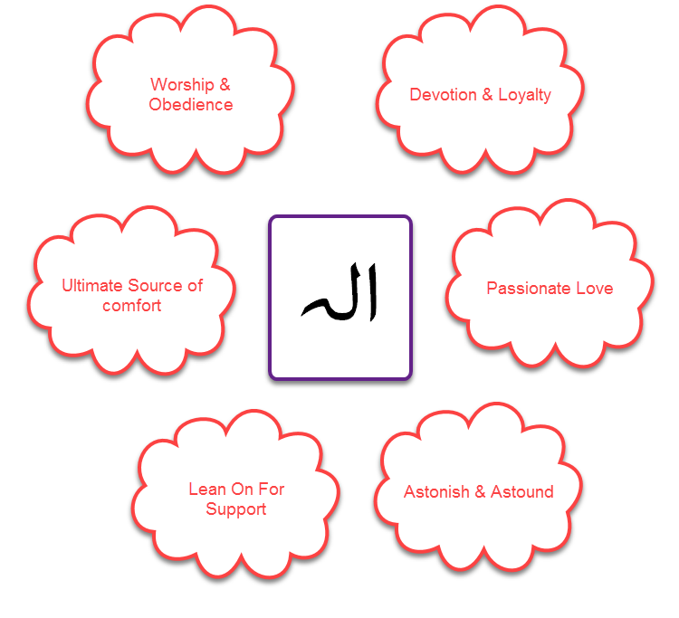

So these are the various meanings of the word الہ. Let's go over them again. Who or what is an الہ?

- The one we worship and obey is our الہ. -

- The one we are completely devoted and loyal to is our الہ.

- The one that we turn to in utter desperation to find comfort is our الہ.

- The one we are passionately in love with; the one we obsess about is our الہ.

- The one we lean on for support - physically, mentally, emotionally, psychologically is our الہ.

So this is what the word الہ means. And because الہ is a composite word, it is the sum of all those meanings. Because the one you passionately love, is the one you will be completely devoted to; you will lean on that person; you will turn to that person desperately for comfort or support; separation or distance from that person will drive you insane; you will literally submit to and obey every single thing they say; In other words, you will worship that person. So you see how all these meanings merge together to create a complete picture? That's how a composite word works.

So now based on these meanings of the word الہ obviously we all have numerous الہ in our lives. We personify and objectify these definitions in numerous ways. Some have الہ in the form of people, family, friends, children, parents, actors, musicians. Some الہ exist in the form of objects - houses, cars, our bodies, jewelry, food, video games, movies. Some have الہ in the form of jobs, careers, recreation, drugs, sex. We all have hundreds, if not thousands of entities in our lives that meet the definition of الہ. Yes?

### idols

Now here is something I want you to think about! And this is where the conversation gets scary and painful. All these people and things in our lives that meet the definition of the word الہ, they give a physical forms to one of the definitions of the word, Isn't that true? So for example, by definition الہ is the one we are loyal and devoted to; الہ is the one we turn to for comfort. And so now if smoking, or movies, or video games is what I turn to for comfort, then in a sense, these activities are taking on a physical form of that definition of الہ. Do you see that? The definition of the word is conceptual; but its manifestation is physical. I'm physically doing something to please that الہ.

So for example, by definition, الہ is the one that astounds and astonishes you. If Shahrukh Khan, Sylvester Stallone, Adele, Byonce, Lady Gaga; if these are the ones who astound you, astonish you, impress you to the point that you want to "be" like them, then you've just given the definition of وَلِھَا a form - you personified that definition in the form of Shahrukh Khan or Stallone or whoever. You understand?

ILAH as Idols

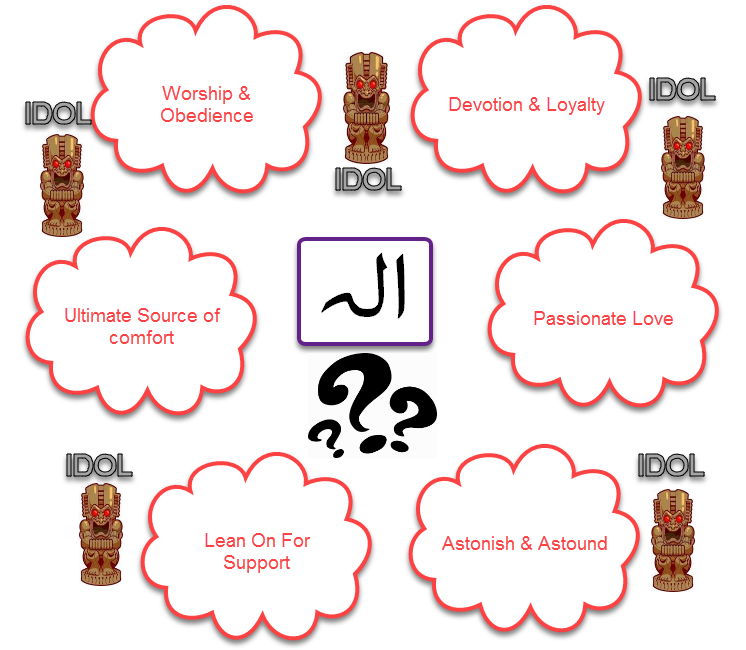

Now what is the definition of an idol? An idol is an image or representation of a god used as an object of worship. That's the dictionary definition of an idol. It is the personification or objectification of someone or something. Isn't it? Who creates idols? We create idols. Idols are man made creations, aren't they? And who objectifies and personifies the definitions of الہ? We do! We decide that we are going to turn to smoking, movies, drugs, alcohol for comfort. We decide that we are going to be completely loyal and devoted to our jobs, careers, Facebook, Instagram. We chose to fall passionately in love with wealth, power and fame. Nobody does that for us. We do that! In other words, we are the creators of our own الہ - just as idols are man made creations. Do you see the similarity there? You see where I'm going with this?

We think we are Muslims, and therefore we have nothing to do with idol worship. But the scary reality is that we are literally surrounded by thousands of الہ, which are self-created idols, and we worship them on a daily basis. Every person, every object, every concept, every idea that we personify or objectify, in a sense is an idol that we made for ourselves with our own hands. So in that sense, we are all "idol-worshipers" - It's a painful reality; but it's true. The concept of شرک doesn't seem so alien now, does it? And this is exactly why Rasul Allah ﷺ said

قَالَ رَسُولُ اللَّہِ صَلَّی اللَّہُ عَلَیْہِ وَ آلِہِ وَ سَلَّمَ

> الشِّرکُ فِی أُمَّتِی أَخفٰی مِن سَیرِ النَّمَلِ فِی لَیلَۃِ الظُّلمَۃِ عَلی سَخْرَۃِ السَّوْدَا
>
> SHIRK (Associating partnership with Allah) is more hidden in my nation, than the movement of a black ant in a dark night on a black stone.

That is how unaware we will be of our own idol worship.

In the final analysis, who is at the center of my idols? I am! Now why did I create these الہ? What motivated me to build my idols? My desires! All my idols are a product and creation of my passions and my caprice. They exist because of my own wants! Allah says:

The Criterion [25:43]

> ‏أَرَءَيْتَ مَنِ ٱتَّخَذَ إِلَهَهُۥ هَوَىٰهُ
>
> Have you seen the one who takes as his god his own desire?

Allah is asking the messenger ﷺ, do you not see this person who has taken his desires - his car, his house, his job, his wealth, his fame, the pleasures and sensations of his body as his الہ. Do you not see this person who has taken smoking, drugs, alcohol, sex, movies, video games as his الہ ; who has taken Shahrukh Khan, Salman Khan, Amir Khan, Adele, Stallone as his الہ. Allah asks Rasul Allah ﷺ ,

> أَفَأَنتَ تَكُونُ عَلَيْهِ وَكِيلًا
>
> Do you really want to be responsible for this person on the day of judgment?

Worship of the "self" is the worst form of شرک there is. When gratitude turns into self-gratification, that is the worst kind of شرک there is. Idolatry has nothing over self-olatory. And so we are the one's constantly committing شرک by taking our desires and making them our الہ. Human beings are in a constant state of self-worship, which is what prevents us from truly worshiping Allah!

### Understanding Allah

This is the default state of mankind! Now here is where Islam comes to the rescue! By the negation and the destruction of these self created idols, emerges the understanding of Allah. Who is Allah? He is لَا اِلَہَ اِلَّا. You see? He is everything other than what you take for your الہ. If we break and destroy each and every idol that generates from the desires of our "self", when the Kaaba of our hearts is empty of these idols, what we will find there is Allah.

What is the first thing that Rasul Allah ﷺ did after the conquest of Mecca. He cleansed the Kaaba of all idols. There were 365 idols in, around and on top of the Kaaba. He destroyed each and every one of them, one by one. And this is exact same exercise we all have to go through in our own lives. Just as Rasul Allah ﷺ conquered Mecca, we have to conquer our نفس. Then just as he cleansed the Kaaba of all idols one by one, we have to gradually cleanse our Kaaba, our heart, of these idols - one by one. And the greatest and the most powerful idol that stands in the Kaaba of our hearts, is our نفس, our passions.

This is why our creedal formula is so amazing! Because it attacks the very root of this problem. لَا اِلَٰہَ اِلَّا اللَّہُ. There is no الہ except Allah. There is no one, no person, no thing, no concept, no principle, no ideology worthy of giving form to, except the one who is free of all form - and that is Allah. And so by the negation of our self-made idols; by the elimination of our self-created الہ, emerges the "the" الہ. What happens when you add the definite article "the" to الہ? You get the ultimate الہ which is Allah.

Our creedal formula of لَا اِلَٰہَ اِلَّا اللَّہُ is the idea of negating the multiplicity of our self-created الہ to affirm **the **one true الہ which is Allah.
It is the exercise and the practive of making الہ into ال الہ.

It is the exercise and the practice of seeing Allah as the **one and ****only - the ultimate **target of all those definitions of the word الہ ; of making him ال + اللہ - of making him Allah!! It is the exercise of isolating the various definition of the word الہ and making them specific for Allah

Replace ILAH

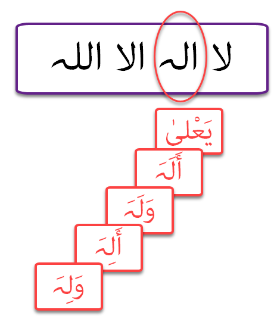

- This means that now Allah is the only one I worship and obey . If any other الہ **conflicts **with the commands of Allah, then I disobey the الہ to obey the ال + الہ which is Allah.

- This does not mean that I cannot enjoy life. The difference is that now Allah is at the front and center of my worship and obedience. As long as nothing conflicts with his worship and obedience, I can enjoy my life to the fullest degree.

- لَا اِلَٰہَ اِلَّا اللَّہُ now means لَا یُعْلَی اِلَّا اللَّہُ , that Allah is going to be the only one that I will be completely devoted and loyal to - above everyone else in my life. Even my own parents! Even my own children! I serve only Allah and no one else.

- But then, I'm happy to serve my parents because Allah has commanded me to do so. I'm happy to hang out with my friends, go to parties, watch movies, do whatever I want, as long as my ultimate loyalty and devotion lies with Allah. If anything or anyone challenges that loyalty, I must choose Allah over them. That is how I would make him ال + الہ.

-

لَا اِلَٰہَ اِلَّا اللَّہُ now means لا أَلَہَ الا اللہ, that Allah is the only one I turn to in utter desperation for all of my needs and comforts.

- This does not mean I cannot ask help from my family and friends. This does not mean that if I'm hungry and out of a job, I sit on my butt and not do anything because Allah is the one who is supposed to feed me. Absolutely not! I turn to whoever I need to, for whatever I want. The difference now, is that in the back of my mind I remember that these people are simply a means to an end. Allah is the one providing for me and he is using these people as a means (أَسْبَاب) to get the job done. And therefore my ultimate ask is always going to be of him. Ya Allah! I need this! I turn to you for the fulfillment of my needs - Provide me with the means and resources that will fulfill my needs in a way that pleases you. Because it is you, and only you, who is the source of my provision - nobody else. You understand the difference?

-

لَا اِلَٰہَ اِلَّا اللَّہُ now means لا وَلَہَ الا اللہ, that Allah is the one I am passionately in love with. Allah is the one I am completely obsessed about. From the moment I wake up to the moment I go back to sleep, Allah is the only one I think about.

-

This does not mean I sit on my prayer rug all day, or I spend my entire day doing تسبیح. No! I can do whatever I want do in life, but everything reminds me of Allah. Everything in the horizons and my soul becomes a sign for me, pointing me towards Allah, reminding me of him. Isn't that what love does? You look at the flower, the rainbow, the sunset, the frog in the pond and they all remind you of your beloved. Love is an obsession! It is a constant connection with the beloved.

- You know the story of Hazrat أیوب? He was put into great trials to test his faith. According to a HADEES of Rasul Allah ﷺ once Allah mentioned the patience and gratitude of Hazrat أیوب AS to his angels. So ابلیس spoke to Allah and said that the only reason he is grateful to you is because you have blessed him with so much. You have given his so many possessions and children. That's the only reason he's grateful to you. If you take it away, you'll see he's no longer going to be grateful. So Allah started taking things away from him. He took his possessions away. His house collapsed right in front of his eyes killing all his sons. Can you imagine that? And when he saw that happen right in front of his eyes, do you know what instinctively came out of his mouth? AlHamdulillah! That's what he said. And then if that wasn't enough, he got this horrible disease, where his body got infected with worms. They would eat his flesh. Allah put Hazrat أیوب through this extreme forms of trial to test his faith and love of Allah; and he succeeded with flying colors. Finally his test was completed. Allah asked him to bathe in this spring water that he set out for him. He took a bath in it and his disease was completely cured. Then years later someone asked him. How is your health now أیوب? He sighed and replied. The days of my illness were more beloved to me than these days of health. The man was shocked to hear that. He asked how come? أیوب replied. that when I was ill, every single day Allah would ask me once, "How are you doing today أیوب?" And now that I've been cured, Allah no longer asks me that. So I miss that love and care that Allah showered upon me during my days of illness. This is وَلِھَا. This is مُوَلَّا. Extreme, passionate love! In which a person is driven to insanity in the absence of his beloved.

- لَا اِلَٰہَ اِلَّا اللَّہُ now means لا أَلِہَ الا اللہ, that Allah is now the only one I lean on for support - emotionally, psychologically, financially, physically - in every way shape or form.

- Doesn't mean I'm not going to see a doctor if I'm sick. Doesn't mean I'm not going to ask my boss for a pay raise if I deserve one. Doesn't mean I'm not going to ask my family and friends for help if I need them. I will continue to do all of that! But my ultimate support is going to be from Allah. He is the one I will ultimately lean on. He is the one who cures me of my illness - not the doctor. He is the one who destines my pay raise - not my boss. He is the one who fulfills my need- not my friends and family.

- Can you just imagine how liberating this would be. How many of our complaints with people and life would just disappear? We no longer would have to blame someone we trusted for disappointing us. Because he was not meant to be. I never leaned on that person for support to begin with - therefore there is nothing he can do to disappoint me. You can't have a disappointment without expectation, right? And if all my expectations are from Allah then nobody in this world can disappoint me. If I get what I wanted then Allah was the one who gave it to me. If I didn't get what I wanted, it was not meant for me. Who knows if getting what I wanted would end up being the worst thing for me in the long run?!

- لَا اِلَٰہَ اِلَّا اللَّہُ now means لا وَلِہَ الا اللہ, that Allah is the only one that astounds and impresses me.

- This does not mean that I should not appreciate anyone in my life. I should not praise anyone, or not feel impressed by anyone else in my life. No! What this means is that I must see Allah behind the praise. If my child does really well in school - MashaAllah!! Praise for Allah that he made my child intelligent. If I'm mesmerized by the sunrise and sunset -SubhanAllah! Praise to Allah for creating this beauty for me and giving me the eyes, and the time and willingness to appreciate it. You see? I'm taking the praise for the beauty of sunset and attributing it to the creator of that beauty.

And what happens through this exercise, is that we get to the true concept of توحید. The concept of توحید is not that Allah is the ultimate deity in a hierarchy of deities. NO! The concept of توحید is that there **is ****no other** deity. لا الہ - there is a complete elimination of all other deities. الا اللہ except THE one and only deity which is Allah. It is the transference of الھیۃ from its generic form to the one specific being that has no form! This is the challenge and the goal of لَا اِلَٰہَ اِلَّا اللَّہُ.

How do we begin this journey? What is the vehicle that can take us on this path? SALAAT. Our SALAAT has the concept breaking idols within its very nature. Because as soon as it's time for prayer, the first thing you have to do is stop whatever you're doing, leave whoever you're with and turn your face towards Allah. SALAAT is this very concept of لَا اِلَٰہَ اِلَّا اللَّہُ in action!!

This is the journey of La Ilaha Illa Allah. It's a very difficult journey. And every journey requires provisions. that helps you get through the journey. And the provision for this journey is knowledge of Allah. The more knowledge we have of Allah. the more we will be amazed by his glory. the more amazed and astonished we are, the more passionate we will become in our love for him. The more passionately we love him, the more we will become obsessed about him. The more we're obsessed about him the more we will worship him. and submit to his commands. The more we worship him, the more we will turn to him seeking his refuge. The more we find ourselves under his powerful shelter, the more we will lean on Him; and put put our weight on him for support. Because love engenders love! The more we realize how much he loves us, the more we will love him back. The more we love him, the more intense he will get in his blessings and mercy.

> ‏وَإِذْ تَأَذَّنَ رَبُّكُمْ لَىِٕن شَكَرْتُمْ لَأَزِيدَنَّكُمْ ۖ وَلَىِٕن كَفَرْتُمْ إِنَّ عَذَابِى لَشَدِيدٌۭ ‎۷
>
> And when your master proclaimed: "If you are grateful, I will give you more, but if you are ungrateful, Indeed! My Punishment is indeed severe."

Salaah is the act of breaking idols

Begins with WUZU which is purifying the very parts of the body that are used by us in serving our idols.

## What is Worship?

### Allah Revised

In the last session I talked about the word الہ and its various flavors in meaning. We learnt that when the definite article "THE" or ال gets applied to الہ, it becomes ال الہ which then fuse together to become Allah. All the various meanings of الہ then become exclusive for the one we are calling Allah.

So now if I take the meaning of الہ as a powerful entity that demands submission, then Allah becomes the only one for me. He becomes ال الہ. The only one I deem worthy of my submission. He becomes the only one I must be completely loyal to; because there is none more powerful than him

> ‏وَهُوَ ٱلَّذِى خَلَقَ ٱلسَّمَوَتِ وَٱلْأَرْضَ بِٱلْحَقِّ ۖ
> وَيَوْمَ يَقُولُ كُن فَيَكُونُ ۚ قَوْلُهُ ٱلْحَقُّ ۚ وَلَهُ ٱلْمُلْكُ يَوْمَ يُنفَخُ فِى ٱلصُّورِ ۚ
> عَلِمُ ٱلْغَيْبِ وَٱلشَّهَدَةِ ۚ وَهُوَ ٱلْحَكِيمُ ٱلْخَبِيرُ ‎۷۳
>
> And it is He who created the heavens and earth in reality. And the day he says, "Be," and it is, His word is the truth. And he has all dominion on the Day the trumpet is blown. [He is] Knower of the unseen and the seen; and He is the Wise, the Acquainted.

Now that is someone who is truly worthy of my submission, and so by adding the ال , I make that particular meaning of الہ exclusive and he becomes Allah.

The same formula then applies to the rest of the meanings of الہ. In the meaning of seeking protecting and refuge, Allah is the one I exclusively turn to for protection and refuge in desperate times. Why? Because

> ‏وَإِمَّا يَنزَغَنَّكَ مِنَ ٱلشَّيْطَنِ نَزْغٌۭ فَٱسْتَعِذْ بِٱللَّهِ ۚ إِنَّهُۥ سَمِيعٌ عَلِيمٌ ‎۲۰۰
>
> And if an evil whisper comes to you from شیطان, then seek refuge in Allah. Indeed, He is All-Hearing and All-Knowing.

If I take الہ in the meaning of love, then Allah is the only one I choose to be passionately in love with. He's the only entity, the only deity that I choose to be completed obsessed about. Why? For all the infinite favors he bestows upon me even though I find myself to be an extremely ungrateful and unworthy creature.

> ‏وَآتَىٰكُم مِّن كُلِّ مَا سَأَلْتُمُوهُ ۚ وَإِن تَعُدُّوا۟ نِعْمَتَ ٱللَّهِ لَا تُحْصُوهَآ ۗ إِنَّ ٱلْإِنسَنَ لَظَلُومٌۭ كَفَّارٌۭ ‎۳۴
>
> And He gave you of all that you asked for, and if you count the Blessings of Allah, never will you be able to count them. Verily! Man is indeed an extreme wrong-doer, - a disbeliever.

If I take the meaning of glory for الہ then Allah becomes the **only **one who's glory and magnificence astounds me; astonishes me. Even when I set out to understand him; when I venture to recognize him, I do so with the realization that his loftiness will exhaust my limited capabilities of comprehension and understanding. I will be dumb-founded, every single time I attempted to approach Him, because there is nothing comparable unto him.

> ‏قُل لَّوْ كَانَ ٱلْبَحْرُ مِدَادًۭا لِّكَلِمَتِ رَبِّى لَنَفِدَ ٱلْبَحْرُ قَبْلَ أَن تَنفَدَ كَلِمَتُ رَبِّى وَلَوْ جِئْنَا بِمِثْلِهِ مَدَدًۭا ‎۱۰۹
>
> Say. "If the sea were ink for the Words of my Lord, surely, the sea would be exhausted before the Words of my Lord would be finished, even if we brought like it for its aid."

Finally if I take الہ in the meaning of the one I lean on for support, then Allah becomes the **only **one I choose to lean on. He becomes the **only** one I choose to put the entire weight of my spiritual burden on for support. Because his support is the only support that matters.

> ‏إِن يَنصُرْكُمُ ٱللَّهُ فَلَا غَالِبَ لَكُمْ ۖ وَإِن يَخْذُلْكُمْ فَمَن ذَا ٱلَّذِى يَنصُرُكُم مِّنۢ بَعْدِهِۦ ۗ وَعَلَى ٱللَّهِ فَلْيَتَوَكَّلِ ٱلْمُؤْمِنُونَ ‎۱۶۰
>
> If Allah helps you, none can overcome you; and if He forsakes you, who is there after Him that can help you? And in Allah let believers put their trust.

In other words, there are all these different meanings; these various rivers of knowledge that flow out of the word الہ, and become exclusive when it reaches the ال اللہ or اللہ.

But what do we get out of the union of all these meanings of الہ? If Allah is the only powerful entity deserving submission; if Allah is the only one capable of providing refuge and protection; if Allah is the only one worthy of passionate love and the obsession of my thoughts; if Allah is the only one who astonishes me; if Allah is the only one I want to lean and depend on; then the union of all these meanings of الہ make him what? They make him worthy of my worship. They make him worthy of my عبادۃ. This is why he created me.

> ‏وَمَا خَلَقْتُ ٱلْجِنَّ وَٱلْإِنسَ إِلَّا لِيَعْبُدُونِ ‎۵۶
>
> And I created not the jinns and humans except they should worship Me.

And the sum of these meanings make Allah worthy of my worship.

> ‏إِيَّاكَ نَعْبُدُ وَإِيَّاكَ نَسْتَعِينُ ‎۵
>
> It is only you that we worship, and it is only you that we seek help from

So what the word اللہ leads us to is the idea of worship; and the one we worship and are obedient to is called the معبود.

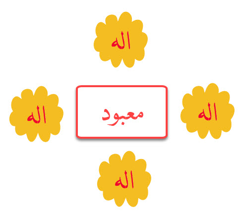

### What is Worship?

Now what is worship? The word عبادۃ is commonly translated as worship. But linguistically, the word عبادۃ actually means a combination of two things. It means to worship and it also means to obey - both at the same time. They're not interchangeable like in the English language. No! Both meanings of worship and obedience are embedded inside this one word of عبادۃ in the Arabic language. Together they both means عبادۃ

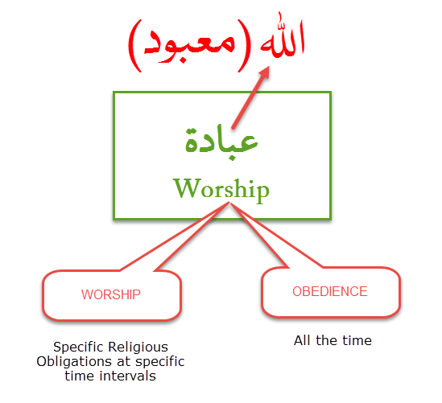

But generally when we think of the word worship, what comes to mind? The 5 prayers, fasting, paying زکواۃ , performing حج right? These are all different forms and rituals of worship. So we think that's it. We stop at those activities. And that's the point I want to highlight today. The problem with this translation of the word عبادۃ exclusively in the meaning of worship, is that it does not necessarily include the concept of obedience.

Especially an obedience that stems out of love. That's very important to understand. Worship is a love based obedience. Because the word obedience can have a very negative connotation to it. People can be forced into obedience. Children are often bullied into obedience by the use of threats or violence. So it is possible for obedience to have a very negative emotion attached to it. But this is not the kind of obedience that we're talking about here. عبادۃ is an obedience that comes naturally from the appreciation of all these various meanings of الہ that we learnt. When you love someone passionately; when you become obsessed about him; when you are completely devoted and loyal to him; when you can completely trust him and lean upon him, when you're so impressed and amazed by ones loftiness, greatness, magnificence; when you know you can always and unconditionally turn to someone for protection and refuge; then the natural outcome of the sum of all these love based emotions, is obedience. So always remember that عبادۃ is an obedience that stems out of love. It is a lover's obedience, in order to make his beloved happy. It is an obedience that is based on passionate love, and a trust that is complete and unshakable.

This is why Allah سُبْحَانَهُ وَتَعَالَى created us; this is why he gave us the ability to love. He did not create us, and desire disobedience from us. He allows disobedience; His magnificence enables the capability of disobedience within his creation, which is called خذلان but he is not content with it. Because disobedience is completely contrary to the the concept of love.

تُعْصِی أِلہ وَ تُظْھِرُ حُبُّہُ | ھٰذا مُحالٌ فی القِیاسِ بدیع

There is a poet named محمود الوَرَّاق. In one of his poems he says:

You disobey Allah and you fain the love of God

This is impossible and an unknown type of logic

لَو کانَ حُبُّک صادقُ لَطاعَتُہُ

Had your love been sincere you would be obedient

فَاِنَّ المُحِبَّ لِمَن یُحِبُّ مُطیعُ

Because a lover always obeys his or her beloved.

It is the nature of love that you want to obey the one you love. In one of his poems he says

وَقائِلتُ قَد سَأَلَت عن حَارِ عاشِقِھا

A woman once asked someone about the state of the one who loves her with this burning passion. The عاشق is the one who is burning up with passion. They say دَوَاءُ الْعِشْقِ الْاِتِّصَالُ , the only cure for عشق is to be connected with the beloved; to be in the embrace of the beloved. So she's asking this man about her love. This is what lovers do - they inquire from others, about what how much their lover loves them. So she asks this man

للہِ صِفہُ ولا تَنقُص وَلا تَزِدِ

For Allah's sake describe him to me; and don't stint in your description and don't exaggerate. You know, I wanna hear the truth. So he says:

لَو کانَ رَھلِ الموت بالضمأٍ

If he thought he would die from thirst

وَ قُطی قَفّعاً وُرُودَ المآءِ لَم یَرِدِ

and you said don't touch that water, he wouldn't touch it. So her lover knows he is going to die of thirst, but if the woman said, don't touch that water, he wouldn't touch it. He'd rather die than disobey. So the point of that; what he's emphasizing there is that the nature of love is obedience. So the more you love god, the more you will want to obey him.

So عبادۃ to Allah سُبْحَانَهُ وَتَعَالَى has these two concepts embedded within it - worship and obedience. Both of which stem out of a passionate love for him and not from a forced compulsion or coercion.

To put this in practical terms - let's say we are about to pray in 15 minutes. Let's say it's time for فجر and so we have to pray; we have to do our عبادۃ. Now what kind of عبادۃ is prayer? Is it worship or is it obedience? It's worship, right? But then from فجر all the way up till ظھر, we will not be worshiping him through the rituals of prayer, but if we are sincere in our love for him, we will be doing what? We will be obeying him! We will be in a state of obedience with him; because it is the dream and desire of every lover to make the beloved happy.

And so the beauty of the word عبادۃ is that it covers the entire horizon of love, putting us in a constant state of worship. When we are performing the ritual acts of صلوۃ we are in a state of عبادۃ , and then we are in between two prayers, by being in a state of obedience, we are still in the state of عبادۃ. You see? This this is why the concept of عبادۃ is so comprehensive in Islam. We are constantly in a state of worship; if not through formal rituals, then through obedience.

So what this means is that if you go and earn a حلال income through your job, that is an act of obedience. When you go to school, and you sincerely accomplish the purpose of education, you're in a state of عبادۃ. When you love and respect your elders, when you're kind to your siblings; when you're generous to the needy; when you're courageous in the face of temptations - no matter what you do - as long as you're in a state of obedience and servitude to Allah سُبْحَانَهُ وَتَعَالَى, anything and everything you do, becomes an act of عبادۃ. Going to the toilet becomes عبادۃ. Imagine that! When you go to the toilet to relieve yourself, when you obey the commands of Allah to cover your head and feet, seek his protection, recite all those دعا, you are in a state of عبادۃ.

## Linguistic Meaning Of REHMA

In the previous sessions we studied a couple of composite words such as الہ and رب. The word الہ is a composition of several different meanings that come from اَلَہَ یَعلُہُ the one who is worthy of worship; أَلَہَ that is used for a child that is thirsty for the milk of its mother - basically the one we desperately turn towards for the fulfillment of our needs. وَلَہَ the one we passionately love; أَلِہَ the one we lean on, or put our weight on; وَلِہَ which is to become astounded by the glory and magnificence of someone. We combine all these meanings to understand the meaning of the word الہ. And then we talked about our creedal formula of لَا اِلٰہَ اِلَّا اللَّہُ , which is designed to eliminate the multiplicity of these generic الہ to identify the one specific الہ. To apply the article "the" to الہ making him ال الہ or اللہ.

Then we studied the word رب which is also a composite word and is a combination of

المَالِکُ وَ السَّیِّد وَ المُرَبِّی وَ المُرْشَدُ وَ المُنعِمُ وَ القَیِّمُ

المَالِکُ - The absolute owner, السَّیِّد - The one with complete authority. المُرَبِّی - The one who nourishes, المُرْشَدُ - The one who guides and puts to purpose. المُنعِمُ - The benevolent benefactor; the one who showers with undeserved gifts. And finally, القَیِّمُ - The maintainer. You combine the meanings of all these words and you get the understanding of the word رب - which is translated as master.

We then looked at the concept of عبد which in the Quranic perspective means a "free slave". In order to understand this relationship, we looked at the master-slave relationship of this world, and we then compared it to the master-slave relationship that Allah has with us - to conclude that even though Allah is our "master", he is unlike any other master that we have ever encountered in this world.

### Mercy

Today we're going to take a look at the word رحمۃ ; which is "the" primary attribute of Allah. It is an attribute that is most dear to Allah. In fact, this quality is so fundamental to him, that he has made it obligatory on himself. We know that Allah has imposed certain obligations on Muslims? Prayers, Fasting, Zakah, Hajj, right? He has made a bunch of actions compulsory on Muslims. But there is one action that he has made compulsory on himself - and that is the action of his mercy - his رحمۃ.

In a HADEES, Rasul Allah ﷺ says:

قَالَ رَسُولُ اللَّہِ صَلَّی اللَّہُ عَلَیْہِ وَ آلِہِ وَ سَلَّمَ

> إنَّ الله لَمَّا قَضٰى الخَلق،كَتَبَ فَوقَ عَرْشُه اِنَّ رَحمَتِی تَغلِبُ غَضَبِی
>
> Indeed, after Allah established all his creation, he wrote on his throne, "Indeed my mercy shall overcome my wrath"

ُإنَّ الله لَمَّا قَضٰى الخَلق،كَتَبَ فَوقَ عَرْشُه

Indeed! when Allah established all of creation, he wrote a statement on his throne. What was that statement?

اِنَّ رَحمَتِی تَغلِبُ غَضَبِی

Indeed! my رحمۃ - my mercy for my creation will **always** overcome and overpower my wrath and my anger. In other words, in my dealing with my creation, my mercy will always superseded my anger. This is a rule that our all powerful, all-mighty creator imposed upon himself in his dealings with us. SubhanAllah! Now of course this is not literal! There is no actual physical throne - it's a graphic representation of an emotion, that depicts the love of Allah for his creation.

Now let's take a look at this word رحمۃ. It's a very powerful word that we'll study over the course of the next few sessions InshaAllah. Today we'll look at the general definition of the word رحمۃ. In the next session, we'll look at a more graphic representation of the word, in order to visualize this concept properly.

The word رحمۃ is generally translated in English as what? As "mercy". The problem with that translation is, that it actually distorts the meaning of the word. I'm not saying its the wrong translation; I'm saying it's a weak translation. Why? Because the word mercy is generally used when you are being spared from a punishment. When you hear the words, "the soldiers showed mercy", what does that mean to you? It means that they had the power to do something terrible, but then they chose to spare everyone, right?! The criminal begged the judge for mercy. In other words he asked the judge to be spared; to not be punished. So when we generally think of the word "mercy", the idea is that something bad or painful was about to happen, and then someone decided not to go ahead with that painful action - in other words, showed mercy. You understand? So there is that subconscious association with punishment when the word mercy is used, followed by the idea of somehow escaping that punishment. Nevertheless, the default position is pretty much punishment when we think of mercy.

Now, when we constantly use this word "mercy" for Allah, with that subconscious taint of escaping punishment; and when we repeat it over and over again; it sort of creates this idea in our minds, that Allah wanted to do something bad to us, but then he decided not to do it. That is how he showed us mercy, but not punishing us. You see what I'm saying? It creates that subtle subconscious image of Allah being a tyrant in some sense - نَعُوذُ بِاللّٰہِ.

In reality, this is not the true intent of the word رحمۃ. The word رحمۃ has absolutely nothing to do with punishment. It has no concept of the word punishment in it. So now let's look at the linguistic meaning of the word رحمۃ?

Definition of rehma

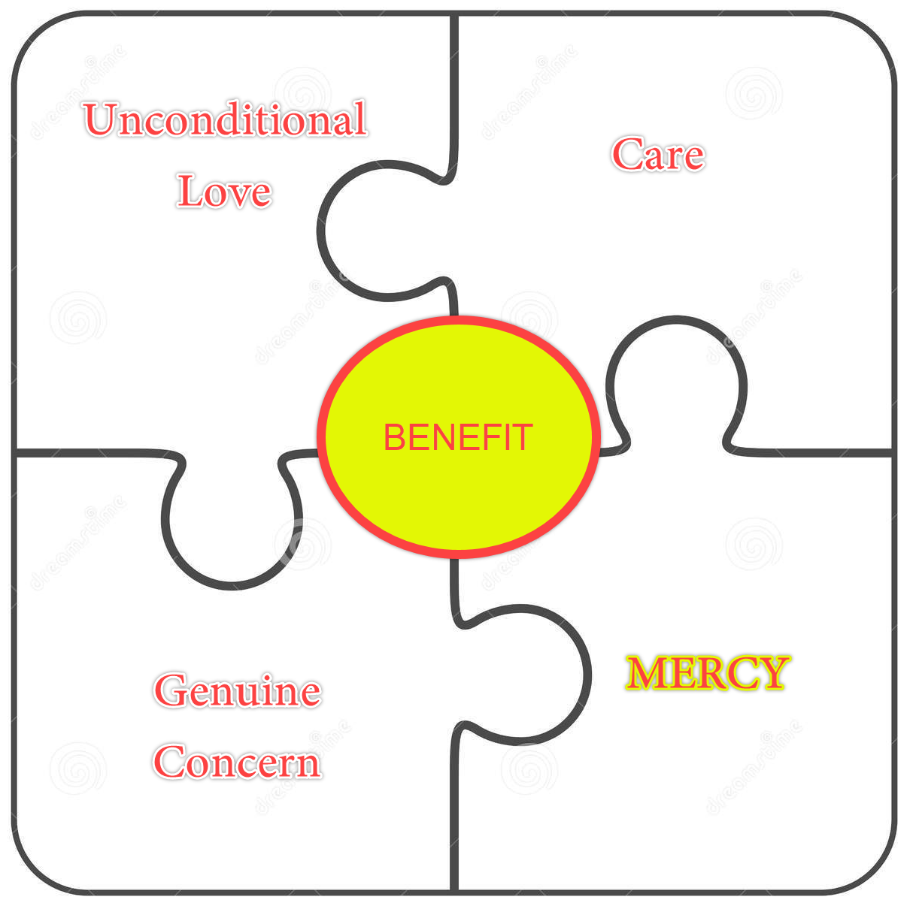

In classical Arabic رحمۃ has 4 meanings.

1. Unconditional love

1. Care

1. Genuine concern

1. Mercy

Mercy is actually the last piece of the puzzle - not the first. Unconditional Love is the first! then care! then concern! and then finally mercy. This is رحمۃ. I think these 4 words are self-explanatory. Unconditional love is affection without conditions. We know that Allah loves his creation unconditionally - like the mother who loves all her children equally regardless of whether they are obedient or disobedient. It doesn't matter to her in terms of her love for them. Allah's love us the same way - and why not?! We're all his creation after all. He created us with his own hands.

Allah is caring! He looks after us, provides for us; fulfill all our needs.

He is genuinely and sincerely concerned for our salvation, for our happiness and well being.

And finally Allah is merciful, in that he shows compassion towards our weakness. He graciously forgives our sins and transgressions; and he accepts our weak and feeble acts of worship even though they lack the sincerity and the honor he deserves.

So رحمۃ is a combination of these 4 words put together - unconditional love, extreme care, genuine concern and mercy. And Linguistically speaking the word رحمۃ means to show love, care, concern and mercy in order to benefit someone. The ancient Arab would say:

الرحمۃُ، رِقَّۃٌ تَقتَدِ الأحسانُ أِلی المَرحوم

رحمۃ is a kind of love or tenderness that is intended to benefit the beloved. In other words, رحمۃ is precisely targeted towards benefiting someone. It has to translate into a beneficial action for someone, or its not رحمۃ.

### Two Manifestations of Mercy

2 Manifestations

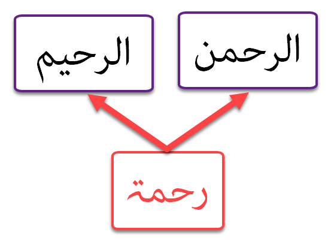

Now there are 2 common flavors or manifestation of this word رحمۃ that we find in the Quran. What are those words? They are الرحمن and الرحیم. They both originate from the word رحمۃ. Let's first lets look at how both these words are commonly translated. If you look at any English translation of بِسْمِ اللَّہِ الرَّحْمَٰنِ الرَّحِیمِ, you will see - "In the name of Allah -the most gracious the most merciful". Or you will find, "In the name of Allah the most beneficent the most merciful; the most merciful the most kind; the merciful the beneficent; the beneficent the beneficent.
The problem with these translations is that that these words are very difficult to process and visualize in English. When do we ever use the word beneficent in our normal day to day conversations? Like if somebody helped you with something, do you say, "Oh G! You are so beneficent". You don't do that, right? The purpose of translation is to understand the text better. But if we start using words for translation that we ourselves do not use or cannot relate to, then that defeats the entire purpose, right?

So let's first properly understand these 2 words. As I said, both الرحمن and الرحیم are manifestations of the word رحمۃ. And what does رحمۃ mean? It means a combination of 4 things with the intent of benefiting someone. 1) Unconditional love, 2) Care 3) Genuine concern and 4) Mercy. When we call Allah الرحمن and الرحیم we essentially acknowledge these 4 qualities about Allah.

things - that Allah has **intense** love for us; he cares for us; he is genuinely concerned for us; and He shows us mercy. That is the implicit acknowledgment in any word that derives from the word رحمۃ. And this is something Allah states over and over again in the Quran

وَمِن رَّحْمَتِهِۦ جَعَلَ لَكُمُ ٱلَّيْلَ وَٱلنَّهَارَ

Out of his love. he created the night and the day

مِّن رَّحْمَتِهِۦ وَيُهَيِّئْ لَكُم مِّنْ أَمْرِكُم مِّرْفَقًۭا

Out of his love he will make your tasks easy for you

وَمِنْ آيَتِهِۦٓ أَن يُرْسِلَ ٱلرِّيَاحَ مُبَشِّرَتٍۢ وَلِيُذِيقَكُم مِّن رَّحْمَتِهِ

Out of his love he sends the winds that delivers good tidings, so that you can recognize his love for you

مَّا يَفْتَحِ ٱللَّهُ لِلنَّاسِ مِن رَّحْمَةٍۢ فَلَا مُمْسِكَ لَهَاۖ

When Allah opens the doors of his love for someone, nothing can close them

Now the purpose of all such verses is to to explain one thing to us. In the last session, we talked about Allah being our master, right?. And when you think of the word master in the worldly sense; when you think of the word authority, what is the last thing you think of in a master slave relationship? Unconditional Love! But Allah is reminding us right away; right at the beginning of every recitation: بِسْمِ اللَّہِ الرَّحْمَٰنِ الرَّحِیمِ . He is reminding us that he is a different kind of master. He is reminding us that we will never, ever find a master in this world, who is as powerful as Allah; and yet who has the kind of رحمۃ as him! SubhanAllah!
No other master in this world will show unconditional love to their slaves. They might take care of their slaves once in a while, but they will never ever love them!! Masters will always show love to their own, never to their slave. But this master! Our master - Allah!! The very first emotion that he exhibits towards us is unconditional love. No other master will care for us the way Allah cares for us. No other master will be genuinely concerned about us, the way Allah is concerned for us. No other master will show us mercy when we disobey them; and not complete the job to their standards! But Allah always has mercy on us.

### REHMAN

Now let's understand the linguistic meanings of these two words الرحمن and الرحیم. This will blow your mind InshaAllah! And once you understand these words, you will appreciate Allah like nothing else - InshaAllah .

The word رحمن follows a particular phonetic pattern that represents "intensify", "ferocity", "severity", "extreme force of power". Any word in Arabic that follows this phonetic pattern of آن has these characteristics. Words like غضبان (extremely angry; intensely angry); جوعان (extremely hungry; ferociously hungry); عطشان (extremely thirsty). On this same pattern we have the word رحمن (extremely merciful; intensely merciful). You understand?

Rehman

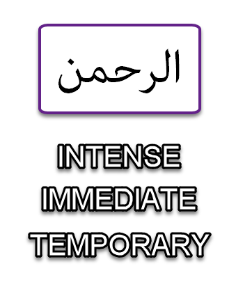

Now what's really interesting is that any word that follows this phonetic pattern has 3 characteristics.

1. It is extreme

1. It is immediate

1. It is temporary

All word that match this pattern will always possess these 3 characteristics. They will be extreme; they will be immediate; and they will be temporary. So now if we look at the word رحمن , it means love, care, concern and mercy of Allah. But not just love in the sense we understand love. It is a very extreme and intense form of love. It is a love that is beyond human imagination. It is care and concern beyond human imagination. It is mercy beyond human imagination or example. So that's the first characteristic of الرحمن - that whatever you expect from Allah, in terms of love, care, concern and mercy, understand that it is going to be beyond your imaginations and expectations. You cannot possibly find an example of that love in this world. OK?

The second meaning of الرحمن is that it is something that is happening immediately. You don't have to wait for it. It is happening right now. Let's think about this for a second. In English what is the difference between someone who **is **patient and someone who is **being** patient. ? Which one is showing patience right now? The one who is **being** patient, right? Like for example if I say that so-and-so ***is*** a patient woman; I can't say if she's going crazy with her kids right now or not. Maybe she's yelling at them! Maybe she's throwing them against the wall - I don't know that. When I say so-and-so is a patient woman, what I'm saying is that she is generally a patient person. But that doesn't necessarily mean that she acting patiently right this very second. But when I say, so-and-so is **being** patient! I'm talking about her when? Right now! You understand the difference? The love and care of الرحمن is not something that is happening generally or at some distant point in time; that extreme and intense form of love is happening right now! In other words, through الرحمن the Quran is teaching us, that we don't have to wait for Allah to show us love at some future point in time. We don't have to wait for him to care for us, or be concerned for us at a later point in time when some event occurs, or when we are in the middle of a calamity - no no no no no! All of that is happening right now!! He loves us right now! He cares for us right now! He is genuinely concerned for us right now! and he's being merciful to us right now! All of that is happening, in its extreme form, when? Right now! You understand?
So the first characteristic of الرحمن is extreme, the second is immediate. What was the third one? The third was temporary. The love of الرحمن is extreme, it is intense, it is immediate, but it is temporary. It is not permanent. Now this third part is a bit hard to take in when we hear it for the first time. It feels wrong! I'll explain why that is very soon - so just bear with me for a bit.

For now just remember, that الرحمن has these 3 qualities - Intense, Immediate but temporary. And as I said, all words that follow this phonetic pattern have these 3 characteristics.

So for example let's take غضبان. It means extremely angry; and extremely angry, when? Right now! But that extreme anger has to be temporary. Why? Because someone who is extremely angry, can not physically stay that angry forever. He cannot! His head will explode and he will die. Even the hulk chills out eventually, right?

Similarly جوعان means EXTREMELY Hungry; and hungry RIGHT NOW (like you crazy teenagers) - but temporary. Why? Because you will eat something in that state, and once you do that your hunger goes away. Or you don't eat and you starve to death, and that's how the hunger goes away. You understand? In either case, you won't stay hungry permanently.

Same way, you have عتشان. EXTREMELY thirsty, right this very moment - but temporary. You will either have a drink and no longer be thirsty, or you will die of thirst. In any case that thirst is not going to last forever.

So now why is Allah's intense mercy temporary? Because we would not be able to handle the intensity and severity of his love for a long period of time. I'll give you an example - kids will be able to understand and relate to this much better. Have you ever had those moments with your mom where they're in a very cuddly and huggy kind of mood? The wrap their arms around you and squeeze you till you cannot breathe and go? أو میرا بیٹا! أو میری بیٹی - Mua Mua Mua. Your face is dripping wet after they're done with you! Know what I'm talking about? Now that is a manifestation of what? Intense love! It is a burst of love that your mother showers on you. Now that's a beautiful thing when you're feeling down, or you're depressed, or just just need some serious TLC. You'll actually appreciate that intense love, right? But now imagine that every time you walk by your mother, that's what she does to you. أو میرا بیٹا! أو میری بیٹی - Mua Mua Mua. Every single time! how would you feel then? Would you be able to take it? No! You'd get annoyed! you'd get irritated! Right? Mom!!! Leave me alone! Stop marinating my face with your saliva every time I walk by! Right? You get the idea?

Allah's intense love is extreme, immediate - but temporary, because if it was constant, because of its intensity and severity - we would not be able to function. We would literally go insane. We would lose our minds!

Story of Eisa and the Rabi.

### RAHEEM

Raheem

The next word is الرحیم. Allah's love, care, concern and mercy also manifests through the word رحیم. There are two characteristics you need to know about the word رحیم. It has two qualities. Once again, this applies to all words that follow this phonetic pattern - کَرِیمٌ، سَلِیمٌ، حَکِیمٌ، جَمِیلٌ، جَلِیلٌ - they all have these 2 qualities. What are they?

The first characteristic is that it is permanent - it is not temporary

The second quality is that it is not necessarily happening right now. It is not immediate, it is long-term. For example if I say, my aunt is loving to me! That's a long term quality, isn't it? But does that mean she is being loving to me right now? Not necessarily. She may not be showering me with that love right now, but I know for sure that it's always there for me!

### Rehman before Raheem

Now what's really interesting is that everywhere in the Quran, we find الرحمن mentioned first, and then it is followed by الرحیم. Why is that? Why are the two always used together? Please listen to his very carefully.

If Allah had ONLY said الرحمن then his love, care, concern and mercy would have been EXTREME; it would have been immediate; but it wouldn't have been permanent. If Allah only said الرحیم his love and mercy would have been permanent, but it would not have been extreme. So how do I talk about the love, care, concern and mercy of Allah, so that it is extreme **and **it is beyond expectations; and it is immediate; and it is permanent; and it is long term; and it is all of this at the same time? The only way to do that is through الرحمن and الرحیم. SubhanAllah! You cannot talk about the qualities of the love and care of Allah in better terms than الرحمن and الرحیم

I'll give you an example so that you can understand this better. You are at work. Today is pay day. Your boss is not there at the office; and you have a flight booked to Timbuktu for 6:00 pm. Which means you need to leave the office exactly at 5 o'clock or you will not make it to the airport. It's already 4:45 and you still haven't received your paycheck. For some reason you desperately need your paycheck - because that money is for your trip. You were counting on this paycheck for the expenses of your trip. So now you're getting desperate. Its 4:50 now. and your boss is still isn't there. You're getting extremely anxious. Your your co-worker says to you: Don't worry. Our boss is reliable. He'll be here. You'll get your paycheck. Don't worry! Relax!!
Now its 4:55 and you are totally freaking out. Your coworker is still telling you - Don't worry! he's reliable! he'll be here. Now what will you say to him at that point? .
*No don't say that . that's very rude!*

You'll say. Listen! I know he's reliable! but I need him to be reliable RIGHT NOW. Right this very minute! I need his quality of reliability. RIGHT NOW! Isn't that the case?
 When I'm in serious trouble. I need Allah's help when? RIGHT NOW! So I need the name of Allah. that gives me the help I need RIGHT NOW! That is الرحمن. But then I also need the other name of الرحیم. Why? Because it takes care of my future. Because when Allah says الرحیم it is permanent right? Which is a guarantee for what? The future. So الرحمن is a guarantee of his love, care, concern and mercy for the present, whereas الرحیم is a guarantee of his love, care, concern and mercy for the future. In other words, both short-term love, and long-term love are covered by the attributes of الرحمن and الرحیم.

I'll give you another example. Teenagers will be able to relate to this better I think. I come home and I'm REALLY REALLY hungry. OK? I didn't have time for breakfast. There was too much work at the office, so I didn't get a chance to have lunch either. So I come home and I'm starving. I sit at the dinning table and my wife comes and asks me: so what do you want me to cook for next week? I'll be like. WOMAN! Who cares about next week? Give me something to eat right now!! When you're extremely hungry, the only thing you can think about is what? Right now. And when my RIGHT NOW is taken care of! Once I've finished eating my dinner tonight and I go BURP. Aaaah. AlHamdulillah ! Only then I'll be interested in what are we eating next week! Right?
Only after you've paid this months bills, you start worrying about next months bills. Only after you've paid this semesters fee, you start worrying about next semesters fees. You understand? So we only think about the future when our immediate concerns are taken care of. So Allah says I am الرحمن. I'm taking care of your immediate needs right now. But when your immediate concerns are taken care of, I will also be الرحیم to take care of all your future concerns.

Someone once asked أَبْنُ عَبَّاسٍ رَضِیَ اللہُ عَنْہُ about the difference between الرحمن and الرحیم. He said Allah is betweenالرحمن in this life and he is الرحیم in the after life. Because the love and care of Allah will go away for disbelievers on the day of judgment. Until that day he is betweenالرحمن for both - the believers and disbelievers. He is الرحمن for all of us - every human being. In other words, the الرحمن does not only love you and care about you. He does not just love me and care about me. He loves and cares for every single being that he ever created. Plants, animals, humans. No matter what religion color or race they belong to. Muslim or non-Muslim. He actually even loves and cares for those who hate him! Who deny his existence . His doors of رحمنیۃ are always open to everyone. he is always hoping they will choose to turn back to him. His invitation never expires. because الرحمن is a universal quality.

رَحْمَتِی وَسِعَتْ عَلَیٰ کُلِّ شَیْءٍ

My mercy extends to all. The rain comes down from the sky for all human beings to drink from it. They all draw their sustenance from it. The good drinks and the wretched drinks as well. The sinner drinks, the pious drinks. The friend of Allah drinks, the enemy of Allah drinks. the Scholar drinks, the ignorant drinks. Everybody drinks! This is the universal mercy of this world.

َما مِن یَوم اِلاَّوالبَحرُ یَستَئذِنُ رَبَّہُ فی اَن یورِقُ ابن آدم

والارضُ یَستَئذِنُ فی أَن تَبتَلِعَہُ

والملائکۃ یَستَئذِنُ فی ان تُعاَجِلَہُ وَ تُھلِکُہ

Not a single day passes by, that the ocean asks its master, Ya Allah! Give me permission, let me drown these disbelievers!! They enjoy your blessings and rebel against you?! Let me teach them a lesson!

والارضُ یَستَئذِنُ فی أَن تَبتَلِعَہُ

The earth begs its master, Oh Ya Allah! Allow me to swallow them alive where they stand. They walk on your earth, eat its produce that you grow for them, and not prostrate before you in abject humiliation?! Let me remove them from the face of this earth!

والملائکۃ یَستَئذِنُ فی ان تُعاَجِلَہُ وَ تُھلِکُہ

Angels say..... Ya Allah give us permission! We will destroy them! We will annihilate them!
The ocean, the earth, the angles - these are all creations of Allah like we are. They are watching our sins, our rebellion and getting furious. But the creator, that we are all rebelling against - what does he say?

دَعُو عَبدِی فأنا أَعلَمُ بِعَبدِی مِنکُم ۔ ان کان عبدَکم فَشَأنَکم بِہِ۔ وأن کان عبدی فَمِنِّی وأِلیَّ عبدی

Let them be! Leave them alone! I love my creation way more than that. If they are your creation, do whatever you please with them! But if they're my creation, then hand them over to me and and you step out of the way. I will deal with my creation!

یَسْأَلُ الْمَلَائِکَۃَ: فلماذا عقدُہُ؟

The angels ask: What are you waiting for?

یَسْتَجِیبُ اللَّہُ: إنني أتطَّلِع إلى التوبتَہُ

I am waiting for their repentance.

أِنْ اَتَانِی نَھَارًا قَبِلْتُہُ أِنْ اَتَانِی لَیْلًا قَبِلْتُہُ

If he approaches me during the day time, I will accept him; if he approaches me during the night time I will accept him.

مَن تَقَرَّبَ أِلَیَّ تَلَقَّیتُہُ مِن بَعِید

If anyone takes one single step towards me, I approach him by running towards him.

وَ مَن أَعرَضَ عَنِّی ناَدَیتُہُ عَن قَرِیب

And if anyone walks away from me, then I go after him to bring him closer and I ask him:

أَوَلَکَ رَبٌّ غَیرِی؟

Do you have another master who is more loving than me?

الحَسَنَۃُ عِندِی بِعَشرِأَمثَالِھَا وَ أَزِید

Don't you know that I take one good deed from you and reward you 10 times for it, in fact even more!

وَوَصَّیَّتُ عِندِی بِمِثلِھَا وأَعفُو و أغْفَر

But I count your sin as a single sin and when you repent, I even forgive that and reward you for your repentance.

فَأَيْنَ تَذْهَبُونَ

Then where are you going?

I personally feel that this HADEES truly portrays the رحمنیۃ and the رحیمیۃ of our creator! Love is an emotion that cannot be quantified in words. It can only be judged through action.

## Womb - The Source Of Mercy

### Womb - REHAM

REHM

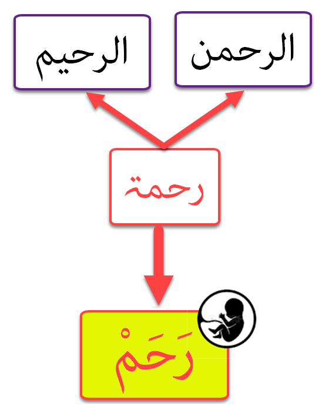

The word رحمۃ actually comes from the word رَحَم. The word رَحَم in Arabic means the womb of a mother when she is carrying a child. The رَحَم is the place where the baby lives inside the mother for 9 months before the it is born in this world. Now why do you think Allah chose a word for mercy that derives from the womb of a mother? Because the womb of a mother, describes the relationship between Allah and his creation. This is what makes it so beautiful.

Now isn't it true that both parents love their children? They do! But you know what's interesting? In the Quran, whenever Allah compares his love for his creation, he never uses the example of a father. Never! He **always** uses the example of a mother. Therefore in order to truly understand the meaning of the word رحمۃ; In order to truly understand the kind of relationship Allah has with us, we must first understand the relationship of a mother with her child, when she is carrying it in her womb.

There is this famous HADEES in which Allah is actually speaking directly to the womb. And obviously, here the womb means the archetypal womb! Because the womb of the mother is how all of humanity exists in this world. We all came as a result of the womb of our mothers. And so Allah spoke to the womb and he said:

اِنِّی سَمَّیتُکَ بِاسْمی

I named you from my names.

I am الرحمن and I am الرحیم and therefore I am deriving the name for my unconditional love, my constant care, my genuine care and my infinite mercy - I am naming my رحمۃ based on your womb - your رَحَم . I am making you a symbol of my رحمۃ and my unconditional love, because every single human being that will exist through time, will come through you! And you will remind them of my love for them. Your رحم is the very first thing they will experience before this come in world - and my رحمۃ is what they will experience once they are born in this world until the day they return to me. That is the conversation the رحمن had with the womb - the رَحَم. SubhanAllah!

Now what is it about the womb of a mother that is important for us to understand. Well! There are a few things. The very first question that I want to ask you, is that when a child is inside the womb of its mother - is it being punished? Is there any association with the concept of punishment for the baby when its inside the womb of its mother? No! Absolutely not! What's the relationship of the mother with the baby? It is of pure love, right? What is that a reminder for? It's a reminder of the very kind of relationship Allah with His creation. It is based on pure love. It has nothing to do with punishment. The moment a woman finds out she's pregnant, she falls in love with the baby. She hasn't even seen the baby yet, has she? She hasn't even met the baby yet - but she still falls completely and unconditionally in love with her baby.

Now did the womb exist even before the mother conceived? Or does the body just create the womb when she gets pregnant and then discards it later? The womb exists within every woman - baby or no baby - the womb is always there, yes? Similarly Allah's رحمۃ - his unconditional love, care concern and mercy is always there! His رحمۃ does not exist because we exist; or because humanity exists; or because creation exists! No - his رحمۃ is always there; and will always remain even when we no longer exist; even when all of humanity no longer exists; even when this universe no longer exists - just as the womb exists even after the child is born. You understand?

Now... When the child is inside the womb of its mother, does the child even know that it is being taken care of? Does it even know that the mother exists? It doesn't! It is being taken care of in ways that it cannot even imagine! Forget realizations and appreciations, the fetus in the womb of its mother cannot even imagine what role the womb is playing in its life to maintain his existence. Similarly Allah is taking care of us in ways that we cannot even possibly imagine or realize. He is taking care of us in such a subtle manner - that forget his رحمۃ even his presence is not visible to us. He is taking care of us in such a subtle manner. That's why one of his name is لطیف. The word لطیفmeans something that is extremely subtle. It's there - and it is constantly working for you, but you don't even feel it's presence. That's لطیف. But what's amazing is that in the Quran every time the attribute لطیف is mentioned, what other attribute do you hear with it? خبیر. The All knowing.

لَّا تُدْرِكُهُ ٱلْأَبْصَرُ وَهُوَ يُدْرِكُ ٱلْأَبْصَرَ ۖ وَهُوَ ٱللَّطِيفُ ٱلْخَبِيرُ

Your eyes cannot see him. but he is aware of what your eyes are seeing. He is extremely subtle, but ALL KNOWING at the same time. SubhanAllah! So the child doesn't even know that the mother is taking care of it.

The next thing that comes to mind when you think of the womb, is protection. The mother is constantly protecting the baby. She watches the corners of the table when she walks. She tries to stay safe. She sleeps on her side. She watches what she eats. She's constantly caressing the baby. She loves the baby; she cares for the baby; and this is why she is extremely protective of it.

That is exactly what Allah is doing for us - constantly! You kids don't just make it to school like that. Can you even imagine how many things can go wrong? In just the time you leave the house and enter your school? There are millions of things can go wrong. But Allah is protecting us; and keeping us safe. Every single day people walk out of their homes and not everyone returns that night! Do these people who die in car crashes or accidents know that they're not going to return home tonight? When their time comes - that's it. But until their time comes - what is constantly protecting them from accidents and other kinds of harm? Allah's رحمۃ. So just as the womb is constantly protecting its creation; Allah is constantly protecting his own creation. That's what the womb of a mother is reminding us.

Then, this mother puts up with a lot of difficulties for her baby. Doesn't she? She deals with constant morning sickness. Some has to take these horribly painful tests. Some have to take extremely nauseating medicines for the health and growth of the baby. They have to get blood work done constantly - it's one painful thing after another. A mother goes through so much pain for the sake of what? Her child! Which again, BTW, the child is completely unaware of. The child takes the mother completely for granted - just as we take the رحمۃ of Allah سُبْحَانَهُ وَتَعَالَى for granted.
And BTW - this child is technically doing nothing for the mother; and yet the mother is doing everything for the child. The baby eats her food, right? The poor woman eats; but within minutes the damn baby takes everything - and she's like seriously?? Stop it!!. She just ate this huge meal and minutes later she's hungry again. And then the poor husband has to run in the middle of the night for ice cream. The baby is taking everything from her and its not giving anything back to its mother. In fact. when the baby does thank her, how does it thank the mother? By kicking her from the inside right?. It just decides to stretch from time to time. It decides to do the the insanity workout whenever it feels like it; decides to bench press with her ribs, right? And the mother silently and happily endures it. It's incredible! The mother is in a constant state of discomfort because of this baby; and yet she is happily enduring it!
We are doing absolutely nothing for Allah. But Allah is still doing everything for us. We do nothing for Allah! We can do nothing for Allah even if we wanted. We cannot add anything to his kingdom. We cannot take away anything from his kingdom. Our good deeds do not add to his kingdom. Our sins do not reduce anything from his kingdom. We cannot make him any wealthier than he is. We cannot make him any poorer than he is. We cannot praise him any more than he is already praised. We cannot do anything for him. Just appreciate this fact for a moment - There is ABSOLUTELY NOTHING that we can offer Allah; and yet, he is constantly doing things for us - without us even realizing his presence. And in many cases even without acknowledging his presence.

كُلَّ يَوْمٍ هُوَ فِى شَأْنٍۢ

Every moment he is busy in work. to keep this universe and EVERYTHING within this universe functional . SubhanAllah!!

Then the womb reminds us that that all the needs of the child are being met by its mother. The child is completely surrounded. It is completely enveloped by the love and the care of its mother. His food, his drinks even when the child excretes - all of that is taken care by the body of the mother. Everything the child needs is completely provided for. The rent is paid. Housing and lodging is free. It does not have to pay for any of the utilities. All meals are included. In other words, the baby is completely wrapped up in the love and care of its mother. Yes?
Similarly we are completely wrapped up in the unconditional love, care, concern and mercy of Allah سُبْحَانَهُ وَتَعَالَى. He provides us with our sustenance. He gives us the luxuries of a good life. He's making the outside world functional for us. He's keeping the inside world functional for us. My heart is beating, my organs are working, my breadth is coming in and out. I can walk. I can speak. He's making all this happen for me. He gave me parents. He gave me teachers. He gave me knowledge. He gave me a family. He surrounded me with all the comforts of my life.
You know how we complain about paying the bills; about mortgage; about utility expense. Just think for a second - how much do we pay for our sight? How much do we pay Allah for our ability to hear? our ability to speak.; our ability to breadth? Forget everything else! How much are we paying for each and every breadth we take? How much would you pay for your breadth? If you couldn't breathe and Allah asked you to pay for the next breadth? What amount would you be willing to pay him for the next breadth? How much would you pay for your hands? What would they be worth to you? We are going through a life that is immensely blessed with his uncountable bounties. We are immensely blessed with the riches and provisions he created for with - ALL of which we take completely for granted! And he is OK with that. He still continues to serve us.

So far we've talked about the benefits of the child. Now let's talk about the motivation for this mother? . The baby is not paying the mother. The baby is not giving anything back to the mother. So then what is the motivation of this mother to carry on? Despite all the discomfort this child is putting her through, what could possibly be motivating this mother to carry on?

The only motivation the mother has for the baby is an extreme form of unconditional love. Just think about this. As the child grows in the womb of its mother, it becomes more and more of a problem for the mother, yes or no? From a physical standpoint. As time passes and the embryo grows in size, it becomes more and more of a problem for its mother. But what happens to her love? She falls more and more in love with her baby. She is constantly increasing in her love. This is incredible! And then when the baby comes out, we know that it almost kills her. If 9 months of torture wasn't enough! This baby causes this incredibly intense pain of child birth. I've been in the delivery room twice - so I have seen what that pain is like. Nazneen was in labor for 8 hours at the time of Erum. I'm sure there are mothers in this group that have gone through much worse. But personally, I've never seen anyone go through so much pain. And yet when Erum finally came out - I remember the doctor tried to hand her to me. She was covered up in all that GUI stuff - and I went EWOOO. What is this?! Can you please clean this thing first?

But I remember when she brought Erum to Nazneen, with this incredible love, she touched her cheeks and said - Hi baby! And then she passed out. That was such an insane moment in my life. I still don't get it. I probably never will. I thought she'd hate this baby who caused her SO much pain! I thought she'd yell at her! Scream at her! Curse her out. You almost killed me! I hate you! But that's not what happened! Instead the first time they brought Erum to her, she gave her a big hug and kissed her! I had never seen anyone in this much pain and this happy at the same time! SubhanAllah!
Anybody else who causes SO much pain to you. Anyone who makes you bleed this way - you would **not** give them a hug! We made our mothers bleed! Almost to death. and as soon as we come out of her womb, she showered us with her love! Her love actually increased for us! She fell in love with us more than she ever did before - and this is seconds after we tried to kill her.

What kind of a relationship is this? This is a completely illogical relationship. This is not a relationship you and I can make any sense of. It is beyond all logic. Because this does not happen with any other relationship. There is no other relationship in your life that works this way. Where you never give. Where you NEVER EVER give. You ONLY take - and still - all you get in return is more love. You keep demanding more and she keeps giving more!

And BTW, your mother bled so much to give you life! She just went through childbirth or surgery to give you life, and what happens right after you're born? She now has to feed you! And feeding as we know, can also be a very painful thing. Anyone else in this world who goes through surgery or such intense pain says: I need 6 weeks off. I need 2 months off. I need a break. I need a vacation. Does a mother get a 2 month break after she gives birth? NO! You break a leg, you get 6 months off! She just almost died giving birth and she's on the clock - right away! The moment her baby is born, the mother is working full time! What does the baby give her back in return? She gives it milk; she gives it love; she gives it care; she is constantly concerned about it; she constantly protects it; she bathes it, oils it, changes diapers like every 5 minutes. And she does all of this through countless sleepless nights; months after months; year after year. What does the baby do in return? Does it say thank you? Does it show gratitude? Does it sing praises for the mother? NO! But does the mother still keep loving and caring her baby over and over and over again? She does! The only reward the baby offers is by urinating on her, or pooping on her; throwing up on her. And even when the baby does that, what does the mother do? Toss it out the window? No! She actually finds that cute! *Aww so cute, and then she cleans it up. Oh it's OK my little baby. Don't worry here I'll change you - all better now!* Isn't this an INCREDIBLY BEAUTIFUL relationship? But at the same time, isn't this also an EXTREMELY insane relationship?

But this is what Allah is doing for us. This is what Allah is doing for us on a much larger scale - and that too doesn't make sense? Allah's love for us, simply doesn't make sense. It is beyond all logical reasoning. We just cannot limit Allah's love to common sense. Because we don't deserve this kind of love from him. That is what common sense dictates. If we honestly judge our actions; if we look at our ingratitude towards Allah - there is absolutely no reason for Allah to continue taking care of us. We don't even take out the time to remember him 5 times in a day - that's just 2 hours! That's all it takes. We'll watch a 3 hour Indian movie! We'll watch a 5 hour soccer match! We'll watch an all day cricket match - rewind and play it over and over again. We have time for all of those trivial activities - but not 2 hours for our creator. Not even half an hour - 30 minutes - to just do the فرائض. We don't even do that much - just to say thank you. We constantly disobey him after **everything** he does for us. We do everything he tells us **not** to do. Some don't even acknowledge his existence. Who knows if there is an Allah or not; and who cares if there is. And yet, he keeps giving us; he keeps feeding us; he keeps providing for us; he keeps forgiving us. It's truly incredible! Despite my constant ingratitude, and my constant disloyalty, and my constant defiance to his every command, I am still waking up every morning! I am still breathing oxygen. I am still going about my day - eating and drinking the delicious foods he provides for me. I'm still enjoying life going to parties. He takes none of that away from me. This doesn't make sense. It JUST doesn't make sense.

Just look at what we do with food. How much food do we waste? His greatest blessings for mankind - the very means of sustenance. Look how we disrespect food?Have you studied the etiquette of eating. The prophet ﷺ said: Sit before your food like a slave sits before his master. Cover your head before you eat to out of respect. Do not place your plate on the floor - elevate it from the ground in order to honor it. When you're done eating, find and eat the crumbs and grains that are left behind. That's the kind of respect and honor we should have for food in our lives. Why? One because without it, we cannot even imagine what our lives would be reduced to! And second, just think about the amount of effort it took behind the scenes to get that food on our plate? Can you appreciate the time, the effort, the protection, the management, the planning that went into taking a seed and growing it into a plant! From taking an animal, nurturing it, feeding it, protecting it, till it reached the proper age. Then getting it into the hands of the one who does ذبیحۃ in order to make it halal for us. Then to get it to the supermarket and the meat shop so that you end up buying it. Then providing you with the the tools to cook it until it finally makes it to your plate. That's years and years of Allah's labor that sits before us in our plate. But do we care? Nope! We take a few bites and we toss it away. Why? Wasn't warm enough. Wasn't fresh enough! Not enough salt.
Kids! Imagine you've worked on a school project for months and months - only for it to get tossed out in the end! How would that feel? The next time you're asked to do a project, tell me how you would respond? You will never go through that effort again!

Why do you think Rasul Allah ﷺ placed these etiquette in شریعۃ? So that they constantly serve as a reminder to us - because we are انسان - we are forgetful creatures who constantly need to be reminded! Reminded of what? Allah's mercy - his رحمۃ. All of شریعۃ is just a reminder of that. Because as soon as any decent human being is presented and reminded of the love, care, concern and mercy of another person, he naturally responds with praise and gratitude. That is - if one is a decent human being.

But unfortunately, we are ungrateful people. We continuously disrespect and disregard Allah's efforts, but he constantly keeps providing for us - giving us food, clothes, shelter - one better than the next. Just like the mother keeps feeding her baby regardless of what it does. Does the baby care about the months and months of intense effort that went into growing it from a drop of liquid, into a fully developed child? And then from a child to an adult? No! But does the mother stop loving the child? Ever? No! Because this is insane love! There is absolutely no rhyme or reason for Allah to love us this way. But he does! He still does. Why? Because he has رحمۃ for us. Because that is the kind of relationship he has with us - of unconditional love, constant care, genuine concern and constant mercy. What happens to the womb as the baby grows in size? It expands! It expands to accommodate the baby. Allah's love, his mercy, his forgiveness, his compassion constantly grows to accommodate us. That is the love of our creator for us!

اِنِّی سَمَّیتُکَ بِاسْمی

Oh Womb! I have named you from my names. I have named you رَحَم to remind you that I am الرحمن and الرحیم. I have made you a symbol of my love, so that every human being recognizes my unconditional love for them - through you and by your example. Just as we will never be able to understand the love of a mother for her child, we can never understand or appreciate the love and care of Allah for his creation. But in order to get some understanding of this relationship, he gave us mothers. So if you want to taste one drop of that endless ocean of love that Allah has for his creation, who do you think of? Your mother

## Manifestations of REHMA

In the last couple of sessions we learnt about the رحمۃ of Allah سُبْحَانَهُ وَتَعَالَى. I hope I was able to provide a clear understanding of what the word رحمۃ means, and what it represents. To reiterate, the word رحمۃ is a combination of unconditional love, constant care, genuine concern and unlimited mercy and compassion. The two frequently used derivatives of رحمۃ are الرحمن and الرحیم. The attribute الرحمن highlights the intensity, the urgency, the promptness, but the interim or temporary quality of his رحمۃ; whereas the attribute الرحیم highlights the long-term and permanent qualities of his رحمۃ. We then studied the root word for رحمۃ itself, which comes from رحم and literally means the womb of a mother. We saw some magnificent examples that the womb provides, in order to depict and demonstrate the رحمۃ of Allah سُبْحَانَهُ وَتَعَالَى.

We know how the womb takes a shapeless drop of liquid and by its رحمۃ, transform it into a living child, and we drew the analogy that it is the رحمۃ of Allah سُبْحَانَهُ وَتَعَالَى that shapes and transforms our spiritual existence. His رحمۃ takes human beings in their raw and ignorant form; a form that has no real goal, no real purpose outsides of the confines of this دنیا, and transforms them into these incredible personalities - that we do not even mention their names without adding رَحْمَۃُ اللہِ عَلَیْہِ with it. This is why Rasul Allah ﷺ is called رَحْمَۃً لِی الْعَالَمِینَ - he is called رحمۃ for this world, because he took on the role of a mothers womb in shaping and nurturing the spiritual existence of humanity. Not just for the people of his time, but for all of humanity till the end of time!

We looked at how the mother suffers in order to provide comfort to her child. How she protects it, nurtures it, feeds it, goes through various hardships, pain and suffering in order to transform that shapeless mass into that living breathing child. From that we drew the parallel that Allah سُبْحَانَهُ وَتَعَالَى through his various intermediaries - his Imams, his prophets, his messengers - he shapes our spiritual existence. And just like the pregnant mother, historically we see that these people suffered various hardships to deliver the message of Allah to their nations.

### Forgiveness

But one of the most amazing qualities of the womb (the رحم) is that it expands to accommodate the needs of the fetus. That is such a beautiful reminder of the fact that Allah's رحمۃ expands to fulfill not only the needs of his creation, but also to forgive their shortcomings, sins and transgressions. His immense forgiveness is one of the manifestations of his infinite compassion towards his creation. Because Allah knows that we are people of extremely weak characters. We are people who are enslaved by our worldly desires. But he also knows that we are all trying our best in our efforts to move towards him - whether it is centimeter by centimeter, or inch by inch - in whatever ways we can. So he compensates for that weakness and strengthens our shortcomings through his forgiveness.

There is a verse in the Quran in which Allah says:

39:53

> ‏ قُلْ يَعِبَادِىَ ٱلَّذِينَ أَسْرَفُوا۟ عَلَىٰٓ أَنفُسِهِمْ لَا تَقْنَطُوا۟ مِن رَّحْمَةِ ٱللَّهِ ۚ إِنَّ ٱللَّهَ يَغْفِرُ ٱلذُّنُوبَ جَمِيعًا ۚ إِنَّهُۥ هُوَ ٱلْغَفُورُ ٱلرَّحِيمُ ‎۵۳
>
> Say, "O My servants who have transgressed against themselves [by sinning], do not despair of the mercy of Allah . Indeed, Allah forgives all sins. Indeed, it is He who is the Forgiving, the Merciful."

He says:

قُلْ يَعِبَادِىَ ٱلَّذِينَ أَسْرَفُوا۟ عَلَىٰٓ أَنفُسِهِمْ

O My slaves who have transgressed against themselves by their sins. Which slaves is he talking about? The disbelievers? The polytheists? The idol worshipers? No! Us! He's talking to us Muslims; us believers! يَعِبَادِىَ. Linguistically, this form of calling someone implies an extreme closeness, extreme love, extreme intimacy. If it was a casual call, it would have been یَا أَیُّھَا الْعِبَادُ - which would mean "Oh slaves", but there would be no intimacy or love in that statement. But يَعِبَادِىَ on the other hand represents an extreme closeness - Oh **my beloved **slaves! Oh **my revered **slaves! Oh **my cherished **slave! You understand the difference? What types of slaves? Faithful slaves? Trustworthy slaves? Obedient Slaves? No!

ٱلَّذِينَ أَسْرَفُوا۟ عَلَىٰٓ أَنفُسِهِمْ

The ones who have crossed all limits and boundaries of transgressions against themselves. The ones who have caused severe harm to their souls by living a life of sin; by living a life of hopelessness; by living a life of disobedience to Allah; by living a lifestyle that is harmful and detrimental to their spiritual progression. These are the type of slaves he is addressing. But there is something so beautiful that the scholars point out about this verse - which is the use of this word يَعِبَادِىَ that precedes this statement. Allah still calls them **my **slave. Allah is still saying that no matter who you are, and no matter what you do, you are still my slaves. There is absolutely no abandonment on the part of Allah سُبْحَانَهُ وَتَعَالَى. Just as womb does not abandon its fetus if it is deformed, Allah constantly maintains that relationship of رحمۃ with us, even though we may be the worst of the worst! We may be the most sinful people on the face of this earth who are constantly walking on very thin ice - but Allah still maintains that relationship and that connection through the use of the word يَعِبَادِىَ My Slaves! SubhanAllah!! AllahuAkbar!
ٱلَّذِينَ أَسْرَفُوا۟ عَلَىٰٓ أَنفُسِهِمْ
 the ones who have done severe harm to their souls and to themselves.

Now Allah proceeds to give them some advice:
لَا تَقْنَطُوا۟ مِن رَّحْمَةِ ٱللَّهِ
Never! Ever! lose hope in the mercy of Allah! Not even the slightest bit. I won't go into the technical details here, but the use of word لا indicates unconditional absoluteness! Without the shred of a doubt. Like we have لَا اِلَہَ اِلَّا اللَّہُ - that also begins with لا - because it has that absolute finality in that statement - that there is absolutely no god except Allah, you understand? So Allah is saying, that under no circumstances, with completely certainty, I'm making it حرام - I am making it impermissible; I am forbidding you to lose hope in my mercy! Ever! Why? Allah never just tells us something and then not give us a reason to believe it. So why should we not lose hope in the mercy of Allah?

إِنَّ ٱللَّهَ يَغْفِرُ ٱلذُّنُوبَ جَمِيعًا
Because Allah is capable of forgiving all your sins and transgressions. How is that possible? I have spent an entire lifetime in his disobedience! How is it possible for him to forgive so many sins?
إِنَّهُۥ هُوَ ٱلْغَفُورُ ٱلرَّحِيمُ
Because Indeed! Without the shred of a doubt, he and only he, most definitely he is الغفور. - the constantly forgiving. The word غفور follows the same linguistic pattern as رحیم. He is not just forgiving; he is constantly forgiving, and constantly merciful. Nothing is beyond his capacity, and there is nothing that is out of his reach, Allah can, and will forgive all your sins. This word غفور is so amazing - it really gets to the essence of his concept of forgiveness.

### 3 words for forgiveness

In the Quran, when Allah talks about his ability to forgive, he uses three different attributes for himself in terms of forgiving- and they all from the same root which is غَفَرَ. The word غَفَرَ literally means - to cover something up. The word for helmet in Arabic is مِغفَر. When you put on a helmet, can you see the head? No! So مغفرۃ means to forgive - or to cover up the sins such that it is completely out of sight. As if it never existed.

GHAFARA

So Allah calls himself غَافِرِ الذَّنْبِ in the Quran

> ‏تَنزِيلُ ٱلْكِتَبِ مِنَ ٱللَّهِ ٱلْعَزِيزِ ٱلْعَلِيمِ ‎۲‏غَافِرِ ٱلذَّنۢبِ وَقَابِلِ ٱلتَّوْبِ شَدِيدِ ٱلْعِقَابِ ذِى ٱلطَّوْلِۖ لَآ إِلَهَ إِلَّا هُوَۖ إِلَيْهِ ٱلْمَصِيرُ ‎۳
>
> ( 2 ) The revelation of the Book is from Allah the All-Mighty, the All-Knower. ( 3 ) The forgiver of sin, acceptor of repentance, severe in punishment, owner of abundance. There is no deity except Him; to Him is the destination.

Linguistically the word غافر means the one who immediately forgives. Someone who does not hesitate in forgiving; who does not have to think about it before he forgives. That's غافر.

Then he calls himself غفَّار

> ‏فَقُلْتُ ٱسْتَغْفِرُوا۟ رَبَّكُمْ إِنَّهُۥ كَانَ غَفَّارًۭا ‎۱۰
>
> And said, 'Ask forgiveness of your Lord. Indeed, He is ever a Perpetual Forgiver.

So غفَّار is the one who forgives abundantly. The one who has no limitations in terms of forgiveness. The one who can continue to forgive regardless of how much sin exists. You know how we say, I can forgive everything, but I cannot forgive betrayal, or I cannot forgive lies, or I cannot forgive rudeness. We all have certain things that we consider unforgivable. But Allah غفَّار, as in he has no limitations in what he can and cannot forgive. He can forgive everything if one truly repents.

The third variation is غفور - which, as I said, is on the same phonetic pattern of رحیم and means constantly or permanently forgiving, - and this the form that is used in the verse we are talking about

39:53

إِنَّهُۥ هُوَ ٱلْغَفُورُ ٱلرَّحِيمُ

And Indeed he is constantly forgiving and constantly merciful.

So unflinching loyalty; provision of infinite hope; a never ending permanent relationship; an intense, immediate and abundant forgiveness are some the essential manifestations of his رحمۃ.

### Rewards

Then another manifestation of that expansion of his رحمۃ (like the expansion of the womb) manifests in the form of his infinite rewards for trivial acts. You know how we have these holy nights in which Allah offers a ridiculous amount of reward. (Thum Vasheq - 20 Hajj). Today I want to share with you a perspective of why Allah offers such rewards. Hopefully you'll get a real appreciation for the intention behind these rewards.

The holy month of Ramadan is round the corner. It is the سنۃ of Rasul Allah ﷺ to do اعتکاف in this month. It is the act of retiring oneself to the مسجد for a period of time, exclusively for the remembrance of Allah سُبْحَانَهُ وَتَعَالَى in silence. In India Pakistan, people spend at least 3 days and nights in اعتکاف, in which they pray, they recite Quran, they do تسبیح, they reflect on their lives - etc, and Allah loves that! Rasul Allah ﷺ stated the reward of اعتکاف in a HADEES. He said:

مَنِ اعْتَكَفَ يَوْماً ابْتِغَاءَ وَجْهِ اللهِ بَاعَدَ اللهُ بَيْنَهُ وَبَيْنَ النَّارِ ثَلَاثَةَ خَنَادِقَ كُلُّ خَنْدَقٍ كَمَا بَيْنَ الْخَافِقَيْنِ

Whoever stays in the state of اعتکاف for one day - just one day, Allah سُبْحَانَهُ وَتَعَالَى will distance him from hell-fire by 3 trenches - each trench will be of the distance between the east and west - SubhanAllah! That's for spending one day in the مسجد in the state of ذکر. This reward illustrates how beloved this act of اعتکاف is to Allah سُبْحَانَهُ وَتَعَالَى.

So one day, during the month of Ramadan, اِبْنُ عَبَّاسٍ رَضِیَ اللَّہُ تَعَالَیٰ عَنْہُ the cousin of the prophet, enters a مسجد with the intention of spending a day in اعتکاف; in order to earn that immense reward that Allah has promised. Soon after he begins his اعتکاف, he sees a Muslim brother in the مسجد looking very sad. So he goes up to this man and inquires about his sadness. The man says, o cousin of the prophet ﷺ, I owe a financial debt to someone that I need to pay, but I am not able to pay it because I don't have any money. And the weight of that debt, that obligation is crushing my soul. ابن عباس says to his man: Would you like me to go to your lender and talk to him on your behalf? Maybe I can convince him to forgive your debt, or reduce it, or extend the timeline. Would you like me to do that? The man replies, of course یَا ابْنَ عَبَّاسٍ, I'd be delighted if you did that! So ابن عباس immediately gets up, walks outside the مسجد and begins putting on his slippers. Suddenly this man remembers, OMG ابن عباس was here for his اعتکاف. Now he's breaking his اعتکاف for me. What have I done! He came to the مسجد for an act of worship and I became the reason for him to break his اعتکاف. That's the last thing I wanted! He rushes towards him, and says, یَا ابْنَ عَبَّاسٍ don't you realize what you've done? Don't you remember what you were here for? You've broken your اعتکاف!

So ابن عباس looks at this man and the HADEES narrates that tears begin to roll down from his eyes. He says: I remember my prophet ﷺ telling me, that if one of you was to strive for the need of his Muslim brother, Allah سُبْحَانَهُ وَتَعَالَى rewards him with the blessings of 10 years of اعتکاف. SubhanAllah! Not one day! Not one month! Not one year! 10 years ofاعتکاف! What did I just tell you? What was the reward for one single day of اعتکاف? A distancing from the hellfire by 3 trenches - each trench of the distance between the east and west. That's the reward for 1 day of اعتکاف. Are we able to do that? Can we do a week ofاعتکاف? When was the last time we did a week of ofاعتکاف? We can't! One day is challenging enough! And what's the reward for striving for the needs of a Muslim brother? 10 years ofاعتکاف! SubhanAllah!

Now after hearing this HADEES what do we naturally think? OMG I should never miss an opportunity to help anyone, right? This is such a great opportunity to gain the closeness of Allah! And that is true! Sometimes the fastest way to Allah's blessings is creation itself! Other people! Doing good to them. So generally when people hear this HADEES, they rush to help others. They keep their ears open for any opportunity to be able to help someone and that is an extremely beautiful thing! But I want to point out something much higher and much deeper in this HADEES. I want to switch your perspective, and focus it on the intention of Allah سُبْحَانَهُ وَتَعَالَى's رحمۃ. This HADEES is actually amazing! I'll give you an example to explain why.

Let's say I walk into a room and I see that someone in that room is very sad. Let's say its my niece Mariam. I find out that for some reason Mariam is looking very sad today. So I say, I'll give 10 million dollars to anyone who makes her smile. What do you think is going to happen? 10 million bucks!! Everyone in the room is going to try to make her smile. Everyone is going to flock around her, throwing their best jokes at her to make her smile, right?

Now most people will look at that gesture and say, Oh you're so rich! You must have loads of money that you're willing to give 10 million dollars just to make her smile. But then there are a few who will get to the essence of that gesture and say, You must love her so much! You must love her so much that her one smile is worth 10 million dollars to you! She must mean the world to you! You see the difference? The reality is that I love her so much that I'm willing to pay 10 million dollars to the one who makes her smile!

So when Allah says, I'll give the reward of 10 years ofاعتکاف to the one who fulfills Asif's need - even though the general understanding of that HADEES becomes a

motivation to do it for that reward - what most people fail to see is that how much Allah loves me!! Ya Allah! You love me so much that you'd give that much reward to anyone who fulfills my needs and removes my constriction for me? SubhanAllah! You see that?

So another way to interpret this HADEES is - Oh you who is feeling low! Oh you who is feeling depressed! Oh you who is feeling burdened and constricted because of your troubles, it is you I am looking at! It is you that I'm opening doors for! Because I want to see you happy! And for your happiness I will reward anyone with this amount of ثواب if they strive to bring you ease! This is the رحمۃ he has for us! AllahuAkbar!

This transforms my perspective entirely when I see another person in need! I see that this is the person Allah loves! So much, that he's willing to reward me with such such generosity, such immense blessings to help **him **out - so then how beloved would I become in his eyes for helping him out! If someone did something really nice for a person that you love, how do you feel about that person? He comes closer to your heart doesn't it? So after understanding this perspective, that closeness towards Allah سُبْحَانَهُ وَتَعَالَى is what motivates me to help another person, and not so much the reward itself.

So I hope you really begin to appreciate the reason for these immense rewards for the most simple acts. It is the love he has for us that he's willing to shower us with his blessings for the most trivial acts of kindness. He'll give us the reward of 10, 20 Hajj for a couple of hours of worship. You can do it for the reward, or you can do it in appreciation of that divine love.

### Responding in afflictions

I'll give you another example. There is a HADEES in which Rasul Allah ﷺ tells us that when you visit a sick person, ask him to pray for you and your forgiveness. Now if think about it, that sounds completely backwards, doesn't it? I mean shouldn't you be the one praying for the sick person? That may Allah grant him health! He is the one who seems to be in need of my prayers, but the HADEES says - ask him to pray for you and your forgiveness. What is that? Let me make this more relatable by giving you an example.

Imagine my daughter falls very ill (God Forbid). May Allah protect our children from trials. But just as an example, to help you understand this concept better, let's say my daughter falls very sick, and she is admitted into the ER, The doctors come and tell me that she is in a lot of pain. She's not being able to breathe properly. As a father, I can't even imagine what state I would be in if that ever happened. There is nothing more painful for a parent than to see your own child suffer - whether it is physical, mental or spiritual. So the doctor tells me that she cannot breadth and needs to be put on a ventilator. How would I react to that? Is there any other place in this world that I would want to be at that moment? Of course not! I would not leave my daughters side even for a second, right? I'd sit right next to her because I love her so much. I'll be constantly by her bedside - praying for her.

Finally Allah answers my prayers. She wakes up. She says, Babu! I want ice cream. What do you think I'll do? You want ice cream? Of course! What flavor do you want? If I can't find it there, I'll drive wherever I have to get her that ice cream, right? Isn't that what I'd do? Can you imagine how close I would feel to her at that point? What else do you want sweetheart? Is there anything else I can do for you? Is there anything else I can get for you?

It so happened that right before she fell sick we had a huge fight . She disobeyed me and was very rude to me. I was very angry with her when this whole thing happened. Now she wakes up and remembers what she did. She says, Babu I'm sorry for what I did and said. Please forgive me! What do you think I'd say? Forgive you? Sweetheart! There's nothing to forgive! I'm not at all upset with you anymore! Don't even think about it! Right? Isn't this what we would do as parents? Is there anything unnatural in what I just said?

Now if this is how much we love our children, can you even imagine how Allah must love his creation? According to a HADEES, Allah holds the love of 70 mothers for every single one of his creation. If in this kind of an affliction I feel so close to my daughter, when a creation of Allah سُبْحَانَهُ وَتَعَالَى is going through his trials and afflictions, can you imagine how close Allah would be to him at that moment?
Look how ready I was to respond to anything that my daughter would have asked for in that moment. I am extremely limited by my capabilities! But when a human being, a creation of Allah سُبْحَانَهُ وَتَعَالَى - when he is in pain, and he asks for something - whether it is for himself or for somebody else - do you think Allah would refuse him in that moment?

When we are in a state of an affliction, in that moment, Allah is closest to us - more than any other human being, In that moment when we turn to Allah for forgiveness with true repentance, there is nothing that he would not forgive! No matter what sin he or she may have committed! No matter how horribly that person might have behaved, Allah would forgive that person instantly. I do not hesitate for a second in forgiving my child, can you even imagine the mercy of Allah - the one who identifies himself with love! Who holds the love of 70 mothers in his heart for his creation, do you think he would refuse to forgive?

If I was mad at my son, and my daughter after waking up says to me, Babu! Please forgive my brother - do you think I would refuse? Oh my God, You are in such a difficult state; you are in so much pain; you are suffering so much right now; and even in this state you are concerned about your brother? You want me to forgive him?! Your request will surely be granted!!! Of course I forgive him! I'll give you anything you want right now. All you have to do is ask! SubhanAllah

So can you appreciate the beauty of that HADEES now? As I'm going through my affliction, when I raise my hands and ask Allah سُبْحَانَهُ وَتَعَالَى to fulfill the needs of another person, or if I ask for my forgiveness; or if I ask for someone else's forgiveness, there is no way Allah turn down my request. Because I am extremely close to Allah in my moment of trial. He is right by my bedside, holding my hand. That is how his رحمۃ manifests! This is why trials become the perfect opportunity for us to ask Allah for our needs. Trials could become one of the best experiences one can have - an experience of the awareness, and the closeness to the love of Allah سُبْحَانَهُ وَتَعَالَى.

If Allah is so loving why does he afflict people in the first place?

‏وَمَآ أَصَبَكُم مِّن مُّصِيبَةٍۢ فَبِمَا كَسَبَتْ أَيْدِيكُمْ وَيَعْفُوا۟ عَن كَثِيرٍۢ ‎

## Linguistic Meaning Of Rabb

Today InshaAllah we are going to look at the linguistic meaning of the word رب. But before we do that, I want to show you something very cool from the جمال- the beauty of Quran. This is related to the symmetrical beauty that I explained in the Miracles of Quran sessions. I want to share with you the Quranic symmetry in the use of the words Allah and RAB.

### Symmetry of Allah and RAB

> ‏بِسْمِ ٱللَّهِ ٱلرَّحْمَنِ ٱلرَّحِيمِ ‎۱‏ٱلْحَمْدُ لِلَّهِرَبِّ ٱلْعَلَمِينَ ‎۲‏ٱلرَّحْمَنِ ٱلرَّحِيمِ ‎۳‏مَلِكِ يَوْمِ ٱلدِّينِ ‎۴‏إِيَّاكَ نَعْبُدُ وَإِيَّاكَ نَسْتَعِينُ ‎۵‏ٱهْدِنَا ٱلصِّرَطَ ٱلْمُسْتَقِيمَ ‎۶‏صِرَطَ ٱلَّذِينَ أَنْعَمْتَ عَلَيْهِمْ غَيْرِ ٱلْمَغْضُوبِ عَلَيْهِمْ وَلَا ٱلضَّآلِّينَ ‎۷
>
> ( 1 ) In the Name of Allah, the Most Beneficent, the Most Merciful. ( 2 ) All the praises and thanks be to Allah, the Lordof the *'Alamîn *. ( 3 ) The Most Beneficent, the Most Merciful. ( 4 ) The Only Owner of the Day of Recompense ( 5 ) You we worship, and You we ask for help. ( 6 ) Guide us to the Straight Way ( 7 ) The Way of those on whom You have bestowed Your Grace, not of those who earned Your Anger, nor of those who went astray. ,,

In the very first Surah of the Quran, which is سُورَۃُ الْفَاتِحَۃِ, we see that Allah is mentioned twice, and then RAB is mentioned once after that. The فاتحۃ begins with بِسْمِ اللَّہِ الرَّحْمَنِ الرَّحِیمِ. So Allah is mentioned in the first verse; and then we have اَلْحَمْدُ لِلَّہِ; again the mention of Allah, followed by رب العلمین. So the name Allah is mentioned twice before the word RAB is mentioned once, right? And you can see that after that, in the remaining verses neither Allah nor RAB is mentioned again. This is what we find in the beginning of Quran.

Now if we move to the end of the Quran, to سُورَۃُ النَّاسِ and if we work our way backwards what do we see?

> ‏قُلْ أَعُوذُ بِرَبِّ ٱلنَّاسِ ‎۱
>
> Say: "I seek refuge with the Lord of mankind,

What's mentioned in سُورَۃُ النَّاسِ? Allah or RAB? RAB is mentioned قُلْ أَعُوذُ بِرَبِّ ٱلنَّاسِ.

> ‏قُلْ أَعُوذُ بِرَبِّ ٱلْفَلَقِ ‎۱
>
> Say: "I seek refuge with the Lord of the daybreak,

And if you go to the سورۃ before that which is سُورَۃُ الْفَلَقِ, what is mentioned?. Allah or RAB? قُلْ أَعُوذُ بِرَبِّ ٱلْفَلَقِ; RAB is mentioned again.

> ‏قُلْ هُوَ ٱللَّهُ أَحَدٌ ‎۱
>
> Say :"He is Allah, the unique!

Now if you go the سورۃ before that, which is سُورَۃُ الْاِخْلَاصِ what is mentioned? Allah or RAB? قُلْ ھُوَ اللَّہُ اَحَدٌ - Allah is mentioned. SubhanAllah!

In the beginning- سُورَۃُ الْفَاتِحَۃِ, Allah is mentioned twice, followed by the mention of RAB. If you look at it from the end, RAB is mentioned twice, followed by the mention of Allah. SubhanAllah! And also in the last two Surahs, we see the word RAB used, but there is no mention of the name Allah! And in سُورَۃُ اِخْلَاصِ, we see only the name Allah mentioned, and there is no mention of the RAB. Perfect Symmetry between one surah in the beginning and multiple surahs at the end! Not bad for impromptu spoken text, huh?

### Meaning of RAB

The root for the word رب is actually رَبَبٌ. What the Arabs do is that they combine the 2 با and put a شدۃ on top of the با and make it ربّ. Now if you look any English translation of the word رب you'll find it generally translated as lord. I don't really understand what the word lord means. The only lord I know of is the Lord of the Rings. So lord is not a good translation for the word رب in the eyes of the Arab linguists, because it does not reveal the true meaning and power of this word.

RABB

So let's understand this word رب from a linguistic perspective. The word رب is a composite word, just like the word الہ that we studied in the previous session. We learnt that the word الہ is not exclusive to Allah. It can be used for many other entities in our lives, right? Similarly, the word رب is also not exclusive to Allah. It has several linguistic implications. The word is used for Allah, but it can also be used for people, such as parents. teachers, guardians. So the first thing to understand is that رب is not specific to Allah. In Classical Arabic the word **رب **can be used for Allah, as well as human beings and other things.

Image

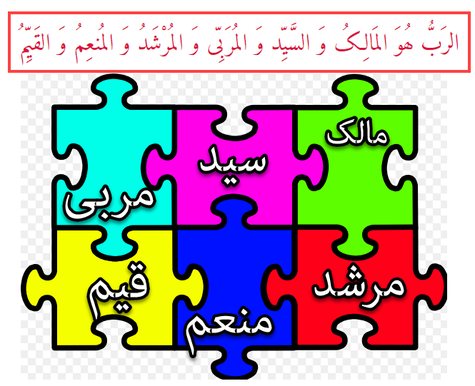

The classical definition of the word رب is:

الرَبُّ ھُوَ المَالِکُ وَ السَّیِّد وَ المُرَبِّی وَ المُرْشَدُ وَ المُنعِمُ وَ القَیِّمُ

A true رب is someone who is 6 things. Or I can say, Allah as رب is 6 things. He is مالک; He is سید; He is مربی; He is مرشد; He is منعم and he is قیم. And he is all these 6 things at the same time! You understand? The meaning of the word RAB is a combination of all these 6 meanings. Now let's look at each of these meanings individually.

### al-MALIK - Owner

MALIK

The first meaning is مالک, which means owner. Someone who has ownership of something or someone is called رب. And the thing that he owns is called مِلک; not the English milk that cows produce. In Arabic, مِلک or ملکیۃ means property ; and the owner of that property is called مالک.
Now do we own things in life? Do we own a phone? an iPad? a computer? Cars? Houses? Yes. So that makes us مالک; and because "owner" is one of the definitions of the word رب , by virtue of that ownership, it makes us a رب as well.

Do teachers have some ownership over their students? Sure! Do parents have ownership over their young children? Sure! Despite how kids might feel - that *It's MY life mom! You can't tell me what to do. You don't own me!* Despite these sentiments that kids have today; and to be fair; the sentiments we had as kids growing up; the truth is that parents have an ownership of their children until they become adults. But do parents have **ultimate** and **absolute** ownership? NO. Because even though parents gave birth to their children, they did not create them. Allah created them! Allah created the child and the parent - Therefore ultimate and absolute ownership belongs only to Allah. So even though parents and teachers are رب in a sense of the word, Allah is the absolute owner and the absolute رب of his creation. He is مالک. And if he is مالک what does that make us? That makes us his property. That makes us his مِلکِیَّۃ.

### SAYYED - AUTHORITY

SAYYED

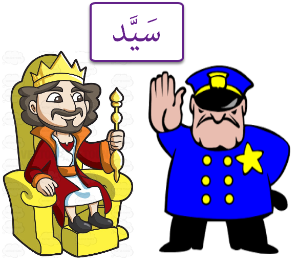

The second meaning of the word RAB can be visualized by the word سید which complements the previous meaning of مالک. The word مالک means owner; whereas سید means someone who has authority. سید is the one who is in-charge. You understand the difference? مالک is someone who has ownership. سید is the one who has authority.

Is it possible to own something, and not have complete authority over it? Sure! it's possible. For example I own a car; but do I still have to get it registered? Do I still have to get it inspected every year? Do I have to drive within the speed limits? Do I **have **to drive it on the road? Can I just drive it on the side walk if I felt like it? No! Unless I'm in Pakistan. So even though I own my car, I do not necessarily have complete authority of it. You understand?

And the reverse of this holds true as well. I may have complete authority over something. I may be able to do whatever I want with it; but I may not have complete ownership of it. Like for example the computer in my office. I can do whatever I want with the software that is installed on it. I can install new stuff on it if I want. I can uninstall stuff I don't like. Nobody is going to stop me or question me about it. But do I **own** that Computer? NO? My company owns it. Right? You understand the difference?

I can own things but not have complete authority over it. Or I can have complete authority over something but not necessarily have ownership of it!

But Allah as رب, he has ABSOLUTE ownership; **and **He has ABSOLUTE authority. He has both at the same time. He can do whatever he wants; whenever he wants with his property. If he wants to burn it he can burn it. If he wants to tear it apart, he can tear it apart. If he wants to drown it, toss it, discard it. He can do so at his will. You and I, do not get to question him about it. Why? Because HE has complete ownership **and **HE has complete authority over us and everything else in the universe. And even if we do complain and cry about it - Guess what? He does not have to care. It makes not difference to him.

When parents ground their children; if I take my daughters phone away, she can cry and complain as much as she wants. She's not getting it back. Because I am her مالک and in that context she and her phone are my ملکیۃ. And if our crying and grumbling doesn't get us anywhere with our parents, who are limited in their capacities as رب , it surely won't matter with the one who is the ABSOLUTE and ULTIMATE رب. We are creation. He is our creator.

What we constantly seem to forget, is that he is not the one on trial! We are! We've got it completely backwards. Today mankind has put Allah in the stands and taken the seat of the judge; and we shamelessly question his every move. If you are so powerful then why don't you eliminate evil from this world? If you are so loving and merciful then how could you do this to me? I prayed to you! Why did I not get the job or the promotion?! Right? I'm a good person! I honestly paid my taxes! I paid my زکواۃ ; I brush my teeth twice everyday! Why did you do this to me?! You see? We've got it completely backwards. The reality is, that he is the judge! He is the مالک. He is the سید. We are his property and his subjects. He has every right to question us! We have absolutely no right to question him!

And this is why, what I find amazing about Allah is that he actually allowed us understand the wisdom of his design through the Quran and his messengers. I feel that is an incredible act of mercy and generosity on his part. Because he is not obligated to do anything for us. He is not there to serve us! But he does it anyway. Because that is what a true رب does.

### MURABBEE - The One Who Nourishes

The third meaning of the word is مُرَبَّی. Now this is a very powerful word. مُرَبَّی means someone who ensures growth. Someone who takes care of something; who nurtures something so that it can grow. In other words, a مُرَبَّی is someone who is responsible for the growth and development of the one placed under his care. Now is it possible for us to own something, have authority over it, but not take good care of it? Sure! Backyards in some houses is a good example! People own cars but never get them serviced. We own our bodies but we abuse it. We have ownership and authority over it, but rarely do people take good care of their bodies. Right? So it is possible to have ownership and authority over something, but that does not necessarily mean that we will also take good care of it. A رب is someone who not only owns; who not only has complete authority over what he owns; but he also takes complete care of it. He ensures its proper growth. He nurtures it. And this process of taking care of his property and nurturing it is called تربیۃ. And this is a phenomenon we find everywhere in the world.

TARBIYAH

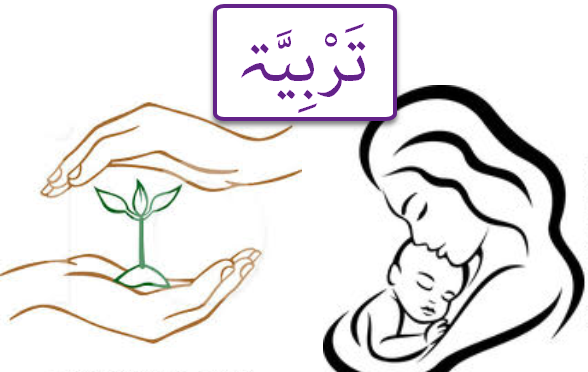

The poet says:

مِن دُرَّۃٍ بَیضَآءَ صَافِیَۃً || مِمَّا تَرَبَّبَ حَائِرَ البَحرٍ

The depth of the ocean nurtures the white clear pearl. He calls the ocean a رب because it helps develops the pearl within its shell. A tree is also called a رب because it nurtures the fruit it bears. So there are all these different kinds of تربیۃ that we find in the world. The concept of تربیۃ is all about setting limits. Setting boundaries. That's what تربیۃ is. The تربیۃ of a plant would be to take care of it. Watering it at the right time. Make sure it gets enough sunlight; protecting it from too much sunlight. Protecting it from insects and bugs. In other words, تربیۃ is a bunch of dos and don'ts, until the plant matures into a tree and starts bearing fruit. You understand? If you just leave the plant to grow by itself that's not تربیۃ because you aren't setting boundaries.
Similarly تربیۃ of children is taking care of their physical needs; their diets, their clothing, their mental needs; educating them; protecting them. Basically monitoring their progress from birth, until they mature into a healthy sound, decent human being. From a physical point of view; from a psychological point of view; and from a social point of view. This is تَرْبِیَۃُ الْاَوْلَادِ.

Now is تربیۃ a quick and easy process? Or is it a very long, very time consuming process? It's very hard work, isn't it? In fact, it is the most difficult process there is. It's a never ending, thankless, full time job. And this is why, when we recite التحیات in every prayer, we say اَللّٰھُمَّ مَغْفَرٌلِی - Oh Allah forgive me و لوالدی and my parents. وَالرَّحْمُھُمَا کَمَا رَبَّیَانِی صَغِیرَۃً and have **mercy **on them just as they had **mercy **on me during the period of my تربیۃ when I was young. In this statement we find the primary ingredient of ربوبیۃ - Mercy! (رحمۃ) . The primary component of ربوبیۃ is mercy. If there is no mercy then there can be no ربوبیۃ. What is mercy? It is a combination of love, care and concern. That's what ربوبیۃ is made of.

Have you seen people who shower all this TLC on plants? They'll actually spray each individual leaf with water and then clean them gently with a soft cloth? That kind of love; and that kind of care; with that level of gentleness is the image of ربوبیۃ. It is not harshness. It is not beating. It is not psychological, emotional and physical abuse. It is not guilt tripping into submission. It is love. It is patience. It is kindness. That is the Islamic way of ربوبیۃ. Contrary to what we see in movies and society today, the Islamic way of ربوبیۃ has always been رحمۃ. And the proof of that is in the life of Rasul Allah ﷺ.

Our prophet ﷺ took the most viscous people; he took the most barbaric people and without a single slap; without a single taunt; without a single sarcastic remark; without a single insult; he turned them all into رَضِیَ اللَّہُ عَنْہُ. The greatest title possible for a human being رَضِیَ اللَّہُ عَنْہُ. We don't mention the name of these صحابۃ without say رَضِیَ اللَّہُ عَنْہُ. And our prophet did that! How? With love, gentleness, kindness, forgiveness, patience; with his أخلاق. That's ربوبیۃ. And what did he ask us in return? After devoting 23 years of his life to our تربیۃ , in his last sermon after حِجَّۃُ الْوَدَاعِ he said...

یا أُمَّتَی لا تُسَوِّدَ وَجْھِی یوم القیامۃ

My people! Do not embarrass me before Allah on the day of judgment! When a result does not meet exceptions; if majority of the students fail in class, doesn't the principal question the teacher? What's going on? Why are there so many failures in your class? And our prophet ﷺ, after 23 years of service and تربیۃ asked us for one thing in return... یا أُمَّتَی لا تُسَوِّدَ وَجْھِی یوم القیامۃ. Do not embarrass me before Allah on the day of judgment. May Allah make us among those who make our prophet proud!

### MURSHAD

MURSHAD

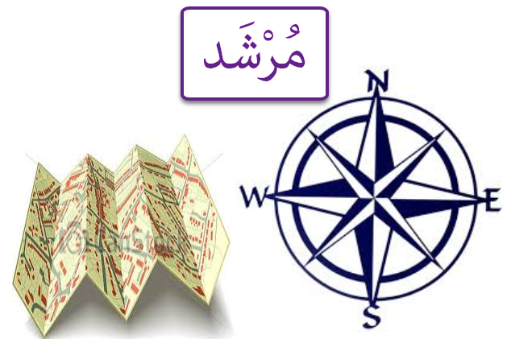

The fourth meaning of the word رب is مُرشَد. He is the one who sets things in the right direction. The one who sets on the right path; puts to proper use. That's مُرشَد. The word مُرشَد comes from the word رُشد which in classical Arabic means **to ripen**; which is the final stage for a fruit. That's why رُشد also means rationality, or reason, or maturity - because those are the final stages of intellect.

So مُرشَد is the one who takes something in its raw form, and works on it till it ripens; till it matures; and then he puts it to its proper use. He sets it in the right direction. So let's say if you have a teacher who trains you in computer sciences; and then also finds you a job - so that you can now apply what you've learnt; that would be a مُرشَد. A مُرشَدis not someone who just trains you to maturity and then leaves you to rot. He actually puts you on the path; guides you forward from your point of maturity; provides you with the opportunity to practice what you've learnt so that you, and others can benefit from what you've learnt - that's a مُرشَد.

So what we're learning is that Allah as رب is not only someone who own us; who has complete authority over us; who nurtures us with love and care; but he is also the one to creates opportunities for us so that we can put our training to use. He trains us by putting people in our paths that will help us grow and develop. He'll find the perfect friend for us; who will help us grow and mature!And then he will also guide us in putting our training to use, by becoming good friends **ourselves** to other people. That is مُرشَد. Even parents and teachers cannot do that sometimes. They will complete the تربیۃ of their children, but then they cannot always put them to proper use. Kids have to find their own path. But Allah as رب goes the extra mile, and sets us on the right path **after** our training has been completed. SubhanAllah!!

### MUN'IM

MUNIM

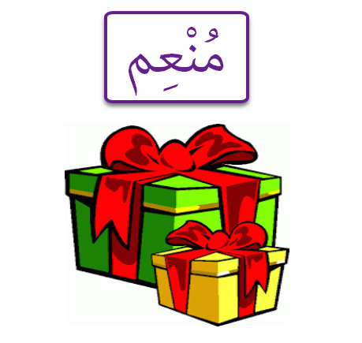

The next meaning of the word رب comes from the word مُنعِم. The word مُنعِم is used for the one who bestows gifts. The one who gives blessings. It comes from the root نِعَم or نعمۃ which means gifts or blessings. We don't have slavery today. But imagine for a second that if we owned a slave. Now it is one thing to own a slave; and it is an entirely different thing to take care of the slave; nurture the slave; put him to proper use; and then on top of everything, also bestow gifts upon the slave. And the word نعمۃ suggests gifts and benefits that are on top of what he deserves. Remember! Gifts are not deserved things. Gifts by definition are always beyond what is deserved. It is an expression of the love and mercy of the benefactor. If you deserved it, then that's salary, or pay or earning - that's not a gift. You understand? Interestingly the Arabic word نَعَم which means YES, also comes from the same root word as blessing! Why? Because what's the natural human response to receiving blessings? Its نَعَم. Yes! Sure! Isn't that interesting! This is what I love about this language. Every word is so perfectly connected and related to its root.

So now imagine that you own a slave, or an animal - let's say a goat. You own a goat, and so you take care of it. But you don't buy it gifts. You don't buy it jewelry, right? Why? Because you don't need to. it's a goat!!!! Its part of the property. So in the old days, slaves were no different than a goat or an animal. They were barely taken care of, let alone given gifts. Who is Allah? He is مالک and سید - he is our absolute owner with complete authority over us - which makes us his ملکیۃ- his property! But Allah as رب ; is an owner, who not only takes good care of his property; who not only has complete authority and control over it; who not only ensures its growth to maturity; who not only looks after it, protects it, sustains it, puts it on the right path; but then, on top of all of that, he also gives it numerous undeserved generous gifts.

Think about that for a second... Allah as our master does not owe us anything. Therefore anything and everything he gives us, has to be a gift. It is not something he is obligated to give us at all. I didn't do anything to deserve my eyes. I did not pay for my hand. How much would you charge if I asked you to sell both your eyes to me? Forget both eyes. How much would you sell me one eye for? How much will you sell your hands for? How much is your ability to walk worth to you? We just can't put a price on it. These are priceless gifts. So Allah gave us all these precious gifts - but he says he will question us about these gifts on the day of judgment.

ثُمَّ لَتُسْـَٔلُنَّ يَوْمَئِذٍ عَنِ ٱلنَّعِيمِ

On that day you will be asked about the greatest of all gifts - which is ایمان. The word نعیم is the superlative form of نعم and it means the greatest gift of all. What is that gift? It is that gift, for which all these other gifts had been given to us! ایمان!! THAT is the ULTIMATE gift - ایمان. On the day of judgment he will ask us about our ایمان. The greatest blessing of all! Otherwise what was the purpose of giving us these gifts and making us different from animals? So that we could see the creations, reflect upon them, recognize him and try to get closer to Him.

So now we understand that Allah as رب is someone who not only owns us; who not only has ultimate authority over us; who not only trains us, nurtures us with love kindness and patience until we reach maturity; who not only puts us on his chosen path; but he then also showers us with tons and tons of undeserved gifts.

### QAYYIM

QAYYIM

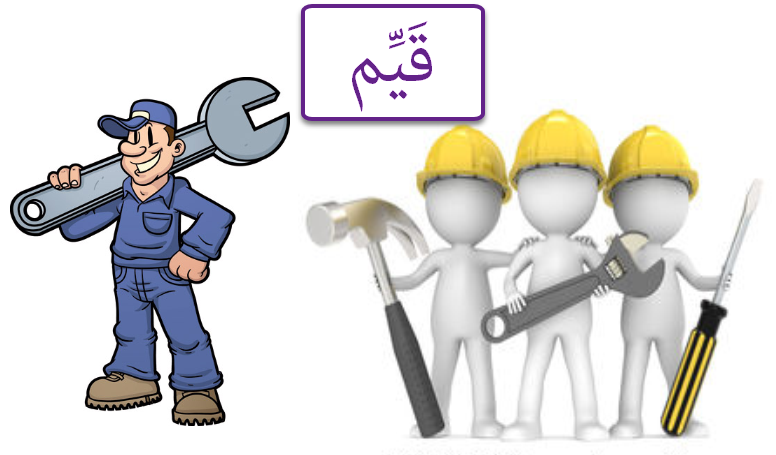

The final meaning of the word رب comes from قَیِّم who is the one that makes sure that things stay together; that they don't fall apart. The one who has his constant attention and focus on things. Because when you're not constantly focused on something important, what happens? You drop the ball! Yes? Things fall apart. People who enjoy gardening know that some plants are extremely delicate. If you don't take care of them for even one day, they die. Some keep fish as pets. If you forget to feed them even for a single day, what happens? Belly up! Then you have NEMO KABAAB for dinner that night! Ladies! If you leave you house for one day - what happens?

So قَیِّم is the sustainer; the maintainer; the one who has constant focus and attention on things. That meaning is also embedded in the word رب. That's why Allah says in the Quran:

اللَّہُ لَا اِلَٰہَ ھُوَ الْحَیُّ الْقَیُّومُ

Allah is the only الہ - who is الحی the giver of life and القیوم the one who then also maintains that life by his constant attention on things. The word قیوم is the superlative form of قَیِّم. The one who constantly sustains; who constantly maintains without taking any breaks.

In other words, I am not alive because I take care of myself. One breadth to the next is not because I eat healthy and exercise, and follow a good diet; or because I live in a healthy environment. That is not why I am alive. I am alive because Allah allows me to be alive. Because he sustains me; not because of my efforts, you understand? There are plenty of ways I can cease to exist in a second. Just crossing the road. One little earthquake! One snow blizzard.

That Indian actress Sri Devi just died. Perfectly healthy woman! Drowned in a bathtub. She probably had lots of plans for the next day just as I do. I'm sure she had lots of short term goals. long term goals. ALL GONE in a second. We exist. because the قَیِّم allows us to exist. We are COMPLETELY and CONSTANTLY dependent on Allah.

Another thing in this ayah, we see two attributes of Allah are mentioned. الحی and القیوم. The one who gives life, and the constant maintainer. Now why are these two attributes used together? Because the one who gives life also knows how to sustain it! he knows how long to sustain it; what stages and steps to take it through. How and when to end it. What happens after it ends. The entire plan of action for each individual creation - not just human beings - but for all of creation is already and completely planned out by the قیوم. That's part of the meaning of قَیِّم - to have a plan! You can't start something or maintain something without a plan, Can you?When you decide to start a business. you don't just choose what business you're going to do by playing rock paper scissors! You have to have an entire business plan right? What your initial investment is going to be. How will you keep afloat! How will you grow the business. Cost and expense analysis! Budget allocations! You plan the whole 9. And you do all of this BEFORE you actually even begin the business. You think Allah just created us without a plan? That's not possible right?

### RAB

So now let's look at the complete definition of the word Rabb.

الرب ھو المالک والسَّیِّد و المُرَبِّی والمُرشِد وَالمُنعِم والقَیِّم

RAB

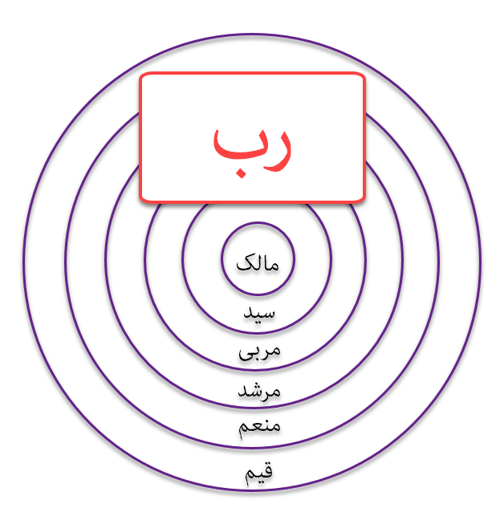

رب is someone who is مالک who has ABSOLUTE ownership. At the same time he is سید. He has COMPLETE and UNCONDITIONAL authority. At the same time he is مربی. He ensures growth, takes care of us, nurtures and protects. with love, care, concern and mercy. At the same time He is مرشد who brings us to physical and spiritual maturity and then sets us on his straight path; puts us to proper use. At the same time he is منعم who showers us with undeserved and innumerable gifts and blessings. And at the same time is قیم who sustains us for the extent of our duration.

Allah as our رب is the sum of all these meanings; and all at the same time. He is not one of these things at different times of our lives. He is all of these things ; and he is all of these things at the same time. His ownership includes his authority. which includes his nurturing, which includes his guidance and direction, which includes his blessings, which includes his sustenance, provisions and maintenance; all at the same time. SubhanAllah.

Now I want to tie this understanding of رب to an earlier session. In one of the earlier sessions I talked about this man of pure essence - someone from the اُولُو الْاَلْبَابِ - who is deeply reflecting on the creations of the heavens and the earth; and the conflict between night and day.

> ‏إِنَّ فِى خَلْقِ ٱلسَّمَوَتِ وَٱلْأَرْضِ وَٱخْتِلَفِ ٱلَّيْلِ وَٱلنَّهَارِ لَآيَتٍۢ لِّأُو۟لِى ٱلْأَلْبَبِ ‎۱۹۰‏ٱلَّذِينَ يَذْكُرُونَ ٱللَّهَ قِيَمًۭا وَقُعُودًۭا وَعَلَىٰ جُنُوبِهِمْ وَيَتَفَكَّرُونَ فِى خَلْقِ ٱلسَّمَوَتِ وَٱلْأَرْضِ ‎۱۹۱

Then he says...

رَبَّنَا مَا خَلَقْتَ هَذَا بَطِلًۭا سُبْحَنَكَ فَقِنَا عَذَابَ ٱلنَّارِ

After recognizing that there has to be a creator for the heavens and the earth and for himself, the word he uses for that creator is Rabb. You see? Because when he reflected on the creations of the heavens and earth, this is what he saw. He saw an absolute owner, who also has complete authority, who is nurturing and developing his creation with love, and care and mercy. Who is setting everything to its purpose. Who is showering every creation with numerous gifts and blessings; And who is sustaining, maintaining and providing for them continuously through time. This is why he said.

رَبَّنَا مَا خَلَقْتَ هَذَا بَطِلًۭا

Our رب, you did not create all of this without a purpose. And this was an extremely beautiful and appropriate conclusion, because Allah validated that conclusion in his revelation. What is the very first ayah that was revealed to Rasul Allah ﷺ?

ٱقْرَأْ بِٱسْمِ رَبِّكَ ٱلَّذِى خَلَقَ

Recite with the name of your رب who created you. Not ٱقْرَأْ بِٱسْمِ اللہِ ٱلَّذِى خَلَقَ‎. In this verse, Allah is introducing himself to his Messenger for the very first time. Isn't that true? And when you introduce yourself, how do you do that? Do you use you name or do you use your attribute? If I met you for the very first time, and I said: السَّلَامُ عَلَیْکُمْ I am a teacher; or السَّلَامُ عَلَیْکُمْ I can do 200 push-ups. What would you think? You'll be like: وَعَلَیْکُمُ السَّلَامُ, You're also a weirdo! right? Because that's not normal. When you introduce yourself, you always use your name. So I would imagine, Allah should have said ٱقْرَأْ بِٱسْمِ اللہِ ٱلَّذِى خَلَقَ. Read with the name of Allah who created you? Right? But he says. Read in the name of your رب who created you. Allah chose to introduce himself as رب . What does this tell you?

When I introduce myself as a teacher, what am I telling you? How am I characterizing myself? I'm characterizing myself as a teacher. In other words, I saying that my being a teacher is way more important to me than all my other attributes? including my name! Even though Allah is glorious beyond comprehension. he is magnificent beyond comprehension; he is powerful beyond comprehension; what he's saying to Rasul Allah ﷺ; and to us by extension, is that when I interact with you, the **most** important relationship that's going to exist between us - is RAB. That's how I want you to think of me. not as جلیل; not as عظیم; not as قوی; not as کبیر ; not as متکبر - but as what? As رب .

Now I want us all to take a moment to let this really sink in. When a king introduces himself does he introduce himself in a humble way? Does he say. I'm your neighbor! I'm your dad's friend! I'm your caretaker. No!! He says I AM YOUR KING. KNEEL. BOW DOWN BEFORE ME! Right? If Allah chose to do that in the Quran, would it befit him? Would that have been OK to do? ABSOLUTELY! But what word does he choose to use instead? رب ! Can you imagine how important this word must be to him; and after understanding the meanings of this word, can you appreciate the kind of loving relationship he wishes to have with his creation?

This is very important from a thematic point of view. Because if you look at the sequence of revelation in the very first verse he says:

ٱقْرَأْ بِٱسْمِ رَبِّكَ ٱلَّذِى خَلَقَ

But the very last revealed verse says to the messenger ﷺ.

ٱلْيَوْمَ أَكْمَلْتُ لَكُمْ دِينَكُمْ وَأَتْمَمْتُ عَلَيْكُمْ نِعْمَتِى وَرَضِيتُ لَكُمُ ٱلْإِسْلَمَ دِينًۭا

On this day I have perfected your religion for you, and I have completed my blessings on you, and I have selected Islam as the way of life for you.

فَمَنِ ٱضْطُرَّ فِى مَخْمَصَةٍ غَيْرَ مُتَجَانِفٍۢ لِّإِثْمٍ

Now here is the final part of the ayah.

فَإِنَّ ٱللَّهَ غَفُورٌۭ رَّحِيمٌۭ

Have no doubt about it, **Allah** is All forgiving and All merciful. He begins the revelation with the word رب and ends it with his name Allah. Which exactly matches the pattern of بِسْمِ اللَّہِ الرَّحْمَنِ الرَّحِیمِ. In that statement you have the name Allah, followed by his two attributes of mercy - الرَّحْمَنِ الرَّحِیمِ. And how does he end revelation? With غَفُورٌۭ رَّحِيمٌۭ the constantly forgiving and the constantly loving. He begins with his intense and constant love and mercy; and he ends with his constant forgiveness and constant mercy. SubhanAllah!

## Master Slave Relationship

### What is RAB?

In the previous session we looked at the linguistic meaning of the word رب. We learnt that a رب is a combination of 6 attributes:

المالک والسَّیِّد و المُرَبِّی والمُرشَد وَالمُنعِم والقَیِّم

A رب is someone who is مالک who has ABSOLUTE ownership; and at the same time he is سید, meaning he has complete authority over us. Then within that space of complete ownership and unrestricted authority, he is مربی; he is the one who ensures growth. He takes care of his creation, nurtures them, protects them. He is مرشد, which means he not only nurtures his creation until maturity, he also sets them to purpose. He sets each creation on the path of its destiny and supports them through it. In doing so, he is also منعم; He showers his creation with numerous, undeserved gifts and blessings. Finally he is قیم; the one who sustains and maintains them for the extent of their duration. So all these meanings come together to define the word رب. We also learnt that the primary ingredient in Allah's recipe of ربوبیۃ is the ingredient of love. All 6 meanings are grounded in that one fundamental emotion of رحمۃ - of intense and constant love and care, right?

الرَّحْمَٰنُ عَلَّمَ الْقُرْآنَ

The loving, The intensely merciful taught the Quran. Not اَلْجَبَّارُ عَلَّمَ اَلْقُرْآنَ. So رحمۃ is the most essential element of Allah's ربوبیۃ. And this is why we saw that when this person of sound essence reflected on the creations of the heaves and the earth, the word he used to call out to his creator, was رب.

رَبَّنَا مَا خَلَقْتَ هَذَا بَطِلًۭا

رَبَّنَآ إِنَّكَ مَن تُدْخِلِ ٱلنَّارَ فَقَدْ أَخْزَيْتَهُۥ

رَّبَّنَآ إِنَّنَا سَمِعْنَا مُنَادِيًۭا يُنَادِى لِلْإِيمَنِ أَنْ آمِنُوا۟ بِرَبِّكُمْ فَـَٔامَنَّا

He used the word رب, because he saw all of creation reflecting the various attributes of his creators ربوبیۃ.

Let's say you meet a very skilled electrician. You see this guy working, and just by observing his knowledge and skill, you conclude that he went to a good electrical engineering school; or he had a very skilled teacher who taught him this electrical work. Right? You haven't actually seen the teacher, nor do you know the name of his school he went to; but you are still able to conclude that just by observing his work. Why? Because this electrician **is **his teachers creation! And by his skill and knowledge, he is manifesting the attributes and the training of his teacher. Right?

That is exactly what all creation is doing. It is constantly manifesting the ربوبیۃ of its creator. This principle holds true at microcosmic level, and it certainly holds true at the macrocosmic level - that this universe, being a creation, is constantly reflecting the attributes of its creator.

‏تُسَبِّحُ لَهُ ٱلسَّمَوَتُ ٱلسَّبْعُ وَٱلْأَرْضُ وَمَن فِيهِنَّ ۚ وَإِن مِّن شَىْءٍ إِلَّا يُسَبِّحُ بِحَمْدِهِۦ وَلَكِن لَّا تَفْقَهُونَ تَسْبِيحَهُمْ

The seven heavens and the earth and all that exists within are constantly glorifying Him; and there is not a thing that does not sing His Praise. But you do not understand their glorification.

In other words, the signs and آیات of who Allah is, has been placed in the very fabric of his design. The more we reflect on creation, the more we will be able to appreciate the beauty of his design.

In the last session I said that رب is commonly translated as "Lord" in English. But linguists agree that a more suitable one word replacement for رب is actually master. Because a master not only represents ownership, authority and control over something or someone; it also represents perfection of knowledge and skill; which is essential for nurturing, guidance and maintenance, right? So **master** is much closer in meaning to the word رب than lord.

### Relationship

Now once we understand the meaning of the word رب, the next thing to understand is that the word رب implies a relationship. There are certain words that inherently imply relationships. They need a counter part. For example when I say teacher; who does a teacher have a relationship with? With students! It automatically implies that relationship to exist. I can't be a teacher if I don't have any students to teach, right? When I say parent, what relationship is implied? Children! When I say employer, it implies a relationship with? Employees! There are certain titles that necessitate the existence of a relationship. But when I say "Intelligent" it doesn't necessarily have a personal relationship with anyone, right? It's generic! When I say "tall", it's a generic attribute, not a personal relationship with someone.

In the same way Allah has certain names that do **not **imply a personal relationship. For example. Allah is الأعلی. He is lofty! It's a powerful attribute; but it's a generic state in relation to creation. It does not imply a personal relationship. But then he also has certain names, which **do** establish a relationship. For example, خالق the creator. If he is a creator, there has to be what? مخلوق. There has to be creation. You cannot be a creator if you have no creation. You can be powerful by yourself! You can be الأعلی on your own, but not خالق, you understand? غفور is another one. Allah is extremely forgiving, which means there has to someone **to** forgive. Yes? So there are some attributes of Allah that are generic in nature, and there are others that imply a very personal relationship.

Therefore when Allah begins his revelation with the word رب; when he says اِقْرَأْ بِسْمِ رَبِّکَ الَّذِی خَلَقَ. When he introduces himself as رب to Rasul Allah ﷺ, and by extension - to us, in doing so, what he's essentially saying, is that when you think of me, I want you to put all my other attributes aside, and think of me first and foremost as your رب. The one relationship that you should never let go of, **even if you** forget all the other relationships I have with you; that one relationship that you should **always** be mindful of; every single waking moment of your life; is that "I" am your رب. My ربوبیۃ will take precedence in all my dealings and interactions with you - and the primary ingredient of my ربوبیۃ is رحمۃ - love, care and concern.

But then if you look at this statement, he did not just رب - he said ربک - "your" رب. Isn't all the master of all creation? Isn't he مالک and سید - one who has absolute ownership and complete authority over everything? So he could have just said: اِقْرَأْ بِسْمِ رَبِّ الَّذِی خَلَقَ. Read in the name of the master who created. No! He makes it very personal - اِقْرَأْ بِسْمِ رَبِّکَ الَّذِی خَلَقَ- Read in the name of **your **master who created you. As if he's saying I'm **only **your master and nobody else's. He makes his relationship that intimate with each and everyone of us. SubhanAllah!

Now does the relationship of رب require a counterpart? It does! So if Allah is رب! If Allah is master! then what does that make me? And what does that make you? What completes the relationship with a master? A Slave!! Right? If Allah is master, that makes us all his slaves; and the Arabic word for slave is عبد So when we accept Allah as our رب, just by virtue us accepting that relationship, we are also accepting the fact that we are his slaves.

Which is OK if you think about it! Because we have already established that he is مالک He owns us. We do accept that Allah has complete authority over us because he is سید. We know we are in submission to his training and nurturing because he is مربی. We know that we need his guidance in the fulfillment of our destiny because he is مرشد. We know that we constantly enjoy the countless, undeserved gifts that he has bestowed upon us because he is منعم. And we know that he is our ultimate sustainer and provider. We understand that we exist because he allows us to exist - because he is قیم. Therefore it's not the most unimaginable thing to accept this notion that we are slaves to this gracious master. And the simple truth is, whether we accept it or not, it doesn't really matter - we are his property and slaves anyway. My children can tell me: We don't accept you as our father! Well tough luck! Because guess what?! I'm still your father - you understand?

So I just want to set the stage by making sure everyone understand that we are slaves of this master whether we like it or not; and whether we want it or not. That's just what the relationship is!

### Slave - ABD

Having said that, today I want to show you how beautiful this relationship is with our master. Because unless and until we appreciate the beauty of this relationship with him, we will not be able to reap the benefits of his ربوبیۃ. This is really important to understand, because that is how relationships work.

A teacher cannot benefit a student, until the student acknowledges and accept him as his teacher! A student will only benefit from the teacher when he accepts that relationship and submits to it.

A doctor cannot help a patient until what? Until the patient accepts and submits to the prescribed treatment of the doctor. If a patient has diabetes and the doctor is asking him to stop eating candy; but every time he sees candy, he says, Oh I know the doctor asked me not to eat it, but what does he know anyway. It's only a little bit. It's not like I'm eating the whole bag; He's never going to find out anyway. Besides everyone else is eating candy why can't I have it! If the patient does that, he's not truly accepting the doctor-patient relationship, is he? Doesn't matter if he addresses him as Dr. So-and-so. It doesn't matter how many visits and appointments he keeps with that doctor, He is simply not going to benefit. Why? Because despite what he's saying, he is not really accepting himself as a patient. Only after he completely accepts that relationship, and submits to the doctors treatment - only then will he be able to gain the benefits that the doctor wants him to have. Its a two way street. And what's interesting, is that doctor is completely helpless in this relationship - despite his vast knowledge and skill. The doctor **has **the knowledge to benefit the patient. The doctor truly **cares **about the patient; he **wants** to benefit the patient; but despite all his knowledge, will and desire to help and benefit the patient, he is helpless - he cannot do anything - because the patient has not yet completed the relationship. You see?

I'm not really talking about doctors and patients, Am I? We all claim that Allah is our رب. We all know about his infinite رحمۃ. We all know he wants the best for us. We all know the treatment he has prescribed for our souls. We all know the do's and don'ts! We even pray and fulfill our religious obligations - but then in our daily lives, we do everything that goes against his prescribed treatment. So then how is our رب supposed to help and benefit us? Isn't that interesting? Despite the infinite powers of our رب , we render him helpless by not completing the relationship.

So if I truly want to gain the benefits that my رب has to offer, what do I need to do?

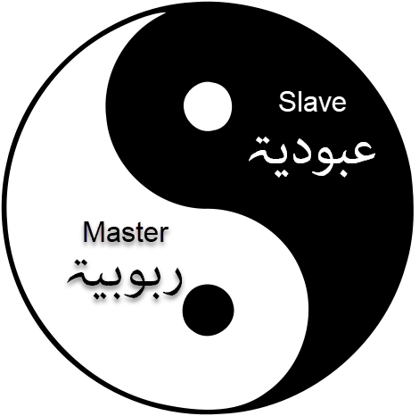

I have to complete the relationship. How do I complete the relationship? By submitting myself as his عبد. That is how I can complete my relationship with him. You understand? His relationship with me is that of ربوبیۃ. I complete that relationship, with my عبودیۃ and my عبادۃ - My submission, my servitude and my worship.

### Worship - IBADAH

Now let's understand these words عبادۃ and عبودیۃ properly. The word عبادۃ is generally translated as worship - which is an action; and عبودیۃ is the sentiment that makes me want to worship. You understand the difference? عبادۃ are the various forms of worship, عبودیۃ is the feeling of servitude that acts as the driving force behind my various acts of worship.

IBADAH

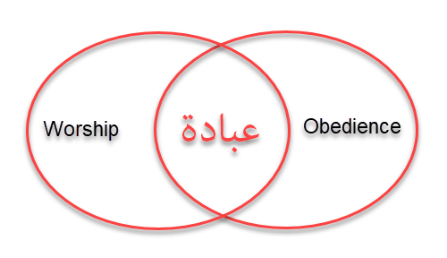

Now what's interesting is that linguistically the word عبادۃ means two things. It means عُبُودِیَّۃُ وَ الطَّاعَۃُ it means worship **and **it also means obedience - both at the same time. Let's break it down. What is worship? When we think of the word worship, what generally comes to mind? 5 prayers, fasting. ZAKAT etc. right? Those are all different forms of worship. And we think that's it! We stop at those activities. That's the problem with this translation of the word عبادۃ meaning just worship. It does not necessarily include the concept of obedience .

The word عبادۃ includes obedience. And it's the kind of obedience that comes out of love - not force! Because the word obedience can have a very negative connotation attached to it. People can be forced into obedience. Children are often bullied into obedience by the use of force or worse. Historically slaves have been beaten and tortured into obedience like animals. So the word obedience can have a very negative emotion attached to it. But this is not the kind of forced obedience we're talking about here. That would not be عبادۃ. The word for that that kind of forced obedience is رِقَّۃ in Arabic, which is equivalent to غلامی in Urdu. You understand the difference? رقۃ is forced obedience; عبودیۃ is willing obedience. Worship, is actually a manifestation of that obedience. Think about that! The 7 forms of worship - وِلَایَۃٌ، طَھَارَۃٌ ، صَلَوَاۃٌ، زَکَوَاۃٌ، حَجٌّ، جِھَادٌ these are all manifestations of obedience, are they not? We do that because Allah has commanded us to do that. So we execute all these various forms of worship in obedience to his command, yes? Now if you are obeying willingly and happily - then you are in a state of عبودیۃ - which is the desired state. If you are doing it with a grudge; if you're not actually happy to do it, you are in a state of رقۃ, which is **not **the desired state. It's the same forms of worship - You're performing صلواۃ in both cases! ٰBut if you're praying unwillingly, it's no longer عبادۃ, it's رقۃ. You understand?

So then, in the final analysis, عبادۃ is nothing, but a willing obedience of the beloved, generated from the emotion of passionate and unconditional love. This is why, when اِمَامُ جَعْفَرٍ الصَّادِقِ was asked, یا أمام! ھَلِ الدِّینُ؟ - Oh Imam! What is the essence of religion? What did he say? اِلَّا الطَّاعَۃُ- nothing but obedience. Then the man asked: ھَلِ الطَّاعَۃُ؟ What is obedience? He replied الا الحُب - nothing but love. So the essence of all forms of worship is willing obedience, and the essence of willing obedience is love.

Worship & Obedience

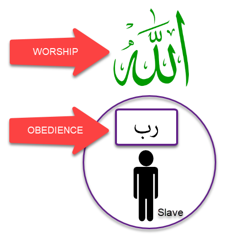

Now we learnt that Allah is ال الہ - He is "The الہ". He is the one who takes precedence over all forms of الہ in our lives. But what kind of relationship does he have with us? He is our رب. The word Allah describes who he is, and what he is **generally **supposed to mean in our lives; but the word رب describes his **personal **relationship with us. In other words, he is the entity that is to be worshiped because he is اللہ- and he is also the entity that is to be willingly obeyed, because he is رب.

To put it in practical terms, why are these two things important? Lets say we are about to pray in 15 minutes. Let's say it's time forفجر in 15 minutes and we have to do our عبادۃ. Now what kind of عبادۃ is صلوۃ ? Worship or obedience? Worship, right? But then from فجر until ظھر we may not be worshiping him, but we should be doing what? Obeying Him! You understand? If we truly consider him an الہ and if we truly accept his relationship with us as رب, then between two prayers you and I might not necessarily be worshiping Him; but we still need to be in obedience to him! This is why the concept of عبادۃ is so comprehensive in Islam. All forms of obedience are considered عبادۃ in Islam. Therefore if you really want to understand the word عبادۃ, I prefer the word obedience **over **worship. Because unconditional willing obedience, **is **worship! You go and earn a حلال income at your job, that's an act of عبادۃ. You go to school and sincerely accomplish the purpose of learning, that's عبادۃ. You obey, love and respect your parents and teachers, that's عبادۃ. You are kind to your siblings; generous to the needy; respectful to your elders, that's عبادۃ. You wash your hands before you eat, you cover your head before you go to the toilet, you smile at someone, you do وضو before you sleep - those are all acts of عبادۃ because they are being done in the willing obedience, and out of sincere love for the beloved. So you can see that the word عبادۃ in Islam is a very comprehensive term, and is not just restricted to the forms of worship.

### Slave - ABD

Now that we understand the word عبودیۃ, let's understand the word عبد which means a slave. Now what is a slave? A lot of Muslims take offense to this word slave - because it creates a very negative image in their mind, based on how masters have historically treated slaves. But I want to use these same negative examples to draw a comparison between the kind of masters the world has seen - and the kind of master our رب is

### Freedom of choice

Let's begin with the term slave - What is a slave? What is the most defining characteristic of a slave? A slave is someone who does not have free will. A slave does not have a choice in any decision that his master makes. He must obey the will of his master without question. A slave has no existence of his own, other than fulfilling the desires of his master. Isn't that right? A master completely denies and prohibits free will for his slaves - which is the ultimate form of humiliation! Taking away an intelligent persons freedom of choice is the worst form of humiliation - because it says: I do not think you are capable of making the right choices! It says, you are no different than an animal to me! Just as I choose and make decisions for my cattle and my dog, I am going to make your decisions for you! Denying the freedom of choice is the ultimate form of humiliation and disgrace for a human being.

Now when it comes to our master, what is the most precious gift he gave us? The ultimate gift that distinguishes us from all other creations of this world? Free will! Did he need to do that? No! He is مالک. He is my owner. He is the owner of every single creation in this universe. That fact alone makes every single creation his property! His slave! Doesn't it? That means being his property, or his slave, has nothing to do with being Muslim or not. Because everything is his property and slave. The sun is his property, the moon is his property, the galaxies are his property. This entire universe, and everything within it, including you and I are his property. Does the sun has free will? Does the moon has free will? Does the night and day have free will? No! They're all in complete submission to the will of their creator

وَکُلٌّ فِی فَلَکٍ یَسْبَحُونَ. They are all floating in their orbits. They have been bound by gravity. They have no choice, but to float in their orbits! And Allah has bound them and taken away their freedom of choice. Could he have done that to us? Could Allah have bound us? Could he have forced us into submission? Could the one who has compelled and enslaved the sun, moon, solar systems and galaxies, could he have forced us into submission? Absolutely! But did he? No! He gave us an intellect, and the freedom of choice. Something that he did not give to any other creation! SubhanAllah!

So right off the bat, we can see that Indeed Allah is our master! He is our رب but his ربوبیۃ is unlike any other master we know of. The first thing every master we know of will do, is take away our freedom of choice! Teachers, Parents, Bosses, Judicial systems, Doctors - Any worldly رب you can think of, will try to control us by restricting our free will. But our Allah is the only رب who has granted us complete freedom of choice. Now if denying freedom of choice is the ultimate humiliation, then allowing complete freedom of choice is what? The ultimate honor! SubhanAllah! Allah honored us above and beyond every other creation by granting us freedom of choice.

وَقُلِ ٱلْحَقُّ مِن رَّبِّكُمْ ۖ فَمَن شَآءَ فَلْيُؤْمِن وَمَن شَآءَ فَلْيَكْفُرْ

And say: "The truth has been revealed by your master." Then whosoever wills, let him believe, and whosoever wills, let him disbelieve

### Expectations

Now what kind of gifts do masters give their slaves? Nothing! They barely feed them, they barely clothe them, they barely pay them. And when they do feed and clothe them, they give them the bare minimum. Just enough to keep them alive, yes? And for the very little they give them, how much do they expect back in return? A lot!! Every master we know of, gives the bare minimum, and expects the maximum from his slaves, Yes?

What has Allah given us? We talked about the numerous undeserved gifts that the منعم has showered upon his creation! Precious gifts that are above and beyond the reason and logic of economics. Any company that gives its employees so much would bleed red. Now in comparison to the quantity and quality of gifts that our رب bestowed upon us, how much does he expect in return? The bare minimum! The very least. SubhanAllah! Of all creations, our master gave us the most! The rest of creation is constantly in a state of عبودیۃ to him. They're all working round the clock, in constant obedience to Allah, without taking a moment's break. To serve us! But then despite giving us the most, he expects the least from us in return. 1 hours of صلواۃ a day. 1 out of 12 months of fast - that too only from sunrise to sunset. 2.5% of our wealth in زکواۃ - the wealth that he gave us in the first place. It's incredible!

And even then, you missed the صلواۃ no problem - do قضاء. You can't find water, no problem! Do تیمم. You're sick or travelling? No problem - complete your fasts later. You don't have a saving that has been left untouched for a year? No Problem! You don't have to pay زکواۃ. You don't have the money for حج, or travelling is not safe? No problem! I life the obligation of حج from your shoulders. I mean this is crazy! How easy has he made this for us?! What kind of a master does that? Do you know of any other master in this world who would make it this easy for a slave? Do you know of any other master in this world who gives so much, and asks for so little in return? We've never heard of such a master!

### Explanations

On top of that, if that wasn't generous easy enough, he also sent us revelation and messengers to explain his reasons to us. Does a master every explain his reasons to his slaves? Can any slave tell his master, Explain the purpose of this command to me! Can a slave negotiate with its master? Can a slave say, I'll obey your command only if and when you explain it to me! Can a slave do that? No! But did this master explain things to us in the Quran? He did. Did our master through the life example of Rasul Allah ﷺ show us how to practically execute our obligations? Why? To make it easy for us to accept his relationship. To make عبودیۃ easy for us.

يُرِيدُ ٱللَّهُ بِكُمُ ٱلْيُسْرَ وَلَا يُرِيدُ بِكُمُ ٱلْعُسْرَ

Allah desires ease for you. He does not desire hardship for you.

### Who does it benefit?

Now here's another question. Who are the acts of worship meant to benefit? Him or us? Who is slavery always designed to benefit? The master? or the slave? Always the master! But this master, he designed the universe for us; He gave the most to us! He asked the least in return from us! Explained the reasons of his commands to us! But the question is, everything he asked us to do, who does it benefits? It benefits us and only us. SubhanAllah! Every slave in the world is bought and put to work to benefit the master. Every command issued to a slave is for the master's benefits. What kind of a master is this? Whose every single command is meant for the benefit of his slaves. Not one single command is for his own benefit. If that is not love. If that is not care. If that is not mercy. If that is not ease. If that is not رحمۃ then you tell me what is! AllahuAkbar! He is in constant service to us! And what he asks from us in return, is also to benefit only us - not him!

### Judgment

Now here's another question. Is the work of a slave judged according to the slaves capabilities, or according to the masters exceptions? A slaves work is always judged according to the level of the masters standards and expectations. How does Allah judge our actions? According to our individual levels of knowledge and capabilities. No where in the Quran does Allah demand perfection! The only thing he asks for in the Quran is effort!

### Service

Do you know of any master in the world that rushes to fulfill the needs of his slaves? Have you ever watched a movie in which a slave calls out to his master in need and the master drops everything and rushes to his aid? What does our RAB do?

> ‏وَإِذَا سَأَلَكَ عِبَادِى عَنِّى فَإِنِّى قَرِيبٌ ۖ أُجِيبُ دَعْوَةَ ٱلدَّاعِ إِذَا دَعَانِ‎۱۸۶
>
> And when My slaves ask you concerning Me, Indeed I near him in that very moment. I immediately respond to the invocations of the supplicant when he calls upon Me.

No master every does that. From what history tells us, slaves are always rushed to fulfill the needs of their masters; never the other way round! So then what kind of a merciful master is this who rushes to fulfill the needs of his slaves?

So the more we reflect upon the ربوبیۃ of this master, the more we realize that his رحمۃ and mercy is absolutely incredible! We see that he is extremely loving; extremely caring and extremely merciful. He is unlike any other master that we know of. He is unlike any other master we will ever come to know of in this world. No master does for his slave what our رب does for us. But the problem is that because of his subtle love and mercy, we forget our place before him. We forget that we are his property. We forget that he is مالک! He is owner. Because if he is owner, then by definition. that makes me property. Which means he can do whatever he wants with me. He can break me. He can rip me apart. He can burn me. drown me. He can do whatever he wants with me. And when he chooses to do that, there is absolutely nothing that I can do. or you can can do; or all of us put together can do; or everything in this universe combined can do to protect me against his wrath.

إِن يُرِدْنِ ٱلرَّحْمَنُ بِضُرٍّۢ . لَّا تُغْنِ عَنِّى شَفَعَتُهُمْ شَيْـًۭٔا وَلَا يُنقِذُونِ

If the Rehman decides to harm me. then absolutely nothing in existence will be able to help me. Look at that.

إِن يُرِدْنِ ٱلرَّحْمَنُ بِضُرٍّۢ

If the REHMAN decides to harm you. SubhanAllah! Not

إِن يُرِدْنِ الجبار. إِن يُرِدْنِ القھار. إِن يُرِدْنِ ذوالنتقام

If the conqueror. the powerful. the avenger. decides to harm you. NO NO NO.

إِن يُرِدْنِ ٱلرَّحْمَنُ

If the REHMAN decides to harm you. Even in his ضُر. Even in his harm, he is merciful, in that there is a hidden benefit. SubhanAllah!

And yet! we constantly disobey Allah. We constantly fail in our عبودیۃ, in our obedience and servitude to him. But he still allows us to exist. Just think about that for a second.

You know my phone was causing problems. It was acting up! freezing up on me. Every now and then I would have to restart it again. You know what I did? I went to the store, and I got a new phone. I got rid of the old one. Why? Because occasionally, not all the time - occasionally, a few times it acted up on me. So I got rid of it. Because that's what you do with property that is no longer doing its job. You discard it. We are all Allah's property, and we are not doing our jobs. Not occasionally, not sometimes; but in some cases - constantly! All the time! So what should my owner do with me? What should my owner do with such a useless property as myself? Discard it right?. But does he do that? AllahuAkbar!

So you can see that even words such as رب and عبد(master and slave) are used, he is unlike any other master we can imagine in this world. This is a master who loves us intensely and constantly. And so when we realize that, what is our natural response to him? We love him back! And that is yet another unique relationship between a master and a slave.

### Love

There is not a single master in this world, where a slave would love its master. In fact, historically, slaves have always hated their their masters. The first chance they get, they want to run away from their masters. Isn't that true? But we wholeheartedly love our master; and so the only way, the only direction we want to run, is towards this master, not away from him. And how do we do that? By submitting ourselves to his love and mercy. Through our willing obedience. Not a forced obedience as we experience in the world. But a willing obedience. An obedience that is based on the highest stages of love that we learnt earlier. An obedience that manifests in the desire of service and servitude; like the service of a passionate lover (an عاشق)for his معشوق - for his beloved! That is عبودیۃ! That is worship! And there in lies our greatest challenge!

Now listen to me very carefully... The greatest challenge! The greatest difficulty! The greatest hardship! that you and I constantly face in life; every single waking moment - is to accept Allah as رب. I'll say that again. The greatest and constant challenge you and I; and everyone else in this world faces; is not in accepting our creator as Allah. Everyone is fine with that part. Even the جاھلی عرب accepted him as Allah. There is no one in this group here that has a problem with accepting him as Allah! The real problem, and the real challenge is in accepting him as رب- as master! You know why? Because if we accept him as رب, that means we have to become what? We have to become slaves. We have to accept his relationship; give up the freedoms of our passions and desires; an put on the collar of his عبودیۃ to become his slave. And that is where we all struggle.

Because we all live in the times of absolute and unrestricted self indulgence. We live in the times where I am in charge. I am in control. I am the master of my own destiny. I am powerful. I am wealthy. I don't have to listen to you. You're not the boss of me. I can do whatever the hell I want. whenever I want. I am the king of my domain. This is MY life. If I wanna do it I'll do it. If I don't wanna do it. I won't!. In other words. I am my own رب! I am my own master!

And Allah is saying. No! I am your master! I gave you this life. I gave you this authority. I gave you these gifts of parents. I gave you these gifts of children. I honored you with intellect and free will. I gave you position and power. I gave you health and strength. I gave you all these things so you could recognize me and come closer to me because I am your master - and I am a master unlike any other master you will ever come to know of! Submit to me and I will show you what true happiness is!

Willingly and happily accepting our عبودیۃ and submitting to our master in sincere obedience and true worship, is the greatest challenge that you and I will ever face in this life. And the only way to overcome this challenge, is by recognizing and appreciating the love and mercy of our master; and by completing the relationship of ربوبیۃ by a willing submission and obedience to this magnificent master - because love engenders love!

If this incredible رب does so much for us disobedient and ungrateful slaves, what would he do for us if we actually did become willingly obedient to him?!

‏وَإِذْ تَأَذَّنَ رَبُّكُمْ لَىِٕن شَكَرْتُمْ لَأَزِيدَنَّكُمْ ۖ وَلَىِٕن كَفَرْتُمْ إِنَّ عَذَابِى لَشَدِيدٌۭ ‎

And when your ‏master said: "If you become grateful, I will give you more, but if you are ungrateful, then indeed my punishment is severe."

### Q&A

### If Our Relationship With Allah Is Of Master And Slave, Then What Is The Concept Of Freedom In Islam?

What is freedom? حریۃ . In Arabic freedom is very different from the definition of freedom in modern English. For instance, freedom in the pre-Islamic culture, the حر was in contradistinction to the slave. So a free person was someone who was not a عبد. They had the حر and the عبد. Now one of the amazing things about Islam is that it makes you عبد اللہ. Now if you're عبد اللہ - if you are the slave of Allah, then what does that make you in relationship to everything else? It makes you free! Because now your عبدیۃ - your obedience and servitude is only to Allah; it is not to anything or anyone else; and so it sets you completely free. So the حر- the Arabs say

الحُرُّ عَبْدٌ مَا طَمَع

The free man is a slave as long as he is covetous - as long as he is greedy; as long as he wants

والعَبْدُ حُرُّ مَا طَمَع

and the slave is a free man if he is content, which gets to the essence of the Arab understanding of freedom, before Islam. That freedom in reality is moral freedom. It's freedom from want - it is not freedom to! In our culture, freedom has been almost entirely defined by freedom "to" - Freedom to do whatever I want. Freedom to say whatever I want. Freedom to have whatever I want. To the Arabs it was freedom from - freedom from desires; freedom from wants; freedom from needs - that's how they perceived freedom.

So the Islamic concept of freedom, comes from that powerful paradigm. Enslave yourself to the one, to free yourself from everything. Or move away from the one, and become a slave of everything. And even enslaving oneself to Allah, is essentially just accepting the relationship of his ربوبیۃ - because we are slaves regardless. We are his property regardless of whether we accept it or not. So the concept of freedom is essentially just recognizing that relationship and draw towards him and in the process achieve complete freedom and happiness.

### If Allah is so merciful then why did Imam Hussain and his friends suffer in Karbala?

That is a matter of perspective. Did they really suffer?

What are the signs of someone who is in a state of suffering?

fear - regret - depression - excuses to escape

Example of the black slave John - played the racist card

Karbala was the prime example of عبودیۃ - It was a battle to defend the honor of the beloved. Yazeed had challenged the ربوبیۃ and الہیۃ of Imam Hussain's beloved and he and his friends stood ground to defend the honor of their beloved - and to set an example of true love for us - They showed us that this is how you love! You pay any price any cost for the beloved. You sacrifice your food, your drink, your children, your family and your own life - but you never desert the beloved. Because what kind of love is it that flees at the first sign of trouble! And for a true lover, what good is life without the beloveds grace anyway?!

فَلَيـتَكَ تَحلُو وَالحَيـاةُ مَـرِيرَةٌ . وَلَيـتَكَ تَرضـى وَالأنـامُ غِضَـابُ

وَلَيـتَ الَّذِي بَيـنِي وَ بَينَـكَ عَامِرٌ . وَبَـينِي وَبَيـنَ العــالَمِينَ خَـرَابُ

فَيالَيـتَ شُـربِي مِن وِدَادِكَ صَافِياً . وَشُـربِي مِن مَـاء الفُراتِ سَـرَابُ

إذا نِلتُ مِنكَ الوُدَّ فَالكُلُّ هَيِّـنٌ . وَكُـلَّ الَّذي فَوقَ الـتُّرابِ تُـرابُ

If I can just taste the sweetness of your happiness ; it wouldn't matter if life itself becomes bitter for me
 If you are happy with me, who cares about the anger and wrath of the world
May things remain beautiful between us; and let the entire world becomes ugly for me
A sip from the wine of your pure love, makes the sweet water of Euphrates a mirage for me
All I need is YOUR love. If I have that, I have EVERYTHING. Otherwise even the greatest of treasures is dust for me

###

## Understanding RAB Al-ALAMEEN

Begin with REHMA

The classical definition of the word رب is:

الرَبُّ ھُوَ المَالِکُ وَ السَّیِّد وَ المُرَبِّی وَ المُرْشَدُ وَ المُنعِمُ وَ القَیِّمُ

A رب is a combination of 6 traits. He is the one with complete ownership, absolute authority. He is the one who nurtures, guides, sets to purpose, showers with undeserved gifts and blessings and the one who sustains, maintains and provides. Now that we've learnt what رب means, the next thing to understand, is what is he a رب of? In سُورَۃُ الْفَاتِحَۃِ he tells us

‏ٱلْحَمْدُ لِلَّهِ رَبِّ ٱلْعَلَمِينَ

All praise and gratitude belongs to Allah who is رَبِّ ٱلْعَلَمِينَ. So in today's session we'll begin looking at this word ٱلْعَلَمِينَ, and then we will see what the term رَبِّ ٱلْعَلَمِينَ practically means for us.

### Linguistic analysis of ALAMEEN

If you look at any English translation for الْعَالَمِینَ, you'll see "worlds". All praise and gratitude belongs to Allah who is the master of the worlds; who is the master of the universe. The translation world provides a very weak and incomplete understanding of this word. The word الْعَالَمِینَ is the plural form of the word العالَم. In order to understand the meaning of this word, we first have to look at its counter part, which is عالِم.

ALAM

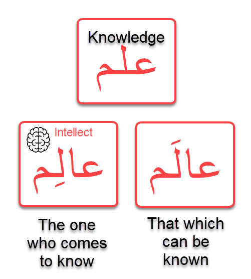

If you look at these two words عالَم and عالِم you can see they both have the exact same spelling. The only difference between عالَم and عالِم is the فتحۃ and the کسرۃ. Other than that they both have the exact same spelling. By now you know that in Arabic when two words share a common spelling they have a deep connection in their meaning. In this case, both also share the same root word which is علم. What does the word علم mean? It means knowledge. So عالِم is the one who knows; and the عالَم is that which he comes to know of. You understand? عالِم is the one who knows; who is the cause; whereas عالَم is that which can be known - the effect! And the device through which the عالِم learns about the عالَم , is the intellect which in Arabic is العقل.

Now we as human beings can know many many things. But even with all the knowledge we have gained over the course of years individually; or over the course of centuries collectively, we still cannot know everything. We are knowledgeable about certain things, but at the same time we are also ignorant of other things. As opposed to Allah who knows everything there is to know. And the word for someone who knows everything about everything there is to know, is علیم.

ALEEM

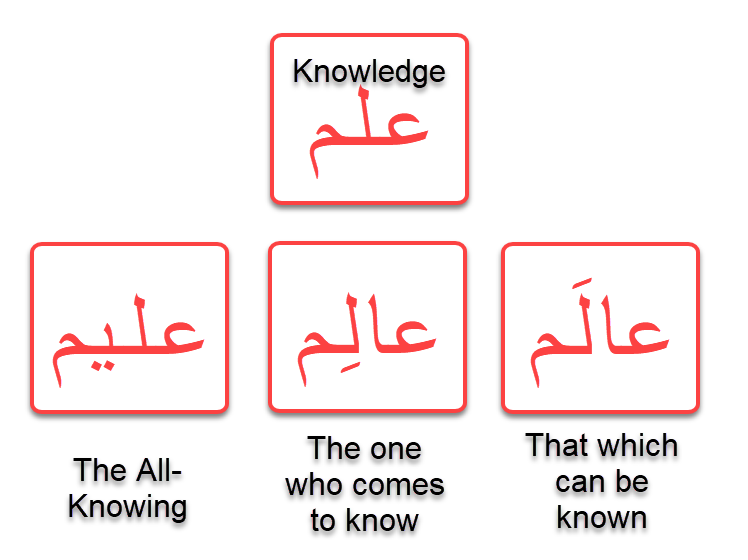

It is the superlative form of the word عالِم. An عالِم is someone who has knowledge - some knowledge; but علیم is the one who has absolute and complete knowledge of everything. So now we have 3 words that stem from the same root of علم. There is the عالَم, that which can be known; that which is waiting to be known; waiting to be discovered; waiting to be researched; waiting to be understood. Then there is the عالِم, the one who studies, researches, discovers and in the process learns about the عالَم. And then finally there is the علیم, who knows everything that there is to know.

Now because we as human beings are limited in our abilities, of how we learn, what the علیم did, is that he created the عالَم, so that we can study it, reflect upon it, and through it become knowledgeable; so that we can become aware; so that we can recognize! Recognize who? The علیم. You understand?

COMBO

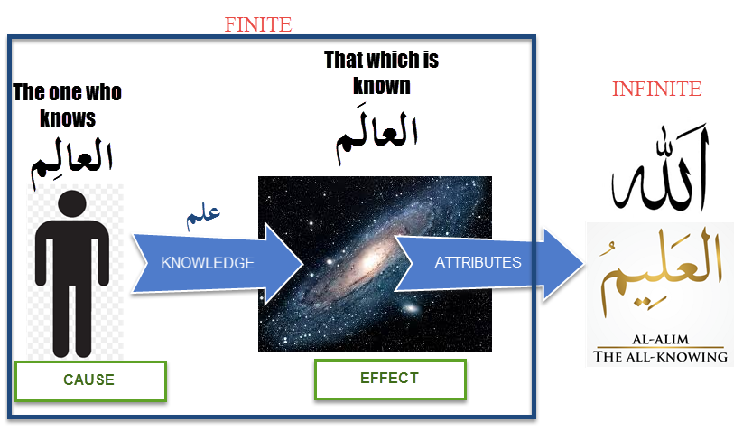

Allah is infinite. Infinite means without limit. اِمَامُ جَعْفَرٍ الصَّادِقِ عَلَیْہِ السَّلَامُ explained Allah as:

اَللّٰہُ اَکْبَرُ مِنْ اَنْ یُحَدَّ وَ یُحْسَرَ

Allah is great in the sense that he does not have a boundary nor can he be confined to human comprehension. In other words. Allah cannot be "defined". But the reality is that as human beings, we are only capable of understanding things through what? Through "definition". Definition is what "defines" or gives "Finite-ness to something. It limits reality for us so that we can put things into perspective. That is what the Intellect or عقل does. It sets a boundary; it confines; it defines. So how did Allah سُبْحَانَهُ وَتَعَالَى solve this problem for us? The problem of understanding and recognizing an infinite creator through finiteness? How did he solve that problem? By creating this عالَم. Because as human beings, we are limited in our mechanisms of learning, in that we have to define something before we can understand it? So how do we as creatures of FINITE-ness and DEFINITION understand a creator who is INFINITE and cannot be defined? Through this intermediary of a عالَم, which essentially acts like an interpreter.

If everyone in this group only speaks English, and all I know is Urdu, then for me to understand what you're saying, I'm going to need a middle man, right? Someone who understands both languages. Someone who can take your messages in English, and translate them for me in Urdu. Right? It's the exact same concept with this عالم, which in its creation is physical, but in its design reflects the attributes of its creator. It "defines" the attributes of the creator's glory and magnificence, so we can gain some understanding about our creator.

### Universe Manifests existence of Allah

In other words, this universe becomes the medium through which we can recognize Allah سُبْحَانَهُ وَتَعَالَى; because every sculpture necessitates the presence of a sculptor. The poet says:

وُجُودُہُ لَہُ دَلِیلُ قَاطِعٌ

حَاجَتُ کُلِّ مُحدَثٍ لِصَانعٌ

The most convincing evidence that Allah exists, is the fact that every sculpture requires a sculptor

وَلِکُلِّ عالَمُ لِحَاجَّتاً الی العَالِمٌ

Similarly every thing that can be known, requires and necessitates the existence of a knower. Because nothing can exist in a passive state. Therefore the proof of how we know Allah سُبْحَانَهُ وَتَعَالَى exists, is through the آثار - through his signs and effects left behind in creation. Just as that Greek philosopher who asked the Bedouin:

بِمَ عَرَفتَ رَبُّك؟

How did you come to know of your master? He said.

إن البِعرَةُ تَدُلُّ علی البَعِیر . والرَّوثَةُ تَدُلُّ علی الحمیر . و آثارُ القدمُ تَدُلُّ علی المَسِیر

He said: The camel dunk shows me that there was a camel here. The donkey dunk tells me that there was a donkey here. Footsteps in the sand tell me that people walked by this place

فسمآءُ ذاتُ اَبرَاج. وَالْاَرْضَ ذَاتَ الْفِجَاجِ. واَبحَرُ ذَاتَ الامواج

So when I look at the sky with its perfect constellations; and when I see this earth with its perfect valleys and traverses; and when I look at the oceans with all of its waves.

اَلَا تَدُلُّ عَلَی لَطِیفِ الْخَبِیرِ؟

Do they all not indicate the presence of the لطیف and the خبیر? SubhanAllah! It was that simple to him. See! We complicate the heck out of things. But the truth is, that the existence of Allah is the most clear, most manifest truth there is for an intact and healthy فطرۃ. If that primordial essence of فطرۃ is intact, the question about the existence of a creator does not even emerge. This is why, when the atheist says, "I wish there was a proof of the existence of Allah. the believer replies: I see nothing but the proofs of his existence".

So that's the linguistic meaning of the word عالَم. It is anything and everything that can be known by the عالِم in order to enable him to recognize the علیم. And that's why WORLD is not the best translation for the word عالمین. It limits the scope of its meaning. If it meant world, then it would just mean that, and nothing other than the world or universe. In that case the plural form for that would have been العوالم not الْعَالَمِینَ. The word الْعَالَمِینَ encompasses a much broader spectrum than just the physical world. The statement رَبُّ الْعَالَمِینَ means that Allah is not just the master of worlds, or the master of the universe. It means he is the master of everything that can be known. Because everything that exists in creation is a reflection of the علیم. It exists in a passive state, waiting for the عالم to learn about it through reflection, so that he can recognize his creator.

So now the definition of رَبُّ الْعَالَمِینَ becomes much broader than master of this world or this universe. He is also the master of all the different species; he is also the master of all the distinct groups of creation. Every group, every category, every concept, every idea, every postulate, every physical matter, every chemical matter, every spiritual entity, everything in existence - physical or meta-physical is now included in the definition of the word عالَم. Because they all exist for one and one reason alone - so that their creator could be recognized and understood.

### Humility

There are many explanations of what the term رَبُّ الْعَالَمِینَ means. Today I want to explore one of those interpretations which I think is the most lacking trait in our society today. That is the trait of humility. Because Allah points out that it is He who created different cultures, different creations, different civilizations. people of different languages. He says in the Quran:

يَبَنِىٓ إِسْرَٓءِيلَ ٱذْكُرُوا۟ نِعْمَتِىَ ٱلَّتِىٓ أَنْعَمْتُ عَلَيْكُمْ وَأَنِّى فَضَّلْتُكُمْ عَلَى ٱلْعَلَمِينَ

I gave you preference over every other nation, and the word used for nations in this verse is what? عالمین. So the idea is that he is the creator and the master of all nations, therefore you better treat them properly. Be careful how you interact with them - regardless of their race or religion. Don't forget that Allah is رَبُّ الْعَالَمِینَ. You know why that's important? Because if you hurt them! If you break their heart with your words. If you torture them with the temporary authority I have granted you over them. You better not forget that I am رَبُّ الْعَالَمِینَ. And not just human beings; even animals; even plants; even this earth. Before you're cruel to any of my creation, you better remember - I am their رب too.

When a slave gets hurt by someone, who gets ultimately offended? The master! In the olden days, wars would begin because the member of one tribe unjustly hurt or killed the slave of another tribe. His master took that as a personal insult. Why? Because he disrespected his property. Slave is a masters property and responsibility. Even if the slave was in the wrong and deserved to be reprimanded, who should the complaint be taken to? His master, right?
So Allah says. I am رَبُّ الْعَالَمِینَ, so be careful how you interact with my creation. No matter what group, what religion, what cast, what belief system, what country they belong to! No matter what your relationship with them is on this earth - doesn't matter! Before he's your son, he's MY slave. Before she's your daughter, she's my slave. Before he's your father, before she's your mother, they are MY slaves. Before she's your daughter in law, she's my slave. Before he is your son-in-law, he is my slave. Before he's your employee, before he's your servant, before he's your student - don't forget he is my slave! I am here! and I'm watching. If you treat them unjustly.! If you hurt them! If you insult them, degrade them! If you misuse your authority over them, you will have to answer to me!! Because I am رَبُّ الْعَالَمِینَ. SubhanAllah!

In one of the sermons of نَہْجُ الْبَلَاغَۃِ, Maulana Ali explains that what this title of رب العلمین does, is that it bring us all down on the same level in the eyes of the creator. It marks and categorizes all creation as his slaves. No nation; no one group is better than another, in terms of their race or color. If it is better. it is only by whose standards? If any individual is better or superior than another, it has to be by whose standards? Who can be the only judge of that? The master! Because this has become a huge issue in our community. Just because we are Muslims or we are Sulemani's we start thinking we're better than the rest of the world! Yes we are definitely superior in our knowledge of realities - AlHamdulillah! No doubt about that! But that doesn't give us the right to treat other communities or other religions with spite. It does not give us the license to look down upon others. Do you understand what I'm saying? In today's world we are afflicted with this disease of superiority and this feeling of having a chip on our shoulders whether we admit to it or not. Whether it's by religion, by race, by money, by social status by whatever reason. Don't forget we all have the same رب.
 Superiority in ranks can only exist through the eyes of the master - based on the servitude of the slave! Not through the eyes of the slave.

إِنَّ أَكْرَمَكُمْ عِندَ اللَّهِ أَتْقَاكُمْ

The most honorable in the eyes of Allah. is the one who is the most pious. That's it. Not by anything else. Because even the highest ranking person is Allah's slave, and even the lowest ranking person is Allah's save. Look what we recite in each and every أذان . What do we say? 5 times a day?

اشھد ان محمد عبدہ و رسولہ

I testify that Muhammad ﷺ is his **slave** and his messenger. AllahuAkbar. The highest ranking person who has ever walked this earth - we testify in every prayer, that he is the slave of Allah! Then what right do we have to claim superiority over each other? If Allah has blessed us with some gifts - and what's the greatest gift of all? ایمان! It is faith! Then that gift should make us more humble - not arrogant!

Does Quran tell us the story of someone who became arrogant about his title and his rank? Do you remember the story of ابلیس?

أَنَا۠ خَيْرٌۭ مِّنْهُ . خَلَقْتَنِى مِن نَّارٍۢ وَخَلَقْتَهُۥ مِن طِينٍۢ

I am better than him. I am created from fire! He is created from clay. Who was ابلیس! He was was an angel, right? From the عالَم of angels. Adam was a human being. from the عالَم of انسان. They both were slaves of Allah. And ابلیس stood before Allah; He stood before the رَبُّ الْعَالَمِینَ and said:

أَنَا۠ خَيْرٌۭ مِّنْهُ خَلَقْتَنِى مِن نَّارٍۢ وَخَلَقْتَهُۥ مِن طِينٍۢ

I am better than him. And what do we learn in that story. What did his master do?. Did his arrogance bring him closer to Allah. or did it get him removed from his divine presence? Do you really think that an act that ابلیس was punished for, Allah would let it slide for you and I? Would that befit his justice? That he punishes ابلیس for his arrogance; remove him from his divine presence, but then reward us bring us closer to him? Impossible!

Because you have to understand! When you and I judge each other! When you and I as slaves judge other slaves in terms of superiority - what position do we place ourselves in? We put ourselves in the position of our رب. Now does the Quran also tell us of someone who did that? Didn't someone say. اَنَا رَبُّکُمُ الْاَعْلَی. I am your greatest رب. Who said that? فرعون said that. How did he end up? And the reality is that فرعون knew that he was human. He knew he was not a رب. He was fully aware of his weakness; but despite that he claimed a station he was not worthy of. Did you know, he did not like the fact that he needed to go to the toilet. Because that was not befitting a رب. So he got all of his physicians together and he asked them how do I get out of this problem? So they told him to eat bananas. So he ate bananas for 40 days; and then he ended up with a much bigger problem.

The reason I'm repeating this and enforcing this so much because today, this is not just a Fironic problem. This has become a GLOBAL problem. Everyone wants to become الہ ; everyone wants to become معبود. At some level we have all become people who want to be worshiped; but we forget how Allah has defined us in the Quran:

وَلَقَدْ خَلَقْنَا ٱلْإِنسَنَ مِن سُلَلَةٍۢ مِّن طِينٍۢ

You are from some chain of dirt; of mud and water mixed together.

ثُمَّ جَعَلَ نَسْلَهُۥ مِن سُلَلَةٍۢ مِّن مَّآءٍۢ مَّهِينٍۢ ‎

We created your progeny from a vial fluid. Who do you think you are? Allah tells these people. Get down off your high horse!!!. Be a رجل. A رجل is the one that has ِرَجَلَ. Who as they say - ِرَجَلَ عن فَرِسِہ. He is the one who comes down off his high horse, and puts his feet on the ground. Doesn't see himself raised up above the earth. He comes down to the level that he came from - from dust. That's الرجل. But we're all people, who at some level are just playing games - trying to be الہ . and Allah سُبْحَانَهُ وَتَعَالَى says NO! Be a رجل. Be بنی آدم ! Be آدمی . That is truly accepting Allah as رَبُّ الْعَالَمِینَ. Humility, not arrogance is the trademark of a believer.

The acceptance of our عبودیۃ , our slavery and servitude to Allah سُبْحَانَهُ وَتَعَالَى is a heavy burden that we as believer carry on our backs! When you carry a burden on your back, and you try to climb a mountain - do you bend forward or do you walk upright? The burden makes you bend; it makes you humble - doesn't it? And this is why HUMILITY is the essence of spiritual progress. Maulana Ali says

مَنْ تَوَاضَعَ لِی اللَّہُ، رَفَعَ اللَّہُ لَہُ

The one who becomes humble for Allah, Allah raises him and elevates him in ranks. This is why, the highest ranking person to every walk the face of this earth, was my beloved prophet مُحَمَّدٌ مُصْطَفَی ﷺ. The greatest ranking man that this world will ever know was the most humble in his character. In fact, he was marked by humility! All previous prophecies that predicted his arrival, they identified him as being the greatest in his humility. SubhanAllah! The greatest mark . THE GREATEST MARK of his prophet hood was his humility!

یُریدُ أَنَّ یَبعَثُ أُمِیِّ مِنَ الأُمِّیِّن۔وأجعل السكينةَ لباسُهُ ، والبِرَّ شَعارُهُ ، والتقوى ضَميرَهُ ، والحِكمَةَ مَنطِقَهُ ، والصِّدقَ والوفاءَ طَبِيعَتُهُ ، والعَفوَ وَالمَعرُوفَ خُلقُهُ ، والَحقَّ شَريعَتَهُ ، والعَدلَ سيرَتَهُ ، والهَدِىُ إمامُهُ ، والإسلامَ مِلَّتُهُ ، وأحمد أِسمُهُ . أَهدِي بِهِ بَعدَ الضَّلالَة ، وأعلَمُ بِهِ مِنَ الجَهالة ، وأَرفَعُ به بعد الخَمالَة ، وأعرِفُ به بعد النَّكِرَة ، وأكثَرُ بِهِ بعدَ القِلَّة ، وأغنِي به بعد العَيلَة ، وأَجمِعُ به بعد الفُرقَة

This is the prediction of Rasul Allah ﷺ's arrival in the bible! Allah mentions all these beautiful signs of his arrival:

I am going to send you a man from your own nation - his garment will be a peaceful temperament; his behavior will be kind; his conscience will be pious; his logic will be wise; honesty and truth will be his nature; his dealings will be full of forgiveness; justice will be his actions, Ahmed will be his name

أَهدِي بِهِ بَعدَ الضَّلالَة ، وأعلَمُ بِهِ مِنَ الجَهالة ، وأَرفَعُ به بعد الخَمالَة ، وأعرِفُ به بعد النَّكِرَة ، وأكثَرُ بِهِ بعدَ القِلَّة ، وأغنِي به بعد العَيلَة

He will guide a nation and bring them out of error; he will give them knowledge to bring them out of ignorance; he will be raised after being belittled; he will become known after being unknown; he will gain abundance after scarcity; he will become wealthy after poverty; Allah goes on mentioning all these traits about his beloved. But then after revealing all these beautiful traits and incredible signs, he mentions the greatest sign of all !

لَو یَمشِی عَلی القَصَبِ الیَابِس۔۔۔ لَم یُسمَع مِن تَحتِ قَدَمَیہِ مِن سَکِینَتِہِ

He will be so humble! He will walk among you in such humility, that when he walks on dry leaves, you will not hear the sound of them cracking under his feet. SubhanAllah! This is the prophet we follow! This is the example we follow!

If you want to know why this slave of Allah gained the honor he achieved from his master, it is through this one trait ! HUMILITY!. And that is what identifies a true believer from a hypocrite! HUMILITY. This is why I feel atheism is such a blatant form of arrogance. Because the atheist is rejecting something that is the most obvious - and the most fundamental aspect of his existence. That he was **created**! Because even he cannot say that he was not created. Now if I say that my father created me and and his father created him before him. That's what they call دور that's تسلسل. It just keeps on going back. And then where do you stop? It stops at Adam! Who created Adam? Because that's where the buck stops.

وکُلُّکُم مِن آدَم. وَ آدَم مِن تُرَاب

All of you are from Adam, and Adam is from dust. And arrogance doesn't befit the dirt, because it is constantly trampled upon!

Maulana Ali saw a man acting arrogantly and he said to him. Who do you think you are?. You beginning is a vile dirty fluid. You end is disgusting decaying smelling corpse. And in between those two stages. you walk through life carrying two loathsome thing within your body. your urine and your feces. And your creation is the result of the union of two ugly body parts. What right do you have to act arrogantly before Allah and his creation?.

And so this is the first thing. to know our station in this world. to know who we are. We are Marboob. We are created. We will die. We will be raised up. THIS understanding. that we are Marboob. THIS is the station of the slave. of knowing that I am NOT Mabood…. I am not the creator….

Wallahi I give myself, and I give you sincere advise - be humble in all walks of lives. Do not become arrogant! It is THE greatest challenge we all face in our times today. Arrogance is the أذان; It is the call of our times today. Arrogance has become the trademark of success in this world today - in schools, in colleges, at work, in families, in communities - It's all about I am better than you! Arrogance does not befit an obedient slave.

May Allah grant us all humility and guide us, enable us in walking in the footsteps of our beloved prophet ﷺ.

If we just get this bit. If we really understand the true meaning of Rabb AlAlameen. this world would become such a beautiful place. If we all understood that it is Allah the Rabb Alalmeen who guides everyone. he is the king. he is the owner. he is the one who cares. he is the one who guides. he is the one who gives gifts. then everything about my life is between me and him. He will take care of me. I just need to worry about anything. I don't need to judge another slave. I don't need to hurt another slave. I don't need to show my authority or power over another slave. EVEN if I am hurt. EVEN if I am wronged. ESPECIALLY if I have been wronged. Because my master will take care of me. My master will come for my rescue. he will come to my defense on the day of judgment. And he WILL make that wrong right. He will stand behind me and support me. I don't need to worry about anything. Because wheter we believe it or not. wheter we want to or not. that day is coming. when the Rabb will gather everyone and exact justice.
 رَبَّنَآ إِنَّكَ جَامِعُ ٱلنَّاسِ لِيَوْمٍۢ لَّا رَيْبَ فِيهِ ۚ
 Oh our master. Indeed you will gather all of us on a day. about which there is ABSOLUTELY NO DOUBT. Because YOU have promised us that.
 إِنَّ ٱللَّهَ لَا يُخْلِفُ ٱلْمِيعَادَ
 No doubt. Allah never goes against his promise.
 Remind yourself of this EVERY time you recite the Fateha. There's a reason we pray 51 rakaats in one day. and all 51 times we recite Fateha. So that every time we say Rabb Alalameen. we remind ourselves of this hierarchy. Who He is and who we are in this relationship.

وآخر الدعوانا عن الحمد للہ رَبُّ الْعَالَمِینَ

Man gave Rasul Allah bottle of wine as gift

There was this man who travelled a long distance to meet Rasul Allah (Salawaat). and when he met him. he gave the messenger a bottle of wine. as a gift. He said Ya RasulAllah. I got this special wine as a gift for you. What would we do if someone did that?. If someone. very secularized. shows up at your doorstep with a bottle of wine. as a house warming gift. what how would we react?. La hawla wala quwwata. How dare you. Don't you know I'm a Muslim. Don't you know this is haraam?. Get the hell out of my house. never show me your face again. right?.
 And who did this man bring the wine bottle to? . Rasul Allah!!!!. The MOST pious man we can imagine. And you know how he responded?. He smiled. He smiled and said. Brother. Did you not hear Allah's command that alcohol has been prohibited?. He said. No Rasul Allah. I never heard that!. He immediately gives the bottle to his slave and says something in his ears. Rasul Allah says. what did you just say to him?. The man said. I told him to sell the bottle in the market. Rasul Allah smiled again and said. The one who has prohibitted the consumption of intoxicants has also forbidden its trade. So the man told the slave to dump it out. This is the character of Rasul Allah. This is his humility. This is the Tarbiyyah. his rububiyyah. SubhanAllah! . He didn't say. Don't you know who I am. How dare you bring this filth in my presence. He NEVER did that. Because hearts can NEVER be conquered with harshness. Hearts have always been conquered ONLY with love. and kindness. We should really study. and learn what kind of a Rabb. what kind of a parent. what kind of teacher our prophet ﷺ was. SubhanAllah.

## The Divine Formula For Recognizing Allah

In the previous session we looked at the term عالَم; which is anything and everything that can be known by the عالِم to enable him to recognize the علیم. Because you need the presence of an object before you can acquire knowledge about it. In order to learn about human physiology, we need a human body. For Mathematics we need numbers. We need physicality to exist before we can study physics. As human beings, we cannot gain knowledge of a subject without the object for that study. So this عالَم is the object that gives us knowledge about the علیم.

We then looked at the statement رَبُّ الْعَالَمِینَ to understand that Allah is not just the master of this universe, but of everything that can be known by the human intellect. Therefore everything that exists in creation is a reflection of the علیم; whether it is physical, meta-physical, conceptual, imaginable - no matter what it is, it reflects the علیم. So for example, the fact that he created this infinite universe just for us, reflects not just his glory and magnificence, but also his generosity and the vastness of his رحمۃ.

### Divine Formula

Now to further elaborate on that, and to put it in perspective, there are two fundamental questions that surround the understanding of God. The first is Who is God? And the second is What does he want from us? Those are the two essential questions that mankind has grappled with from the beginning of time. Who is God, and what does he want from us?

The first question of who is god, includes questions like: What are his capabilities? What are his attributes? His personality? His traits and so on. The second question of what does he want from us include questions such as Why did he create this universe? What is our purpose on this earth? What are his expectations from us etc. To answer both these questions, Allah gives a very simple and straight forward formula through a verse in the Quran. He says:

Question

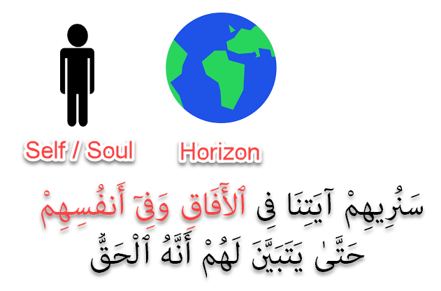

He mentions two broad categories in this verse. The horizons and the soul. What is the horizon? It is everything that exists outside of us - this physical universe. What is the soul? It is everything that exists inside of us - our spiritual universe. Yes? So how does Allah answer the question, Who am I?

Answers

He answers it through the horizons - this physical universe, and everything that exists within it. How does he answer the question, "What is it that I want from you? ". He answers it through the نفس - through our own creation and existence - through the creation of our spirit and soul. And this is what I refer to as the genius of Allah's design. I for one, find it incredibly amazing how he answers such a complex and impossible question using such a simple formula.

So just keep this formula in mind as I explain the details and you'll see how amazing this solution is - at least it is to me. In my personal opinion, this is my absolute proof of the existence of God and Quran being the message of Allah - because this kind of perfection in design simply cannot exist at the human level.

And this is also Allah's solution to the problem that theology faces in modern days about the existence of god. The problems today is that we are try to invent and apply our own formulas to prove Allah's existence. But the fact of the matter is that he has already given us his formula in the Quran, which is a simple solution to derive at that conclusions. Because it is the only formula that will work. If we try to apply our own formulas, it is simply not going to work - because this universe is his kingdom, his design. So we have to follow his rules. Again, this is something we can find plenty of examples for in this world. You have to use the iPhone according to Apple's specifications. If you try to use it any other way it's not going to work. So Allah's formula of his recognition is the آفاق and the أنفس.

Now let's break it down and look at each component in more detail. I'm going to get a bit technical here, so bear with me.

### Horizons

Let's start with the first part of the formula - the آفاق, the horizons? What questions does it answer?

- Who is Allah?

- What is he capable of?

- Why is he even worthy of my worship, my willing slavery and servitude.

- What makes him so glorious or magnificent or incredible in my eyes that I would even think of considering him as my master?

Allah answers those questions using the signs in the آفاق - His signs in the horizon or in this universe. I covered this topic in one of the prior sessions of "Conclusions of reflection" session. In that we looked at the pre-requisite for understanding this formula. Which is that:

1. You must have a sound intellect and a pure heart, which the Quran refers to as لُب; the core. The Quran refers to such people as اُولُو الْاَلْبَابِ - people of pure hearts and sound intellects. Because it is the combination of the two that allows us to perceive reality as it truly is.

1. The second requirement of the Quran and this formula is an uncontaminated, pure فطرۃ, which stems from a pure heart and a sound intellect.

The device that allows us to study the universe and learn about it, is the intellect - العقل and the way it works is by defining and limiting things. Intellect is the container, and knowledge is the content that is placed within that container. Now what knowledge (عِلْم)? Very simply defined, knowledge is the understanding and the recognizing the true reality of things.

Concept and judgment

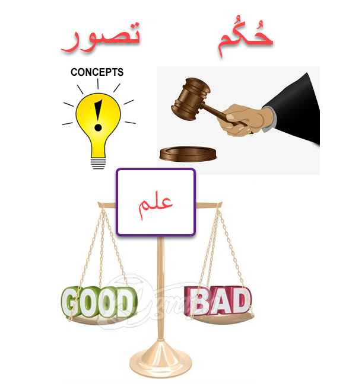

The foundation of that understanding first involves a concept, which is تصور in Arabic. It is a conceptualization of that reality, which is then followed by a حکم a ruling or judgment about the authenticity of that reality. The Arabs say:

الحُکمُ علی شَیء فرحٌ عَن تَصَوُّرِہِ

Before you can judge a thing you must define it, and understand it in all of its comprehensible dimensions. Then once you conceptualize that reality you can pass a judgment on whether it is true for false; good or bad etc.

Propositions

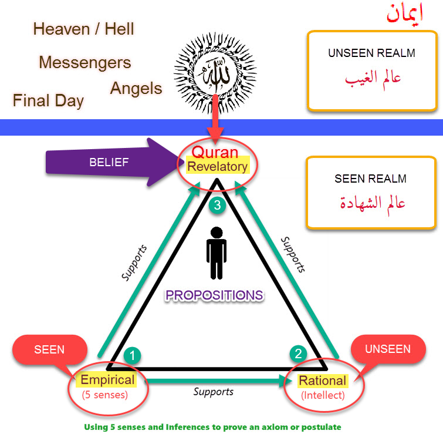

Now how do we as human beings do that? How do we conceptualize things? Scholars say that there are 3 types of propositions. First of all what is a proposition? Let's start there... A proposition is a statement or an assertion that expresses a judgment or an opinion. So I propose to you that "fire burns", or "fire is bright". Now you take that proposition and based on your observations, you conclude whether that statement is true or false. That's how a proposition works. Scholars say that there are 3 types of propositions:

- Empirical Propositions

- Rational Propositions

- Philosophical/Revelatory Propositions

### Empirical Propositions

The first are the "empirical propositions", which are based on our observation or experience, utilizing the 5 senses (sight, hearing, smell, taste, touch). These are also called sensory propositions. These deal with the realm that can be witnessed [which the Quran calls عَالَمُ الشَّھَادَۃِ]. So when I propose to you that fire is hot, it is bright, when it combines with oxygen, combustion takes place, these are all empirical or sensory propositions, right? Because you can observe the validity of these propositions using your 5 senses.

### Rational Propositions

The second are "rational propositions", which are logical propositions, like 3 + 2 equals 5, therefore 5 - 3 must be 2. These propositions work through inference. If I see smoke rising in the distance, I can infer that there is a fire there, even though I am unable to see the fire itself, you see? Based on my prior empirical knowledge that when something burns, it emits smoke, I can rationally deduce that there has to be a fire there. But then if smoke is the only thing I'm factoring in, my inference could be incorrect. The smoke could be from a large group of people having a cigar party. So then what is needed to maintain that rational proposition of "fire", is **more** empirical evidence. If I start walking towards the smoke, and I see things getting brighter and the air getting warmer, then the probability of my rational proposition, of there being a fire in the distance increases. Because now I have more empirical data in the form of light and heat to support my rational proposition. In other words, the more empirical evidence we have, the stronger the rational proposition becomes. Makes sense?

That's how "Sherlock Holmes" works. He uses empirical data to deduce rational propositions.

### Philosophical / Revelatory Propositions

The third type of propositions are the "philosophical or revelatory" propositions. These are the Quranic propositions that talk about عَالَمُ الْغَیْبِ- The Unseen Realm. It talks about the existence of a creator, angels, divine books, messengers, day of judgment, heaven and hell. That's basically what the Quran does. It offers Philosophical or Revelatory propositions. It proposes the idea of an afterlife, day of judgment, heaven and hell. These are the things we put our faith in. Our ایمان is grounded in these revelatory propositions. But how do we get there? How are we able to believe in these completely unseen, metaphysical propositions? Think about the best way possible to reveal the the hidden realm to intellectual human beings? The simplest way is to model or fashion a physical universe on the exact same principles as the spiritual universe! So that everything in that physical universe points back to the workings of the spiritual universe. That would be the most simple and efficient solution, right? Now the object that points to a destination is called what? It's called a sign! So Allah says:

‏سَنُرِيهِمْ آيَتِنَا فِى ٱلأٓفَاقِ وَفِىٓ أَنفُسِهِمْ

We will show them our signs, our evidence! Where? فِى ٱلأٓفَاقِ in the horizons. What do we find in the horizons? Empirical evidence! Everything we find outside of us exists in the form of observable data. Everything we see around us (that is physical in nature) are things we can see, hear, touch, taste and smell. وَفِىٓ أَنفُسِهِمْ And within their own selves. Because as rational human beings, we can deduce and infer rational propositions through empirical data! Therefore:

‏سَنُرِيهِمْ آيَتِنَا فِى ٱلأٓفَاقِ وَفِىٓ أَنفُسِهِمْ -

We will show them the evidence of the unseen realm in the form of empirical and rational data of this universe. How much evidence?

حَتَّىٰ يَتَبَيَّنَ لَهُمْ أَنَّهُ ٱلْحَقُّ

Unlimited evidence - until it becomes absolutely clear to them that these "revelatory" propositions are true.

So for example, Quran tells us that Allah is the creator of this universe. The fact that this universe is a "created" entity, is supported by our rational and empirical observations. Because we know there was a time in the past when this universe did not exist. We also know that there will come a time in the future when it will return back to non-existence. Existence and non-existence are both attributes of creation, therefore rationally speaking, this universe is a creation. Similarly, empirical data confirm that every creation necessitates the existence of a creator. So if this universe is a creation, it must also have a creator. So then when the Quran proposes:

اللہ الذی خلق السماوت و الارض

Allah is the one who created the heavens and the earth; that "revelatory proposition", gets backed up and supported by rational and empirical evidence found in the horizons that the human mind can understand and process. Now if we can believe this particular proposition, rationally, it makes it easier to believe when Allah says, that he also created a spiritual universe. Because logically speaking, the one who has the power to create this physical universe, must also have the power to create the spiritual universe.

So if you can truly understand this phenomenon, you can truly appreciate the motive of the Quran. This is why, everywhere in the Quran, Allah asks us to reflect on the "creations" of the heavens and the earth. He never asks us to reflect on Allah himself, right? Because that would be impossible for us to do without the empirical and rational data of this physical world. That's why he says:

إِنَّ فِى خَلْقِ ٱلسَّمَوَتِ وَٱلْأَرْضِ وَٱخْتِلَفِ ٱلَّيْلِ وَٱلنَّهَارِ لَآيَتٍۢ لِّأُو۟لِى ٱلْأَلْبَبِ

No doubt about it, in the **creation** of the heavens and the earth, and the conflict between night and day, there are signs for the people of intellect. The use of the word لُب is very interesting here. Because it means a pith, or the seed, which is always hidden in the earth. This is why the intellect, is our vehicle of understanding because it can penetrate the unseen through the seen. It can deduce the existence of the hidden seed and the hidden roots, simply by observing the existence of the plant. We don't need to uproot and dig out the plant to conclude the rational proposition that it has roots. This is why Allah's demand to reflect on his creations!! Why? To gather the empirical and rational evidence that he created for our intellects in order to make it easier to believe the revelatory proposition. And this why Maulana Ali taught us:

لَا تَفَکَّرْ فِی اللہِ ..... ولاکن تفکر فی خلق اللہ

Don't reflect upon Allah; instead reflect upon the "creations" of Allah. Because in the witnessing of this universe, lies the evidence for what exists beyond it. The more we reflect on this physical creation, the more it will answer questions about the spiritual creation, and particularly its creator!

So the Quran proposes:

أَنَا اللَّـهُ الْعَزِيزُ الْحَكِيمُ

Indeed I am Allah! The most powerful and full of wisdom. You examine the universe and you will find the empirical and rational data to support that claim. Your study will reveal that this universe could only have been created by someone who is incredibly powerful and incredibly wise. Because there is purpose behind the existence of everything in creation. Therefore there has to be a purpose behind human creation!

The Quran proposes:

> ‏ٱلرَّحْمَنُ ‎۱‏عَلَّمَ ٱلْقُرْآنَ ‎۲‏خَلَقَ ٱلْإِنسَنَ ‎۳‏عَلَّمَهُ ٱلْبَيَانَ ‎۴

The intensely merciful taught the Quran, created man and taught him speech. A careful study of these acts of teaching the Quran, creating mankind and granting him the ability of speech; they will clearly prove that this could only be the act of a ٱلرَّحْمَنُ. Quran proposes:

اللَّهُ لا إِلَهَ إِلا هُوَ الْحَيُّ الْقَيُّومُ

Allah is the one that there is no deity worthy of worship except him. He is eternally living, and the ultimate maintainer of things. Empirical and rational data proves that you have to be alive in order to maintain. We know that all life on this earth is temporary; every creation will inevitably die. And if you're going to die, you will not be able to maintain; you will not be able to sustain and provide those that are dependent on you. Therefore only the ever-living can be the ultimate maintainer and sustainer. Which then supports the next revelatory proposition:

لا تَأْخُذُهُ سِنَةٌ وَلا نَوْمٌ

He never gets drowsy nor does he sleep. We know that drowsiness reduces are mental capabilities and focus. Sleep completely eliminates it for the time being. Therefore the one in a drowsy state, or an unconscious state, could not be considered all mighty, or the ultimate maintainer and sustainer. Because focus and vigilance is required for constant maintenance, right? And so if you look at the remaining propositions:

لَهُ مَا فِي السَّمَاوَاتِ وَمَا فِي الأَرْضِ

Everything in the heavens and earth belong to him

مَنْ ذَا الَّذِي يَشْفَعُ عِنْدَهُ إِلا بِإِذْنِهِ

Who can intercede on anyone's behalf without his permission

يَعْلَمُ مَا بَيْنَ أَيْدِيهِمْ وَمَا خَلْفَهُمْ وَلا يُحِيطُونَ بِشَيْءٍ مِنْ عِلْمِهِ إِلا بِمَا شَاءَ

He has complete knowledge of what lies ahead and what has come to past. And no one shares that knowledge except for those that he chose to share it with

وَسِعَ كُرْسِيُّهُ السَّمَاوَاتِ وَالأَرْضَ وَلا يَئُودُهُ حِفْظُهُمَا

His throne sits over the heavens and the earth; he maintains control over the universe and that maintenance does not tire him out; it does not bore him out

وَهُوَ الْعَلِيُّ الْعَظِيمُ

And he is the all mighty and the all-exalted

If we carefully analyze and study these revelatory propositions in the light of the empirical and rational data that this universe provides, it becomes easy to believe in the very first statement, that: اللَّهُ لا إِلَهَ إِلا هُوَ Allah is the one and only deity worthy of my worship. Because no other creation in this universe, animate or inanimate fits that lofty description. Therefore, if I do choose an entity for worship, it only makes sense that I choose Allah.

So that's the first part of the formula - the design of the horizons, the آفاق, that provide the empirical and rational evidence to support the revelatory propositions offered by the Quran. They give us with a pathway to understand who our creator is, and the kinds of magnificent capabilities he possesses. Because the effects of his divine attributes reflect in his creation! This is the story of the Martian and the iPad from that session on Conclusions of Reflection.

### Self/Soul

The second part of the formula was the أنفس - the soul or the self. And what question does our soul or spirit answer? It answers the question of what Allah wants from us. How is that? To understand that, let's go back to that point in time when Allah سُبْحَانَهُ وَتَعَالَى decided to create the first soul - which was Adam AS. How did he describe his intentions to the angels? He said:

> ‏وَإِذْ قَالَ رَبُّكَ لِلْمَلَٓئِكَةِ إِنِّى جَاعِلٌۭ فِى ٱلْأَرْضِ خَلِيفَةًۭ ۖ قَالُوٓا۟ أَتَجْعَلُ فِيهَا مَن يُفْسِدُ فِيهَا وَيَسْفِكُ ٱلدِّمَآءَ وَنَحْنُ نُسَبِّحُ بِحَمْدِكَ وَنُقَدِّسُ لَكَ ۖ قَالَ إِنِّىٓ أَعْلَمُ مَا لَا تَعْلَمُونَ ‎۳۰
>
> And when your Lord said to the angels: "Verily, I am going to place generations after generations on earth." They said: "Will You place therein those who will make mischief therein and shed blood, - while we glorify You with praises and thanks and sanctify You." He said: "I know that which you do not know."

He said to the angels, I am going to create my caliph (my خلیفۃ) on this earth. Now let's understand the meaning of this word خلیفۃ. The word خلیفۃ comes from the root word خَلَفَ, which mean "back" or "behind". سَلَفَ is the antonym which means the ahead. So خلف means the one who is behind, or the one who follows; or the one who succeeds. In other words, خلیفۃmeans the representative. Allah said to the angels, I am planning to create my representative on earth. Now, think about this term - representative!

Caliph

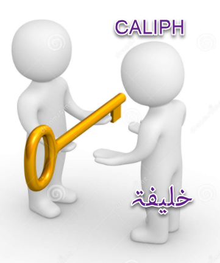

A representative is a person chosen or appointed to act or speak on behalf of another person. Now the questions you have to ask is, if you had to choose someone to accurately represent you, what kind of traits would you want in that person? Someone who has the same or similar traits, if not the exact traits as you, right? Otherwise, how else would that person be able to represent you and your thoughts? This is why we learn in the story of creation of Adam, not only did Allah create Adam AS, he also taught him all his traits

> ‏وَعَلَّمَ آدَمَ ٱلْأَسْمَآءَ كُلَّهَا ثُمَّ عَرَضَهُمْ عَلَى ٱلْمَلَٓئِكَةِ فَقَالَ أَنۢبِـُٔونِى بِأَسْمَآءِ هَٓؤُلَآءِ إِن كُنتُمْ صَدِقِينَ ‎۳۱
>
> And He taught Adam all the names , then He showed them to the angels and said, "Tell Me the names of these if you are truthful."

He taught Adam all the names. He taught Adam all the divine traits. In other words, he trained Adam AS in all the divine traits that Allah himself possessed. Then he presented Adam AS to the angels and challenged them with those traits. What did the angels say?

> ‏قَالُوا۟ سُبْحَنَكَ لَا عِلْمَ لَنَآ إِلَّا مَا عَلَّمْتَنَآ ۖ إِنَّكَ أَنتَ ٱلْعَلِيمُ ٱلْحَكِيمُ ‎۳۲

The angels said: May you be glorified, we do not know anything other than what you have taught us. We have not received the training that Adam AS has received. Therefore we admit that we cannot be your true representatives on earth. That was their original argument remember?

> ‏وَإِذْ قَالَ رَبُّكَ لِلْمَلَٓئِكَةِ إِنِّى جَاعِلٌۭ فِى ٱلْأَرْضِ خَلِيفَةًۭ ۖ قَالُوٓا۟ أَتَجْعَلُ فِيهَا مَن يُفْسِدُ فِيهَا وَيَسْفِكُ ٱلدِّمَآءَ وَنَحْنُ نُسَبِّحُ بِحَمْدِكَ وَنُقَدِّسُ لَكَ ۖ قَالَ إِنِّىٓ أَعْلَمُ مَا لَا تَعْلَمُونَ ‎۳۰

Do you really want to create a representative who will spill blood and wreck havoc? We are the ones who are constantly praising and glorifying you. We are the ones who can represent you on earth; we are the ones who can be your true خلیفۃ- why do you need Adam for that? But once Allah created and trained Adam to reflect his divine attributes in character, they all accepted, and in a sense validated and confirmed, that indeed, it is only Adam, or mankind, that possesses the true capabilities to represent Allah سُبْحَانَهُ وَتَعَالَى on the earth.

This is the concept of Allah creating man in his own image. We possess all the attributes that our creator, our master possesses. We know Allah can see. He see's our actions and our deeds

وَٱللَّهُ بِمَا تَعْمَلُونَ بَصِيرٌۭ

We know Allah can hear

وَهُوَ ٱلسَّمِيعُ ٱلْعَلِيمُ

This is why he gave us the ability to hear so that we could accurately represent his qualities on this earth. But not just that, also be able to understand what he means when he says he watches our actions and hears our cries and supplications. You understand?

We know Allah can act, because we have the ability to act

كُلَّ يَوْمٍ هُوَ فِى شَأْنٍۢ

Every single day he is busy in work. We know Allah has the ability to love! Because the Quran says that he loves everything that is good, clean and pure

إِنَّ ٱللَّهَ يُحِبُّ ٱلتَّوَّبِينَ وَيُحِبُّ ٱلْمُتَطَهِّرِينَ

This is why he gave us the ability to love! And this is why it is in our فطرۃ; our natural predisposition, to love clean and pure things. Because that is why our creator loves! You see that?

Similarly, we also know that Allah has the ability to hate and dislike

وَٱللَّهُ لَا يُحِبُّ ٱلْفَسَادَ

Allah hates or dislikes corruption. This is why he put it in our innate nature to dislike and be repelled and be disgusted with filth and foulness.

This is all because we have been created in God's image. We have been created with the same divine attributes that Allah possesses, so that we could be his true representatives, his true خلیفۃ on this earth. Why? So that we could truly come to know and understand our creator. You want to know what Allah wants from you? Its very simple! Just look at your own self?

‏وَفِىٓ أَنفُسِكُمْ ۚ أَفَلَا تُبْصِرُونَ ‎

Why do you not reflect on your own self? Just see what you want for your own self, that is exactly what I want from you! SubhanAllah! Do you want justice? I want justice! Do you want to be loved? I want you to love me. Do you like to be praised? I like to be praised! Do you like it when people are grateful to you? I like it when my creation is grateful to me! Do you feel angry when people mess with your possessions and your rules? I get angry when you mess with my possessions and my rules! You want others to make you a priority in their lives? I want you to make me a priority in your life! You see?

Read the entire Quran cover to cover. There is not one thing that Allah demands from us in the Quran, that you and I would not demand from someone else. So if you want to know what Allah wants from you; all you have to do is reflect on your own self. What is it that you would want for your own self from other? That is exactly what I want from you. You want to be treated kindly? I want to be treated kindly. You want to be treated like you matter? I want to be treated like I matter to you. You want credit for the things you made? I'd like to be credited for the things I made - for making you and making this universe for you! SubhanAllah!

You ask questions about who created this universe? Ask yourself that question! Because I created you in my image! I created you with the same abilities I possess. I am خالق. I am the creator, I gave you the ability to create and construct. I made you خالق. Can even a needle exist in your world unless you create it? Then how can you even think, being created in my image, how can you even think that this universe came into existence without a creator?

You complain to me about the state of this world? You ask me, why don't I do something about it? I did! I created you! I created you in my own image! I gave you all my powers! Why aren't you doing something about it instead of complaining to me? You complain about poverty and misery, why don't you spend out of the wealth I gave you to make it better and easier with others? You talk about injustice, why don't you spend out of your courage that I gave you and fix those injustices! You see blind people, why don't you become their sight? You see weak people, why don't you become their strength? I gave you everything you need to fix the conditions of this world! But you do not want to step out of your comfort zones. All you want to do is complain, and have other people solve your problems for you. Well that's not how it's going to work! Because I created you as gods. I created you as الہ. Each and everyone of you has been created with the capabilities of an الہ so that you can recognize and identify the ال الہ - So that you can understand what your اللہ wants from you! SubhanAllah!

If you want to answer questions about what I want from you, all you have to do is look within your own self and study your own capabilities and desires, and you'll come to know what I want from you.

مَنْ عَرَفَ نَفْسَہُ فَقَدْ عَرَفَ رَبَّہُ

The one who comes to know of his own self, comes to know of his master! Because the slave has been created in the image of his master.

### Rights Of Allah

This opens up a world of reflection for all of us. There is so much to talk about on this topic that it's simply not possible for me to cover in these sessions Each and everyone of you is going to have to reflect on this and find answers for your own individual questions. But there is one thing I will talk about today in this context. I'll put one example in perspective for us - and that is the topic of "rights" - حقوق.

As human beings we have certain rights! We are entitled to certain fundamental rights. Based on what we've learnt today, we have to understand that Allah has rights. Just as we have certain human rights, Allah has certain divine rights. Human rights are based on divine rights; divine rights are not based on human rights. Which means that if human rights are important, then divine rights are a lot more important. One of the rights we have is the right to be treated with honor. After what a parent does for her child; after what a mother goes through to bring her child in this world, she gains a right of gratitude over the child. After the hard work a sincere and dedicated teacher puts in for her students, she gains a right of gratitude over her students; a right to be respected; a right to be treated with dignity and honor. Now if we as created beings, understand and appreciate the rights of human beings over one another; then what is the right of the one who created us all from nothing?

وَاللَّـهُ أَخْرَجَكُم مِّن بُطُونِ أُمَّهَاتِكُمْ لَا تَعْلَمُونَ شَيْئًا

What is the right of Allah who brought you out from the wombs of your mothers in a state where you knew nothing.

وَجَعَلَ لَكُمُ السَّمْعَ وَالْأَبْصَارَ وَالْأَفْئِدَةَۙ

What is the right of Allah who then gave you hearing and sight and a beating heart?

لَعَلَّكُمْ تَشْكُرُونَ

So that you could become grateful!

As human beings when we provide for someone, the least that we can expect back is their gratitude. A fair trade would be to expect the same or similar act of generosity back from them. But if they do not do that, then the very least we can expect from them is their gratitude. So then what about

لَا نَسْأَلُكَ رِزْقًاۖ نَّحْنُ نَرْزُقُكَۗوَ

We do not ask you for provisions; Indeed it is we that provide to you! So then what about that right of gratitude towards the one who takes nothing, and gives everything?

وَمَا بِكُم مِّن نِّعْمَةٍ فَمِنَ اللَّـهِۖثُمَّ

Any and every good thing that you have in your possession, has been given to you by Allah.

If we create something for a purpose; if we invent something for a purpose; as human beings we have the right to demand that it be used for the right purpose. We demand that it be used to serve the purpose it was created for. If not, we have the right to be upset! We have the right to demand justice. We have the right to sue the offender. Then what about the purpose of Allah's creation?

وَمَا خَلَقْتُ الْجِنَّ وَالْإِنسَ إِلَّا لِيَعْبُدُونِ

And indeed I have not created jinn and mankind except to worship me. How are we fulfilling that right of Allah? Does have the right to get upset and angry when we do not fulfill those rights?

We all have to really think about this divine formula that Allah سُبْحَانَهُ وَتَعَالَى has given us through this verse of

‏سَنُرِيهِمْ آيَتِنَا فِى ٱلأٓفَاقِ وَفِىٓ أَنفُسِهِمْ

We will show them our signs in the horizons and in their own selves, so that they can come to recognize who Allah is and what he wants from them. May Allah bless us all with the wisdom to fulfill his rights and obligations; and enable us to treat him with the honor and dignity he deserves! Because if anyone in this world treated us the way we treat Allah, I swear we would be extremely offended! Because we have been created in the image of the one who has ultimate rights. And that is all we truly are. An image! A Reflection of a distorted version of the divine attributes. We are not real. We are an illusion; just as the reflection in a mirror is a temporary illusion. We are here this moment; and we're gone the next. But Allah is real! His rights are real! His obligations are real!

I'll end the session with a beautiful story I heard recently. There was a man who heard about this very learned saint. He decided to go visit him and ask him for advise. So he travels a long distance and finally meets this saint. He greets him and says: I have heard that you are a great scholar and a ولی , a friend of Allah. Please give me some advise! The saint says to the man: My advise to you is, "If you do not consider Allah your superior, then at least consider him your equal". The man upon hearing this advise, says to himself, "What kind of a silly advise is this? Who would be so foolish as to not consider Allah his equal?! Is this what I traveled all the way for? I wasted my entire trip visiting this so called saint". Now he's thinking all this, and the saint is reading his thoughts. The saint says to him: You must be tired from your long journey. Why don't you spend the night in this inn and leave in the morning. The man agrees to that, and he spends the night in the inn. The next morning when he wakes up and offers his morning prayers, a servant comes to his door carrying a large tray. On that tray, one one side, there was fresh breakfast for the man. It had 4 eggs, 4 buttered toasts, 2 pieces of chicken, 2 glasses of orange juice. On the other side of the tray there was yesterdays food - some stale bread and lentils. Just as the man was about to eat, a beggar comes at the door, and calls out to the man! He says, "In the name of your creator I ask you for help. I haven't eaten for 2 days! For the love of your master, please give me something to eat". So the man gives the stale bread and lentils to the beggar and eats all the fresh food.

After breakfast, he gets ready to leave and decides to visit the saint in order to bid him farewell. He finds the saint and says his goodbyes. Just as he's about to leave, the saint says to him: My son! Remember my advise! "If you do not consider Allah your superior, then at least consider him your equal". The man loses it, and he yells at the saint: What kind of a stupid advise is this? Who in this world would be so foolish as to not consider Allah his superior. Even a child knows such a simple thing, and you're giving me such a ridiculous advise?!

The saint becomes furious at the man. He says listen! This morning when you sat down for breakfast, there was fresh food as well as stale food on your plate. A beggar came to you and asked you for food, in the name of your creator! He asked you for food in the love of your master! Had you considered Allah superior to yourself, you would have eaten the stale bread and lentils, and given the fresh food to the beggar! Had you considered Allah your equal, you would have shared your fresh food with the beggar! You would have eaten 2 eggs, and given 2 eggs to him. You would have eaten 2 toasts, and given 2 toasts to him. You would have enjoyed one glass of orange juice and let the beggar enjoy the other one. Oh wretched creation! Forget superior, you did not even consider Allah your equal!

I'll end today's session with the same advise to myself and everyone else: "If we do not consider Allah our superior, then considering his rights upon us, and remembering all his favors upon us, let us at least consider him our equal"

## The Horizons And The Soul

In the previous session we looked at the Quranic formula that allows us to gain some understand about who are creator is and what his intentions are. That Quranic formula is declared in the verse

Formula

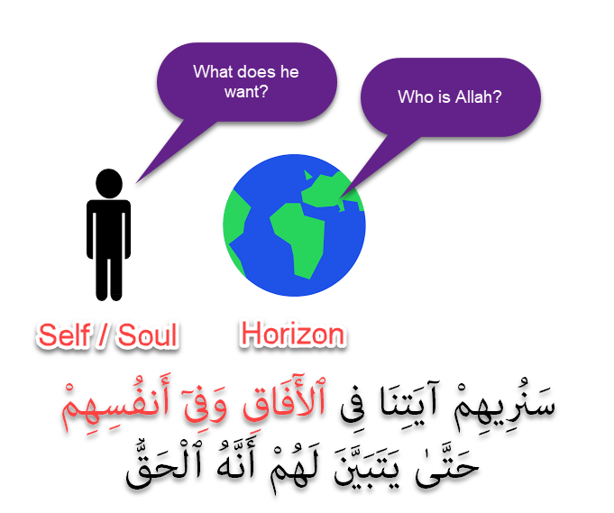

‏سَنُرِيهِمْ آيَتِنَا فِى ٱلأٓفَاقِ وَفِىٓ أَنفُسِهِمْ حَتَّىٰ يَتَبَيَّنَ لَهُمْ أَنَّهُ ٱلْحَقُّ ۗ أَوَلَمْ يَكْفِ بِرَبِّكَ أَنَّهُۥ عَلَىٰ كُلِّ شَىْءٍۢ شَهِيدٌ‎

We will show them Our Signs in the universe, and in their own selves, until it becomes absolutely clear to them that this is the truth. The signs in the horizons tell us about the nature and capabilities of Allah, whereas the signs in our souls tell us about the intentions of Allah; because Allah created us all in his own image, and he only demands for himself what we demand from others in terms of rights.

And this is how in these analogies between the ظاہر and the باطن - the horizons and the soul, we find insights into the inner workings of دین. Rasul Allah ﷺ said in a HADEES:

اِنَّا اللہ اَسَّسَ دِینَہُ عَلیَ مِثاَلِ خَلقِہِ لِیَستَدِلَّ بِالدِّینِ عَلَی الدُّنیَا ؛ وَ الدُّنیَا عَلَی الدِّین

Indeed Allah founded his religion on the pattern of creation, to provide evidence for his religion through the world; and to provide evidence for the world through his religion. In other words, he created the physical world on the exact same principles and patterns as the spiritual world. Why? So that the human intellect could study the physical, and then be able to relate those teachings with the spiritual. So horizons and the soul, or the self, are the keys to learning about Allah سُبْحَانَهُ وَتَعَالَى.

### Horizon - Refraction Of Attributes

He dispersed the knowledge of who he is in the horizons. A simple way to understand this concept is the example of light. If you look at light, we know that light is white. They call it white light, that does not have any color.

White Light

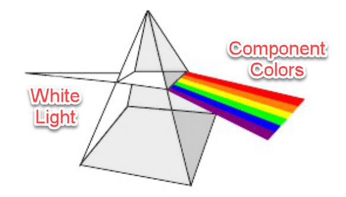

But what happens when you pass that light through a prism? We know that a prism is a medium of glass. When this white light hits this glass - it refracts; it bends. As a result of that, a whole spectrum of colors show up - from violate to red and everything in between. In the same way, when the light of Allah سُبْحَانَهُ وَتَعَالَى hits creation - because the Quran tells us that Allah is the light of the heavens and the earth:

اللہ نور السموت والارض

Divine Light

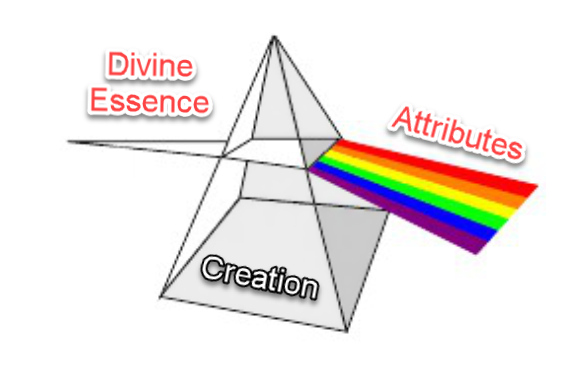

So what happens is, when this pure light of Allah's **essence **hits creation; when it enters the realm of physicality, it refracts into the spectrum of these divine attributes. This is why we get all of these different manifestations of Allah سُبْحَانَهُ وَتَعَالَى's essence in this universe. You see? This عالم is the prism that is manifesting Allah's various attributes in creations for us to observe. So in one instance we see that Allah is کریم He is generous; and in another instance the universe shows us that he is جبار (the compeller). In another instance the عالم reveals to us that he is قھار (the subduer); in another instance we see that he is عزیز (the powerful); in another instance he is مُزِل (the humiliator); In another he is معز (the bestower of honor). So the عالم essentially serves as colossal theater, for the divine manifestations of these attributes of Allah - through which we come to know about him.

Why did he set the stage up this way? Because as I mentioned earlier, the human intellect learns by defining and limiting things; just as the body works by breaking down food. The intellect, like the body, in order to digest knowledge, has to take in the whole, break it down into parts, and then understand each part individually. Only then it can sum those parts up again to understand the whole. The عالم presents us the parts in the form of these divine attributes, so that we can reflect on them individually and then sum them up to put together a more complete understanding of our creator. This is the essential theme of Quran. It invites us to reflect on the heavens and the earth; the horizons and the souls - because through that very reflection, we will recognize our creator and his abilities. And then it turns our attention inward on to the soul (the نفس), to understand the purpose of our own creation! What is the purpose of our creation?

### Soul: Purpose Of Creation

Scholars state that there are 3 reasons for the creation of human beings- and what's beautiful about this distinction is that it allows for purposeful existence for not just Muslims but for people of other beliefs as well; or even for people without belief.

Purpose of creation

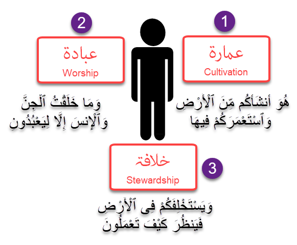

The first one he says is for عمارۃ. Allah سُبْحَانَهُ وَتَعَالَى said:

هُوَ أَنشَأَكُم مِّنَ ٱلْأَرْضِ وَٱسْتَعْمَرَكُمْ فِيهَا

We brought you forth from the earth to cultivate it. The second reason he says, is عبادۃ

‏وَمَا خَلَقْتُ ٱلْجِنَّ وَٱلْإِنسَ إِلَّا لِيَعْبُدُونِ

We only created the jinn (which are beings of the unseen realm) and humans (beings of the seen realm) for عبادۃ for willing worship. ابن عباس said in a narration that the purpose behind the creation of human beings was also to لیعرفون - to know God; and to know god is to love god. Those of you who heard my session on stages of love, know that عبودیۃ is one of the levels of محبۃ - of love. It is one of the higher level of love. Therefore, he created the jinn and the humans to love him.

The third and last reason for the creation of human beings is خلافۃ:

وَيَسْتَخْلِفَكُمْ فِى ٱلْأَرْضِ فَيَنظُرَ كَيْفَ تَعْمَلُونَ

We made you خلفاء because the خلیفۃ, The caliph is the one who stands in place of somebody else. He is the one who is left behind - ُخَلَفَہ. He is left behind to stand in the place of someone else. In other words a خلیفۃ is a steward. Allah created us as his stewards on this earth. Why? فَيَنظُرَ كَيْفَ تَعْمَلُونَ, so that he can witness what we do with all the external and internal gifts he blessed us with.

Now there are 2 types of خلافۃ. We have been made a caliph over ourselves, and then over others. For the خلافۃ of the self Allah said:

وَإِذْ قَالَ رَبُّكَ لِلْمَلَٓئِكَةِ إِنِّى جَاعِلٌۭ فِى ٱلْأَرْضِ خَلِيفَةًۭ

Allah said to the angles, I have decided to create a caliph in the earth. In سُورَۃُ الصَّوَادِ He said to داود علیہ السلام . He said:

Sad [38:26]

> ‏يَدَاوُۥدُ إِنَّا جَعَلْنَكَ خَلِيفَةًۭ فِى ٱلْأَرْضِ فَٱحْكُم بَيْنَ ٱلنَّاسِ بِٱلْحَقِّ وَلَا تَتَّبِعِ ٱلْهَوَىٰ فَيُضِلَّكَ عَن سَبِيلِ ٱللَّهِ ۚ إِنَّ ٱلَّذِينَ يَضِلُّونَ عَن سَبِيلِ ٱللَّهِ لَهُمْ عَذَابٌۭ شَدِيدٌۢ بِمَا نَسُوا۟ يَوْمَ ٱلْحِسَابِ ‎۲۶

Oh داؤد! We have made you a caliph in the earth. This is the second type of خلافۃ that is mentioned in the Quran. So there are two types of خلافۃ. The first one is to rule yourself; and the other is to rule others! But the condition of ruling others, is that you rule yourself first! That you take over control and mastery of your نفس first. And so here داؤد is being told, we have put you in the earth to rule over others - he was made a ruler over بَنِی اِسْرَائِیلَ; so that

فَٱحْكُم بَيْنَ ٱلنَّاسِ بِٱلْحَقِّ ; you judge among them with the truth and then he says:

وَلَا تَتَّبِعِ ٱلْهَوَىٰ ; do not follow your caprice! In other words, you have to rule yourself first, before you can rule others. Because if you don't do that

فَيُضِلَّكَ عَن سَبِيلِ ٱللَّهِ , the ف here is for causation; because if you do not! If you follow your caprice, your whims, your appetites, then it will lead you astray from the path of Allah.

So what are we as Caliphs of Allah? And how are we doing as Allah's representatives on earth? Allah says:

سَنُرِيهِمْ آيَتِنَا فِى ٱلأٓفَاقِ وَفِىٓ أَنفُسِهِمْ حَتَّىٰ يَتَبَيَّنَ لَهُمْ أَنَّهُ ٱلْحَقُّ ۗ أَوَلَمْ يَكْفِ بِرَبِّكَ أَنَّهُۥ عَلَىٰ كُلِّ شَىْءٍۢ شَهِيدٌ

We will show them Our Signs in the horizons, and in our own souls. Allah will let us know through signs of what we see around us - our own truth and realities! So let's look at some of the signs that we see in our horizons today to reflect on who we are and how we're doing as caliphs of Allah; just as a physician would look at the symptoms of an ill patient. Allah says in سُورَۃُ الرُّومِ

The Romans [30:41]

> ‏ظَهَرَ ٱلْفَسَادُ فِى ٱلْبَرِّ وَٱلْبَحْرِ بِمَا كَسَبَتْ أَيْدِى ٱلنَّاسِ لِيُذِيقَهُم بَعْضَ ٱلَّذِى عَمِلُوا۟ لَعَلَّهُمْ يَرْجِعُونَ ‎۴۱

Mischief, corruption, pollution has appeared on the land and sea, because of what the hands of men have earned. لِيُذِيقَهُم , the لام there is again for causation

لِيُذِيقَهُم بَعْضَ ٱلَّذِى عَمِلُوا۟ لَعَلَّهُمْ يَرْجِعُونَ so that Allah can give them a taste of their deed,s in order for them to turn back. So the reason that Allah makes our negative actions have negative repercussions, is in order for us to return back to Allah.

Scholars say that ‏ظَهَرَ ٱلْفَسَادُ - is actually النقص فِى ٱلْبَرِّ وَٱلْبَحْرِ. It means the diminished blessings of the earth. You lose the blessings of the earth; and it means also القحط which is droughts and famines and all the harms that come in agriculture. The fruits of the land - lands that stop growing crops. It also means the benefits of the oceans will diminish - from the fish and other animals that live in the oceans - like the whales. And this is going to happen because of what we earn from our sinfulness. Because human beings, even though created in the best of forms - in the very image of its creator; with all his divine attributes, is capable of extreme corruption when he deviates from his divinity; when he deviates from his original state. This is that very concern that the angels expressed when Allah mentioned the creation of Adam to them. They said

قَالُوٓا۟ أَتَجْعَلُ فِيهَا مَن يُفْسِدُ فِيهَا وَيَسْفِكُ ٱلدِّمَآءَ

Are you seriously considering creating a species therein who will create فساد and spill blood? The word فساد , if you look at it in the English language, it means rottenness, corruption, decay, decomposition, putrid, depravity, wickedness, viciousness, inequity, immorality, weakness, perversion, wrongness, incorrectness. All of these, are meanings embodied in that word فساد. If you look at the word pollution in the English dictionary, it says: Undesirable state of the natural environment being contaminated with harmful substances as consequences of human activities.

بِمَا كَسَبَتْ أَيْدِى ٱلنَّاسِ - This is the result! So even in our language, pollution is a dominant problem on the planet.

We as human beings, are responsible for the present state of the earth today. Our conditions of hardships in the form of famines and extreme weathers, and earthquakes and floods are nothing other than بِمَا كَسَبَتْ أَيْدِى ٱلنَّاسِ - from what our own hands have earned. Many countries are in major crisis because of fires that were started in forests. Climate changes are driving up temperatures; and as temperatures rise, there are more incidents of fires.

Another aspect of this فساد is the air itself. In India it has been estimated that half a million people die from air pollution. We had 15000 people die from terrorism - and the US government moved heaven and earth to have this war on terrorism - yet half a million people suffer and die from air pollution - where's the war against that? Noise pollution! In Pakistan and India, look at the levels of noise pollution in the form of honking and yelling and screaming and the noise from rickshaws and taxis with broken silencers. That's all man made فساد.

Today we know that the world is rapidly moving towards desertification. This is because we're losing what they call top-soil. Desertification is literally where a place that once had foliage becomes desert. It has already happened in large portions of fertile lands and it continues to grow. I was reading this book in which it said that there was a time, when all of north Africa was so fertile, that before بنو حِلاؤ got into Africa, a squirrel could run from سنجاب, from Egypt all the way to Morocco without its feet ever touching the ground. The land was so fertile! But when the بنو حلاؤ came, they were like locus! They completely devoured the resources. So desertification is another example of بِمَا كَسَبَتْ أَيْدِى ٱلنَّاسِ - from what our own hands have earned

Another aspect of فساد is as Allah says:

وَٱلْأَرْضَ وَضَعَهَا لِلْأَنَامِ

The earth has been put out for the انام. The word انام comes from نوم which means sleep. أنام are creatures that sleep. So this verse is about all sentient beings - it is not just for human beings. It includes the animal kingdom. Allah سُبْحَانَهُ وَتَعَالَى

> ‏وَمَا مِن دَآبَّةٍۢ فِى ٱلْأَرْضِ وَلَا طَٓئِرٍۢ يَطِيرُ بِجَنَاحَيْهِ إِلَّآ أُمَمٌ أَمْثَالُكُم ۚ مَّا فَرَّطْنَا فِى ٱلْكِتَبِ مِن شَىْءٍۢ ۚ ثُمَّ إِلَىٰ رَبِّهِمْ يُحْشَرُونَ ‎۳۸
>
> There is not a moving creature on earth, nor a bird that flies with its two wings, but are communities like you. We have neglected nothing in the Book, then unto their Lord they shall be gathered.

وَمَا مِن دَآبَّةٍۢ فِى ٱلْأَرْضِ وَلَا طَٓئِرٍۢ يَطِيرُ بِجَنَاحَيْهِ إِلَّآ أُمَمٌ أَمْثَالُكُم

That there is no creature on the earth that walks the earth; there is no bird that flies with its two wings, except that they have communities like unto you. Allah سُبْحَانَهُ وَتَعَالَى tells us that the animal kingdoms have communities just like us. Then he says he did not leave anything out from this book

مَّا فَرَّطْنَا فِى ٱلْكِتَبِ مِن شَىْءٍۢ

Even the animals are acknowledged in the Quran. We know that there are animals that mate for life. We know that animals make huge pilgrimage and vast migrations to places, just like we do. Today, because of the sins of mankind, dogs are on prosaic. In the United States they put dogs on prosaic - which are anti-depressants. Because they are depressed in the houses of depressed and miserable people. Dogs are not naturally depressed animals. But there are so many houses in the US that are sick, that the dogs and the cats themselves get sick - because they are sentient beings. They are emotional beings. They feel and experience emotions just like we do.

Look at the problem of endangered species caused by the hands of man. There are 25 critically endangered species of the world that are from the most beautiful and most majestic animals. These are animals that the Ancient Arabs used to name their children after! Animals like lions and tigers - أسد and فھد . These are animals that the Arabs - they named their men after مُفْتَرِسَات - after the animals that attack their prey! And they named their women after the prey itself like ماھا and غزالۃ. So فھد goes after ماھا and she doesn't stand a chance!!

But what's interesting, is that if you look at the species that are endangered today, they are not the cockroaches! They are not the rats! They are not the snakes! They are flourishing! The animals and species that are endangered are the ones that represent the divine qualities within us that are disappearing! The eagle, the peregrine, the lion, the tiger, the elephants - these animals represent the great qualities in human beings that are disappearing!

‏وَفِىٓ أَنفُسِكُمْ ۚ أَفَلَا تُبْصِرُونَ ‎

Within your own souls, why don't you reflect?! We've got plenty of cockroaches out there in human disguise! We have plenty of rats and snakes out there in human disguise! But we no longer find the courage of lions, and the majesty of the eagles in human form. These qualities are extinct from human beings!

I can go on an on about this; and I'm sure you can think of and add much more! But this is what we're doing as the caliphs and the stewards of Allah سُبْحَانَهُ وَتَعَالَى. We are destroying the very earth that sustains us and provides us with our livelihood! And then we complain that we have problems! Why doesn't Allah solve all our problems! Why should he? He's not our janitor! He's not our servant! He is not our errand boy! He created us in his image so that we could create جنۃ on earth just as he created جنۃ on heaven! Why else do you think Adam was created in جنۃ ? Just for fun? No! He was created in جنۃ so that he could see and experience the beauty of that place so that when he comes to the earth, he could cultivate the land and create that same جنۃ on earth!

وَ أَنشَأَكُم مِّنَ ٱلْأَرْضِ وَٱسْتَعْمَرَكُمْ فِيهَا

He brought you forth from the earth to cultivate it. To create that same جنۃ on earth! And what did we do? And why did this happen? How did things get so bad and out of hand? Because of **our** corruption. Because of our فساد , our deviation from the divine attributes and majestic qualities that Allah سُبْحَانَهُ وَتَعَالَى created us with. This is why he created the عالمین for us - so that we can study the signs of horizons - the heavens and the earth - to learn the ideal condition of the نفس - the ideal condition of the soul, through his divine attributes.

But we as human beings, as خَلِیفَۃُ اللَّہِ have failed miserably! And we have proven that the angels did have valid grounds for their concern! They clearly knew what they were talking about when they said:

أَتَجْعَلُ فِيهَا مَن يُفْسِدُ فِيهَا وَيَسْفِكُ ٱلدِّمَآءَ

Do you wish to create someone who will sow corruption on earth and spill blood? They clearly knew what they were talking about.

So what is it that we have deviated from? We have deviated from the divine attributes - from the character of Allah!

### AKHLAQ

Character

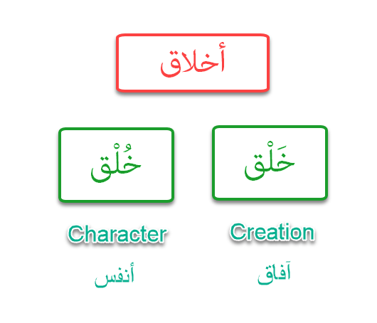

The word أخلاق comes from the word خُلق. And this is really interesting, because we are called خَلق. The word خَلق means creation, which is related to the body that is related to the horizons; and خُلق means character which belongs to the soul. They're both made up of the same letters and in the same sequence. Therefore according to the science of Arabic, both these words are closely related in meaning. The word خَلقis related to the body which is nourished by this physical world . The word خُلق is character, which takes its nourishment from the spiritual world. خَلق represents the existence of the body; and خُلق represents the existence of the soul. Both these words begin with the letter خ, which is a sound of friction in Arabic. It is a sound of effort. This is because the body takes effort to develop, and so does character. Character takes a lot of effort to develop. Therefore if خَلق is the essence of the body, then خُلق or character is the essence of the soul. When we die, the body returns back into the earth with whatever it has acquired from the physical world. And the soul returns back to the spiritual world with its nourishment of character that it has developed in the world. That's our true earning. That is our real acquisition خُلق, character! A soul that returns back to its master without a developed خُلق is an impoverished soul. It is a soul that has failed the purpose of its خلقۃ; it has failed the purpose of its creation. When the body is weak, it cannot benefit from the offerings of this physical world. We know that this world has a lot to offer in terms of temporal pleasures; but if you're extremely weak, you can't even get up off your bed, you'll not be able to enjoy those pleasures. In the same way a soul that is empty; that is bankrupt of أخلاق is not going to be able to benefit from the pleasures of the after life.

How is character developed? Through revelation! As I said, the Quran, in an oversimplified statement, is the explanation of divine attributes of Allah. It explains the attributes of Allah and why he has those attributes. He is عظیم, because he created this massive universe. He is قوی . All powerful because not only did he create this universe، he created it with one single command. کُن. Be and فیکون . it was. So in essence Quran is just the description of Allah's attributes explaining why he is ال الہ. Our hearts, witness these divine attributes in the light of revelation, which then creates **Belief**! The more the heart understands revelation, the more we grow in our belief - which then nourishes and develops our character. And so character is nothing more than absorbing these divine attributes into the heart from revelation, and then reflecting those same divine attributes into the rest of Allah's creation. That is what character is! It is internalizing, developing, and training the heart in the light of these divine attributes; and then reflecting them in our interactions with Allah's creation.

### Interactions In Islam

That is أخلاق and that is Islam. Islam is all about Interactions. It is معاملات. There are 3 types of interactions in Islam

1. Interaction with Allah - حُقُوقُ اللَّہِ

1. Interaction with the self - حُقُوقُ النَّفْسِ

1. Interaction with the creation of Allah - حقوق العباد

Huqooq Allah

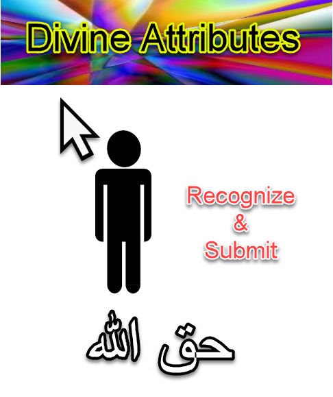

What right does Allah have over us? That we recognize his attributes in the heavens and the earth, and we come to love him, for everything he has done for us! And then out of that love, we willingly obey and serve him as faithful slaves - as عبد. That we worship him recognizing the fact that only he deserves to be worshiped! That is the right of the creator over his creation. What is the right of the self?

Huqooq Nafs

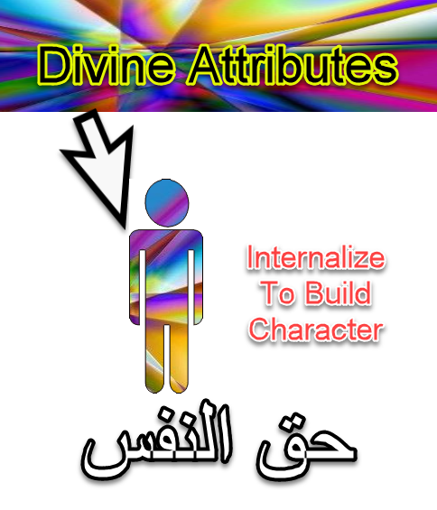

To reflect on the attributes of Allah in the عالم, through the teachings of Quran. To learn the attributes, the qualities, the character of our master, and to then internalize and harvest those qualities within our own hearts to develop our character; our أخلاق. Because we have been created in the image of our master. We have been created to represent our master on this earth - which means we have to adopt the qualities and characteristics of our master! That is what a خلیفۃ is - a representative! You can't represent unless you become like the one you are representing!

So for instance, Allah is کریم. He is generous. Therefore it is the right of my soul that I train it to be generous. What is the greatest generosity that I can show myself? To protect it from sins, and put it to work in good deeds. Allah is الحق, he is truthful! it is the right of my soul that I train it in being truthful. With who? Truthful with myself. What is the greatest falsehood that the self is trapped in? This delusion of the reality of دنیا. Therefore I must train myself to wake up from my delusions about this world. I need to wake up to the reality that I am only here for a short period of time. Everything that I'm working for in the worldly sense will be left behind. I will be left with nothing other than the title of میت in this world when I die. My loved ones, the people that I am slaving for day and night, they will be the first to dump me in a grave and throw dirt in my face. So I better not sacrifice my afterlife for this temporary life. That's being truthful to the self. So the right of the self, is that I internalize the attributes of Allah, and train myself in those attributes in order to develop my character, so that I can realize the potential I was created with. I was created in the image of god, to act like God. And God is nothing other than just! This is why one of the divine names of Allah is المؤمن, which essentially means - the giver of tranquility. The one who brings peace - comes from the root امن which means peace.

Huqooq Ibaad

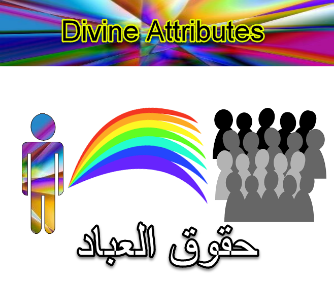

And finally there is the right of others. What are the right of others? What are حقوق العباد.

Right of Allah, was recognizing his divine attributes in creation, and submitting to him willingly and out of love in عبادۃ. Right of the self, was to internalize those divine attributes to build our character, aligning it with the character of Allah. To become like the creator! Once that character has developed, only then the final right of حقوق العباد comes into play, which is the idea of reflecting those divine attributes of Allah in interactions within his creation!

We trained ourselves to be generous with our own selves; now it's time to reflect that generosity on to others in our dealings with them. We trained ourselves to be truthful and sincere with our own selves. Now it's time to reflect that truthfulness. that صدق, that sincerity in our dealings with others. We've recognized how Allah is forgiving with us; how he is patient with us. We now have to reflect those attributes by being patient and forgiving towards others.

This is not an easy task! This is why one has to go through the training of fulfilling the previous 2 rights before he can fulfill this 3rd right! A man once came to the messenger of Allah and said.

یَا رَسُولَ اللہِ. اَصِلُ اَخِیہِ وَ یَقطَعُنِی ' وَ اُعطِیہِ وَ یَمنَعُنِی

Oh messenger of Allah, I give him but he withholds from me. I come to him but he cuts me off. What should I do? the Prophet replied, that is صلۃ الرحم. What you doing is the right thing! Continue meeting him even though he is cutting you off. That's Islam! This is Islam. And its hard work. Don't think this is an easy religion. But we want to be people that strive! We want to be people that honor ourselves, because Allah honored us when he said:

وَلَقَدْ كَرَّمْنَا بَنِىٓ آدَمَ وَحَمَلْنَهُمْ فِى ٱلْبَرِّ وَٱلْبَحْرِ

We have ennobled the children of Adam. We've made you leaders over the land and the oceans. We gave you a heart. We gave you an intellect. We nourish them with our revelation. We give you the ability to overcome the worst aspect of yourself; and even if you capitulate from time to time, we've given you the means to renew and restore your soul through توبۃ , through repentance. What a gift from Allah! So this is what we have to do, and we have to do it with أخلاص. with sincerity! Only for the sake of Allah. But it's not easy.

3 Dimensions Of Islam

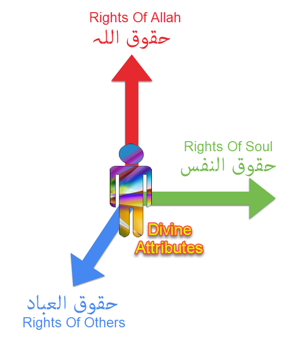

So these are the 3 dimensions of Islam. The rights of Allah, the rights of the self and the rights of others. Recognizing the attributes of Allah in the heavens and the earth help us understand the rights of Allah (حُقُوقُ اللَّہِ). Internalizing those divine attributes to build character is the right of the soul (حُقُوقُ النَّفْسِ). Reflecting those divine attributes on to the creation of Allah is the right of others (حُقُوقُ الْعِبَاد). And because this last one is the most challenging of all, it cannot be accomplished unless and until the soul itself has been illuminated with the character of Allah. This is why Rasul Allah ﷺ said in a HADEES:

أتخذو من أخلاق اللہ

Adopt the character and the qualities of Allah!

There is a narration in which Rasul Allah once saw a man talking to Maulana Ali in a very disrespectful manner. In in return, Maulana Ali responded back to him with kindness. Despite his kindness, this man continued to act in a disrespectful and manner with him. Yet Maulana Ali kept responding with kindness over and over again. When the man left, the prophet asked him, یا علی! I saw this man talk to you in such a disrespectful manner, treat you in a horrible way - over and over again. Yet you kept showing him kindness and respect in return. Why is that? Maulana Ali replied: یَا رَسُولَ اللہِ If this man is not willing to give up his wretched and evil nature to interact with me, then why should I give up my good character to interact with him? SubhanAllah! What a beautiful statement! If this man is not willing to give up his wretched and evil nature to interact with me, then why should I give up my good character to interact with him? In other words, if this man continues to hold on to something ugly, why should I let go of something beautiful that I possess. That's the beauty of أخلاق.

This is why we follow the example of Rasul Allah ﷺ who according to Quran reach the pinnacle of اخلاق. Through his character, and nothing but his character, he purified the most barbaric and the most vile group of people that ever existed. Read the history of Islam. Understand the mentality of the people he was sent to reform. They were worst than animals. There was not a single virtue that existed within them. They would eat the flesh of elephants and crocodiles. When they ate a goat, they even boiled and ate its leather. They would burn their enemies alive. They would rip out their skin and wear it like a scarf. They would crack open their skull and use it as a cup to drink wine in. Their women would dye their clothes in the blood of their enemies. Not only would they kill the enemy. they would tie that persons camel to his grave and starve it to death. Sons would marry their mothers; Daughters were buried alive. They would use the children of their enemies for target practice. Even their prayers were were barbaric.

یا ربِّ فَلا تَجعَل حَیَاتی مَذِلَّۃُ ولا مَوتَتِی بَینَ النِّسآءِ نوائِحِ

ولاکن قَتیلاً تَمزَقُ الطَّیرِ حَولَہُ . و تَشرُبُ غِربانُ الدَّم من جوارح

Oh lord, do not disgrace me in my life by letting me die on a bed between grieving women
Give me a death, where birds are tearing out my flesh and crows are drinking the fresh blood gushing out of my limbs.

This was the state of the Arabs when Rasul Allah came between them! This is the group he was sent to reform! And look what he did! He converted these people in to رحمۃ اللہ علیہ. We don't even mention their names without saying رحمۃ اللہ علیہ- May the mercy of Allah be with them. This is why on the day of غدیر when Rasul Allah asked:

اَلَسْتُ اَوْلَاکُمْ مِنْ اَنْفُسِکُمْ؟

Am I not more beloved to you than your own souls? What did they reply.

بلیٰ یَا رَسُولَ اللہِ

Indeed you are oh prophet of Allah

كنا الحيوانات! كُنتُ جعلنا البشر

We were animals! You made us human beings.

So how did he do that? Through his impeccable اخلاق. By internalizing the divine attributes of his creator, by internalizing them to develop an immaculate character, and finally reflecting those very same attributes in creation - with such intensity, that the creator himself acknowledged:

‏وَإِنَّكَ لَعَلَىٰ خُلُقٍ عَظِيمٍۢ

Indeed! No doubt about it, You have achieved the utmost, and the most exalted level of character!

## The Womb Of Afterlife

Now that we understand these meanings of رب and الرحمن and الرحیم, I want to share with you a beautiful spiritual representation that Allah سُبْحَانَهُ وَتَعَالَى has created for us through the example of the the womb. To quickly reiterate, a رب is a combination of 6 things. In classical Arabic

الرَبُّ ھُوَ المَالِکُ وَ السَّیِّد وَ المُرَبِّی وَ المُرْشَدُ وَ المُنعِمُ وَ القَیِّمُ

He is an owner and the one with complete authority over his property. He is the one who nurtures his creation, guides it, benefits it by bestowing generous and undeserving gifts upon it; and he is the one who maintains it. That is who Allah سُبْحَانَهُ وَتَعَالَى is. That's his primary role with his creation. All his other attributes center around and stem from his ربوبیۃ. So if someone asks, "Who is Allah?", the answer is that "Allah is رب". Now as for his nature, his nature is الرحمن and الرحیم. The manner in which he carries out the functions of his ربوبیۃ is through intense and consistent love, compassion and mercy.

### Womb is the first master

So now that we understand these concepts, I want to share this example that Allah سُبْحَانَهُ وَتَعَالَى has created for us through the womb. We can understand a lot about our master's plan for us, by studying the relationship of the womb with its fetus. Because the womb is the رب of the fetus and it demonstrates the exact same principles of رحمنیۃ and رحیمیۃ with it. There is a HADEES in which Rasul Allah ﷺ said:

قَالَ رَسُولُ اللَّہِ صَلَّی اللَّہُ عَلَیْہِ وَ آلِہِ وَ سَلَّمَ

> الدُّنْیا رَحْمُ الآخِرَۃ
>
> This world is a womb for the afterlife

In other words, the story of our lives in this world, tells a tale about the kind of life we're going to have in the afterlife. Because this world (this دنیا) that we're living in, is the womb and we are the fetus in that womb. Just as the brief and temporary residence in a womb is preparation for this worldly life; our stay in this temporal world is nothing more than a duration of preparation for the after life.

If you look at the رحم - the womb, you'll see that all 6 principles of ربوبیۃ apply. It has ownership and authority over the embryo. It nurtures the embryo. It helps it grow and develop into a fetus. So the womb مالک, it is سید and it is also مربی. Then we see that the womb bestows priceless gifts on the fetus through the development of its eyes, its nose, ears, hands and feet; the heart, the intellect and all of its internal and external organs. So the womb is also the منعم. We also know the womb manages the enter development process of the embryo from its conception until the time it is fully developed. So the womb is also a قیم. In other words, the womb acts as the very first physical رب that we come into contact with; and the very first act this design demonstrates, is the act of ربوبیۃ by carrying out the 6 acts of:

مَالِکُ وَ السَّیِّد وَ المُرَبِّی وَ المُرْشَدُ وَ المُنعِمُ وَ القَیِّمُ

Now what happens once the baby is delivered into this world? Who is the baby handed over to? Its loving mother who becomes the next immediate رب of that baby - not the father! the mother. It's the mother that becomes the next رب why? Because she feeds it. So there is a transference of ربوبیۃ that takes place. The mother now takes ownership of the baby; the mother now takes authority over it; the mother takes on the responsibility of nurturing it; helping it grow and develop; teaching and guiding it, setting it to purpose. Show shower gifts and blessings upon it; She becomes the one who maintains that baby's sustenance in its various forms - physical, emotional, psychological. So we can see that our mothers becomes the next immediate رب , right after the ربوبیۃ of the womb (the رحم) is complete. Father is also a رب , but his ربوبیۃ gets executed through the mother, you see?

### Mother

Now let's study this HADEES to better understand the underlying principles at work. Rasul Allah ﷺ said: اَلدُّنْیَا رَحِمُ اَلْاَخِرَۃِ. This temporal world is the **womb** of the after life. So let's examine the fetus in the womb of its mother. Is it the womb actually doing all the work, or is it the mother doing all the work behind the scenes and letting the womb act as an intermediary between herself and her child? We know it's always the mother. The mother is the one taking care of the baby's needs. She is the one eating the right things; making sure she doesn't bump into things so that her baby doesn't get hurt. She's the one getting all the ultra sounds done, taking the painful but necessary blood tests, injections. She is the one suffering for her baby. We all understand that it is the mother all along doing the hard work. But from the perspective of the fetus, who is doing all the work? The womb! Not the mother. The fetus has absolutely no knowledge of the mother. All it knows, all it recognizes; all it understands, is the womb. If I asked the fetus, who do you think is feeding you? nurturing you? Taking care of you? Sustaining you? Doing all the work that is necessary for your health and development, what will the fetus reply? The womb! The fetus has absolutely no knowledge of the existence of its mother, you see? What mother? Where's the mother. I don't see a mother. All that exists for the fetus, is this womb. There is no mother. It's just cause an effect. When I say to this fetus, No it's not the womb, it's the mother. She is the one feeding you; she is the one taking care of you; this womb is only an intermediary, the fetus says, what are you talking about? Its the umbilical chord that's feeding me. That's what gets me this blood that is carrying nutrients. I get fed by it - **that** is what is responsible for my development. There is no mother!

I explain, No listen! There is a mother! She is all around you. You are within the love, the care, the concern and the mercy of your mother. This womb wouldn't exist if she didn't exist. And this womb that you're in - it's temporary. This is not the world you were created for. This world is filthy; it is dark; it is immensely constricted. There is an amazing and a beautiful world that exists outside this womb that has been created just for you. That world is so magnificent that you cannot even imagine its glory right now within this womb. This womb is filth compared that that world! If you think this womb is kind and merciful to you, let me tell you... it doesn't even compare to the love and mercy of your mother. Once you are delivered in that next world, your mother will take such incredible care of you. She will shower you with so much love.

The fetus says, what are you talking about? I'm REALLY REALLY happy here. Everything I need is being taken care of for me - right here. Why do I need to have another world? I don't know why you keep talking to me about a mother and another world, an afterlife. There is no mother. There is no world outside of this womb. You're crazy! Show me!!. Show me this world that you talk about right now!! I wanna see it. Prove to me that there is another world. Prove to me that there is actually a mother. I am not not going to believe you, unless and until I see that world and that mother.

I say, but I can't show it to you right now. But I promise - when you transition out of this world you'll see both of them. Oh so now I'm supposed to trust you? I'm supposed to trust your intellect? your belief system? What if you're wrong?

This is us with Allah سُبْحَانَهُ وَتَعَالَى. This is so many of us denying the existence of the mother living in the comforts of the womb of this دنیا.

I explain, look! you have been given these eyes, but there is so little to see here! You've been given these ears, but there's so little to hear. You've been given taste buds, but there is so little to taste here. You have a nose with the ability to smell, but there isn't a single fragrance here. You have arms and feet; you have all of these amazing gifts; but you cannot benefit from them within this womb. Think about it! These are of no use to you inside this womb - which means there must be another world out there. A world where you will be able to use and benefit from these gifts. Your only purpose in the womb; in this world; is to draw your sustenance from your mother and develop these organs. You're here so that you can **prepare** them for the next world, where you will actually be using them; where you will actually benefit from them. But the fetus doesn't understand that. We don't understand that. To the fetus, the concept of another world, and the existence of a mother is ridiculous, just as the concept of a God and an afterlife is absurd to so many of us.

### Afterlife

So now what happens? This fetus lives in its ignorance and its arrogance, until 9 months complete. Now what happens? Contractions begin. The fetus starts panicking. What's going on here? What's happening? This is what was promised to you! I told you this day would come. I told you this world is temporary. So now with those contractions, that beautiful world of the fetus; the world it was living happily and comfortably in; it start falling apart all around it? Isn't this exactly the description of the day of judgment?

إِذَا زُلْزِلَتِ ٱلْأَرْضُ زِلْزَالَهَا

When the earth is shaken with earthquakes

وَأَخْرَجَتِ ٱلْأَرْضُ أَثْقَالَهَا

And the earth discharges its burdens

وَقَالَ ٱلْإِنسَنُ مَا لَهَا

And man says, "What is wrong with it?" -

يَوْمَئِذٍۢ تُحَدِّثُ أَخْبَارَهَا. بِأَنَّ رَبَّكَ أَوْحَىٰ لَهَا

On that Day, it will report the news of which your master has commanded it.

يَوْمَئِذٍۢ يَصْدُرُ ٱلنَّاسُ أَشْتَاتًۭا لِّيُرَوْا۟ أَعْمَلَهُمْ

On that day, people will separate out, and they will be shown the results of their deeds.

فَمَن يَعْمَلْ مِثْقَالَ ذَرَّةٍ خَيْرًۭا. يَرَهُ

So whoever did an atom's weight of good will see it,

وَمَن يَعْمَلْ مِثْقَالَ ذَرَّةٍۢ شَرًّۭا. يَرَهُ

And whoever did an atom's weight of evil will see it.

So the world of this fetus now comes to an end, and it is forced out of it. It is pushed out of it against its will. Does the fetus have a choice in whether it wants to stay in the womb or not? No! Whether it wants to or not, once its time is up, it is pushed out into the next world. It dies in the womb, in order to be born again in the next world, you see? That's what the word انتقال means. It comes from نقل which means transference. It also means a copy or a replica - why? Because the next world is going to be a copy; it is going to be a replica of the first. If you did good in that world, you will find good in this next world. If you did evil in that world, you will face evil in the next world. If the fetus has not properly developed its eyes, its ears, its brain, its limbs in the womb of its mother, it is going to suffer the consequences in this after life of دنیا.

So now this temporal world of the fetus is destroyed, and it comes into this huge world that he was informed about; this world that was promised in the womb. He is put into this world, this afterlife that he chose **not** to believe in. And then, as soon as it is out of the womb - who is that baby handed to? The mother! The mother that he said did not exist; the mother he denied his entire life in the womb.

So you can see that the fetus goes through that same confusion of seen and unseen, while it's in the womb of the mother; that so many of us go through in this life. The fetus that accepts the ربوبیۃ of its mother **through** the womb, comes out fully developed; and is now capable of enjoying all the benefits that its after life in this physical world. But the fetus that rejected the ربوبیۃ of the womb, comes out under developed; blind, deaf, mute, physically challenged; incapable of benefiting from the joys and pleasures that this world has to offer. We are all going through the exact same process in life! Why? Because الدُّنْیَا رَحِمُ الْآخِرَۃِ.

Now we have our رب telling us, look! Follow the شریعۃ - keep yourself clean, keep yourself pure. Do your صلوۃ, complete your fasts; pay your زکوۃ. Fulfill your obligation of حج. What do we say? Why? How is this going to help me? Well, it's not going to help you here. The obligations of شریعۃ is not meant for this world. It's the sustenance for the development of our spiritual limbs; are spiritual organs, that are going to help you live in the next life. That's where we will benefit from these fully developed spiritual organs. All we're doing in this دنیا, is developing them in order to use them in the next world - which is جنۃ. A world that is incredibly beautiful. A world that is governed by a رب who is intensely merciful; who is constantly merciful. The شریعۃ is the umbilical cord, providing the sustenance for the development of our spiritual being. And whether we believe it or not, whether we want to or not, the next world is inevitable.

الْجَنَّۃُ حَقٌّ وَالنَّارُ حَقٌّ وَالْمَوْتُ حَقٌّ وَالْبَعْثُ حَقٌّ وَالْمِیزَانُ حَقٌّ وَالصِّرَاطُ حَقٌّ

Paradise is a reality, hellfire is a reality, death is a reality, rising from the graves is a reality, the scales in which our actions will be weighed is a reality, the straight path is a reality.

وَاَنَّ السَّاعَۃَ آتِیَۃٌ لَا رَیْبَ فِیھَا

and that appointed moment is coming - there is absolutely no doubt about it. That is the world in which justice will be exacted. Every incident, for you which we said - where is justice? On that day we will all see justice. The innocent people that suffered momentarily in this world, their momentary suffering will will be balanced out with never-ending gifts and pleasures. The one who caused those sufferings for fleeting gains and pleasures, their pleasures will be counter balanced with grievous pain and ever lasting torment.

إِذَا ٱلشَّمْسُ كُوِّرَت

وَإِذَا ٱلنُّجُومُ ٱنكَدَرَتْ

وَإِذَا ٱلْجِبَالُ سُيِّرَتْ

وَإِذَا ٱلْعِشَارُ عُطِّلَتْ

وَإِذَا ٱلْوُحُوشُ حُشِرَتْ

‏وَإِذَا ٱلْبِحَارُ سُجِّرَتْ

These are all descriptions of the day of judgment. When this universe will be destroyed.

وَإِذَا ٱلنُّفُوسُ زُوِّجَتْ

On that day when souls are paired together. When you finally meet those loved ones who left you behind in this world.

وَإِذَا ٱلْمَوْءُۥدَةُ سُئِلَتْ. بِأَىِّ ذَنۢبٍۢ قُتِلَتْ

And when that little girl who was burred alive will be asked. For what sin was she killed? This is the day where Allah will exact justice. That is is the day of justice. NOT this world that we're living in.

وَإِذَا ٱلصُّحُفُ نُشِرَتْ

And when books of deeds will be made public!.

وَإِذَا ٱلسَّمَآءُ كُشِطَتْ

And when the sky is stripped away

وَإِذَا ٱلْجَحِيمُ سُعِّرَتْ

And when the hellfire is set ablaze

وَإِذَا ٱلْجَنَّةُ أُزْلِفَتْ

And when Paradise is brought near,

عَلِمَتْ نَفْسٌۭ مَّآ أَحْضَرَتْ

Every soul will then know, what it has brought with it. All good will be rewarded on that day, and all bad will be punished.

### The Destitute

It has been narrated by the prophet ﷺ. that there will be a man on the day of judgement. All this man ever did was lend money to other people. He was a money lender - and such people are usually black-hearted people. But when **this **man sent out his servants to collect the money that people owed; if the person was having a hard time returning back the money - if that's what the servant would return and tell him, he would say - forget about it. So on the day of judgement this man comes before Allah and he does not have any good deeds to his name, except that he used to do that. And Allah سُبْحَانَهُ وَتَعَالَى displays this man to everyone and says. Will I leave him to be more generous than me? He used to forgive people; and do you think I am not going to forgive today?

So on this day every single good deed will be balanced with reward from an immensely beneficent, loving and compassionate master. All our delusions of grandeur in this world will be gone. On that day the مفلس and the غنی - the destitute and the affluent will be separated. Rasul Allah ﷺ once asked his companions.

مَنِ الْمُفْلِسُ؟. Who is the مفلس, who is the destitute? They said

المُفلِسُ . مَن لا دِینارُ ولا دَرھَمُ عِندَنَا یا رسول اللہ

The destitute is the one who does not have any درھم or دینار to his name. The prophet said No! The greatest destitute of my امۃ on the day of judgment.

أِنَّ المُفلِسَ مِن أُمَّتِی. مَن یَأتِی یَومَ القِیَامَۃِ بِصلاۃٍ. وَصِیَامٍ. وَ زَکَاۃٍ.

The greatest destitute of my امۃ on the day of judgment will be the one who comes with all his prayers, and all his fasts, and all his زکوۃ and

وَیأتِی قَدْ شَتَمْ ھذا. وَقُذِفَ ھٰذا. وَأَکَلَ مَالَ ھٰذا. وَسَفَکَ الدَّمَّ ھذا. وَضَرَبَ ھذا

But in addition to all those deeds, he cheated this one, he lied to this one, he usurped the wealth of this one, he spilled the blood of this one, he struck this one.

فَیُعطٰی ھٰذا مِن حَسَنَاتِہِ وَ ھٰذا مِن حَسَنَاتِہِ

And so his good deeds will be taken from his account and put into the account of this one and this one and this one.

فَأِن فَنَیتُ حَسَنَاتُہُ قبَلَ أَنْ یُقضٰی مَا عَلیہ.

And when his good deeds run out, before justice is fully served.

أَخِذَ مِن خَطَایَاھُم. فَطُرِحَت عَلَیہِ.

The sins and faults of the remaining victims will be taken from their accounts, and added to **his** account

ثُمَّ طُرِحَ فِی النَّار

And so despite living an entire life full of worship, prayers, fasts, زکوۃ; because of his injustices with other people, this man will have to give up all his good deeds, and take on all the horrible sins of his victims, and finally be thrown into hellfire. This person, he said, will be the greatest destitute of my امۃ.

. نَعُوذُ بِاللَّہِ مِنْ ذَالِکَ

May Allah protect us all from being among these destitute on the day of judgment.

## Allah - Being vs Attributes

Now that you understand the linguistic meaning of the basic terms, it's time to start with the بسم اللہ which is the first verse of سُورَۃُ الْفَاتِحَۃِ.

بِسْمِ اللَّہِ الرَّحْمَنِ الرَّحِیمِ

Arabs had this way of shortening commonly repeated statements. So if they wanted to refer to بِسْمِ اللَّہِ الرَّحْمَنِ الرَّحِیمِ they'd refer to it by بسم اللہ. To refer to لَا حَوْلَ وَلَا قُوَّۃَ اِلَّا بِاللَّہِ they called it the حوقلا. Similarly they used حمدللہ for الحمد للہ رب العلمین, and so on.

### Being vs Attributes

If you look at the بسم اللہ, from a grammatical point of view, you'll see that this statement has a noun, and two adjectives, right? The word Allah is a noun representing an entity, a being, and then you have two attributes of رحمۃ that are mentioned, describing the nature of Allah, which are الرحمن and الرحیم.

So let's talk about this distinction between Allah's name and his attributes; which is essentially the distinction between the concepts of noun and adjectives. Attributes are the tools provided by language, for us to understand something. In other words, it is through the combination of the two (noun and adjectives; the name and the attributes) that we understand an entity, right?

If you want to gain a complete understanding of an entity, you need to understand its attributes. In Arabic, this is called ذات and صفات; being and its attributes. So for instance, we have a soul and we have a body, which constitute our ذات - our being. But then soul has certain spiritual attributes - kind, brave, intelligent, generous or weak, coward, dumb. In the same way the body has its own set of physical attributes - fat, thin, black, brown white, tall, short. Once we understand these spiritual and physical attributes describing the soul or the body, we essentially recognize the nature of their being, right? The union of the two, provide the identity and a complete description of that identity, enabling our intellects to understand the nature of that being. But the thing is, attributes cannot exist without the being. It is the ذات that gives existence to the صفات. Attributes can only exist after the existence of the being itself. If there is no اللہ there cannot be الرحمن and الرحیم. So the name Allah is greater than الرحمن and الرحیم on the basis of its precedence.

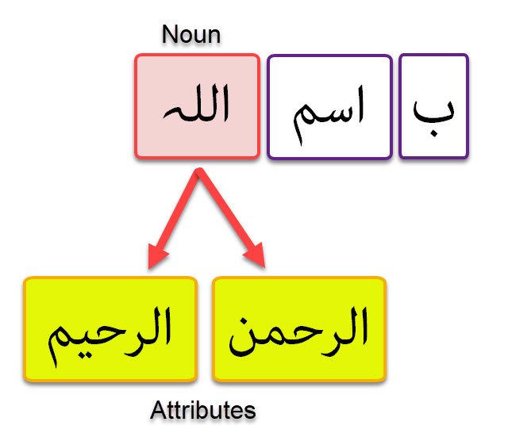

So now if we start breaking down this statement of the بسم اللہ the term Allah points to his ذات - a being. He is a deity named Allah. Allah is the title of his essence.

إِنَّنِىٓ أَنَا ٱللَّهُ لَآ إِلَهَ إِلَّآ أَنَا۠

No doubt, I am Allah; and there is none worthy of worship and obedience except me. Now this noun Allah has adjectives, which are his 99 صفات; his attributes, describing the nature of Allah. His various manifestations in his interactions with creation. So now you have,

الرحمن، الرحيم، الملك، القدوس، السلام، المؤمن، المهيمن، العزيز، الجبار، المتكبر، الخالق، البارئ، المصور، الغفَّار، القهَّار، الوهَّاب ، الرزَّاق ، الفتَّاح ، العليم، القابض، الباسط، الخافض، الرافع، المعز، المذل، السميع، البصير، الحكم، الحکیم، العادل، اللطيف، الحلیم، الخبير، العظيم، الغفور، الشكور، العلي، الكبير، الحفيظ، الحسيب، الكريم، المقیم، الرقیب، الجلیل، المجيب، الواسع، الودود، المجيد، الباعث، الشهيد، الوكيل، القوى، المتين، الولي، الحميد، المحصى، المبدئ ، المعيد، المحيي، المميت، الحي، القيوم، الواجد، الماجد، الواحد، الصمد، القادر، المقتدر، المقدِّم، المؤخر، الأول، الآخر، الظاهر، الباطن، الوالي، المتعال، البِر، التواب، المنتقم، العفو، الرؤوف، اَلْمَالِكُ الْمَلِكُ، ذُو الْجَلَالِ وَ الْإِكْرَامِ، المقسط، الجامع، الغني، المغني، المانع، الضار، النافع، النور، الهادي، البديع، الباقي، الوارث، الرشيد، الصبور ، الحنان، المنان، الدیان، البرھان

These are all attributes that describe the nature of Allah. To use the example of the prism and light that I stated in one of the previous sessions, you can think of Allah as one pure light - اللَّہُ نُورُ السَّمَوَاتِ وَ الْاَرْضِ. When this pure light of the name Allah comes into this physical realm, his divine attributes refract within creation. So we get all of these different manifestations of Allah's essence, based on his interaction with his creation. So in one instance we see that Allah is کریم (the generous). And in another instance he is جبار (the compeller); in another instance he is قھار (the subduer). In another instance he is عزیز (the powerful). In another instance he is مُزل (the one who humiliates and humbles). In another he is معز (the one who bestows honor). His essence manifests through all these different attributes within creation. This world, then becomes a theater for the divine manifestations of Allah's attributes, enabling us to know Allah. Not directly through his essence, but through the refraction of his attributes in his creation.

### Transcendence vs immanence

This is why it is said:

لَا تُفَکِّرْ فِی اللَّہِ . وَلَاکِنْ تَفَکَّرْ فِی خَلْقِ اللَّہِ

Do not reflect upon Allah, but rather reflect upon the creations of Allah. Why? Because it is creation, nature, that manifests all his attributes for us. But then Allah is infinite, and so are his attributes. This is why when we attempt to understand Allah we get bewildered by his attributes; because in a sense, we cannot know what God is, any more than we can know what god isn't. Because when we speak about Allah, we are speaking about the infinite creator of the heavens and the earth. And the word infinite means without limit - لا حُدودَ لہ.

Now the word in Arabic for definition is the same word that we use for limitation, or a boundary الحد. A definition is what defines or gives finiteness to a concept. It limits it; it demarcates it; it puts it into perspective. So when we talk about God we cannot define God. Because to define god would mean to give him a حد; a boundary; a limit - which is impossible you see? This is why scholars say that all of عقیدۃ (creed) can be reduced to two statements:

لیس کمثلہ شئی

He is unlike anything

لا یُشْبِحُ ذاتُہُ الذَّوات ولا مُتَعَاطِلَۃُ الصِّفات

That his essence is not like any other essence and his attributes are not any way metaphorical. He is

الغَنیُ عَنِ الجَمِیعُ و الجمیعُ مفتَقِرٌ الیہ

He has no need of anyone, and everyone is in need of him. This statement actually negates **need **for Allah سُبْحَانَهُ وَتَعَالَى, and it negates for us **independence**.

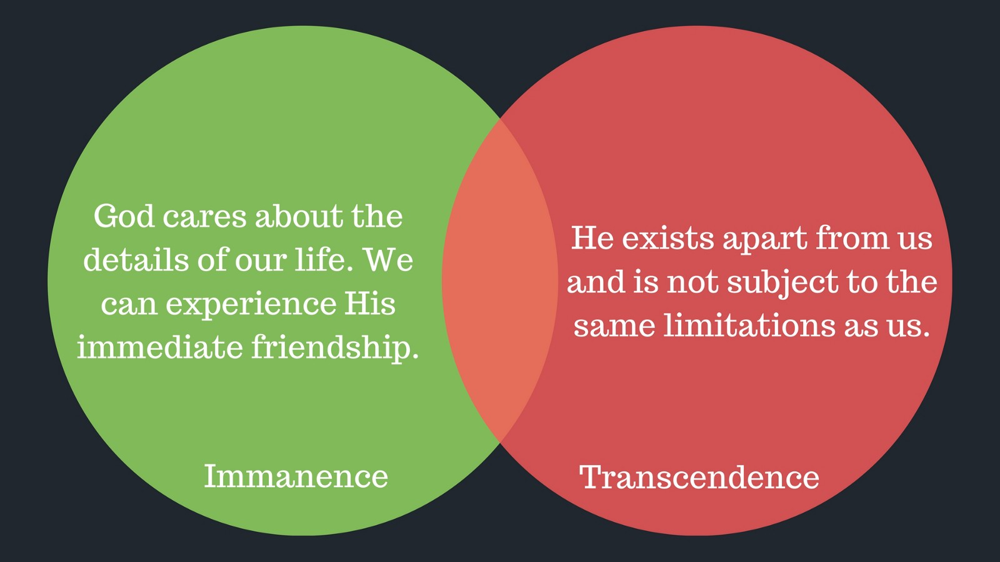

Now here's where we get into another central problem to religion, and that is the problem of transcendence and immanence. Transcendence is when we speak about God without anything, any reference in the world that can guide us to god. There is nothing in the world for which we can say that is god

تَعَالَی اللَّہُ عَنْ مَا یَصِفُونَ

Allah is above and beyond anything they ascribe to. So when we talk about transcendence, we're talking about Allah being above and beyond everything that we know of - سُبحانک which is called تنزیح in Arabic. The word تنزیح means transcendence. It comes from نزح which means to purify; to get rid of filth; to transcend something. So Allah is transcendent; but then pure transcendence has a lot of problems. Because he becomes the God of the scientist. Like Einstein believed in a god, but he did not believe in a personal god. He believed in a Transcendent god. The god he believed in was the God of the deist, who has nothing to do with his creation, and that's a major problem.

Then the other problem comes with what is called immanence. The idea of god being in the world. For example like in the Hindu tradition, the Brahman class do not really believe in the idols. But it's kind of a little trick to help all the stupid people out there, that still need to evolve. There is an understanding in their tradition that the lower classes, or the caste systems, which they call the VERNA. If you are in a lesser "varna", you cannot understand the BRAHMA. Because he has gone through several lifetimes to get to the ability to perceive. Only he can perceive; and only he can understand the God Head, which they call the Brahma. So Brahma understands the god that has no attribute, and they call that the NIRGOONA. But they have this idea that the lower class people need to **see **something in order to understand it, and so they gave them all these idols, who they really knew were not gods. But it helps the common people understand. This is the problem of immanence in religion, which is creating likeness. The way Christianity deals with this problem is obviously through Jesus. Because Jesus becomes the Incarnation of god. God enters into the flesh, and this is what in our tradition we call حُلُول , where god enters the flesh. And some of the deviant Sufi claimed this state. Also as you know this group called نصیری claimed that for Maulana Ali. It also happened for اِمَامُ جَعْفَرٍ الصَّادِقِ عَلَیْہِ السَّلَامُ.

So how do we understand this in our religion? What is the relationship between transcendence and immanence (تنزیح and تجرید)? Because you have to have access to your master. If you have a completely transcendent god, he becomes a cold distant uncaring, unloving god. On the other hand if you give god the attributes of creation you have a whole other problem. And that's what gives birth to concepts of anthropomorphism - falling into the idea that god is petulant; that god has emotions; that god has anger; that he has pleasure in any anthropomorphic way. And this is also a problem in some of the Muslim understandings. There are Muslims who think that when these words are used in HADEES or the Quran.....

الْمَعْضُوبِ عَلَیْھِمْ

The ones who faced the anger of Allah, they think that Allah's anger is like OUR anger. That Allah becomes angry in an emotional sense; and that

تَعَالَی اللَّہُ عَنْ مَا یَصِفُونَ

Allah is above and beyond anything the ascribed to him. But we do believe that غضب has a meaning. We believe that رضی has a meaning. We believe that these words that Allah used in the Quran

رضی اللہ عنہ و رضو عنھم

They were pleased with Allah and Allah was pleased with them, but don't think **your** pleasure with Allah, is the same as Allah's pleasure with you. Don't think those two words mean the same thing in the context that they are being used. Each means a specific thing in relation to that thing that it is predicating. So when we talk about the attributes of Allah سُبْحَانَهُ وَتَعَالَى we have to be extremely careful. Because we in a sense can only say about Allah, what Allah has said about himself.

But then now we enter into another problem, which is the interpretive problem. Because even though Allah is telling us things about himself, he is self-disclosing to us; but he is self-disclosing through language. And language is filtered through the human mind. And the human mind has the capacity to interpret what is being said to it in many many different ways. And this is why the prophet ﷺ is the purest filter. He is still a filter. The prophet ﷺ is a human filter. But he is the purest filter, and this is why the prophets have a capacity that other human beings do not have. And that is that Allah سُبْحَانَهُ وَتَعَالَى has chosen them to be these filters for revelation. And that is why the best understanding of Allah سُبْحَانَهُ وَتَعَالَى is the understanding that the prophet ﷺ articulates to us..... And this is why he said

اللھم لا نُحثِنَ الثَّناءَ عَلَیکَ..... أَنتَ کَما أِثنَیتَ عَلَی نَفسِکَ

We are not able to praise you. You are, as you praised yourself. In other words I cannot truly praise you, because one of the reasons that we praise is because of our knowledge, of the praiseworthy. If you don't know the qualities of someone or something, you cannot really praise them. And this is why in Allah's self disclosure to us, he is describing for us the reasons why he is the praiseworthy; because he is الحمید. He has told us about the praiseworthy attributes that he has. This is how understanding the attributes of Allah enables us to know Allah. Now these attributes are known through human experience, and this is where you get into the problem of immanence. That there has to be some correlation between what we understand about Allah, and what we understand about ourselves, or what we see in the world; otherwise we could not know Allah سُبْحَانَهُ وَتَعَالَى. Its not possible. And so in dealing with the attributes of Allah, you are still working with things in the world. So when we say Allah سُبْحَانَهُ وَتَعَالَى is قدیم, and قدیم is a problematic word, in that it is a technical word. It is not found in the Quran, it is not an attribute of Allah. It was used as a technical term. قِدَم is a سلبی attribute because it negates حدث; it negates occurrence. It negates the fact that Allah سُبْحَانَهُ وَتَعَالَى حَدَثَ he came into existence. NO! The idea of قِدَم is that Allah سُبْحَانَهُ وَتَعَالَى is, as he always was; and he will always continue to be the same without any change, or any time factor. And this is where pre-eternity is the best we can do in English. When we say pre-eternity, I don't even know what that means. I really don't! It is a word that is the best that we have come up with as a way of describing his existence.

So we run into all these problems when trying to understand Allah سُبْحَانَهُ وَتَعَالَى. This is also why Maulana Ali (AS) defined the recognition of Allah as:

الْعَجْزُ عَنْ دَرْكِ الْإِدْرَاكِ إِدْرَاكٌ . والبحث عن ذاتِهِ كُفرُ وإشراك

The inability to recognize Allah **is** recognizing him; and any attempt to discuss his essence is شرک. It will inevitably result in assigning partners with him. Accepting our inability to know Allah **is** recognizing him. This is why the most essential act of worship in Islam is سجدۃ - putting our intellects on the ground, and surrendering its capacity to know Allah.

### In-comparability Of Allah

Now Quran gives us an incredibly concise statement to understand how to understand God. The way in which we understand this world is through "things". The Arabic word for a thing, is شئی. The word شئی comes from شاء which is the "will" of Allah سُبْحَانَهُ وَتَعَالَى. Every "thing", every "being" that exists in this world has its own individual sets of attributes. All of which point to the منشاء (the will and purpose) of their creator. But when it comes to Allah himself, there is no "thing", no شئی that can be compared to him in any way shape or form. So the Quran beautifully explains this concept to us through one single word in the ayah.

لَيْسَ كَمِثْلِهِ شَىْءٌۭ

No matter what you do, no matter how high your imaginations fly; no matter how deep your thoughts dive, there absolutely no way you can ever understand Allah, because there is no "thing " in existence (physical or spiritual) that is like Allah.

لَيْسَ كَمِثْلِهِ شَىْءٌۭ There is absolutely nothing you can compare me to. SubhanAllah.

Now I want you to take a moment and think about this paradox. He created this magnificent universe all around us - every single entity reflecting his divine attributes for us. Why? So that we could gain a semblance of understanding of his powers, his glory, his majesty. And then once we do manage to get some feeble understanding of his attributes in creation, he says: لَيْسَ كَمِثْلِهِ شَىْءٌۭ . Whatever little you now think you know about me - understand that I am not like it. I am way beyond it. And what's so amazing is that he does this linguistically through the use of one single word كَمِثْلِهِ. This is not a word that is commonly used - not even in Ancient Arabia. This is a word used only in بلاغۃ in the eloquence of the Quran.

From a grammatical stand point the word کمثلہ is actually 2 words. There is the word کَ and then there is مثلہ. These are both words used for comparison; but they are never fused together in this manner. So let's try to understand the subtly in the use of this word کمثلہ.

### Comparing Attributes

In Arabic when you want to compare someone in attributes, you add the letter کَ. So for example, if I want to compare the bravery of زید to a lion; if I want to say زید is brave like a lion, I will have to use the letter کَ to do that. I'll say

زیدٌ کل أسدِ

I'm saying زید is like a lion. What am I comparing here? I'm comparing the attribute of bravery of a lion with زید therefore I'm using the letter کَ

### Comparing Essence

But when I need to establish a comparison in the essence, I cannot use the letter کَ. Grammatically that would be wrong. I will have to use the word مثل. So for example I can say:

اَلشِّبْلُ مِثْلُ الْاَسَدِ

A cub is similar to a lion. The son of a lion is like the lion. Here I'm using the word مثل because I am not comparing in attributes; I am comparing the essence of two entities.
This is a rule of the Arabic language when establishing comparisons. Both words کَ and مثل are used very precisely. We find this distinction all over Arabic poetry. So for example this poet is praising the generosity of a king and comparing it to an ocean. Generosity is an attribute, so he says:

کل بحرِ یَقذِفُ لِلقریبِ لآلیۃ جوداً و یبَعَثُ لِلبَعیدِ سحائِبا

He says, the king is generous like the ocean. When I move closer to him he gives me pearls; and when I move away from him he sends clouds filled with rain. Here he uses the word کَ because he is comparing the attribute of generosity. But when the being or the entity needs to be compared, the word مثل has to be used.

أنا السُّروجِیُّ وَ ھذا وَلدی و الشِّبلُ فی الِمخبَرِ مِثلُ الاسد

I am a lion and this is my son. No doubt the son of a lion is like the lion. So now because the comparison is in being, the poet uses the word مثل.

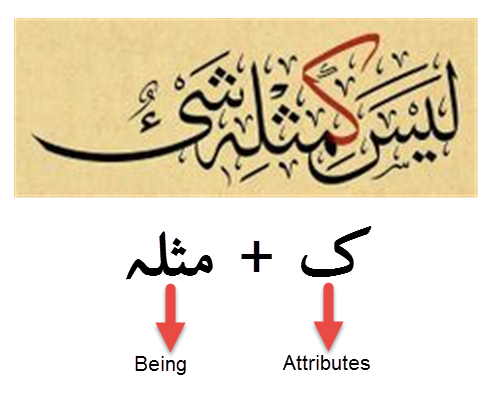

I hope you all clearly understand this subtly, because that's what makes this ayah so beautiful. Allah says.

لَيْسَ كَمِثْلِهِ شَىْءٌۭ

To compare himself Allah fuses both the کَ and the مثل together to say کمثلہ. Why is that? We learnt that کَ is used for attributes and مثل is used for the being itself. So what Allah is saying is that whether you try to compare me to the **attributes** of creation - کَ ; or if you try to compare me to the **essence **of creation - مثل; in both cases you will fail. Because لَيْسَ كَمِثْلِهِ شَىْءٌۭ There is nothing that exists in attribute nor in essence that you can compare me with. SubhanAllah! Can you appreciate the beauty of this word?

- کَ . there is nothing comparable to me in attributes

- مثلہ- there is nothing comparable to me in being

- کمثلہ- there is nothing comparable to me in attributes or in being

- لَيْسَ كَمِثْلِهِ شَىْءٌۭ there is no thing (whether physical, metaphysical, spiritual, conceptual, theoretical, practical), there is simply no شئی that you can use to create a comparison or a likeness for me - not in attributes, not in its essence. SubhanAllah!

So now that we understand this concept, the بسم اللہ condenses all the attributes of Allah سُبْحَانَهُ وَتَعَالَى into two primary attributes - الرحمن and الرحیم. In other words, the two attributes that will always be present in each and every action of Allah سُبْحَانَهُ وَتَعَالَى are the attributes of رحمۃ - intense mercy and consistent mercy. So when we say بِسْمِ اللَّہِ الرَّحْمَنِ الرَّحِیمِ - we are remembering the essence of Allah, manifesting for us through his two primary attributes of رحمۃ, which implodes all his remaining attributes. In other words, regardless of the way in which Allah is interacting with us right now, his رحمۃ is present in that manifestation. Even if he is manifesting in my life right this moment as جبار or قھار, his love, care, compassion, concern and mercy is present in his interaction with me.

InshaAllah we'll move this conversation forward in the next session.

## The ISM Of Allah

### Noun or Name

In the previous session we talked about the transcendence and imminence of Allah سُبْحَانَهُ وَتَعَالَى. We learnt that in one way he is immensely distant out of his loftiness; but at the same instant he is extremely close to our hearts and our consciousness. We also looked at the distinction between Allah and his attributes, and how he is incomparable by both - لیس کمثلہ شئی.

So now that we've covered the noun Allah, and his adjectives الرحمن and الرحیم let's talk about أسم. The word اسم in Arabic means two things. It means a "noun" as in the grammatical term, and it also means a name; because each and every noun has a name. So the Arabs used it interchangeably.

From the Quranic perspective, this concept of name is extremely important, because it is the "names", the اسماء that elevated Adam AS over the angels, and made him worthy of their prostration. Also, these names were something that were taught to Adam AS directly by Allah سُبْحَانَهُ وَتَعَالَى.

وَعَلَّمَ آدَمَ ٱلْأَسْمَآءَ كُلَّهَا

Allah taught Adam all the names. So the concept of name is extremely important in the human psyche. Because we are بنی آدم. We are the children of Adam.

Now what is name? A name is the ability of symbolic thought. That is the essence of a name. Naming something, is taking a symbol, which is linguistic in nature; and then applying it to something which is either material, empirical, conceptual, or theoretical. Those are the entities that are "named". Or a name is something that can be used as a means of abstraction, in order to create separation in things. So if you have a broad category named "cars", you can further break them down by "Mercedes, Toyota, Audi, BMW" etc. See animals cannot do that. Animals cannot use symbolic language.

It has been agreed by the Arab scholars. that human beings have basically three dominant modes of symbolic language. We have linguistics which is the highest form, and then we have mathematics, which believe it or not, actually comes under linguistics. It is really the 20th century, and the western civilization, that elevated mathematics over language. Language has taken a secondary place today, because people don't understand the power of language - especially the Arabic language. This is why even Muslims today try to place mathematics over the linguistics of Quran, when trying to prove its miracle. No doubt Quran is mathematically perfect, and I've shown you many examples of that. But the fact of the matter is, that what makes Quran a miracle is not its mathematical perfection, but rather its linguistic perfection.

And this need to prove the Quran mathematically comes from this feeling of inferiority before the God of modern science - which is mathematics. It comes from Newton and Einstein and all these other people who elevated mathematics, and said that it is the only real way of understanding reality. and the reason they say that is because mathematics is precise and exact. But then these people did not study classical Arabic! Because Arabic is precise and exact! In fact it is precise and exact to a degree that mathematics cannot come close to. This is why the miracle of Quran, the اعجاز of Quran is not in its mathematics; it is in its linguistic perfection and eloquence. Quran is a linguistic miracle; and the recognition of this, comes from our ability to recognize things through names. Because names have meanings. They help us recognize and identify things.

In fact, even the letters in the Arabic language have meaning. So when I say tree in English, you see something that has a trunk, branches, and leaves - that's what comes to your mind. If it's a pomade it has a trunk and then it has palm fibers. Or if it's a fur, then it's got the little spikes instead of leaves - because there are three types of trees. The fur-trees, the pomades, and then these with the leaves. So when we say شجر in Arabic... what is the difference between شجر and tree. We could argue that they're completely arbitrary and this is the dominant opinion among most linguists of most languages; that names have no connection to the thing named - other than, that they are signs that humans agreed upon. So they say that the Arabs saw this structure of a trunk with branches and leaves and decided to call it a شجر; whereas in English, they decided to name it a tree.

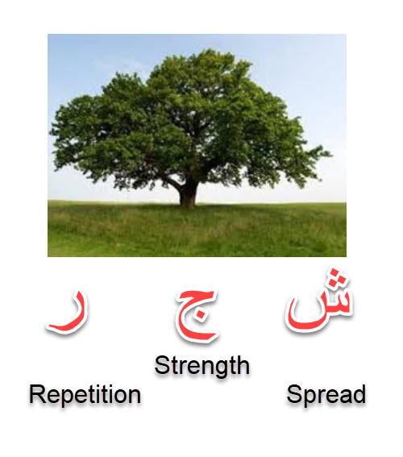

But the ancient Arabs would argue that there is a deep relationship between the word شجر and this thing out there that we see. When you have the letter شین it's called حرف تَفَشِّی. The letter شین is always used for something that spreads out like شمس has radiation; شعر - hair has radiation, you know, your hair spreads out; شجر has radiation, a tree has branches that spread out. And then the letter جیم is حرف الشِّدَّۃ. It is a strong letter. It's used in strong things because the basis of a tree is strong. It's the trunk. جسم is a the body, the main structure of the human being; جبل is a mountain because it's powerful by its nature. Then there is the را which is حَرْفُ تَکْرَارٍ. the letter of repetition. Trees are constantly regenerating themselves.

So the ancient Arabs would say, there's a deep relationship between the letters and the thing that's named itself. And this is something - I mean, these are philosophical debates about the nature of language. But the Arabs would definitely say that there is a secret in names. In the Arabic language, names are not arbitrary. There is actually a reason why a شجر is called a شجر. and a شمس is called a شمس with those particular sounds. This is also why they have an effect! The sounds of the Arabic letters have an effect on the human consciousness. The recitation of Quran has a powerful effect on the human consciousness - just by the nature of its sounds. Even if you don't understand a single word, just listening to a good recitation can deeply move your heart. So Arabic is an incredibly miraculous language and very different from other languages of the world; and all that power - boils down to the human ability to understand names, these اسماء that are provided for us within the framework of language.

### Unification

Now what is the purpose of language? The purpose of language is unification. Language unifies! This is the secret of the human beings, that we have the ability to abstract, differentiate, and identify, through names. We as human beings, we have the ability to see the *ONE* in the many. That's the only way we can communicate. Think about it. The only way we can communicate is by seeing the one in the many. When we talk about a lecture, for example when I tell you, that there is going to be a session next Sunday at 9:30 am. How do you know what a session means in this context?. Because the word session has many different meanings in different contexts. For example I could say…. I'm recording a religious session; or the school is in session; the courtroom is in session. Yasmeen had a great tennis coaching session. The Federal Act was passed in the session of 1908. The word session can have so many different meanings in different context. So when I say there's going to be a session tomorrow, how do you know which meaning of the word session I'm talking about. How are you are able to extract one particular meaning for a word out of so many possible meanings? But we do it instinctively all the time. This is the ability we human beings have. This is because we have this inherent capability to extract the one, out of the many. And when we are not able to do this. When we are unable to zero-in on the one particular meaning, we are forced to say. Wait a minute. Just want to make sure. Did you mean this? Or did you mean that? Every sentence, every phrase, every word needs to boil down to one particular thought from a sea of possibilities.

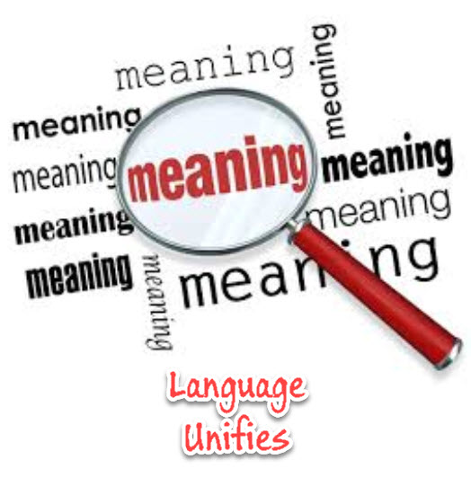

And so what language, and in particular names, and nouns enable us to do - is speak intelligently about the oneness, and the unified nature of words. Because that's who we are. We are all unifiers by our very nature. This is what we human beings were created to do; because we are موحدون. We were designed to make one out of the many - through language. This is why Adam AS was given the gift of names, this gift of language; because using names we can unify - and that's what we were created for. To perform the ultimate unification of توحید. That's what the word unification means in Arabic - توحید. We were created for توحید. To single out the one الہ - the one true اللہ from all these other deities in our lives, posing as gods.

### ISM - A Lofty Symbol

Now where does the process of this recognition of Allah begin? It begins with اسم اللہ. It begins with the "name" of Allah. The word اسم comes from سمو or وسم. The word سمو means lofty; like the sky in Arabic is called السمآء. The word وسم means a sign. So اسم is a sign for those who can see signs. That is what the root means - a loft sign.

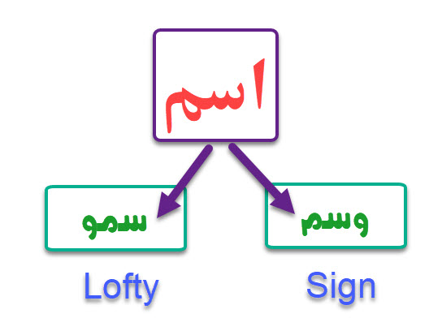

It's an علامۃ. It's something you put on to something to signify it. It's a signifier that indicates the signified.

In سُورَۃُ الرُّومِ Allah سُبْحَانَهُ وَتَعَالَى says

> ‏وَمِنْ آيَتِهِۦ خَلْقُ ٱلسَّمَوَتِ وَٱلْأَرْضِ وَٱخْتِلَفُ أَلْسِنَتِكُمْ وَأَلْوَنِكُمْ ۚ إِنَّ فِى ذَلِكَ لَآيَتٍۢ لِّلْعَلِمِينَ ‎۲۲

Surely and in the variance of the heavens and the earth and your tongues and your complexions are signs for people to think.

So Allah relates the tongues to the heavens, and the colors of our skin to the earth. This is called طباق in Arabic - which is - it's a type of antithesis where you use opposites to explain something. He talks about heavens and earth, and then he talks about tongues and colors - like our skin color and our tongue. So there's a relationship between tongues and heaven and there is a relationship between our skin-colors and the earth. Because tongues or speech comes from the heaven

عَلَّمَ آدَمَ اَسْمَاءَ کَلَّھَا

Allah taught human beings, or imprinted in them language.

الرحمن علم القرآن

That's literally what it means. علَّم means - to imprint something. Language was imprinted within the human being. This is why all human beings have the ability to learn language. Now complexions come from the earth because Allah سُبْحَانَهُ وَتَعَالَى said that Adam was created from all the top soil of the earth. From the white, the black, the brown, the yellow, the red, So you get all these variances in human complexions because Adam was created from أُدْمَۃ . The word أُدْمَۃ in Arabic means topsoil. Adam means the one created from topsoil.

So all humans have these different complexions, just as there are all these colors of the soil. You see white soil, pure white and then you see red soil; you see yellow soil, black, and ebony black. So complexions are related to earth. And language or speech is related to heaven. Language is meaning, complexion is sensory, you see? So there's a relationship between meaning and sensory. They're both joined in the human being. What is significant and what is palpable; what we understand and what we see touch and feel. So the sensory and the meaning are gathered in these two phenomena - the phenomena of language and body.

Because the essence of the human being is language, we are defined as الْحَیَوَانُ النَّاطِقُ. The speaking or the articulating animals. Because the essence of language is what? Rationality! Language is meaningful. So the essence of the human being is language; and that's why when you judge a person by their skin color, it's so wrong! because you're judging them by something that's incidental to their nature. Whereas when you judge them by what they believe; by how they speak by what they say; by whether they're truthful; whether their virtuous; whether they stand for the truth - that's how human beings should be judged. That's why Dr. King talked about being judged by the content of character. How do you know the content of character? By the essence of the person? What is the essence? Their belief! because that's what's going to manifest from them.

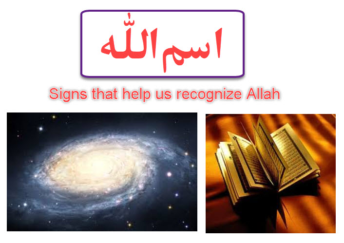

So اسم means a lofty, or a heavenly sign. Now the statement of بسم اللہ begins with the اسم of Allah; the "lofty signs" pointing to Allah - because that is the only way we can know Allah - through the power of symbolic understanding. We cannot know Allah as we know things. We cannot know Allah the same way we know a tape recorder. or a laptop or a computer. Because essences are hard to understand - even with things. But when it comes to Allah, it becomes absolutely impossible. The only way we can know Allah is through symbolic language - symbols within language, and symbols within existence - which are his آیات. His آیات within language in the form of Quran; and his آیات within existence in the form of the heavens and the earth and everything in between.

The Quran directs us to his 99 divine names as familiar linguistic symbols, so that we can have some concept of who he is. So for example, Allah is called مَالِکِ یَوْمِ الدِّینِ. He is owner or king of the day of judgement. How are we able to understand that? We do that because we understand the concept of a مالک. We have a concept of a king. This enables us to relate to and appreciate the position that Allah will take on the day of judgement. He will assume the position of a king, or the ultimate owner. But if you think about it, we are only able to understand that because of that symbolic reference. But then, we also learnt that Allah is not limited to our concept of what a king means. He is way more exalted than that. But the concept of king at least give us some understanding of his position, and his relationship with us. It at the very least get the point across.

So there is this distinction between Allah and the names of Allah. There is a distinction between اسم and Allah. The اسم are all these lofty symbols he has created for us in the horizons and within ourselves, and in numerous other dimensions, that enable us to know him. That's an اسم - a name. I recognize you by your name! You recognize me by my name!

So now that we understand the linguistic meaning of the word اسم as a lofty sign, what we now understand from بِسْمِ اللَّہِ الرَّحْمَنِ الرَّحِیمِ - is the loft signs pointing to Allah, and helping us recognize him as الرحمن and الرحیم - the intensely merciful and the consistently merciful. InshaAllah in the next session we'll look at the preposition با and explore the depths of this entire phrase.

## In the Name Of Allah The Merciful

### The Preposition BA

Now let's talk about the letter با which is a preposition meaning "with", or "in". When you say بسم اللہ what you're saying is, I'm beginning in the name of Allah, but you're omitting the "I'm beginning" - that's just understood. It's called مَحْضُوفٌ مُقَدَّرٌ in grammar. Because the با of بسم اللہ is connected to a omitted verb - and this is very important to understand. Because verb or an action is the basis of all existence. Because if you believe the basis of existence is a noun, then you're simply talking about a state. Like for example if we look at our state of "being" as a human being, we're simply here - like I'm being here, I'm existing here, and there's no action involved in my being. But when you bring a verb into it; what you're doing is, you're bringing the time element into it. It's either past present or future. Nouns aren't past present or future. A tree is a tree. But once a tree begins to blow in the wind, there's a time with it. Did it blow in the past? Is it blowing in the present? or will it blow in the future when the wind comes? So the tree swaying, is an action of the essence of the tree - which, without that action is simply being. So this is really a very interesting debate about existence itself. Is the root of existence movement and action? Or is it being?

Now this is also true about Allah's relationship with the world, because Allah سُبْحَانَهُ وَتَعَالَى has action, but his action is created. His actual essence is passive. There's no action in his essence when we talk about Allah سُبْحَانَهُ وَتَعَالَى. Allah is essence and attribute - and both, essence and attribute are states of being. But action is a substantive that moves into time and that's why the understanding in theology is that Allah سُبْحَانَهُ وَتَعَالَى is beyond time and space. So his action is something that manifested as, and within creation. He brings things into existence through his فعل , but that فعل is محدث. So

وَإِذَا قَضَىٰٓ أَمْرًۭا فَإِنَّمَا يَقُولُ لَهُۥ كُن فَيَكُونُ

When he decides an affair, he says to it "be" and it "is". So Allah سُبْحَانَهُ وَتَعَالَى brings creation into existence through a command - which is a فعل.; and so the preposition با is connected to the omitted verb of Allah's action of creation.

So when we recite the بسم اللہ we're saying بِسْمِ اللَّہِ الرَّحْمَنِ الرَّحِیمِ - I'm beginning with the recognition of the lofty signs within Allah's creation - that are a witness and proof of his intense and consistent love, compassion, care and mercy. This is the context referring to the primordial act of Allah سُبْحَانَهُ وَتَعَالَى. In other words, this is the interpretation of that statement in the transcendent realm. But what about its meaning in the immanent or personal realm?

### Omitted Verb

In order to understand that, let's break down this statement into its grammatical components. First of all, when do we recite the بسم اللہ ? We recite it at the beginning of every action, right? So let's look at this statement from a grammatical point of view. What are the various grammatical components in this statement?

- It begins with the letter با - which is a preposition

- Then we have the word اسم which is a genitive masculine noun. This noun on its own is written as “اِسْم” meaning the name; but because its joined with the preposition, the الف is dropped and the با fuses with the اسم to become بسم making it an indefinite noun

- Then we have the proper noun Allah

- and finally the statement ends with two adjectives of mercy - الرحمن and الرحیم

So we have a proposition, we have an indefinite noun, we have a proper noun and two adjectives. What's missing? From a grammatical point of view what's missing? A verb! We know that grammatically a statement is incomplete without a verb.

So Allah left the phrase بِسْمِ اللَّہِ الرَّحْمَنِ الرَّحِیمِ as an incomplete sentence. He omitted the verb. Do you see that? Why? Because we conceptually complete the sentence by providing the verb through our action. This is why we recite the بسم اللہ at the beginning of every action, every task, thus providing the verb to complete the structure of this statement. SubhanAllah!

So now if I'm about to read the Quran, and I say بِسْمِ اللَّہِ االرَّحْمَنِ الرَّحِیمِ, my action of reading is what completes the بسم اللہ. So now what I'm saying, is "With the name of Allah who is intensely and consistently loving and merciful, I begin reading this book.” And so now my action, no matter what it may be, gets empowered by the بسم اللہ.

But what's even more amazing, is that if we look at this linguistically based on everything we learnt, what I'm really saying, is that my ability to read, and the Quran that I intend to read, is a lofty sign pointing to Allah's incredible love and mercy - his رحمنیۃ and his رحیمیۃ. It puts Allah's love and mercy right at the center of my focus as soon as I recite this phrase. My very act (regardless of what it is), becomes a lofty sign and symbol; it becomes a witness and bears testimony to Allah's رحمۃ; and it changes my perspective on the action I am about to do, even before I've actually started doing it. SubhanAllah!

So now when I say بِسْمِ اللَّہِ الرَّحْمَنِ الرَّحِیمِ before I begin driving, the entire experience of driving becomes a reminder of Allah's love and mercy. My ability to drive, the resources enabling me to own a car, my mental capacity to follow the signs, my ability to assess traffic, my intuition of when to stop, how fast to go, all the facilities within the car, the scenery outside the car - every single things becomes a loft reminder that point me directly to Allah's intense and consistent love, care, concern and mercy for me!! SubhanAllah! This is the power of the بسم اللہ.

SubhanAllah! Its incredible isn't it? Allah's first act was based on this رحمۃ ; he gave us the ability to act; and every act we do becomes a witness to his love and mercy - all of that captured within the phrase بِسْمِ اللَّہِ الرَّحْمَنِ الرَّحِیمِ. I begin this task, this action which is a lofty heavenly sign reminding me of Allah's intense and consistent love, care, concern and mercy

### Allah and his name

Now what is the purpose of reciting the بسم اللہ before we begin an action? As I said, from our perspective, it reminds us of Allah's love and mercy, and naturally makes us love him back; our love manifesting in the form of worship and obedience - our عبودیۃ. But what does it do from Allah's perspective? It fills our action with برکۃ. As Allah said:

أنی اذا اُطِعتُ رَضِیتُ. وأذا رَضِیتُ بَارَکتُ. وَ لَیسَ لِبَرَکَتِی نِھَایَۃ

When you obey me it pleases me. when I am pleased. I bless you with برکۃ and there is no limit to my برکۃ. What is برکۃ? It is abundance. Now what has abundance got to do with بسم اللہ ? What has it got to do with the اسم of Allah?

Allah سُبْحَانَهُ وَتَعَالَى says in سورۃ الرحمن.

> ‏تَبَرَكَ ٱسْمُ رَبِّكَ ذِى ٱلْجَلَلِ وَٱلْإِكْرَامِ ‎۷۸
>
> Blessed be the Name of your Lord, the Owner of Majesty and Honor.

The name of Allah; the name of your master is glorious and benevolent - his name is full of برکۃ. But Allah does not mention in this verse which name is full of برکۃ right? He just said the name of your maser is full of برکۃ. But what did this Surah begin with? الرحمن! And what is the first attribute of Allah mentioned in the بسم اللہ? Again الرحمن. So Allah is telling us something about the attribute الرحمن, that it is full of برکۃ.

But we also know that Allah himself is full of برکۃ. Because he says it in the Quran.

> فَتَبَارَكَ ٱللَّهُ أَحْسَنُ ٱلْخَلِقِينَ ‎۱۴
>
> So blessed is Allah , the best of creators

Your Allah, who is the best of creators, is full of برکۃ

So the اسم of Allah is full of برکۃ and the name Allah itself is full of برکۃ. So the first two words of the بسم اللہ, the اسم and اللہ, they're both loaded with برکۃ. So what do you think will naturally happens to our action, when we recite these two powerful words before beginning whatever it is we're doing? It fills it with برکۃ. In other words, by reciting بِسْمِ اللَّہِ الرَّحْمَنِ الرَّحِیمِ, not only are we reminding ourselves of Allah's intense and consistent love and mercy, though the act itself, but we're also asking him to fill that act with برکۃ.

### Abundance

Now what is برکۃ?

There is no word in the English language that can fully capture the meaning of the word برکۃ. So we need to understand this word through certain concepts.

### Abundance

In classical Arabic the word برکۃ is defined as. البرکۃُ النَّماَءُ وَ الزِّیَادَۃ

It is defined as growth and abundance. The first is النمو which means growth; something that rises. Something that increases in size, makes progress consistently increasing in results; or something that goes further and further and increases فَوْقَ التَّوَقُّعِ beyond expectations. If you plant the seeds of one single fruit in the ground, how many fruits should you expect in return? Just one! But you take the seeds from that one fruit and after you plant it in the ground you get an enormous number of fruits, each producing hundreds of thousands of seeds - that is برکۃ. You planted one seed and eventually got thousands of seeds. That's a growth beyond expectations. That is what you call برکۃ.

Now what is the comparison of a tree with a seed? It is beyond comparison. A seed is tiny, a tree is huge. A seed is delicate, a tree is firm. A seed has no value, a tree bears hundreds upon hundreds of fruits, season after season, year after year. If you really think about it, what we get from a tree, when you compare it to a seed - there really is no comparison. Yet that entire tree came from that one seed. SubhanAllah! That is برکۃ unprecedented growth, unlimited increase.

### Never Ending

The Arabs say أَبْتَرَکْتَ السَّمَآءَ referring to rain that keeps on coming and keeps on coming. So continuity is another characteristic of the word برکۃ. Something that is extensively abundant

### Stability

The word برکۃ is also used in the Arabic language for stability. So for example the Arab would say أِذا أَناَخَ الْجَمَل . When the camel settles on the ground, and it doesn't move or budge - that is also برکۃ. And this is really beautiful. concept; because when you grow something, and you grow it too much.

I'll give an example so you can understand. When kids play with lego, they build up this huge tower - which is just block upon block upon block right? Now as the tower is getting tall, does it become more stable? or does it become less stable? It becomes less stable. The taller the tower, the less stable it becomes. It will eventually fall and break. and there will be no tower anymore. isn't that true?
So when something increases rapidly, and increase too much - it becomes less stable. But when something has برکۃ in it, it means that it will increases in quantity, and it will keep increasing beyond expectations. yet remains as stable as a camel sunk in the sand. SubhanAllah! In other words don't think this increase will go away. Its not an unstable increase.

We find unstable increase all around us in the world. Our economy goes up really fast, and then crashes really fast. There are governments that take over really fast, and then disappear really fast as well. Fashion industry! There are trends that pickup really fast, and then disappear just as fast. Something else takes its place. But Allah says برکۃ is something that increases but it remains stable. It doesn't go away.

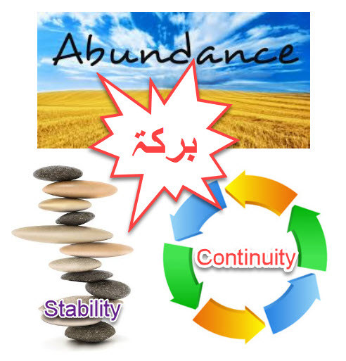

### Abundance through Allah's name

The name of Allah, the اسم اللہ is filled with برکۃ. The name Allah itself is filled with برکۃ. His blessed name is being mentioned since the day creation came into existence, and it only keeps increasing and growing with every single passing moment. And it will continue to grow till the very end of time. Worshipers come and go; but the one who is worshiped remains forever. People who glorify the names of Allah come and go; many came before us, many will come after us. We will all be gone one day, but the glory of Allah will always always remain. This is the برکۃ of Allah's name.

So now, to summarize, when I recite بِسْمِ اللَّہِ الرَّحْمَنِ الرَّحِیمِ before each and every action I do, my action itself turns into a reminder, a heavenly loft sign pointing to the loving care and mercy of الرحمن and الرحیم in my life - and what that does is, it creates برکۃ in the results of my action. There is a HADEES of Rasul Allah ﷺ in which he said

کل شئی أبتر بدون بِسْمِ اللَّہِ الرَّحْمَنِ الرَّحِیمِ

Every single act is sterile or infertile without بِسْمِ اللَّہِ الرَّحْمَنِ الرَّحِیمِ. Every act this is done without the remembrance of Allah will have no برکۃ and no abundance in it. What does that mean? What does abundance of something do? Think about it? If you have an abundance of money for example, what does it free you of? It frees you of ھم and غم. It liberates you from the shackles of anxiety and depression. You're no longer concerned about that aspect of your life, you see? Now imagine if you have the abundance, a never ending supply of Allah's رحمنیۃ and رحیمیۃ in your life?! If you have an abundance of ذکر اللہ that close connection with Allah, will anything or any situation in life - no matter bad it is - will be able to affect you? Will it make you anxious or depressed? Absolutely not! Because no matter the outcome, you're experiencing the joy of closeness, and experiencing Allah's love, simply by the act itself. SubhanAllah! And so what Rasul Allah ﷺ meant by that statement that every thing is sterile and infertile without بِسْمِ اللَّہِ الرَّحْمَنِ الرَّحِیمِ , is that without the love of Allah, without a proximity to Allah, no amount of physical abundance will satisfy you in this world. And we find the greatest proof of this HADEES when we look at the world around us. Millionaires, billionaires who are extremely anxious and constantly in a state of depression. On the other hand we find certain true Muslims and believers, who despite the worst of situations seem the most content and happy - why? Because they're connected to Allah, and that connection creates برکۃ in whatever little they have to an extent, that they are extremely happy, content and satisfied with it - so much so that they don't even desire more! SubhanAllah!! This is the برکۃ of بِسْمِ اللَّہِ الرَّحْمَنِ الرَّحِیمِ.

May Allah fill our hearts with his love, and make every action we do from this day, an experience of his love and mercy.

## Linguistic Perfection Of HAMD

In the previous session we learnt that Allah created us as a noun - speaking in grammatical terms. We are all nouns in our essence. But from the moment we wake up, until the moment we sleep; and in fact even while we are asleep, what we're constantly doing through our actions, is creating verbs. So the power of بِسْمِ اللَّہِ الرَّحْمَنِ الرَّحِیمِ is that it provides a context for our verbs; our actions; by turning them into reminders; by turning our actions into these heavenly lofty signs; an اسم of Allah سُبْحَانَهُ وَتَعَالَى; reminding us of his intense and consistent love, care, kindness, concern and mercy.

### A Composite Word

And once we experience his ربوبیۃ through our interactions with this عالم that he created for us - because all of our actions are only happening, because his ربوبیۃ enabled and empowered us to do so, right? I'm able to drink water because he gave me the physical capacity to pour water into a glass; and he made the water subservient through his laws of nature, so that it obediently falls into the glass when I pour it. It doesn't refuse; it doesn't change its direction, it doesn't start rising in mid air. It follows and obeys these laws of gravity, allowing me to drink it. What is this, if not a sign, of the mercy and love of Allah سُبْحَانَهُ وَتَعَالَى? Where he enabled me and the water to interact in this manner. That is his action - his proof of ربوبیۃ executed with intense and consistent love. So now once I recognize and experience this love, what should be my natural response to that love? It has to be اَلْحَمْدُ لِلّٰہِ رب العلمین. All praise and gratitude belongs to Allah the رب of the عالمین. This is why the بسم اللہ directly connects with the حمد اللہ.

In today's session I want to do a linguistic study of the word حمد to demonstrate the perfection of this statement; so that we can appreciate why Allah used this particular word? and in this particular fashion in this verse. Why didn't he choose a different style for saying the same thing. So let's begin with the word حمد because this form of his diction, veils many valuable lessons within it for us to learn from.

### Mutually Exclusive Terms

This word حمد is a composite word that means two things. It means praise and it means gratitude. Now there are two other words in the Arabic language for praise and gratitude. The commonly used word for praise is مدح and the word for gratitude is شکر. What's the difference? Praise is a gesture of appreciation. When you are moved by some thing beautiful, or colorful, or scenic; when something intrigues you in some way; when something impresses you, what do you do? You praise it! You verbalize your appreciation by praising it. That's the very natural human response to something that our soul finds beautiful.

Now gratitude is something entirely different. Gratitude is done in response to a beneficial act done for you. If somebody lends you money, or does something nice for you, you say شکراً. Gratitude is always done as a response to a beneficial act. You see the difference? Praise is done when something impresses you; or you appreciate something about someone, whereas gratitude is done in response to a favor or a kindness done for you.

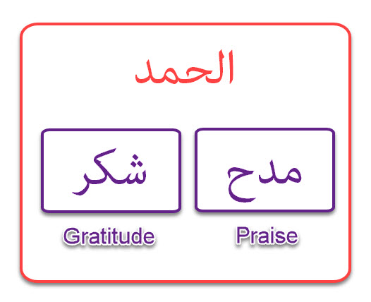

Now even though the two terms are used interchangeably in our lives, they're both mutually exclusive. Someone you thank, is not necessarily someone you praise. Quran clearly distinguishes between these two concepts. For example, in the story of مُوسَی عَلَیْہِ السَّلَامُ, we know that he was adopted and raised in the house of فرعون. Years later when مُوسَی عَلَیْہِ السَّلَامُ returns to deliver Allah's message, فرعون says to him, how dare you? How dare you talk to me this way?

> ‏قَالَ أَلَمْ نُرَبِّكَ فِينَا وَلِيدًۭا وَلَبِثْتَ فِينَا مِنْ عُمُرِكَ سِنِينَ ‎۱۸‏
>
> ( 18 ) said :"Did we not bring you up among us as a child? And you did dwell many years of your life with us.

Did we not raise you as a newborn in this house? Did you not spend many years of your life growing up here? How dare you speak to me like that? In other words what فرعون is saying, is that aren't you grateful? I raised you for so many years and now you're going against everything I taught you? To that مُوسَی عَلَیْہِ السَّلَامُ responds:

وَتِلْكَ نِعْمَةٌۭ تَمُنُّهَا عَلَىَّ

You did in fact show me that favor, and for **that** I'm grateful. So even though فرعون is someone who will never be praised, especially not by a prophet, but even when he does a favor, he will still be thanked! So gratitude can exist without praise.

In the case of parents, Allah says:

> ‏وَوَصَّيْنَا ٱلْإِنسَنَ بِوَلِدَيْهِ حَمَلَتْهُ أُمُّهُۥ وَهْنًا عَلَىٰ وَهْنٍۢ وَفِصَلُهُۥ فِى عَامَيْنِ أَنِ ٱشْكُرْ لِى وَلِوَلِدَيْكَ إِلَىَّ ٱلْمَصِيرُ ‎۱۴
>
> And We have enjoined upon man [care] for his parents. His mother carried him, [increasing her] in weakness upon weakness, and his weaning is in two years. Be grateful to Me and to your parents; to Me is the [final] destination.

Be grateful to me and both of your parents

> ‏وَإِن جَهَدَاكَ عَلَىٰٓ أَن تُشْرِكَ بِى مَا لَيْسَ لَكَ بِهِۦ عِلْمٌۭ فَلَا تُطِعْهُمَا‎۱۵
>
> But if they strive to make you associate partners with Me that of which you have no knowledge,

But if your parents are working against you in forcing you to disbelieve and commit شرک - don't obey them. But you still have to be what? You still have to be grateful to them. In other words, if your parents are forcing you do disbelieve in Allah, you don't have to praise them, but you still have to be grateful to them. اِبْرَاھِیمُ عَلَیْہِ السَّلَامُ is a good example for this. He does not praise his father, who was an idol worshiper, but he still grateful to him.

So الشُّکْرُ وَ الْمَدْحُ praise and gratitude are two separate things; they are mutually exclusive. You can praise without gratitude; and you can be grateful without praising someone or something.

But what's interesting about the word حمد that it necessarily means both things together! When Allah says اَلْحَمْدُ لِلّٰہِ - he is saying praise is for Allah; and gratitude is also for Allah - both at the same time. The word حمد makes both concepts mutually inclusive.

### Praise & Gratitude

### Praise

Now let's look at why didn't Allah use these words مدح and شکر and used حمد instead. Let's start with مدح. Why didn't Allah say:

اَلْمَدْحُ لِلَّہِ رَبِّ اَلْعَالَمِینَ

All praise is for Allah. The problem with the word مدح is that it is a praise that does not necessarily have to be genuine. We all know that praise can be insincere. A kid walks in the house with a really bad report card - as soon as he enters he goes, Mom! OMG! Your food! smells so delicious - and she hasn't even started cooking yet. So he's praising her, but it's not a genuine praise. You get it? Praise can be fake. There is fake praise done for kings, for bosses, for people in high positions all the time! People falsely praise looks all the time. Wife asks the husband, does this dress make me look fat? Oh no! you look beautiful! That's مدح. This is why in classical Arabic when you praise someone's looks, you don't say حَمِدَ, because everybody knows that the person being praised did not make their own face. If they're beautiful, pretty or handsome, Allah made them that way. So saying, "You're so beautiful" would be considered مَدَحَ because it's understood that praising looks and other external features, is an inherently false praise.

Now حمد on the other hand cannot be a false praise. It cannot be insincere. Why? Because حمد is generated in the heart by the awareness of the magnificence and the glory of the one being praised. I'll say that again. حمد the praise element of حمد occurs when the heart becomes aware of the magnificence and the glory of the one being praised. The heart and the intellect recognize that Allah truly deserves that praise - therefore حمد can never be a false praise. The حمد of Allah سُبْحَانَهُ وَتَعَالَى is not dependent on a personal need. It cannot be motivated by a personal agenda. It stems simply from being impressed by who he is - not based on what he does for us. You understand?

### Gratitude

Now let's think about شکر. What if Allah had said

اَلشُّکْرُ لِلّٰہِ رب العلمین

All gratitude is for Allah. What's the problem with that? Gratitude or thanks originates from the the acknowledgment a favor. Someone does something for you that you appreciate, you thank the person for that favor. You have a flat tire. Someone comes along and helps you, you feel grateful, and you express that gratitude by saying thank you! Thanks can only happen when you have a **reason** to thank someone. It is a reaction to a favor. It is never something you start with. You don't see a stranger passing by and say - hey you! thanks!! You never do that.

When Allah uses the word حمد, which is a combination of both praise and gratitude, there are certain rules that apply linguistically. First rule is that the praise aspect of حمد has to be genuine; it can never be fake. Second the gratitude aspect of it is not reactionary. Therefore linguistically saying اَلْحَمْدُ لِلّٰہِ is far more powerful than saying اَلْمَدْحُ لِلَّہِ and it is way more powerful than saying اَلشُّکْرُ لِلّٰہِ; because it is a lot more comprehensive than both.

### Combining Praise & Gratitude

Now what if Allah had said

الْمَدْحُ وَ الشُّکْرُ لِلَّہِ رب العلمین

Praise and gratitude belongs to Allah. What would be the problem with that? Even if we remove the shortcomings of both words مدح and شکر, the problem now is that when you put the word "and" in between two things. which is the letter و it separates both words even in meaning. When I say الْمَدْحُ وَ الشُّکْرُ لِلَّہِ, linguistically what I'm saying is that praise belongs to Allah for certain things; and gratitude belongs to Allah for other things. They're not always combined; because the words aren't combined. This is a very cool feature of Arabic language. You don't say what you don't mean. So if we use the two words gratitude and praise and join them with an **and**, in classical Arabic that means, sometimes I am in the mood to praise him, but not thank them; and then there are other times when I'm in the mood to thank him, but not praise him. But when Allah says اَلْحَمْدُ لِلّٰہِ that means for every act he does or doesn't do, for every blessing he gives or holds back; genuine praise and unconditional gratitude is due to him - both at the same time. We don't get to pick and choose which one.

So now if you own a nice car, and I say اَلْحَمْدُ لِلّٰہِ , what have I just done? I genuinely praised Allah for giving human beings this knowledge and ability to create cars, to design and manufacture it; **and** I thank Allah for letting me own one. So now I am praising and thanking Allah both at the same time. All of that is eloquently captured in this beautiful word الحمد.

### HAMD is an Attitude

This is why حمد is the attitude of a true Muslim. Because it is optimistic in nature. You know sometimes you're going through a difficult time. and someone asks you, "how are you doing?", and you just say "Oh you know, life sucks. but اَلْحَمْدُ لِلّٰہِ. You're not really praising him or thanking him when you say it that way. اَلْحَمْدُ لِلّٰہِ is not something we just say, or throw around. It's a reminder of an attitude! Allah is not interested in what comes out of our tongues. He's more interested in what is in our hearts that is **connected** with what comes out of our tongues. So when a true Muslim says اَلْحَمْدُ لِلّٰہِ, regardless of his situation or circumstances, the sentiment that resides in his heart is that indeed all praise and gratitude belongs to Allah, regardless of my situation. If I'm going through a difficult time, and I say اَلْحَمْدُ لِلّٰہِ what I mean is, indeed my praise and gratitude is for Allah, because no matter what I'm going through, it could always be worse. Someone right now in the world is going through a much harsher version of what I'm going through. I'm grateful to Allah that he is lenient with me. I am grateful to Allah that he has provided me with the resource to fix my situation; whereas there might be some who doesn't have the same resources I do. I praise him, for his majesty, as how the one who gives health, can take it away, and restore it when he desires. Because my pain should remind me of all the times Allah had me living in comforts in which I forgot about him, right? So حمد اللہ - sincere praises and unconditional gratitude belongs to the one who reminded me of his grace and blessings by temporarily or permanently taking it away. حمد اللہ - sincere praises and unconditional gratitude is for the one who filled my life with undeserved blessings. So an understanding of اَلْحَمْدُ لِلّٰہِ can really empower us and completely transforms our attitude towards life itself.

### Noun vs Verbs

Now let's look at this term from a grammatical perspective. In language you have nouns and verbs. Verbs have tenses, whereas nouns don't. There's no past tense noun, or present tense noun, or future tense noun, right? Now when I say: "*I praise Allah*", did I use a noun or a verb? I used a verb. It's a present tense. But when Allah say praise belongs to Allah; is the word praise a noun or a verb? It's a noun. You see? Allah could have used a verb. He could've said اَحْمَدُ اللَّہَ I praise Allah. He could've said نَحْمَدُ اللّٰہَ We praise Allah! But Allah did not use a verb. He used a noun - why?

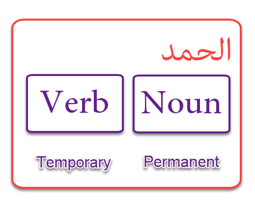

Because when I use a verb, there is obviously going to be a tense associated with it. So when I use a present tense to say, I praise Allah - then I am only talking about the present; I'm not saying anything about the past or the future. If I use the past tense, then I am not guaranteeing anything about the future or the present. Because a verb limits and confines the action within time. It makes the action temporary. But Allah used a noun, which by its nature is permanent. Therefore

اَلْحَمْدُ لِلّٰہِ رب العلمین

Allah's genuine praise and unconditional gratitude is described with permanence; and what that means is, that I may be praising Allah now, but the praise of Allah has always been there, and will always be there. I am not going to be here in this world forever, but the praise and gratitude of Allah will always be here forever. His praise and gratitude is not dependent on me. A huge reality within اَلْحَمْدُ لِلّٰہِ is this concept of permanence in the praise and gratitude for Allah. It is a recognition of the fact that his حمد is not dependent on my temporary existence. It is not because of me.

See, when we use a verb, somebody needs to **do **the verb. It's called the subject or the فاعل in Arabic. There has to be a doer for an action. You can't just go into a conversation and say - failed the test! Who failed the test? You cant just say. Disappeared! What disappeared? Oh my book disappeared. You understand? When you use a verb, you always need someone to do it. But a noun doesn't need a doer. It doesn't need a subject. A noun is independent all by itself. An apple is an apple. It can exist all by itself, independent of any doer. So when Allah used the word الحمد, he made it a noun. He made it independent. He doesn't need anyone to do the actual praising, and he doesn't need anyone to be grateful. Had he used a verb, that would have meant he needed someone to praise him. and he needed someone to be grateful to him. You see?
So he removed the constrictions of time and space by using a noun. This means that even if there was not a single creation in this world, the حمد of Allah سُبْحَانَهُ وَتَعَالَى would still be there. Even after this world, this universe fades into non-existence, his praise and gratitude will remain. It does not require a doer or an object. SubhanAllah! All of this captured by one single word, used grammatically as a noun.

### Other Variations

### Command

Now let's look at some other possible variations. What if Allah said أِحمد اللہ رب العلمین. What if he used a command? Praise Allah! the master of عالمین. Wouldn't that have been better? After all, he is a master. So a command would make sense. So why didn't he make it a command? I'll give you an example to help you understand. I tell my daughter to bring me a glass of water. I say. Hey Erum! bring me a glass of water! I'm giving her a command. Once she hears me, she has two possible choices. She can either bring me the glass of water. OR. she can bring me the glass of water . Those are the only two clear choices as far as I'm concerned. Now if Allah commanded us to praise him - as a command. What are the two things that could happen? Some would praise him. Some would obey his command; and then there would be others who would disobey him. When you tell someone to do something, the ball is now in their court. It depends on them to comply with your wishes. Maybe they'll choose to do it, maybe they won't. Allah did not talk about praise and gratitude in a way that depends on us. He did not put the ball in our court. He said whether you do it or not; whether you are grateful to me or not; whether you praise me are not; my praise and gratitude (my حمد) is always there. It has been there forever, and it will be there forever. Human beings will come and go; nations will come and go; generations after generation will come and go; this universe will come and go; but the حمد of Allah will always be there. It is simply a matter of fact. SubhanAllah!

### Emotion vs Information

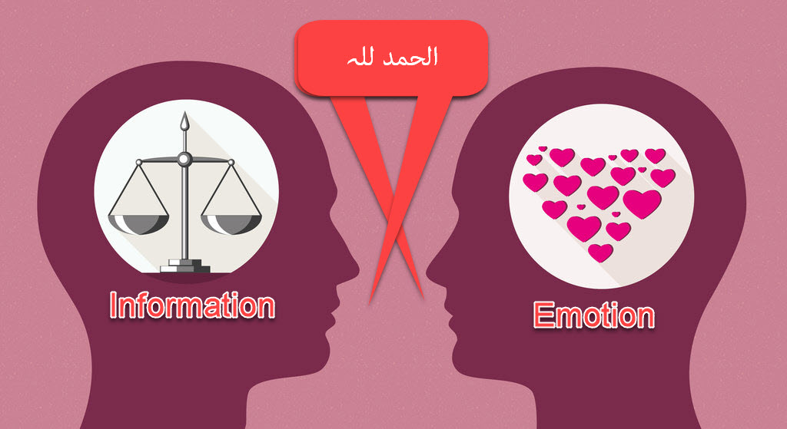

Now what if Allah said انَّا اَلْحَمْدُ لِلّٰہِ رب العلمین. Certainly! For sure. Absolutely, no doubt about it! حمد is for Allah. Doesn't that sound a lot more powerful than "All praise and gratitude belongs to Allah?". It does! So how come Allah didn't say انَّا اَلْحَمْدُ لِلّٰہِ رب العلمین. If you remember from our sessions on the miracle of Quran, on the topic of conversation I told you there are two kinds of communications. A communication can either be informative or it can emotional. It can be جُمْلَۃٌ اِنْشَائِیَّۃٌ or it can be جُمْلَۃٌ خَبَرِیَّۃٌ. Either you have speech that is expressing your feelings and emotions, or you have speech that is communicating information. Those are the two kinds of speech that human beings are capable of. That's it! So for example, right now, as I'm teaching you about الحمد, am I delivering information? or am I expressing my emotions? I am delivering information. This is informative speech. But when I'm talking to my friend, and I'm telling my friend how I feel about someone or something, what kind of communication is that? That is an emotional conversation. So those are the only two types of speech we as human beings are capable of. The thing is, that in Arabic linguistics. when you use انا the statement can **only** be informative. It can only be factual. It can never be emotional. But if you don't use انا, the communication can now be informative and it can also be emotional. You understand? So by not using انا Allah made his حمد an open statement. We can now talk about Allah's praise and gratitude with others in order to give them information about it. But we can also make it a statement to express our own emotion. SubhanAllah! You see the beauty of it? Using this style, right now by saying, اَلْحَمْدُ لِلّٰہِ رب العلمین I'm sharing with you about Allah's حمد. A few hours later, when I'm standing before him in صلوۃ, and I use the exact same words اَلْحَمْدُ لِلّٰہِ رب العلمین, I will be expressing my praise and gratitude to my master. It will be an emotional conversation with him - SubhanAllah!

So you can see how perfect the usage of this word is in the context of the فاتحۃ.

### Summary

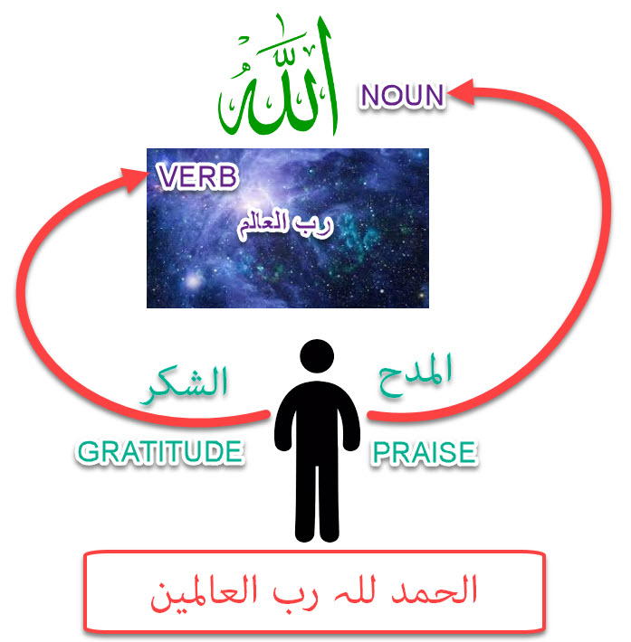

So to summarize the concept of praise and gratitude in grammatical terms - we are nouns and we create verbs through our actions. Allah is a noun and he creates verbs through his action. Now on a daily basis, we are interacting with Allah; and he is interacting with us - through his ربوبیۃ over his عالم. In this interaction, (listen to this carefully). In this interaction between us and Allah سُبْحَانَهُ وَتَعَالَى - for the recognition of the noun that is Allah, he is worthy of our مدح - our sincere and independent praise; and for his actions influencing our existence, he is worthy of our شکر - our ultimate and unconditional gratitude. Both these concepts are beautifully and eloquently encapsulated in this one single phrase - اَلْحَمْدُ لِلَّہِ رَبِّ اَلْعَالَمِینَ - all forms of sincere praise belongs to Allah سُبْحَانَهُ وَتَعَالَى for who he is; and my gratitude (on a personal level) and the ultimate gratitude (on a general level) belongs to Allah for what he did, what he does and what he will do - which is constantly manifesting on the sage of this عالم - Therefore اَلْحَمْدُ لِلَّہِ رَبِّ اَلْعَالَمِینَ

## Abundant and Consistent Mercy

### Mercy

In the previous session we did a linguistic study of the word حمد. We learnt that it is a combination of sincere praise and unconditional gratitude, owed to Allah سُبْحَانَهُ وَتَعَالَى for his constant, relentless, never-ending ربوبیۃ over his عالمین. And it's not just حمد but rather الحمد - meaning ultimate praise and absolute gratitude belongs to him by virtue of him being the رب. Then he says الرحمن الرحیم. The abundantly merciful, the consistently merciful. The word رحم as we all know, generally means mercy, but it is actually a type of mercy that brings two things together in a way, such that the principles of ربوبیۃ can be applied. This is why the womb of a mother is called رحم because it brings the baby and the mother together, so that the mother can nurture it; so that she can shower her love over it; so that she can help sustain the fetus and make it grow. So the word رحمۃ is so powerful, that our general understanding of the word "mercy" falls short in capturing its essence.

So now in this next verse, Allah سُبْحَانَهُ وَتَعَالَى highlights his رحمۃ by dedicating an entire verse just to mention the quality of his ربوبیۃ. What, according to him, is the essence, the defining attribute of his ربوبیۃ? It is رحم that manifest through his abundance, his رحمنیۃ and his consistency, through his رحیمیۃ. This is why, when we look around us; when we study the عالم we find this one thread of رحمۃ flowing through the entire fabric of his عالم. It is the glue that lovingly holds this عالم together. It is that magic magnetic force that just naturally pulls us towards Allah and keeps us connected with our master. So just to put this concept in visual terms, you can imagine his رحمۃ as this gravitational field; this force of love that pulls us towards him; and what we experience from that pull is حمد; our ultimate praise and our absolute gratitude owed this رَبُّ الْعَالَمِینَ who is is الرحمن and الرحیم.

### Gratitude

Now if we look at the gratitude component of الحمد; if we just look at the aspect of شکر ? What is the reality of شکر? What is the manifestation of sincere gratitude? It is تقوی; It is the constant awareness of Allah's presence. It is the constant recognition and awareness of his blessings; and this is a very high station; it holds a very lofty مقام, and not everyone is truly capable of achieving the highest ranks of شکر. This is why Allah says:

وَقَلِیلٌ مِنْ عِبَادِیَ الشَّکُورُ

Very few of my servants are شکور. The شکور is different from the شاکر. The شاکر (the grateful) is the one who is grateful for Allah's blessings, but the شکور is the one who's grateful for calamities and tribulations - not just blessings. He actually feels gratitude when horrible things happen to him. Because most people, at best, they'll be patient or resigned, but the شکور actually says اَلْحَمْدُ لِلَّہِ as he's experiencing these calamities, because he knows that Allah only does good for his believer, right? There's a HADEES

عجباً لِأمْرِ المُؤمِن فَأِنَّ أمرَہُ لَہُ کُلُّہُ خَیر

How wondrous is the affair of the believer; his affair all of it is good. If you're a believer, then it is all good. And that's why if you really do believe that, you enter into a state of constant gratitude, even for the tribulations اَلْحَمْدُ لِلَّہِ. Always a good thing to remember, is what ابن عباس said, that no matter how bad it is, it could always be worse - and there are people like that. There are people even non-Muslim. You'll meet non-Muslims that are like that. They always look at the good side. Well, it could be worse! think of this! count your blessings!

Now in this verse, Allah says he is a رب that is الرحمن and الرحیم. How does his رحمۃ manifest in our lives? How does the abundance of his love demonstrate in our lives? Through his blessings; his gifts; his نعمۃ. When I as a parent want to demonstrate my love for my children, how do I do that? By bestowing gifts upon them. Valuable, desirable, beneficial gifts, right? Gifts that the child understands that he or she could not attain by their own efforts. Now think about the blessings, the gifts that Allah سُبْحَانَهُ وَتَعَالَى has bestowed upon us. Incredible gifts; Infinite gifts

> وَإِن تَعُدُّوا۟ نِعْمَتَ ٱللَّهِ لَا تُحْصُوهَآ ‎۳۴

If you attempt to enumerate the blessings of Allah, you will never be able to enumerate them. لَا تُحْصُوهَآ. Gifts that are not only impossible to count, their value is simply impossible to measure. Just look at one single نعمۃ. Look at the نعمۃ for instance of the eye. This is one نعمۃ. First of all, think about this- blinking. Just think about blinking. You don't even notice that you blink. Now if you didn't blink - did you ever see pictures of Aristotle Onassis? When he got old? The richest man - one of the richest men in the world. He owned his own private fleet of ships. He had to us band-aids to hold up his eyelids, because he lost the function of the muscle that return the eyelid; and his eyelids just dropped all the time. So he used Band-Aids to hold his eyelids up. But then he had to put drops in his eyes all the time, because if your eyelids don't close they get dry; and you get dust in them; because one of the things that blinking does, is it brings the dust back down. They're like windshield wipers. They brings the dust down and then what happens is the dust moves to the side and accumulates in the corners, right? So when you wipe your eyes, you'll get some little dust in it. You don't even think about that. That's just one part of the eye! But then if you look at the intricate network of these nerves of the eye, and the myelination of that sheath - the fact that there's constant synaptic response; the fact that there's neural transmission; because that breaks down for some people. We don't even think of all this. Think of the electric work that goes in the function of an eye, right?

But then colors! just think of colors! just colors! Allah could have made everything black and white. Look at all the subtle colors that he put in the in the world that we can experience. The eyes can experience an incredible variety of colors, right? I mean, that's a نعمۃ. Then look how some colors - they just give you pleasure seeing them. You don't even think about it, but there's a vibration. If you look there are seven colors, right? All colors go down to seven primary colors. In color theory, they'll go down to three I think, but there's basically seven in a spectrum. So if you look at the visible light spectrum, each one of those colors has an effect upon your soul. Red has a certain vibrational resonance. It's a lower resonance than violet. Violet is at the High Spectrum; red is at the low Spectrum. Red, when you see red, it stimulates you. You don't even know that. They know that now in color theory, because they've done studies on people; if you put people in red rooms, it has a different effect on them, than if you put them in blue rooms, it will actually change their moods, because these colors have a resonance - there's a electromagnetic radiation. So it's all having a psychological effect on you, and you don't even know it. Now the thing about the world, if you go and look at green; green will make you feel good. That's why people love to look at grass; or love to look at trees. It has a یُنعِش that's what the Arabs say. It's called ربیع . This is why we pray Oh Allah make the Quran the spring of my heart and

اَللّٰھُمَّ جَعَلَ الْقُرْآنَ رَبِیعَ قَلْبِی

What does that mean? It means that thing which brings your heart back to life. Because spring brings your whole being back to life. People start feeling good. People get, what they call SAD - "Seasonal Affective Disorder". There's people who get depressed in the wintertime, but then spring comes around and they forget how depressed they were in the winter. They start feeling wonderful. Why are they feeling wonderful? Green! color start changing. There's photosynthesis. All that chlorophyll is starting to come back to life. Flowers start blooming again.

Flowers! Look at flowers. I mean, what is that? A flower? Why do people like smelling a flower? That's another نعمۃ of scent - but just the sight of a beautiful flower right? Beauty! when the eye looks at something beautiful, why do we all respond the same way? When you see something beautiful and most people share a common taste in beauty. if you see something beautiful, you're attracted to it - it's an attraction. Why? It's because beauty is an attribute of God; and what you're seeing in the عالم is a reflection of a Divine attribute of your رب. So you're essentially attracted to the divine, but you think you're being attracted to the flower. No! It's the beauty of the Divine manifesting through that flower. That's the real attraction. The real attraction is not that ephemeral beauty that fades. It's the manifestation of the divine in creation that's the real attraction! But people don't realize that. So there are all these things about the eye and and we don't even think about it. Look at the eyelashes; look at the eyebrows. They're serving a purpose; eyelashes serve a purpose right? I mean when anything comes near your eye, you instinctively close your eyelids and it protects the eye. That's just amazing. So there are all these things - just about the eye - if you really start thinking about it; look at the abundance! Look at the رحمنیۃ of this رب. And that's based on what we know so far - there's all these blessings we don't even know about yet.

What about light? The external factor that makes the eye useful; that allows sight; which in turn makes people happy or depressed. Why do people get depressed? One of the reasons they think is because serotonin levels drop, which is a key hormone in making us feel happy. One of its release factors is based on light. So you're taking in light during the day you don't even think about it. Melatonin is also based on light. Melatonin is what makes you get sleepy. That's why people that are constantly in artificial light have difficulty sleeping. But the eye is the one that's doing all that. The eye is dictating. That's why you get tired. It's all based on the eye. So even your sleep patterns are being affected by the human eye. We don't even realize that. When we feel awake when we feel drowsy, right? It's all a result of the eye. I mean this is just the eye alone. We just can't enumerate all of the blessings of the eye. That's one نعمۃ. That's just نِعْمَۃُ الْعَیْنِ we're talking about here. There are untold, infinite blessings in it. And it's just one نعمۃ.

So the شکور is the one who constantly experiences that gratitude - the presence and the lack of it. But this comes from absolute certainty and this is a مقام related to رضی, which is contentment with Allah; and it's a state of محبۃ; because once you fall in love, you can't see anything else. I mean, that's the beauty of Love. When you're in love, you can't even see faults, right? Even when they do exist. You just can't see them. If you love Layla and anybody tells you, you know, Layla did this or she did that - you get angry. What? Layla would never do that. No! No! I saw Layla did this. You're lying!! You're a liar. Layla wouldn't do that. Why? because he's in love with Layla. No matter what you say about Layla, he won't believe you. That's real love! people don't even know that type of love anymore. Right? So if you're in love with Allah, he can't do anything that would harm you, or hurt you. Nothing! Cause you'll say - it's me! I did it to myself. Allah didn't do that. Allah wouldn't do that. I did it to myself. Or that Allah is doing it because like the father that punishes the child. You see? I mean you see a father punishing the child. The father loves the child. So why is he punishing it? Because he knows that in the punishment is benefit for the child. It's disciplining the child. He's bringing the child back. Through that punishment he's reminding the child of something worse. If I see my child putting his hand in the fire, I slap his hand; Why am I doing that? Because I want him to taste a light pain in order to avoid a much greater pain. You see? Because I knows that the pain of slap is nothing, compared to the pain of the flame. And when Allah gives us great tribulations, those are nothing compared to the hellfire - nothing! So if Allah is purifying us to prevent us from doing something he doesn't want us to do, then the شکور realizes, that this tribulation is the love of his creator for him. The prophets ﷺ once saw a mother nursing her child - and this is a man, as they say - the man of Allah takes discernment from everything. He takes عبرۃ discernment a lesson. There is a lesson in everything

نظرُہُ عِبرۃ و کلامُہُ حِکمَۃ

His glance is discernment and his speech is wisdom. There's a reason for why he speaks. The prophet ﷺ once saw a woman nursing her child and he said to his صحابۃ. Do you think that this woman would throw her child into the Fire? And they said لَا وَللہِ یَا رَسُولَ اللہِ . She would never do that. He said Allah has more Mercy for his servants than this woman for her child.

اللہ أرحمُ بِعِبادِہِ مِن ھٰذہِ الأُم لِوَلَدِھا

Allah has more mercy for his servants than this woman does for her child. Allah سُبْحَانَهُ وَتَعَالَى said about his prophet نُوحٌ عَلَیْہِ السَّلَامُ

> إِنَّهُۥ كَانَ عَبْدًۭا شَكُورًۭا ‎۳
>
> "O offspring of those whom We carried with Nuh !! Verily, he was a grateful slave."

People today get fed up after a week of دعوۃ. You know these people they'll never listen. I mean, this is 950 years doing what Allah سُبْحَانَهُ وَتَعَالَى asked him to do. That's شکور. One of the things mentioned in سیرۃ is that نُوحٌ عَلَیْہِ السَّلَامُ never once went to relieve himself, except that he came back saying اَلْحَمْدُ لِلَّہِ الذی اذھب عنی الازا; praise be to the one who removed this harm from me. Even just having شکر for something like relieving himself. Cause what a blessing that is!

You know, بحلول once went to visit ھَارُونُ رَشِیدٌ. He asked ھَارُونُ الرَّشِیدُ, would you like anything? ھارون said bring me a glass of water. So they brought him water. بحلول asked: If you were refused this water, and you were dying of thirst, what would you give for this water? And he said I would give half of my kingdom for it, if I couldn't have it. He said if you drank that water and then you couldn't release it, what would you give to release it? He said - the rest of my kingdom. بحلول said, then what is the worth of your kingdom? that is not worth a cup of water, or the release of it as urine? In other words, what do you really possess? If it doesn't equal a cup of water? or the release of it as urine?

So think of that; the blessing of just eating and the fact that you're digesting it. You don't have to tell your Hydrochloric acid to be released. You don't have to push any buttons here- really! You eat something and if it's protein, then it breaks down the proteins to amino acids; and then your body reassembles them as muscle tissue; if it's fats it breaks it down to fatty acids, then your body reassembles them. If it's carbohydrates, it breaks them down, takes them to the brain, producing energy right? If you have extra, insulin is released, takes it to the liver, and stores it as glycogen so that when you're out of energy, the liver can release the glycogen, break it down to produce energy for you. You didn't have to tell the body to do any of that. And yet it's all doing it for us. اَللّٰہُ اَکْبَرُ! Islam is about being grateful to Allah. That's what Islam is!

Right now, you're at 98 degrees. Who do you think's maintaining your body at 98.6 right now? Seriously who's maintaining that? Right now I could have a fever, I could be shivering. If I was sick right now - لَا قَدَّرَ اللَّہُ - if I was sick right now, even though it's a moderate temperature in the room, I could be shivering - feeling cold and it's not even cold. If I had a fever, I could be boiling right now in a moderate climate. You'd all be fine. But if I had a fever, I would be wanting be taking off all my clothes and... really think about that! Allah is keeping us at this 98.6. Even if it's a hundred degrees outside, our body is releasing fluid in order to maintain this 98.6 on average. It's going to be around there. If it's a hundred degrees outside, why don't you boil up to a hundred degrees? What created that inner thermostat? that keeps you at that balance? If it's cold out, why don't you drop down and freeze? Because you will! If you go out in ice-cold temperatures for long enough, you'll freeze. But for a period of time you won't. You'll stay at 98.6 - why? You can go swimming in cold water, and your temperature will maintain itself. That's all from Allah سُبْحَانَهُ وَتَعَالَى.

The شکور is constantly aware of the abundance of these blessings of the الرحمن. But then they also look at those that are less fortunate than them in their worldly affairs. They draw gratitude out of that! There is a HADEES in which Rasul Allah ﷺ said about دنیا that you should look at people who are less than you in دنیا because you'll always feel grateful. There's always people less than you. I guarantee you! No matter how miserable you think you are, you'll always find people in much more misery than you are right now. So you say اَلْحَمْدُ لِلَّہِ. I mean if you don't have a lot of money. In this country, we're rich! In Biblical times, to put a jar of honey on your table was a sign of great wealth. A jar of honey on your table was a sign of great wealth. Really! The majority of people living in America would be considered royalty in any previous time. They would be considered living in palaces.

Just the idea of having running water in this country. In the 1930's still about 70% of Americans did not have running water. The idea of having running water. The fact that you can take a hot shower just by turning a knob. People don't even think about this. There are places in the world that وللہ, there are women who have the sole job of of bringing water every day. It takes some about two hours to go get the water. It takes about an hour to fill it up and it takes them two hours to come back. Five hours every day, just to bring drinking water to their village! and that's their life. That's their entire life. They have to load the donkey's right? with the قِربا . Can you imagine what they must feel when they drink water? وللہ this الْحَمْدُ لِلَّہِ لِنِعْمَۃِ الْمَاءِ. Their water - it's brown. It's brown. Most of them have kidney problems. Most of them have urinary problems; because of the sediment in the water. People have forgotten this. We could have been born in that village, drinking that brown water, having those kidney problems. We never think about these things!

Just think about the نعمۃ of the houses we live in. Think about that نعمۃ of water; the نعمۃ of food on our table; the نعمۃ of clothes to cover our nakedness, to keep us warm; the نعمۃ of a bed. The نعمۃ of just being healthy, I mean نِعْمَۃُ الْعَافِیَۃِ. that you got up this morning and you weren't sick. Think of how many people got up this morning, they had to empty out a bag that had their urine in it. A bag that they have to change every day. Think of how many people got up this morning that couldn't go to the toilet or that bled blood. Think of how many people with asthma, that couldn't breathe this morning; that woke up gasping for air - really! Think of how many people that spent their night coughing last night. They couldn't sleep because of a cough. Really! That's why - I mean just شکر, showing gratitude for Allah سُبْحَانَهُ وَتَعَالَى.

I mean - you have to wonder about our lives. Just the blessings that الرحمن has bestowed upon us and our complaints!! We say - what did I do to deserve this? You exist! That's is enough as a crime. Really! If you really think about it, that's enough as a crime to think that you exist, beside Allah?! To think that we share existence with Allah! We are a criminal. Because لَا اِلَہَ اِلَّا اللَّہُ. There's nothing worthy of worship, but Allah; and yet here we are walking around thinking - these little contingent creatures, living on this insignificant planet, in an insignificant galaxy, that are totally dependent for every breath at every instant on Allah سُبْحَانَهُ وَتَعَالَى, and we think we are independent. We think we are self-sufficient; we thinks we're in control. If I'm in such a state of heedlessness with Allah سُبْحَانَهُ وَتَعَالَى, I'm a criminal. If I forget Allah for one instant, I am a criminal and I stand condemned; and anything that happens to me, I deserve it! because I've forgotten who I am and who Allah سُبْحَانَهُ وَتَعَالَى is.

> ‏يَٓأَيُّهَا ٱلْإِنسَنُ مَا غَرَّكَ بِرَبِّكَ ٱلْكَرِيمِ ‎۶
>
> O man! What has made you careless concerning your Lord, the Most Generous?

What has deluded you about your master? What has deluded you about your Lord? Why are you in a state of غرور? Total delusion? Thinking that you don't need me at every instant of your life? Just to take the next breath? To have the next heartbeat? What's a heartbeat? It's an electrical impulse? Who's activating it? Its Allah سُبْحَانَهُ وَتَعَالَى. You think it's your brain? It's not your brain. Your brain is not doing that. They don't even know what's doing it. You can cut all of your nerves to the brain and the heart still beats. Right? what makes the heart beat?

And yet here were are - these insignificant creatures complaining about Allah سُبْحَانَهُ وَتَعَالَى. Judging him for his faults نَعُوذُ بِاللَّہِ. That's a crime! Or we sit on our high horses, right next him, judging others. Our علماء looking down upon others based on their knowledge, that Allah has blessed them with. That's not why Allah gave you that knowledge - to look down on others. He created us all as brothers - to embrace one another. See there's two ways of embracing. There's the embrace of an equal and then there's the embrace of a superior. Did you ever think about that? What's the Embrace of an equal? You Embrace somebody who's the same as you. Like if I embrace you, you're my brother, we have an equal embrace. I put my arms around you you put your arms around me. What's the embrace of a superior to an inferior? The child! The child can't put his arms around you. You pick them up and you embrace them; and you hold them. See that's Islam! The مزاج , the temperament of Islam is to take all those other sects and religions; and those who are inferior in knowledge, and just embrace them.

That's the embrace of Allah سُبْحَانَهُ وَتَعَالَى. He is so great, that He will even allow somebody that denies him to exist. I mean that's greatness! That's رحمۃ. He'll feed him! nurture him! Give him rain. Keep his body healthy. Give him a wife, children that love him. Allah will do all of that, even though that person denies his very existence. All that does is it shows the greatness of God.

There is a story of اِبْرَاھِیمُ عَلَیْہِ السَّلَامُ . One night - he never ate alone - ever. He always found somebody to eat with. But one night he couldn't find anybody, so he went out looking for someone and finally found a man and he brought him home. He was a مشرک. And before the man ate he blessed his food in the names of his idols. And when اِبْرَاھِیمُ عَلَیْہِ السَّلَامُ heard that he said you can't eat any of my food. You're an idol worshiper, Get out of here! The man left and then Allah revealed to اِبْرَاھِیمُ عَلَیْہِ السَّلَامُ that man - I have been feeding him for 40 years and I've been patient with his idolatry for 40 years. You couldn't be patient with him for one meal? And so اِبْرَاھِیمُ عَلَیْہِ السَّلَامُ went and found that man and apologized to him and invited him back to his table. The man asked him why and he told him in the Man became Muslim. That's Islam.

We can embrace them. See دعوۃ, what is دعوۃ in Arabic? What does that word mean? it's an invitation. Now if I put a gun to your head and say you're coming to dinner tonight at my house - is that an invitation? Seriously? It's not is it? You're not inviting someone, you're forcing them to come - لَا اِکْرَاہَ فِی الدِّینِ. An invitation is only valid if you allow the person the possibility of refusing the invitation. Now who would allow the person that possibility? A generous host? Allah has made a house, and he called it دَارُ الْاِسْلَامِ. he invited his creation to it; and he gave them the option to refuse to come to the house. So if people refuse it, why are we so fearful of them? Why are we so afraid of those people? We should have no fear. See the thing about people that are ignorant, they fear! That's what a fundamentalist is. It is somebody who's afraid of the other. He's afraid of having his ایمان challenged. He's so afraid that he won't even allow for the other to exist. He can't. He's not going to allow that possibility. He wants them eliminated. Really! and that's a disease. That's why Islam is the only religion that's ever allowed other religions, other ideologies, to exist side by side with it.

### Praise

One of the great scholars of Islam said that the door that he came to his Lord through was تَعْظِیمُ الْمَخْلُوقَاتِ exalting the creation of Allah سُبْحَانَهُ وَتَعَالَى. He said

ما رأیت عالماً الا عَظَّمتُہُ لعَلمِہِ الذی یَحمِلُہُ

I never saw a scholar except I exalted him because of the knowledge that he was carrying. But then it got to a point where

ما رأیتُ مؤمناً او مسلماً مَھْمَا کان حالُہُ الَّا عظَّمتَہُ لی أِنتِسابِہِ العُبُودِیَۃِ اللہ

I never saw a believer or a Muslim man, no matter what his state was, but I exalted him just for being a servant of Allah. Attempting to submit to Allah. And then he said but then I didn't see anybody even the non-muslims

الا عَظَّمتَہُ لِأَنَّہُ مَحَلَّ الاِرَادَۃِ اللہ سبحانہ و تعالی حَیثُ أَوجَدُہُ بِقَولِہِ کُن فَیَکُون

except that I exalted him because in his existence I saw the will of the Divine manifesting before my eyes. Then he said I never saw a rock or a tree or anything, except that I saw it, as a manifestation of the Divine will. It was God that put that thing there. That's what he was acknowledging and then he said

وَمَن یُعَظِّمْ حُرُماتِ اللہ فَھُوَ خَیرُ لَّہُ عِندَ رَبِّہ

The one who exalts the حرمات the sanctified things of God, he is the one most loved by Allah; and what is more sanctified in this عالم than the creation of Allah سُبْحَانَهُ وَتَعَالَى. These thing that Allah has created as his تجلی his Divine manifestations that invite us all to marvel at it. Praise it. They draw out from within us the praise component of the حمد.

If you look at people - when you see people who can do something amazing. You see this beautiful singer singer who sings a song, or plays an instrument in a concert - what do people do? They clap, they whistle; they do all these things. They give that artist an ovation - to praise him or her - that is because of what's happening in their hearts. They see something extraordinary and they want to praise that thing. Because they just saw something that affected their soul. So when they see somebody who's mastered the piano, for instance and he gets up and play some extraordinary piece by Beethoven, they all stand up, and they clap and clap to say what an extraordinary thing you've just done before our eyes! It was truly incredibly! That's what they feel like doing because it's so amazing.

And yet we're in this incredible existence; this theater of amazing creation - stars in the heavens; galaxies of them! We've got Hubble telescopes that look at the far corners of the universe; into his massive expansiveness. We have flowers that bloom before our eyes. We can watch flowers that move across as the sun moves across the sky - flowers that follow the Sun - the Arabs call them عَبَّادُ الشَّمْسِ. We have animals that can do the most extraordinary thing. Elephants that can carry extraordinary weight on their backs, but then also these ants - even more extraordinary in their creation - that can carry many times their own weight. All of these things are happening right before our eyes. We have women with a fetus of a baby developing in their wombs - mitotic cell division happening at rapid rates, all of these things are happening everywhere - and we don't feel compelled to give Allah a standing ovation?! To stand up before Allah سُبْحَانَهُ وَتَعَالَى and say Allah Allahu Akbar Allahu Akbar Allahu Akbar. Really! to stand In ovation before our Lord, like people stand before some poor soul who has perfected some little trick on a musical instrument; who can pipe a tune out - and were compelled to jump up and clap and say Bravo Bravo! and we can't get up to praise the master of the worlds, the الرحمن and الرحیم and say Allah Akbar? What is wrong with us?!

مَاغَرَّکَ بِرَبِّ الْکَرِیمِ

what has deluded you? What has taken you away from the praise of your master? Our Prophet constantly went into سجدۃ out of gratitude. Our Prophet when he saw an eclipse, he went and and gave God an ovation. He prayed! he stood up and prayed; and went into سجدۃ as a testimony that he was witnessing a reminder; but these reminders are in every instant.

May Allah strengthen our hearts to witness, experience and marvel over the blessings of his رحمنیۃ and his رحیمیۃ and may he help us experience the joy of true and sincere praise and unconditional gratitude in our hearts for not only every thing that he has done for us; but also for what he has withheld from us. For not only the joy in our lives, but also for the grief and sorrows that humble us and pull us off our high horse and bring us down to the earth.

## Day Of Judgment - Linguistics

In the last few sessions we completed the discussion on الحمد للہ رب العلمین and اَلرَّحْمَٰنِ اَلرَّحِیمِ, both of which are a testimony to Allah's abundant and consistent love and grace, by virtue of him being the master of everything known in creation. For that he is owed الحمد which is sincere praise and unconditional gratitude. Today we're going to look at the next verse مَالِکِ یَوْمِ الدِّینِ.

Linguistics

There are two forms of recitation for this verse. The کوفی recite مَالِکِ یَوْمِ الدِّینِ whereas some other schools recite مَلِکِ یَوْمِ الدِّینِ, and both forms are valid. So let's look at both variations.

### Owner and King

The word مالک means owner, and it comes from three root letters: مِیمٌ لَامٌ کَافٌ or مِلک which means property. So the one who owns property is the مالک of that property. Now there is another word in Arabic that shares these same root letters, which is مُلک and it means kingdom. The one who rules over a kingdom is called a مَلِک a king. Allah talks about both in the Quran. There is مِلکیۃ and there is مُلکیۃ. The word مِلکیۃ means ownership and مُلکیۃ means kingship, and Allah ascribes both these attributes to himself. He is not only the owner, he is also the king, because he's the the one who judges, who decrees, who legislates, who has the ultimate authority over everything in his kingdom. There is no one above the king that a plaintiff can plead his case with. So Allah says.

> ‏وَمَا قَدَرُوا۟ ٱللَّهَ حَقَّ قَدْرِهِۦ وَٱلْأَرْضُ جَمِيعًۭا قَبْضَتُهُۥ يَوْمَ ٱلْقِيَمَةِ وَٱلسَّمَوَتُ مَطْوِيَّتٌۢ بِيَمِينِهِۦ ۚ سُبْحَنَهُۥ وَتَعَلَىٰ عَمَّا يُشْرِكُونَ ‎۶۷
>
> They did not perform a just estimation of Allah such as was due to Him. And on the Day of Resurrection the whole of the earth will be grasped by His Hand and the heavens will be rolled up in His Right Hand. Glorified is He, and High is He above all that they associate as partners with Him!

Now what does he mean by having it in his right hand. It means it'll be under his control. This is مِلکیۃ - complete ownership.

In another verse he says

> ‏قُلِ ٱللَّهُمَّ مَلِكَ ٱلْمُلْكِ تُؤْتِى ٱلْمُلْكَ مَن تَشَآءُ وَتَنزِعُ ٱلْمُلْكَ مِمَّن تَشَآءُ وَتُعِزُّ مَن تَشَآءُ وَتُذِلُّ مَن تَشَآءُ ۖ بِيَدِكَ ٱلْخَيْرُ ۖ إِنَّكَ عَلَىٰ كُلِّ شَىْءٍۢ قَدِيرٌۭ ‎۲۶
>
> Say :"O Allah! Possessor of the kingdom, You give the kingdom to whom You will, and You take the kingdom from whom You will, and You endue with honour whom You will, and You humiliate whom You will. In Your Hand is the good. Verily, You are Able to do all things.

Declare that Allah is the king of all kingdoms - مَلِكَ ٱلْمُلْكِ. Here he talks about him being the king. So both forms are used in the Quran. He is the owner of the day of judgment; and he is also the king of the day of judgment - both having the implication that nobody will be able to question him about his decisions; and he alone will pass all judgments and make the final decisions.

### Period

The next word is یوم which is quite an interesting word in Arabic. مَالِکِ یَوْمِ الدِّینِ. Generally this word is translated as a day - Owner of the day of judgment, but linguistically یوم does not actually mean a 24 hour day. It simply means a time interval. It means any period of time. So a یوم could be used for a moment; it could mean an hour, it could mean a day, a month, a year; and it could also mean several thousand years. It is simply a duration of time allocated for a specific purpose. So for instance:

> ‏تَعْرُجُ ٱلْمَلَٓئِكَةُ وَٱلرُّوحُ إِلَيْهِ فِى يَوْمٍۢ كَانَ مِقْدَارُهُۥ خَمْسِينَ أَلْفَ سَنَةٍۢ ‎۴

The angels and the Spirit ascend to Him during a یوم the extent of which is fifty thousand years. Here Allah specifies یوم will as being 50,000 years. In Surah مزمل he says.

> ‏يَوْمَ تَرْجُفُ ٱلْأَرْضُ وَٱلْجِبَالُ وَكَانَتِ ٱلْجِبَالُ كَثِيبًۭا مَّهِيلًا ‎۱۴
>
> On the Day when the earth and the mountains will be in violent shake, and the mountains will be a heap of sand poured out and flowing down.

That **moment **when the earth and the mountains will convulse, and mountains will turn into a heap of sand being poured down. Same word یوم is used here for a moment. So the word یوم is used for various periods of time, including time itself. In سُورَۃُ الْفَاتِحَۃِ we have

مَالِکِ یَوْمِ الدِّینِ

Owner or king of the "time" or the "period" of دین.

### Debt

Now let's look at the word دین. The word دین in the Arabic language comes from the root letters دَیْن which has several meanings. One of the meanings of دَیْن is a type of rain that falls again and again, until it brings the dead earth back to life.

Another meaning is to discipline something مَنْ دَانَ نَفْسَہُ whoever disciplines his soul. It also means a way of life لَکُمْ دِینُکُمْ وَلِیَدِینِ You have your way of life and we have ours. But the root meaning of the word دَیْن actually means debt. Our religion is called دِینُ الْاِسْلَامِ. The دین of Islam. Literally this can be translated as the **debt of submission**. In other words, the idea is that we have been endowed with innumerable, invaluable blessings by our master; and so for all those blessings we owe our creator a debt of submission. Allah says:

أَفَغَيْرَ دِينِ ٱللَّهِ يَبْغُونَ

Do they seek other than the دین of Allah?

وَلَهُۥٓ أَسْلَمَ مَن فِى ٱلسَّمَوَتِ وَٱلْأَرْضِ طَوْعًۭا وَكَرْهًۭا

While all creatures in the heaven and the earth have bowed down to him in submission - willingly or unwillingly. So what Allah is asking here, is that, do they seek other than repaying this debt? When in reality everyone and everything in existence is paying its debt to its creator. They are in a state of willing or unwilling submission.

Now there are areas of submission that the human being recognizes. One of them is our call to nature, right? We have to do certain things that we cannot avoid. One of them is to eat. That is part of our nature. When we get hungry we must eat, or we die. We need to drink water when we are thirsty. If we don't drink, we die. We have to relieve ourselves once we have eaten or taken drink. We don't have a choice in these matters - we have to do them whether we want to or not. We have to sleep. When sleep comes upon us, we can fight it for a while, but eventually we have to submit - or we go into acute psychosis. So there is this idea of willing or unwilling submission to nature itself.

But then there is also submission to our own beings - to our physical bodies. We have limitations. We can eat, but there is only so much we can eat. We can only drink so much. We can only do so much physical work before we're exhausted. We have limitations in our movements because of the structure of our bodies. So there is a type of submission of the self, given that we are temporal creatures **limited **by the physical aspects of our nature.

Now the Arabic word for a boundary, or a limit, is حد. So all of creation have حدود; we are all confined within our limits. Water cannot flow upwards; a rock cannot fly; a bird cannot bark; a dog cannot sing; honey will always taste sweet; citrus will always taste sour. So in the Quran there is this idea of limitations - that everything is in submission to its limitations; every creature is confined within its boundaries - it's حدود; willingly or unwillingly - طَوْعًۭا وَكَرْهًۭا. In other words, they're all in a state of submission; and then Allah follows that statement with a reminder that they will all be returned back to their owner

وَإِلَيْهِ يُرْجَعُونَ

and to him is their return.
If you deeply reflect upon creation, you'll see that things are emerging, and then they are returning into nonexistence. Everything that has life comes into existence, and then returns back into non-existence. The plants, the vegetables, the animal kingdom, and ultimately the mineral kingdom - they're all returning to nonexistence after they came into existence. In other words, everything that is in existence, are paying back their debt to their creator, **except** the human beings. You see? It is **only** human beings who are not actively paying back their debts of submission - their دِینُ الْاِسْلَامِ.

But the difference here is that they are also not being asked about their debts right now. So when will they be asked? And who will ask them?

مَالِکِ یَوْمِ الدِّینِ

The owner and the king of that time period when that debt of submission falls due. So یَوْمُ الدِّیْنِ is the time when the debt of submission falls due. Its payback time.

کیف ما تُدِینُ تُدان

How you transact with others is the way you will be transacted with. It is also called یَوْمُ الْحِسَابِ the day of accountability. Rasul Allah ﷺ says in a HADEES:

حاسِبُ قبل اَن تُحاسَبُ

Take yourself to account before you are taken to account.

So there is a debt of submission that we owe Allah سُبْحَانَهُ وَتَعَالَى. But then there is also a debt that Allah سُبْحَانَهُ وَتَعَالَى will owe us on that day. See, when the master issues a command to his slave, the fulfillment of that command is a debt that the slave owes his master. Now there are only two possibilities. He either obeys the command, or he disobeys it. In both cases, a return or a recompense falls due upon his master. If the slave obeyed his master and executed his commands properly, his master now owes him a reward. And if he disobeyed his masters command, the master now owes him punishment. That's یَوْمُ الدِّیْنِ. The day when debts fall due. This is why Allah calls upon people to owe him a debt. He says in the Quran.

مَّن ذَا ٱلَّذِى يُقْرِضُ ٱللَّهَ قَرْضًا حَسَنًۭا

Who will in-debt Allah with a beautiful debt. Allah is asking us for a loan. Why?

فَيُضَعِفَهُۥ لَهُۥٓ أَضْعَافًۭا كَثِيرَةًۭ

So that Allah multiplies it many many times over, and return it back to his slave? In this verse Allah سُبْحَانَهُ وَتَعَالَى is asking his slaves - who among you will give me a loan; who among you will in-debt me with his willing submission of عبودیۃ, so that I can multiply its reward many many times over and pay them back?

وَلَهُۥٓ أَجْرٌۭ كَرِيمٌۭ

For he has the most noble rewards. SubhanAllah! Even on the day he is مالک he is full of love and mercy.

### An Unjust World

Now let's look at some of the implications of this verse. The most important aspect of this verse is that it addresses this notion of an "unjust" world. Many people have given up on faith and the existence of a creator based on the injustices they see in this world. They use that as proof against God. Either based on an injustice that happened to them, or an injustice that happened to another. Their argument is that if god is so loving and caring, then how come he let all of this happen?

Now what's interesting is that no where in the Quran, Allah claims or promises to give us a good life in this world. In fact, what he promises every human being is the very opposite. He says:

> ‏وَلَنَبْلُوَنَّكُم بِشَىْءٍۢ مِّنَ ٱلْخَوْفِ وَٱلْجُوعِ وَنَقْصٍۢ مِّنَ ٱلْأَمْوَلِ وَٱلْأَنفُسِ وَٱلثَّمَرَتِ ۗ وَبَشِّرِ ٱلصَّبِرِينَ ‎۱۵۵

And no doubt; surely we shall test you with fear, with hunger, with loss of wealth and life, and children, and crops. وَبَشِّرِ ٱلصَّبِرِينَ And for the patient ones are glad tidings.

> ‏تَبَرَكَ ٱلَّذِى بِيَدِهِ ٱلْمُلْكُ وَهُوَ عَلَىٰ كُلِّ شَىْءٍۢ قَدِيرٌ ‎۱‏ٱلَّذِى خَلَقَ ٱلْمَوْتَ وَٱلْحَيَوٰةَ لِيَبْلُوَكُمْ أَيُّكُمْ أَحْسَنُ عَمَلًۭا ۚ وَهُوَ ٱلْعَزِيزُ ٱلْغَفُورُ ‎۲
>
> Blessed is He in Whose Hand has the ultimate dominion, and is able to do all things.Who who created death and life to test you, and see which of you is the best in action - and He is the one most exalted in might and is extremely forgiving;

So this world was never meant for justice. This life is a test and this world we live in is an examination hall; and everyone is being tested. Some with poverty, some with wealth; some with sickness, others with health. In fact the healthy and the rich are going through a much more difficult test than the sick and the poor; because they will be held accountable for these gifts. I gave you all this, show me what you did with it. It's no surprise that the greatest man to walk the face of this earth - Rasul Allah ﷺ chose poverty over riches.

So this world is imp

Now if I asked you to describe the perfect world to me - what kind of a world would you design? Think about it? What components would your perfect world comprise of? There is complete justice? Perfect harmony? No one in the world would sleep hungry? There would be no disease, no pain, no suffering? Everybody is treated justly. Love and peace all over the world. There would be no ugliness in the world - just beauty. People would love and help each other. The lion and the deer would drink peacefully from the same river? Isn't that the perfect world you'd dream of? What did I just describe to you? I just described to you the design of جنۃ. Isn't it? Isn't all of this exactly the description of paradise?

This world is simply one side of the equation. The problem with someone who is only seeing this world, is that he's looking at just one side of the equation; and there are a bunch of imbalances on this side. If you do not believe in the day of judgment or a day of accountability, then you are left with a world that is completely unfair. But if you believe in a day of judgment, all the injustices on this side of the equation, get balanced with perfect justice on the other side of the equation.

So in this verse مَالِکِ یَوْمِ الدِّینِ, Allah talks about this transition that will take place from this world to the next; hence we see this transition in الفاتحۃ from اَلرَّحْمَٰنِ اَلرَّحِیمِ to مَالِکِ یَوْمِ الدِّینِ. There is a transition from ربوبیۃ from the love, care, concern and mercy of Allah in this world, to the one, in which he is the owner and the king of the day when the debt of submission falls due. There verse makes a transition from this دنیا to the آخرۃ.

mercy precedes his wrath

## Motivating Factors For Piety

In the previous session we learnt that مَالِکِ یَوْمِ الدِّینِ linguistically means - the owner or the king of the time period when the debt of submission falls due. We talked about the imperfections of this world, necessitating the idea of a perfect world which is the hereafter.

Today we'll to look at this verse in some more detail and try to understand its purpose and relevance in this سورۃ - especially from the point of view of this transition that takes place. We saw that from the beginning of this سورۃ, Allah's love and mercy was being highlighted

بِسْمِ اللَّہِ الرَّحْمَنِ الرَّحِیمِ - I begin with the lofty symbol of Allah pointing to his love and mercy

الْحَمْدُ لِلَّہِ رَبِّ الْعَالَمِینَ - all sincere praise and unconditional gratitude is due to Allah for his mastery or lordship over everything that can be known in existence

الرحمن الرحیم - the abundantly merciful, the consistently merciful

So Allah's love was being highlighted in this سورۃ, and now we suddenly see the tone change to مَالِکِ یَوْمِ الدِّینِ. Owner of the time when the debt falls due. Why this sudden change in tone?

Scholars explain that this transition is extremely profound, and its purpose is to engender the desire for تقوی in the hearts. It is what the Arabs call الباعث, which is what stimulates you to do something. It's the motivating factor in something. Because if you think about it, if love is not balanced with some system of accountability, it is a human tendency to take advantage of that kindness. If you know anyone in your lives who is just love love love all the time; who will let people get away with murder, you'll see that as much as that person might be loved, they will never be taken seriously. In fact, they will be taken advantage of, isn't it? So understanding this weakness in human nature, Allah changes his tone to remind us, that even though I'm a very merciful and loving God, you better take me seriously. Don't try to take undue advantage of my love; because I am also your creator, your owner and your king; and I have set a time period, where I will take you to account for your debt of submission. So what this does, is one - it creates a sense of accountability; and two- it creates a sense of urgency to make the most of our remaining time; because no one know when and where he's going to die, except that he is inevitably going to die someday.

> وَمَا تَدْرِى نَفْسٌۭ مَّاذَا تَكْسِبُ غَدًۭا ۖ وَمَا تَدْرِى نَفْسٌۢ بِأَىِّ أَرْضٍۢ تَمُوتُ ۚ إِنَّ ٱللَّهَ عَلِيمٌ خَبِيرٌۢ ‎۳۴
>
> And no soul knows what it will earn tomorrow, and no soul perceives in what land it will die. Indeed, Allah is Knowing and Acquainted.

So the inevitability of death, and this idea of returning back to the creator for accountability creates this awareness of Allah سُبْحَانَهُ وَتَعَالَى in our hearts which is called تقوی. The word تقوی comes from وِقَیَ which means a strong sense of fearful awareness. Therefore تقوی is the awareness of Allah's constant presence in our lives.

Scholars have stated that what this verse مَالِکِ یَوْمِ الدِّینِ does, is that it motivates us towards تقوی, in a number of ways.

### Fear Of Punishment

The first is a fear of punishment in this world. This is a worldly type of retribution which is عقاب. Human nature is such, that we tend to fear pain. In fact, fear of pain is probably a greater immediate concern than a desire for pleasure. So when given two choices, and the possibility of one or the other is equal, people will choose to avoid pain over the choice of acquiring pleasure.

They did a study in the US, which I think was a 30-year study. It was very interesting study, where they they took these five year old kids, and they offered them a cookie. They said you can have this cookie right now or if you wait 10 minutes you can have two cookies. So the children were very different in their choices. Well, what they did is they monitored these kids over a 30-year period, and they found almost consistently, that the children that delayed their gratification for a greater reward were far more successful in their lives, than the ones who wanted it immediately. It was a very interesting study. So the delay of gratification - some temporary deprivation for the hope of something greater, is very important. And this delay, is the basis of a lot of what's going on in the Quran; this idea of delaying gratification - because the people of دنیا they desire instant gratification.

> ‏كَلَّا بَلْ تُحِبُّونَ ٱلْعَاجِلَةَ ‎۲۰‏وَتَذَرُونَ ٱلْآخِرَةَ ‎۲۱
>
> ( 20 ) Not, but love the present life of this world, ( 21 ) And leave the Hereafter.

You put off what's coming and you want this immediate pleasure. We fall into lust. It's an immediate pleasure; it's an immediate satisfaction; and we often end up sacrifice doing the right thing to gain that immediate pleasure; and we don't think of the repercussions. But that's the way we are.

So مَالِکِ یَوْمِ الدِّینِ is essentially what the scholars say, خَوْفُ الْعِقَابِ الْأُخْرَوِیِّ which is fear of punishment in the next world. One of the things about the Islamic; and essentially all Abrahamic traditions, is that there is an idea that just as you have physics you also have metaphysics. So physics are laws that we can discern from the palpable world, right? This world that we can touch and feel; it has laws. There's laws of cause and effects. If you do something in the world - every action has a reaction. So if I hit this table, there is going to be a sound. If there was no sound - there's a suspension of a physical law; and we'd have to look into it; of why that's happened. Because according to the laws of physics, my hitting this table should produce a sound. If you jump off a building, there's going to be an effect from that cause. In the same way, there's metaphysical laws. There are laws of cause and effect that transcend the physical world, and move into the spiritual world; or the psychic world. If I shout at you there's a psychic affect. Where are our emotions? We don't really truly understand emotions because they're part of our consciousness. But if I shout at you, you feel something inside. You either become depressed, or you become angry - that's coming from another realm! that's not a physical realm. That's in the realm of the emotions. So just as there are physical effects, there's also spiritual effects.

So for instance the Arabs call something مَاءُ الْوَجْہِ. which literally means water of the face. But the idea is that it's a kind of purity or impurity that people have on their face. You'll see that people who have sinned a lot, their evil begins to show up on their faces; and you get a type of metaphysical darkness in the face. Similarly there are people that do a lot of good deeds, their faces are affected by that. You see this luminance, or a brightness on their face. The Arabs used to call a face the الصحیفۃ which means the register; because it registers everything. Somebody once said: by 50, everybody has the face they deserve. If you're 50 years old, you have the face you deserve. If you've had a good life, it's going to show up on your face. So that fear of another worldly punishment is one of the things that will compel a person to do good and to stay within boundaries.

### Desiring Benefit

The next motivating factor for تقوی is desiring a benefit. That's the next one. So people also desire benefits. This is at the most basic human foundation - stick and carrot. This is how children are disciplined - stick and carrot. It's how society works - stick and carrot. Really! much of society is based on these principles; and that's why the highest people; the most intelligent people are the ones that transcend these stick and carrot factors and they move into another realm. People like Maulana Ali who often said in his prayers:

یا الھی ما عبدتک بشوق جنتک ولا من خوف نارک بل وجۃ مستحقا لعبادۃ فلعبدتک

‏My Master, I do not worship you out of a desire for your paradise; nor do I worship you out of fear of your hellfire. Instead I truly find you worthy of my worship, and for that reason alone I worship you.

This is a very high station of worship that completely transcends the carrot and stick philosophy. But the majority of people are at this base level; and because the Quran speaks to all of humanity, it talks in this general manner. The prophet said: move according to the the level of the least amongst you. So you have to move with the least amongst you. You don't speed up and and leave people behind. No! That's the way Islam. This is why if you carefully study this religion, you'll see that most of it is designed to protect the weakest people. There are people who can stand alone - they don't have a problem; but there are also people that can't - they just have human weaknesses. And so the شریعۃ protects those people. This is why the Quran speaks against things like gambling. The Quran says that there's good in gambling.

يَسْـَٔلُونَكَ عَنِ ٱلْخَمْرِ وَٱلْمَيْسِرِ ۖ قُلْ فِيهِمَآ إِثْمٌۭ كَبِيرٌۭ وَمَنَفِعُ لِلنَّاسِ وَإِثْمُهُمَآ أَكْبَرُ مِن نَّفْعِهِمَا

They ask you concerning alcoholic and gambling. Tell them: "In them is a great sin, and also benefit for men, but their sin is far greater than their benefit."

So Quran says that there's some good in gambling. There's lessons to be learned in gambling. Risk is an interesting phenomenon in commerce. There's a strong relationship between gambling and commerce. But the harms of gambling are far greater than its benefits. It's a known social science fact that around 3% of people that go into a gambling casino becomes addicted. It destroys their lives. That's why if you go to gambling casino here - I've been inside a casino at Atlantic City many years ago. It was one of the most frightening things. It was like a circle out of Dante's Inferno and you just see all these people; in this zombie like seats, just pulling these levers; just putting in quarters one after the other and pulling this lever. It was a scary sight. There was a pawn shop in the middle of this casino and it said, we take wedding rings! It's just so sinister. What kind of people are these? How would you justify a job like that - just depriving people in that manner?! but that's the reality of our world. Gambling is based on the carrot. It's a carrot phenomenon. Gamblers think that if I put the money in, and pull the lever; and it's all designed so that the winning happens enough times to keep you there. So when people leave, they say, oh I made such and such - they never tell you how much they lost. They always tell you how much they won. So that's the phenomenon of the the carrot. It's used a lot and that's one of the worst things about it. But then obviously, for the worldly things, those things that are pleasurable; are always followed by a far greater pain. That's just the design of it. This is why our prophet ﷺ

حُفَّۃُ الجَنَّۃ بِمَکارِہ و حُفَّۃُ النارُ بالشھوات

Paradise was surrounded by distasteful things and the fire was surrounded by delightful things, pleasurable things. So if you're walking towards paradise, you will inevitable encounter distasteful things. It's just part of the design. So now it's for the عاقل; the person of intellect to recognize this and that's why the Quran frequently talks about تدبر which means to reflect deeply on something. Allah frequently asks us: اَفَلَا تَدَبَّرُونَ. Why don't you reflect deeply? The Quran uses that word a lot - reflecting. The word تدبر comes from a root which means to take something to its end. دبر is the behind of something. It's the end. ادبار is what's behind you. So تدبر is going through something until you get to the end. That's why when you have تدبر as a quality, you look down the road. Where as this person who's stuck in this عاجلۃ; this haste of instant gratification, doesn't get beyond the present.

### Divine vs Demonic Experience

There is this theory in theology about a divine experience vs a demonic experience. And the way you differentiate between a true divine experience, and a demonic experience, is that a demonic experience, is always accompanied with an expansion of the self. In other words it is a very exciting and joyful experience, but then it is always followed with despair. On the contrary, a true spiritual experience is exactly the opposite. The initial experience is incredible constriction and fear and dread; but then it is followed by a sense of expansion and joy.

### Day Of Reckoning

The next motivating factor of تقوی is that this verse provides the grounds for the fear of a reckoning - that you're going to be reckoned on the day of judgment. And so the fear of Reckoning should instill in you a desire to do good. You see, anybody who has a business - they have what's called internal audits. If you have a business and you live in a country like the US or England, where they have Revenue Services; these are agencies that will come, and they'll examine your businesses. And if you've if you've been fudging the books you get penalties. It's not just that you pay your back taxes. They add penalties and interest and they do all these things. So companies that are worried about that external reckoning or auditing by the Revenue Service; they do an internal audit. So if there's anything that needs correcting they correct it internally. Well that's called ‏مُحاسَبَۃ and it's part of تقوی where you actually take yourself to account. The HADEES says

حاسِبو قبل ان تُحاسَبُ

Take yourself to account before you're taken to account.

### Shame & Modesty

The next benefit of this verse مَالِکِ یَوْمِ الدِّینِ is that it creates the concept of shame or modesty from the awareness of God - that Allah is aware of you actions; that Allah is watching you. So we should have this shame or modesty before Allah. The word الحیاءُ in Arabic, is probably better translated as modesty which is related to shame. There's a sense, that you don't want to do something in front of a person or in front of your lord, out of love and respect. There are certain things children won't do in front of their parents out of respect. The prophet ﷺ said:

لِکُلِّ دینٍ خُلُق و خُلُق الاسلام الحیاء

Every religion has a characteristic, and the characteristic of my religion is modesty.

Anthropologist divide cultures into two types: **shame** cultures and **guilt** cultures. Western cultures tend to fall into the guilt culture. A guilt culture cultivates in people, moral components inside of themselves, where if they do something wrong, they feel bad about it - on the inside. And so one of the things a lot of people note about people in the west is that they will often find it very difficult to do wrong things, without feeling bad. In fact, there's a whole industry in America to help people overcome guilt. Self-help books and self-improvement courses; there's a whole industry that capitalizes on this idea of helping people overcome guilt. So in guilt cultures, there's an internal mechanisms.

In shame cultures, the mechanisms are external. And so people don't do wrong out of fear of others. They don't do wrong out of fear of others; which generally creates hypocrisy in cultures. India and Pakistan, and many Asian countries are very much rooted in a shame culture; where people don't have an internal component; and they're controlled only by external factors. So when such a person is in his country, he finds it shameful to do certain things, but when he goes to another country, it's no longer shameful to do those same things - they start doing them and they don't feel anything inside. This is why a lot of kids from India and Pakistan when they come to US or the West, they go completely crazy. They drink, party, do drugs - even though they never did those things when they were back home. It just becomes completely acceptable, because they're no longer in the culture where to do that thing was shameful. Also, you get the anonymity of a different country. When people move into different countries or environments, because back home, everybody knows you; they know your parent; so if you do anything, the entire community is going to hear about it. In a different city or a different country there is an anonymity. So it's difficult to sense that shame; which is why guilt cultures are very important in advanced societies. Shame works very well at the tribal level. It works very well in small cultures; but when you move to advanced cultures, it breaks down.

Now Islam is rooted in a shame culture. But what it does, is that it transcends the shame that is rooted in people; and it grounds it in shame before God. So it's not so much of an internal factor; it's an external factor, meaning it's more shame-based; but it has to do with this modesty, this حیاء before God and before his angels. Because you have two angels on on each side. So the idea is that you become aware of the spiritual presence; that then prevents you from doing wrong things. This is called مَقَامُ الْمُرَاقَبَۃِ which is a very high station. It is the station of vigilance or awareness of God's presence, based on his word

إِنَّ ٱللَّهَ كَانَ عَلَيْكُمْ رَقِيبًۭا

Allah sees everything and is aware of everything

There's this very interesting story. Over a 100 years ago when the British ruled India, there lived a pick-pocket. He was Muslim, but he earned his living by picking pockets of people. In fact, he was a member of a gang who did this. One day he picked the pocket of an Englishman; and the wallet had a lot of money in it. He was quite happy initially, but then he thought of something and went back and returned the wallet with all the money to that Englishman. That night when he returned back to his gang, the leader would ask everyone how much they earned that day. When his turn came, he said, I picked the pocket of this rich English Christian man but then I decided to return it back to him. When asked why, he said, I thought that on the day of judgment, if Christ came to Rasul Allah ﷺ and said, a man of your nation picked the pocket of a man of my nation, my prophet would have to feel shame before him, on my account; and I can't be the reason to put my prophet to shame before Christ; and so I returned his wallet to him. And in his last sermon to his nation, our prophet said:

لا تُسَوِّدَ وجھی یوم القیامۃ

Do not put me to shame on the day of judgment. When a class produces a bad result, doesn't the teacher feel ashamed? Isn't he asked, "What's the matter? Why did so many in your class fail?" Our prophet requested us in his last statement: لا تُسَوِّدَ وجھی یوم القیامۃ - My nation, do not shame me before Allah on the day of judgment.

وُہ جُو گِیت تُم نِے سُنَا نَہِیں، مِیرِی عُمر بَھر کَا رِیَاض تھَا

مِیرے دَرد کِی تھِی وُہ دَاستَاں جِسِے تُم ہَنسِی مِیں اُڑَا گَئے

Anyway, I don't know if this is a true story or not, but nevertheless it demonstrates the beautiful love that this man had for his prophet. He felt ashamed at the idea of being the reason for the prophet's shame. It was still an external factor, but it transcended the realm of people, and was rooted in a higher dimension.

### Gratitude

The next motivating factor for تقوی is gratitude over the blessings of Allah by being obedient. In other words, every blessing that you have; if God gave you sight, the gratitude for that sight is to use it for the sake of God. If he gave you hearing, the gratitude for hearing is to use it for the sake of God. If he gave you physical strength - everything should be used for what it was made for. Now Allah سُبْحَانَهُ وَتَعَالَى did not create his creation and desire disobedience from them. He enables disobedience, which is called خذلان. So Allah is the enabler, he allows disobedience to happen, but he is not content with it

لَا یُرْضِی کُفْرٌ لِعِبَادِہِ

He does not want his servants to be in a state of ingratitude; even though he allows it. So it's very important to have gratitude for the blessings by using those blessings in obedience. That is the definition of شکر. To use the gifts that Allah has given you, to perform things that are pleasing to Allah سُبْحَانَهُ وَتَعَالَى.

### Knowledge

The next motivating factor is knowledge. So knowledge actually provides a reason to have تقوی. It creates piety that is based on علم. Because Allah says

إِنَّمَا يَخْشَى ٱللَّهَ مِنْ عِبَادِهِ ٱلْعُلَمَٓؤُا۟ۗ

Indeed the ones who are truly fearful of Allah are the scholars. The word خشوع is a type of تقوی that comes from a fearful awareness of God. It comes from awe before God, which is based on knowledge of who Allah is; and amongst his servants, it's the علماء that do this; and then the magnification of Allah's Majesty.

تَعْظِیمُ جَلَالِ اللَّہِ

This is called مَقَامُ الْھَیْبَۃِ which is the station of awe. مھیب is somebody that you have awe for. Like for the سلطان there's an awe that goes with it. You know, when you go visit a سلطان, there's a whole way that they have made things in order to instill awe in your hearts for the. If you go to the White House, you'll see these marine guards with guns having big bayonets. There's a reason why the bayonets on there. They could just have the gun; but the bayonet is there to instill that ھیبۃ. It's the same with the swords. It creates a type of ھیبۃ. And then you go in and there's these long corridors made of marble and stuff, and they make you walk through all these magnificent corridors with rich elegant decorations; and the purpose is to humble you; because you're about to meet the president or the prime minister or the king; and all these things kind of put you in your place, you see?

No matter where you go, they all have these same type of rituals. They're all designed to create an awe in your heart for the سلطان. Which is important. Because if the sultan does not generate this awe, then why should people obey him. This is also why traditionally علماء dressed a certain way. This is why you have the کسوۃ on the کعبۃ. Cause its a sanctified place. That black cloth - the کسوۃ illustrates the magnificence of the کعبۃ to create that awe in our hearts. Its a very important aspect of this تعظیم.

### Sincere Love

Then there is صِدْقُ الْمَحَبَّۃِ; the sincerity in one's love for God - it gives one تقوی. That's why one of the poet's مَحْمُودُ الْوَرَّاقُ said

تَعصِی الہَ وَتُظھِرُ حُبُّہُ ؛ ھذا مَحالٌ فی القِ‏یاسِ بَدِیعُ

You disobey Allah but then you claim that you love him

This is impossible and a very strange type of logic

لَو کان حُبُّکَ صَادِقاً لَطاعَتُہُ ؛ أِنَّ المُحِبَّ لِمَن یُحِبُّ مُطِیعُ

Had your love been sincere you would have been obedient

because a lover always obeys his or her beloved.

The nature of Love is that you want to obey the one you love.

وَقَائِلَۃً قَدْ سَأَلَتْ عَلَیَّ اَنَّ حَالَ عَاشِقِھَا

A woman asked about the state of the one who was in this burning passion for her. The عاشق is the one that is burning up with passion. So, she's asking this man about her lover.

للہ صفہ ولا تنقص ولا تزد

Don't stint in your description and don't exaggerate. I want to hear the truth. So he says says

لَوْکَانَ رَحْلُ الْمَوْتِ مِنْ ضَمَأٍ

If he knew he would die from thirst.

وَقَطَعَ قُفٌّ عَنْ وُرُودِ الْمَآءِ لَمْ یَرِدْ

And you said don't touch that water, he wouldn't touch it. So if he's gonna die of thirst and the woman said don't touch that water, he wouldn't touch it. He'd rather died than disobey. So the point of that, what the poet's emphasizing there, is that the nature of Love is obedience. So the more you love God the more you will obey God and that's the idea.

So these are the motivating factors of تقوی that the verse مَالِکِ یَوْمِ الدِّینِ alludes to. In these verses

الحمد للہ رب العلمین الرحمن الرحیم مَالِکِ یَوْمِ الدِّینِ

we get a complete picture of who Allah is. The next verses give us an understanding of what Allah wants from us, which we will begin exploring in the next sessions InshaAllah.

## Worship and Assistance

Then we have اِیَّاکَ نَعْبُدُ وَ أِیَّاکَ نَسْتَعِینُ - It is only you that we worship; or willingly enslave ourselves to. Now I want you to notice the change in tone here. All the previous verses were in the 3rd person. They were informational.

بِسْمِ اللَّہِ الرَّحْمَنِ الرَّحِیمِ With the name of Allah extremely merciful intensely merciful

الْحَمْدُ لِلَّہِ رَبِّ الْعَالَمِینَAll praise and glory belongs to Allah who is the master of all that is known.

اَلرَّحْمَٰنِ الرَّحِیمِ the abundantly merciful and the consistently merciful

مَالِکِ یَوْمِ الدِّینِ Owner of the time when the debt of submission falls due.

These statements are all in the third person in which Allah is informing us about who he is. But then, suddenly, he changes the tone and turns it into a second-person دعا as if we're speaking to him - اِیَّاکَ نَعْبُدُ وَ اِیَّاکَ نَسْتَعِینُ It is only you we worship and it is only you we turn to for help. We're now in direct conversation with Allah. This is beautiful rhetoric tool in Arabic called التفات which is a sudden change in the pronoun of the speaker; or the one spoken to. Allah constantly changes the conversation from third person to first person; to second person, and then back to third person. He sometimes refers to himself using "I", sometimes he uses "We"; sometimes "him". These are all rhetoric tools to not only keep the reader alert and awake, but also a mechanism to highlight what Allah wants from us.

In the case of الفاتحۃ you can see that the tone changed to a دعا, a supplication - اِیَّاکَ نَعْبُدُ وَ اِیَّاکَ نَسْتَعِینُ it is **only** **you **we worship; and it is **only** **you**, we turn to for help. Who is the one saying that? It is you and I that are saying that. We are now in direct conversation with Allah. So this style of switching to second person, is a means of letting us know that this is in fact what Allah wants from us. Do you understand? When we say اِیَّاکَ نَعْبُدُ وَ اِیَّاکَ نَسْتَعِینُ, Allah is expressing his intention of wanting us to say - that we willingly worship you and we freely giving up our freedom and desires to become your slaves. Allah does not command us into slavery by saying أِسْتِعْبَادُ أَنْفُسِكُمْ لِي. Enslave yourselves to me! Instead he wants us to say اِیَّاکَ نَعْبُدُ it is only you **we want **to worship. In other words, Allah is asking us to reach this conclusion of عبودیۃ on our own, through the study of the previous 3 verses. When we truly understand الْحَمْدُ لِلَّہِ رَبِّ الْعَالَمِینَ; when we truly understand اَلرَّحْمَٰنِ الرَّحِیمِ; and when we truly understand مَالِکِ یَوْمِ الدِّینِ; when we recognize what an incredibly loving and merciful and powerful رب Allah سُبْحَانَهُ وَتَعَالَى is, our natural and logical conclusion has to be اِیَّاکَ نَعْبُدُ وَ اِیَّاکَ نَسْتَعِینُ, you see? Our natural response has to be a willing desire of submission. So the idea here is that if you haven't reached that conclusion, then don't say it. Allah is not forcing us to say it.

### Free Slavery

Now let's study this verse linguistically. The first word is ایاک which means, **only you**! Linguistically ایاک excludes everything and everyone except the object of the conversation. It is a clause of exclusivity. So what we're saying is "you", "only you" and no one else but you.

The next word is نعبد, which means **we **worship. نعبد comes from the word عبادۃ which means worship, which in turn comes from the root word عبد which means slave. What is the connection between worship and slavery? What's the relationship there? The relationship is that **worship is a demonstration of ones slavery**. It is proof of one slavery. It is a an act of devotion and dedication that establishes one slavery. I'll give you a very very basic example, if I stood on top of a building and screamed at the top of my lungs for two hours, I am a slave of Allah. I am a slave of Allah. I am a slave of Allah! But then when it's time for prayer, I do not pray - I can say that I am the slave of Allah all day long, but did I back it up? Did I prove it? No! So our worship, our عبادۃ is proof and evidence of the fact that we are in fact the slaves of Allah. Otherwise, it's just an empty claim.

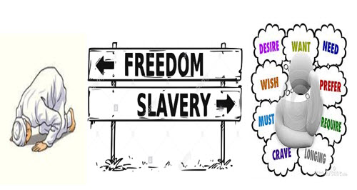

So اِیَّاکَ نَعْبُدُ means, It is only you and no one else but you that we worship; or willingly enslave ourselves to. Now what's really so powerful about this concept, is that by desiring this enslavement of Allah, we are essentially desiring freedom from everything else; because becoming the slave of Allah, provides freedom from every other slavery of this world. So essentially what we're recognizing through اِیَّاکَ نَعْبُدُ is that if we do not become the slave of Allah, we will end up becoming a slave to everything that is other than Allah. By recognizing our عبودیۃ to Allah, we get the حریۃ - which is true freedom. In completing the عبودیۃ to Allah, we are no longer slaves to ourselves; and that's a truly free person.

If I can't control myself, I'm a slave to myself. Somebody can say, "I'm free!", but then when the food shows up, they can't stop themselves. That's not freedom as far as the Muslim is concerned; he's not عبد اللہ he is عَبْدُ الْھَوَی; he is a slave of his passions. So عبد اللہ is that when that situation arises, he has تقوی of Allah. It's not that the temptation goes away. The desire is still there, because we're all human; so the شھوۃ might be there, but the عبد اللہ can control it; because he's not an عبد of that passion; he is a سید of it. He is a master of it. That's someone who is free - that's the حر. But that mastery is only attained through the slavery of Allah.

The tongue is the same. There are some people who just can't stop backbiting; they just can't stop gossiping. You can tell them! You can point it out to them a million times, but they can't stop. It's amazing. In most cases there are not even aware of it. I'm sure I do things like that as well. But this exists within us - this inability to control our tongues; to speak badly about others; to say things that we really shouldn't be saying; and people can't control it. So learning to control the tongue is also a major thing in Islam.

So when we say اِیَّاکَ نَعْبُدُ - it is only you we desire to enslave ourselves to, what's implicit in that دعا is that we desire freedom from the enslavement of everything else that is not from your command; everything else that is considered دنیا - money, houses, cars, children, food, branded clothes, friends, relatives. There are a million shackles that we wear around our necks; and the slavery of Allah frees us from all those shackles.

### Plural Form

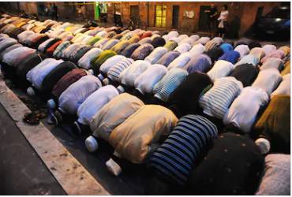

The next thing I want to point out is the fact that Allah uses the plural form here - اِیَّاکَ نَعْبُدُ. It is only you **we** worship. Now Let me ask you a question. The majority of the time when we pray, are we praying by ourselves or in a group or a congregation? We're by ourselves. So then can I say اِیَّاکَ أَعْبُدُ? It is only you "I" worship? Wouldn't that be more logical? So can I change it to the singular form? No, I cannot! Not permissible! not allowed. I cannot change it. So that's very interesting. Why did Allah fix this statement in the plural? Scholars explain that by fixing this statement in the plural Allah is emphasizing the importance of unity. Allah is emphasizing the concept of unity - that even when I pray by myself, I do not speak just for myself. I speak on behalf of the whole أمۃ ; on behalf of my entire community, I say اِیَّاکَ نَعْبُدُ. Why? Because the ultimate way to establish Unity is through the worship of Allah. That's why they say that a family that prays together stays together. A community that prays together sticks together. So the message in this verse and the following verses is to be and stay united as one family, one community, one nation.

### Assistance

The next thing we say is اِیَّاکَ نَسْتَعِینُ - it is **only you **that we seek **assistance **from. The word نستعین comes from استعانۃ which in turn comes from the root word عون and it means assistance. There are many other words in Arabic for help. There is نصر, there is مُساعَدۃ. there is نجدۃ. And these are all different kinds of help. نصر is a type of help that has a greater sense of urgency to it. It is for emergency type situations.

نَصْرٌۭ مِّنَ ٱللَّهِ وَفَتْحٌۭ قَرِيبٌۭ

When the help of Allah arrives, victory is near

‏إِذَا جَآءَ نَصْرُ ٱللَّهِ وَٱلْفَتْحُ

When the help of Allah arrives and you are victorious in battles

وَثَبِّتْ أَقْدَامَنَا وَٱنصُرْنَا عَلَى ٱلْقَوْمِ ٱلْكَفِرِينَ

Keep us steadfast and help us over the nation of disbelievers

When I'm in a situation where I can't do things on my own, and I need someone else to do it for me, the word I would use is نصر. The word عون is used for help in small matters. I need a glass of water. I could get up and get it myself, but if you went and got me a glass of water, you assisted me. That's عون. It is seeking assistance in daily tasks, little little things. So why is this distinction made in سُورَۃُ الْفَاتِحَۃِ where the word عون is used instead of نصر? It is because the quality and the sign of a true believer is that he is someone who turns to Allah سُبْحَانَهُ وَتَعَالَى all times - for all the little little things in his life. He doesn't just think of Allah in major situations, he remembers him in all of his day to day things, like a lover remembers his beloved - all the time! This is exactly what we find in the daily routine of our prophet ﷺ. When he woke up in the morning, what's the very first thing he did? He praised Allah

الْحَمْدُ لِلَّہِ الَّذِی اَحْیَانَا بَعْدَ اَمَاتَنَا وَ اِلَیْہِ النُّشُورُ

He went to the toilet

اعوذ بللہ من الرجس النجس الخبیث المخبث الشیطان الرجیم

He sought the protection of Allah from شیطان. He got on his horse

سُبْحَانَ الَّذِی سَخَّرَ لَنَا ھَٰذَا

Before he ate his food بِسْمِ اللَّہِ الرَّحْمَنِ الرَّحِیمِ. As soon as he finished eating اَلْحَمْدُ لِلَّہِ. He left his house

بِسْمِ اللَّہِ تَوَکُّلٌ عَلَیْہِ اللَّہِ وَلَا حَوْلَ وَلَا قُوَّۃَ اِلَّا بِاللَّہِ الْعَلِیِّ الْعَظِیمِ

So عون is used for seeking assistance of Allah - constantly. So the first reason is constant remembrance.

The second reason we constantly seek his assistance, is because we recognize that we are not ideal slaves. We are weak human beings; who desperately require assistance every step of the way. We are dominated by the desires of this world. We are challenged by innumerable distractions every single waking moment of our lives. We constantly walking this slippery slope; so we know it's not going to be easy to maintain our عبودیۃ. We are surrounded by the worst 4 enemies that are constantly working against us: First is our نفس, our soul that is weak to begin with. Then we have this دنیا the temptations of this world. Then we have ھوی - our overwhelming desires and passions; and then there is شیطان himself. We are surround on all sides by these powerful enemies. So we recognize and admit that our عبودیۃ and servitude is not going to be worthy of the رب العلمین; but we're still willing to try; and in that trying, we're going to need our masters help. When we fail over and over again, we will constantly need Allah to pick us up again - because only he can protect and assist us. Therefore اِیَّاکَ نَسْتَعِینُ ; it is **only you** we turn to for assistance in everything. So اِیَّاکَ نَعْبُدُ is making a willing commitment to Allah; and اِیَّاکَ نَسْتَعِینُ is asking him for assistance in getting the job done.

The third reason is to seek the closeness of Allah; the قرب of Allah. This is also the reason why the conversation switched from third person to second person. When we say اِیَّاکَ نَعْبُدُ وَ اِیَّاکَ نَسْتَعِینُ, we are now directly speaking with Allah. It's a more intimate conversation. And we're using that for two thing - worship and assistance. Scholars tell us, what this verse teaches us, is we all want to be near and dear to Allah. We all want to be beloved to Allah. We all want the nearness of Allah - but the ultimate way to establish that nearness; that love of Allah, is by worshiping him, and by calling out to him for assistance. That's why in a حَدِیثٌ قُدْسِیٌّ very explicitly Allah says, my slave does not get closer to me more so than by doing what I have told them to do. And that is the five times daily prayer. You want to be close to Allah - pray 5 times a day and keep calling him for assistance.

### Sequence

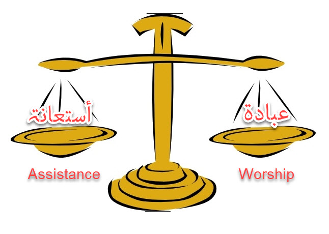

The next thing I want to talk about is the sequence in which these two words are used. What is mentioned first? عبادۃ - worship is mentioned first, followed by عون - the assistance of Allah. Why is that important? Because the sequence that you find in the Quran between things, is never coincidental. It always has a specific purpose. It's very precise. It's divine. So why is worship mentioned before seeking help? Because the best way to seek the help and the assistance from Allah; to ask Allah for anything and everything that we may need or want, is to ask after worshiping him. عَبْدُ اللَّہِ ابْنُ مَسْعُودٍ would tell his students

أِحْمَلُو حَوائجَکُم عَلی المکتُوبَۃ

Save your needs and your necessities for the فرض obligatory prayer. Whenever you need something whenever you're dealing with something difficult - don't worry. There is going to be a فرض obligatory prayer right around the corner. Use that as an opportunity to ask Allah to help you solve your problems. So worship and then seek the help and assistance of Allah.

### Repetition of ایاک

The last thing I want to point out is the repetition of this word ایاک. You can see that the word ایاک is used twice. اِیَّاکَ نَعْبُدُ and then اِیَّاکَ نَسْتَعِینُ. The word ایاک is repeated twice. Now grammatically speaking, if Allah omitted the second ایاک and just said: اِیَّاکَ نَعْبُدُ وَ نَسْتَعِینُ, - It is only you we worship and seek assistance from. That would have been grammatically correct. So then why did Allah repeat it when its not grammatically necessary? Does this mean that the second ایاک is not absolutely necessary to the meaning? No! So let's look at that.

When we say اِیَّاکَ نَعْبُدُ وَ نَسْتَعِینُ, both words نعبد and نستعین connect back to the same ایاک. But when I say اِیَّاکَ نَعْبُدُ وَ اِیَّاکَ نَسْتَعِینُ, they both now have their own ایاک. So what that does, grammatically, is that it makes both independent of one another. Now why would Allah do that? Because you see, Allah said worship and then seek assistance. That's the optimal method. That would be ideal. But there might be some of us who have lost their way. They're not praying to Allah. They're not worshiping Allah; and yet, because of life, they run into some difficulties or some tragedies; and in that difficult moments they need Allah's help. So Allah سُبْحَانَهُ وَتَعَالَى very subtly separates the two - just a little bit. He makes them independent for the sake of these people, to let them know that even if you weren't worshiping me and praying to me, don't worry, you can still ask for my help and assistance. My door is still open to you.

Worshiping me and then seeking assistance would be the ideal way; but even if you're not worshiping me, I will not deny my assistance to you. You can always come to me. You can always talk to me. You can always turn to me!

### Guidance

Now considering the relationship between a master and a slave, what is the slave constantly in need of from his master?Commands! Instructions! If there are no instructions from a master, technically that means you are free. So as عبد we need some instructions. Yes? The Arabic word for instructions is ھدایۃ which comes from the root ھُدی. So the next logical progression in this line of thought is that یا اللہ, now that I have enslaved myself to you; now that I'm committed to you; now that I'm depending on your assistance to fulfill my commitment, what is it that you want me to do? How can I pay off this debt of submission? How can I move towards you? How do I get closer to you? Give me some instructions. Give me some ھِدایۃ - and so the Surah progresses into اِھْدِنَا الصِّرَاطَ الْمُسْتَقِیمَ. Guide us, instruct us towards the straight path.

Scholars point out something very important here, in the sequence of these declarations. As we just learned اِیَّاکَ نَعْبُدُ is a commitment; it is a declaration; a promise. It's our sincere عہد شریف. That is followed by اِیَّاکَ نَسْتَعِینُ, a call for assistance after we put in the effort. That is then followed by asking for instructions - اِھْدِنَا الصِّرَاطَ الْمُسْتَقِیمَ. If you look at this sequence, we're not saying, Give me the instructions first. If I think I'll be able to do them; if they make sense to me; if I feel I'll be able to find the time to do them, then I'll do them. NO NO NO. All of that has already been covered in the earlier verses. Starting from اِیَّاکَ نَعْبُدُ we are committing; we're making a promise of عبودیۃ - that we will do whatever you tell us to do; cause that's all part of being a slave. You don't become a slave and then say, I'll do it if and when it makes sense to me. The making sense of it all was done in the first 3 verses

اَلْحَمْدُ لِلَّہِ رب العلمین؛ اَلرَّحْمَٰنِ الرَّحِیمِ؛ مَالِکِ یَوْمِ الدِّینِ

Those were the verses that make us realize that Allah is worthy of our عبودیۃ. Those were the verses where we got convinced of Allah's mastery over us. Those were the verses where we completed our homework; did all our research. You understand? The first 3 verses complete the theory portion of this . Starting from اِیَّاکَ نَعْبُدُ, it's practicals; it's action. Some people ask this questions, why do we have to take عہد? Why is that so important? Why do I have to make a promise to Allah? Because that is the action of commitment. You can think and ponder and plan all you want, but until you actually commit to something, you cannot produce change, isn't that true? Weight loss? The most common problem of our time! We can read all about weight loss. In fact, according to a study, obese people are usually the ones who know the most about losing weight; but until they commit to a lifestyle of good diet and exercise, they cannot lose the weight, right? Once they start their journey there are many resources available that can assist them in reaching their goal; because commitment and help go together. This is why we have اِیَّاکَ نَعْبُدُ وَ اِیَّاکَ نَسْتَعِینُ - I commit only to you and I seek only your assistance. The more sincere we are in our commitment, the more we can expect Allah to help us on our journey towards him.

## Guidance To The Straight Path

### Guidance

Now let's understand اِھْدِنَا الصِّرَاطَ. This verse is commonly translated as, "Guide us to the straight path". What does that mean? Think about this. When I say to you, "Guide me to your house", what am I asking for? Instructions, right? Directions. So that's what guidance essentially is - instructions or directions. Now how will you give me instructions? What are the different ways in which you can give me instructions? So for instance you can say "Take this particular road, and go 3 miles on it and then turn left. This is how we typically give guidance or directions to a particular destination.
Another way in which you can guide me is by saying, "Just stand at this bus stop. Take this particular bus and get off at this particular stop". This is guidance **through** the bus; it is guidance through a medium or through an intermediary. So what you're saying is that you don't have to do anything. The bus will do all the work for you. All you have to do, is make sure you're at the bus stop at the right time and catch the right bus; and the bus will get you to your destination.
The third way is that you say, "Look! I'm headed home right now. Why don't you jump in the car with me and I'll take you all the way. So these are the 3 ways by which you can guide me, or direct me to your house. First is through instructions; the second is through a medium, and the third is by literally taking me to that destination yourself. You understand the differences?

Now this is what is so cool about this verse - listen to this carefully. Asking for guidance through directions or instructions in Arabic is اِھْدِنَا اِلَی صِرَاطِ الْمُسْتَقِیمِ. Asking for guidance using a medium would be اِھْدِنَا بِالصِّرَاطِ الْمُسْتَقِیمِ. Asking for completely assisted guidance اِھْدِنَا عَلَی صِرَاطِ الْمُسْتَقِیمِ. Now what's interesting about the فاتحۃ is that we are not asking Allah for instructions by saying اِھْدِنَا اِلَی صِرَاطِ الْمُسْتَقِیمِ. We are not asking for instructions by saying اِھْدِنَابِالصِّرَاطِ الْمُسْتَقِیمِ. We are not saying اِھْدِنَا عَلَی صِرَاطِ الْمُسْتَقِیمِ. We are not using any of those words. We are just directly saying اِھْدِنَا الصِّرَاطَ الْمُسْتَقِیمَ. We're omitting the الی, the ب and the علی in our request for instructions. You see that? Why is that relevant? Because according to the rules of Arabic linguistics, when you don't use any of these words, what you actually mean is **all** of them at the same time. You understand? The principle of Arabic is that if you are using none of them, you're linguistically using all of them; otherwise you would have to use three separate sentences. So now when we say اِھْدِنَا الصِّرَاطَ الْمُسْتَقِیمَ what we're really saying is: direct me to the straight path through your instructions - which is the Quran. We're saying guide me to the straight path through your intermediaries - through the example of Rasul Allah ﷺ, Maulana Ali, Imams and the دعات; and finally, hold my hand and walk me along this path until I reach my destination; grant me your constant companionship as I walk along this path. SubhanAllah! Isn't that amazing?!

A school counselors guidance is information. A traffic officers guidance is information. The GPS guidance is information. But Allah's guidance is more than just information. Allah's guidance has to do with the personal choices that we have to make at every given moment. So we're not just asking for directions, we are also asking him for the strength and his assistance in helping us making those right decisions. These are two very different things. Because sometimes we can have all the right information and still make the wrong decisions.

Also, if guidance was just information, how many times do we need information. One time. Once I've been given the right information I do not have to ask for it again. Once I know the direction to your house - that's it! I'm not going to ask you again. How many times do we ask Allah for guidance? Over and over and over again. As a standard. It's like drinking water. You cannot say I drank water yesterday, I don't need it again. It does not work. If you want to survive you have to drink again and again every single day. Just as our bodies keep getting thirsty for water, our hearts keep starving for guidance. So we keep coming back to Allah with اِھْدِنَا الصِّرَاطَ الْمُسْتَقِیمَ.

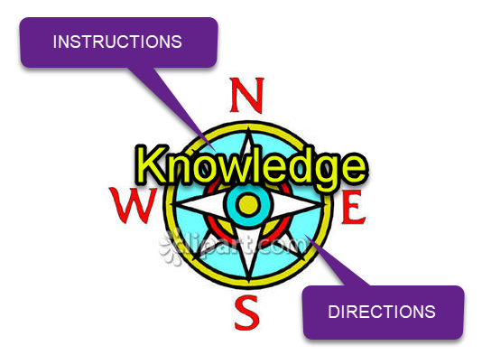

Now let's look at this word اھدنا which comes from the root word ھُدی . In this context the derivative is ھدایۃ which means guidance. It is also the root word for ھدیۃ. What does ھدیۃ mean? It means a gift. Now for an Arab living in the desert, when he's lost, what is the greatest gift you can give him? More than water! Water is not good enough; because water will last him one more day. Food will last him couple more days. So from an Arab's perspective - an Arab who is lost in the desert, what is the greatest of all gifts for him? Guidance! Directions back to his home; back to his family - that's the ultimate gift. So we're asking Allah, not just for any gift; we're asking Allah for the ultimate gift. Allah's guidance is the ultimate gift for a believer! It is so much more than just instructions or information. It completely changes the perspective of a believer from just a set of rules, to this sense of gratitude; because instructions and directions are now perceived as a gift.

### Path

Now let's look at صراط. What's a صراط? It's translated as a path, right? But in the Arabic language there are certain rules that go with the word صراط. The first rule is that it can only be used for a straight path. If a road is bumpy, or if it curves, or wavy, it cannot be called a صراط. By definition, the word صراط means the path has to be straight. صُراط is actually a perfectly straight sword. If the sword is curved, it's called سیف. So صراط means a perfectly straight path.

The second rule is that صراط can only be used for a **wide** path. By definition, it cannot be a narrow path. It's is a wide path that allows multiple people to travel on it at the same time. So think of it like a major highway with multiple lanes - except that it's a perfectly straight road. You understand?

Now there are other words in Arabic that can be used for a path. There is سبیل, there is فَج, there is طریق. Now what's interesting about these words, is that there are plurals available for all of these words. For سبیلthere is سُبُل. for طریقthere is طوارق. For فَجthere is فِجاج but there is no plural for the word صراط. It is a singular word; and this is why صراط also means - the **only path** that is available. So imagine there are two islands that are connected by a single bridge. The water between these two islands is very turbulent. You cannot take a boat to go from one to the other. The only way for you to go from one island to other is this one single, wide bridge. There is no other path you can take except this bridge. So if there is no alternative route available, then that bridge, that one singular wide path would be called صراط. So linguistically, the word صراط has a few peculiar characteristics. It is a wide path. It is a straight path; and it is the only path to a destination.

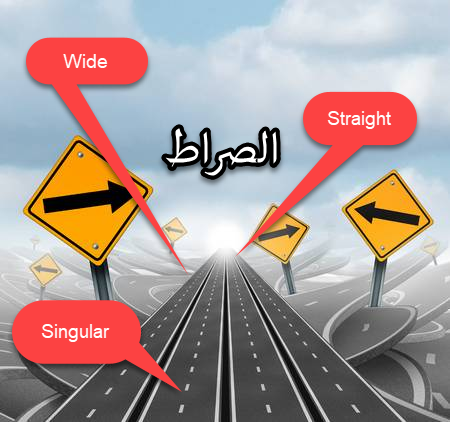

Now what does that means for us? It means that there can be many many paths available to us in terms of how we choose to live our lives. There can be many religions, there can be many belief systems - all of which can be correct; but the path that directly leads to Allah can only be one. It means that even though there are many different religions and philosophies - all explaining how to reach god - there can only be one true religion. A religion (a path) that will be the shortest distance between point A and point B - connecting the slave to his master.

Now what's even more interesting is that in this verse Allah did not say صراط, he said الصراط. He used the definite article - one particular path. صراط already meant one single path by definition. Then why say الصراط? Because even though Islam is the one true religion; there can only be one true sect within Islam itself. Isn't that incredible? Just by understanding the linguistics of the word, it answers ALL the questions we have. People ask all the time - Why does there only have to be one true religion? Why can't every religion be the true religion? Because the word صراط does not have a plural. So it can only be singular. It must be straight, which means it must take the shortest route to connect us with Allah; because the shortest distance between two points is a straight line. Also it must be wide, which means there must be acceptance for others along the way. But then there is also an الصراط, which means there is only one sect that will directly lead to Allah using the shortest distance. The most direct path. SubhanAllah! All these meanings encapsulated in the single word صراط. Not to say that the rest of Islam and all the other sects are garbage! No! Of course not. It'll just take them longer to get there; but they will all eventually get there. And so this is why all Muslims of all sects pray for the knowledge of this direct path to Allah by saying اِھْدِنَا الصِّرَاطَ الْمُسْتَقِیمَ.

### Straight

Now the word مستقیم. How is مستقیم translated? Straight path? But wait. We know the word صراط already implies straight; because if it wasn't straight, it wouldn't be a صراط. So why is Allah repeating himself? He's not. Because مستقیم does not just mean straight, it means upright. The word مستقیمcomes from قام or أستقامۃ which means to stand up. Not to go forward but to go up. Its from قیام, which means to stand upright. Like in our prayers we have قیام , we have رکوع and سجود, right? What does قیام mean? To stand up straight, right?

So when we say اِھْدِنَا الصِّرَاطَ الْمُسْتَقِیمَ, we are asking Allah for guidance on a path which heads which way? Straight up. A path of spiritual elevation! Now what happens when I travel on a path that puts me on an elevation? The more I travel on it, the higher I will rise over دنیا. Isn't that true? And as I rise higher, who am I getting closer to? I'm getting closer to Allah!

Now what happens to the view as you rise higher? It becomes better! You start getting a better perspective on things. We already established that walking this path is about gaining knowledge - so the more we learn, the more aware we become of the realities of this world and of the afterlife.

But there's a negative side to this as well. Because the higher you climb, the more danger there is of falling, right? If you are only 1 foot high and you fall you'll be okay. If you're 20 feet high and you fall, you're not going to be so okay. If your 100 feet high and you fall? اِنَّا لِلَّہِ وَ اِنَّا اِلَیْہِ رَاجِعُونَ right? In other words, the person who is traveling on this path for a long time, is he in less danger or is he in more danger? He is in more danger. This is why you'll see that the higher the rank of the person the more خشوع he has in his صلوۃ. The more fear he has in his heart. The more he cries on his prayer mat during صلوۃ. This is why we find these صحابۃ exercising extreme caution at every single step of their lives. Not because they loved to be miserable, which is the impression we get sometimes reading books of سیرۃ. Constant prayer, constant fasting. Allah never demanded that! yet we find these people striving to nth degree. Why? Because of this caution and this superior perspective. We look at them and think they're suffering, but if you asked them, they'd say they're enjoying - because they're excited about their destination and so the work to get there no longer feels like work, you understand?

Think about a rocket that is headed towards space. That's الصِّرَاطُ الْمُسْتَقِیمُ. It is on a path that is directed upwards, right? Now we know that this rocket needs a lot of force to overcome the gravity of this earth, isn't it? But once it breaks through the gravitational field and enters space, there's no effort required for movement. All it needs is a bit of thrust here and there and it'll just glide to its destination. That's what the صحابۃ aimed for. That's why they put in so much work; but then once they perfected it, once they rose above the perspective of this دنیا; once they became aware of this unlimited and infinite space of the solar systems, galaxies and the universe - this insignificant دنیا became worthless to them. If you look at it from this perspective, you can reconcile a lot of their behavior in this world.

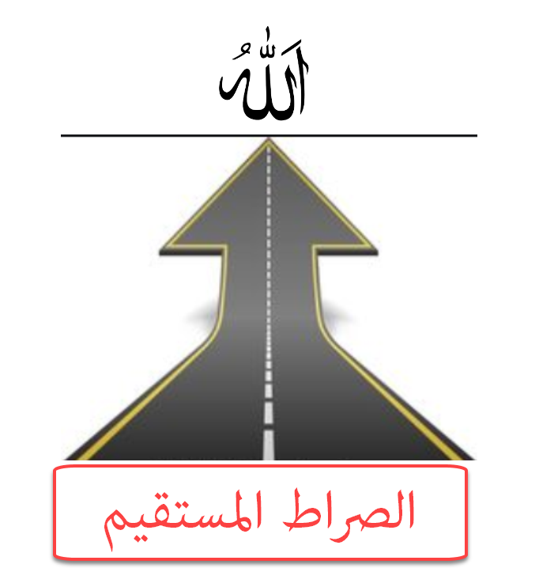

So we pray اِھْدِنَا الصِّرَاطَ الْمُسْتَقِیمَ what we're actually saying is grant us the gift of guidance, grant us the gift of true knowledge through your book. Guide us through the practical examples of your beloved and chosen people; and as we begin our own spiritual journey towards you, accompany us every single step of the way. Assist us as we walk this this path that is straight, wide and the only path, that elevates us towards you. Help us see things clearly as we rise over this دنیا and move towards you; and protect us from falling back into this دنیا. This is the عون the assistance that we beg for daily in our 5 prayers.

### The 3 Paths

Then we say صِرَاطَ الَّذِینَ اَنْعَمْتَ عَلَیْھِمْ The path of those upon whom you bestowed your favors. This verse uses the past tense. Why past tense? Because all these role models exist in the past. When students want to get some good career advise, who do they seek that advise from? From their fellow students or from graduates? Obviously the graduates. You're not going to ask your friends who are studying with you in school about career advise. If you want to become a doctor, you'll take advise from graduate doctors. What courses did you take? How did you get into that program? What are the things that I need to focus on? So the verse says صِرَاطَ الَّذِینَ اَنْعَمْتَ عَلَیْھِمْ The path of those on whom you **showered** your blessings. The path of the prophets; the path of the messengers; the martyrs; and the righteous people. The word انعمت comes from the word نِعَم which means something very smooth and soft. You know the word in Arabic for cattle - cows and sheep, they're called انعام because they walk slowly; they move in a gentle manner. So this verse is identifying and specifying the path requested in the previous verse - اِھْدِنَا الصِّرَاطَ الْمُسْتَقِیمَ. O Allah guide me to the path of spiritual elevation! Which path? The path of those who were successful in reaching you; those who you got through the trial of the world in a soft and smooth manner and achieved spiritual elevation. That's صِرَاطَ الَّذِینَ اَنْعَمْتَ عَلَیْھِمْ.

Then he says غَیْرِ الْمَغْضُوبِ عَلَیْھِمْ Not on the path of those who received your غضب; who became the recipients of your wrath. وَلَا الضَّالِّینَ and not on the path of those who are lost.
This is so interesting. When the verse talked about blessings نعمۃ it read - on whom **you** showered your blessings; but when it came to غضب the verse reads الْمَغْضُوبِ عَلَیْھِمْ. The one's who received غضب. It leaves out the subject. It just says those who received anger; not those who received your anger. No! You see the difference?

When I say "He got beaten". The question is who did the beating? It could be one; it could be many, right? So what this is telling us is that those who receive Allah's anger, they're not just receiving Allah's anger, they're receiving the anger of messengers; of angels; of other believers; the heavens, the earth. They're receiving the wrath and the anger from all directions. And so the verse does not mention Allah when it talks about غضب. But it specifically mentions him when it talks about blessings اَنْعَمْ تَ عَلَیْھِمْ the ones you showered blessings upon. But غَیْرِ الْمَغْضُوبِ عَلَیْھِمْ not on those who received anger. Because anger or غضب was never the intention of Allah to begin with. Because he's الرحمن and الرحیم. So whatever they did - they did it to themselves. They earned it themselves. But the ones who received blessings. Allah helped them all along - towards the right path; with the help of instructions; with the help of intermediaries; and by helping them along the way with his ھدی; with his knowledge. So in other words صِرَاطَ الَّذِینَ اَنْعَمْتَ عَلَیْھِمْ means - on the path of those who you granted knowledge. The knowledge of realities; the examples of how to act upon that knowledge through role models like Rasul Allah ﷺ and Maulana Ali; the Imams; and then that personal divine companionship itself along the way. SubhanAllah!

So صِرَاطَ الَّذِینَ اَنْعَمْتَ عَلَیْھِمْ The path of those who you gave knowledge to and who acted upon that knowledge.
غَیْرِ الْمَغْضُوبِ عَلَیْھِمْ. Not on those who you gave knowledge to but they chose not to act upon it.

وَلَاضَالِّینَ and not on the path of those who act, but they have no knowledge of what they're doing. ضالین means the ones who are lost. Who do not know any better. Notice the word صراط is not used with مَغْضُوبٌ عَلَیْھِمْ and it's not used with ضالین, because they're the ones who did not choose this path.

### Wrath vs Lost

Now let me try to explain the difference between مَغْضُوبٌ عَلَیْھِمْ and ضالین. I'll give you an example. I have two kids Erum and Amir. Erum is 13 years old and Amir is 7 MashaAllah. They both love chocolate chip cookies. I buy a fresh box from the store. I show it to Erum and I say - look guys are know these are your favorite cookies. See how nice and fresh they look? Here! Smell it. Smells good? You can't have them! I'm going to place these right here on the table, OK? I'm going to go downstairs in my basement to record these sessions on فاتحۃ. When I come back, we will eat these together; but until I return don't touch these cookies; and also make sure that Amir does not eat them. OK? you understand? Good girl.

I go in the basement. I record my sessions; and when I go upstairs. what do I find on the couch? Two cookie monsters. GHUP GHUP GHUP. They're both wolfing the cookies down. Now who am I going to get really mad at? Erum or Amir. Obviously Erum. Why? Because I explicitly; very clearly told her not to eat the cookies. Amir did not even know about it. So obviously I am going to be a LOT MORE angry with Erum. You knew better! I clearly told you not to eat these cookies and you still disobeyed me. You are grounded till you're 30; and while I'm scolding her Amir is looking at me innocently and still eating the cookies .

But you understand the difference? The difference between مَغْضُوبٌ عَلَیْھِمْ and ضالین is that مغضوب are the ones who were given the نعمۃ of knowledge, and they still disobeyed Allah. They still did the wrong thing. But ضالین are the one's who had no clue that they were doing the wrong things. Doesn't mean they're innocent. Doesn't mean they will not be taken to account. Because Allah gave us all intellects - which is a proof and حجۃ for and against each and everyone of us. That we need to seek the knowledge. So these people should have strived to gain the necessary knowledge of Allah سُبْحَانَهُ وَتَعَالَى. and then do the right thing. They should have made the effort to know better. So they're not off the hook in any sense. But they're still better than the مَغْضُوبٌ عَلَیْھِمْ. You understand?

Some people when they learn this, they say - you know what - I'm simply not going to gain any knowledge. I'm going to stay ignorant; I'll just stay among the ضالین. Wait wait wait. That's not a good idea buddy. Because Allah says غَیْرِ الْمَغْضُوبِ عَلَیْھِمْ وَلَضَّالِّینَ not on the path of those who received anger; nor from the ones who remained lost. So the ضالین will lose out and will be punished for not trying to find the right path. They're both groups of losers. So its really NOT a smart idea to be from either of those groups. The group we want to belong to is from the اَنْعَمْتَ عَلَیْھِمْ group.

This is the real message of the Fateha - the balance between knowledge and action.

بِسْمِ اللَّہِ الرَّحْمَنِ الرَّحِیمِ. اَلْحَمْدُ لِلَّہِ رَبِّ الْعَالَمِینَ. اَلرَّحْمَٰنِ الرَّحِیمِ. مَالِکِ یَوْمِ الدِّینِ

These are all about the knowledge we need. Then

اِیَّاکَ نَعْبُدُ وَ اِیَّاکَ نَسْتَعِینُ

This is our recognition, and our acceptance of this knowledge being the one true knowledge; and our commitment to Allah. After that

اِھْدِنَا الصِّرَاطَ الْمُسْتَقِیمَ

Guide us to the ONLY straight and wide path of knowledge that elevates us towards you. Guide us to the path of ایمان. Give us the ULTIMATE gift of ایمان.

صِرَاطَ الَّذِینَ اَنْعَمْتَ عَلَیْھِمْ

Through the path of Islam which is your true blessing. The path that is the perfect balance between knowledge and action. Through the examples of role models of the people of the past that you have favored. The ones who were wise; who had wisdom. Remember definition of wisdom?. To have correct knowledge and then act upon it. So make us among those who when you provide them with knowledge, they acted upon it.

غَیْرِ الْمَغْضُوبِ عَلَیْھِمْ

Do not make us among those who gain knowledge, but then do not act upon that knowledge. For those are the people who will receive wrath from all directions on the day of judgment because of their bad decisions

وَلَا الضَّالِّینَ

And do not make us from among those who act without knowledge. Because they are the ones who are lost.

So the essence of سُورَۃُ الْفَاتِحَۃِ is 3 things. Gaining the knowledge of Allah. Striving to acquire the knowledge of his Tawheed. Making a commitment, a promise, a عہد, which has to come first before action. And only after that comes the instructions, the ھدی. And then we ask Allah to make us among those who created a balance between their knowledge and action.

Maulana Ali says.

اَلعِلمُ بِدُونِ العَمَل وَبَالٌ . وَالعَمَلُ بِدُونِ العِلمِ ضَلالٌ

Knowledge without action is a calamity on the soul. And action without knowledge is ignorance - it's a perversion.

Success lies in the middle. It lies in the balance of knowledge and action. That is the true manifestation of عبودیۃ . A slave who obeys through knowledge; who strives to understand the wisdom of his masters commands; and then practically acts upon it. He demonstrate his حمد for its master.

## Staying Steadfast On The Path

Now that we've completed سُورَۃُ الْفَاتِحَۃِ I wanted to do a session on this idea of استقامۃ which is remaining steadfast on the straight path. This is one of the major challenges of walking the path. We all want to walk the straight path, but we're not always able to, for various reasons; and then we end up getting frustrated with ourselves and sometimes with religion itself. This is something that I have personally struggled with extensively in my life, but then AlHamdulillah I came across some material and some perspectives that has helped me a lot - and so I thought I'd share it with you, hoping and praying that'll it'll do the same for you.

### Foundation

In سُورَۃُ الْفَاتِحَۃِ we request Allah for guidance by saying اِھْدِنَا الصِّرَاطَ الْمُسْتَقِیمَ - Guide us towards the straight path. This verse is the essence of the Surah. The initial verses basically build up to this one. It's the prayer of all prayers - Guide us! Guide us through instructions, role models and through your divine companionship. What is this صِرَاطُ الْمُسْتَقِیمِ exactly? Allah defines it in سورۃ یس. He says:

> ‏وَأَنِ ٱعْبُدُونِى ۚ هَذَا صِرَطٌۭ مُّسْتَقِيمٌۭ ‎۶۱
>
> And Indeed you should worship Me. This is a Straight Path.

So عبادۃ or عبودیۃ - willing submission is how Allah defines the straight path. The person who willingly submits himself or herself to Allah is the one who has found the straight path - which AlHamdulillah we all have. But how do we walk the path? Because we don't get to your destination by just finding the correct path; we get to it by walking that path, right? So how do we walk this path? What's the term for walking this path? That term is تقوی - a strong mindfulness for the presence of our master in our lives. تقوی (piety) is essential for عبودیۃ - for attaining the ranks of servitude. That's what we asked for when we said اِیَّاکَ نَعْبُدُ وَ اِیَّاکَ نَسْتَعِینُ. It is only you we worship (again, worship being the straight path), and it is only you we seek help from. What is the method of استعانۃ - seeking Allah's help? He explains that in سُورَۃُ الْبَقَرَۃِ.

> ‏وَٱسْتَعِينُوا۟ بِٱلصَّبْرِ وَٱلصَّلَوٰةِ ۚ وَإِنَّهَا لَكَبِيرَةٌ إِلَّا عَلَى ٱلْخَشِعِينَ ‎۴۵
>
> And seek help in patience and prayer. Truly it is extremely heavy and hard except for the ones who possess knowledge of Allah.

Same word ٱسْتَعِينُوا۟. So now we just solved this equation. We all desire صِرَاطُ الْمُسْتَقِیمِ the straight path - مستقیم as I said earlier, is a path with استقامۃ built into it. A path of spiritual elevation. How is it achieved? Through عبودیۃ. Willing servitude to the will of Allah. How do we walk this path? By developing piety - تقوی. - an awareness of who Allah سُبْحَانَهُ وَتَعَالَى is; by establishing a connection with him. How do we connect with him? بِٱلصَّبْرِ وَٱلصَّلَوٰةِ - Through patience and prayer. Now we all know about the daily prayers, but what does صبر mean here in this context? It means to be steadfast and consistent with prayer وَإِنَّهَا لَكَبِيرَةٌ - which is truly an extremely difficult task for most; إِلَّا except; ٱلْخَشِعِينَ, the one's who possess the knowledge and awareness of the majesty of their lord; those who have تقوی.

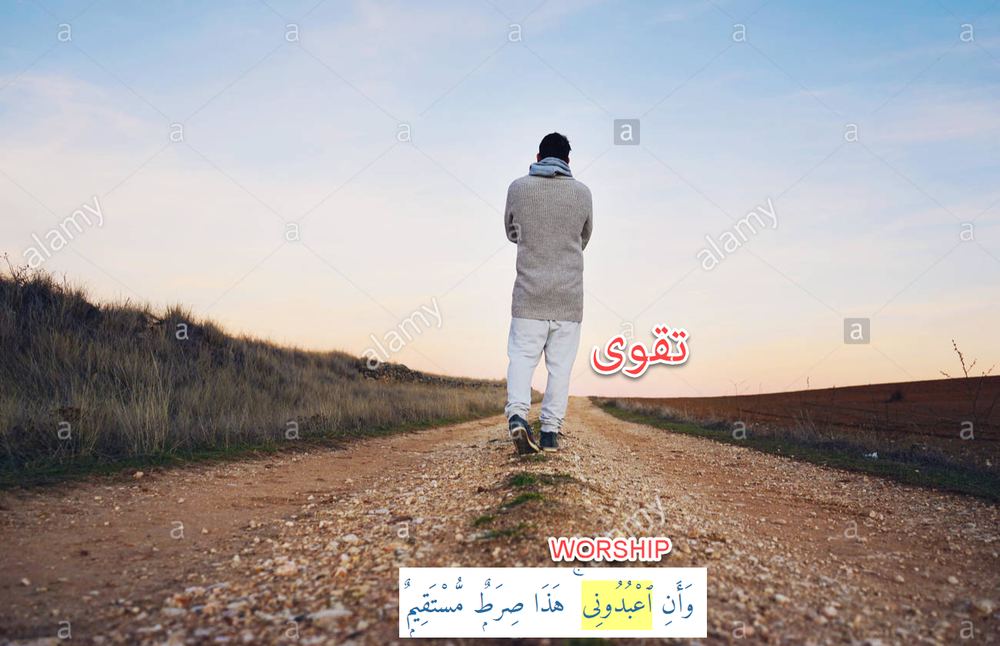

So it all ultimately boils down to consistency and being steadfast - استقامۃ? What is استقامۃ? It comes from the same root word قام for مستقیم. The word أِستَقِم means to stay firm. Allah سُبْحَانَهُ وَتَعَالَى says in the Quran

> ‏وَأَقِيمُوا۟ ٱلصَّلَوٰةَ وَآتُوا۟ ٱلزَّكَوٰةَ وَٱرْكَعُوا۟ مَعَ ٱلرَّكِعِينَ ‎۴۳

He's telling us to establish; to be firm in our صلوۃ. So استقامۃ is to establish something firmly or to be solid in something; to be firm in it. Resilience is one of the words; Grit - some people use the word grit. So استقامۃ is the ability to stand firm and be consistent in our in our ایمان; in our worship and our belief.

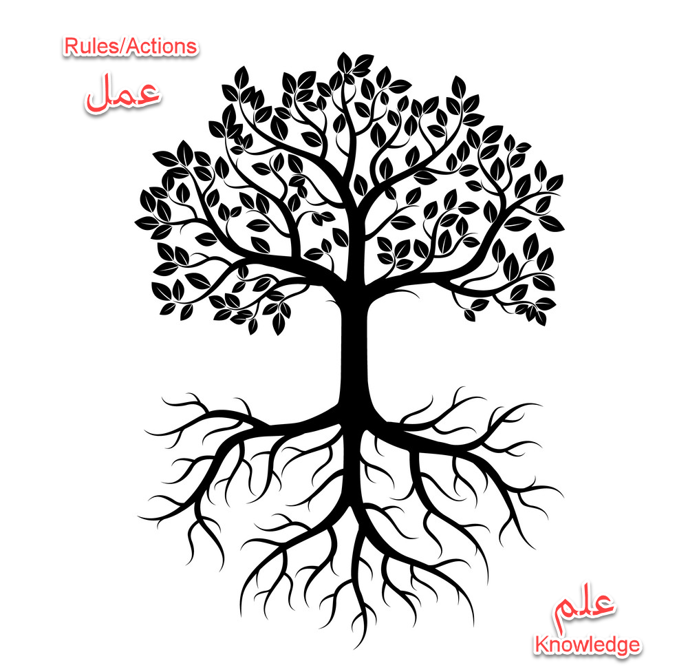

To give you sort of an illustration from the physical world, you can learn about استقامۃ by observing a solid tree. Why? Because it stands firm and solid, even when the wind blows. Even if a storm hits, it stays firm. Now the question is, how can we be like that? How do we develop the ability to stay strong on this path despite the storms of our situations and environments? You must have noticed that in many verses Allah سُبْحَانَهُ وَتَعَالَى mentions two things when he talks about faith

الَّذِينَ آمَنُوا۟ وعمل الصلحات

He always couples ایمان with عمل. He couples faith with action. So we know that there are two parts to what we're supposed to do. There is the inner part; and then there's the outer part. What's the inner part? The belief - the ایمان. Another way we can think about this in terms of عبادۃ is that there is worship for the heart; and then there is worship of the limbs; the body, the tongue, the ears, the eyes. You understand? There are the internal عبادات and then there are the external عبادات. The internal part has to do with our belief system; our ایمان. - how we think of Allah سُبْحَانَهُ وَتَعَالَى ; how we view Allah سُبْحَانَهُ وَتَعَالَى ; how we respond internally with the things that we face in life. That's internal - our certainty or doubt. Certainty is یقین Doubt is شک.

What are the external عبادات? the prayers, reading Quran, guarding our ears, guarding our eyes - all of that are the external type of عبادہ.

### Heart is in Control

Now what do you think is essential for استقامۃ? The internal or the external? Our prophet ﷺ said in a HADEES:

قَالَ رَسُولُ اللَّہِ صَلَّی اللَّہُ عَلَیْہِ وَ آلِہِ وَ سَلَّمَ

> أِنَّ فِی الجَسَدِ مُضْغَۃ۔ أِذَا صَلُحَتْ صَلَحَ الجَسَدُ کُلُّہ وَ أِذَا فَسَدَتْ فَسَدَ الجَسَدُ کُلُّہ۔ أَلا وَھِیَ القَلْبٌ
>
> Indeed in the body there is a lump of flesh. If it is set right, then the entire body will be set right. And if it is corrupted, then the entire body will be corrupted. Indeed it is the heart.

اِنَّ فِی الْجَسَدِ مُضْغَۃً- indeed in the body, there's a lump of Flesh

اِذَا صَلُحَتْ صَلُحَ الْجَسَدُ کُلُّہُ - If it's set, right then the entire body will be set right

وَاِذَا فَسَدَتْ فَدَسَ الْجَسَدُ کُلُّ and if it is corrupted then the entire body will be corrupted

اَلَا وَھِیَ الْقَلْبُ indeed it's the heart.

So what are we learning from this HADEES? We're learning that the master of the body, isn't actually the mind - which sounds a little strange - because many people believe that the mind is what is in control. Well, newsflash! It's actually your heart that controls your mind. What do I mean by that? The type of heart that you have, will control your thoughts, your mind, your actions. Whatever your heart desires, your mind will think of ways to fulfill those desires, and then the limbs will make it happen. So the mind becomes a tool, to execute whatever is in the heart. This is why the prophet ﷺ said, that if you take care of this lump of flesh, which is the heart - *everyone be clear that when I say the heart, I'm not talking about the physical heart. I'm talking about the spiritual heart - the *قلب. So if that heart is purified - when you take care of the heart, when you feed the heart; when you rectify the heart - then all your actions will automatically become pure. But when the heart is corrupted; when the heart is starved; when the heart is not taken care of; when the heart is deprived of its spiritual sustenance then the rest of the actions will naturally be corrupted.

Now what's really interesting is that if you look at the chronological theme of revelation, the first verses to be revealed were not about drinking alcohol; or not committing fornication. They were not about the rules of حرام and حلال. The first verses to be revealed were all about building تقوی of Allah سُبْحَانَهُ وَتَعَالَى ; building an attachment with Allah سُبْحَانَهُ وَتَعَالَى ; about understanding the day of judgement - learning that we will be taken to account for our actions; that we're not just living in this life without a purpose. That there is a purpose to Allah's Oneness.

So the initial verses of revelation were about the day of judgment; about retribution; about life after death; about who Allah سُبْحَانَهُ وَتَعَالَى is and what he wants from us. Why? Because all those initial verses of revelation were building a foundation. They were setting the foundation of استقامۃ.

See if you go back to the example of that solid tree - Allah سُبْحَانَهُ وَتَعَالَى says in Surah Ibrahim when he gives an example of a good word - he says it is like a good tree.

> ‏أَلَمْ تَرَ كَيْفَ ضَرَبَ ٱللَّهُ مَثَلًۭا كَلِمَةًۭ طَيِّبَةًۭ كَشَجَرَةٍۢ طَيِّبَةٍ أَصْلُهَا ثَابِتٌۭ وَفَرْعُهَا فِى ٱلسَّمَآءِ ‎۲۴
>
> Do you not see how how Allah sets forth the example of a good word, which is like a beneficial tree, its root are firmly fixed, and its branches to the sky.

Its foundation is solid ثابت and then its branches rise towards the sky. See you can become elevated. You can grow; you can can get higher - but only if you have solid roots. Does that make sense? The taller a tree gets, the deeper its roots have to go. If you study the way Allah has designed a tree, you'll find that the taller it is, the more deep and wide its roots are spread within the earth. Even mountains have foundation; and the taller it is, the more it has to be grounded within the earth. Everything in existence - in order for it to be solid; and be firm; and to have استقامۃ, it has to have a solid foundation. And so Allah سُبْحَانَهُ وَتَعَالَى is telling us - even in the training that he gives us, he did not start out with rules. He started out with building our foundation.

This is why سورۃ الفاتحہ which is essentially the summary of the entire Quran, it begins by creating an understanding of who Allah سُبْحَانَهُ وَتَعَالَى is.

> ‏ٱلْحَمْدُ لِلَّهِ رَبِّ ٱلْعَلَمِينَ ‎۲‏ٱلرَّحْمَنِ ٱلرَّحِيمِ ‎۳‏مَلِكِ يَوْمِ ٱلدِّينِ ‎۴

All about knowing Allah. Once this foundation is built, engendering تقوی, engendering توکل our trust in Allah سُبْحَانَهُ وَتَعَالَى, only then we are taught to ask for rules and guidance

> ‏إِيَّاكَ نَعْبُدُ وَإِيَّاكَ نَسْتَعِينُ ‎۵‏ٱهْدِنَا ٱلصِّرَطَ ٱلْمُسْتَقِيمَ ‎۶‏صِرَطَ ٱلَّذِينَ أَنْعَمْتَ عَلَيْهِمْ غَيْرِ ٱلْمَغْضُوبِ عَلَيْهِمْ وَلَا ٱلضَّآلِّينَ ‎۷

The beginning verses are designed to build a solid foundation so that when the rules are revealed, we can have استقامۃ. You understand?

Let's go back to the example of the tree. When the wind blows, if the roots of the tree are deep and firm within the ground, what happens to the tree? Well, it's leaves might move, the branches might shake, but the tree stays standing right? It's solid! But what happens to a tree that doesn't have deep roots. It'll get knocked over, right?

### Unhealthy Shame

I think the problem with Islamic training these days, is that we are raised in such a way that we don't have solid roots. Our training method is the "rule shaming" method - the rule-oriented / shaming method. This is the method where you growing up as a kid, the only thing you really learn about is حرام and hellfire. The emphasis is on - if you do حرام you will go to Hell Fire, right? That's how many of us were raised, and that's how many of us are raising our children. Well it is true that there are things that are حرام. It is true that there is hellfire. It is true that Allah سُبْحَانَهُ وَتَعَالَى has anger and wrath - this is all true. But why are kids being taught that, **above** his Mercy? Why are we not teaching our children that Allah is the most merciful - and that even if you make a mistake you can repent, and you can try again. Why is this not the message that is being taught? and the answer unfortunately - is because this is to control the behavior of the child; and so many of us use fear as that control mechanism. The only problem is that it backfires.

Do you know how it backfires? I'll tell you how it backfires. When you're using false fear, or false shame, unhealthy shame to control someone's behavior, you're not building solid roots. You're just building avoidance.
Imagine that you grow up in a household where you're always being told - you better watch out or the police is going to throw you in jail. You better not make a mistake, you better not do this; you better not do that - basically you're taught to be afraid of the police. Why? Because the police is made out to be this very wrathful, scary entity. Now if you grow up with this kind of training - best case scenario - you will learn to to avoid the police. But are you going to want to be close to the police? Will you want to be best friends with the police? Are you going to confide your problems to the police? Are you going to ask the police for help when you're in trouble? No! Because you don't trust the police; and you've been told that the police is just there to punish you. You see?

So what's happening is that this type of training is not building استقامۃ in our youth and in our own selves. It's building avoidance. So many people raised in this way, when they grow up, they don't want to have anything to do with Allah سُبْحَانَهُ وَتَعَالَى. They actually want to avoid Allah and religion. Why? Because they say you know what? Everything is حرام and no matter what I do, I'm going to end up going to hell anyway. Everything I do is wrong anyway, so what's the point in trying? Oh, you know I if I make any small mistake Allah is going to punish me, so I should just avoid this whole Allah thing. I should just avoid this whole religion thing. You see what's happened? It has backfired. Why? Because we are trying to grow this tree of Islam within ourselves, and our children - without any solid foundation. So even if the tree of such an Islam miraculous grow, it's not going to survive the smallest earthquake.

We need to focus on building a solid foundation - so that when life hits us - because we are going to be shaken in life - look at the times we live in - all this temptations around us. The tree of Islam within our hearts will be shaken from time to time through tests and trials. Allah سُبْحَانَهُ وَتَعَالَى says in the Quran

> ‏أَمْ حَسِبْتُمْ أَن تَدْخُلُوا۟ ٱلْجَنَّةَ وَلَمَّا يَأْتِكُم مَّثَلُ ٱلَّذِينَ خَلَوْا۟ مِن قَبْلِكُم ۖ مَّسَّتْهُمُ ٱلْبَأْسَآءُ وَٱلضَّرَّآءُ وَزُلْزِلُوا۟ حَتَّىٰ يَقُولَ ٱلرَّسُولُ وَٱلَّذِينَ آمَنُوا۟ مَعَهُۥ مَتَىٰ نَصْرُ ٱللَّهِ ۗ أَلَآ إِنَّ نَصْرَ ٱللَّهِ قَرِيبٌۭ ‎۲۱۴
>
> Or think you that you will enter Paradise without such as came to those who passed away before you? They were afflicted with severe poverty and ailments and were so shaken that even the Messenger and those who believed along with him said, "When the Help of Allah?" Yes! Certainly, the Help of Allah is near!

‏أَمْ حَسِبْتُمْ أَن تَدْخُلُوا۟ ٱلْجَنَّةَ وَلَمَّا يَأْتِكُم مَّثَلُ ٱلَّذِينَ خَلَوْا۟ مِن قَبْلِكُم

Do you think that you will enter Paradise without going through that which those who came before you went through?

مَّسَّتْهُمُ ٱلْبَأْسَآءُ وَٱلضَّرَّآءُ وَزُلْزِلُوا۟

They were struck with calamity, adversity, struggle and they were shaken. The word زلزل in Arabic is from the same root as the word زلزال which means earthquake. .

حَتَّىٰ يَقُولَ ٱلرَّسُولُ وَٱلَّذِينَ آمَنُوا۟ مَعَهُۥ مَتَىٰ نَصْرُ ٱللَّهِ

They were so shaken so much that even the messengers, and those with the messengers asked when will the help of Allah come? And Allah سُبْحَانَهُ وَتَعَالَى

أَلَآ إِنَّ نَصْرَ ٱللَّهِ قَرِيبٌۭ

Indeed! the help of Allah is near. The help of Allah isn't just there, it doesn't just exist as a concept - it's there right now with you as you're going through the test. Allah says that we are closer to us than our jugular vein.

So we are going to be shaken from time to time. How does a building withstand an earthquake? The answer all goes back to the type of foundation it has - that will determine its استقامۃ. So the question we have to ask ourselves is... What type of foundation do I have with Allah سُبْحَانَهُ وَتَعَالَى? When I am tested through pain or pleasure, will I be able to withstand it and be firm on the straight path?! If the answer is no... then I need to work on my relationship with Allah, not on the rules.

This is why scholars said that the first verse that were revealed didn't say - give up alcohol and give up fornication- because people would have said we'll never give up these things if it started with that - Why? Because they had not yet built a foundation. They had not yet built the roots of the tree. So if you come to a person from the very beginning and you give them rules, they're not going to follow the rules if it goes against what they want.

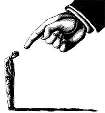

That is the mistake many of us are making. We're not building a foundation - instead we're constantly throwing rules at them. We're not talking about building an attachment with Allah. We're not teaching them to love Allah. We're not teaching them what it really means to put our reliance on Allah. Where is that being taught to children? The only thing being taught to children is that it's حرام to eat this; it's حرام to drink this. It's حرام to dress like this; it's حرام to say this - That's it! And the problem with that method is it's being rejected. Just as the scholar said - that's exactly what they said. That if you start off with the rules; if Allah had started off with the rules - even with the companions - they would have rejected the rules. But Allah did not start with the rules. Look at جز عم - the 30th chapter of Quran - it's basically Meccan. Majority of the verses in that جز were revealed in the beginning of Islam. Do you find any rules in it? Not really! It talks about Allah, his love, his mercy, the day of judgment. It talks about human beings and their relationship with Allah. It talks about human psychology. It talks about تقوی. It talks about توکل, it talks about retribution. It teaches about جنۃ جھنم. It focuses on how to treat one another- that's what's in جز عم. because that was the foundation building. If you want استقامۃ you have to build a foundation in the love of Allah.

See when we generally talk about تقوی we think in terms of shame and fear; and you might say well isn't that a good thing? What's wrong with fear? Today psychologists are telling us that there is healthy fear and there is unhealthy fear. Okay, there is healthy fear and there's unhealthy fear. Let me give you an example.

You know when you do something really really bad. And you're really scared of your parents, or your loved ones finding out. Sometimes what do you do? Do you run to the parents or to your loved ones? Or do you run away from them? You run away and hide right? So there's basically two ways to respond when you hurt someone or you make a mistake. Imagine that you hurt your closest friend or your spouse. You know, there are some people who feel so bad about it, or so ashamed for what they've done - they hide! They try to avoid the person; they try to hide from the issue; they avoid the conversation. They distance themselves from the person right? Is that a healthy way to deal with it? Does that solve the problem or does it make it worse? It makes it worse. This is exactly what some of us do with Allah. When many of us feel like we've made a mistake, and we feel ashamed - instead of going to Allah, we run away from Allah. We try to hide from Allah. We don't want to pray anymore, because we feel ashamed; or we don't want to talk about Allah, or maybe we want to leave religion completely because we feel ashamed.

But what's a healthier way to deal with that? When you've hurt someone? What's the healthiest way to fix it? To go to the person and what? apologize. To go to the person and say I'm sorry. I regret it! I admit I made a mistake! I'm going to try to do better! That is استغفار and توبۃ. That's what we're supposed to do. That's healthy fear. That's a healthy response, when you make a mistake - that instead of trying to hide from Allah; instead of saying I want nothing to do with religion, I want nothing to do with God. I'm not even going to try; I'm not going to pray because I've committed so many sins - I feel too ashamed to face Allah. That's an unhealthy type of shame. But تقوی is healthy fear. It is the kind of healthy shame that will help you try to stay away from what displeases or angers Allah. And when you do what angers Allah, you will rush to apologize; you will rush to repent; to show your regret and to try to make it better.

The reason I'm mentioning this, is because I feel what's happening, is that we are feeding the wrong kind of fear and shame. Because when you teach about Allah like a scary policeman, نعوذ بللہ, you're encouraging yourself, your children, and the people around you to actually avoid Allah - you're teaching them to run away from Allah; not to run towards him - to apologize; to fix it.

So healthy fear will motivate us to get closer to Allah and repent. Unhealthy shame will make us run away from Allah سُبْحَانَهُ وَتَعَالَى and avoid him out of shame. So in order for us to have this ability to be firm in our دین to have استقامۃ we need to develop this healthy fear of Allah سُبْحَانَهُ وَتَعَالَى called تقوی.

### Myth of Perfection

Now how do we build healthy fear? You know what the seed of healthy تقوی is? This is interesting. Let me put it this way. Let me back up. What's the seed to unhealthy shame? We know that a seed grows into a tree right? But it all starts at the seed level. So if you want to address something go look at the seed, the root cause, right? Now if you look at the seed of unhealthy shame, you know what it is? It's thinking that you're supposed to be perfect. It's this myth of perfection that lies at the root of our problems. It's when you're taught, or you believe that you're actually supposed to be perfect. If you believe that, then you will you will react with unhealthy shame when you make a mistake. Why? Because you feel like I was supposed to be perfect and I'm not perfect and I am so ashamed of myself. I'm not even going to try anymore. It leads you into despair. But what was the root cause? what's the seed of it? That you thought you were supposed to be perfect - because that's what we're taught - by our family and our teachers.

Now, let's go to the root or the seed of healthy تقوی and healthy استغفار and healthy توبۃ - going back to Allah. Do you know what the root is? You know what the seed is? knowing that all human beings will make mistakes. It's the opposite. It's realizing that the human being is imperfect. Understanding that we have have been created as imperfect human beings. When you know that, when you understand that, then you will respond with repentance - because you know that you're human - and so you messed up. OK so I'm going to try to fix it. I'm going to try and repent. I'll try again. Even if I make the same mistake over and over and over and over again, I will not give up on trying to do better. That's the essence of توبۃ.

The prophet ﷺ said

قَالَ رَسُولُ اللَّہِ صَلَّی اللَّہُ عَلَیْہِ وَ آلِہِ وَ سَلَّمَ

> كُلُّ بَنِي آدَمَ خَطَّاءٌ, وَخَيْرُ اَلْخَطَّائِينَ اَلتَّوَّابُونَ
>
> All children of Adam will make mistakes; and the best of them are the ones who repent

We have to let go of this myth of perfection because it is the root cause of so many of our problems. It is the reason why we keep falling into despair. Because if you're told you're supposed to be perfect, and you end up realizing that you're not perfect - that's frustrating!! But when you understand that we are imperfect by design - how can you go against the divine design? Tell me! How can anyone go against the divine design. Allah said that he created human beings imperfect. Look at the descriptions in Quran about our creation

خَلَقَ ٱلْإِنسَنَ مِن صَلْصَلٍۢ كَٱلْفَخَّارِ

خَلَقَ ٱلْإِنسَنَ مِن صَلْصَلٍۢ كَٱلْفَخَّارِ

وَخُلِقَ ٱلْإِنسَنُ ضَعِيفًۭا

خُلِقَ ٱلْإِنسَنُ مِنْ عَجَلٍۢ

إِنَّ ٱلْإِنسَنَ خُلِقَ هَلُوعًا

These are not descriptions of a human being - weak, built from a filthy liquid; hasty, anxious. So how can you go against that? Think about it. It's impossible. And when you try to go against that you will end up hitting with despair. But then Allah balances out our weaknesses by telling us

> ‏ قُلْ يَعِبَادِىَ ٱلَّذِينَ أَسْرَفُوا۟ عَلَىٰٓ أَنفُسِهِمْ لَا تَقْنَطُوا۟ مِن رَّحْمَةِ ٱللَّهِ ۚ إِنَّ ٱللَّهَ يَغْفِرُ ٱلذُّنُوبَ جَمِيعًا ۚ إِنَّهُۥ هُوَ ٱلْغَفُورُ ٱلرَّحِيمُ ‎۵۳
>
> Say, "O My servants who have transgressed against themselves [by sinning], do not despair of the mercy of Allah . Indeed, Allah forgives all sins. Indeed, it is He who is the Forgiving, the Merciful."

Tell them - O my beloved servants - who have wronged their own selves. When we commit sin, we aren't hurting Allah. We're just hurting ourselves. We cannot wrong Allah. We cannot take away from Allah. Allah's kingdom is is infinite. You all understand that right? By doing wrong, by committing what's forbidden, we only hurt our own souls. You know, it's like if you drink poison, are you hurting yourself or the doctor? If you refuse to take your medicine, are you hurting yourself or the doctor? yourself Right? So realize that Allah سُبْحَانَهُ وَتَعَالَى isn't the one we're wronging. It's ourselves that were wronging. So Allah says

قُلْ يَعِبَادِىَ ٱلَّذِينَ أَسْرَفُوا۟ عَلَىٰٓ أَنفُسِهِمْ

Oh my slave who have wronged; who have transgressed against their own selves.

لَا تَقْنَطُوا۟ مِن رَّحْمَةِ ٱللَّهِ

do not despair of the mercy of Allah. Allah is telling us not to despair - but many of us we despair because we have the wrong concept of ourselves and the wrong concept of Allah. When we think of ourselves, we think I'm supposed to be perfect. I better be perfect. And if I'm not perfect, then I'm worthless. We have this all or none mindset. I either have to be an angel, otherwise I'm going to be a devil right? It's black or white. We have have to stop that. بنی آدم is not one or the other. بنی آدم is not an angel; and he's not a devil. A believer - is actually someone who is flawed, but who continually strives to repent and who tries hard to get it right. Who constantly strives to gets back up after he falls. Who never gives up.

This is why the prophet ﷺ said that all the children of Adam will make mistakes, but the best are those who repent. Letting go of this false sense of perfection will allow us the ability to get back up when we fall.

And you want to hear something else that's really counter-intuitive? شیطان feeds off of this false sense of perfection. He uses it as a weapon against You know how? When you make a mistake, or I make a mistake, he will come to us, and he'll say - look at you! How shameful is you! you're going to go pray now?! after you did this?! You're such a terrible person. You're just a hypocrite. Look at you! You're going to stand before Allah now after doing this? He's not even going to look at you. You think you deserve his mercy? You think you deserve his love? Does any of this sound familiar? This is how شیطان uses this tool of false perfection against us. So he'll put you through this unhealthy shame. He'll drag your face through this unhealthy shame; and then when you're done shaming yourself and bashing yourself up, he'll come to you and say - Do you really want to believe in a God who puts you through this mental torture? Think about it! Allah created you imperfect and is now demanding perfection of you?! What a horrible master!

Look how شیطان works. He's the one who put us through this unhealthy shame, now he's coming at us from a different angle. How could Allah do this to you? How could be put that alcohol in your presence? Didn't he know you're weak. Didn't he know you'd drink it? Why would he do that to you. Doesn't this whole religion thing seem stupid?! And we go... screw religion!

But if we realize that we are not perfect ; and that we were never created to be perfect. Then when شیطان comes at us that way, we say yes! I know I made a mistake but my Allah is the most merciful. My Allah is most forgiving. He will forgive me if I try again; and even if I fail again and repent, he will forgive me again. I will keep on trying until I get it right. That's what Allah wants us to have - Hope in his Mercy.

قَالَ رَسُولُ اللَّہِ صَلَّی اللَّہُ عَلَیْہِ وَ آلِہِ وَ سَلَّمَ

> قَالَ اللهُ تَعَالَى : يَا ابْنَ ادَمَ ، إِنَّكَ مَا دَعَوْتََنِي وَرَجَوْتَنِي ، غَفَرْتُ لَكَ عَلَى مَا كَانَ مِنْكَ وَلَا أُبالِي . يا ابْنَ ادَمَ :لَوْ بَلَغَتْ ذُنُوبُكَ عَنانَ السَّماءِ ثُم َّ اسْتَغْفَرْتَني ، غَفَرْتُ لَكَ . يَا ابْنَ ادَمَ : إِنَّكَ لَوْ أَتَيْتَنِي بِقُرَابِ الأَرْضِ خَطَايا ثُمَّ لَقِيتَني لَا تُشْرِكُ بِي شَيْأً ، لَأَتيتُكَ بِقُرَابِها مَغْفِرَةً
>
> I heard the Messenger of Allah (?) say: Allah the Almighty said: O son of Adam, so long as you call upon Me and ask of Me, I shall forgive you for what you have done, and I shall not care.
> O son of Adam, were your sins to reach the clouds of the sky and were you then to ask forgiveness of Me, I would forgive you.
> O son of Adam, were you to come to Me with sins nearly as great as the earth and were you then to face Me, ascribing no partner to Me, I would bring you forgiveness as great as it is.

According to this HADEES, Allah says that if someone goes to Allah with sins that filled the area between the heavens and the Earth - do you know how much that is? Think about it! The area between the earth and the sky... filled with sins! who has that many sins? That's a lot of sins. That's a lot! and you know what Allah says... He says if anyone comes to him with sins filling the area between heavens and the Earth - and they sincerely repent to Allah - Allah will give them forgiveness as big or more. See that's who Allah is! Allah isn't a policeman who's waiting to throw you in jail. Allah is the most merciful. But the problem is that we're not teaching his Mercy. We're just teaching his Wrath. We're not teaching the attachment to Allah; we're just teaching rules. We're not talking about the roots. We're just fighting over the leaves. You have to eat like this, you have to dress like this, you have to walk like this, you have eat, sleep and spit like this... This is allowed this is not allowed. These ingredients in حلال food are really حلال , and which are not like really really حلال. I've actually seen a bottle of water that says Halal certified on it. It was water! This is missing the forest for the trees. This is missing the forest for a leaf on the trees. We aren't focusing on the roots. So what ends up happening - is either this aversion and hatred for religion, completely abandoning it; or this external shell of عبادۃ that crumbles to the ground with the first wind of trial.

I don't belittle the importance of the outer worship. As I started by saying our دین is the outer worship and the inner worship. That's why I began with that. It's both and أمنو and عَمَلُ الصَّالِحَاتِ. But what I'm saying is that you cannot do one and not the other. The problem is that many of us are focusing only on the outer and if you focus only on the outer it's like growing a tree or building a structure without a a foundation or roots. When wind comes it knocks it down; when an earthquake comes it knocks down that building. We have to have solid roots.

### Practical Foundation Building

So how do we build those solid Roots practically? First I told you we have to remove the myth of human perfection. We have to set a different understanding that the human being wasn't created to be perfect. The human being was created to keep repenting and keep trying again.

Can you imagine if a child learning to walk... the first time the child falls just stops trying to walk! Just sits there - and that's the end of walking, right? the person will never walk. Can you imagine a person driving and the moment they make a wrong turn, they just switch off the car, put it in park and stop driving forever. I'm done - that's it! I made a wrong turn. Imagine your GPS saying - you made a wrong turn - sorry! Just stop trying and turn off the car. Your trip is over! But it doesn't, does it? It says something different. What does it say? Recalculating! Rerouting. What is that? That's توبۃ. That's actually literally توبۃ - why? Because توبہ means to return - re+turn. توبہ is your internal mechanism, rerouting you back to Allah. That's the process of استغفار. The word توبہ in the Arabic language literally means to turn around and return. How many times does the GPS of your car re-route you? Just once? If you take several wrong terms, does the GPS say... you know what! You're an idiot! Its pointless trying to give you directions, you keep making the wrong turns. I'm not going to guide you anymore. Does the GPS do that? No! It'll keep rerouting you - million and billions of times if it has to. Infinite number of times. A GPS is capable of doing that! You think Allah cannot do that?! SubhanAllah! So we have to change the way we think. We have to be able to get back up after we fall, to repent, and to keep going and try again. That's the first thing for استقامۃ.

Now what can we do to develop this foundation? It's actually very simple. It's a simple 3 ingredient recipe. The first is صلوۃ. That's like the oxygen of the heart. It's what keeps you spiritually, psychologically and mentally alive. No matter what you do; even if you're doing the worst things possible, don't ignore your prayers. If you can't do 5, do what you can. At least try to pray once a day. And rejoice in that prayer. Be really happy and proud of that prayer - no matter how distracted or imperfect you think it was. This is another problem we all face that stems from this myth of perfection. If I asked you to list out for me all your sins and all your mistakes that you committed today, you'll probably be able to give me a long list. But if I asked you to list out for me all your good deeds of the day, you'll struggle with that. Yes? Because we don't appreciate the good that we do as much as we beat ourselves over the wrong that we do. So from now on, every good deed that you do, I want you to be mindful and conscious of that. I want you to remember Allah after that good deed and be grateful to him; and praise him by saying اَلْحَمْدُ لِلَّہِ. Keep reminding yourself of Allah after every good deed; and feel really happy and proud of it. From remembering to say بسم اللہ before you eat, to saving someone's life and everything in between. I want you to build your relationship with Allah by thinking about him. Consciously realizing that you're pleasing him every time you do something good.

The second is دعا, the daily اذکار, the remembrance of Allah through supplications. That's the GPS rerouting us.

The third is the recitation and understanding of Quran. You have to stay connected to it daily - even if briefly. Even if a verse a day. If you do this daily and consistently, you will build استقامۃ - this resilience on the straight path - the صِرَاطُ الْمُسْتَقِیمِ.
